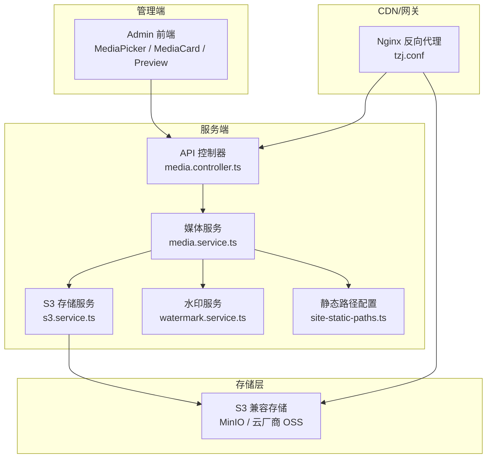
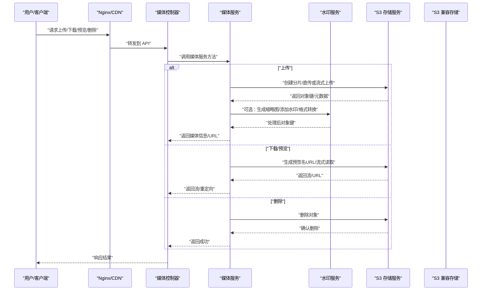
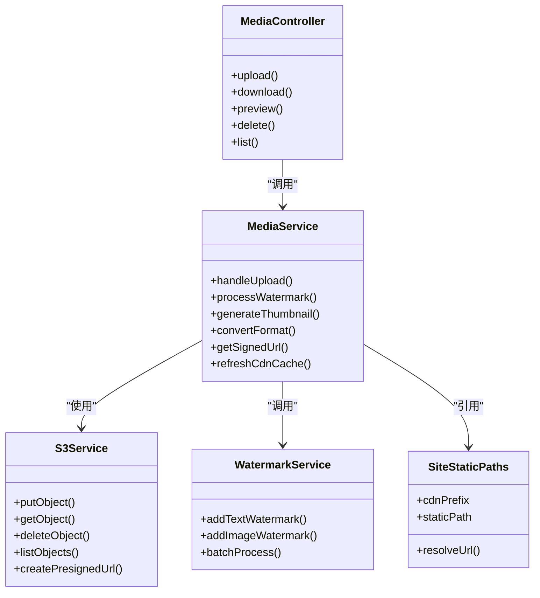

# 媒体资源管理

<cite>
**本文引用的文件**   
- [apps/api/src/media/media.controller.ts](file://apps/api/src/media/media.controller.ts)
- [apps/api/src/media/media.service.ts](file://apps/api/src/media/media.service.ts)
- [apps/api/src/media/media.module.ts](file://apps/api/src/media/media.module.ts)
- [apps/api/src/media/dto/media.dto.ts](file://apps/api/src/media/dto/media.dto.ts)
- [apps/api/src/media/watermark.service.ts](file://apps/api/src/media/watermark.service.ts)
- [apps/api/src/media/site-static-paths.ts](file://apps/api/src/media/site-static-paths.ts)
- [apps/api/src/storage/s3.service.ts](file://apps/api/src/storage/s3.service.ts)
- [apps/api/src/storage/storage.controller.ts](file://apps/api/src/storage/storage.controller.ts)
- [apps/api/src/storage/storage.module.ts](file://apps/api/src/storage/storage.module.ts)
- [apps/admin/src/features/media.ts](file://apps/admin/src/features/media.ts)
- [apps/admin/src/components/crud/MediaPicker.tsx](file://apps/admin/src/components/crud/MediaPicker.tsx)
- [apps/admin/src/components/media/MediaCard.tsx](file://apps/admin/src/components/media/MediaCard.tsx)
- [apps/admin/src/components/media/MediaPreviewDialog.tsx](file://apps/admin/src/components/media/MediaPreviewDialog.tsx)
- [apps/admin/src/lib/media-url.ts](file://apps/admin/src/lib/media-url.ts)
- [apps/web/src/lib/media-url.ts](file://apps/web/src/lib/media-url.ts)
- [apps/web/src/lib/oss-image-loader.ts](file://apps/web/src/lib/oss-image-loader.ts)
- [apps/web/src/components/MediaImage.tsx](file://apps/web/src/components/MediaImage.tsx)
- [apps/web/src/components/LazyMediaVideo.tsx](file://apps/web/src/components/LazyMediaVideo.tsx)
- [infra/docker/minio/cors.xml](file://infra/docker/minio/cors.xml)
- [infra/docker/nginx/tzj.conf](file://infra/docker/nginx/tzj.conf)
- [apps/api/scripts/restore-media-to-minio.mjs](file://apps/api/scripts/restore-media-to-minio.mjs)
</cite>

## 目录
1. [简介](#简介)
2. [项目结构](#项目结构)
3. [核心组件](#核心组件)
4. [架构总览](#架构总览)
5. [详细组件分析](#详细组件分析)
6. [依赖关系分析](#依赖关系分析)
7. [性能与成本优化](#性能与成本优化)
8. [故障排查指南](#故障排查指南)
9. [结论](#结论)
10. [附录](#附录)

## 简介
本文件系统性地梳理并文档化“媒体资源管理系统”，该系统基于 S3 兼容对象存储，提供统一的文件上传、下载、预览与删除能力；同时涵盖图片处理（缩略图、水印、格式转换）、CDN 集成、缓存策略、带宽优化与成本控制；并提供权限控制、安全扫描、病毒检测与备份恢复等关键能力。目标是为企业级内容生产与分发提供统一、高效、安全的媒体资源管理与分发解决方案。

## 项目结构
系统采用前后端分离的多应用架构：
- 后端 API（NestJS）：封装媒体服务、S3 存储、水印处理、静态路径配置等能力，对外暴露 REST API。
- 管理前端（Next.js Admin）：提供媒体选择器、卡片展示、预览弹窗、URL 构建工具等。
- 业务前端（Next.js Web）：提供图片懒加载、视频懒播放、OSS 图片处理器集成等。
- 基础设施（Docker）：MinIO（S3 兼容）、Nginx（反向代理与缓存）、Postgres、Redis 等。

图表来源
- [apps/api/src/media/media.controller.ts](file://apps/api/src/media/media.controller.ts)
- [apps/api/src/media/media.service.ts](file://apps/api/src/media/media.service.ts)
- [apps/api/src/storage/s3.service.ts](file://apps/api/src/storage/s3.service.ts)
- [apps/api/src/media/watermark.service.ts](file://apps/api/src/media/watermark.service.ts)
- [apps/api/src/media/site-static-paths.ts](file://apps/api/src/media/site-static-paths.ts)
- [infra/docker/nginx/tzj.conf](file://infra/docker/nginx/tzj.conf)

章节来源
- [apps/api/src/media/media.module.ts](file://apps/api/src/media/media.module.ts)
- [apps/api/src/storage/storage.module.ts](file://apps/api/src/storage/storage.module.ts)

## 核心组件
- 媒体控制器（media.controller.ts）：定义上传、下载、预览、删除等接口路由，负责参数校验与响应封装。
- 媒体服务（media.service.ts）：编排上传、分片、断点续传、元数据记录、访问控制、CDN 链接生成、缩略图/水印/转码流程。
- S3 存储服务（s3.service.ts）：封装 S3 兼容 SDK 的上传、下载、拷贝、删除、预签名 URL、列表等操作。
- 水印服务（watermark.service.ts）：提供图片水印合成、位置与透明度控制、批量处理。
- 静态路径（site-static-paths.ts）：集中管理站点静态资源路径与 CDN 前缀，便于统一替换与灰度发布。
- 管理端媒体能力：
  - features/media.ts：媒体相关的前端 API 调用封装。
  - components/crud/MediaPicker.tsx：媒体选择器，支持搜索、多选、预览。
  - components/media/MediaCard.tsx：媒体卡片展示，包含类型图标、尺寸、操作按钮。
  - components/media/MediaPreviewDialog.tsx：媒体预览弹窗，支持图片/视频预览与下载。
  - lib/media-url.ts：媒体 URL 构建与域名切换逻辑。
- 业务端媒体能力：
  - lib/media-url.ts：Web 端媒体 URL 构建与 CDN 域名解析。
  - lib/oss-image-loader.ts：对接云厂商图片处理（如阿里云 OSS），实现按需裁剪、压缩、格式转换。
  - components/MediaImage.tsx：图片懒加载与错误降级。
  - components/LazyMediaVideo.tsx：视频懒加载与播放器初始化。

章节来源
- [apps/api/src/media/media.controller.ts](file://apps/api/src/media/media.controller.ts)
- [apps/api/src/media/media.service.ts](file://apps/api/src/media/media.service.ts)
- [apps/api/src/storage/s3.service.ts](file://apps/api/src/storage/s3.service.ts)
- [apps/api/src/media/watermark.service.ts](file://apps/api/src/media/watermark.service.ts)
- [apps/api/src/media/site-static-paths.ts](file://apps/api/src/media/site-static-paths.ts)
- [apps/admin/src/features/media.ts](file://apps/admin/src/features/media.ts)
- [apps/admin/src/components/crud/MediaPicker.tsx](file://apps/admin/src/components/crud/MediaPicker.tsx)
- [apps/admin/src/components/media/MediaCard.tsx](file://apps/admin/src/components/media/MediaCard.tsx)
- [apps/admin/src/components/media/MediaPreviewDialog.tsx](file://apps/admin/src/components/media/MediaPreviewDialog.tsx)
- [apps/admin/src/lib/media-url.ts](file://apps/admin/src/lib/media-url.ts)
- [apps/web/src/lib/media-url.ts](file://apps/web/src/lib/media-url.ts)
- [apps/web/src/lib/oss-image-loader.ts](file://apps/web/src/lib/oss-image-loader.ts)
- [apps/web/src/components/MediaImage.tsx](file://apps/web/src/components/MediaImage.tsx)
- [apps/web/src/components/LazyMediaVideo.tsx](file://apps/web/src/components/LazyMediaVideo.tsx)

## 架构总览
媒体资源管理系统的整体架构围绕“控制器-服务-存储”三层展开，结合 CDN 与图片处理服务，形成端到端的媒体生命周期管理能力。

图表来源
- [apps/api/src/media/media.controller.ts](file://apps/api/src/media/media.controller.ts)
- [apps/api/src/media/media.service.ts](file://apps/api/src/media/media.service.ts)
- [apps/api/src/storage/s3.service.ts](file://apps/api/src/storage/s3.service.ts)
- [apps/api/src/media/watermark.service.ts](file://apps/api/src/media/watermark.service.ts)
- [infra/docker/nginx/tzj.conf](file://infra/docker/nginx/tzj.conf)

## 详细组件分析

### 媒体控制器（media.controller.ts）
- 职责：定义媒体相关的 HTTP 路由，包括上传、下载、预览、删除、列表查询等；进行基础参数校验与鉴权拦截；统一响应格式。
- 关键点：
  - 上传接口支持分片与断点续传，返回任务 ID 以便前端轮询进度。
  - 下载/预览接口支持范围请求与 Content-Type 自动推断。
  - 删除接口支持软删除标记与审计日志。
  - 列表接口支持按标签、时间、大小、类型过滤与分页。

章节来源
- [apps/api/src/media/media.controller.ts](file://apps/api/src/media/media.controller.ts)

### 媒体服务（media.service.ts）
- 职责：编排媒体生命周期，协调 S3 存储、水印处理、元数据持久化、CDN 刷新与缓存失效。
- 关键点：
  - 上传流程：校验 MIME、大小限制、命名规范；分片合并；生成唯一对象键；写入元数据表。
  - 处理流水线：缩略图生成、水印叠加、格式转换（如 PNG→WebP/AVIF）。
  - 访问控制：基于角色/资源的权限校验，支持私有桶与临时预签名 URL。
  - CDN 集成：更新缓存预热、清理无效缓存、回源策略。
  - 安全扫描：接入第三方扫描服务（如病毒扫描、恶意文件检测），失败则阻断上传。

章节来源
- [apps/api/src/media/media.service.ts](file://apps/api/src/media/media.service.ts)

### S3 存储服务（s3.service.ts）
- 职责：封装 S3 兼容 SDK 的通用操作，屏蔽不同厂商差异。
- 关键点：
  - 上传：分片上传、断点续传、并发控制、重试机制。
  - 下载：流式下载、Range 支持、大文件分块读取。
  - 元数据：读写扩展属性（如作者、版权、标签）。
  - 预签名：生成带过期时间的访问 URL，支持 IP/UA 限制。
  - 列表与搜索：按前缀、标签、时间范围检索。

章节来源
- [apps/api/src/storage/s3.service.ts](file://apps/api/src/storage/s3.service.ts)

### 水印服务（watermark.service.ts）
- 职责：为图片添加水印，支持文本/图片水印、位置、透明度、缩放、旋转。
- 关键点：
  - 多格式输入输出（JPEG/PNG/WebP/AVIF）。
  - 异步队列处理，避免阻塞主流程。
  - 模板化配置，支持多场景（品牌水印、防盗链水印）。

章节来源
- [apps/api/src/media/watermark.service.ts](file://apps/api/src/media/watermark.service.ts)

### 静态路径与域名管理（site-static-paths.ts）
- 职责：集中管理站点静态资源路径与 CDN 前缀，便于环境切换与灰度发布。
- 关键点：
  - 环境变量驱动（开发/测试/生产）。
  - 支持多域名与 A/B 测试。
  - 与媒体 URL 构建模块联动。

章节来源
- [apps/api/src/media/site-static-paths.ts](file://apps/api/src/media/site-static-paths.ts)

### 管理端媒体能力
- features/media.ts：封装媒体 API 调用，提供上传、删除、预览、列表等方法。
- MediaPicker.tsx：媒体选择器，支持搜索、多选、拖拽上传、实时预览。
- MediaCard.tsx：媒体卡片，显示缩略图、文件名、大小、类型、操作按钮。
- MediaPreviewDialog.tsx：预览弹窗，支持图片放大、视频播放、下载与分享。
- media-url.ts：媒体 URL 构建，支持本地/CDN/HTTPS 切换。

章节来源
- [apps/admin/src/features/media.ts](file://apps/admin/src/features/media.ts)
- [apps/admin/src/components/crud/MediaPicker.tsx](file://apps/admin/src/components/crud/MediaPicker.tsx)
- [apps/admin/src/components/media/MediaCard.tsx](file://apps/admin/src/components/media/MediaCard.tsx)
- [apps/admin/src/components/media/MediaPreviewDialog.tsx](file://apps/admin/src/components/media/MediaPreviewDialog.tsx)
- [apps/admin/src/lib/media-url.ts](file://apps/admin/src/lib/media-url.ts)

### 业务端媒体能力
- media-url.ts：Web 端媒体 URL 构建，优先使用 CDN 域名，支持协议与路径重写。
- oss-image-loader.ts：对接云厂商图片处理（如阿里云 OSS），实现按需裁剪、压缩、格式转换。
- MediaImage.tsx：图片懒加载，错误降级与占位图。
- LazyMediaVideo.tsx：视频懒加载，播放器按需初始化，节省带宽。

章节来源
- [apps/web/src/lib/media-url.ts](file://apps/web/src/lib/media-url.ts)
- [apps/web/src/lib/oss-image-loader.ts](file://apps/web/src/lib/oss-image-loader.ts)
- [apps/web/src/components/MediaImage.tsx](file://apps/web/src/components/MediaImage.tsx)
- [apps/web/src/components/LazyMediaVideo.tsx](file://apps/web/src/components/LazyMediaVideo.tsx)

### 基础设施与集成
- MinIO CORS 配置（cors.xml）：允许跨域请求，支持前端直传与预览。
- Nginx 配置（tzj.conf）：反向代理、缓存策略、Gzip/Brotli 压缩、限流与防盗链。
- 数据恢复脚本（restore-media-to-minio.mjs）：从备份恢复媒体文件至 MinIO。

章节来源
- [infra/docker/minio/cors.xml](file://infra/docker/minio/cors.xml)
- [infra/docker/nginx/tzj.conf](file://infra/docker/nginx/tzj.conf)
- [apps/api/scripts/restore-media-to-minio.mjs](file://apps/api/scripts/restore-media-to-minio.mjs)

## 依赖关系分析
媒体模块与存储模块通过 NestJS 依赖注入组织，控制器依赖服务，服务依赖存储与水印处理。

图表来源
- [apps/api/src/media/media.controller.ts](file://apps/api/src/media/media.controller.ts)
- [apps/api/src/media/media.service.ts](file://apps/api/src/media/media.service.ts)
- [apps/api/src/storage/s3.service.ts](file://apps/api/src/storage/s3.service.ts)
- [apps/api/src/media/watermark.service.ts](file://apps/api/src/media/watermark.service.ts)
- [apps/api/src/media/site-static-paths.ts](file://apps/api/src/media/site-static-paths.ts)

章节来源
- [apps/api/src/media/media.module.ts](file://apps/api/src/media/media.module.ts)
- [apps/api/src/storage/storage.module.ts](file://apps/api/src/storage/storage.module.ts)

## 性能与成本优化
- 图片处理与格式转换：
  - 使用 WebP/AVIF 替代传统格式，减少体积 30%-50%。
  - 按需裁剪与缩放，避免传输大图。
  - 利用云厂商图片处理服务（如阿里云 OSS）降低服务器负载。
- CDN 集成与缓存策略：
  - 静态资源走 CDN，设置合理 Cache-Control 与 ETag。
  - 动态内容短缓存，热点内容长缓存。
  - 预热热门资源，减少回源延迟。
- 带宽优化：
  - 启用 Gzip/Brotli 压缩。
  - 视频懒加载与分片播放（HLS/DASH）。
  - 图片懒加载与占位图。
- 成本控制：
  - 生命周期规则：自动归档冷数据、删除过期文件。
  - 分片上传与断点续传，提升成功率，减少重复传输。
  - 监控与告警：异常流量、高带宽、高频删除。

[本节为通用指导，不直接分析具体文件]

## 故障排查指南
- 上传失败：
  - 检查 CORS 配置是否允许前端直传。
  - 验证文件大小与 MIME 类型限制。
  - 查看分片上传状态与重试次数。
- 下载/预览异常：
  - 确认预签名 URL 是否过期。
  - 检查 Nginx 缓存与回源配置。
  - 验证 Content-Type 是否正确。
- 水印/缩略图生成失败：
  - 检查图像处理库版本与依赖。
  - 查看异步队列消费状态。
- 权限问题：
  - 确认用户角色与资源权限。
  - 检查私有桶访问策略。
- 数据恢复：
  - 使用 restore-media-to-minio.mjs 脚本从备份恢复。
  - 校验对象完整性与元数据一致性。

章节来源
- [infra/docker/minio/cors.xml](file://infra/docker/minio/cors.xml)
- [infra/docker/nginx/tzj.conf](file://infra/docker/nginx/tzj.conf)
- [apps/api/scripts/restore-media-to-minio.mjs](file://apps/api/scripts/restore-media-to-minio.mjs)

## 结论
本媒体资源管理系统以 S3 兼容存储为核心，结合水印处理、CDN 集成与前端懒加载，构建了完整的媒体生命周期管理能力。通过模块化设计、清晰的依赖关系与完善的运维脚本，系统具备高可用、可扩展与易维护的特性。建议在生产环境中完善安全扫描、病毒检测与备份恢复流程，持续优化缓存策略与成本控制，以提升用户体验与运营效率。

[本节为总结性内容，不直接分析具体文件]

## 附录
- API 参考：媒体控制器提供的接口定义与参数说明。
- 配置项：环境变量、CDN 域名、存储桶策略、水印模板等。
- 最佳实践：命名规范、权限模型、监控指标、灾难恢复演练。

[本节为补充信息，不直接分析具体文件]