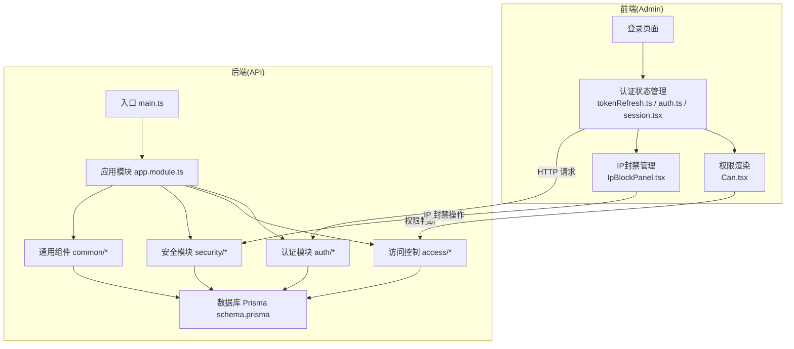
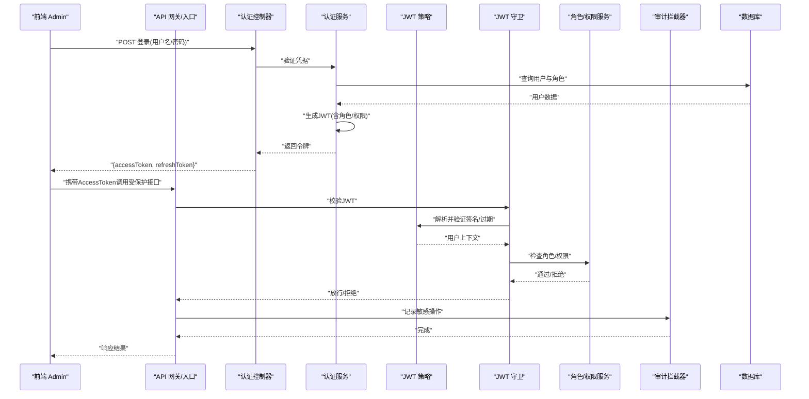
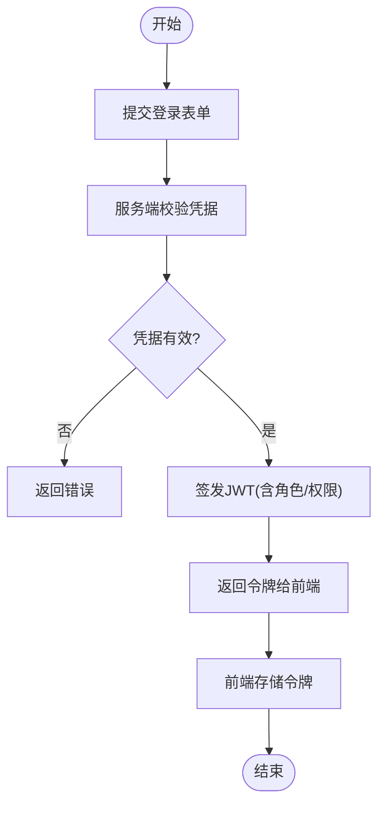
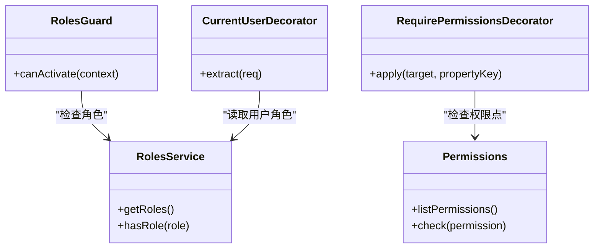
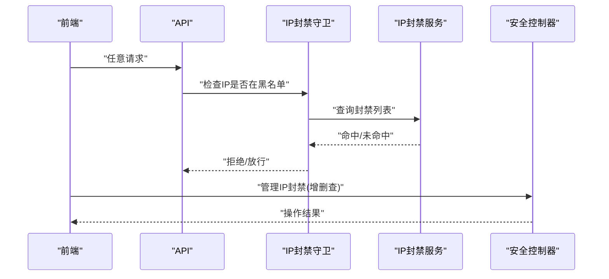
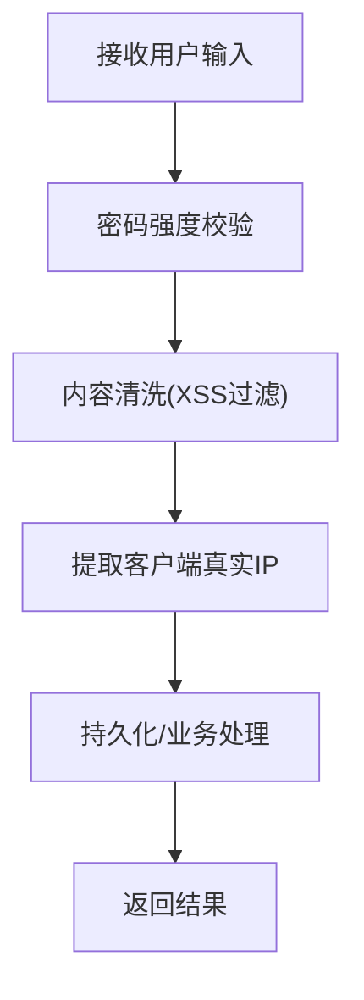
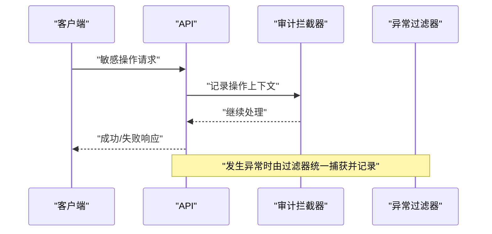
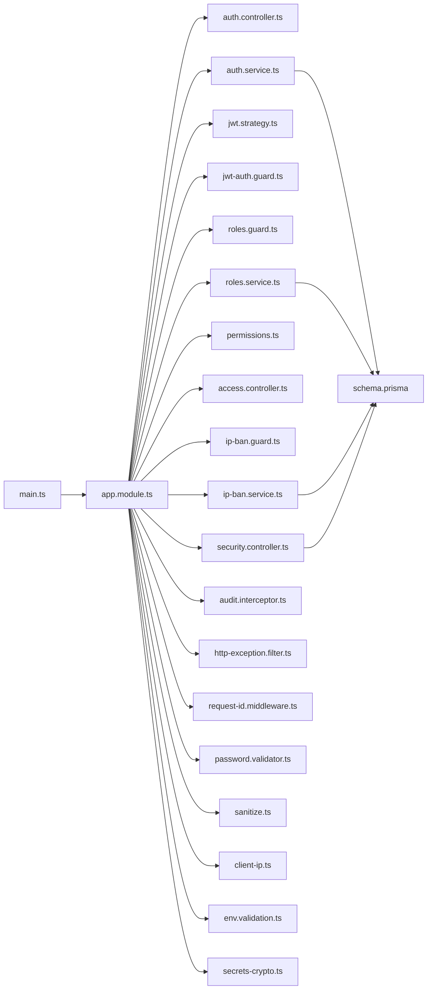

# 安全与认证

<cite>
**本文引用的文件**   
- [auth.controller.ts](file://apps/api/src/auth/auth.controller.ts)
- [auth.service.ts](file://apps/api/src/auth/auth.service.ts)
- [jwt.strategy.ts](file://apps/api/src/auth/strategies/jwt.strategy.ts)
- [jwt-auth.guard.ts](file://apps/api/src/auth/guards/jwt-auth.guard.ts)
- [roles.guard.ts](file://apps/api/src/auth/guards/roles.guard.ts)
- [current-user.decorator.ts](file://apps/api/src/auth/decorators/current-user.decorator.ts)
- [require-permissions.decorator.ts](file://apps/api/src/auth/decorators/require-permissions.decorator.ts)
- [roles.decorator.ts](file://apps/api/src/auth/decorators/roles.decorator.ts)
- [permissions.ts](file://apps/api/src/access/permissions.ts)
- [roles.service.ts](file://apps/api/src/access/roles.service.ts)
- [access.controller.ts](file://apps/api/src/access/access.controller.ts)
- [ip-ban.guard.ts](file://apps/api/src/security/ip-ban.guard.ts)
- [ip-ban.service.ts](file://apps/api/src/security/ip-ban.service.ts)
- [security.controller.ts](file://apps/api/src/security/security.controller.ts)
- [create-blocked-ip.dto.ts](file://apps/api/src/security/dto/create-blocked-ip.dto.ts)
- [audit.interceptor.ts](file://apps/api/src/common/interceptors/audit.interceptor.ts)
- [http-exception.filter.ts](file://apps/api/src/common/filters/http-exception.filter.ts)
- [request-id.middleware.ts](file://apps/api/src/common/middleware/request-id.middleware.ts)
- [password.validator.ts](file://apps/api/src/common/validators/password.validator.ts)
- [sanitize.ts](file://apps/api/src/common/utils/sanitize.ts)
- [client-ip.ts](file://apps/api/src/common/utils/client-ip.ts)
- [env.validation.ts](file://apps/api/src/config/env.validation.ts)
- [secrets-crypto.ts](file://apps/api/src/common/crypto/secrets-crypto.ts)
- [app.module.ts](file://apps/api/src/app.module.ts)
- [main.ts](file://apps/api/src/main.ts)
- [schema.prisma](file://apps/api/prisma/schema.prisma)
- [tokenRefresh.ts](file://apps/admin/src/lib/tokenRefresh.ts)
- [auth.ts](file://apps/admin/src/lib/auth.ts)
- [session.tsx](file://apps/admin/src/components/session.tsx)
- [IpBlockPanel.tsx](file://apps/admin/src/components/security/IpBlockPanel.tsx)
- [Can.tsx](file://apps/admin/src/components/Can.tsx)
- [audit-labels.ts](file://apps/admin/src/features/audit-labels.ts)
- [audit.ts](file://apps/admin/src/features/audit.ts)
- [security-ip-block.ts](file://apps/admin/src/features/security-ip-block.ts)
</cite>

## 目录
1. [简介](#简介)
2. [项目结构](#项目结构)
3. [核心组件](#核心组件)
4. [架构总览](#架构总览)
5. [详细组件分析](#详细组件分析)
6. [依赖关系分析](#依赖关系分析)
7. [性能考量](#性能考量)
8. [故障排查指南](#故障排查指南)
9. [结论](#结论)
10. [附录](#附录)

## 简介
本文件为企业级网站重构项目的“安全与认证”专题文档，围绕基于JWT的多层次安全防护机制展开，覆盖用户认证流程、令牌管理、会话控制、密码加密、角色权限模型、细粒度授权、API访问控制、IP黑名单、CSRF/XSS/SQL注入防护、敏感操作审计、安全配置、漏洞扫描、日志审计与应急响应等主题。目标是帮助开发者与安全运维人员快速理解并落地一套完整的安全保障体系。

## 项目结构
本项目采用前后端分离架构：
- 后端（NestJS）提供REST API，内置鉴权守卫、策略、拦截器、过滤器、中间件、校验器与工具库，集中实现认证、授权、审计、IP封禁、异常处理等能力。
- 前端（Next.js Admin）负责控制台界面，包含登录、令牌刷新、权限展示、IP封禁管理等交互。

图表来源
- [main.ts](file://apps/api/src/main.ts)
- [app.module.ts](file://apps/api/src/app.module.ts)
- [auth.controller.ts](file://apps/api/src/auth/auth.controller.ts)
- [auth.service.ts](file://apps/api/src/auth/auth.service.ts)
- [jwt.strategy.ts](file://apps/api/src/auth/strategies/jwt.strategy.ts)
- [jwt-auth.guard.ts](file://apps/api/src/auth/guards/jwt-auth.guard.ts)
- [roles.guard.ts](file://apps/api/src/auth/guards/roles.guard.ts)
- [permissions.ts](file://apps/api/src/access/permissions.ts)
- [roles.service.ts](file://apps/api/src/access/roles.service.ts)
- [access.controller.ts](file://apps/api/src/access/access.controller.ts)
- [ip-ban.guard.ts](file://apps/api/src/security/ip-ban.guard.ts)
- [ip-ban.service.ts](file://apps/api/src/security/ip-ban.service.ts)
- [security.controller.ts](file://apps/api/src/security/security.controller.ts)
- [create-blocked-ip.dto.ts](file://apps/api/src/security/dto/create-blocked-ip.dto.ts)
- [audit.interceptor.ts](file://apps/api/src/common/interceptors/audit.interceptor.ts)
- [http-exception.filter.ts](file://apps/api/src/common/filters/http-exception.filter.ts)
- [request-id.middleware.ts](file://apps/api/src/common/middleware/request-id.middleware.ts)
- [password.validator.ts](file://apps/api/src/common/validators/password.validator.ts)
- [sanitize.ts](file://apps/api/src/common/utils/sanitize.ts)
- [client-ip.ts](file://apps/api/src/common/utils/client-ip.ts)
- [env.validation.ts](file://apps/api/src/config/env.validation.ts)
- [secrets-crypto.ts](file://apps/api/src/common/crypto/secrets-crypto.ts)
- [schema.prisma](file://apps/api/prisma/schema.prisma)
- [tokenRefresh.ts](file://apps/admin/src/lib/tokenRefresh.ts)
- [auth.ts](file://apps/admin/src/lib/auth.ts)
- [session.tsx](file://apps/admin/src/components/session.tsx)
- [IpBlockPanel.tsx](file://apps/admin/src/components/security/IpBlockPanel.tsx)
- [Can.tsx](file://apps/admin/src/components/Can.tsx)
- [audit-labels.ts](file://apps/admin/src/features/audit-labels.ts)
- [audit.ts](file://apps/admin/src/features/audit.ts)
- [security-ip-block.ts](file://apps/admin/src/features/security-ip-block.ts)

章节来源
- [main.ts](file://apps/api/src/main.ts)
- [app.module.ts](file://apps/api/src/app.module.ts)

## 核心组件
本节聚焦认证与授权的核心实现，包括JWT策略、守卫、装饰器、权限与角色服务、IP封禁、审计与异常处理等。

- 认证控制器与服务：负责登录、登出、令牌签发与验证、用户信息获取等。
- JWT策略与守卫：解析并校验JWT，将用户上下文注入到请求中。
- 角色与权限：基于角色的访问控制（RBAC）与细粒度权限点。
- IP封禁：全局或接口级别的IP黑名单拦截。
- 审计与异常：记录敏感操作、统一异常输出、请求追踪ID。
- 输入校验与清洗：密码强度校验、XSS清洗、客户端IP提取。
- 环境与安全配置：环境变量校验、密钥管理。

章节来源
- [auth.controller.ts](file://apps/api/src/auth/auth.controller.ts)
- [auth.service.ts](file://apps/api/src/auth/auth.service.ts)
- [jwt.strategy.ts](file://apps/api/src/auth/strategies/jwt.strategy.ts)
- [jwt-auth.guard.ts](file://apps/api/src/auth/guards/jwt-auth.guard.ts)
- [roles.guard.ts](file://apps/api/src/auth/guards/roles.guard.ts)
- [permissions.ts](file://apps/api/src/access/permissions.ts)
- [roles.service.ts](file://apps/api/src/access/roles.service.ts)
- [access.controller.ts](file://apps/api/src/access/access.controller.ts)
- [ip-ban.guard.ts](file://apps/api/src/security/ip-ban.guard.ts)
- [ip-ban.service.ts](file://apps/api/src/security/ip-ban.service.ts)
- [security.controller.ts](file://apps/api/src/security/security.controller.ts)
- [create-blocked-ip.dto.ts](file://apps/api/src/security/dto/create-blocked-ip.dto.ts)
- [audit.interceptor.ts](file://apps/api/src/common/interceptors/audit.interceptor.ts)
- [http-exception.filter.ts](file://apps/api/src/common/filters/http-exception.filter.ts)
- [request-id.middleware.ts](file://apps/api/src/common/middleware/request-id.middleware.ts)
- [password.validator.ts](file://apps/api/src/common/validators/password.validator.ts)
- [sanitize.ts](file://apps/api/src/common/utils/sanitize.ts)
- [client-ip.ts](file://apps/api/src/common/utils/client-ip.ts)
- [env.validation.ts](file://apps/api/src/config/env.validation.ts)
- [secrets-crypto.ts](file://apps/api/src/common/crypto/secrets-crypto.ts)

## 架构总览
下图展示了从前端登录到后端鉴权、授权、审计的端到端流程。

图表来源
- [auth.controller.ts](file://apps/api/src/auth/auth.controller.ts)
- [auth.service.ts](file://apps/api/src/auth/auth.service.ts)
- [jwt.strategy.ts](file://apps/api/src/auth/strategies/jwt.strategy.ts)
- [jwt-auth.guard.ts](file://apps/api/src/auth/guards/jwt-auth.guard.ts)
- [roles.guard.ts](file://apps/api/src/auth/guards/roles.guard.ts)
- [permissions.ts](file://apps/api/src/access/permissions.ts)
- [roles.service.ts](file://apps/api/src/access/roles.service.ts)
- [audit.interceptor.ts](file://apps/api/src/common/interceptors/audit.interceptor.ts)
- [schema.prisma](file://apps/api/prisma/schema.prisma)

## 详细组件分析

### 认证流程与JWT管理
- 登录与签发：认证控制器接收凭据，认证服务校验用户并签发JWT（可包含角色与权限声明）。
- 令牌校验：JWT守卫在请求进入时校验签名与有效期，策略负责解析载荷并注入用户上下文。
- 前端令牌管理：前端维护访问令牌与刷新令牌，支持自动刷新与失效处理。

图表来源
- [auth.controller.ts](file://apps/api/src/auth/auth.controller.ts)
- [auth.service.ts](file://apps/api/src/auth/auth.service.ts)
- [jwt.strategy.ts](file://apps/api/src/auth/strategies/jwt.strategy.ts)
- [jwt-auth.guard.ts](file://apps/api/src/auth/guards/jwt-auth.guard.ts)
- [tokenRefresh.ts](file://apps/admin/src/lib/tokenRefresh.ts)
- [auth.ts](file://apps/admin/src/lib/auth.ts)
- [session.tsx](file://apps/admin/src/components/session.tsx)

章节来源
- [auth.controller.ts](file://apps/api/src/auth/auth.controller.ts)
- [auth.service.ts](file://apps/api/src/auth/auth.service.ts)
- [jwt.strategy.ts](file://apps/api/src/auth/strategies/jwt.strategy.ts)
- [jwt-auth.guard.ts](file://apps/api/src/auth/guards/jwt-auth.guard.ts)
- [tokenRefresh.ts](file://apps/admin/src/lib/tokenRefresh.ts)
- [auth.ts](file://apps/admin/src/lib/auth.ts)
- [session.tsx](file://apps/admin/src/components/session.tsx)

### 角色权限模型与细粒度授权
- 角色与权限：通过角色服务与权限定义文件管理角色集合与权限点。
- 装饰器与守卫：使用角色装饰器与权限装饰器配合角色守卫进行接口级授权。
- 前端权限渲染：通过权限组件根据当前用户角色/权限动态渲染功能。

图表来源
- [roles.service.ts](file://apps/api/src/access/roles.service.ts)
- [permissions.ts](file://apps/api/src/access/permissions.ts)
- [roles.guard.ts](file://apps/api/src/auth/guards/roles.guard.ts)
- [require-permissions.decorator.ts](file://apps/api/src/auth/decorators/require-permissions.decorator.ts)
- [current-user.decorator.ts](file://apps/api/src/auth/decorators/current-user.decorator.ts)
- [access.controller.ts](file://apps/api/src/access/access.controller.ts)

章节来源
- [roles.service.ts](file://apps/api/src/access/roles.service.ts)
- [permissions.ts](file://apps/api/src/access/permissions.ts)
- [roles.guard.ts](file://apps/api/src/auth/guards/roles.guard.ts)
- [require-permissions.decorator.ts](file://apps/api/src/auth/decorators/require-permissions.decorator.ts)
- [current-user.decorator.ts](file://apps/api/src/auth/decorators/current-user.decorator.ts)
- [access.controller.ts](file://apps/api/src/access/access.controller.ts)
- [Can.tsx](file://apps/admin/src/components/Can.tsx)

### API访问控制与IP黑名单
- 全局IP封禁：通过IP封禁守卫在请求早期拦截黑名单IP。
- 控制器级IP限制：结合安全控制器与DTO对特定接口进行IP白/黑名单管理。
- 前端管理：提供IP封禁面板用于添加/删除被封IP。

图表来源
- [ip-ban.guard.ts](file://apps/api/src/security/ip-ban.guard.ts)
- [ip-ban.service.ts](file://apps/api/src/security/ip-ban.service.ts)
- [security.controller.ts](file://apps/api/src/security/security.controller.ts)
- [create-blocked-ip.dto.ts](file://apps/api/src/security/dto/create-blocked-ip.dto.ts)
- [IpBlockPanel.tsx](file://apps/admin/src/components/security/IpBlockPanel.tsx)
- [security-ip-block.ts](file://apps/admin/src/features/security-ip-block.ts)

章节来源
- [ip-ban.guard.ts](file://apps/api/src/security/ip-ban.guard.ts)
- [ip-ban.service.ts](file://apps/api/src/security/ip-ban.service.ts)
- [security.controller.ts](file://apps/api/src/security/security.controller.ts)
- [create-blocked-ip.dto.ts](file://apps/api/src/security/dto/create-blocked-ip.dto.ts)
- [IpBlockPanel.tsx](file://apps/admin/src/components/security/IpBlockPanel.tsx)
- [security-ip-block.ts](file://apps/admin/src/features/security-ip-block.ts)

### 密码加密与输入校验
- 密码强度校验：通过自定义校验器确保密码复杂度。
- 敏感数据处理：在服务层对输入进行清洗，避免XSS注入。
- 客户端IP提取：准确识别真实客户端IP，防止伪造。

图表来源
- [password.validator.ts](file://apps/api/src/common/validators/password.validator.ts)
- [sanitize.ts](file://apps/api/src/common/utils/sanitize.ts)
- [client-ip.ts](file://apps/api/src/common/utils/client-ip.ts)

章节来源
- [password.validator.ts](file://apps/api/src/common/validators/password.validator.ts)
- [sanitize.ts](file://apps/api/src/common/utils/sanitize.ts)
- [client-ip.ts](file://apps/api/src/common/utils/client-ip.ts)

### CSRF、XSS与SQL注入防护
- XSS防护：在服务层对富文本与用户输入进行清洗；前端渲染遵循安全规范。
- SQL注入防护：使用ORM参数化查询，避免拼接SQL。
- CSRF防护：对于跨站请求场景，建议启用SameSite Cookie策略与CSRF Token校验（如需要）。

章节来源
- [sanitize.ts](file://apps/api/src/common/utils/sanitize.ts)
- [schema.prisma](file://apps/api/prisma/schema.prisma)

### 敏感操作审计与日志
- 审计拦截器：对敏感接口进行入参、出参、操作人、时间戳等记录。
- 统一异常过滤器：标准化错误输出，便于安全事件追踪。
- 请求追踪ID：为每个请求分配唯一ID，贯穿日志链路。

图表来源
- [audit.interceptor.ts](file://apps/api/src/common/interceptors/audit.interceptor.ts)
- [http-exception.filter.ts](file://apps/api/src/common/filters/http-exception.filter.ts)
- [request-id.middleware.ts](file://apps/api/src/common/middleware/request-id.middleware.ts)
- [audit-labels.ts](file://apps/admin/src/features/audit-labels.ts)
- [audit.ts](file://apps/admin/src/features/audit.ts)

章节来源
- [audit.interceptor.ts](file://apps/api/src/common/interceptors/audit.interceptor.ts)
- [http-exception.filter.ts](file://apps/api/src/common/filters/http-exception.filter.ts)
- [request-id.middleware.ts](file://apps/api/src/common/middleware/request-id.middleware.ts)
- [audit-labels.ts](file://apps/admin/src/features/audit-labels.ts)
- [audit.ts](file://apps/admin/src/features/audit.ts)

### 安全配置与环境变量
- 环境变量校验：启动时校验必要的安全相关配置项。
- 密钥管理：集中管理JWT密钥、第三方服务密钥等敏感信息。

章节来源
- [env.validation.ts](file://apps/api/src/config/env.validation.ts)
- [secrets-crypto.ts](file://apps/api/src/common/crypto/secrets-crypto.ts)

## 依赖关系分析
下图展示认证、授权、安全模块之间的依赖关系。

图表来源
- [main.ts](file://apps/api/src/main.ts)
- [app.module.ts](file://apps/api/src/app.module.ts)
- [auth.controller.ts](file://apps/api/src/auth/auth.controller.ts)
- [auth.service.ts](file://apps/api/src/auth/auth.service.ts)
- [jwt.strategy.ts](file://apps/api/src/auth/strategies/jwt.strategy.ts)
- [jwt-auth.guard.ts](file://apps/api/src/auth/guards/jwt-auth.guard.ts)
- [roles.guard.ts](file://apps/api/src/auth/guards/roles.guard.ts)
- [roles.service.ts](file://apps/api/src/access/roles.service.ts)
- [permissions.ts](file://apps/api/src/access/permissions.ts)
- [access.controller.ts](file://apps/api/src/access/access.controller.ts)
- [ip-ban.guard.ts](file://apps/api/src/security/ip-ban.guard.ts)
- [ip-ban.service.ts](file://apps/api/src/security/ip-ban.service.ts)
- [security.controller.ts](file://apps/api/src/security/security.controller.ts)
- [audit.interceptor.ts](file://apps/api/src/common/interceptors/audit.interceptor.ts)
- [http-exception.filter.ts](file://apps/api/src/common/filters/http-exception.filter.ts)
- [request-id.middleware.ts](file://apps/api/src/common/middleware/request-id.middleware.ts)
- [password.validator.ts](file://apps/api/src/common/validators/password.validator.ts)
- [sanitize.ts](file://apps/api/src/common/utils/sanitize.ts)
- [client-ip.ts](file://apps/api/src/common/utils/client-ip.ts)
- [env.validation.ts](file://apps/api/src/config/env.validation.ts)
- [secrets-crypto.ts](file://apps/api/src/common/crypto/secrets-crypto.ts)
- [schema.prisma](file://apps/api/prisma/schema.prisma)

章节来源
- [app.module.ts](file://apps/api/src/app.module.ts)
- [schema.prisma](file://apps/api/prisma/schema.prisma)

## 性能考量
- JWT校验开销：尽量将角色与权限信息放入JWT以减少额外查询；必要时结合缓存。
- IP封禁检查：黑名单查询应走内存缓存或高性能KV存储，降低数据库压力。
- 审计写入：异步落盘或批量写入，避免阻塞主流程。
- 输入清洗：对大体积富文本进行按需清洗，避免全量处理。

[本节为通用指导，不直接分析具体文件]

## 故障排查指南
- 登录失败：检查凭据校验逻辑、用户是否存在、密码哈希是否正确。
- 令牌无效：确认JWT签名、过期时间、前端是否携带正确头。
- 权限不足：核对角色与权限点映射、装饰器与守卫是否正确应用。
- IP被误封：查看IP封禁列表与来源IP提取逻辑。
- 审计缺失：确认审计拦截器是否注册、敏感接口是否标注。
- 异常信息：查看统一异常过滤器输出与请求追踪ID。

章节来源
- [auth.service.ts](file://apps/api/src/auth/auth.service.ts)
- [jwt.strategy.ts](file://apps/api/src/auth/strategies/jwt.strategy.ts)
- [jwt-auth.guard.ts](file://apps/api/src/auth/guards/jwt-auth.guard.ts)
- [roles.guard.ts](file://apps/api/src/auth/guards/roles.guard.ts)
- [ip-ban.guard.ts](file://apps/api/src/security/ip-ban.guard.ts)
- [ip-ban.service.ts](file://apps/api/src/security/ip-ban.service.ts)
- [audit.interceptor.ts](file://apps/api/src/common/interceptors/audit.interceptor.ts)
- [http-exception.filter.ts](file://apps/api/src/common/filters/http-exception.filter.ts)
- [request-id.middleware.ts](file://apps/api/src/common/middleware/request-id.middleware.ts)

## 结论
本项目通过JWT为核心的认证机制，结合角色权限模型、IP黑名单、审计与异常处理，构建了较为完善的企业级安全体系。建议在后续迭代中持续强化以下方面：
- 引入更细粒度的资源级授权（如文档/媒体级权限）。
- 加强前端安全（CSP、Cookie SameSite、HTTPS强制）。
- 自动化漏洞扫描与依赖更新。
- 完善应急响应预案与演练。

[本节为总结性内容，不直接分析具体文件]

## 附录
- 安全配置清单：环境变量、密钥轮换、最小权限原则。
- 漏洞扫描建议：依赖扫描、代码静态分析、运行时防护。
- 日志审计规范：字段标准、留存周期、脱敏策略。
- 应急响应流程：告警、隔离、取证、恢复、复盘。

[本节为补充说明，不直接分析具体文件]