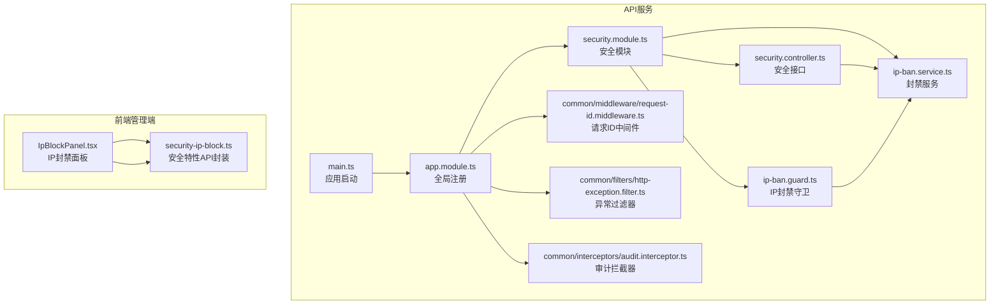
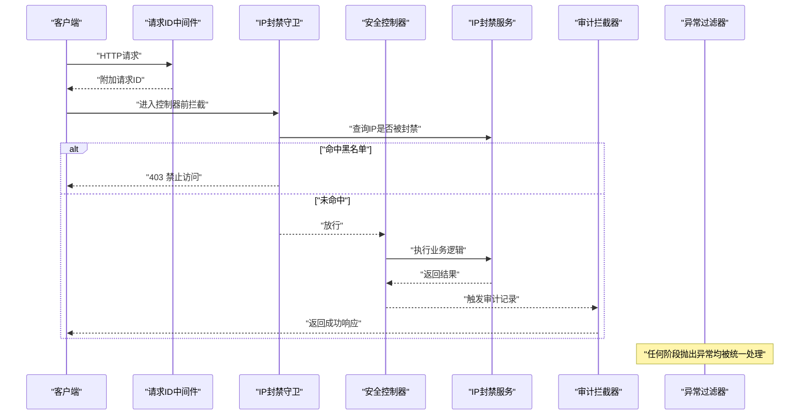
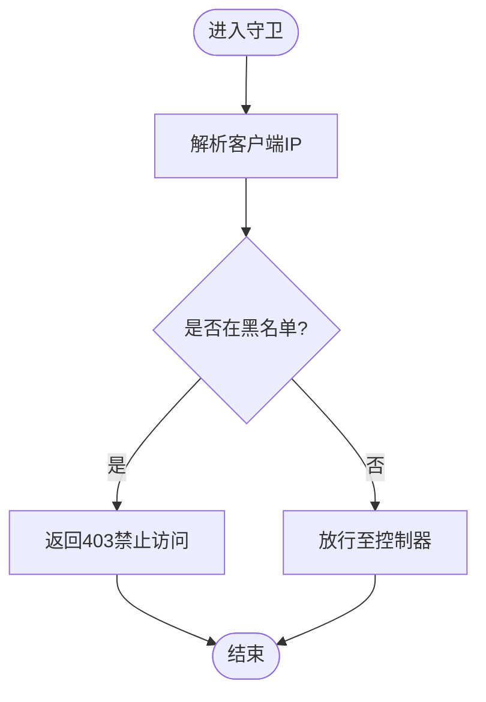
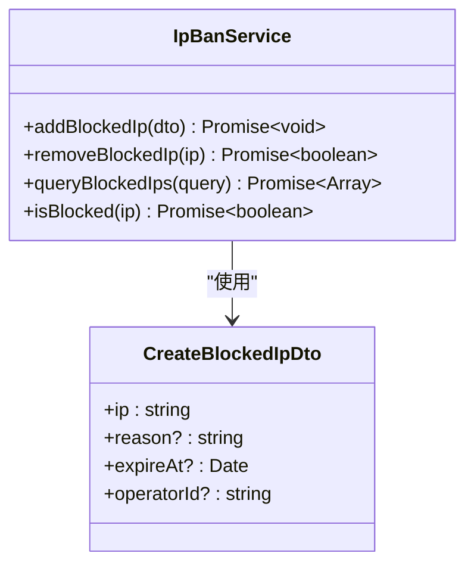
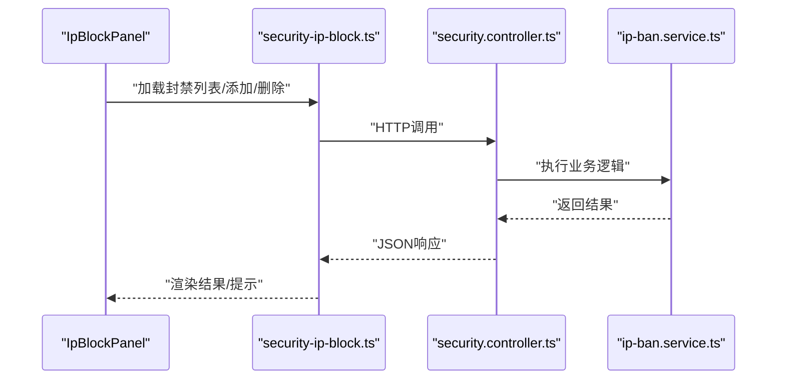
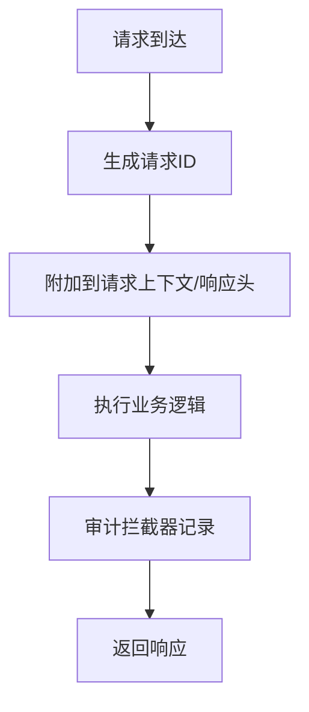
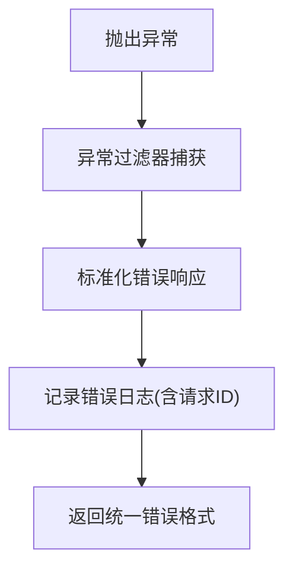
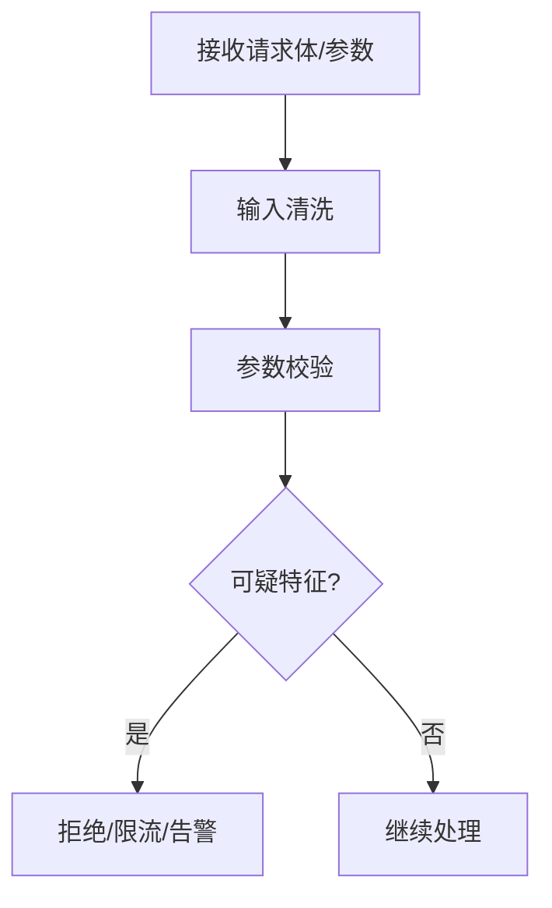
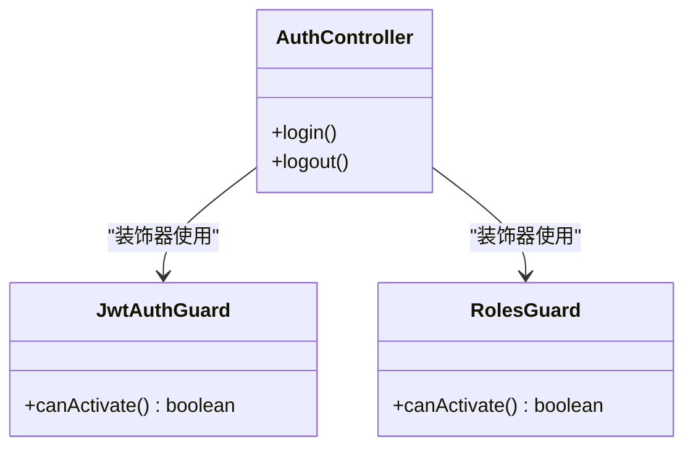
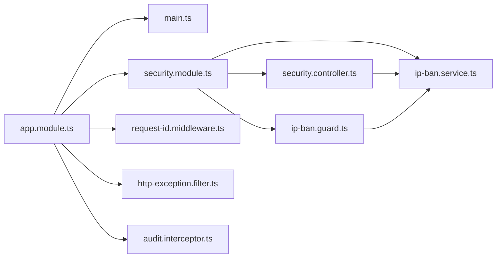

# 安全防护机制

<cite>
**本文引用的文件**   
- [security.controller.ts](file://apps/api/src/security/security.controller.ts)
- [ip-ban.guard.ts](file://apps/api/src/security/ip-ban.guard.ts)
- [ip-ban.service.ts](file://apps/api/src/security/ip-ban.service.ts)
- [security.module.ts](file://apps/api/src/security/security.module.ts)
- [create-blocked-ip.dto.ts](file://apps/api/src/security/dto/create-blocked-ip.dto.ts)
- [http-exception.filter.ts](file://apps/api/src/common/filters/http-exception.filter.ts)
- [request-id.middleware.ts](file://apps/api/src/common/middleware/request-id.middleware.ts)
- [audit.interceptor.ts](file://apps/api/src/common/interceptors/audit.interceptor.ts)
- [sanitize.ts](file://apps/api/src/common/utils/sanitize.ts)
- [client-ip.ts](file://apps/api/src/analytics/utils/client-ip.ts)
- [client-ip.ts](file://apps/api/src/common/utils/client-ip.ts)
- [auth.controller.ts](file://apps/api/src/auth/auth.controller.ts)
- [jwt-auth.guard.ts](file://apps/api/src/auth/guards/jwt-auth.guard.ts)
- [roles.guard.ts](file://apps/api/src/auth/guards/roles.guard.ts)
- [app.module.ts](file://apps/api/src/app.module.ts)
- [main.ts](file://apps/api/src/main.ts)
- [IpBlockPanel.tsx](file://apps/admin/src/components/security/IpBlockPanel.tsx)
- [security-ip-block.ts](file://apps/admin/src/features/security-ip-block.ts)
</cite>

## 目录
1. [简介](#简介)
2. [项目结构](#项目结构)
3. [核心组件](#核心组件)
4. [架构总览](#架构总览)
5. [详细组件分析](#详细组件分析)
6. [依赖关系分析](#依赖关系分析)
7. [性能考虑](#性能考虑)
8. [故障排查指南](#故障排查指南)
9. [结论](#结论)
10. [附录](#附录)

## 简介
本文件系统性梳理并说明本项目在安全防护方面的设计与实现，重点覆盖：
- IP黑名单与封禁策略（含动态封禁、查询与审计）
- 请求过滤与恶意请求检测（含输入清洗、校验与异常处理）
- HTTP异常处理与请求ID追踪（统一错误响应与可观测性）
- 安全中间件与守卫（鉴权、角色、IP封禁等）
- 扩展点与自定义过滤器（如何新增规则与策略）
- 常见Web攻击防护思路（CSRF、XSS、SQL注入）与敏感操作审计
- 安全配置模板与应急响应流程最佳实践

## 项目结构
后端API采用NestJS模块化架构，安全相关能力集中在 security 模块，并通过全局中间件、拦截器、过滤器与守卫进行横切保护。前端管理端提供IP封禁面板与相关功能集成。

图表来源
- [main.ts](file://apps/api/src/main.ts)
- [app.module.ts](file://apps/api/src/app.module.ts)
- [security.module.ts](file://apps/api/src/security/security.module.ts)
- [security.controller.ts](file://apps/api/src/security/security.controller.ts)
- [ip-ban.guard.ts](file://apps/api/src/security/ip-ban.guard.ts)
- [ip-ban.service.ts](file://apps/api/src/security/ip-ban.service.ts)
- [request-id.middleware.ts](file://apps/api/src/common/middleware/request-id.middleware.ts)
- [http-exception.filter.ts](file://apps/api/src/common/filters/http-exception.filter.ts)
- [audit.interceptor.ts](file://apps/api/src/common/interceptors/audit.interceptor.ts)
- [IpBlockPanel.tsx](file://apps/admin/src/components/security/IpBlockPanel.tsx)
- [security-ip-block.ts](file://apps/admin/src/features/security-ip-block.ts)

章节来源
- [security.module.ts](file://apps/api/src/security/security.module.ts)
- [security.controller.ts](file://apps/api/src/security/security.controller.ts)
- [ip-ban.guard.ts](file://apps/api/src/security/ip-ban.guard.ts)
- [ip-ban.service.ts](file://apps/api/src/security/ip-ban.service.ts)
- [request-id.middleware.ts](file://apps/api/src/common/middleware/request-id.middleware.ts)
- [http-exception.filter.ts](file://apps/api/src/common/filters/http-exception.filter.ts)
- [audit.interceptor.ts](file://apps/api/src/common/interceptors/audit.interceptor.ts)
- [IpBlockPanel.tsx](file://apps/admin/src/components/security/IpBlockPanel.tsx)
- [security-ip-block.ts](file://apps/admin/src/features/security-ip-block.ts)

## 核心组件
- IP封禁守卫：在请求进入控制器前检查客户端IP是否在黑名单中，命中则直接拒绝。
- IP封禁服务：提供封禁/解封、查询、批量管理等能力，通常对接持久化存储或缓存。
- 安全控制器：对外暴露安全相关的管理接口（如添加/删除封禁IP、查询状态）。
- 请求ID中间件：为每个请求生成唯一ID，贯穿日志与审计链路。
- 异常过滤器：统一捕获HTTP异常并输出标准化错误响应。
- 审计拦截器：记录关键操作的审计信息（谁、何时、做了什么）。
- 输入清洗工具：对请求体/参数进行基础清洗，降低XSS风险。
- 客户端IP解析：从代理/网关头中正确获取真实客户端IP。

章节来源
- [ip-ban.guard.ts](file://apps/api/src/security/ip-ban.guard.ts)
- [ip-ban.service.ts](file://apps/api/src/security/ip-ban.service.ts)
- [security.controller.ts](file://apps/api/src/security/security.controller.ts)
- [request-id.middleware.ts](file://apps/api/src/common/middleware/request-id.middleware.ts)
- [http-exception.filter.ts](file://apps/api/src/common/filters/http-exception.filter.ts)
- [audit.interceptor.ts](file://apps/api/src/common/interceptors/audit.interceptor.ts)
- [sanitize.ts](file://apps/api/src/common/utils/sanitize.ts)
- [client-ip.ts](file://apps/api/src/analytics/utils/client-ip.ts)
- [client-ip.ts](file://apps/api/src/common/utils/client-ip.ts)

## 架构总览
下图展示了请求从入口到业务处理的完整安全路径：中间件注入请求ID，守卫执行IP封禁检查，控制器调用服务完成业务逻辑，拦截器记录审计，过滤器统一异常输出。

图表来源
- [request-id.middleware.ts](file://apps/api/src/common/middleware/request-id.middleware.ts)
- [ip-ban.guard.ts](file://apps/api/src/security/ip-ban.guard.ts)
- [security.controller.ts](file://apps/api/src/security/security.controller.ts)
- [ip-ban.service.ts](file://apps/api/src/security/ip-ban.service.ts)
- [audit.interceptor.ts](file://apps/api/src/common/interceptors/audit.interceptor.ts)
- [http-exception.filter.ts](file://apps/api/src/common/filters/http-exception.filter.ts)

## 详细组件分析

### IP封禁守卫与策略
- 职责：在路由级别拦截请求，基于客户端IP判断是否允许通过。
- 关键点：
  - 正确解析客户端IP（考虑反向代理、负载均衡场景）。
  - 支持精确匹配与子网匹配（按需扩展）。
  - 快速失败：命中即返回403，避免进入控制器。
  - 可结合速率限制与威胁评分进行动态封禁（扩展点）。

图表来源
- [ip-ban.guard.ts](file://apps/api/src/security/ip-ban.guard.ts)
- [client-ip.ts](file://apps/api/src/common/utils/client-ip.ts)

章节来源
- [ip-ban.guard.ts](file://apps/api/src/security/ip-ban.guard.ts)
- [client-ip.ts](file://apps/api/src/common/utils/client-ip.ts)

### IP封禁服务与数据模型
- 职责：提供封禁记录的增删改查、批量操作与状态查询。
- 关键点：
  - 数据结构包含IP、原因、有效期、创建时间、操作人等字段。
  - 支持按条件查询（如时间段、操作人、原因分类）。
  - 建议结合缓存提升查询性能，并在写操作后同步更新缓存。

图表来源
- [ip-ban.service.ts](file://apps/api/src/security/ip-ban.service.ts)
- [create-blocked-ip.dto.ts](file://apps/api/src/security/dto/create-blocked-ip.dto.ts)

章节来源
- [ip-ban.service.ts](file://apps/api/src/security/ip-ban.service.ts)
- [create-blocked-ip.dto.ts](file://apps/api/src/security/dto/create-blocked-ip.dto.ts)

### 安全控制器与前端面板
- 控制器：暴露管理接口，供前端面板调用以管理IP封禁列表。
- 前端面板：提供可视化界面，支持搜索、添加、删除、导出等操作。

图表来源
- [security.controller.ts](file://apps/api/src/security/security.controller.ts)
- [ip-ban.service.ts](file://apps/api/src/security/ip-ban.service.ts)
- [IpBlockPanel.tsx](file://apps/admin/src/components/security/IpBlockPanel.tsx)
- [security-ip-block.ts](file://apps/admin/src/features/security-ip-block.ts)

章节来源
- [security.controller.ts](file://apps/api/src/security/security.controller.ts)
- [IpBlockPanel.tsx](file://apps/admin/src/components/security/IpBlockPanel.tsx)
- [security-ip-block.ts](file://apps/admin/src/features/security-ip-block.ts)

### 请求ID追踪与审计
- 请求ID中间件：为每个请求分配唯一ID，写入响应头与上下文，便于日志关联。
- 审计拦截器：记录关键操作的审计事件（用户、资源、动作、时间、IP、请求ID）。

图表来源
- [request-id.middleware.ts](file://apps/api/src/common/middleware/request-id.middleware.ts)
- [audit.interceptor.ts](file://apps/api/src/common/interceptors/audit.interceptor.ts)

章节来源
- [request-id.middleware.ts](file://apps/api/src/common/middleware/request-id.middleware.ts)
- [audit.interceptor.ts](file://apps/api/src/common/interceptors/audit.interceptor.ts)

### HTTP异常处理与标准化响应
- 异常过滤器：统一捕获所有HTTP异常，输出标准错误结构（包含错误码、消息、请求ID等），便于前端一致处理与问题定位。

图表来源
- [http-exception.filter.ts](file://apps/api/src/common/filters/http-exception.filter.ts)

章节来源
- [http-exception.filter.ts](file://apps/api/src/common/filters/http-exception.filter.ts)

### 输入清洗与恶意请求检测
- 输入清洗：对文本类输入进行基础清洗（去除危险字符、转义HTML标签等），降低XSS风险。
- 恶意请求检测：可结合请求频率、UA特征、路径模式等进行初步识别（可扩展为规则引擎）。

图表来源
- [sanitize.ts](file://apps/api/src/common/utils/sanitize.ts)

章节来源
- [sanitize.ts](file://apps/api/src/common/utils/sanitize.ts)

### 鉴权与角色控制（扩展安全面）
- JWT鉴权守卫：验证令牌有效性，提取用户上下文。
- 角色守卫：基于角色权限控制访问。
- 这些守卫可与IP封禁守卫组合，形成多层防护。

图表来源
- [jwt-auth.guard.ts](file://apps/api/src/auth/guards/jwt-auth.guard.ts)
- [roles.guard.ts](file://apps/api/src/auth/guards/roles.guard.ts)
- [auth.controller.ts](file://apps/api/src/auth/auth.controller.ts)

章节来源
- [jwt-auth.guard.ts](file://apps/api/src/auth/guards/jwt-auth.guard.ts)
- [roles.guard.ts](file://apps/api/src/auth/guards/roles.guard.ts)
- [auth.controller.ts](file://apps/api/src/auth/auth.controller.ts)

## 依赖关系分析
安全模块依赖通用中间件、过滤器、拦截器以及工具库；同时与认证模块协作，形成完整的访问控制链。

图表来源
- [app.module.ts](file://apps/api/src/app.module.ts)
- [main.ts](file://apps/api/src/main.ts)
- [security.module.ts](file://apps/api/src/security/security.module.ts)
- [security.controller.ts](file://apps/api/src/security/security.controller.ts)
- [ip-ban.guard.ts](file://apps/api/src/security/ip-ban.guard.ts)
- [ip-ban.service.ts](file://apps/api/src/security/ip-ban.service.ts)
- [request-id.middleware.ts](file://apps/api/src/common/middleware/request-id.middleware.ts)
- [http-exception.filter.ts](file://apps/api/src/common/filters/http-exception.filter.ts)
- [audit.interceptor.ts](file://apps/api/src/common/interceptors/audit.interceptor.ts)

章节来源
- [app.module.ts](file://apps/api/src/app.module.ts)
- [security.module.ts](file://apps/api/src/security/security.module.ts)

## 性能考虑
- 缓存封禁列表：将高频查询的黑名单放入内存缓存（如Redis），减少数据库压力。
- 增量更新：封禁变更时仅更新受影响条目，避免全量刷新。
- 异步审计：审计记录采用异步落盘或消息队列，避免阻塞主流程。
- 请求ID轻量实现：使用短ID算法，避免过长字符串影响日志体积。
- 输入清洗阈值：对超大请求体进行长度限制与提前拒绝，防止资源耗尽。

[本节为通用指导，不直接分析具体文件]

## 故障排查指南
- 无法访问但非网络问题：检查IP封禁守卫与黑名单服务，确认是否误封。
- 日志无请求ID：检查请求ID中间件是否注册生效，确认响应头是否携带。
- 审计缺失：检查审计拦截器是否全局启用，确认目标控制器是否触发审计。
- 异常格式不一致：检查异常过滤器是否正确捕获并格式化错误。
- 前端面板操作失败：核对安全控制器接口定义与前端API封装是否一致。

章节来源
- [ip-ban.guard.ts](file://apps/api/src/security/ip-ban.guard.ts)
- [ip-ban.service.ts](file://apps/api/src/security/ip-ban.service.ts)
- [request-id.middleware.ts](file://apps/api/src/common/middleware/request-id.middleware.ts)
- [audit.interceptor.ts](file://apps/api/src/common/interceptors/audit.interceptor.ts)
- [http-exception.filter.ts](file://apps/api/src/common/filters/http-exception.filter.ts)
- [security.controller.ts](file://apps/api/src/security/security.controller.ts)
- [security-ip-block.ts](file://apps/admin/src/features/security-ip-block.ts)

## 结论
本项目通过“中间件+守卫+拦截器+过滤器”的组合，构建了较为完善的安全防护体系：
- IP封禁与请求过滤在前置层有效阻断恶意流量
- 统一异常处理与请求ID追踪提升了可观测性与排障效率
- 审计拦截器保障敏感操作可追溯
- 输入清洗与鉴权机制进一步加固了边界安全

建议在现有基础上持续演进：引入更细粒度的规则引擎、强化速率限制与威胁评分、完善CSRF/XSS/SQL注入专项防护，并建立标准化的安全配置模板与应急响应流程。

[本节为总结性内容，不直接分析具体文件]

## 附录

### 安全配置模板（建议项）
- 环境变量
  - 黑名单存储类型（内存/Redis/DB）
  - 黑名单TTL默认值
  - 审计存储后端（文件/DB/消息队列）
  - 请求ID生成策略（UUID/雪花ID）
- 开关与阈值
  - 是否启用IP封禁守卫
  - 是否启用审计拦截器
  - 请求体大小上限
  - 输入清洗强度等级
- 集成项
  - 第三方验证码（如阿里云验证码）
  - 反爬与风控服务接入点

[本节为通用模板建议，不直接分析具体文件]

### 应急响应流程（建议项）
- 发现异常：监控告警/用户反馈
- 快速止血：临时封禁可疑IP、降级非核心接口
- 溯源分析：基于请求ID与审计日志定位根因
- 修复验证：补丁发布与回归测试
- 复盘改进：更新规则与策略，补充自动化检测

[本节为通用流程建议，不直接分析具体文件]

### 常见攻击防护思路（概念性）
- CSRF防护：对敏感操作启用同源校验与Token校验，确保跨站请求合法性。
- XSS防护：严格输入清洗与输出编码，禁用危险HTML/脚本。
- SQL注入防护：使用参数化查询与ORM，避免拼接SQL。
- 敏感操作审计：对修改、删除、权限变更等关键操作记录完整审计信息。

[本节为概念性说明，不直接分析具体文件]