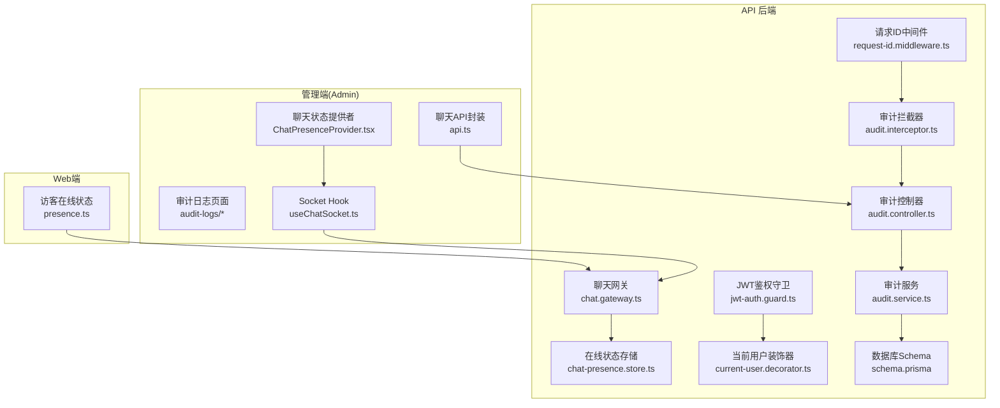
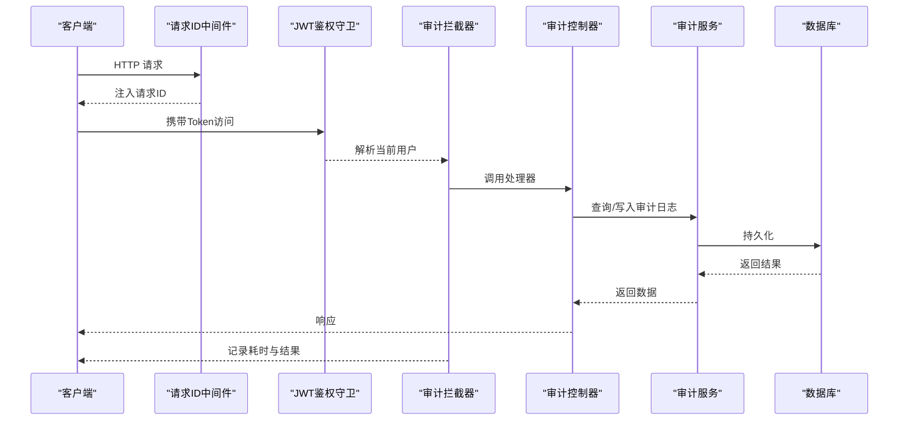
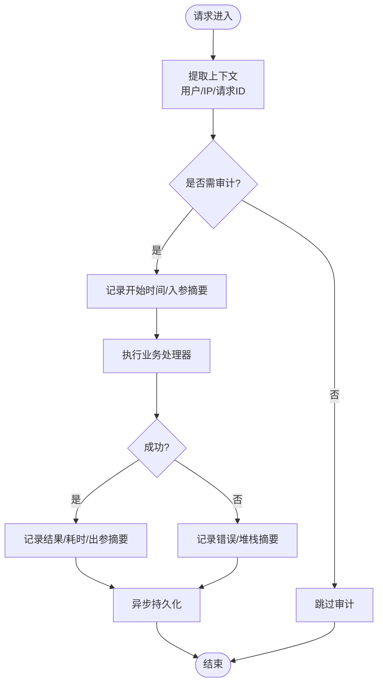
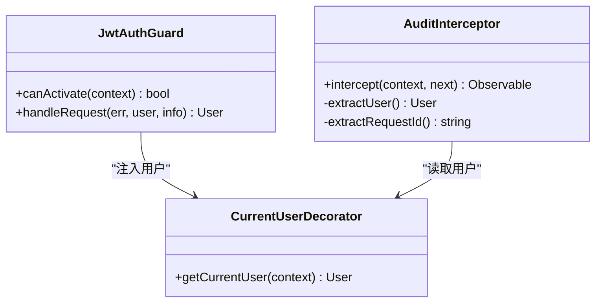
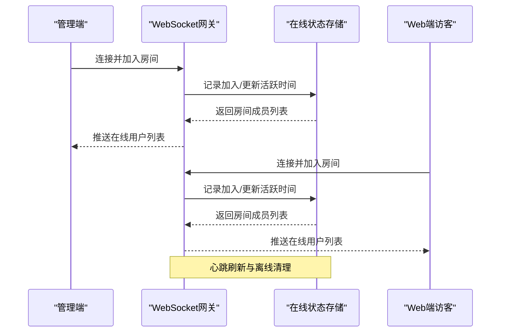
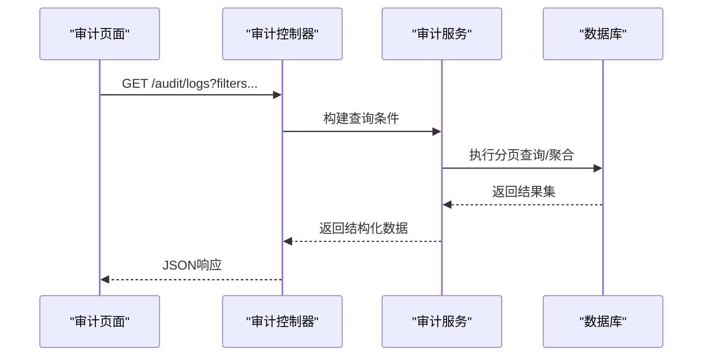
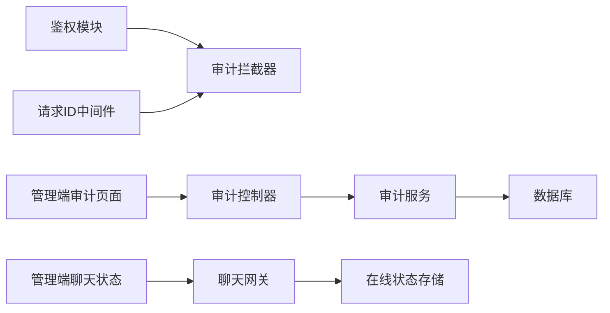

# 审计与追踪

<cite>
**本文引用的文件**   
- [audit.interceptor.ts](file://apps/api/src/common/interceptors/audit.interceptor.ts)
- [audit.controller.ts](file://apps/api/src/audit/audit.controller.ts)
- [audit.service.ts](file://apps/api/src/audit/audit.service.ts)
- [audit.module.ts](file://apps/api/src/audit/audit.module.ts)
- [jwt-auth.guard.ts](file://apps/api/src/auth/guards/jwt-auth.guard.ts)
- [current-user.decorator.ts](file://apps/api/src/auth/decorators/current-user.decorator.ts)
- [request-id.middleware.ts](file://apps/api/src/common/middleware/request-id.middleware.ts)
- [chat.gateway.ts](file://apps/api/src/support/chat.gateway.ts)
- [chat-presence.store.ts](file://apps/api/src/support/chat-presence.store.ts)
- [ChatPresenceProvider.tsx](file://apps/admin/src/features/chat/ChatPresenceProvider.tsx)
- [useChatSocket.ts](file://apps/admin/src/features/chat/useChatSocket.ts)
- [presence.ts](file://apps/web/src/features/chat/presence.ts)
- [api.ts](file://apps/admin/src/features/chat/api.ts)
- [schema.prisma](file://apps/api/prisma/schema.prisma)
</cite>

## 目录
1. [简介](#简介)
2. [项目结构](#项目结构)
3. [核心组件](#核心组件)
4. [架构总览](#架构总览)
5. [详细组件分析](#详细组件分析)
6. [依赖关系分析](#依赖关系分析)
7. [性能考量](#性能考量)
8. [故障排查指南](#故障排查指南)
9. [结论](#结论)
10. [附录](#附录)

## 简介
本文件面向“审计与追踪系统”的设计与实现，覆盖以下能力：
- 操作审计：对关键业务操作进行统一记录，包含请求上下文、操作主体、资源变更等。
- 用户行为追踪：结合身份认证与请求链路标识，将用户行为串联成可追溯的轨迹。
- 实时状态监控：基于聊天室在线状态管理、用户存在性检测与实时状态同步，提供在线人数、活跃会话等指标。
- 审计数据查询与分析：提供统一的审计日志查询接口与前端展示。
- 日志轮转策略与隐私保护：建议的日志存储与脱敏策略。
- 审计配置与自定义规则：通过拦截器与装饰器扩展审计范围与字段。

## 项目结构
审计与追踪相关代码主要分布在后端 API 模块（NestJS）与前后端聊天功能中：
- 后端审计模块：控制器、服务、拦截器、中间件、鉴权守卫与装饰器。
- 聊天室与在线状态：WebSocket 网关、内存存储、前端 Socket 封装与状态提供者。
- 数据库模型：Prisma Schema 定义审计日志实体。

**图表来源** 
- [audit.controller.ts](file://apps/api/src/audit/audit.controller.ts)
- [audit.service.ts](file://apps/api/src/audit/audit.service.ts)
- [audit.interceptor.ts](file://apps/api/src/common/interceptors/audit.interceptor.ts)
- [request-id.middleware.ts](file://apps/api/src/common/middleware/request-id.middleware.ts)
- [jwt-auth.guard.ts](file://apps/api/src/auth/guards/jwt-auth.guard.ts)
- [current-user.decorator.ts](file://apps/api/src/auth/decorators/current-user.decorator.ts)
- [chat.gateway.ts](file://apps/api/src/support/chat.gateway.ts)
- [chat-presence.store.ts](file://apps/api/src/support/chat-presence.store.ts)
- [schema.prisma](file://apps/api/prisma/schema.prisma)
- [ChatPresenceProvider.tsx](file://apps/admin/src/features/chat/ChatPresenceProvider.tsx)
- [useChatSocket.ts](file://apps/admin/src/features/chat/useChatSocket.ts)
- [api.ts](file://apps/admin/src/features/chat/api.ts)
- [presence.ts](file://apps/web/src/features/chat/presence.ts)

**章节来源**
- [audit.controller.ts](file://apps/api/src/audit/audit.controller.ts)
- [audit.service.ts](file://apps/api/src/audit/audit.service.ts)
- [audit.interceptor.ts](file://apps/api/src/common/interceptors/audit.interceptor.ts)
- [request-id.middleware.ts](file://apps/api/src/common/middleware/request-id.middleware.ts)
- [jwt-auth.guard.ts](file://apps/api/src/auth/guards/jwt-auth.guard.ts)
- [current-user.decorator.ts](file://apps/api/src/auth/decorators/current-user.decorator.ts)
- [chat.gateway.ts](file://apps/api/src/support/chat.gateway.ts)
- [chat-presence.store.ts](file://apps/api/src/support/chat-presence.store.ts)
- [schema.prisma](file://apps/api/prisma/schema.prisma)
- [ChatPresenceProvider.tsx](file://apps/admin/src/features/chat/ChatPresenceProvider.tsx)
- [useChatSocket.ts](file://apps/admin/src/features/chat/useChatSocket.ts)
- [api.ts](file://apps/admin/src/features/chat/api.ts)
- [presence.ts](file://apps/web/src/features/chat/presence.ts)

## 核心组件
- 审计拦截器：在请求处理前后收集上下文信息（方法、路径、参数、耗时、结果、用户、请求ID），并触发审计事件或写入日志。
- 审计控制器与服务：提供审计日志的查询、过滤、分页接口；封装持久化逻辑。
- 鉴权守卫与当前用户装饰器：确保审计记录关联到真实用户身份。
- 请求ID中间件：为每个请求生成唯一ID，贯穿整个调用链，便于跨服务追踪。
- 聊天网关与在线状态存储：维护房间成员、在线用户集合，广播状态变化。
- 前端状态提供者与Socket Hook：订阅在线状态变化，渲染实时列表与计数。

**章节来源**
- [audit.interceptor.ts](file://apps/api/src/common/interceptors/audit.interceptor.ts)
- [audit.controller.ts](file://apps/api/src/audit/audit.controller.ts)
- [audit.service.ts](file://apps/api/src/audit/audit.service.ts)
- [jwt-auth.guard.ts](file://apps/api/src/auth/guards/jwt-auth.guard.ts)
- [current-user.decorator.ts](file://apps/api/src/auth/decorators/current-user.decorator.ts)
- [request-id.middleware.ts](file://apps/api/src/common/middleware/request-id.middleware.ts)
- [chat.gateway.ts](file://apps/api/src/support/chat.gateway.ts)
- [chat-presence.store.ts](file://apps/api/src/support/chat-presence.store.ts)
- [ChatPresenceProvider.tsx](file://apps/admin/src/features/chat/ChatPresenceProvider.tsx)
- [useChatSocket.ts](file://apps/admin/src/features/chat/useChatSocket.ts)

## 架构总览
审计与追踪的整体流程如下：
- 请求进入时，中间件注入请求ID；鉴权守卫校验令牌并填充当前用户；拦截器捕获请求与响应元数据；控制器调用服务完成业务；服务写入审计日志。
- 聊天室通过WebSocket网关维护在线状态，前端通过Socket Hook订阅状态变化，实时更新界面。

**图表来源** 
- [request-id.middleware.ts](file://apps/api/src/common/middleware/request-id.middleware.ts)
- [jwt-auth.guard.ts](file://apps/api/src/auth/guards/jwt-auth.guard.ts)
- [audit.interceptor.ts](file://apps/api/src/common/interceptors/audit.interceptor.ts)
- [audit.controller.ts](file://apps/api/src/audit/audit.controller.ts)
- [audit.service.ts](file://apps/api/src/audit/audit.service.ts)
- [schema.prisma](file://apps/api/prisma/schema.prisma)

## 详细组件分析

### 审计拦截器与日志记录格式
- 拦截器职责：
  - 记录请求方法、路径、查询参数、请求体摘要、响应状态码、耗时、错误信息。
  - 从上下文中提取用户ID、角色、IP、请求ID。
  - 根据路由或装饰器决定是否记录敏感字段。
- 日志格式要点：
  - 时间戳、请求ID、用户ID、操作类型、资源标识、变更摘要、结果状态、耗时、客户端信息。
  - 敏感字段可按策略脱敏（如密码、令牌）。
- 扩展点：
  - 通过装饰器标记需要审计的路由或方法。
  - 在拦截器内按白名单/黑名单控制记录粒度。

**图表来源** 
- [audit.interceptor.ts](file://apps/api/src/common/interceptors/audit.interceptor.ts)
- [current-user.decorator.ts](file://apps/api/src/auth/decorators/current-user.decorator.ts)
- [request-id.middleware.ts](file://apps/api/src/common/middleware/request-id.middleware.ts)

**章节来源**
- [audit.interceptor.ts](file://apps/api/src/common/interceptors/audit.interceptor.ts)
- [current-user.decorator.ts](file://apps/api/src/auth/decorators/current-user.decorator.ts)
- [request-id.middleware.ts](file://apps/api/src/common/middleware/request-id.middleware.ts)

### 用户身份关联机制
- 鉴权守卫负责验证JWT并填充用户信息到请求上下文。
- 当前用户装饰器暴露用户对象给控制器或服务，用于审计记录。
- 审计拦截器从上下文读取用户ID、角色、权限集，确保每条审计记录具备可归因性。

**图表来源** 
- [jwt-auth.guard.ts](file://apps/api/src/auth/guards/jwt-auth.guard.ts)
- [current-user.decorator.ts](file://apps/api/src/auth/decorators/current-user.decorator.ts)
- [audit.interceptor.ts](file://apps/api/src/common/interceptors/audit.interceptor.ts)

**章节来源**
- [jwt-auth.guard.ts](file://apps/api/src/auth/guards/jwt-auth.guard.ts)
- [current-user.decorator.ts](file://apps/api/src/auth/decorators/current-user.decorator.ts)
- [audit.interceptor.ts](file://apps/api/src/common/interceptors/audit.interceptor.ts)

### 聊天室在线状态管理与实时同步
- 在线状态存储：
  - 维护房间成员映射、用户连接集合、最后活跃时间。
  - 支持加入/离开房间、心跳刷新、离线清理。
- WebSocket 网关：
  - 处理连接建立、房间加入/离开、消息广播、状态事件推送。
  - 与鉴权守卫集成，确保只有合法用户可加入房间。
- 前端状态提供者与Hook：
  - ChatPresenceProvider 订阅在线状态变化，提供全局状态。
  - useChatSocket 封装Socket连接、事件监听与重连逻辑。
  - Web端 presence.ts 维护访客在线状态并与服务端同步。

**图表来源** 
- [chat.gateway.ts](file://apps/api/src/support/chat.gateway.ts)
- [chat-presence.store.ts](file://apps/api/src/support/chat-presence.store.ts)
- [ChatPresenceProvider.tsx](file://apps/admin/src/features/chat/ChatPresenceProvider.tsx)
- [useChatSocket.ts](file://apps/admin/src/features/chat/useChatSocket.ts)
- [presence.ts](file://apps/web/src/features/chat/presence.ts)

**章节来源**
- [chat.gateway.ts](file://apps/api/src/support/chat.gateway.ts)
- [chat-presence.store.ts](file://apps/api/src/support/chat-presence.store.ts)
- [ChatPresenceProvider.tsx](file://apps/admin/src/features/chat/ChatPresenceProvider.tsx)
- [useChatSocket.ts](file://apps/admin/src/features/chat/useChatSocket.ts)
- [presence.ts](file://apps/web/src/features/chat/presence.ts)

### 审计数据查询与分析
- 控制器提供查询接口，支持按时间范围、用户、操作类型、资源ID、请求ID等条件筛选。
- 服务层执行分页、排序、聚合统计（如按用户/操作类型的频次）。
- 前端审计页面展示列表、详情、导出与可视化图表。

**图表来源** 
- [audit.controller.ts](file://apps/api/src/audit/audit.controller.ts)
- [audit.service.ts](file://apps/api/src/audit/audit.service.ts)
- [schema.prisma](file://apps/api/prisma/schema.prisma)

**章节来源**
- [audit.controller.ts](file://apps/api/src/audit/audit.controller.ts)
- [audit.service.ts](file://apps/api/src/audit/audit.service.ts)
- [schema.prisma](file://apps/api/prisma/schema.prisma)

### 日志轮转策略与隐私保护措施
- 轮转策略（建议）：
  - 按时间分片（日/周）与大小阈值滚动，保留周期可配置。
  - 冷热分离：热数据存内存/缓存，冷数据归档至对象存储。
- 隐私保护：
  - 敏感字段脱敏（如密码、令牌、身份证号）。
  - 最小化记录原则：仅记录必要字段，避免记录完整请求体。
  - 访问控制：审计日志仅限授权管理员查看与导出。

[本节为通用指导，不直接分析具体文件]

### 审计配置与自定义规则
- 配置项（建议）：
  - 是否启用审计、记录级别、敏感字段清单、轮转策略、存储后端。
- 自定义规则：
  - 使用装饰器标记需要审计的方法或路由。
  - 在拦截器中按白名单/黑名单控制记录粒度。
  - 在服务层扩展审计事件，对接外部审计平台。

[本节为通用指导，不直接分析具体文件]

## 依赖关系分析
- 审计模块依赖鉴权模块（获取用户）、中间件（请求ID）、数据库（持久化）。
- 聊天模块依赖WebSocket运行时、在线状态存储、前端Socket封装。
- 前端审计页面依赖审计API与状态管理。

**图表来源** 
- [audit.interceptor.ts](file://apps/api/src/common/interceptors/audit.interceptor.ts)
- [audit.controller.ts](file://apps/api/src/audit/audit.controller.ts)
- [audit.service.ts](file://apps/api/src/audit/audit.service.ts)
- [request-id.middleware.ts](file://apps/api/src/common/middleware/request-id.middleware.ts)
- [chat.gateway.ts](file://apps/api/src/support/chat.gateway.ts)
- [chat-presence.store.ts](file://apps/api/src/support/chat-presence.store.ts)

**章节来源**
- [audit.interceptor.ts](file://apps/api/src/common/interceptors/audit.interceptor.ts)
- [audit.controller.ts](file://apps/api/src/audit/audit.controller.ts)
- [audit.service.ts](file://apps/api/src/audit/audit.service.ts)
- [request-id.middleware.ts](file://apps/api/src/common/middleware/request-id.middleware.ts)
- [chat.gateway.ts](file://apps/api/src/support/chat.gateway.ts)
- [chat-presence.store.ts](file://apps/api/src/support/chat-presence.store.ts)

## 性能考量
- 审计记录异步化：避免阻塞主请求链路，采用队列或后台任务写入。
- 采样与降级：高负载时对非关键操作降低记录频率或关闭审计。
- 索引优化：为常用查询字段（时间、用户、操作类型、请求ID）建立索引。
- 在线状态存储：使用内存结构（如Map）提升读写性能，定期清理过期连接。

[本节为通用指导，不直接分析具体文件]

## 故障排查指南
- 审计日志缺失：
  - 检查拦截器是否注册、鉴权守卫是否生效、请求ID中间件是否前置。
  - 确认装饰器是否正确标注审计目标。
- 用户身份为空：
  - 检查JWT令牌是否有效、守卫是否正确解析用户。
  - 确认装饰器是否在正确位置读取上下文。
- 聊天室状态不同步：
  - 检查WebSocket连接是否正常、房间加入/离开事件是否触发。
  - 确认心跳刷新与离线清理逻辑是否运行。
- 查询性能问题：
  - 检查数据库索引、分页参数、聚合查询复杂度。

**章节来源**
- [audit.interceptor.ts](file://apps/api/src/common/interceptors/audit.interceptor.ts)
- [jwt-auth.guard.ts](file://apps/api/src/auth/guards/jwt-auth.guard.ts)
- [current-user.decorator.ts](file://apps/api/src/auth/decorators/current-user.decorator.ts)
- [chat.gateway.ts](file://apps/api/src/support/chat.gateway.ts)
- [chat-presence.store.ts](file://apps/api/src/support/chat-presence.store.ts)

## 结论
本审计与追踪系统通过拦截器、鉴权与中间件的协同，实现了统一的操作审计与用户行为追踪；结合聊天室的在线状态管理与实时同步，提供了实时监控能力。通过合理的轮转策略与隐私保护措施，系统在安全性与性能之间取得平衡。未来可扩展更多自定义审计规则与外部审计平台集成。

[本节为总结，不直接分析具体文件]

## 附录
- 审计日志字段建议：
  - 时间戳、请求ID、用户ID、用户名、角色、IP、方法、路径、参数摘要、结果状态、耗时、错误摘要、资源标识、变更摘要。
- 在线状态关键字段：
  - 用户ID、房间ID、连接ID、加入时间、最后活跃时间、设备信息。

[本节为补充说明，不直接分析具体文件]