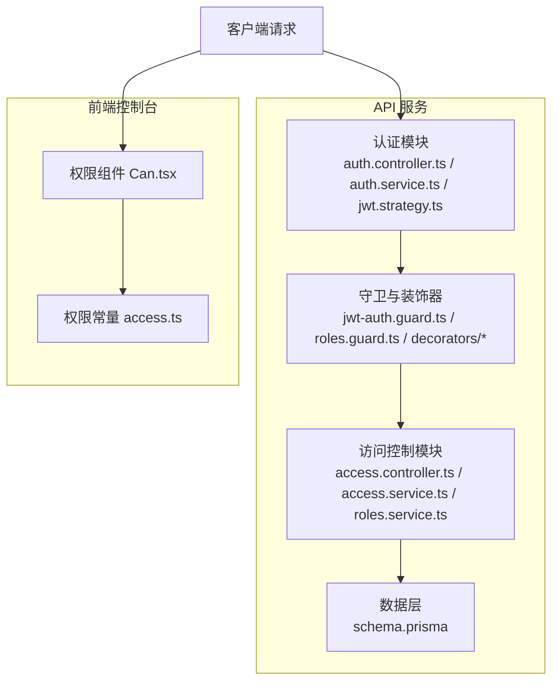
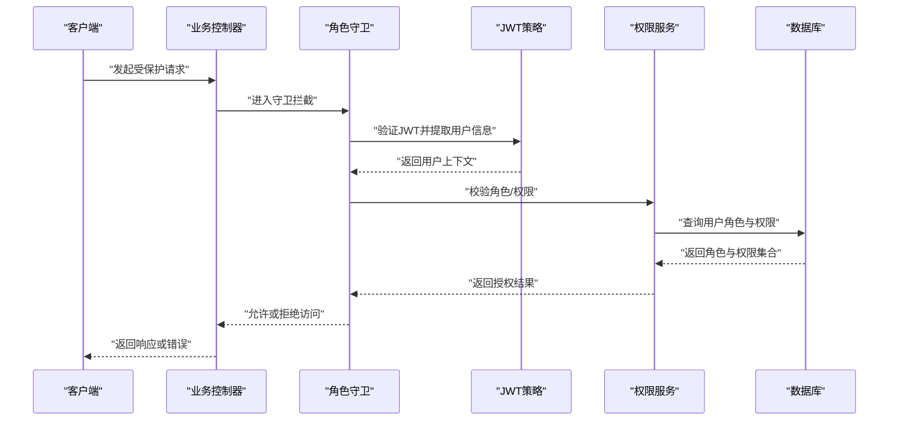
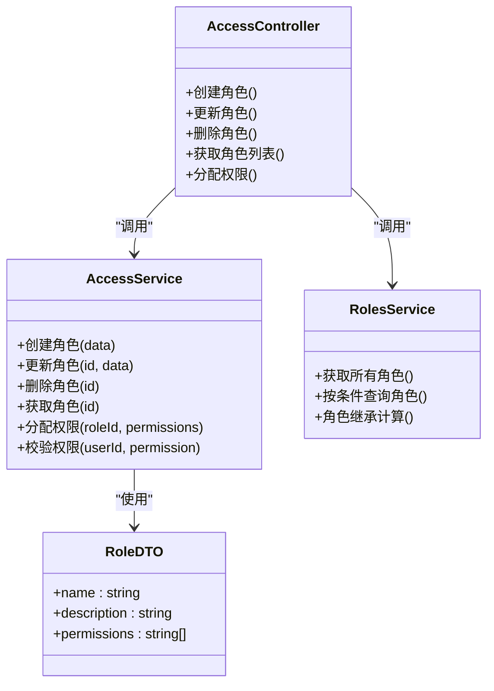
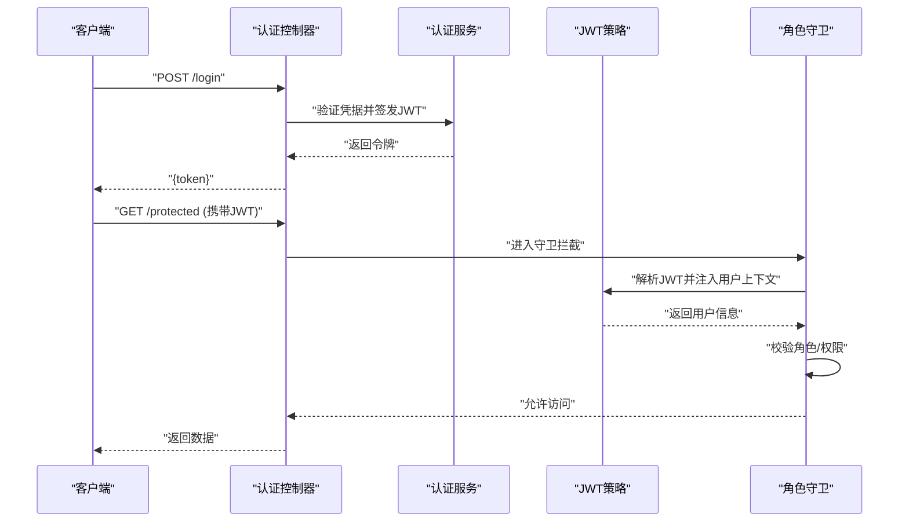
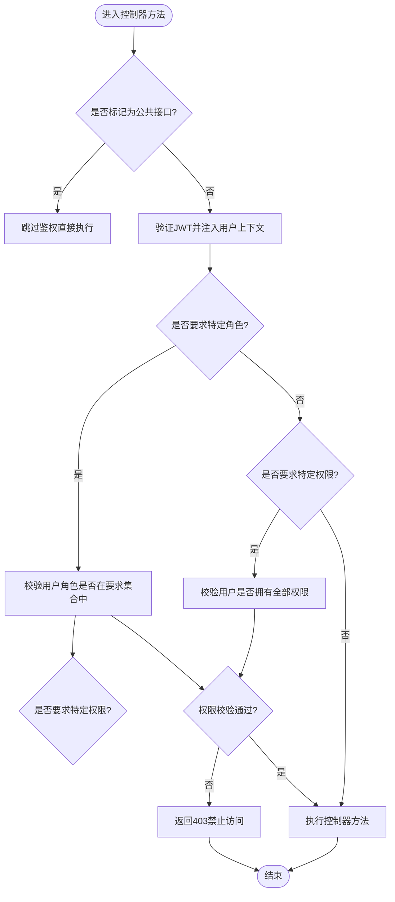
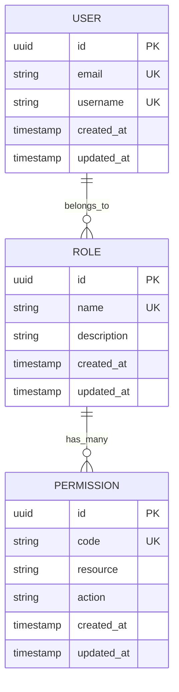
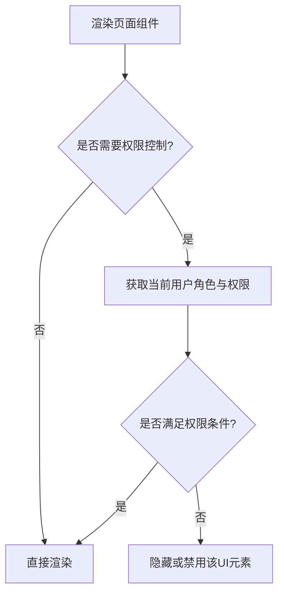
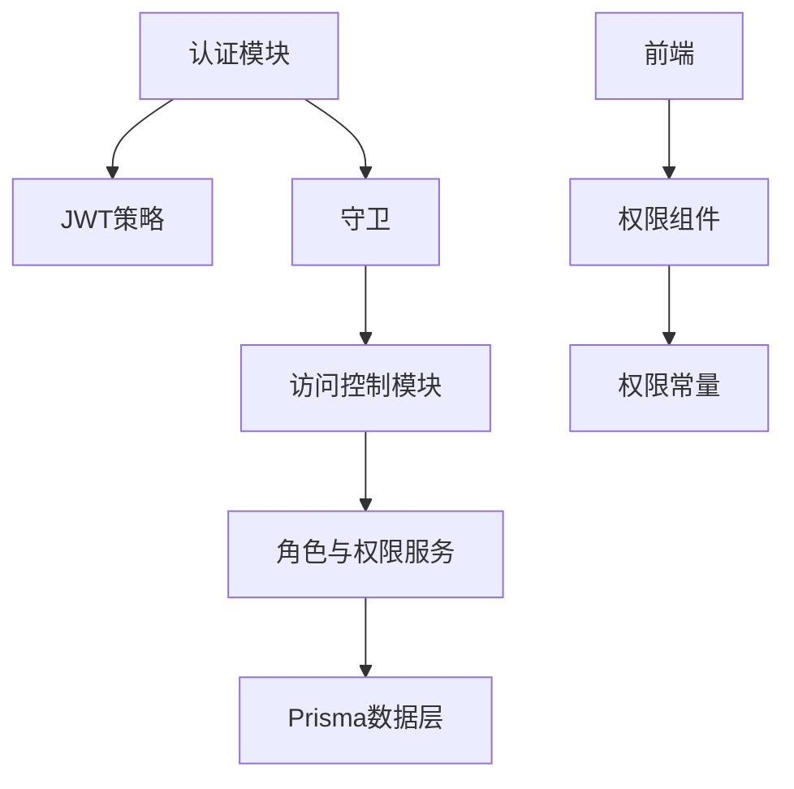

# 权限控制系统

<cite>
**本文引用的文件**   
- [access.controller.ts](file://apps/api/src/access/access.controller.ts)
- [access.service.ts](file://apps/api/src/access/access.service.ts)
- [roles.service.ts](file://apps/api/src/access/roles.service.ts)
- [permissions.ts](file://apps/api/src/access/permissions.ts)
- [role.dto.ts](file://apps/api/src/access/dto/role.dto.ts)
- [auth.controller.ts](file://apps/api/src/auth/auth.controller.ts)
- [auth.module.ts](file://apps/api/src/auth/auth.module.ts)
- [auth.service.ts](file://apps/api/src/auth/auth.service.ts)
- [jwt.strategy.ts](file://apps/api/src/auth/strategies/jwt.strategy.ts)
- [jwt-auth.guard.ts](file://apps/api/src/auth/guards/jwt-auth.guard.ts)
- [roles.guard.ts](file://apps/api/src/auth/guards/roles.guard.ts)
- [current-user.decorator.ts](file://apps/api/src/auth/decorators/current-user.decorator.ts)
- [public.decorator.ts](file://apps/api/src/auth/decorators/public.decorator.ts)
- [require-permissions.decorator.ts](file://apps/api/src/auth/decorators/require-permissions.decorator.ts)
- [roles.decorator.ts](file://apps/api/src/auth/decorators/roles.decorator.ts)
- [seed-roles.ts](file://apps/api/src/scripts/seed-roles.ts)
- [migrate-deprecated-roles.ts](file://apps/api/src/scripts/migrate-deprecated-roles.ts)
- [prune-deprecated-permissions.ts](file://apps/api/src/scripts/prune-deprecated-permissions.ts)
- [schema.prisma](file://apps/api/prisma/schema.prisma)
- [app.module.ts](file://apps/api/src/app.module.ts)
- [main.ts](file://apps/api/src/main.ts)
- [Can.tsx](file://apps/admin/src/components/Can.tsx)
- [access.ts](file://apps/admin/src/features/access.ts)
</cite>

## 目录
1. [简介](#简介)
2. [项目结构](#项目结构)
3. [核心组件](#核心组件)
4. [架构总览](#架构总览)
5. [详细组件分析](#详细组件分析)
6. [依赖关系分析](#依赖关系分析)
7. [性能考虑](#性能考虑)
8. [故障排查指南](#故障排查指南)
9. [结论](#结论)
10. [附录](#附录)

## 简介
本文件系统性地梳理并说明基于角色的访问控制（RBAC）的权限控制系统，覆盖角色定义、权限分配、细粒度授权与API级别的访问控制。文档重点解释权限守卫的实现原理、装饰器的使用方法与权限检查流程，并提供角色继承、动态权限评估、权限缓存与性能优化策略。同时给出完整的权限配置示例与自定义权限检查逻辑的实现方法，帮助读者快速理解并在项目中落地。

## 项目结构
权限相关代码主要分布在后端 NestJS 模块中，包括：
- 访问控制模块：角色与权限管理、控制器与服务
- 认证模块：JWT 策略、守卫与装饰器
- 数据模型：Prisma Schema 中的用户、角色、权限等实体
- 前端：权限判断组件与权限常量

图表来源
- [access.controller.ts](file://apps/api/src/access/access.controller.ts)
- [access.service.ts](file://apps/api/src/access/access.service.ts)
- [roles.service.ts](file://apps/api/src/access/roles.service.ts)
- [auth.controller.ts](file://apps/api/src/auth/auth.controller.ts)
- [auth.service.ts](file://apps/api/src/auth/auth.service.ts)
- [jwt.strategy.ts](file://apps/api/src/auth/strategies/jwt.strategy.ts)
- [jwt-auth.guard.ts](file://apps/api/src/auth/guards/jjwt-auth.guard.ts)
- [roles.guard.ts](file://apps/api/src/auth/guards/roles.guard.ts)
- [schema.prisma](file://apps/api/prisma/schema.prisma)
- [Can.tsx](file://apps/admin/src/components/Can.tsx)
- [access.ts](file://apps/admin/src/features/access.ts)

章节来源
- [access.controller.ts](file://apps/api/src/access/access.controller.ts)
- [access.service.ts](file://apps/api/src/access/access.service.ts)
- [roles.service.ts](file://apps/api/src/access/roles.service.ts)
- [auth.controller.ts](file://apps/api/src/auth/auth.controller.ts)
- [auth.service.ts](file://apps/api/src/auth/auth.service.ts)
- [jwt.strategy.ts](file://apps/api/src/auth/strategies/jwt.strategy.ts)
- [jwt-auth.guard.ts](file://apps/api/src/auth/guards/jwt-auth.guard.ts)
- [roles.guard.ts](file://apps/api/src/auth/guards/roles.guard.ts)
- [schema.prisma](file://apps/api/prisma/schema.prisma)
- [Can.tsx](file://apps/admin/src/components/Can.tsx)
- [access.ts](file://apps/admin/src/features/access.ts)

## 核心组件
- 角色与权限管理服务：提供角色的创建、更新、删除与查询，以及权限的分配与校验。
- 访问控制控制器：暴露角色与权限管理的 API 端点。
- 认证与授权：JWT 鉴权、角色守卫、权限装饰器，实现 API 级别的安全控制。
- 数据模型：通过 Prisma 定义用户、角色、权限及其关联关系。
- 前端权限组件：在 UI 层根据当前用户角色与权限渲染或隐藏功能。

章节来源
- [access.controller.ts](file://apps/api/src/access/access.controller.ts)
- [access.service.ts](file://apps/api/src/access/access.service.ts)
- [roles.service.ts](file://apps/api/src/access/roles.service.ts)
- [auth.controller.ts](file://apps/api/src/auth/auth.controller.ts)
- [auth.service.ts](file://apps/api/src/auth/auth.service.ts)
- [jwt.strategy.ts](file://apps/api/src/auth/strategies/jwt.strategy.ts)
- [jwt-auth.guard.ts](file://apps/api/src/auth/guards/jwt-auth.guard.ts)
- [roles.guard.ts](file://apps/api/src/auth/guards/roles.guard.ts)
- [schema.prisma](file://apps/api/prisma/schema.prisma)
- [Can.tsx](file://apps/admin/src/components/Can.tsx)
- [access.ts](file://apps/admin/src/features/access.ts)

## 架构总览
系统采用“认证 + 授权”的分层设计：
- 认证层：通过 JWT 策略解析令牌，注入当前用户上下文。
- 授权层：使用守卫进行角色与权限校验，装饰器声明式地指定所需权限。
- 业务层：控制器调用服务完成具体业务逻辑，受守卫与装饰器保护。
- 数据层：通过 Prisma 持久化用户、角色、权限及关联关系。

图表来源
- [auth.controller.ts](file://apps/api/src/auth/auth.controller.ts)
- [jwt.strategy.ts](file://apps/api/src/auth/strategies/jwt.strategy.ts)
- [jwt-auth.guard.ts](file://apps/api/src/auth/guards/jwt-auth.guard.ts)
- [roles.guard.ts](file://apps/api/src/auth/guards/roles.guard.ts)
- [access.service.ts](file://apps/api/src/access/access.service.ts)
- [schema.prisma](file://apps/api/prisma/schema.prisma)

## 详细组件分析

### 角色与权限管理（Access 模块）
- 控制器：提供角色与权限的增删改查接口，便于管理员维护 RBAC 配置。
- 服务：封装角色与权限的业务逻辑，包括角色继承、权限合并与校验。
- DTO：定义角色数据传输对象的结构与校验规则。
- 权限常量：集中定义系统内置权限标识，便于前后端一致使用。

图表来源
- [access.controller.ts](file://apps/api/src/access/access.controller.ts)
- [access.service.ts](file://apps/api/src/access/access.service.ts)
- [roles.service.ts](file://apps/api/src/access/roles.service.ts)
- [role.dto.ts](file://apps/api/src/access/dto/role.dto.ts)

章节来源
- [access.controller.ts](file://apps/api/src/access/access.controller.ts)
- [access.service.ts](file://apps/api/src/access/access.service.ts)
- [roles.service.ts](file://apps/api/src/access/roles.service.ts)
- [role.dto.ts](file://apps/api/src/access/dto/role.dto.ts)

### 认证与授权（Auth 模块）
- 控制器：处理登录、登出、刷新令牌等认证流程。
- 服务：生成与验证 JWT，管理用户会话与令牌生命周期。
- 策略：从请求中提取并解析 JWT，构造用户上下文。
- 守卫：统一鉴权入口，校验用户身份与角色/权限。
- 装饰器：声明式标注公共接口、所需角色与权限。

图表来源
- [auth.controller.ts](file://apps/api/src/auth/auth.controller.ts)
- [auth.service.ts](file://apps/api/src/auth/auth.service.ts)
- [jwt.strategy.ts](file://apps/api/src/auth/strategies/jwt.strategy.ts)
- [jwt-auth.guard.ts](file://apps/api/src/auth/guards/jwt-auth.guard.ts)
- [roles.guard.ts](file://apps/api/src/auth/guards/roles.guard.ts)

章节来源
- [auth.controller.ts](file://apps/api/src/auth/auth.controller.ts)
- [auth.service.ts](file://apps/api/src/auth/auth.service.ts)
- [jwt.strategy.ts](file://apps/api/src/auth/strategies/jwt.strategy.ts)
- [jwt-auth.guard.ts](file://apps/api/src/auth/guards/jwt-auth.guard.ts)
- [roles.guard.ts](file://apps/api/src/auth/guards/roles.guard.ts)

### 装饰器与守卫的使用方式
- 公共接口装饰器：用于跳过鉴权的公开路由。
- 角色装饰器：声明路由所需的角色集合。
- 权限装饰器：声明路由所需的权限标识集合。
- 当前用户装饰器：在控制器方法中注入已认证的用户上下文。

图表来源
- [public.decorator.ts](file://apps/api/src/auth/decorators/public.decorator.ts)
- [roles.decorator.ts](file://apps/api/src/auth/decorators/roles.decorator.ts)
- [require-permissions.decorator.ts](file://apps/api/src/auth/decorators/require-permissions.decorator.ts)
- [current-user.decorator.ts](file://apps/api/src/auth/decorators/current-user.decorator.ts)
- [jwt-auth.guard.ts](file://apps/api/src/auth/guards/jwt-auth.guard.ts)
- [roles.guard.ts](file://apps/api/src/auth/guards/roles.guard.ts)

章节来源
- [public.decorator.ts](file://apps/api/src/auth/decorators/public.decorator.ts)
- [roles.decorator.ts](file://apps/api/src/auth/decorators/roles.decorator.ts)
- [require-permissions.decorator.ts](file://apps/api/src/auth/decorators/require-permissions.decorator.ts)
- [current-user.decorator.ts](file://apps/api/src/auth/decorators/current-user.decorator.ts)
- [jwt-auth.guard.ts](file://apps/api/src/auth/guards/jwt-auth.guard.ts)
- [roles.guard.ts](file://apps/api/src/auth/guards/roles.guard.ts)

### 数据模型与权限存储（Prisma）
- 用户实体：包含用户基本信息与关联的角色。
- 角色实体：包含角色名称、描述与关联的权限集合。
- 权限实体：定义系统内可授权的细粒度操作标识。
- 关联关系：用户-角色多对多，角色-权限多对多，支持角色继承与权限合并。

图表来源
- [schema.prisma](file://apps/api/prisma/schema.prisma)

章节来源
- [schema.prisma](file://apps/api/prisma/schema.prisma)

### 前端权限组件与常量
- 权限组件：根据当前用户角色与权限决定是否渲染某UI元素。
- 权限常量：集中定义权限标识，确保前后端一致性。

图表来源
- [Can.tsx](file://apps/admin/src/components/Can.tsx)
- [access.ts](file://apps/admin/src/features/access.ts)

章节来源
- [Can.tsx](file://apps/admin/src/components/Can.tsx)
- [access.ts](file://apps/admin/src/features/access.ts)

## 依赖关系分析
- 认证模块依赖 JWT 策略与守卫，负责令牌解析与用户上下文注入。
- 访问控制模块依赖角色与权限服务，提供 RBAC 管理能力。
- 数据层通过 Prisma 统一管理用户、角色、权限的持久化。
- 前端依赖权限组件与常量，实现 UI 级别的权限控制。

图表来源
- [auth.module.ts](file://apps/api/src/auth/auth.module.ts)
- [app.module.ts](file://apps/api/src/app.module.ts)
- [main.ts](file://apps/api/src/main.ts)
- [schema.prisma](file://apps/api/prisma/schema.prisma)

章节来源
- [auth.module.ts](file://apps/api/src/auth/auth.module.ts)
- [app.module.ts](file://apps/api/src/app.module.ts)
- [main.ts](file://apps/api/src/main.ts)
- [schema.prisma](file://apps/api/prisma/schema.prisma)

## 性能考虑
- 权限缓存：在服务层对用户角色与权限进行内存或分布式缓存，减少重复查询。
- 批量加载：一次性加载用户的所有角色与权限，避免 N+1 查询。
- 懒加载与延迟计算：仅在需要时计算角色继承与权限合并。
- 最小化守卫开销：将高频校验逻辑下沉到服务层，并使用短路判断。
- 前端缓存：对权限常量与用户权限状态进行本地缓存，降低重复判断成本。

[本节为通用性能建议，不直接分析具体文件]

## 故障排查指南
- 常见问题
  - 401 未认证：检查 JWT 是否正确传递与解析。
  - 403 禁止访问：确认用户角色与权限是否满足装饰器要求。
  - 权限不一致：核对前端权限常量与后端权限标识是否一致。
- 调试步骤
  - 启用日志输出，记录守卫与服务的权限校验过程。
  - 使用测试工具模拟不同角色与权限的请求，验证授权逻辑。
  - 检查数据迁移脚本是否正确初始化角色与权限。

章节来源
- [seed-roles.ts](file://apps/api/src/scripts/seed-roles.ts)
- [migrate-deprecated-roles.ts](file://apps/api/src/scripts/migrate-deprecated-roles.ts)
- [prune-deprecated-permissions.ts](file://apps/api/src/scripts/prune-deprecated-permissions.ts)

## 结论
本权限控制系统以 RBAC 为核心，结合 JWT 认证与 NestJS 守卫/装饰器机制，实现了从 API 到 UI 的全链路权限控制。通过角色继承、动态权限评估与缓存优化，系统在安全性与性能之间取得平衡。开发者可基于现有装饰器与服务扩展自定义权限逻辑，满足不同业务场景的需求。

[本节为总结性内容，不直接分析具体文件]

## 附录
- 权限配置示例
  - 定义角色：创建“管理员”、“编辑者”、“访客”等角色，并分配相应权限。
  - 绑定用户：为用户分配一个或多个角色，使其继承角色权限。
  - 声明权限：在控制器方法上使用权限装饰器，声明所需权限标识。
- 自定义权限检查逻辑
  - 扩展权限服务：添加自定义校验函数，结合业务上下文进行动态评估。
  - 注册新守卫：实现自定义守卫，集成到全局或局部路由中。
  - 前端适配：在前端组件中使用权限组件，根据用户权限动态渲染。

[本节为补充说明，不直接分析具体文件]