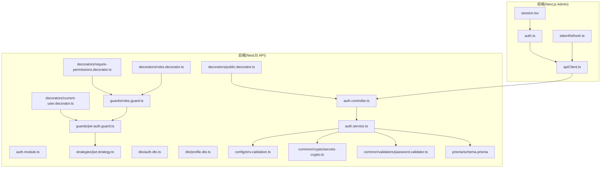
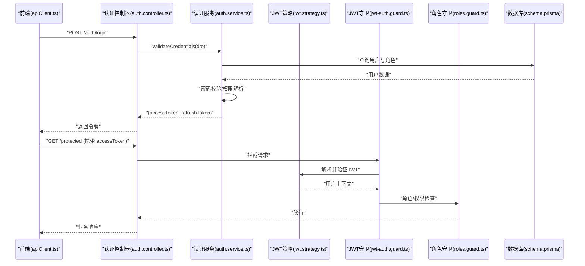
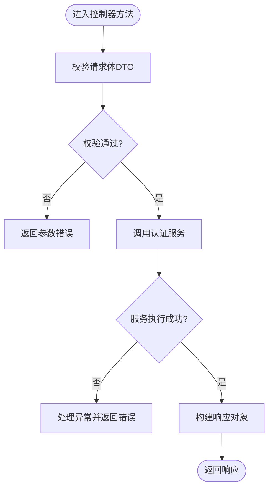
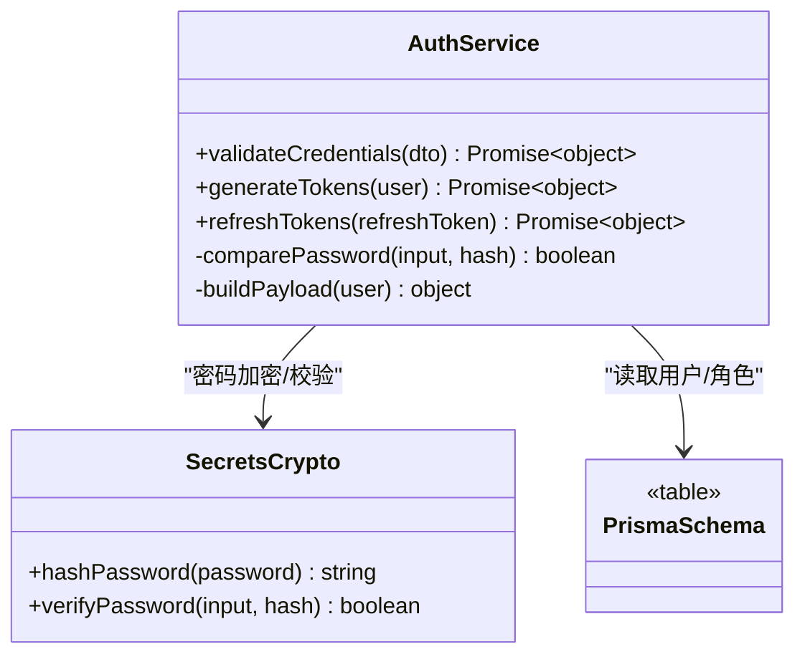
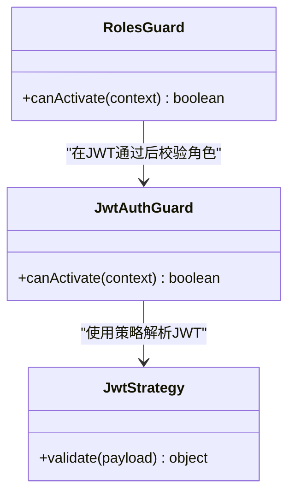
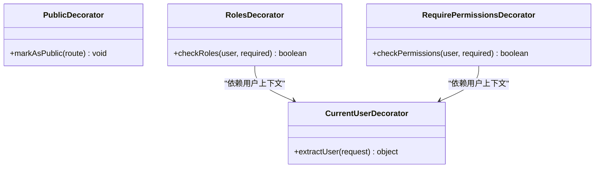
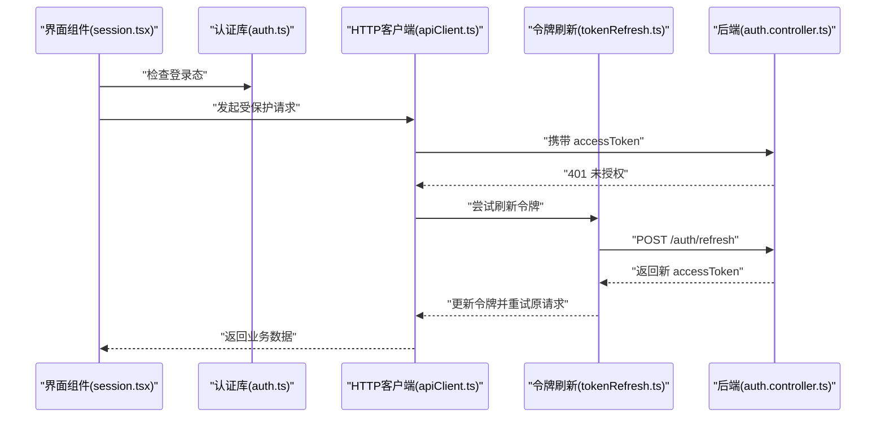
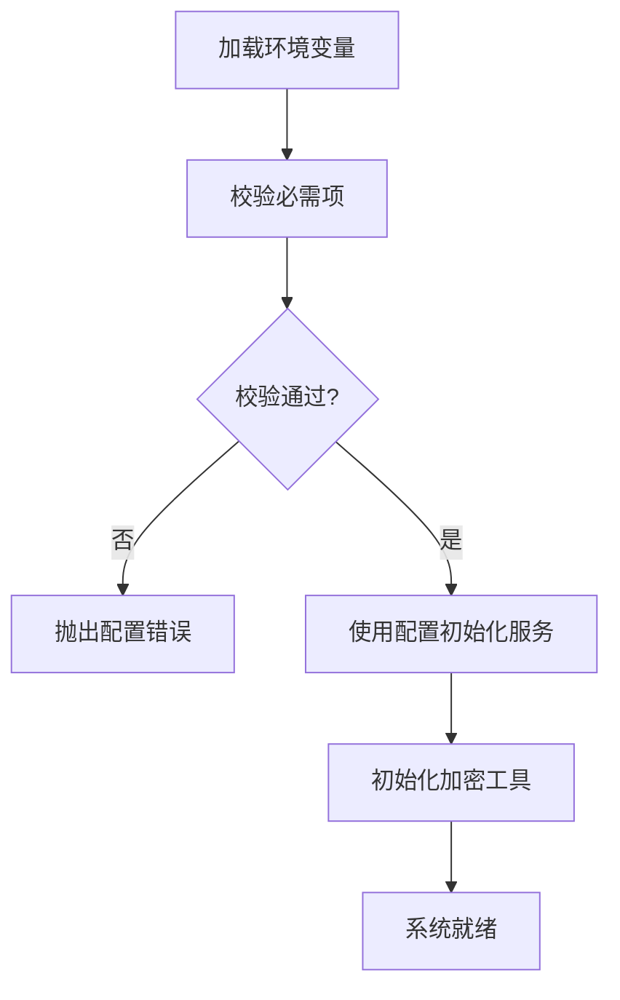
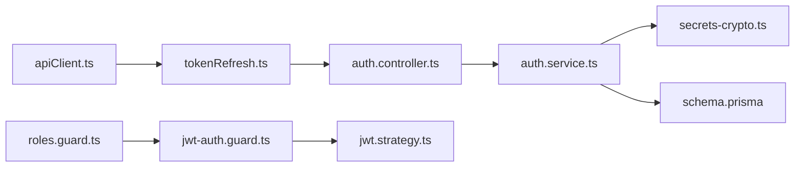

# 用户认证系统

<cite>
**本文引用的文件**   
- [auth.controller.ts](file://apps/api/src/auth/auth.controller.ts)
- [auth.service.ts](file://apps/api/src/auth/auth.service.ts)
- [auth.module.ts](file://apps/api/src/auth/auth.module.ts)
- [jwt-auth.guard.ts](file://apps/api/src/auth/guards/jwt-auth.guard.ts)
- [roles.guard.ts](file://apps/api/src/auth/guards/roles.guard.ts)
- [jwt.strategy.ts](file://apps/api/src/auth/strategies/jwt.strategy.ts)
- [current-user.decorator.ts](file://apps/api/src/auth/decorators/current-user.decorator.ts)
- [public.decorator.ts](file://apps/api/src/auth/decorators/public.decorator.ts)
- [require-permissions.decorator.ts](file://apps/api/src/auth/decorators/require-permissions.decorator.ts)
- [roles.decorator.ts](file://apps/api/src/auth/decorators/roles.decorator.ts)
- [auth.dto.ts](file://apps/api/src/auth/dto/auth.dto.ts)
- [profile.dto.ts](file://apps/api/src/auth/dto/profile.dto.ts)
- [env.validation.ts](file://apps/api/src/config/env.validation.ts)
- [secrets-crypto.ts](file://apps/api/src/common/crypto/secrets-crypto.ts)
- [password.validator.ts](file://apps/api/src/common/validators/password.validator.ts)
- [apiClient.ts](file://apps/admin/src/lib/apiClient.ts)
- [tokenRefresh.ts](file://apps/admin/src/lib/tokenRefresh.ts)
- [auth.ts](file://apps/admin/src/lib/auth.ts)
- [session.tsx](file://apps/admin/src/components/session.tsx)
- [schema.prisma](file://apps/api/prisma/schema.prisma)
</cite>

## 目录
1. [简介](#简介)
2. [项目结构](#项目结构)
3. [核心组件](#核心组件)
4. [架构总览](#架构总览)
5. [详细组件分析](#详细组件分析)
6. [依赖关系分析](#依赖关系分析)
7. [性能考量](#性能考量)
8. [故障排查指南](#故障排查指南)
9. [结论](#结论)
10. [附录](#附录)

## 简介
本文件系统性地梳理基于 JWT 令牌的多层次认证机制，覆盖用户登录流程、JWT 生成与验证、会话管理、密码加密存储、认证守卫与装饰器、令牌刷新机制与错误处理策略。同时提供认证配置选项、安全最佳实践与常见问题解决方案，并给出实现自定义认证逻辑和集成第三方认证服务的完整示例指引。

## 项目结构
认证相关代码主要分布在 NestJS API 模块（后端）与 Next.js Admin 前端中：
- 后端认证模块：控制器、服务、守卫、策略、装饰器、DTO、配置与加密工具
- 前端认证客户端：API 客户端封装、令牌刷新、会话状态与登录页面交互

图表来源
- [auth.controller.ts](file://apps/api/src/auth/auth.controller.ts)
- [auth.service.ts](file://apps/api/src/auth/auth.service.ts)
- [auth.module.ts](file://apps/api/src/auth/auth.module.ts)
- [jwt-auth.guard.ts](file://apps/api/src/auth/guards/jwt-auth.guard.ts)
- [roles.guard.ts](file://apps/api/src/auth/guards/roles.guard.ts)
- [jwt.strategy.ts](file://apps/api/src/auth/strategies/jwt.strategy.ts)
- [current-user.decorator.ts](file://apps/api/src/auth/decorators/current-user.decorator.ts)
- [public.decorator.ts](file://apps/api/src/auth/decorators/public.decorator.ts)
- [roles.decorator.ts](file://apps/api/src/auth/decorators/roles.decorator.ts)
- [require-permissions.decorator.ts](file://apps/api/src/auth/decorators/require-permissions.decorator.ts)
- [auth.dto.ts](file://apps/api/src/auth/dto/auth.dto.ts)
- [profile.dto.ts](file://apps/api/src/auth/dto/profile.dto.ts)
- [env.validation.ts](file://apps/api/src/config/env.validation.ts)
- [secrets-crypto.ts](file://apps/api/src/common/crypto/secrets-crypto.ts)
- [password.validator.ts](file://apps/api/src/common/validators/password.validator.ts)
- [schema.prisma](file://apps/api/prisma/schema.prisma)
- [apiClient.ts](file://apps/admin/src/lib/apiClient.ts)
- [tokenRefresh.ts](file://apps/admin/src/lib/tokenRefresh.ts)
- [auth.ts](file://apps/admin/src/lib/auth.ts)
- [session.tsx](file://apps/admin/src/components/session.tsx)

章节来源
- [auth.controller.ts](file://apps/api/src/auth/auth.controller.ts)
- [auth.service.ts](file://apps/api/src/auth/auth.service.ts)
- [auth.module.ts](file://apps/api/src/auth/auth.module.ts)
- [jwt-auth.guard.ts](file://apps/api/src/auth/guards/jwt-auth.guard.ts)
- [roles.guard.ts](file://apps/api/src/auth/guards/roles.guard.ts)
- [jwt.strategy.ts](file://apps/api/src/auth/strategies/jwt.strategy.ts)
- [current-user.decorator.ts](file://apps/api/src/auth/decorators/current-user.decorator.ts)
- [public.decorator.ts](file://apps/api/src/auth/decorators/public.decorator.ts)
- [roles.decorator.ts](file://apps/api/src/auth/decorators/roles.decorator.ts)
- [require-permissions.decorator.ts](file://apps/api/src/auth/decorators/require-permissions.decorator.ts)
- [auth.dto.ts](file://apps/api/src/auth/dto/auth.dto.ts)
- [profile.dto.ts](file://apps/api/src/auth/dto/profile.dto.ts)
- [env.validation.ts](file://apps/api/src/config/env.validation.ts)
- [secrets-crypto.ts](file://apps/api/src/common/crypto/secrets-crypto.ts)
- [password.validator.ts](file://apps/api/src/common/validators/password.validator.ts)
- [schema.prisma](file://apps/api/prisma/schema.prisma)
- [apiClient.ts](file://apps/admin/src/lib/apiClient.ts)
- [tokenRefresh.ts](file://apps/admin/src/lib/tokenRefresh.ts)
- [auth.ts](file://apps/admin/src/lib/auth.ts)
- [session.tsx](file://apps/admin/src/components/session.tsx)

## 核心组件
- 认证控制器：暴露登录、登出、刷新令牌等接口，接收并校验请求体 DTO，返回统一响应格式
- 认证服务：负责用户凭证校验、密码比对、JWT 签发与刷新、角色权限解析、会话信息组装
- JWT 守卫与策略：从请求头提取并验证 JWT，注入当前用户上下文；角色守卫进行细粒度授权
- 装饰器：便捷获取当前用户、声明公开路由、按角色或权限控制访问
- DTO：登录与个人资料的数据校验与类型定义
- 配置与环境：环境变量校验、密钥管理与加密工具
- 前端客户端：统一的 HTTP 客户端封装、自动刷新令牌、登录态维护与会话展示

章节来源
- [auth.controller.ts](file://apps/api/src/auth/auth.controller.ts)
- [auth.service.ts](file://apps/api/src/auth/auth.service.ts)
- [jwt-auth.guard.ts](file://apps/api/src/auth/guards/jwt-auth.guard.ts)
- [roles.guard.ts](file://apps/api/src/auth/guards/roles.guard.ts)
- [jwt.strategy.ts](file://apps/api/src/auth/strategies/jwt.strategy.ts)
- [current-user.decorator.ts](file://apps/api/src/auth/decorators/current-user.decorator.ts)
- [public.decorator.ts](file://apps/api/src/auth/decorators/public.decorator.ts)
- [roles.decorator.ts](file://apps/api/src/auth/decorators/roles.decorator.ts)
- [require-permissions.decorator.ts](file://apps/api/src/auth/decorators/require-permissions.decorator.ts)
- [auth.dto.ts](file://apps/api/src/auth/dto/auth.dto.ts)
- [profile.dto.ts](file://apps/api/src/auth/dto/profile.dto.ts)
- [env.validation.ts](file://apps/api/src/config/env.validation.ts)
- [secrets-crypto.ts](file://apps/api/src/common/crypto/secrets-crypto.ts)
- [password.validator.ts](file://apps/api/src/common/validators/password.validator.ts)
- [apiClient.ts](file://apps/admin/src/lib/apiClient.ts)
- [tokenRefresh.ts](file://apps/admin/src/lib/tokenRefresh.ts)
- [auth.ts](file://apps/admin/src/lib/auth.ts)
- [session.tsx](file://apps/admin/src/components/session.tsx)

## 架构总览
下图展示了从前端发起登录到后端签发 JWT，再到后续受保护接口的调用链路与守卫拦截过程。

图表来源
- [auth.controller.ts](file://apps/api/src/auth/auth.controller.ts)
- [auth.service.ts](file://apps/api/src/auth/auth.service.ts)
- [jwt.strategy.ts](file://apps/api/src/auth/strategies/jwt.strategy.ts)
- [jwt-auth.guard.ts](file://apps/api/src/auth/guards/jwt-auth.guard.ts)
- [roles.guard.ts](file://apps/api/src/auth/guards/roles.guard.ts)
- [schema.prisma](file://apps/api/prisma/schema.prisma)
- [apiClient.ts](file://apps/admin/src/lib/apiClient.ts)

## 详细组件分析

### 认证控制器（登录/登出/刷新）
- 职责：接收登录、登出、刷新令牌请求，参数校验，调用服务层完成认证逻辑，返回标准化响应
- 关键点：使用 DTO 校验输入；对敏感字段做最小化返回；统一错误码与消息

图表来源
- [auth.controller.ts](file://apps/api/src/auth/auth.controller.ts)
- [auth.dto.ts](file://apps/api/src/auth/dto/auth.dto.ts)

章节来源
- [auth.controller.ts](file://apps/api/src/auth/auth.controller.ts)
- [auth.dto.ts](file://apps/api/src/auth/dto/auth.dto.ts)

### 认证服务（密码校验、JWT签发与刷新、权限解析）
- 职责：验证用户名/密码、生成短期 access token 与长期 refresh token、解析角色与权限、构造用户上下文
- 关键点：密码哈希算法选择、令牌载荷设计（含角色/权限）、刷新令牌轮换与黑名单（可选）

图表来源
- [auth.service.ts](file://apps/api/src/auth/auth.service.ts)
- [secrets-crypto.ts](file://apps/api/src/common/crypto/secrets-crypto.ts)
- [schema.prisma](file://apps/api/prisma/schema.prisma)

章节来源
- [auth.service.ts](file://apps/api/src/auth/auth.service.ts)
- [secrets-crypto.ts](file://apps/api/src/common/crypto/secrets-crypto.ts)
- [schema.prisma](file://apps/api/prisma/schema.prisma)

### JWT 策略与守卫（解析、验证、注入上下文）
- 策略：从请求头提取 JWT，解码并验证签名、过期时间，将用户信息注入 request.user
- 守卫：全局或局部启用，结合角色守卫实现细粒度授权

图表来源
- [jwt.strategy.ts](file://apps/api/src/auth/strategies/jwt.strategy.ts)
- [jwt-auth.guard.ts](file://apps/api/src/auth/guards/jwt-auth.guard.ts)
- [roles.guard.ts](file://apps/api/src/auth/guards/roles.guard.ts)

章节来源
- [jwt.strategy.ts](file://apps/api/src/auth/strategies/jwt.strategy.ts)
- [jwt-auth.guard.ts](file://apps/api/src/auth/guards/jwt-auth.guard.ts)
- [roles.guard.ts](file://apps/api/src/auth/guards/roles.guard.ts)

### 装饰器（当前用户、公开路由、角色与权限）
- current-user：从请求上下文获取已认证用户
- public：跳过 JWT 守卫的公开路由标记
- roles：按角色限制访问
- require-permissions：按权限集合限制访问

图表来源
- [current-user.decorator.ts](file://apps/api/src/auth/decorators/current-user.decorator.ts)
- [public.decorator.ts](file://apps/api/src/auth/decorators/public.decorator.ts)
- [roles.decorator.ts](file://apps/api/src/auth/decorators/roles.decorator.ts)
- [require-permissions.decorator.ts](file://apps/api/src/auth/decorators/require-permissions.decorator.ts)

章节来源
- [current-user.decorator.ts](file://apps/api/src/auth/decorators/current-user.decorator.ts)
- [public.decorator.ts](file://apps/api/src/auth/decorators/public.decorator.ts)
- [roles.decorator.ts](file://apps/api/src/auth/decorators/roles.decorator.ts)
- [require-permissions.decorator.ts](file://apps/api/src/auth/decorators/require-permissions.decorator.ts)

### 前端认证客户端与会话管理
- apiClient：统一请求封装，自动附加 Authorization 头，处理 401/403 并重试刷新
- tokenRefresh：后台静默刷新 access token，避免用户中断操作
- auth：登录态判断、跳转与本地存储管理
- session：展示当前会话信息与退出逻辑

图表来源
- [apiClient.ts](file://apps/admin/src/lib/apiClient.ts)
- [tokenRefresh.ts](file://apps/admin/src/lib/tokenRefresh.ts)
- [auth.ts](file://apps/admin/src/lib/auth.ts)
- [session.tsx](file://apps/admin/src/components/session.tsx)
- [auth.controller.ts](file://apps/api/src/auth/auth.controller.ts)

章节来源
- [apiClient.ts](file://apps/admin/src/lib/apiClient.ts)
- [tokenRefresh.ts](file://apps/admin/src/lib/tokenRefresh.ts)
- [auth.ts](file://apps/admin/src/lib/auth.ts)
- [session.tsx](file://apps/admin/src/components/session.tsx)
- [auth.controller.ts](file://apps/api/src/auth/auth.controller.ts)

### 配置与环境变量
- 环境变量校验：集中校验 JWT 密钥、过期时间、刷新令牌配置等
- 加密工具：密码哈希与校验、随机盐值管理
- 密码校验规则：复杂度、历史密码等约束

图表来源
- [env.validation.ts](file://apps/api/src/config/env.validation.ts)
- [secrets-crypto.ts](file://apps/api/src/common/crypto/secrets-crypto.ts)
- [password.validator.ts](file://apps/api/src/common/validators/password.validator.ts)

章节来源
- [env.validation.ts](file://apps/api/src/config/env.validation.ts)
- [secrets-crypto.ts](file://apps/api/src/common/crypto/secrets-crypto.ts)
- [password.validator.ts](file://apps/api/src/common/validators/password.validator.ts)

## 依赖关系分析
- 控制器依赖服务，服务依赖加密与数据库
- 守卫依赖策略，角色守卫依赖 JWT 守卫
- 前端客户端依赖刷新逻辑，刷新逻辑依赖后端刷新接口
- 装饰器依赖上下文与守卫能力

图表来源
- [auth.controller.ts](file://apps/api/src/auth/auth.controller.ts)
- [auth.service.ts](file://apps/api/src/auth/auth.service.ts)
- [secrets-crypto.ts](file://apps/api/src/common/crypto/secrets-crypto.ts)
- [schema.prisma](file://apps/api/prisma/schema.prisma)
- [jwt-auth.guard.ts](file://apps/api/src/auth/guards/jwt-auth.guard.ts)
- [jwt.strategy.ts](file://apps/api/src/auth/strategies/jwt.strategy.ts)
- [roles.guard.ts](file://apps/api/src/auth/guards/roles.guard.ts)
- [apiClient.ts](file://apps/admin/src/lib/apiClient.ts)
- [tokenRefresh.ts](file://apps/admin/src/lib/tokenRefresh.ts)

章节来源
- [auth.controller.ts](file://apps/api/src/auth/auth.controller.ts)
- [auth.service.ts](file://apps/api/src/auth/auth.service.ts)
- [secrets-crypto.ts](file://apps/api/src/common/crypto/secrets-crypto.ts)
- [schema.prisma](file://apps/api/prisma/schema.prisma)
- [jwt-auth.guard.ts](file://apps/api/src/auth/guards/jwt-auth.guard.ts)
- [jwt.strategy.ts](file://apps/api/src/auth/strategies/jwt.strategy.ts)
- [roles.guard.ts](file://apps/api/src/auth/guards/roles.guard.ts)
- [apiClient.ts](file://apps/admin/src/lib/apiClient.ts)
- [tokenRefresh.ts](file://apps/admin/src/lib/tokenRefresh.ts)

## 性能考量
- 令牌载荷精简：仅包含必要标识与角色/权限，减少传输与解析开销
- 短生命周期 access token：降低泄露风险与重放攻击窗口
- 刷新令牌优化：支持批量重试去抖、并发刷新锁，避免重复刷新风暴
- 缓存热点数据：如用户角色/权限可短期缓存，减轻数据库压力
- 连接池与超时：合理设置数据库与外部服务连接池大小与超时时间

[本节为通用指导，不直接分析具体文件]

## 故障排查指南
- 登录失败
  - 检查 DTO 校验是否通过
  - 核对密码哈希算法与盐值一致性
  - 查看用户是否存在且状态正常
- 401 未授权
  - 确认请求头 Authorization 是否正确携带 Bearer 令牌
  - 检查令牌是否过期，触发刷新流程
  - 查看服务端日志中的策略解析错误
- 403 禁止访问
  - 检查角色与权限配置是否匹配
  - 确认装饰器与守卫顺序正确
- 刷新失败
  - 检查 refresh token 是否有效且未被吊销
  - 确认刷新接口路径与参数正确
- 配置问题
  - 校验环境变量是否齐全且格式正确
  - 确保密钥在不同环境隔离

章节来源
- [auth.controller.ts](file://apps/api/src/auth/auth.controller.ts)
- [auth.service.ts](file://apps/api/src/auth/auth.service.ts)
- [jwt.strategy.ts](file://apps/api/src/auth/strategies/jwt.strategy.ts)
- [jwt-auth.guard.ts](file://apps/api/src/auth/guards/jwt-auth.guard.ts)
- [roles.guard.ts](file://apps/api/src/auth/guards/roles.guard.ts)
- [apiClient.ts](file://apps/admin/src/lib/apiClient.ts)
- [tokenRefresh.ts](file://apps/admin/src/lib/tokenRefresh.ts)

## 结论
本认证系统以 JWT 为核心，结合 NestJS 守卫与装饰器实现了多层次鉴权，前后端协作完成令牌签发、刷新与会话管理。通过严格的配置校验与加密工具保障安全性，配合合理的性能优化与完善的错误处理策略，满足企业级应用的安全与可用性需求。

[本节为总结性内容，不直接分析具体文件]

## 附录

### 认证配置选项
- JWT 密钥：必须强随机、环境隔离
- 过期时间：access token 建议短时效，refresh token 较长但可吊销
- 刷新策略：支持滑动过期、黑名单或白名单
- 密码策略：最小长度、复杂度、历史密码限制
- 安全头：启用 HTTPS、CORS 白名单、CSRF 防护（如需）

章节来源
- [env.validation.ts](file://apps/api/src/config/env.validation.ts)
- [secrets-crypto.ts](file://apps/api/src/common/crypto/secrets-crypto.ts)
- [password.validator.ts](file://apps/api/src/common/validators/password.validator.ts)

### 安全最佳实践
- 使用强哈希算法（如 bcrypt/scrypt/argon2）
- 最小化令牌载荷，避免敏感信息
- 严格校验输入，防止注入与越权
- 记录审计日志，追踪认证事件
- 定期轮换密钥与令牌策略

[本节为通用指导，不直接分析具体文件]

### 常见问题解决方案
- 多设备登录：支持设备维度刷新令牌与并发控制
- 单点登录：引入中央认证服务，统一签发与校验
- 第三方集成：扩展策略与控制器，适配 OAuth2/OIDC/SAML
- 跨域问题：配置 CORS 与 Cookie SameSite 属性

[本节为通用指导，不直接分析具体文件]

### 自定义认证逻辑与第三方集成示例
- 自定义策略：继承现有策略，重写验证逻辑，接入 LDAP/OAuth2
- 控制器扩展：新增第三方登录入口，映射本地用户与角色
- 守卫增强：增加 IP 白名单、设备指纹校验
- 前端适配：新增登录页与回调处理，统一令牌存储与刷新

章节来源
- [jwt.strategy.ts](file://apps/api/src/auth/strategies/jwt.strategy.ts)
- [auth.controller.ts](file://apps/api/src/auth/auth.controller.ts)
- [auth.service.ts](file://apps/api/src/auth/auth.service.ts)
- [apiClient.ts](file://apps/admin/src/lib/apiClient.ts)
- [tokenRefresh.ts](file://apps/admin/src/lib/tokenRefresh.ts)