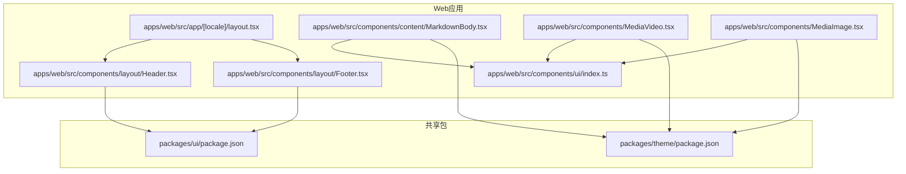
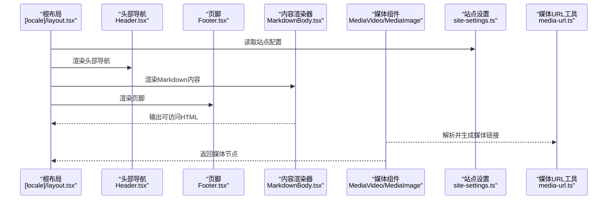
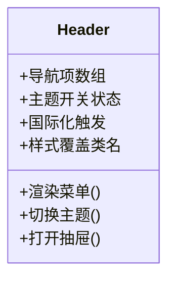
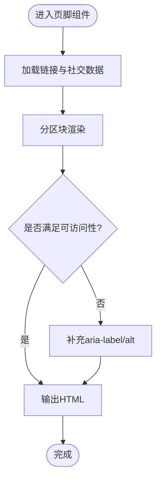
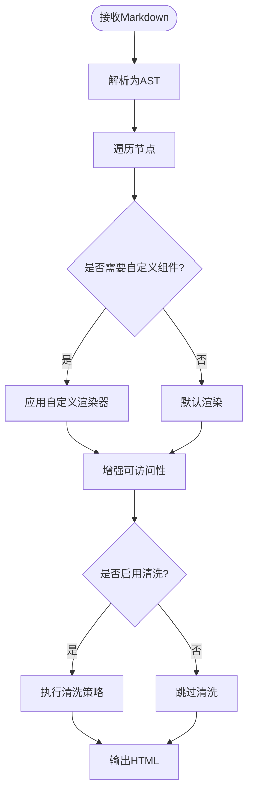
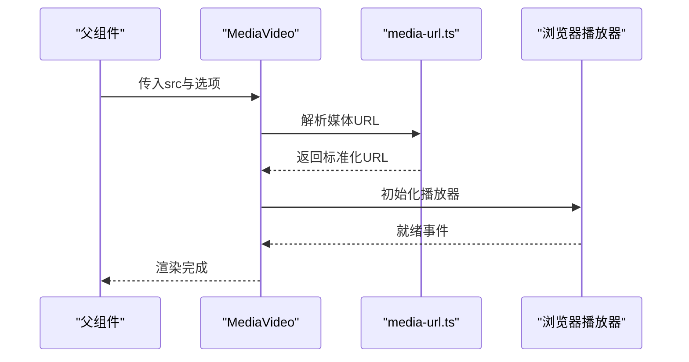
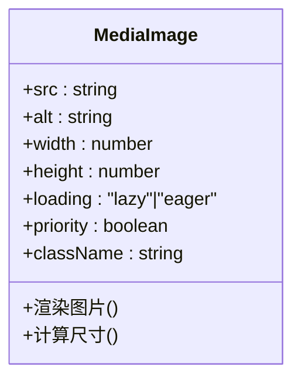
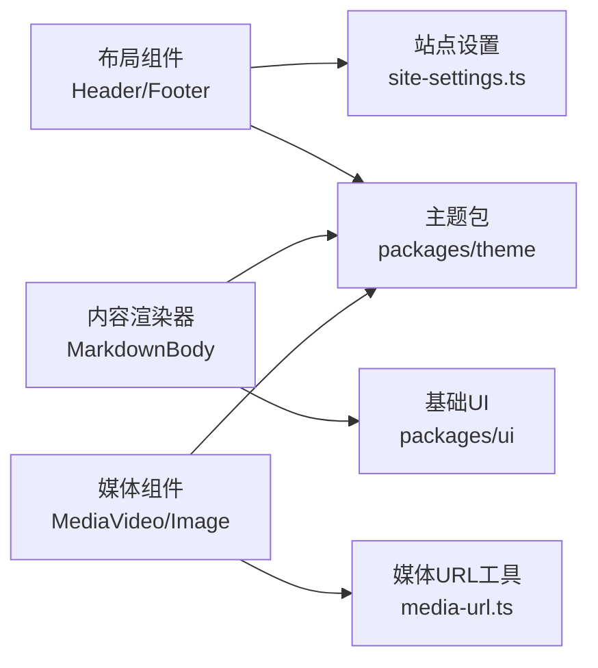

# UI组件系统

<cite>
**本文档引用的文件**   
- [apps/web/src/components/layout/Header.tsx](file://apps/web/src/components/layout/Header.tsx)
- [apps/web/src/components/layout/Footer.tsx](file://apps/web/src/components/layout/Footer.tsx)
- [apps/web/src/components/content/MarkdownBody.tsx](file://apps/web/src/components/content/MarkdownBody.tsx)
- [apps/web/src/components/MediaVideo.tsx](file://apps/web/src/components/MediaVideo.tsx)
- [apps/web/src/components/MediaImage.tsx](file://apps/web/src/components/MediaImage.tsx)
- [apps/web/src/components/ui/index.ts](file://apps/web/src/components/ui/index.ts)
- [apps/web/src/lib/site-settings.ts](file://apps/web/src/lib/site-settings.ts)
- [apps/web/src/lib/media-url.ts](file://apps/web/src/lib/media-url.ts)
- [apps/web/src/app/[locale]/layout.tsx](file://apps/web/src/app/[locale]/layout.tsx)
- [packages/theme/package.json](file://packages/theme/package.json)
- [packages/ui/package.json](file://packages/ui/package.json)
</cite>

## 目录
1. [简介](#简介)
2. [项目结构](#项目结构)
3. [核心组件](#核心组件)
4. [架构总览](#架构总览)
5. [详细组件分析](#详细组件分析)
6. [依赖关系分析](#依赖关系分析)
7. [性能考虑](#性能考虑)
8. [故障排查指南](#故障排查指南)
9. [结论](#结论)
10. [附录](#附录)

## 简介
本文件面向UI组件系统的开发者与使用者，系统化梳理基础UI组件、布局组件与内容展示组件的实现与用法。重点覆盖：
- 头部导航与页脚等布局组件的props接口、样式定制与响应式行为
- 内容渲染器（Markdown）与媒体播放器（视频/图片）的使用方式与可访问性支持
- 组件组合模式与自定义主题配置方法
- 性能优化建议与常见问题排查

## 项目结构
本项目采用多应用+包管理的工作区结构，前端Web应用位于 apps/web，通用UI与主题封装在 packages/ui 与 packages/theme。UI组件主要集中于 apps/web/src/components 下，按功能域划分（layout、content、media、ui等）。

图表来源 
- [apps/web/src/app/[locale]/layout.tsx:1-200](file://apps/web/src/app/[locale]/layout.tsx#L1-L200)
- [apps/web/src/components/layout/Header.tsx:1-200](file://apps/web/src/components/layout/Header.tsx#L1-L200)
- [apps/web/src/components/layout/Footer.tsx:1-200](file://apps/web/src/components/layout/Footer.tsx#L1-L200)
- [apps/web/src/components/content/MarkdownBody.tsx:1-200](file://apps/web/src/components/content/MarkdownBody.tsx#L1-L200)
- [apps/web/src/components/MediaVideo.tsx:1-200](file://apps/web/src/components/MediaVideo.tsx#L1-L200)
- [apps/web/src/components/MediaImage.tsx:1-200](file://apps/web/src/components/MediaImage.tsx#L1-L200)
- [apps/web/src/components/ui/index.ts:1-200](file://apps/web/src/components/ui/index.ts#L1-L200)
- [packages/ui/package.json:1-200](file://packages/ui/package.json#L1-L200)
- [packages/theme/package.json:1-200](file://packages/theme/package.json#L1-L200)

章节来源
- [apps/web/src/app/[locale]/layout.tsx:1-200](file://apps/web/src/app/[locale]/layout.tsx#L1-L200)

## 核心组件
本节概述UI组件体系中的关键模块及其职责：
- 布局组件：Header（头部导航）、Footer（页脚），负责页面骨架与全局交互入口
- 内容组件：MarkdownBody（Markdown内容渲染器），将结构化文本转换为可访问的HTML
- 媒体组件：MediaVideo、MediaImage，提供统一的媒体播放与展示能力
- 基础UI：ui/index.ts 作为基础控件的统一导出入口，便于主题化与复用

章节来源
- [apps/web/src/components/layout/Header.tsx:1-200](file://apps/web/src/components/layout/Header.tsx#L1-L200)
- [apps/web/src/components/layout/Footer.tsx:1-200](file://apps/web/src/components/layout/Footer.tsx#L1-L200)
- [apps/web/src/components/content/MarkdownBody.tsx:1-200](file://apps/web/src/components/content/MarkdownBody.tsx#L1-L200)
- [apps/web/src/components/MediaVideo.tsx:1-200](file://apps/web/src/components/MediaVideo.tsx#L1-L200)
- [apps/web/src/components/MediaImage.tsx:1-200](file://apps/web/src/components/MediaImage.tsx#L1-L200)
- [apps/web/src/components/ui/index.ts:1-200](file://apps/web/src/components/ui/index.ts#L1-L200)

## 架构总览
整体架构遵循“布局壳 + 内容渲染 + 媒体处理”的分层设计。根布局负责注入站点设置、语言与SEO元数据；布局组件承载导航与页脚；内容渲染器专注Markdown到HTML的转换；媒体组件统一处理资源加载与可访问性。

图表来源 
- [apps/web/src/app/[locale]/layout.tsx:1-200](file://apps/web/src/app/[locale]/layout.tsx#L1-L200)
- [apps/web/src/components/layout/Header.tsx:1-200](file://apps/web/src/components/layout/Header.tsx#L1-L200)
- [apps/web/src/components/layout/Footer.tsx:1-200](file://apps/web/src/components/layout/Footer.tsx#L1-L200)
- [apps/web/src/components/content/MarkdownBody.tsx:1-200](file://apps/web/src/components/content/MarkdownBody.tsx#L1-L200)
- [apps/web/src/components/MediaVideo.tsx:1-200](file://apps/web/src/components/MediaVideo.tsx#L1-L200)
- [apps/web/src/components/MediaImage.tsx:1-200](file://apps/web/src/components/MediaImage.tsx#L1-L200)
- [apps/web/src/lib/site-settings.ts:1-200](file://apps/web/src/lib/site-settings.ts#L1-L200)
- [apps/web/src/lib/media-url.ts:1-200](file://apps/web/src/lib/media-url.ts#L1-L200)

## 详细组件分析

### 头部导航（Header）
- 职责：提供顶部导航、品牌标识、主菜单与移动端抽屉入口；支持滚动隐藏/显示与无障碍标签
- Props接口要点：
  - 导航项列表：用于动态渲染菜单
  - 主题开关：控制明暗主题切换
  - 国际化触发器：切换语言或打开语言选择抽屉
  - 样式覆盖：通过className或CSS变量进行主题定制
- 响应式设计：在小屏设备自动切换为抽屉式导航，保持键盘可达性与焦点管理
- 可访问性：使用语义化nav与button元素，提供aria-label与role属性，确保屏幕阅读器友好

图表来源 
- [apps/web/src/components/layout/Header.tsx:1-200](file://apps/web/src/components/layout/Header.tsx#L1-L200)

章节来源
- [apps/web/src/components/layout/Header.tsx:1-200](file://apps/web/src/components/layout/Header.tsx#L1-L200)

### 页脚（Footer）
- 职责：展示版权信息、快速链接、社交媒体图标与联系方式；支持多语言与SEO结构化数据
- Props接口要点：
  - 链接集合：包含内部路由与外部链接
  - 社交渠道：图标与链接映射
  - 文案与版本：支持i18n与动态更新
- 样式定制：通过CSS变量与组件级样式覆盖实现品牌一致性
- 可访问性：链接具备明确描述文本，图标提供alt或aria-label

图表来源 
- [apps/web/src/components/layout/Footer.tsx:1-200](file://apps/web/src/components/layout/Footer.tsx#L1-L200)

章节来源
- [apps/web/src/components/layout/Footer.tsx:1-200](file://apps/web/src/components/layout/Footer.tsx#L1-L200)

### 内容渲染器（MarkdownBody）
- 职责：将Markdown字符串安全地转换为HTML，并注入可访问性增强与样式钩子
- Props接口要点：
  - markdown：输入Markdown字符串
  - components：自定义渲染器以替换默认元素（如a、img、code）
  - className：容器样式覆盖
  - sanitize：是否启用内容清洗策略
- 数据处理流程：
  - 解析Markdown为AST
  - 遍历节点并转换为HTML
  - 注入可访问性属性（标题层级、图片alt、代码块语言）
  - 可选清洗危险标签与事件处理器

图表来源 
- [apps/web/src/components/content/MarkdownBody.tsx:1-200](file://apps/web/src/components/content/MarkdownBody.tsx#L1-L200)

章节来源
- [apps/web/src/components/content/MarkdownBody.tsx:1-200](file://apps/web/src/components/content/MarkdownBody.tsx#L1-L200)

### 媒体播放器（MediaVideo）
- 职责：统一视频播放体验，支持懒加载、自适应尺寸、字幕与可访问性
- Props接口要点：
  - src：视频源地址
  - poster：封面图
  - controls：是否显示控制器
  - autoplay/muted/loop：播放行为
  - captions：字幕轨道
  - className：样式覆盖
- 响应式与性能：
  - 使用IntersectionObserver实现视口内加载
  - 根据设备类型选择合适的编码格式
  - 预加载策略与缓存优化

图表来源 
- [apps/web/src/components/MediaVideo.tsx:1-200](file://apps/web/src/components/MediaVideo.tsx#L1-L200)
- [apps/web/src/lib/media-url.ts:1-200](file://apps/web/src/lib/media-url.ts#L1-L200)

章节来源
- [apps/web/src/components/MediaVideo.tsx:1-200](file://apps/web/src/components/MediaVideo.tsx#L1-L200)
- [apps/web/src/lib/media-url.ts:1-200](file://apps/web/src/lib/media-url.ts#L1-L200)

### 媒体图片（MediaImage）
- 职责：提供高性能图片展示，支持占位符、懒加载、响应式尺寸与SEO优化
- Props接口要点：
  - src：图片地址
  - alt：替代文本（必需）
  - width/height：尺寸约束
  - loading：加载策略（lazy/eager）
  - priority：优先级标记
  - className：样式覆盖
- 可访问性与SEO：
  - 强制alt文本
  - 生成合适的meta描述
  - 支持结构化数据注入

图表来源 
- [apps/web/src/components/MediaImage.tsx:1-200](file://apps/web/src/components/MediaImage.tsx#L1-L200)

章节来源
- [apps/web/src/components/MediaImage.tsx:1-200](file://apps/web/src/components/MediaImage.tsx#L1-L200)

### 基础UI导出（ui/index.ts）
- 职责：集中导出基础UI控件（按钮、输入框、卡片、对话框等），统一主题接入点
- 设计原则：
  - 单一入口，简化导入路径
  - 暴露主题变量与样式钩子
  - 提供默认无障碍属性

章节来源
- [apps/web/src/components/ui/index.ts:1-200](file://apps/web/src/components/ui/index.ts#L1-L200)

## 依赖关系分析
组件间依赖清晰，布局组件依赖站点设置与国际化；内容渲染器依赖基础UI与主题；媒体组件依赖URL工具与播放器库。包层面通过packages/ui与packages/theme提供共享能力。

图表来源 
- [apps/web/src/components/layout/Header.tsx:1-200](file://apps/web/src/components/layout/Header.tsx#L1-L200)
- [apps/web/src/components/layout/Footer.tsx:1-200](file://apps/web/src/components/layout/Footer.tsx#L1-L200)
- [apps/web/src/components/content/MarkdownBody.tsx:1-200](file://apps/web/src/components/content/MarkdownBody.tsx#L1-L200)
- [apps/web/src/components/MediaVideo.tsx:1-200](file://apps/web/src/components/MediaVideo.tsx#L1-L200)
- [apps/web/src/components/MediaImage.tsx:1-200](file://apps/web/src/components/MediaImage.tsx#L1-L200)
- [apps/web/src/lib/site-settings.ts:1-200](file://apps/web/src/lib/site-settings.ts#L1-L200)
- [apps/web/src/lib/media-url.ts:1-200](file://apps/web/src/lib/media-url.ts#L1-L200)
- [packages/ui/package.json:1-200](file://packages/ui/package.json#L1-L200)
- [packages/theme/package.json:1-200](file://packages/theme/package.json#L1-L200)

章节来源
- [apps/web/src/app/[locale]/layout.tsx:1-200](file://apps/web/src/app/[locale]/layout.tsx#L1-L200)

## 性能考虑
- 懒加载与按需加载：媒体组件使用IntersectionObserver延迟加载非首屏资源
- 图片优化：自动选择合适格式与尺寸，避免重排重绘
- 代码分割：组件按路由与功能域拆分，减少初始包体积
- 缓存策略：静态资源与API响应合理缓存，提升重复访问速度
- 可访问性优先：确保键盘导航与屏幕阅读器兼容性，避免性能回退

## 故障排查指南
- 媒体加载失败：检查media-url.ts中的URL规范化逻辑与跨域配置
- Markdown渲染异常：确认sanitize策略未误删必要标签，检查自定义组件映射
- 主题不生效：验证packages/theme的变量注入顺序与CSS变量作用域
- 可访问性问题：使用浏览器无障碍检测工具验证ARIA属性与焦点顺序
- 性能瓶颈：通过Performance面板定位长任务与阻塞渲染

章节来源
- [apps/web/src/lib/media-url.ts:1-200](file://apps/web/src/lib/media-url.ts#L1-L200)
- [apps/web/src/components/content/MarkdownBody.tsx:1-200](file://apps/web/src/components/content/MarkdownBody.tsx#L1-L200)
- [packages/theme/package.json:1-200](file://packages/theme/package.json#L1-L200)

## 结论
本UI组件系统以清晰的职责划分与模块化设计为基础，提供了可扩展的布局、内容与媒体组件。通过统一的主题与基础UI导出，实现了良好的可维护性与品牌一致性。建议在后续迭代中继续强化可访问性测试与性能监控，确保用户体验与开发效率的双重提升。

## 附录
- 组件组合模式：推荐以“布局壳 + 内容渲染 + 媒体处理”的组合方式构建页面，避免单组件臃肿
- 自定义主题：通过CSS变量与主题包覆盖默认样式，确保跨组件一致性
- 响应式设计：优先使用流式布局与相对单位，结合媒体查询适配不同屏幕
- 可访问性清单：所有交互元素需具备语义化标签、键盘可达性与屏幕阅读器支持