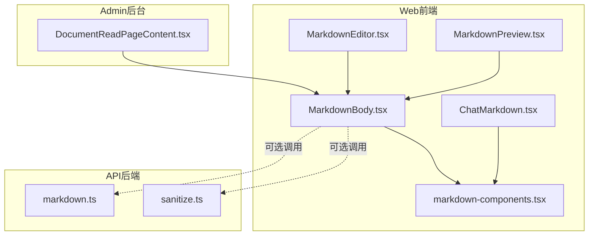
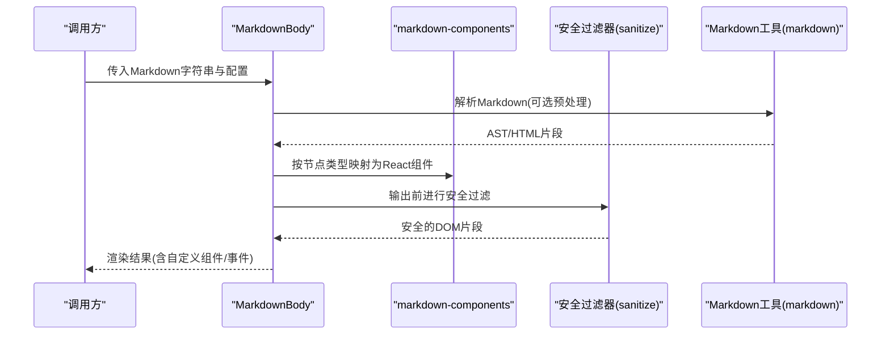
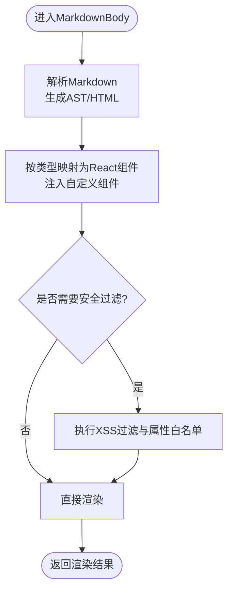
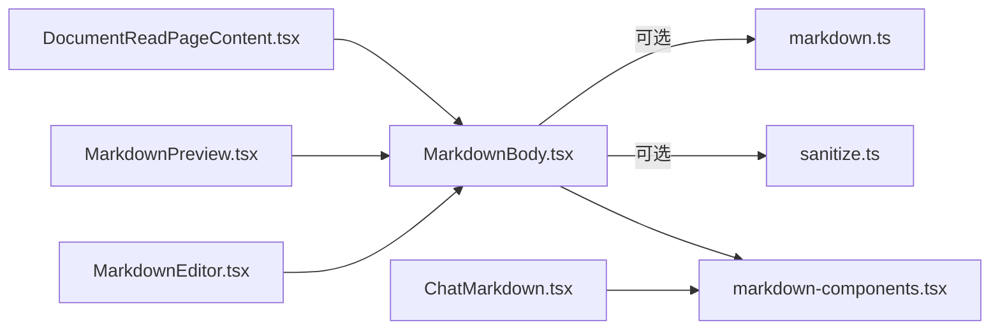

# Markdown渲染器

<cite>
**本文引用的文件**   
- [MarkdownBody.tsx](file://apps/web/src/components/content/MarkdownBody.tsx)
- [markdown-components.tsx](file://apps/web/src/components/content/markdown-components.tsx)
- [ChatMarkdown.tsx](file://apps/web/src/components/chat/ChatMarkdown.tsx)
- [MarkdownEditor.tsx](file://apps/admin/src/components/crud/MarkdownEditor.tsx)
- [MarkdownPreview.tsx](file://apps/admin/src/components/documents/MarkdownPreview.tsx)
- [DocumentReadPageContent.tsx](file://apps/admin/src/components/documents/DocumentReadPageContent.tsx)
- [sanitize.ts](file://apps/api/src/common/utils/sanitize.ts)
- [markdown.ts](file://apps/api/src/common/utils/markdown.ts)
- [package.json](file://apps/web/package.json)
- [package.json](file://apps/admin/package.json)
</cite>

## 目录
1. [简介](#简介)
2. [项目结构](#项目结构)
3. [核心组件](#核心组件)
4. [架构总览](#架构总览)
5. [详细组件分析](#详细组件分析)
6. [依赖关系分析](#依赖关系分析)
7. [性能优化策略](#性能优化策略)
8. [安全与XSS防护指南](#安全与xss防护指南)
9. [故障排查](#故障排查)
10. [结论](#结论)
11. [附录：扩展语法与配置清单](#附录扩展语法与配置清单)

## 简介
本文件面向Markdown渲染器的实现与使用，重点围绕MarkdownBody组件的解析、渲染与自定义集成，覆盖代码高亮、数学公式等高级能力，并提供内容安全过滤、XSS防护与安全配置建议。同时给出性能优化（懒加载、缓存、内存管理）和自定义渲染规则、特殊内容格式处理的最佳实践。

## 项目结构
本项目在前后端均涉及Markdown相关能力：
- 前端（Next.js应用）提供Markdown渲染组件与编辑器预览，支持丰富语法与交互。
- 后端（NestJS API）提供Markdown工具函数与内容清洗工具，用于服务端预处理与输出净化。

图表来源
- [MarkdownBody.tsx](file://apps/web/src/components/content/MarkdownBody.tsx)
- [markdown-components.tsx](file://apps/web/src/components/content/markdown-components.tsx)
- [ChatMarkdown.tsx](file://apps/web/src/components/chat/ChatMarkdown.tsx)
- [MarkdownEditor.tsx](file://apps/admin/src/components/crud/MarkdownEditor.tsx)
- [MarkdownPreview.tsx](file://apps/admin/src/components/documents/MarkdownPreview.tsx)
- [DocumentReadPageContent.tsx](file://apps/admin/src/components/documents/DocumentReadPageContent.tsx)
- [sanitize.ts](file://apps/api/src/common/utils/sanitize.ts)
- [markdown.ts](file://apps/api/src/common/utils/markdown.ts)

章节来源
- [MarkdownBody.tsx](file://apps/web/src/components/content/MarkdownBody.tsx)
- [markdown-components.tsx](file://apps/web/src/components/content/markdown-components.tsx)
- [ChatMarkdown.tsx](file://apps/web/src/components/chat/ChatMarkdown.tsx)
- [MarkdownEditor.tsx](file://apps/admin/src/components/crud/MarkdownEditor.tsx)
- [MarkdownPreview.tsx](file://apps/admin/src/components/documents/MarkdownPreview.tsx)
- [DocumentReadPageContent.tsx](file://apps/admin/src/components/documents/DocumentReadPageContent.tsx)
- [sanitize.ts](file://apps/api/src/common/utils/sanitize.ts)
- [markdown.ts](file://apps/api/src/common/utils/markdown.ts)

## 核心组件
- MarkdownBody：负责将Markdown字符串解析为可渲染的React节点树，并注入自定义组件、样式与事件处理。
- markdown-components：集中定义Markdown元素到React组件的映射，便于统一扩展与主题化。
- ChatMarkdown：聊天场景下的轻量Markdown渲染，侧重消息流中的快速渲染与交互。
- MarkdownEditor / MarkdownPreview：编辑与预览一体化，常用于后台内容管理。
- DocumentReadPageContent：文档阅读页的内容容器，通常包裹MarkdownBody进行展示。

章节来源
- [MarkdownBody.tsx](file://apps/web/src/components/content/MarkdownBody.tsx)
- [markdown-components.tsx](file://apps/web/src/components/content/markdown-components.tsx)
- [ChatMarkdown.tsx](file://apps/web/src/components/chat/ChatMarkdown.tsx)
- [MarkdownEditor.tsx](file://apps/admin/src/components/crud/MarkdownEditor.tsx)
- [MarkdownPreview.tsx](file://apps/admin/src/components/documents/MarkdownPreview.tsx)
- [DocumentReadPageContent.tsx](file://apps/admin/src/components/documents/DocumentReadPageContent.tsx)

## 架构总览
Markdown渲染的整体流程如下：
- 输入：Markdown字符串（可能来自数据库或外部接口）。
- 解析：通过Markdown解析库生成AST或HTML片段。
- 渲染：将AST/HTML映射为React组件树，注入自定义组件与事件。
- 安全：对输出进行XSS过滤与属性白名单校验。
- 增强：按需启用代码高亮、数学公式、表格、脚注等扩展。

图表来源
- [MarkdownBody.tsx](file://apps/web/src/components/content/MarkdownBody.tsx)
- [markdown-components.tsx](file://apps/web/src/components/content/markdown-components.tsx)
- [sanitize.ts](file://apps/api/src/common/utils/sanitize.ts)
- [markdown.ts](file://apps/api/src/common/utils/markdown.ts)

## 详细组件分析

### MarkdownBody组件
职责与要点：
- 接收Markdown字符串与渲染配置（如是否启用代码高亮、数学公式、自定义组件映射等）。
- 解析Markdown为中间表示（AST或HTML），再转换为React组件树。
- 通过markdown-components提供的映射表，将标题、段落、列表、链接、图片、表格、代码块等元素渲染为对应组件。
- 支持插入自定义组件（例如图表、卡片、富媒体），通过约定标记或钩子机制注入。
- 可选接入安全过滤器，确保最终输出的DOM片段符合安全策略。

图表来源
- [MarkdownBody.tsx](file://apps/web/src/components/content/MarkdownBody.tsx)
- [markdown-components.tsx](file://apps/web/src/components/content/markdown-components.tsx)
- [sanitize.ts](file://apps/api/src/common/utils/sanitize.ts)

章节来源
- [MarkdownBody.tsx](file://apps/web/src/components/content/MarkdownBody.tsx)
- [markdown-components.tsx](file://apps/web/src/components/content/markdown-components.tsx)

### markdown-components映射层
职责与要点：
- 集中维护Markdown元素到React组件的映射关系，便于统一扩展与主题化。
- 支持覆盖默认行为（如链接跳转、图片懒加载、代码块高亮）。
- 提供插槽式扩展点，允许在特定节点处插入业务组件（如图表、广告、交互卡片）。

章节来源
- [markdown-components.tsx](file://apps/web/src/components/content/markdown-components.tsx)

### ChatMarkdown聊天渲染
职责与要点：
- 针对聊天消息的轻量渲染，强调速度与简洁性。
- 通常禁用重型特性（如复杂数学公式），保留常用语法（粗体、斜体、代码、链接、图片）。
- 与MarkdownBody共享部分映射逻辑，但提供更精简的配置。

章节来源
- [ChatMarkdown.tsx](file://apps/web/src/components/chat/ChatMarkdown.tsx)

### MarkdownEditor与MarkdownPreview
职责与要点：
- MarkdownEditor提供所见即所得编辑体验，常基于Vditor或其他编辑器内核。
- MarkdownPreview实时预览编辑内容，复用MarkdownBody的渲染逻辑以保证一致性。
- 两者协同工作，提升内容创作效率与准确性。

章节来源
- [MarkdownEditor.tsx](file://apps/admin/src/components/crud/MarkdownEditor.tsx)
- [MarkdownPreview.tsx](file://apps/admin/src/components/documents/MarkdownPreview.tsx)

### DocumentReadPageContent文档阅读页
职责与要点：
- 作为文档阅读页的内容容器，通常包裹MarkdownBody进行展示。
- 负责布局、分页、锚点导航、打印样式等页面级能力。
- 与MarkdownBody解耦，仅关注展示与交互编排。

章节来源
- [DocumentReadPageContent.tsx](file://apps/admin/src/components/documents/DocumentReadPageContent.tsx)

## 依赖关系分析
- 前端依赖：
  - Markdown解析与渲染库（如marked、react-markdown、remark系列）。
  - 代码高亮库（如highlight.js或prism）。
  - 数学公式库（如KaTeX或MathJax）。
  - 编辑器内核（如Vditor，用于MarkdownEditor）。
- 后端依赖：
  - 内容清洗工具（如DOMPurify封装的sanitize.ts）。
  - Markdown工具函数（如markdown.ts，用于服务端预处理或转换）。

图表来源
- [MarkdownBody.tsx](file://apps/web/src/components/content/MarkdownBody.tsx)
- [markdown-components.tsx](file://apps/web/src/components/content/markdown-components.tsx)
- [ChatMarkdown.tsx](file://apps/web/src/components/chat/ChatMarkdown.tsx)
- [MarkdownEditor.tsx](file://apps/admin/src/components/crud/MarkdownEditor.tsx)
- [MarkdownPreview.tsx](file://apps/admin/src/components/documents/MarkdownPreview.tsx)
- [DocumentReadPageContent.tsx](file://apps/admin/src/components/documents/DocumentReadPageContent.tsx)
- [sanitize.ts](file://apps/api/src/common/utils/sanitize.ts)
- [markdown.ts](file://apps/api/src/common/utils/markdown.ts)

章节来源
- [package.json](file://apps/web/package.json)
- [package.json](file://apps/admin/package.json)

## 性能优化策略
- 懒加载：
  - 图片懒加载：仅在进入视口时加载，减少首屏压力。
  - 代码高亮按需加载：根据语言动态引入高亮模块。
  - 数学公式按需渲染：仅在包含公式的区块启用渲染。
- 缓存机制：
  - 对已解析的AST或HTML片段进行缓存，避免重复解析。
  - 对高成本渲染结果（如大型表格、复杂图表）进行局部缓存。
- 内存管理：
  - 及时释放大对象引用，避免内存泄漏。
  - 在组件卸载时清理事件监听与定时器。
- 渲染优化：
  - 使用React.memo或useMemo对静态内容进行记忆化。
  - 分片渲染长文档，避免主线程阻塞。

[本节为通用指导，不直接分析具体文件]

## 安全与XSS防护指南
- 输入验证：
  - 对Markdown源文本进行基础校验，拒绝非法字符或异常长度。
- 输出净化：
  - 使用sanitize.ts对渲染后的DOM片段进行XSS过滤，限制危险标签与属性。
  - 对链接协议进行白名单校验（仅允许http/https等安全协议）。
- 属性白名单：
  - 严格限定img、a、iframe等高风险元素的属性集合。
- 沙箱隔离：
  - 对第三方嵌入内容（如视频、图表）使用sandbox属性隔离执行环境。
- 服务端预处理：
  - 在markdown.ts中进行必要的预处理与清洗，确保入库数据的安全性。

章节来源
- [sanitize.ts](file://apps/api/src/common/utils/sanitize.ts)
- [markdown.ts](file://apps/api/src/common/utils/markdown.ts)

## 故障排查
- 渲染异常：
  - 检查Markdown语法是否正确，必要时在服务端进行格式化与校验。
  - 查看控制台错误日志，定位解析或渲染失败的具体节点。
- 性能问题：
  - 确认是否启用了不必要的重型特性（如全量数学公式渲染）。
  - 检查是否存在内存泄漏或未释放的资源。
- 安全问题：
  - 审查sanitize.ts的过滤规则，确保未遗漏危险标签或属性。
  - 对第三方嵌入内容进行安全评估与隔离。

章节来源
- [sanitize.ts](file://apps/api/src/common/utils/sanitize.ts)
- [markdown.ts](file://apps/api/src/common/utils/markdown.ts)

## 结论
MarkdownBody组件通过清晰的解析、映射与渲染流程，结合markdown-components的扩展机制，实现了灵活、安全且高性能的Markdown渲染能力。配合后端的sanitize与markdown工具，可在保证安全性的前提下，提供丰富的语法支持与自定义能力。通过合理的性能优化策略，可在大规模内容场景下保持稳定的用户体验。

[本节为总结性内容，不直接分析具体文件]

## 附录：扩展语法与配置清单
- 支持的Markdown语法扩展：
  - 表格、脚注、任务列表、删除线、上标/下标、数学公式、代码高亮。
- 自定义组件集成：
  - 通过markdown-components映射表注册自定义组件。
  - 使用约定标记或钩子机制在特定节点插入业务组件。
- 安全配置：
  - 配置sanitize.ts的白名单与过滤规则。
  - 对链接协议、图片域名、嵌入资源进行严格校验。
- 性能配置：
  - 启用懒加载与按需渲染。
  - 合理设置缓存策略与内存回收。

[本节为概念性说明，不直接分析具体文件]