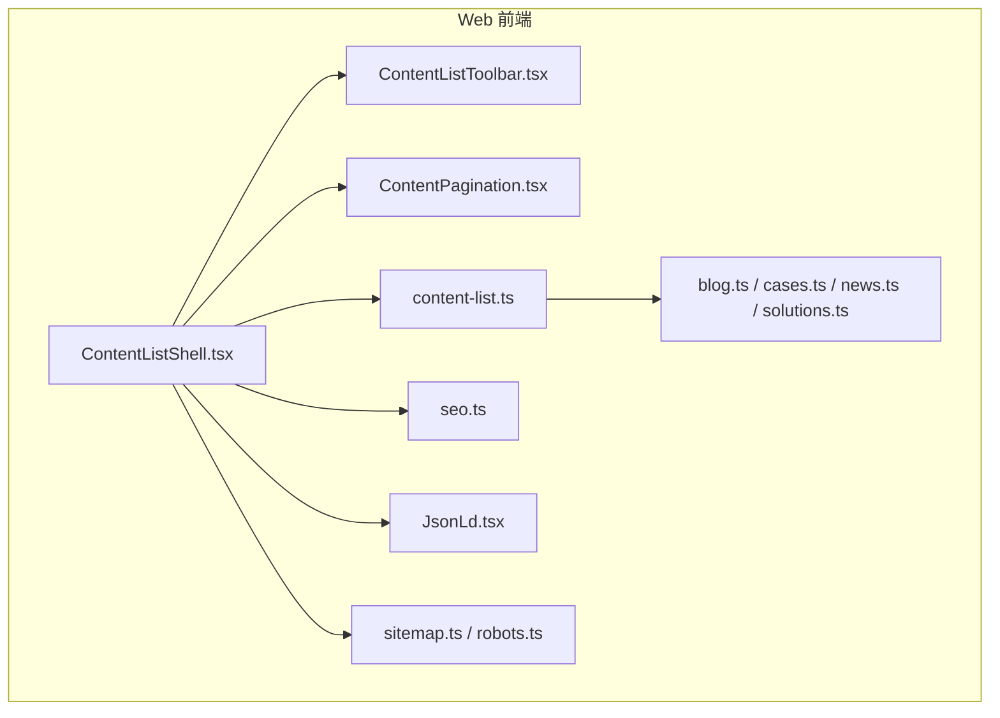
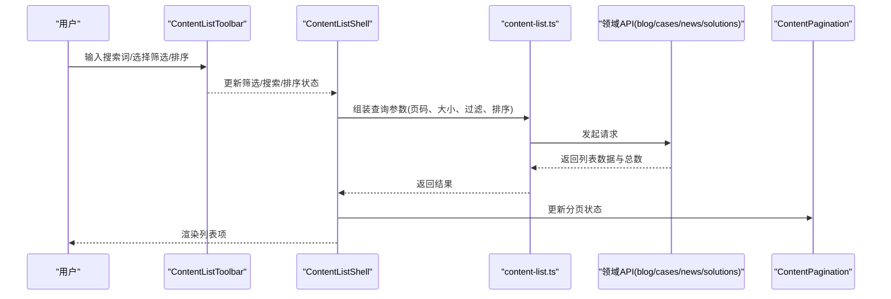
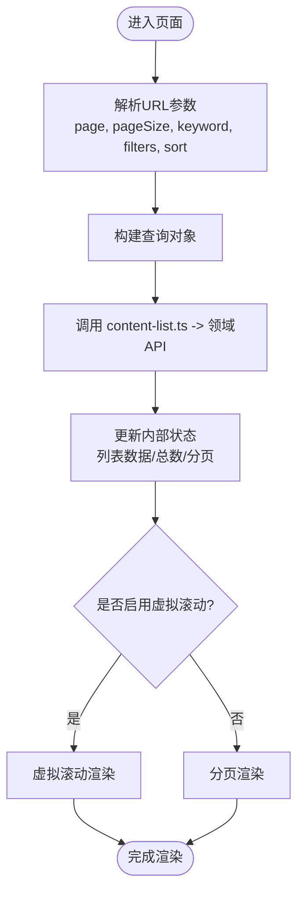
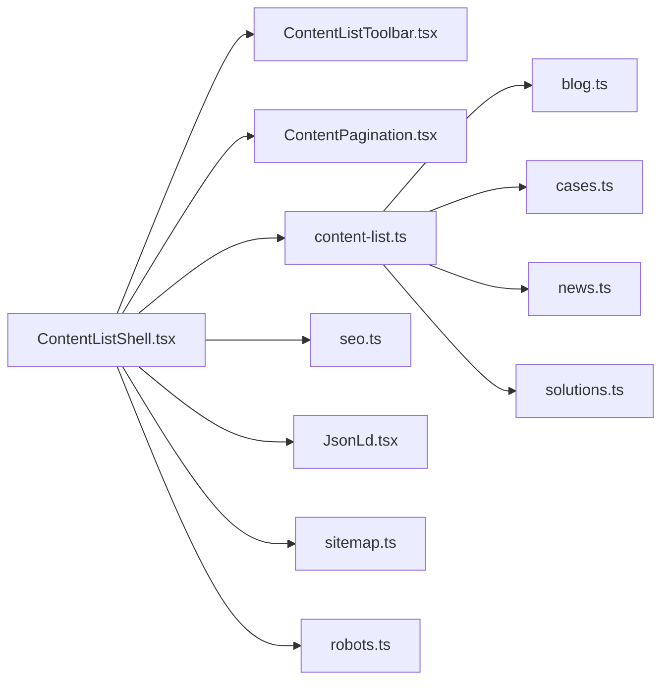

# 内容列表组件

<cite>
**本文引用的文件**   
- [ContentListShell.tsx](file://apps/web/src/components/content/ContentListShell.tsx)
- [ContentListToolbar.tsx](file://apps/web/src/components/content/ContentListToolbar.tsx)
- [ContentPagination.tsx](file://apps/web/src/components/content/ContentPagination.tsx)
- [content-list.ts](file://apps/web/src/lib/content-list.ts)
- [blog.ts](file://apps/web/src/lib/blog.ts)
- [cases.ts](file://apps/web/src/lib/cases.ts)
- [news.ts](file://apps/web/src/lib/news.ts)
- [solutions.ts](file://apps/web/src/lib/solutions.ts)
- [seo.ts](file://apps/web/src/lib/seo.ts)
- [JsonLd.tsx](file://apps/web/src/components/JsonLd.tsx)
- [sitemap.ts](file://apps/web/src/app/sitemap.ts)
- [robots.ts](file://apps/web/src/app/robots.ts)
</cite>

## 目录
1. [简介](#简介)
2. [项目结构](#项目结构)
3. [核心组件](#核心组件)
4. [架构总览](#架构总览)
5. [详细组件分析](#详细组件分析)
6. [依赖关系分析](#依赖关系分析)
7. [性能考量](#性能考量)
8. [故障排查指南](#故障排查指南)
9. [结论](#结论)
10. [附录](#附录)

## 简介
本文件面向“内容列表组件”的完整文档，重点围绕 ContentListShell 组件的架构设计、数据获取、状态管理与渲染优化展开。同时覆盖内容筛选、搜索与排序的实现与使用方式，响应式布局、虚拟滚动与分页集成的最佳实践，以及 SEO 优化策略（结构化数据、元标签、预渲染配置）。文末提供自定义样式、交互扩展与第三方服务集成的指导。

## 项目结构
内容列表相关的前端实现位于 apps/web/src/components/content 与 apps/web/src/lib 两个目录：
- components/content：UI 层组件，包括列表外壳、工具栏、分页等
- lib：领域数据模型与 API 调用封装，如博客、案例、新闻、解决方案等

图表来源
- [ContentListShell.tsx](file://apps/web/src/components/content/ContentListShell.tsx)
- [ContentListToolbar.tsx](file://apps/web/src/components/content/ContentListToolbar.tsx)
- [ContentPagination.tsx](file://apps/web/src/components/content/ContentPagination.tsx)
- [content-list.ts](file://apps/web/src/lib/content-list.ts)
- [blog.ts](file://apps/web/src/lib/blog.ts)
- [cases.ts](file://apps/web/src/lib/cases.ts)
- [news.ts](file://apps/web/src/lib/news.ts)
- [solutions.ts](file://apps/web/src/lib/solutions.ts)
- [seo.ts](file://apps/web/src/lib/seo.ts)
- [JsonLd.tsx](file://apps/web/src/components/JsonLd.tsx)
- [sitemap.ts](file://apps/web/src/app/sitemap.ts)
- [robots.ts](file://apps/web/src/app/robots.ts)

章节来源
- [ContentListShell.tsx](file://apps/web/src/components/content/ContentListShell.tsx)
- [content-list.ts](file://apps/web/src/lib/content-list.ts)

## 核心组件
- ContentListShell：内容列表的外壳容器，负责统一的数据获取、状态管理、筛选/搜索/排序参数与 URL 同步、SEO 元信息注入、分页与工具栏集成。
- ContentListToolbar：工具栏，提供搜索框、筛选器、排序选择器等交互入口，并与 Shell 进行双向状态同步。
- ContentPagination：分页控件，支持页码切换、每页条数设置、跳转等，与 Shell 的状态联动。

章节来源
- [ContentListShell.tsx](file://apps/web/src/components/content/ContentListShell.tsx)
- [ContentListToolbar.tsx](file://apps/web/src/components/content/ContentListToolbar.tsx)
- [ContentPagination.tsx](file://apps/web/src/components/content/ContentPagination.tsx)

## 架构总览
ContentListShell 采用“数据驱动 + 状态集中”的架构模式：
- 数据获取：通过 lib 层的领域 API（如 blog.ts、cases.ts、news.ts、solutions.ts）拉取列表数据，统一由 content-list.ts 抽象查询参数与返回结构。
- 状态管理：在组件内维护筛选、搜索、排序、分页等状态，并通过 URL 同步，保证可分享与可回退。
- 渲染优化：结合分页与可选的虚拟滚动策略，减少首屏 DOM 节点数量；对图片等资源进行懒加载与占位优化。
- SEO：根据当前列表上下文生成结构化数据与元标签，配合 sitemap/robots 提升索引质量。

图表来源
- [ContentListShell.tsx](file://apps/web/src/components/content/ContentListShell.tsx)
- [ContentListToolbar.tsx](file://apps/web/src/components/content/ContentListToolbar.tsx)
- [ContentPagination.tsx](file://apps/web/src/components/content/ContentPagination.tsx)
- [content-list.ts](file://apps/web/src/lib/content-list.ts)
- [blog.ts](file://apps/web/src/lib/blog.ts)
- [cases.ts](file://apps/web/src/lib/cases.ts)
- [news.ts](file://apps/web/src/lib/news.ts)
- [solutions.ts](file://apps/web/src/lib/solutions.ts)

## 详细组件分析

### ContentListShell 组件
职责与流程
- 初始化：解析 URL 中的查询参数（如 page、pageSize、keyword、filters、sort），并映射为内部状态。
- 数据获取：将状态转换为查询对象，调用 content-list.ts 提供的统一接口，再分发到具体领域 API。
- 状态同步：当用户通过 Toolbar 或 Pagination 修改状态时，同步更新 URL，避免状态漂移。
- SEO 注入：基于当前列表类型、标题、描述、关键词等生成 JSON-LD 与元标签。
- 渲染策略：根据设备与数据量选择分页或虚拟滚动；对图片与媒体资源启用懒加载与占位图。

关键能力
- 筛选：支持按分类、标签、时间范围等多维度过滤，参数序列化到 URL。
- 搜索：支持关键词模糊匹配，防抖处理，避免频繁请求。
- 排序：支持按时间、热度、评分等字段排序，支持升/降序切换。
- 分页：默认分页，可选虚拟滚动以提升大数据量体验。
- SEO：自动生成结构化数据与元标签，配合站点地图与 robots 控制抓取。

图表来源
- [ContentListShell.tsx](file://apps/web/src/components/content/ContentListShell.tsx)
- [content-list.ts](file://apps/web/src/lib/content-list.ts)

章节来源
- [ContentListShell.tsx](file://apps/web/src/components/content/ContentListShell.tsx)
- [content-list.ts](file://apps/web/src/lib/content-list.ts)

### ContentListToolbar 组件
职责与交互
- 搜索框：输入关键词，触发防抖后更新 Shell 的搜索状态。
- 筛选器：下拉或多选筛选，支持组合条件，更新 Shell 的 filters 状态。
- 排序器：选择排序字段与方向，更新 Shell 的 sort 状态。
- 重置按钮：一键清空筛选与搜索，恢复默认状态。

与 Shell 的协作
- 通过回调或上下文将状态变更上报给 Shell。
- 保持 UI 与 URL 的一致性，确保刷新后可恢复。

章节来源
- [ContentListToolbar.tsx](file://apps/web/src/components/content/ContentListToolbar.tsx)

### ContentPagination 组件
职责与行为
- 页码导航：上一页/下一页、跳页、显示当前页码。
- 每页条数：支持切换 pageSize，影响后端分页大小。
- 状态同步：与 Shell 的 page/pageSize 状态双向绑定，并同步至 URL。

章节来源
- [ContentPagination.tsx](file://apps/web/src/components/content/ContentPagination.tsx)

### 数据层与领域 API
- content-list.ts：定义统一的查询参数结构与转换逻辑，屏蔽不同领域的差异。
- blog.ts / cases.ts / news.ts / solutions.ts：各自实现对应领域的列表查询、过滤、排序与分页逻辑。

章节来源
- [content-list.ts](file://apps/web/src/lib/content-list.ts)
- [blog.ts](file://apps/web/src/lib/blog.ts)
- [cases.ts](file://apps/web/src/lib/cases.ts)
- [news.ts](file://apps/web/src/lib/news.ts)
- [solutions.ts](file://apps/web/src/lib/solutions.ts)

### SEO 与结构化数据
- seo.ts：提供生成元标签、Open Graph、Twitter Card 等的方法。
- JsonLd.tsx：用于注入 JSON-LD 结构化数据，增强搜索引擎理解。
- sitemap.ts / robots.ts：站点地图与抓取规则，辅助 SEO 收录。

章节来源
- [seo.ts](file://apps/web/src/lib/seo.ts)
- [JsonLd.tsx](file://apps/web/src/components/JsonLd.tsx)
- [sitemap.ts](file://apps/web/src/app/sitemap.ts)
- [robots.ts](file://apps/web/src/app/robots.ts)

## 依赖关系分析
ContentListShell 依赖 UI 子组件与数据层模块，形成清晰的层次结构：
- UI 层：ContentListToolbar、ContentPagination
- 数据层：content-list.ts 与各领域 API
- SEO 层：seo.ts、JsonLd.tsx、sitemap.ts、robots.ts

图表来源
- [ContentListShell.tsx](file://apps/web/src/components/content/ContentListShell.tsx)
- [ContentListToolbar.tsx](file://apps/web/src/components/content/ContentListToolbar.tsx)
- [ContentPagination.tsx](file://apps/web/src/components/content/ContentPagination.tsx)
- [content-list.ts](file://apps/web/src/lib/content-list.ts)
- [blog.ts](file://apps/web/src/lib/blog.ts)
- [cases.ts](file://apps/web/src/lib/cases.ts)
- [news.ts](file://apps/web/src/lib/news.ts)
- [solutions.ts](file://apps/web/src/lib/solutions.ts)
- [seo.ts](file://apps/web/src/lib/seo.ts)
- [JsonLd.tsx](file://apps/web/src/components/JsonLd.tsx)
- [sitemap.ts](file://apps/web/src/app/sitemap.ts)
- [robots.ts](file://apps/web/src/app/robots.ts)

章节来源
- [ContentListShell.tsx](file://apps/web/src/components/content/ContentListShell.tsx)
- [content-list.ts](file://apps/web/src/lib/content-list.ts)

## 性能考量
- 分页优先：默认使用分页减少首屏 DOM 节点，提高渲染速度。
- 虚拟滚动：当列表项较多且需要连续浏览时，启用虚拟滚动仅渲染可视区域，降低内存占用与重排开销。
- 防抖搜索：对搜索输入进行防抖，减少不必要的请求。
- 懒加载媒体：图片与视频延迟加载，配合占位图提升感知性能。
- 缓存策略：对热点列表数据做短期缓存，避免重复请求。
- 服务端分页：尽量将分页、过滤、排序下沉到服务端，减少前端计算压力。

[本节为通用性能建议，不直接分析具体文件]

## 故障排查指南
常见问题与定位方法
- 列表无数据：检查 URL 参数是否正确传递，确认 content-list.ts 的查询对象构造逻辑；查看领域 API 返回结构是否符合预期。
- 搜索无效：确认防抖配置与触发时机；检查关键词字段映射与服务端匹配逻辑。
- 筛选不生效：核对 filters 字段命名与枚举值；确保 URL 同步与状态更新顺序正确。
- 分页异常：验证 page/pageSize 边界条件；检查总数与页码计算逻辑。
- SEO 未生效：确认 JSON-LD 注入位置与格式；检查 sitemap/robots 配置是否允许抓取。

章节来源
- [ContentListShell.tsx](file://apps/web/src/components/content/ContentListShell.tsx)
- [content-list.ts](file://apps/web/src/lib/content-list.ts)
- [seo.ts](file://apps/web/src/lib/seo.ts)
- [JsonLd.tsx](file://apps/web/src/components/JsonLd.tsx)
- [sitemap.ts](file://apps/web/src/app/sitemap.ts)
- [robots.ts](file://apps/web/src/app/robots.ts)

## 结论
ContentListShell 以清晰的分层与职责划分，实现了内容列表的数据获取、状态管理、渲染优化与 SEO 注入的一体化方案。通过 Toolbar 与 Pagination 的协同，提供了良好的用户体验；借助 content-list.ts 的统一抽象，便于扩展新的内容类型。建议在大数据场景下引入虚拟滚动，并结合服务端分页与缓存策略进一步提升性能。

[本节为总结性内容，不直接分析具体文件]

## 附录

### 使用方法与最佳实践
- 数据获取：在 Shell 中传入列表类型标识，由 content-list.ts 路由到对应领域 API。
- 筛选与搜索：在 Toolbar 中配置可用的筛选项与搜索字段，确保与后端一致。
- 排序：定义支持的排序字段与方向，避免非法排序键。
- 响应式布局：在小屏设备上隐藏次要筛选项，提供抽屉式筛选面板。
- 虚拟滚动：当列表项超过阈值（如 100）时启用，设置合适的行高与缓冲区。
- 分页集成：保持 page/pageSize 与 URL 同步，支持书签与分享。

章节来源
- [ContentListShell.tsx](file://apps/web/src/components/content/ContentListShell.tsx)
- [ContentListToolbar.tsx](file://apps/web/src/components/content/ContentListToolbar.tsx)
- [ContentPagination.tsx](file://apps/web/src/components/content/ContentPagination.tsx)
- [content-list.ts](file://apps/web/src/lib/content-list.ts)

### SEO 优化策略
- 结构化数据：使用 JsonLd.tsx 注入 Article/ListPage 等结构化数据，提升搜索结果展示。
- 元标签：通过 seo.ts 动态生成 title、description、keywords、OG/Twitter 卡片。
- 预渲染：对静态列表页启用预渲染，确保首屏内容与 SEO 友好。
- 站点地图：在 sitemap.ts 中列出所有列表页路径，帮助搜索引擎发现。
- robots 配置：合理设置 allow/disallow，控制抓取范围。

章节来源
- [seo.ts](file://apps/web/src/lib/seo.ts)
- [JsonLd.tsx](file://apps/web/src/components/JsonLd.tsx)
- [sitemap.ts](file://apps/web/src/app/sitemap.ts)
- [robots.ts](file://apps/web/src/app/robots.ts)

### 自定义样式与交互
- 样式定制：通过 CSS 变量或主题系统覆盖列表项卡片、工具栏与分页样式。
- 交互扩展：在 Toolbar 中添加收藏、导出、批量操作等功能，与 Shell 状态联动。
- 第三方服务：集成评论、统计、推荐等服务，注意隐私与性能影响。

章节来源
- [ContentListToolbar.tsx](file://apps/web/src/components/content/ContentListToolbar.tsx)
- [ContentListShell.tsx](file://apps/web/src/components/content/ContentListShell.tsx)