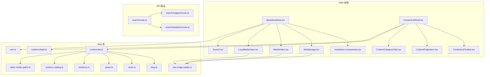
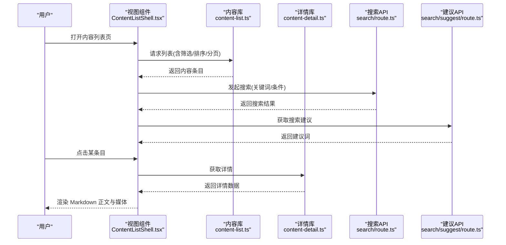
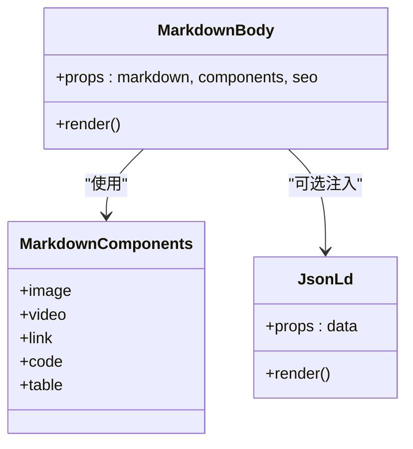
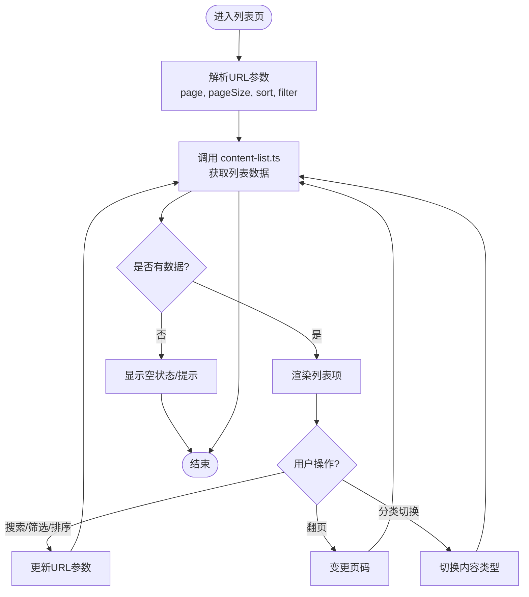
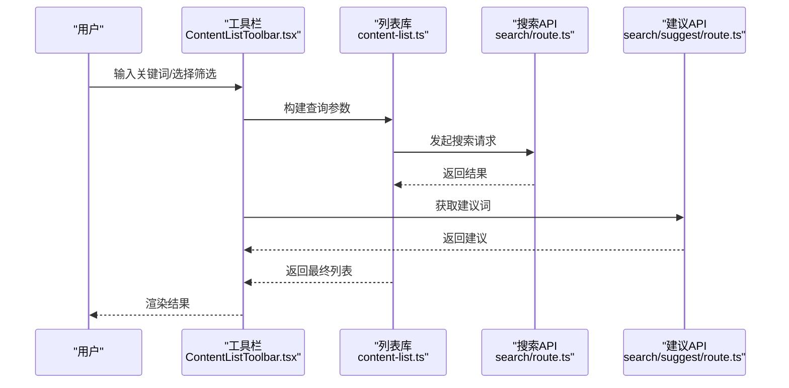
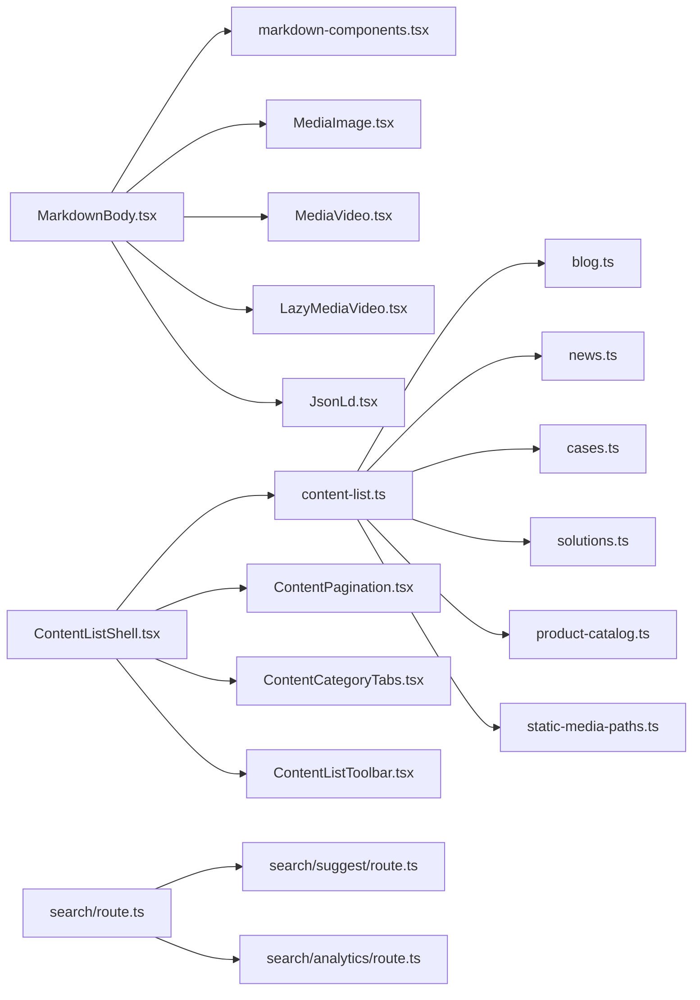

# 内容展示组件

<cite>
**本文引用的文件**   
- [MarkdownBody.tsx](file://apps/web/src/components/content/MarkdownBody.tsx)
- [markdown-components.tsx](file://apps/web/src/components/content/markdown-components.tsx)
- [ContentListShell.tsx](file://apps/web/src/components/content/ContentListShell.tsx)
- [ContentListToolbar.tsx](file://apps/web/src/components/content/ContentListToolbar.tsx)
- [ContentPagination.tsx](file://apps/web/src/components/content/ContentPagination.tsx)
- [ContentCategoryTabs.tsx](file://apps/web/src/components/content/ContentCategoryTabs.tsx)
- [content-list.ts](file://apps/web/src/lib/content-list.ts)
- [content-detail.ts](file://apps/web/src/lib/content-detail.ts)
- [seo.ts](file://apps/web/src/lib/seo.ts)
- [oss-image-loader.ts](file://apps/web/src/lib/oss-image-loader.ts)
- [MediaImage.tsx](file://apps/web/src/components/MediaImage.tsx)
- [MediaVideo.tsx](file://apps/web/src/components/MediaVideo.tsx)
- [LazyMediaVideo.tsx](file://apps/web/src/components/LazyMediaVideo.tsx)
- [JsonLd.tsx](file://apps/web/src/components/JsonLd.tsx)
- [route.ts](file://apps/web/src/app/api/search/route.ts)
- [suggest/route.ts](file://apps/web/src/app/api/search/suggest/route.ts)
- [analytics/route.ts](file://apps/web/src/app/api/search/analytics/route.ts)
- [blog.ts](file://apps/web/src/lib/blog.ts)
- [news.ts](file://apps/web/src/lib/news.ts)
- [cases.ts](file://apps/web/src/lib/cases.ts)
- [solutions.ts](file://apps/web/src/lib/solutions.ts)
- [product-catalog.ts](file://apps/web/src/lib/product-catalog.ts)
- [static-media-paths.ts](file://apps/web/src/lib/static-media-paths.ts)
</cite>

## 目录
1. [简介](#简介)
2. [项目结构](#项目结构)
3. [核心组件](#核心组件)
4. [架构总览](#架构总览)
5. [详细组件分析](#详细组件分析)
6. [依赖关系分析](#依赖关系分析)
7. [性能考量](#性能考量)
8. [故障排查指南](#故障排查指南)
9. [结论](#结论)
10. [附录](#附录)

## 简介
本文件面向“内容展示组件”的完整实现与使用，覆盖 Markdown 渲染器、内容列表、分页器、分类标签等关键能力；并说明富文本处理、SEO 优化、性能优化策略，以及搜索、过滤、排序的集成方式。同时提供自定义内容模板与样式的配置方法，帮助开发者快速搭建高质量的内容页面。

## 项目结构
内容展示相关代码主要分布在 web 应用的前端组件与库中：
- 组件层：Markdown 渲染、内容列表壳、工具栏、分页、分类标签、媒体展示等
- 逻辑层：内容列表查询、详情获取、SEO 元数据生成、图片加载器等
- API 层：搜索建议与分析上报接口

图表来源
- [MarkdownBody.tsx](file://apps/web/src/components/content/MarkdownBody.tsx)
- [markdown-components.tsx](file://apps/web/src/components/content/markdown-components.tsx)
- [ContentListShell.tsx](file://apps/web/src/components/content/ContentListShell.tsx)
- [ContentListToolbar.tsx](file://apps/web/src/components/content/ContentListToolbar.tsx)
- [ContentPagination.tsx](file://apps/web/src/components/content/ContentPagination.tsx)
- [ContentCategoryTabs.tsx](file://apps/web/src/components/content/ContentCategoryTabs.tsx)
- [content-list.ts](file://apps/web/src/lib/content-list.ts)
- [content-detail.ts](file://apps/web/src/lib/content-detail.ts)
- [seo.ts](file://apps/web/src/lib/seo.ts)
- [oss-image-loader.ts](file://apps/web/src/lib/oss-image-loader.ts)
- [MediaImage.tsx](file://apps/web/src/components/MediaImage.tsx)
- [MediaVideo.tsx](file://apps/web/src/components/MediaVideo.tsx)
- [LazyMediaVideo.tsx](file://apps/web/src/components/LazyMediaVideo.tsx)
- [JsonLd.tsx](file://apps/web/src/components/JsonLd.tsx)
- [route.ts](file://apps/web/src/app/api/search/route.ts)
- [suggest/route.ts](file://apps/web/src/app/api/search/suggest/route.ts)
- [analytics/route.ts](file://apps/web/src/app/api/search/analytics/route.ts)
- [blog.ts](file://apps/web/src/lib/blog.ts)
- [news.ts](file://apps/web/src/lib/news.ts)
- [cases.ts](file://apps/web/src/lib/cases.ts)
- [solutions.ts](file://apps/web/src/lib/solutions.ts)
- [product-catalog.ts](file://apps/web/src/lib/product-catalog.ts)
- [static-media-paths.ts](file://apps/web/src/lib/static-media-paths.ts)

章节来源
- [MarkdownBody.tsx](file://apps/web/src/components/content/MarkdownBody.tsx)
- [ContentListShell.tsx](file://apps/web/src/components/content/ContentListShell.tsx)
- [content-list.ts](file://apps/web/src/lib/content-list.ts)
- [seo.ts](file://apps/web/src/lib/seo.ts)
- [oss-image-loader.ts](file://apps/web/src/lib/oss-image-loader.ts)

## 核心组件
- Markdown 渲染器：负责将 Markdown 源转换为可访问、可样式化的 HTML，并内嵌媒体与结构化数据
- 内容列表壳：统一承载列表数据、筛选、排序、分页与分类标签
- 分页器：基于服务端或客户端的分页参数控制
- 分类标签：按类型/领域切换内容集合
- 媒体组件：图片与视频懒加载、尺寸适配、CDN 优化
- SEO 组件：动态注入标题、描述、OpenGraph、JSON-LD 等

章节来源
- [MarkdownBody.tsx](file://apps/web/src/components/content/MarkdownBody.tsx)
- [markdown-components.tsx](file://apps/web/src/components/content/markdown-components.tsx)
- [ContentListShell.tsx](file://apps/web/src/components/content/ContentListShell.tsx)
- [ContentListToolbar.tsx](file://apps/web/src/components/content/ContentListToolbar.tsx)
- [ContentPagination.tsx](file://apps/web/src/components/content/ContentPagination.tsx)
- [ContentCategoryTabs.tsx](file://apps/web/src/components/content/ContentCategoryTabs.tsx)
- [MediaImage.tsx](file://apps/web/src/components/MediaImage.tsx)
- [MediaVideo.tsx](file://apps/web/src/components/MediaVideo.tsx)
- [LazyMediaVideo.tsx](file://apps/web/src/components/LazyMediaVideo.tsx)
- [JsonLd.tsx](file://apps/web/src/components/JsonLd.tsx)

## 架构总览
内容展示采用“组件 + 库 + API”的分层设计：
- 组件层关注 UI 与交互（渲染、分页、筛选、标签）
- 库层封装数据获取、格式化、SEO 与媒体加载策略
- API 层提供搜索建议与分析上报

图表来源
- [ContentListShell.tsx](file://apps/web/src/components/content/ContentListShell.tsx)
- [content-list.ts](file://apps/web/src/lib/content-list.ts)
- [content-detail.ts](file://apps/web/src/lib/content-detail.ts)
- [route.ts](file://apps/web/src/app/api/search/route.ts)
- [suggest/route.ts](file://apps/web/src/app/api/search/suggest/route.ts)

## 详细组件分析

### Markdown 渲染器
- 功能要点
  - 将 Markdown 转换为 HTML，支持标题、段落、列表、表格、代码块、链接、图片、视频等
  - 通过自定义组件映射丰富渲染能力（如媒体、结构化数据）
  - 结合 SEO 组件注入页面元信息
- 使用方式
  - 在详情页直接传入 Markdown 字符串进行渲染
  - 通过扩展点替换默认组件以定制样式与行为
- 性能与安全
  - 对图片/视频启用懒加载与尺寸占位
  - 对输入内容进行安全过滤（由库层或中间件保障）

图表来源
- [MarkdownBody.tsx](file://apps/web/src/components/content/MarkdownBody.tsx)
- [markdown-components.tsx](file://apps/web/src/components/content/markdown-components.tsx)
- [JsonLd.tsx](file://apps/web/src/components/JsonLd.tsx)

章节来源
- [MarkdownBody.tsx](file://apps/web/src/components/content/MarkdownBody.tsx)
- [markdown-components.tsx](file://apps/web/src/components/content/markdown-components.tsx)
- [JsonLd.tsx](file://apps/web/src/components/JsonLd.tsx)

### 内容列表壳与工具栏
- 功能要点
  - 统一承载列表数据、筛选、排序、分页与分类标签
  - 工具栏提供搜索框、筛选器、排序选择器、每页条数设置
- 数据流
  - 从 content-list.ts 拉取列表数据，支持服务端分页与过滤
  - 根据分类标签切换内容类型（博客、新闻、案例、解决方案等）
- 可配置项
  - 支持的字段、排序规则、筛选维度、分页大小

图表来源
- [ContentListShell.tsx](file://apps/web/src/components/content/ContentListShell.tsx)
- [ContentListToolbar.tsx](file://apps/web/src/components/content/ContentListToolbar.tsx)
- [content-list.ts](file://apps/web/src/lib/content-list.ts)

章节来源
- [ContentListShell.tsx](file://apps/web/src/components/content/ContentListShell.tsx)
- [ContentListToolbar.tsx](file://apps/web/src/components/content/ContentListToolbar.tsx)
- [content-list.ts](file://apps/web/src/lib/content-list.ts)

### 分页器
- 功能要点
  - 支持页码跳转、上一页/下一页、每页条数切换
  - 与 URL 状态同步，便于分享与回退
- 集成方式
  - 作为 ContentListShell 的子组件，接收当前页、总数、回调函数

章节来源
- [ContentPagination.tsx](file://apps/web/src/components/content/ContentPagination.tsx)

### 分类标签
- 功能要点
  - 按内容类型（博客、新闻、案例、解决方案等）切换
  - 切换时触发列表重新加载并保持 URL 一致
- 集成方式
  - 与 ContentListShell 联动，传递分类标识

章节来源
- [ContentCategoryTabs.tsx](file://apps/web/src/components/content/ContentCategoryTabs.tsx)

### 媒体组件（图片/视频）
- 功能要点
  - 图片懒加载、占位图、自适应尺寸、CDN 裁剪
  - 视频懒加载与自动播放策略控制
- 性能优化
  - 使用 oss-image-loader.ts 进行图片路径转换与压缩
  - 静态资源路径由 static-media-paths.ts 管理

章节来源
- [MediaImage.tsx](file://apps/web/src/components/MediaImage.tsx)
- [MediaVideo.tsx](file://apps/web/src/components/MediaVideo.tsx)
- [LazyMediaVideo.tsx](file://apps/web/src/components/LazyMediaVideo.tsx)
- [oss-image-loader.ts](file://apps/web/src/lib/oss-image-loader.ts)
- [static-media-paths.ts](file://apps/web/src/lib/static-media-paths.ts)

### SEO 与结构化数据
- 功能要点
  - 动态设置页面标题、描述、OpenGraph、Twitter Card
  - 注入 JSON-LD 结构化数据以提升搜索引擎理解
- 集成方式
  - 在详情页或列表页按需引入 seo.ts 与 JsonLd.tsx

章节来源
- [seo.ts](file://apps/web/src/lib/seo.ts)
- [JsonLd.tsx](file://apps/web/src/components/JsonLd.tsx)

### 搜索、过滤与排序集成
- 搜索
  - 通过 search/route.ts 提供全文检索与建议词
  - 支持关键词、分类、时间范围等过滤条件
- 过滤与排序
  - 在 content-list.ts 中定义字段映射与排序规则
  - 工具栏组件负责参数收集与 URL 同步
- 分析上报
  - search/analytics/route.ts 用于记录搜索行为

图表来源
- [ContentListToolbar.tsx](file://apps/web/src/components/content/ContentListToolbar.tsx)
- [content-list.ts](file://apps/web/src/lib/content-list.ts)
- [route.ts](file://apps/web/src/app/api/search/route.ts)
- [suggest/route.ts](file://apps/web/src/app/api/search/suggest/route.ts)

章节来源
- [ContentListToolbar.tsx](file://apps/web/src/components/content/ContentListToolbar.tsx)
- [content-list.ts](file://apps/web/src/lib/content-list.ts)
- [route.ts](file://apps/web/src/app/api/search/route.ts)
- [suggest/route.ts](file://apps/web/src/app/api/search/suggest/route.ts)
- [analytics/route.ts](file://apps/web/src/app/api/search/analytics/route.ts)

### 内容类型库（博客/新闻/案例/解决方案/产品目录）
- 作用
  - 为不同内容类型提供统一的字段映射、查询方法与默认排序
- 使用
  - 在 content-list.ts 中组合各类型库，实现多类型列表的统一入口

章节来源
- [blog.ts](file://apps/web/src/lib/blog.ts)
- [news.ts](file://apps/web/src/lib/news.ts)
- [cases.ts](file://apps/web/src/lib/cases.ts)
- [solutions.ts](file://apps/web/src/lib/solutions.ts)
- [product-catalog.ts](file://apps/web/src/lib/product-catalog.ts)
- [content-list.ts](file://apps/web/src/lib/content-list.ts)

## 依赖关系分析
- 组件依赖
  - MarkdownBody 依赖 markdown-components 与媒体组件
  - ContentListShell 依赖 content-list、分页器与分类标签
- 库依赖
  - content-list 聚合各内容类型库与静态资源路径
  - seo.ts 与 JsonLd.tsx 配合完成 SEO 增强
- API 依赖
  - 搜索建议与分析上报独立于列表与详情

图表来源
- [MarkdownBody.tsx](file://apps/web/src/components/content/MarkdownBody.tsx)
- [markdown-components.tsx](file://apps/web/src/components/content/markdown-components.tsx)
- [MediaImage.tsx](file://apps/web/src/components/MediaImage.tsx)
- [MediaVideo.tsx](file://apps/web/src/components/MediaVideo.tsx)
- [LazyMediaVideo.tsx](file://apps/web/src/components/LazyMediaVideo.tsx)
- [JsonLd.tsx](file://apps/web/src/components/JsonLd.tsx)
- [ContentListShell.tsx](file://apps/web/src/components/content/ContentListShell.tsx)
- [content-list.ts](file://apps/web/src/lib/content-list.ts)
- [ContentPagination.tsx](file://apps/web/src/components/content/ContentPagination.tsx)
- [ContentCategoryTabs.tsx](file://apps/web/src/components/content/ContentCategoryTabs.tsx)
- [ContentListToolbar.tsx](file://apps/web/src/components/content/ContentListToolbar.tsx)
- [blog.ts](file://apps/web/src/lib/blog.ts)
- [news.ts](file://apps/web/src/lib/news.ts)
- [cases.ts](file://apps/web/src/lib/cases.ts)
- [solutions.ts](file://apps/web/src/lib/solutions.ts)
- [product-catalog.ts](file://apps/web/src/lib/product-catalog.ts)
- [static-media-paths.ts](file://apps/web/src/lib/static-media-paths.ts)
- [route.ts](file://apps/web/src/app/api/search/route.ts)
- [suggest/route.ts](file://apps/web/src/app/api/search/suggest/route.ts)
- [analytics/route.ts](file://apps/web/src/app/api/search/analytics/route.ts)

## 性能考量
- 渲染性能
  - Markdown 渲染尽量保持轻量，避免在首屏执行重型计算
  - 使用 React 的 memo/useMemo 缓存渲染结果（由组件内部实现）
- 网络与 I/O
  - 列表分页与服务端过滤减少数据传输量
  - 搜索建议与主列表解耦，降低阻塞
- 媒体优化
  - 图片懒加载、CDN 裁剪、WebP/AVIF 格式优先
  - 视频懒加载与按需加载，避免首屏阻塞
- SEO 与可发现性
  - 合理设置标题、描述、OG/Twitter 卡片
  - 注入 JSON-LD 提升结构化理解

[本节为通用指导，不直接分析具体文件]

## 故障排查指南
- Markdown 渲染异常
  - 检查 Markdown 语法合法性与特殊字符转义
  - 确认自定义组件映射是否生效
- 列表为空或数据不一致
  - 核对 URL 参数与 content-list.ts 的字段映射
  - 检查分类标签与内容类型的对应关系
- 图片/视频加载失败
  - 校验 oss-image-loader.ts 的路径转换与 CDN 配置
  - 检查 static-media-paths.ts 中的静态资源路径
- 搜索无结果
  - 确认 search/route.ts 的索引与分词配置
  - 检查 suggest/route.ts 的建议词来源
- SEO 未生效
  - 检查 seo.ts 的元数据生成逻辑
  - 确认 JsonLd.tsx 的数据结构与搜索引擎要求匹配

章节来源
- [MarkdownBody.tsx](file://apps/web/src/components/content/MarkdownBody.tsx)
- [markdown-components.tsx](file://apps/web/src/components/content/markdown-components.tsx)
- [content-list.ts](file://apps/web/src/lib/content-list.ts)
- [oss-image-loader.ts](file://apps/web/src/lib/oss-image-loader.ts)
- [static-media-paths.ts](file://apps/web/src/lib/static-media-paths.ts)
- [route.ts](file://apps/web/src/app/api/search/route.ts)
- [suggest/route.ts](file://apps/web/src/app/api/search/suggest/route.ts)
- [seo.ts](file://apps/web/src/lib/seo.ts)
- [JsonLd.tsx](file://apps/web/src/components/JsonLd.tsx)

## 结论
内容展示组件通过清晰的组件分层与库封装，实现了 Markdown 渲染、内容列表、分页、分类标签、媒体优化与 SEO 增强的完整闭环。借助搜索 API 与分析上报，进一步提升了用户体验与可观测性。开发者可通过扩展 Markdown 组件、调整 content-list.ts 的字段映射与排序规则，快速定制内容与样式。

[本节为总结，不直接分析具体文件]

## 附录
- 自定义内容模板与样式
  - 在 markdown-components.tsx 中替换默认组件以实现样式定制
  - 在 ContentListShell 中配置字段、排序与筛选维度
- 最佳实践
  - 首屏只加载必要内容，媒体与长列表采用懒加载
  - 使用 CDN 与缓存策略提升加载速度
  - 通过 SEO 与结构化数据提升搜索引擎收录质量

[本节为补充说明，不直接分析具体文件]