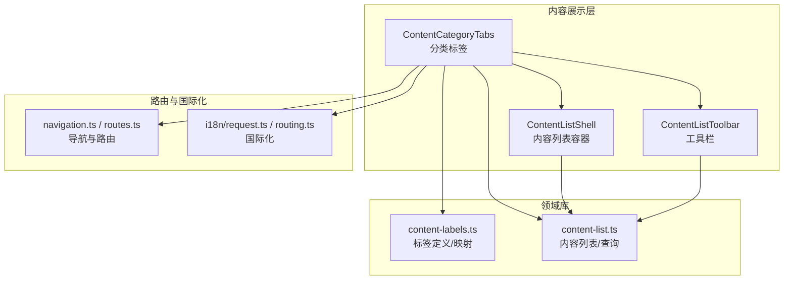
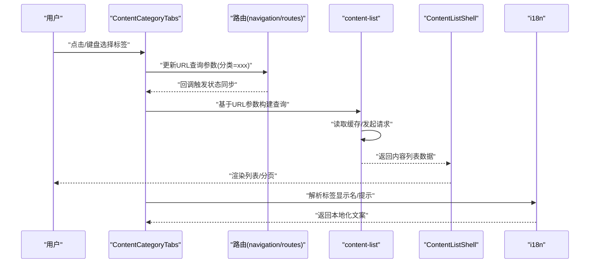
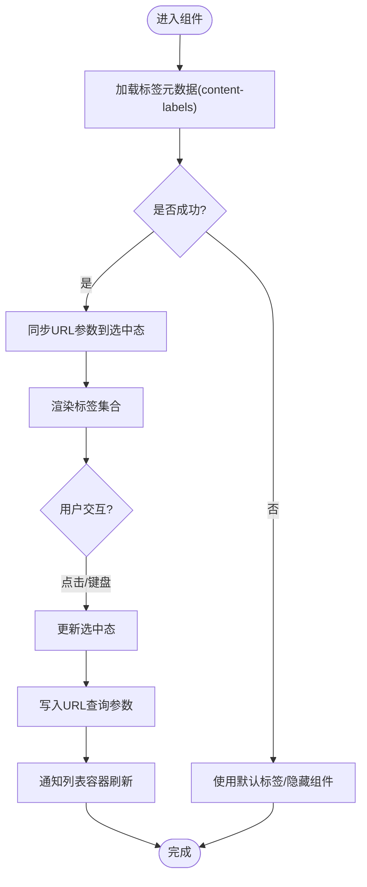
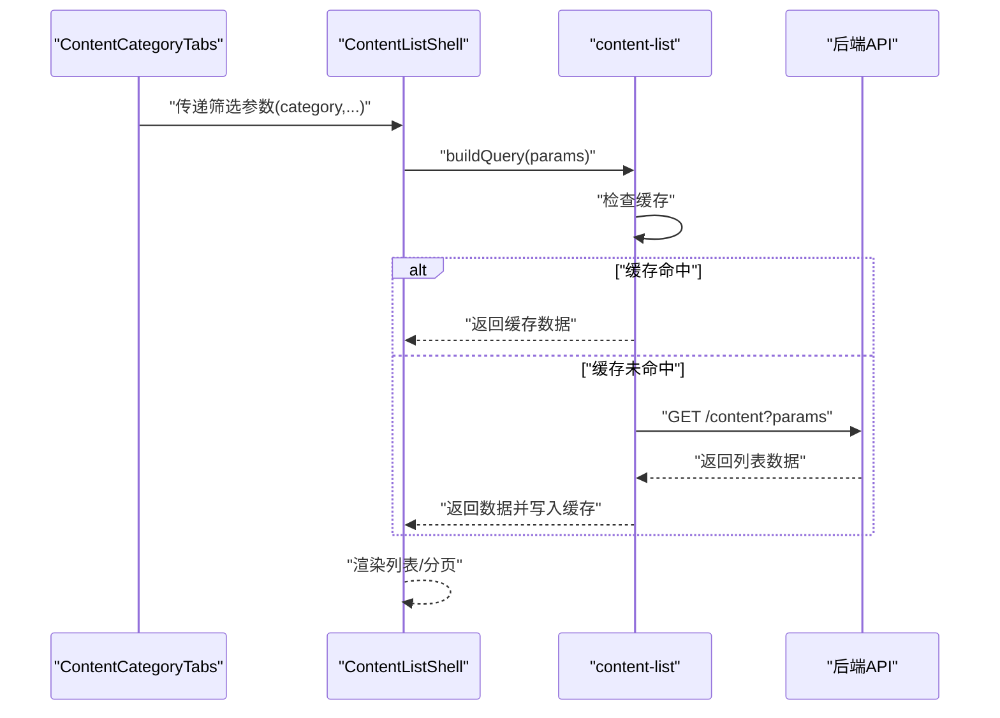
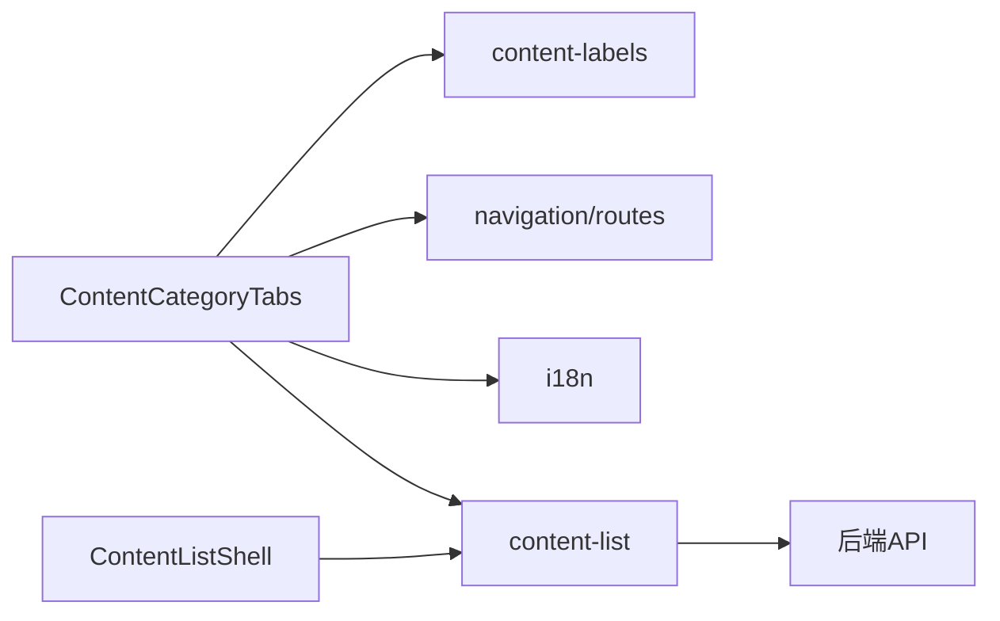

# 分类标签组件

<cite>
**本文引用的文件**   
- [ContentCategoryTabs.tsx](file://apps/web/src/components/content/ContentCategoryTabs.tsx)
- [ContentListShell.tsx](file://apps/web/src/components/content/ContentListShell.tsx)
- [ContentListToolbar.tsx](file://apps/web/src/components/content/ContentListToolbar.tsx)
- [content-labels.ts](file://apps/web/src/lib/content-labels.ts)
- [content-list.ts](file://apps/web/src/lib/content-list.ts)
- [navigation.ts](file://apps/web/src/lib/navigation.ts)
- [routes.ts](file://apps/web/src/lib/routes.ts)
- [i18n/request.ts](file://apps/web/src/i18n/request.ts)
- [i18n/routing.ts](file://apps/web/src/i18n/routing.ts)
</cite>

## 目录
1. [简介](#简介)
2. [项目结构](#项目结构)
3. [核心组件](#核心组件)
4. [架构总览](#架构总览)
5. [详细组件分析](#详细组件分析)
6. [依赖关系分析](#依赖关系分析)
7. [性能考量](#性能考量)
8. [故障排查指南](#故障排查指南)
9. [结论](#结论)
10. [附录](#附录)

## 简介
本文件围绕 ContentCategoryTabs 分类标签组件，系统性阐述其设计模式与实现细节，包括：
- 动态标签生成、状态管理与路由集成
- 标签切换动画、键盘导航和无障碍访问支持
- 标签数据的动态加载、缓存策略与错误处理
- 自定义样式、图标配置与多语言支持
- 与内容筛选的集成方式，实现实时内容更新与性能优化

该组件位于前端 Web 应用的内容展示层，负责以“标签”维度组织并过滤内容列表，同时与路由、国际化、数据获取等能力协同工作。

## 项目结构
ContentCategoryTabs 属于内容模块（content）下的 UI 组件，配合内容列表容器与工具栏共同完成“按分类浏览”的用户体验。相关代码主要分布在以下位置：
- 组件实现：apps/web/src/components/content/ContentCategoryTabs.tsx
- 列表容器：apps/web/src/components/content/ContentListShell.tsx
- 工具栏：apps/web/src/components/content/ContentListToolbar.tsx
- 标签定义与映射：apps/web/src/lib/content-labels.ts
- 内容列表数据与查询：apps/web/src/lib/content-list.ts
- 导航与路由：apps/web/src/lib/navigation.ts, apps/web/src/lib/routes.ts
- 国际化请求与路由：apps/web/src/i18n/request.ts, apps/web/src/i18n/routing.ts

图表来源
- [ContentCategoryTabs.tsx](file://apps/web/src/components/content/ContentCategoryTabs.tsx)
- [ContentListShell.tsx](file://apps/web/src/components/content/ContentListShell.tsx)
- [ContentListToolbar.tsx](file://apps/web/src/components/content/ContentListToolbar.tsx)
- [content-labels.ts](file://apps/web/src/lib/content-labels.ts)
- [content-list.ts](file://apps/web/src/lib/content-list.ts)
- [navigation.ts](file://apps/web/src/lib/navigation.ts)
- [routes.ts](file://apps/web/src/lib/routes.ts)
- [i18n/request.ts](file://apps/web/src/i18n/request.ts)
- [i18n/routing.ts](file://apps/web/src/i18n/routing.ts)

章节来源
- [ContentCategoryTabs.tsx](file://apps/web/src/components/content/ContentCategoryTabs.tsx)
- [ContentListShell.tsx](file://apps/web/src/components/content/ContentListShell.tsx)
- [ContentListToolbar.tsx](file://apps/web/src/components/content/ContentListToolbar.tsx)
- [content-labels.ts](file://apps/web/src/lib/content-labels.ts)
- [content-list.ts](file://apps/web/src/lib/content-list.ts)
- [navigation.ts](file://apps/web/src/lib/navigation.ts)
- [routes.ts](file://apps/web/src/lib/routes.ts)
- [i18n/request.ts](file://apps/web/src/i18n/request.ts)
- [i18n/routing.ts](file://apps/web/src/i18n/routing.ts)

## 核心组件
- ContentCategoryTabs：渲染分类标签集合，处理选中态、键盘导航、无障碍属性、切换动画以及与路由和筛选状态的联动。
- ContentListShell：承载内容列表与分页、排序、搜索等能力，接收来自标签的筛选条件并刷新数据。
- ContentListToolbar：提供搜索、排序、视图切换等辅助操作，常与标签组合使用形成完整的内容浏览体验。
- content-labels：集中管理标签的键值、显示名、图标、排序与分组信息，便于统一维护与扩展。
- content-list：封装内容列表的数据获取、参数构建、缓存与错误处理，供 Shell 与工具栏调用。
- navigation/routes：将标签选择映射为 URL 查询参数或路径段，保证可分享、可回退与 SEO 友好。
- i18n：根据当前语言环境解析标签文案与提示信息。

章节来源
- [ContentCategoryTabs.tsx](file://apps/web/src/components/content/ContentCategoryTabs.tsx)
- [ContentListShell.tsx](file://apps/web/src/components/content/ContentListShell.tsx)
- [ContentListToolbar.tsx](file://apps/web/src/components/content/ContentListToolbar.tsx)
- [content-labels.ts](file://apps/web/src/lib/content-labels.ts)
- [content-list.ts](file://apps/web/src/lib/content-list.ts)
- [navigation.ts](file://apps/web/src/lib/navigation.ts)
- [routes.ts](file://apps/web/src/lib/routes.ts)
- [i18n/request.ts](file://apps/web/src/i18n/request.ts)
- [i18n/routing.ts](file://apps/web/src/i18n/routing.ts)

## 架构总览
ContentCategoryTabs 作为“输入层”，将用户交互转化为结构化筛选参数；content-list 作为“数据层”，负责拉取与缓存；ContentListShell 作为“表现层”，渲染列表与分页；navigation/routes 负责“状态持久化”到 URL；i18n 负责“文案本地化”。

图表来源
- [ContentCategoryTabs.tsx](file://apps/web/src/components/content/ContentCategoryTabs.tsx)
- [content-list.ts](file://apps/web/src/lib/content-list.ts)
- [navigation.ts](file://apps/web/src/lib/navigation.ts)
- [routes.ts](file://apps/web/src/lib/routes.ts)
- [i18n/request.ts](file://apps/web/src/i18n/request.ts)
- [i18n/routing.ts](file://apps/web/src/i18n/routing.ts)

## 详细组件分析

### ContentCategoryTabs 组件分析
- 动态标签生成
  - 从 content-labels 读取标签元数据，结合当前上下文（如页面类型、权限、是否启用某分类）动态生成可用标签集合。
  - 支持分组与排序，确保首选项优先展示。
- 状态管理与路由集成
  - 通过 URL 查询参数（如 category、lang、page）驱动选中态，避免内存与视图不同步。
  - 监听路由变化，自动恢复选中标签，支持浏览器前进/后退。
- 切换动画
  - 使用过渡类或轻量动画库实现“下划线/背景色/缩放”等效果，保持切换流畅且不影响布局。
- 键盘导航与无障碍
  - Tab/Shift+Tab 在标签间移动，Enter/Space 激活选中，ArrowLeft/Right 横向移动。
  - role="tablist/tab/tabpanel"、aria-selected、aria-controls、aria-label 等属性完善屏幕阅读器支持。
- 错误处理与降级
  - 标签数据为空时回退到默认标签或隐藏组件。
  - 网络异常时保留上次有效结果，并提供重试入口。

图表来源
- [ContentCategoryTabs.tsx](file://apps/web/src/components/content/ContentCategoryTabs.tsx)
- [content-labels.ts](file://apps/web/src/lib/content-labels.ts)
- [navigation.ts](file://apps/web/src/lib/navigation.ts)
- [routes.ts](file://apps/web/src/lib/routes.ts)

章节来源
- [ContentCategoryTabs.tsx](file://apps/web/src/components/content/ContentCategoryTabs.tsx)
- [content-labels.ts](file://apps/web/src/lib/content-labels.ts)
- [navigation.ts](file://apps/web/src/lib/navigation.ts)
- [routes.ts](file://apps/web/src/lib/routes.ts)

### 与内容筛选的集成（ContentListShell）
- 接收来自标签的筛选参数（category、keyword、sort、page 等），构建查询对象。
- 与 content-list 协作，优先读取缓存，未命中则发起请求，合并分页与排序逻辑。
- 当标签切换时，重置页码至第一页，避免空页或错位。

图表来源
- [ContentListShell.tsx](file://apps/web/src/components/content/ContentListShell.tsx)
- [content-list.ts](file://apps/web/src/lib/content-list.ts)

章节来源
- [ContentListShell.tsx](file://apps/web/src/components/content/ContentListShell.tsx)
- [content-list.ts](file://apps/web/src/lib/content-list.ts)

### 工具栏（ContentListToolbar）与标签的协同
- 提供关键词搜索、排序、视图切换（网格/列表）等能力，与标签共同构成复合筛选。
- 与标签联动：当切换标签时，清空搜索词或保留搜索词但重新计算结果（由业务规则决定）。

章节来源
- [ContentListToolbar.tsx](file://apps/web/src/components/content/ContentListToolbar.tsx)

### 标签数据模型与映射（content-labels）
- 字段建议：id、key、label(i18n key)、icon、group、order、visible、enabled、routeParams。
- 提供 getActiveTabs、getLabel、getIcon、filterByGroup 等工具函数，方便组件按需消费。

章节来源
- [content-labels.ts](file://apps/web/src/lib/content-labels.ts)

### 内容列表数据与查询（content-list）
- 职责：参数校验、缓存键生成、请求去抖/节流、错误重试、分页合并。
- 缓存策略：按“查询参数哈希”作为键，设置过期时间与失效策略（如切换标签时失效）。
- 错误处理：区分网络错误、业务错误与无数据场景，提供重试与降级方案。

章节来源
- [content-list.ts](file://apps/web/src/lib/content-list.ts)

### 路由与国际化（navigation/routes, i18n）
- 路由：将 category 等参数序列化到 URL，保证可分享与可回退。
- 国际化：通过 i18n key 解析标签文案与提示，支持运行时切换语言。

章节来源
- [navigation.ts](file://apps/web/src/lib/navigation.ts)
- [routes.ts](file://apps/web/src/lib/routes.ts)
- [i18n/request.ts](file://apps/web/src/i18n/request.ts)
- [i18n/routing.ts](file://apps/web/src/i18n/routing.ts)

## 依赖关系分析
- 组件内聚性高：ContentCategoryTabs 仅依赖标签定义、路由与 i18n，不直接耦合数据层。
- 数据层解耦：content-list 独立于 UI，可被多个容器复用。
- 路由与 i18n 作为横切关注点，被多处引用，需保持稳定接口。

图表来源
- [ContentCategoryTabs.tsx](file://apps/web/src/components/content/ContentCategoryTabs.tsx)
- [content-labels.ts](file://apps/web/src/lib/content-labels.ts)
- [content-list.ts](file://apps/web/src/lib/content-list.ts)
- [navigation.ts](file://apps/web/src/lib/navigation.ts)
- [routes.ts](file://apps/web/src/lib/routes.ts)
- [i18n/request.ts](file://apps/web/src/i18n/request.ts)
- [i18n/routing.ts](file://apps/web/src/i18n/routing.ts)

章节来源
- [ContentCategoryTabs.tsx](file://apps/web/src/components/content/ContentCategoryTabs.tsx)
- [content-labels.ts](file://apps/web/src/lib/content-labels.ts)
- [content-list.ts](file://apps/web/src/lib/content-list.ts)
- [navigation.ts](file://apps/web/src/lib/navigation.ts)
- [routes.ts](file://apps/web/src/lib/routes.ts)
- [i18n/request.ts](file://apps/web/src/i18n/request.ts)
- [i18n/routing.ts](file://apps/web/src/i18n/routing.ts)

## 性能考量
- 标签渲染
  - 对标签集合进行稳定排序与最小化重排，避免频繁重建 DOM。
  - 大数量标签可采用虚拟滚动或分页展示。
- 数据获取
  - 使用请求去抖与缓存，减少重复请求；合理设置缓存过期时间。
  - 切换标签时先返回缓存数据，再后台静默更新（乐观更新）。
- 动画与交互
  - 使用 CSS transform/opacity 等合成属性动画，避免回流重绘。
  - 限制动画时长与并发，避免卡顿。
- 路由同步
  - 批量更新 URL 查询参数，避免多次 history push。
- 无障碍与可访问性
  - 合理的焦点管理与 aria 属性，提升屏幕阅读器体验。

[本节为通用指导，无需特定文件来源]

## 故障排查指南
- 标签不显示或全部不可选
  - 检查 content-labels 中 visible/enabled 配置是否正确。
  - 确认路由参数解析是否失败导致无法匹配选中态。
- 切换标签后列表不更新
  - 检查 content-list 的缓存键是否与参数一致。
  - 确认 ContentListShell 是否在标签变化时触发了数据刷新。
- 键盘导航无效
  - 检查 focus 管理、事件绑定与 aria 属性是否齐全。
- 多语言文案不正确
  - 确认 i18n key 是否存在，语言包是否加载成功。
- 错误处理与重试
  - 查看 content-list 的错误分支，确认是否提供了重试入口与降级展示。

章节来源
- [content-labels.ts](file://apps/web/src/lib/content-labels.ts)
- [content-list.ts](file://apps/web/src/lib/content-list.ts)
- [ContentCategoryTabs.tsx](file://apps/web/src/components/content/ContentCategoryTabs.tsx)
- [ContentListShell.tsx](file://apps/web/src/components/content/ContentListShell.tsx)
- [i18n/request.ts](file://apps/web/src/i18n/request.ts)

## 结论
ContentCategoryTabs 通过“标签即路由”的设计，将用户意图直接映射到 URL 与数据查询，实现了高内聚、低耦合的可复用组件。配合 content-list 的缓存与错误处理、ContentListShell 的列表渲染以及 i18n 的多语言支持，整体具备良好的可扩展性与可维护性。建议在后续迭代中持续优化动画性能、无障碍体验与大数据量下的渲染效率。

[本节为总结性内容，无需特定文件来源]

## 附录
- 自定义标签样式
  - 通过主题变量或 CSS-in-JS 覆盖选中态颜色、字号、圆角与阴影。
  - 图标可通过 content-labels 的 icon 字段注入，支持 SVG/字体图标。
- 多语言支持
  - 所有标签文案使用 i18n key，避免硬编码字符串。
  - 新增语言时，仅需补充对应语言包的文案映射。
- 与内容筛选的集成最佳实践
  - 将标签作为一级筛选，搜索与排序作为二级筛选，明确优先级与冲突处理规则。
  - 切换标签时重置页码，避免分页错乱。

[本节为概念性内容，无需特定文件来源]