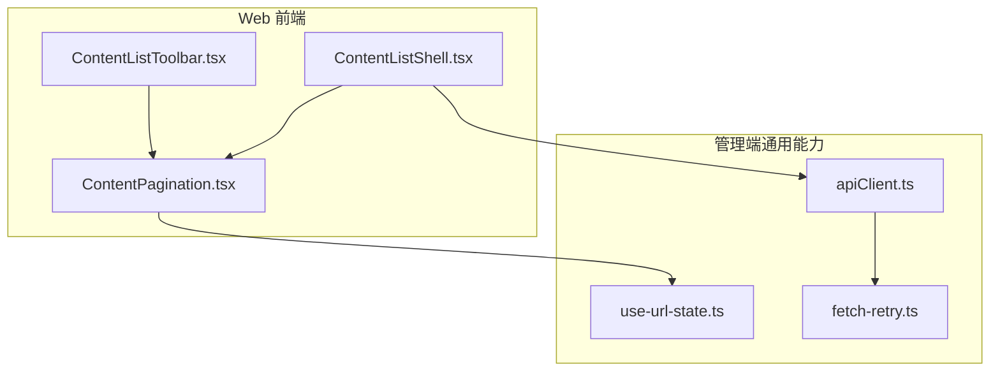
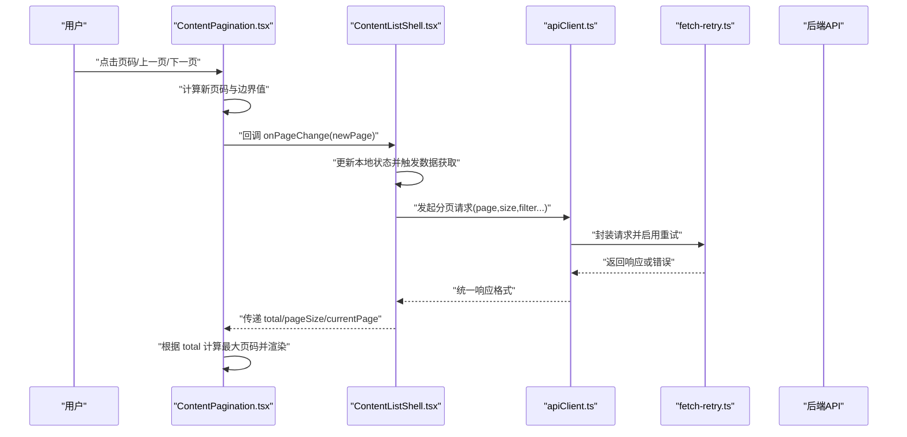
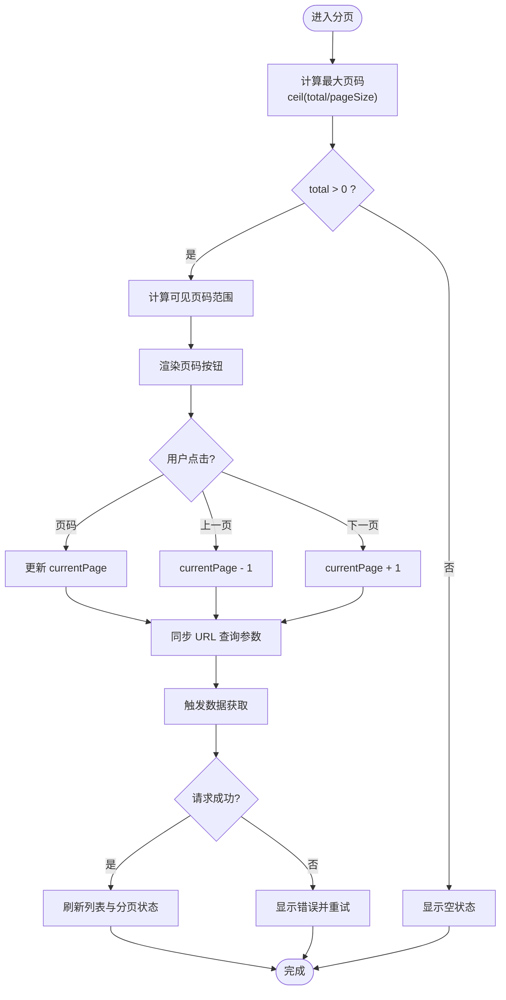
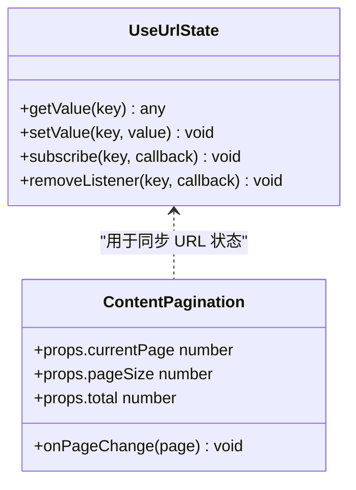
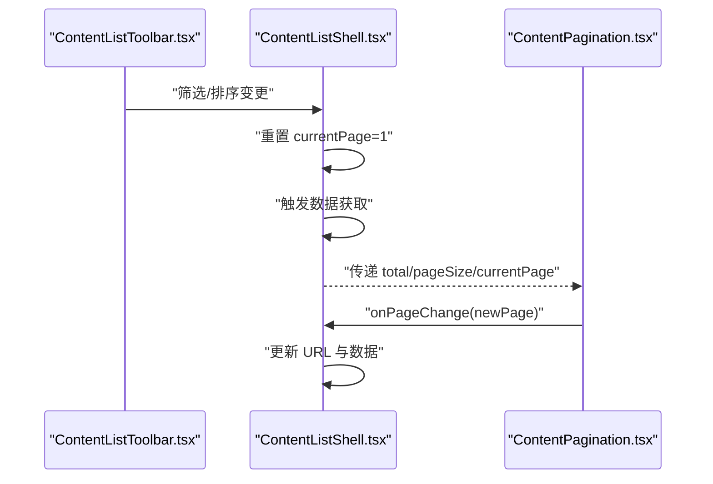
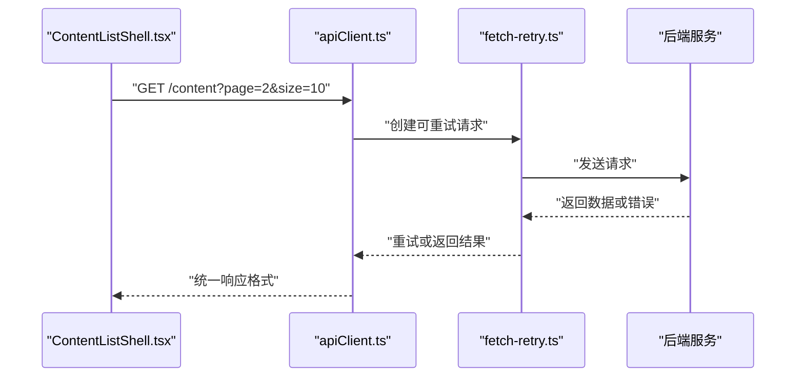
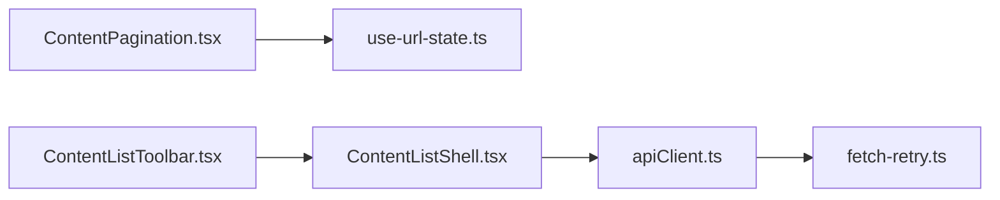

# 分页组件

<cite>
**本文引用的文件**   
- [ContentPagination.tsx](file://apps/web/src/components/content/ContentPagination.tsx)
- [use-url-state.ts](file://apps/admin/src/lib/use-url-state.ts)
- [ContentListShell.tsx](file://apps/web/src/components/content/ContentListShell.tsx)
- [ContentListToolbar.tsx](file://apps/web/src/components/content/ContentListToolbar.tsx)
- [apiClient.ts](file://apps/admin/src/lib/apiClient.ts)
- [fetch-retry.ts](file://apps/admin/src/lib/fetch-retry.ts)
</cite>

## 目录
1. [简介](#简介)
2. [项目结构](#项目结构)
3. [核心组件](#核心组件)
4. [架构总览](#架构总览)
5. [详细组件分析](#详细组件分析)
6. [依赖关系分析](#依赖关系分析)
7. [性能考虑](#性能考虑)
8. [故障排查指南](#故障排查指南)
9. [结论](#结论)
10. [附录](#附录)

## 简介
本文件围绕 ContentPagination 分页组件，系统性阐述其实现原理与最佳实践。内容涵盖：
- URL 状态同步、浏览器历史导航与 SEO 友好性
- 分页算法、大数据集处理策略与性能优化
- 自定义样式、按钮配置与移动端适配
- 与后端 API 的集成方法、错误处理与加载状态管理
- 智能分页、无限滚动与混合分页模式的实现思路

## 项目结构
分页相关代码主要位于 Web 端的内容展示层与管理端的通用能力层：
- Web 端：内容列表壳组件、工具栏与分页组件
- 管理端：URL 状态同步 Hook、API 客户端与重试机制

图表来源
- [ContentListShell.tsx](file://apps/web/src/components/content/ContentListShell.tsx)
- [ContentListToolbar.tsx](file://apps/web/src/components/content/ContentListToolbar.tsx)
- [ContentPagination.tsx](file://apps/web/src/components/content/ContentPagination.tsx)
- [use-url-state.ts](file://apps/admin/src/lib/use-url-state.ts)
- [apiClient.ts](file://apps/admin/src/lib/apiClient.ts)
- [fetch-retry.ts](file://apps/admin/src/lib/fetch-retry.ts)

章节来源
- [ContentListShell.tsx](file://apps/web/src/components/content/ContentListShell.tsx)
- [ContentListToolbar.tsx](file://apps/web/src/components/content/ContentListToolbar.tsx)
- [ContentPagination.tsx](file://apps/web/src/components/content/ContentPagination.tsx)
- [use-url-state.ts](file://apps/admin/src/lib/use-url-state.ts)
- [apiClient.ts](file://apps/admin/src/lib/apiClient.ts)
- [fetch-retry.ts](file://apps/admin/src/lib/fetch-retry.ts)

## 核心组件
- ContentPagination：负责渲染页码、上一页/下一页、跳转输入等交互；将当前页码与 URL 查询参数保持同步，触发数据刷新。
- use-url-state：提供受控的 URL 查询参数与 React 状态的双向绑定，支持浏览器前进后退与分享链接。
- ContentListShell / ContentListToolbar：作为内容列表容器与筛选工具栏，承载分页组件并协调数据获取。
- apiClient / fetch-retry：封装网络请求、错误处理与自动重试，确保分页数据获取的稳定性。

章节来源
- [ContentPagination.tsx](file://apps/web/src/components/content/ContentPagination.tsx)
- [use-url-state.ts](file://apps/admin/src/lib/use-url-state.ts)
- [ContentListShell.tsx](file://apps/web/src/components/content/ContentListShell.tsx)
- [ContentListToolbar.tsx](file://apps/web/src/components/content/ContentListToolbar.tsx)
- [apiClient.ts](file://apps/admin/src/lib/apiClient.ts)
- [fetch-retry.ts](file://apps/admin/src/lib/fetch-retry.ts)

## 架构总览
下图展示了从用户操作到数据返回的完整调用链，以及 URL 状态与页面渲染的联动关系。

图表来源
- [ContentPagination.tsx](file://apps/web/src/components/content/ContentPagination.tsx)
- [ContentListShell.tsx](file://apps/web/src/components/content/ContentListShell.tsx)
- [apiClient.ts](file://apps/admin/src/lib/apiClient.ts)
- [fetch-retry.ts](file://apps/admin/src/lib/fetch-retry.ts)

## 详细组件分析

### ContentPagination 组件
职责与行为
- 接收分页元数据（total、pageSize、currentPage）与回调（onPageChange）。
- 计算最大页码、可见页码范围、是否显示“上一页/下一页”等。
- 与 URL 查询参数同步，保证浏览器前进后退与分享链接有效。
- 支持键盘导航与无障碍标签，提升可访问性。
- 在移动端自适应布局，隐藏冗余页码，保留关键导航。

URL 状态同步与历史导航
- 通过 use-url-state 将 currentPage 映射为 URL 查询参数（如 ?page=2）。
- 监听 URL 变化时更新内部状态，避免重复请求。
- 使用 history.pushState 或 Next.js Router 的 query 更新，确保可分享与可索引。

SEO 友好性
- 每个页面对应唯一 URL，便于搜索引擎抓取与索引。
- 配合服务端渲染或预渲染，确保首屏内容可被爬虫读取。
- 合理设置 rel="next"/rel="prev"（可选），辅助搜索引擎理解分页序列。

分页算法与边界处理
- 最大页码 = ceil(total / pageSize)。
- 可见页码范围采用“滑动窗口”策略，优先显示当前页附近页码。
- 边界情况：total=0、pageSize=0、currentPage 越界时的回退逻辑。

性能优化
- 防抖/节流：对快速点击进行节流，避免频繁重渲染。
- 条件渲染：仅渲染可见页码节点，减少 DOM 节点数量。
- 虚拟分页：当 total 极大时，结合后端游标/偏移分页，避免一次性计算大量页码。

移动端适配
- 在小屏幕下隐藏中间页码，仅显示“上一页/下一页”和“跳转输入”。
- 增大触摸区域，提升可操作性。
- 使用弹性布局与媒体查询，适配不同设备宽度。

自定义样式与按钮配置
- 暴露 props 控制是否显示“上一页/下一页”、“跳转输入框”、“每页条数选择器”。
- 支持主题色、尺寸、圆角等样式覆盖。
- 可通过插槽或子组件替换页码按钮样式。

与后端 API 集成
- 约定请求参数：page、size、sort、filter 等。
- 约定响应结构：包含 data、total、page、size 等字段。
- 错误码统一处理：网络异常、业务错误、权限不足等。

加载状态管理
- 在切换页码时显示骨架屏或占位符，提升感知性能。
- 失败时提供重试入口，避免用户流失。
- 成功时平滑过渡动画，减少视觉抖动。

智能分页
- 基于用户行为预测下一页概率，提前预取数据。
- 根据设备性能与网络状况动态调整 pageSize。
- 结合搜索关键词与筛选条件，生成语义化 URL 路径。

无限滚动与混合分页
- 在长列表场景下，结合 IntersectionObserver 实现“触底加载更多”。
- 混合模式：顶部固定页码导航 + 底部无限滚动，兼顾定位与流畅体验。
- 缓存已加载页数据，避免重复请求。

图表来源
- [ContentPagination.tsx](file://apps/web/src/components/content/ContentPagination.tsx)

章节来源
- [ContentPagination.tsx](file://apps/web/src/components/content/ContentPagination.tsx)

### use-url-state Hook
职责与行为
- 将 React 状态与 URL 查询参数双向绑定。
- 支持类型转换、默认值与校验。
- 监听浏览器前进后退事件，保持状态一致。

与分页组件协作
- 将 currentPage 映射为 URL 参数，避免状态漂移。
- 在组件初始化时从 URL 恢复状态，确保刷新后仍停留在正确页码。

图表来源
- [use-url-state.ts](file://apps/admin/src/lib/use-url-state.ts)
- [ContentPagination.tsx](file://apps/web/src/components/content/ContentPagination.tsx)

章节来源
- [use-url-state.ts](file://apps/admin/src/lib/use-url-state.ts)

### ContentListShell 与 ContentListToolbar
职责与行为
- ContentListShell：作为内容列表容器，管理数据获取、缓存与分页状态。
- ContentListToolbar：提供筛选、排序、每页条数选择等工具，与分页组件协同工作。

协作流程
- 工具栏变更触发重新查询，重置 currentPage 为 1。
- 分页组件切换页码时，仅更新 page 参数，复用其他筛选条件。
- 统一错误处理与加载状态，提升用户体验。

图表来源
- [ContentListShell.tsx](file://apps/web/src/components/content/ContentListShell.tsx)
- [ContentListToolbar.tsx](file://apps/web/src/components/content/ContentListToolbar.tsx)
- [ContentPagination.tsx](file://apps/web/src/components/content/ContentPagination.tsx)

章节来源
- [ContentListShell.tsx](file://apps/web/src/components/content/ContentListShell.tsx)
- [ContentListToolbar.tsx](file://apps/web/src/components/content/ContentListToolbar.tsx)

### apiClient 与 fetch-retry
职责与行为
- apiClient：封装 HTTP 请求，统一拦截器、错误处理与响应格式化。
- fetch-retry：提供自动重试机制，支持指数退避与最大重试次数。

与分页集成
- 分页请求携带 page、size 等参数，返回结构化数据。
- 网络异常时自动重试，失败后提示用户。
- 支持取消重复请求，避免竞态条件。

图表来源
- [apiClient.ts](file://apps/admin/src/lib/apiClient.ts)
- [fetch-retry.ts](file://apps/admin/src/lib/fetch-retry.ts)

章节来源
- [apiClient.ts](file://apps/admin/src/lib/apiClient.ts)
- [fetch-retry.ts](file://apps/admin/src/lib/fetch-retry.ts)

## 依赖关系分析
- ContentPagination 依赖 use-url-state 进行 URL 同步。
- ContentListShell 依赖 apiClient 进行数据获取。
- apiClient 依赖 fetch-retry 提供重试能力。
- ContentListToolbar 与 ContentListShell 通过事件通信协调筛选与分页。

图表来源
- [ContentPagination.tsx](file://apps/web/src/components/content/ContentPagination.tsx)
- [use-url-state.ts](file://apps/admin/src/lib/use-url-state.ts)
- [ContentListShell.tsx](file://apps/web/src/components/content/ContentListShell.tsx)
- [ContentListToolbar.tsx](file://apps/web/src/components/content/ContentListToolbar.tsx)
- [apiClient.ts](file://apps/admin/src/lib/apiClient.ts)
- [fetch-retry.ts](file://apps/admin/src/lib/fetch-retry.ts)

章节来源
- [ContentPagination.tsx](file://apps/web/src/components/content/ContentPagination.tsx)
- [use-url-state.ts](file://apps/admin/src/lib/use-url-state.ts)
- [ContentListShell.tsx](file://apps/web/src/components/content/ContentListShell.tsx)
- [ContentListToolbar.tsx](file://apps/web/src/components/content/ContentListToolbar.tsx)
- [apiClient.ts](file://apps/admin/src/lib/apiClient.ts)
- [fetch-retry.ts](file://apps/admin/src/lib/fetch-retry.ts)

## 性能考虑
- 分页算法复杂度：O(1) 计算最大页码，O(k) 渲染可见页码（k 为可见数量）。
- 大数据集处理：结合后端游标分页，避免前端计算过大范围。
- 内存优化：及时释放未使用的页码节点，避免内存泄漏。
- 网络优化：合并重复请求、启用缓存、合理设置超时与重试。
- 渲染优化：使用 React.memo 包裹分页按钮，减少不必要的重渲染。

## 故障排查指南
常见问题与解决方案
- URL 不同步：检查 use-url-state 的订阅与更新逻辑，确保 setState 与 URL 更新顺序正确。
- 分页不刷新：确认 onPageChange 回调是否正确触发，数据获取是否被取消。
- 移动端显示异常：检查媒体查询与触摸事件处理，确保按钮大小与间距合理。
- 网络错误：查看 fetch-retry 的重试配置，确认后端接口可用性。
- SEO 问题：验证每个页码对应的 URL 是否唯一且可抓取，必要时添加结构化数据。

章节来源
- [use-url-state.ts](file://apps/admin/src/lib/use-url-state.ts)
- [fetch-retry.ts](file://apps/admin/src/lib/fetch-retry.ts)
- [ContentPagination.tsx](file://apps/web/src/components/content/ContentPagination.tsx)

## 结论
ContentPagination 组件通过 URL 状态同步、智能分页算法与完善的错误处理，提供了稳定、高性能的分页体验。结合 ContentListShell 与 ContentListToolbar，可实现灵活的内容列表管理。在移动端与大数据集场景下，通过自适应布局与游标分页进一步优化性能。建议在生产环境中结合 SEO 最佳实践与监控告警，确保用户体验与系统稳定性。

## 附录
- 自定义样式：通过 CSS 变量或主题配置覆盖默认样式。
- 按钮配置：按需显示“上一页/下一页”、“跳转输入框”、“每页条数选择器”。
- 无限滚动：结合 IntersectionObserver 实现触底加载更多。
- 混合分页：顶部固定导航 + 底部无限滚动，兼顾定位与流畅性。
- 后端对接：约定 page、size、sort、filter 等参数，返回 data、total、page、size 等字段。