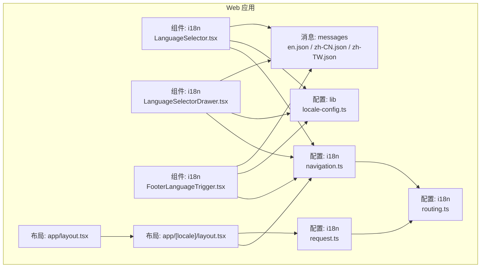
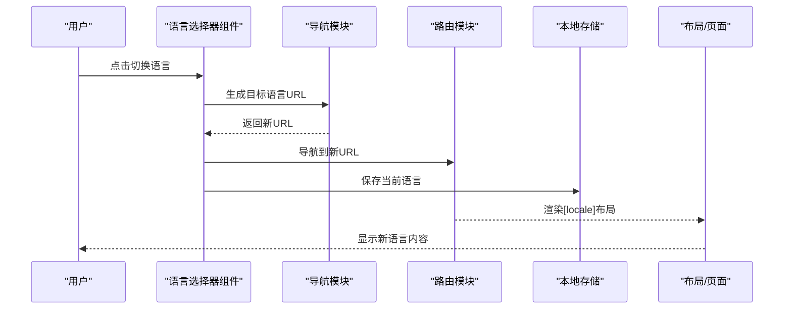
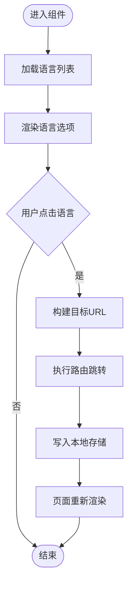
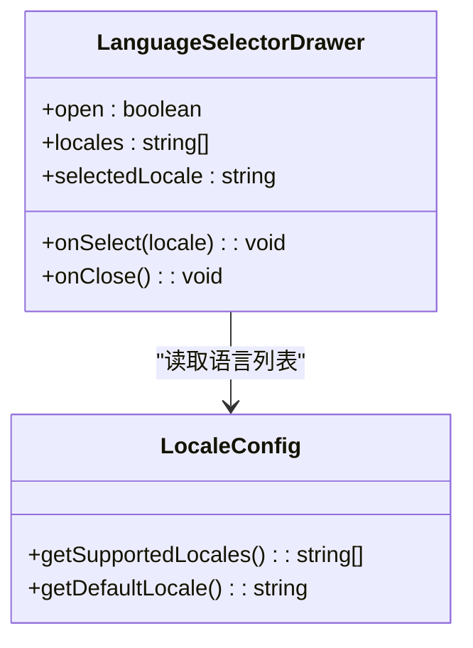
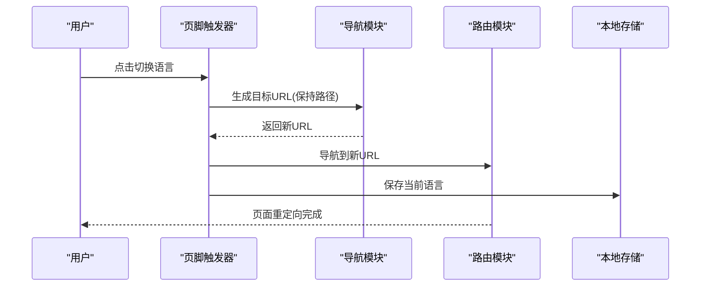
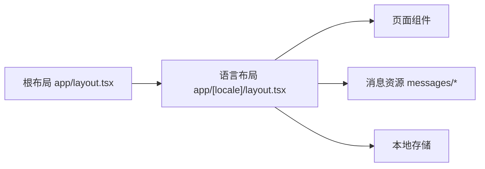
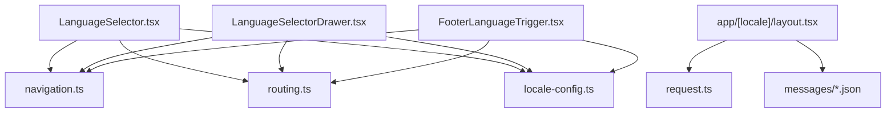

# 国际化组件

<cite>
**本文引用的文件**   
- [apps/web/src/components/i18n/LanguageSelector.tsx](file://apps/web/src/components/i18n/LanguageSelector.tsx)
- [apps/web/src/components/i18n/LanguageSelectorDrawer.tsx](file://apps/web/src/components/i18n/LanguageSelectorDrawer.tsx)
- [apps/web/src/components/i18n/FooterLanguageTrigger.tsx](file://apps/web/src/components/i18n/FooterLanguageTrigger.tsx)
- [apps/web/src/i18n/navigation.ts](file://apps/web/src/i18n/navigation.ts)
- [apps/web/src/i18n/request.ts](file://apps/web/src/i18n/request.ts)
- [apps/web/src/i18n/routing.ts](file://apps/web/src/i18n/routing.ts)
- [apps/web/src/messages/en.json](file://apps/web/src/messages/en.json)
- [apps/web/src/messages/zh-CN.json](file://apps/web/src/messages/zh-CN.json)
- [apps/web/src/messages/zh-TW.json](file://apps/web/src/messages/zh-TW.json)
- [apps/web/src/lib/locale-config.ts](file://apps/web/src/lib/locale-config.ts)
- [apps/web/src/app/[locale]/layout.tsx](file://apps/web/src/app/[locale]/layout.tsx)
- [apps/web/src/app/layout.tsx](file://apps/web/src/app/layout.tsx)
- [apps/web/scripts/i18n-batch-refactor.py](file://apps/web/scripts/i18n-batch-refactor.py)
- [apps/web/scripts/i18n-extract-pages.py](file://apps/web/scripts/i18n-extract-pages.py)
- [apps/web/scripts/i18n-replace-strings.py](file://apps/web/scripts/i18n-replace-strings.py)
- [apps/web/scripts/i18n-sync-locales.py](file://apps/web/scripts/i18n-sync-locales.py)
</cite>

## 目录
1. [简介](#简介)
2. [项目结构](#项目结构)
3. [核心组件](#核心组件)
4. [架构总览](#架构总览)
5. [详细组件分析](#详细组件分析)
6. [依赖关系分析](#依赖关系分析)
7. [性能考虑](#性能考虑)
8. [故障排查指南](#故障排查指南)
9. [结论](#结论)
10. [附录](#附录)

## 简介
本文件面向国际化（i18n）能力，覆盖语言选择器、抽屉式语言切换、页脚语言触发器等前端组件的实现与使用；同时阐述多语言路由、动态内容切换与本地化存储机制。文档还包含新增语言支持、翻译文件管理与性能优化策略，并提供自定义国际化组件的开发指南，帮助开发者快速扩展与维护多语言功能。

## 项目结构
国际化相关代码主要位于 web 应用内：
- 组件层：apps/web/src/components/i18n 下提供语言选择器、抽屉式切换、页脚触发器等 UI 组件
- 路由与请求：apps/web/src/i18n 下提供导航、请求上下文与路由配置
- 消息资源：apps/web/src/messages 下按语言组织 JSON 翻译文件
- 本地化配置：apps/web/src/lib/locale-config.ts 集中管理语言列表与默认值
- 页面布局：apps/web/src/app/[locale]/layout.tsx 与根 layout.tsx 负责语言上下文注入与路由前缀处理

图表来源
- [apps/web/src/components/i18n/LanguageSelector.tsx](file://apps/web/src/components/i18n/LanguageSelector.tsx)
- [apps/web/src/components/i18n/LanguageSelectorDrawer.tsx](file://apps/web/src/components/i18n/LanguageSelectorDrawer.tsx)
- [apps/web/src/components/i18n/FooterLanguageTrigger.tsx](file://apps/web/src/components/i18n/FooterLanguageTrigger.tsx)
- [apps/web/src/i18n/navigation.ts](file://apps/web/src/i18n/navigation.ts)
- [apps/web/src/i18n/request.ts](file://apps/web/src/i18n/request.ts)
- [apps/web/src/i18n/routing.ts](file://apps/web/src/i18n/routing.ts)
- [apps/web/src/messages/en.json](file://apps/web/src/messages/en.json)
- [apps/web/src/messages/zh-CN.json](file://apps/web/src/messages/zh-CN.json)
- [apps/web/src/messages/zh-TW.json](file://apps/web/src/messages/zh-TW.json)
- [apps/web/src/lib/locale-config.ts](file://apps/web/src/lib/locale-config.ts)
- [apps/web/src/app/[locale]/layout.tsx](file://apps/web/src/app/[locale]/layout.tsx)
- [apps/web/src/app/layout.tsx](file://apps/web/src/app/layout.tsx)

章节来源
- [apps/web/src/components/i18n/LanguageSelector.tsx](file://apps/web/src/components/i18n/LanguageSelector.tsx)
- [apps/web/src/components/i18n/LanguageSelectorDrawer.tsx](file://apps/web/src/components/i18n/LanguageSelectorDrawer.tsx)
- [apps/web/src/components/i18n/FooterLanguageTrigger.tsx](file://apps/web/src/components/i18n/FooterLanguageTrigger.tsx)
- [apps/web/src/i18n/navigation.ts](file://apps/web/src/i18n/navigation.ts)
- [apps/web/src/i18n/request.ts](file://apps/web/src/i18n/request.ts)
- [apps/web/src/i18n/routing.ts](file://apps/web/src/i18n/routing.ts)
- [apps/web/src/lib/locale-config.ts](file://apps/web/src/lib/locale-config.ts)
- [apps/web/src/app/[locale]/layout.tsx](file://apps/web/src/app/[locale]/layout.tsx)
- [apps/web/src/app/layout.tsx](file://apps/web/src/app/layout.tsx)

## 核心组件
- 语言选择器（LanguageSelector）
  - 作用：以下拉或按钮形式展示可用语言，点击后切换当前语言并更新路由前缀
  - 关键行为：读取 locale-config 中的语言列表，调用 navigation 生成目标 URL，写入本地存储，触发重定向
  - 适用场景：导航栏、设置面板等需要显式切换语言的入口

- 抽屉式语言切换（LanguageSelectorDrawer）
  - 作用：在侧边抽屉中集中展示语言选项，适合移动端或空间受限的界面
  - 关键行为：打开抽屉时加载语言列表，选中项高亮，关闭抽屉并执行切换逻辑
  - 适用场景：移动端主菜单、用户中心设置区

- 页脚语言触发器（FooterLanguageTrigger）
  - 作用：在页脚区域提供轻量级语言切换入口，通常仅显示当前语言与切换箭头
  - 关键行为：点击后跳转至对应语言的路由，保持当前页面路径不变
  - 适用场景：全站页脚、登录注册页等非主交互区域

章节来源
- [apps/web/src/components/i18n/LanguageSelector.tsx](file://apps/web/src/components/i18n/LanguageSelector.tsx)
- [apps/web/src/components/i18n/LanguageSelectorDrawer.tsx](file://apps/web/src/components/i18n/LanguageSelectorDrawer.tsx)
- [apps/web/src/components/i18n/FooterLanguageTrigger.tsx](file://apps/web/src/components/i18n/FooterLanguageTrigger.tsx)

## 架构总览
国际化架构围绕“语言状态—路由—消息—持久化”四个维度展开：
- 语言状态：通过 request.ts 获取当前语言上下文
- 路由：通过 routing.ts 与 navigation.ts 构建带语言前缀的 URL
- 消息：通过 messages 下的 JSON 文件提供翻译文本
- 持久化：将用户选择的语言写入本地存储，确保刷新后仍生效

图表来源
- [apps/web/src/components/i18n/LanguageSelector.tsx](file://apps/web/src/components/i18n/LanguageSelector.tsx)
- [apps/web/src/i18n/navigation.ts](file://apps/web/src/i18n/navigation.ts)
- [apps/web/src/i18n/routing.ts](file://apps/web/src/i18n/routing.ts)
- [apps/web/src/app/[locale]/layout.tsx](file://apps/web/src/app/[locale]/layout.tsx)

## 详细组件分析

### 语言选择器（LanguageSelector）
- 数据源：从 locale-config.ts 读取支持的语种列表
- 交互流程：点击某语言 → 调用 navigation.ts 拼接带语言前缀的 URL → 调用 routing.ts 进行导航 → 写入本地存储 → 页面重新渲染
- 错误处理：对不支持的语言码进行回退到默认语言
- 可访问性：为每个语言项提供语义化标签与键盘操作支持

图表来源
- [apps/web/src/components/i18n/LanguageSelector.tsx](file://apps/web/src/components/i18n/LanguageSelector.tsx)
- [apps/web/src/i18n/navigation.ts](file://apps/web/src/i18n/navigation.ts)
- [apps/web/src/i18n/routing.ts](file://apps/web/src/i18n/routing.ts)
- [apps/web/src/lib/locale-config.ts](file://apps/web/src/lib/locale-config.ts)

章节来源
- [apps/web/src/components/i18n/LanguageSelector.tsx](file://apps/web/src/components/i18n/LanguageSelector.tsx)
- [apps/web/src/i18n/navigation.ts](file://apps/web/src/i18n/navigation.ts)
- [apps/web/src/i18n/routing.ts](file://apps/web/src/i18n/routing.ts)
- [apps/web/src/lib/locale-config.ts](file://apps/web/src/lib/locale-config.ts)

### 抽屉式语言切换（LanguageSelectorDrawer）
- 数据源：同 LanguageSelector，统一从 locale-config.ts 获取语言列表
- 交互流程：打开抽屉 → 渲染语言列表 → 选中项高亮 → 关闭抽屉并执行切换
- 性能优化：仅在抽屉打开时加载语言列表，避免不必要的渲染
- 用户体验：支持键盘导航与无障碍标签

图表来源
- [apps/web/src/components/i18n/LanguageSelectorDrawer.tsx](file://apps/web/src/components/i18n/LanguageSelectorDrawer.tsx)
- [apps/web/src/lib/locale-config.ts](file://apps/web/src/lib/locale-config.ts)

章节来源
- [apps/web/src/components/i18n/LanguageSelectorDrawer.tsx](file://apps/web/src/components/i18n/LanguageSelectorDrawer.tsx)
- [apps/web/src/lib/locale-config.ts](file://apps/web/src/lib/locale-config.ts)

### 页脚语言触发器（FooterLanguageTrigger）
- 作用：在页脚提供最小化的语言切换入口
- 交互流程：点击触发 → 生成目标语言 URL → 导航跳转 → 保持当前页面路径
- 设计要点：不阻塞主交互，视觉权重低，适合全局常驻

图表来源
- [apps/web/src/components/i18n/FooterLanguageTrigger.tsx](file://apps/web/src/components/i18n/FooterLanguageTrigger.tsx)
- [apps/web/src/i18n/navigation.ts](file://apps/web/src/i18n/navigation.ts)
- [apps/web/src/i18n/routing.ts](file://apps/web/src/i18n/routing.ts)

章节来源
- [apps/web/src/components/i18n/FooterLanguageTrigger.tsx](file://apps/web/src/components/i18n/FooterLanguageTrigger.tsx)
- [apps/web/src/i18n/navigation.ts](file://apps/web/src/i18n/navigation.ts)
- [apps/web/src/i18n/routing.ts](file://apps/web/src/i18n/routing.ts)

### 多语言路由与布局
- 路由前缀：通过 [locale] 动态路由段实现多语言路径，如 /zh-CN/about
- 布局注入：[locale]/layout.tsx 负责注入语言上下文，确保子组件可读取当前语言
- 根布局：app/layout.tsx 作为全局布局，协调各语言布局与资源加载

图表来源
- [apps/web/src/app/layout.tsx](file://apps/web/src/app/layout.tsx)
- [apps/web/src/app/[locale]/layout.tsx](file://apps/web/src/app/[locale]/layout.tsx)
- [apps/web/src/messages/en.json](file://apps/web/src/messages/en.json)
- [apps/web/src/messages/zh-CN.json](file://apps/web/src/messages/zh-CN.json)
- [apps/web/src/messages/zh-TW.json](file://apps/web/src/messages/zh-TW.json)

章节来源
- [apps/web/src/app/layout.tsx](file://apps/web/src/app/layout.tsx)
- [apps/web/src/app/[locale]/layout.tsx](file://apps/web/src/app/[locale]/layout.tsx)

## 依赖关系分析
- 组件依赖导航与路由模块，用于生成与跳转语言 URL
- 组件依赖 locale-config 获取语言列表与默认语言
- 布局依赖 request 获取当前语言上下文
- 所有组件与布局共同依赖消息资源文件

图表来源
- [apps/web/src/components/i18n/LanguageSelector.tsx](file://apps/web/src/components/i18n/LanguageSelector.tsx)
- [apps/web/src/components/i18n/LanguageSelectorDrawer.tsx](file://apps/web/src/components/i18n/LanguageSelectorDrawer.tsx)
- [apps/web/src/components/i18n/FooterLanguageTrigger.tsx](file://apps/web/src/components/i18n/FooterLanguageTrigger.tsx)
- [apps/web/src/i18n/navigation.ts](file://apps/web/src/i18n/navigation.ts)
- [apps/web/src/i18n/routing.ts](file://apps/web/src/i18n/routing.ts)
- [apps/web/src/i18n/request.ts](file://apps/web/src/i18n/request.ts)
- [apps/web/src/lib/locale-config.ts](file://apps/web/src/lib/locale-config.ts)
- [apps/web/src/app/[locale]/layout.tsx](file://apps/web/src/app/[locale]/layout.tsx)
- [apps/web/src/messages/en.json](file://apps/web/src/messages/en.json)
- [apps/web/src/messages/zh-CN.json](file://apps/web/src/messages/zh-CN.json)
- [apps/web/src/messages/zh-TW.json](file://apps/web/src/messages/zh-TW.json)

章节来源
- [apps/web/src/i18n/navigation.ts](file://apps/web/src/i18n/navigation.ts)
- [apps/web/src/i18n/routing.ts](file://apps/web/src/i18n/routing.ts)
- [apps/web/src/i18n/request.ts](file://apps/web/src/i18n/request.ts)
- [apps/web/src/lib/locale-config.ts](file://apps/web/src/lib/locale-config.ts)
- [apps/web/src/app/[locale]/layout.tsx](file://apps/web/src/app/[locale]/layout.tsx)

## 性能考虑
- 按需加载语言列表：抽屉式组件仅在打开时加载语言列表，减少初始渲染开销
- 路由跳转优化：使用导航模块统一生成 URL，避免重复计算
- 本地存储读写：切换语言后写入本地存储，避免每次初始化都检测浏览器偏好
- 消息资源拆分：按语言拆分为独立 JSON 文件，便于按需加载与缓存
- 避免重复渲染：在布局层注入语言上下文，减少组件内部状态同步

## 故障排查指南
- 语言未生效
  - 检查本地存储是否写入成功
  - 确认路由前缀是否正确生成
  - 验证消息文件是否存在且键名一致
- 路由跳转异常
  - 核对 navigation.ts 的 URL 拼接逻辑
  - 检查 routing.ts 的导航方法是否被正确调用
- 默认语言不正确
  - 查看 locale-config.ts 的默认语言配置
  - 确认 request.ts 是否能正确解析当前语言上下文

章节来源
- [apps/web/src/i18n/navigation.ts](file://apps/web/src/i18n/navigation.ts)
- [apps/web/src/i18n/routing.ts](file://apps/web/src/i18n/routing.ts)
- [apps/web/src/i18n/request.ts](file://apps/web/src/i18n/request.ts)
- [apps/web/src/lib/locale-config.ts](file://apps/web/src/lib/locale-config.ts)

## 结论
本国际化方案通过清晰的组件分层、统一的路由与导航模块、以及结构化的消息资源管理，实现了稳定、可扩展的多语言支持。语言选择器、抽屉式切换与页脚触发器覆盖了常见的使用场景；配合本地存储与布局注入，确保了语言状态的持久化与一致性。开发者可基于现有模式快速扩展新的语言与组件。

## 附录

### 新增语言支持步骤
- 在 locale-config.ts 中添加新语言码与显示名称
- 在 messages 目录下创建对应语言的 JSON 文件
- 在路由与导航模块中确保新语言码被识别
- 测试语言切换与内容渲染是否正常

章节来源
- [apps/web/src/lib/locale-config.ts](file://apps/web/src/lib/locale-config.ts)
- [apps/web/src/messages/en.json](file://apps/web/src/messages/en.json)
- [apps/web/src/messages/zh-CN.json](file://apps/web/src/messages/zh-CN.json)
- [apps/web/src/messages/zh-TW.json](file://apps/web/src/messages/zh-TW.json)

### 翻译文件管理
- 使用脚本批量提取与替换字符串，提升维护效率
- 定期同步不同语言的翻译文件，确保键名一致性

章节来源
- [apps/web/scripts/i18n-batch-refactor.py](file://apps/web/scripts/i18n-batch-refactor.py)
- [apps/web/scripts/i18n-extract-pages.py](file://apps/web/scripts/i18n-extract-pages.py)
- [apps/web/scripts/i18n-replace-strings.py](file://apps/web/scripts/i18n-replace-strings.py)
- [apps/web/scripts/i18n-sync-locales.py](file://apps/web/scripts/i18n-sync-locales.py)

### 自定义国际化组件开发指南
- 复用导航与路由模块生成语言 URL
- 从 locale-config.ts 读取语言列表与默认语言
- 在组件内写入本地存储以持久化语言选择
- 在布局层注入语言上下文，确保子组件可读取当前语言

章节来源
- [apps/web/src/i18n/navigation.ts](file://apps/web/src/i18n/navigation.ts)
- [apps/web/src/i18n/routing.ts](file://apps/web/src/i18n/routing.ts)
- [apps/web/src/lib/locale-config.ts](file://apps/web/src/lib/locale-config.ts)
- [apps/web/src/app/[locale]/layout.tsx](file://apps/web/src/app/[locale]/layout.tsx)