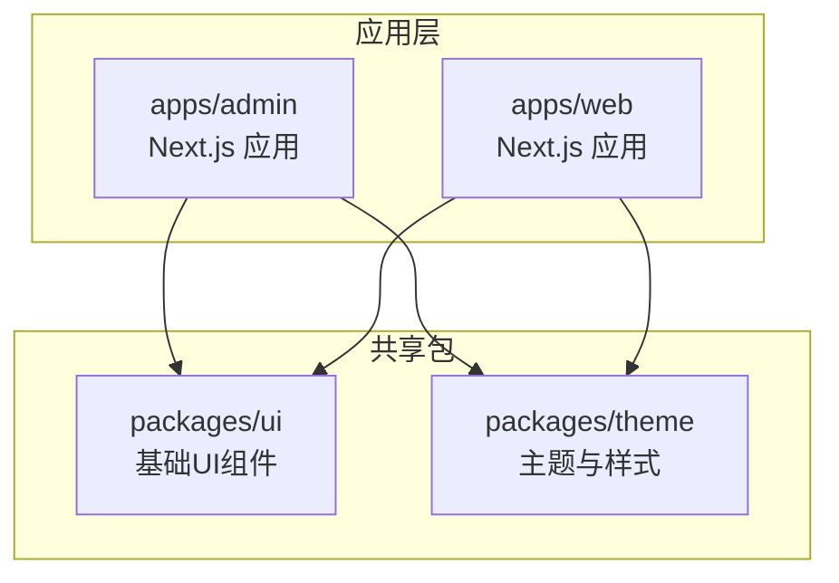
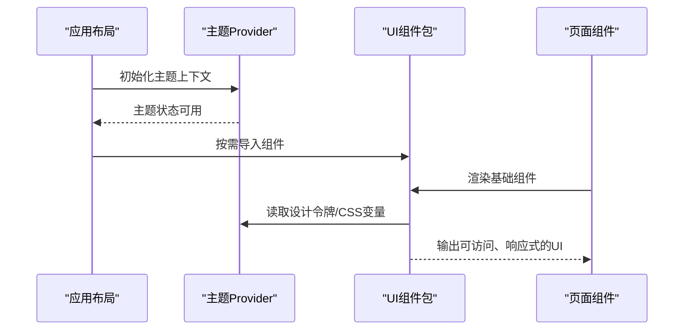
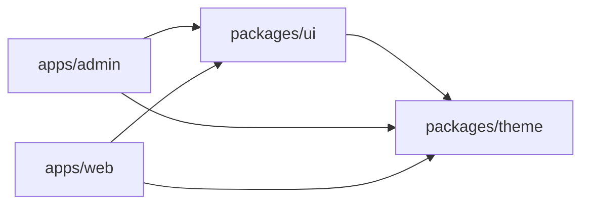

# 基础UI组件

<cite>
**本文档引用的文件**   
- [packages/ui/package.json](file://packages/ui/package.json)
- [packages/theme/package.json](file://packages/theme/package.json)
- [apps/admin/src/components/Providers.tsx](file://apps/admin/src/components/Providers.tsx)
- [apps/web/components.json](file://apps/web/components.json)
- [apps/web/src/app/layout.tsx](file://apps/web/src/app/layout.tsx)
- [apps/admin/src/app/layout.tsx](file://apps/admin/src/app/layout.tsx)
- [apps/web/src/app/globals.css](file://apps/web/src/app/globals.css)
- [apps/admin/src/app/globals.css](file://apps/admin/src/app/globals.css)
</cite>

## 目录
1. [简介](#简介)
2. [项目结构](#项目结构)
3. [核心组件](#核心组件)
4. [架构总览](#架构总览)
5. [详细组件分析](#详细组件分析)
6. [依赖分析](#依赖分析)
7. [性能考虑](#性能考虑)
8. [故障排查指南](#故障排查指南)
9. [结论](#结论)
10. [附录](#附录)

## 简介
本文件面向开发者与产品工程师，系统化梳理本项目中的“基础UI组件”体系：包括按钮、输入框、对话框、表单控件等通用能力的设计目标、使用方式、主题与样式定制、响应式与可访问性支持。由于当前仓库未包含具体的UI组件源码实现（如Button/Input/Dialog等），本文基于现有工程结构与配置进行架构级说明，并给出落地建议与最佳实践路径，帮助团队在后续迭代中快速补齐组件库。

## 项目结构
本项目采用多应用+多包的组织方式：
- apps/admin：管理后台应用（Next.js）
- apps/web：对外网站应用（Next.js）
- packages/ui：共享UI组件包（待实现）
- packages/theme：主题与样式系统（待实现）
- apps/*/src/app：页面与布局入口，负责全局样式与主题注入
- apps/*/components：业务组件与应用级组合组件

图表来源
- [apps/admin/src/app/layout.tsx](file://apps/admin/src/app/layout.tsx)
- [apps/web/src/app/layout.tsx](file://apps/web/src/app/layout.tsx)
- [packages/ui/package.json](file://packages/ui/package.json)
- [packages/theme/package.json](file://packages/theme/package.json)

章节来源
- [apps/admin/src/app/layout.tsx](file://apps/admin/src/app/layout.tsx)
- [apps/web/src/app/layout.tsx](file://apps/web/src/app/layout.tsx)
- [packages/ui/package.json](file://packages/ui/package.json)
- [packages/theme/package.json](file://packages/theme/package.json)

## 核心组件
当前仓库尚未提供具体UI组件源码，但已具备引入与组织的基础设施。建议按以下范围逐步实现：
- 按钮 Button：尺寸、变体、禁用态、加载态、图标集成、键盘可达性
- 输入框 Input：受控与非受控模式、前缀/后缀、校验提示、自适应宽度
- 对话框 Dialog：模态/非模态、焦点管理、ESC关闭、嵌套安全
- 表单控件 FormField：标签、占位符、错误信息、必填标记、辅助说明
- 选择器 Select/Combobox：搜索过滤、多选、远程数据、无障碍ARIA
- 通知 Toast：位置、类型、自动消失、队列控制
- 表格 Table：排序、分页、筛选、虚拟滚动（可选）
- 布局与反馈：Skeleton、Empty、Alert、Tooltip、Popover

以上组件应遵循统一设计令牌（颜色、间距、圆角、阴影、字体）、主题切换（明/暗色）、以及响应式断点策略。

[本节为概念性内容，不直接分析具体文件]

## 架构总览
UI组件的架构由“组件包 + 主题包 + 应用注入”三部分构成：
- packages/ui：定义组件API（props、事件、插槽）、默认样式、可访问性基线
- packages/theme：集中管理设计令牌、CSS变量、主题切换逻辑
- 应用层：通过布局或Provider注入主题上下文，按需引入组件

图表来源
- [apps/admin/src/app/layout.tsx](file://apps/admin/src/app/layout.tsx)
- [apps/web/src/app/layout.tsx](file://apps/web/src/app/layout.tsx)
- [packages/ui/package.json](file://packages/ui/package.json)
- [packages/theme/package.json](file://packages/theme/package.json)

章节来源
- [apps/admin/src/app/layout.tsx](file://apps/admin/src/app/layout.tsx)
- [apps/web/src/app/layout.tsx](file://apps/web/src/app/layout.tsx)
- [packages/ui/package.json](file://packages/ui/package.json)
- [packages/theme/package.json](file://packages/theme/package.json)

## 详细组件分析
由于当前仓库未包含具体组件源码，本节以“接口规范与使用范式”为主，指导后续实现与接入。

### 按钮 Button
- Props接口建议
  - variant: primary | secondary | ghost | danger
  - size: sm | md | lg
  - disabled: boolean
  - loading: boolean
  - icon: ReactNode
  - onClick: (e) => void
  - className/style: 覆盖样式
- 事件处理
  - 点击、键盘回车/空格触发、禁用态拦截
- 样式与主题
  - 通过CSS变量映射主色、边框、阴影；支持明/暗主题切换
- 可访问性
  - role="button"、tabIndex、aria-disabled、aria-busy（loading）
- 示例与最佳实践
  - 与图标组合时保持内边距一致
  - 长文本按钮换行需限制最大宽度
  - 表单提交按钮优先使用原生submit行为

章节来源
- [packages/ui/package.json](file://packages/ui/package.json)
- [packages/theme/package.json](file://packages/theme/package.json)

### 输入框 Input
- Props接口建议
  - value/onChange（受控）或 defaultValue（非受控）
  - placeholder、prefix/suffix、disabled、readOnly
  - error/helperText、required、maxLength
  - inputMode、autoComplete、name/id
- 事件处理
  - onChange、onFocus、onBlur、onKeyDown（Enter提交）
- 样式与主题
  - 聚焦态高亮、错误态红色边框、禁用态灰化
- 可访问性
  - aria-invalid、aria-describedby（关联helperText）、label绑定
- 示例与最佳实践
  - 与Form字段结合，统一错误展示
  - 移动端适配inputMode与键盘类型

章节来源
- [packages/ui/package.json](file://packages/ui/package.json)
- [packages/theme/package.json](file://packages/theme/package.json)

### 对话框 Dialog
- Props接口建议
  - open/onClose、title、children、footer/actions
  - modal、closeOnOverlay、closeOnEsc、focusTrap
- 事件处理
  - 打开/关闭回调、ESC关闭、遮罩点击关闭
- 样式与主题
  - 层级z-index、动画过渡、响应式宽度
- 可访问性
  - aria-modal、role="dialog"、焦点初始定位、返回焦点
- 示例与最佳实践
  - 避免嵌套多个模态框
  - 复杂表单建议使用Sheet/Drawer替代

章节来源
- [packages/ui/package.json](file://packages/ui/package.json)
- [packages/theme/package.json](file://packages/theme/package.json)

### 表单控件 FormField
- Props接口建议
  - label、name、required、error、helperText、disabled
  - renderInput: (fieldProps) => ReactNode
- 事件处理
  - 与表单库联动（如React Hook Form）
- 样式与主题
  - 标签对齐、错误文案颜色、必填星号
- 可访问性
  - htmlFor与id对应、aria-required、aria-invalid
- 示例与最佳实践
  - 统一校验规则与错误展示位置
  - 复杂场景拆分子组件（日期、选择器等）

章节来源
- [packages/ui/package.json](file://packages/ui/package.json)
- [packages/theme/package.json](file://packages/theme/package.json)

### 通知 Toast
- Props接口建议
  - type: info | success | warning | error
  - duration、position、closable、onClick
- 事件处理
  - 自动消失、手动关闭、队列控制
- 样式与主题
  - 不同type的颜色语义、图标、阴影
- 可访问性
  - aria-live、role="alert"、读屏播报
- 示例与最佳实践
  - 操作成功/失败分别提示
  - 避免同时出现过多Toast

章节来源
- [packages/ui/package.json](file://packages/ui/package.json)
- [packages/theme/package.json](file://packages/theme/package.json)

### 选择器 Select/Combobox
- Props接口建议
  - options、value/multiple、searchable、remoteData
  - placeholder、disabled、clearable
- 事件处理
  - onSelect、onSearch、onClear
- 样式与主题
  - 下拉面板定位、选项高亮、空状态
- 可访问性
  - aria-expanded、aria-activedescendant、键盘导航
- 示例与最佳实践
  - 大数据量使用虚拟滚动
  - 远程搜索防抖与缓存

章节来源
- [packages/ui/package.json](file://packages/ui/package.json)
- [packages/theme/package.json](file://packages/theme/package.json)

### 表格 Table
- Props接口建议
  - columns、data、pagination、sortable、filterable
  - rowKey、rowSelection、loading、empty
- 事件处理
  - onSort、onFilter、onRowClick、onSelectChange
- 样式与主题
  - 斑马纹、悬停、固定列、响应式折叠
- 可访问性
  - 表头scope、排序状态提示、空状态可读
- 示例与最佳实践
  - 大列表分页优先于无限滚动
  - 导出功能与筛选条件持久化

章节来源
- [packages/ui/package.json](file://packages/ui/package.json)
- [packages/theme/package.json](file://packages/theme/package.json)

### 布局与反馈 Skeleton/Empty/Alert/Tooltip/Popover
- Skeleton：骨架屏占位，提升感知性能
- Empty：无数据时的友好提示
- Alert：重要信息提醒（成功/警告/错误）
- Tooltip/PoPover：轻量提示与浮层内容
- 可访问性与主题：遵循语义化标签与主题变量

章节来源
- [packages/ui/package.json](file://packages/ui/package.json)
- [packages/theme/package.json](file://packages/theme/package.json)

## 依赖分析
- 组件包与主题包作为独立npm包，供admin与web应用共同引用
- 应用层通过布局或Provider注入主题上下文，确保组件一致性
- CSS变量与设计令牌集中管理，便于主题切换与品牌定制

图表来源
- [packages/ui/package.json](file://packages/ui/package.json)
- [packages/theme/package.json](file://packages/theme/package.json)
- [apps/admin/src/app/layout.tsx](file://apps/admin/src/app/layout.tsx)
- [apps/web/src/app/layout.tsx](file://apps/web/src/app/layout.tsx)

章节来源
- [packages/ui/package.json](file://packages/ui/package.json)
- [packages/theme/package.json](file://packages/theme/package.json)
- [apps/admin/src/app/layout.tsx](file://apps/admin/src/app/layout.tsx)
- [apps/web/src/app/layout.tsx](file://apps/web/src/app/layout.tsx)

## 性能考虑
- 按需引入：仅引入所需组件，减少打包体积
- 懒加载：对重型组件（如Table、Chart）使用动态导入
- 虚拟化：长列表使用虚拟滚动降低DOM压力
- 主题切换：使用CSS变量避免重绘重排
- 事件优化：防抖/节流搜索与网络请求

[本节为通用指导，不直接分析具体文件]

## 故障排查指南
- 主题未生效
  - 检查布局是否注入主题Provider
  - 确认CSS变量是否正确挂载到根节点
- 组件样式错乱
  - 检查Tailwind/PostCSS配置是否生效
  - 确认组件包版本与主题包版本兼容
- 可访问性问题
  - 使用浏览器无障碍工具检查ARIA属性
  - 键盘导航测试：Tab顺序、焦点可见性
- 构建与依赖
  - 清理pnpm缓存后重新安装
  - 检查workspace依赖解析与别名配置

章节来源
- [apps/admin/src/app/layout.tsx](file://apps/admin/src/app/layout.tsx)
- [apps/web/src/app/layout.tsx](file://apps/web/src/app/layout.tsx)
- [apps/web/src/app/globals.css](file://apps/web/src/app/globals.css)
- [apps/admin/src/app/globals.css](file://apps/admin/src/app/globals.css)

## 结论
当前仓库已具备UI组件体系的工程基础，下一步应在packages/ui与packages/theme中补齐组件实现与主题系统。通过统一的Props接口、事件约定、可访问性基线与主题变量，可在admin与web应用中保持一致的用户体验与开发效率。

[本节为总结性内容，不直接分析具体文件]

## 附录
- 组件清单与优先级建议
  - P0：Button、Input、Dialog、FormField、Toast
  - P1：Select/Combobox、Table、Alert、Tooltip、Popover
  - P2：Skeleton、Empty、Upload、DatePicker、TimePicker
- 响应式断点与主题变量命名规范
  - 断点：xs/sm/md/lg/xl
  - 变量：color-primary、spacing-md、radius-sm、shadow-md

[本节为补充信息，不直接分析具体文件]