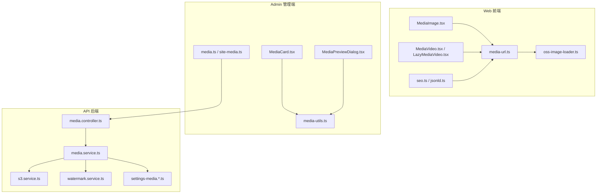
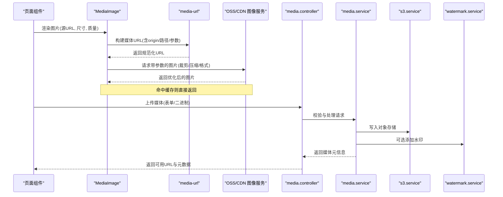
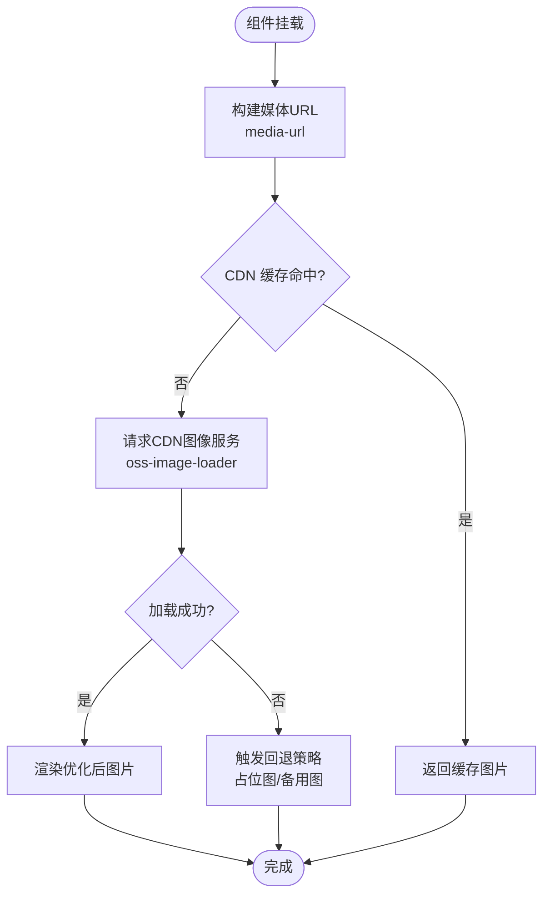
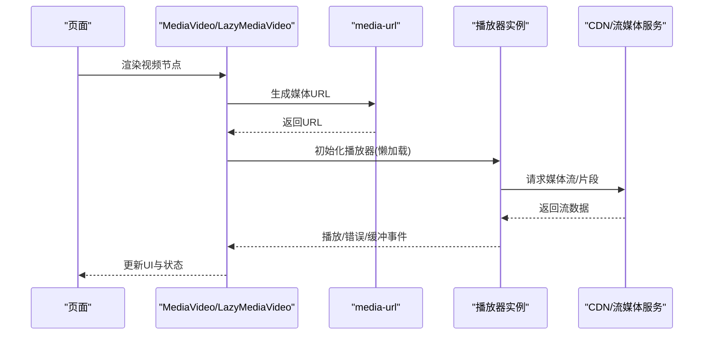
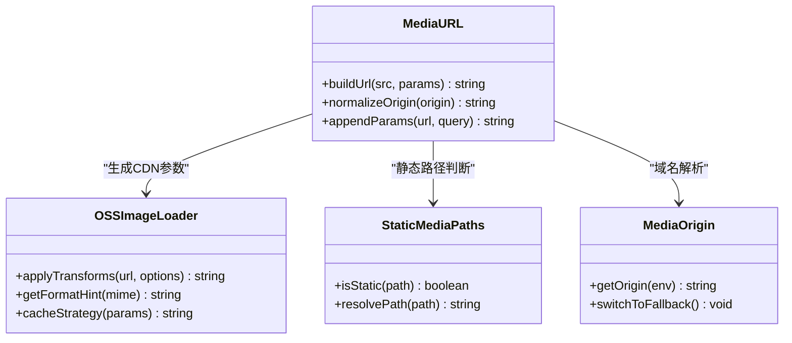
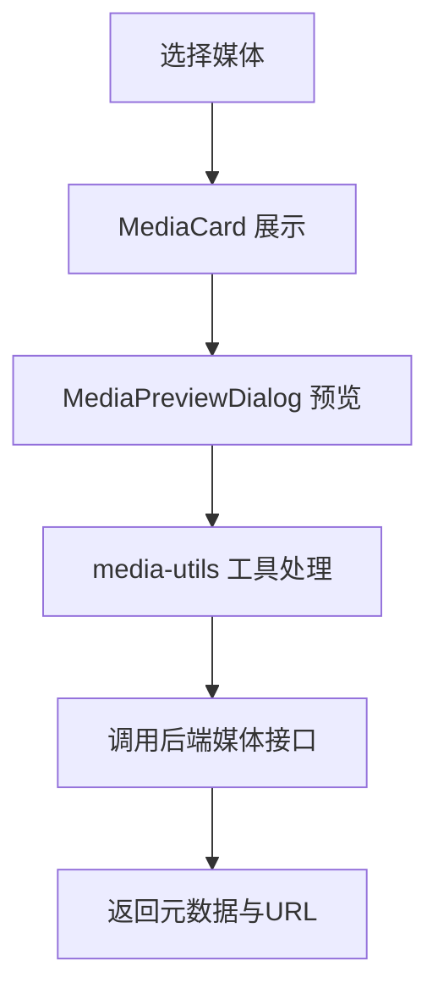
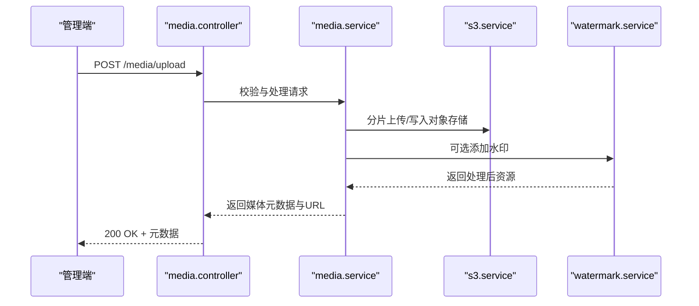
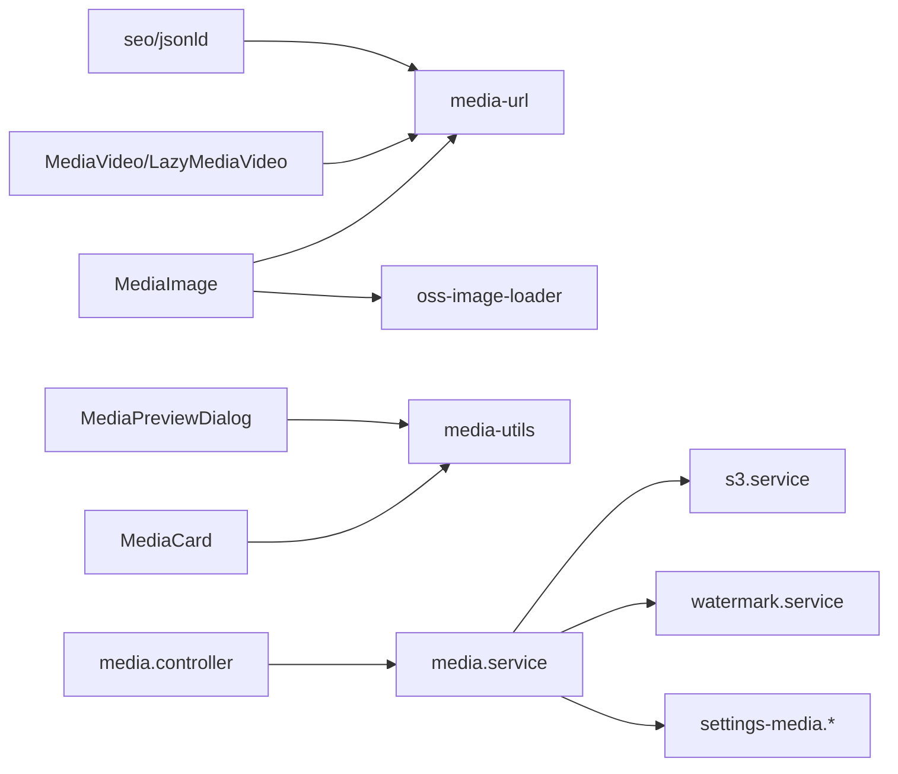

# 媒体组件

<cite>
**本文引用的文件**   
- [MediaImage.tsx](file://apps/web/src/components/MediaImage.tsx)
- [MediaVideo.tsx](file://apps/web/src/components/MediaVideo.tsx)
- [LazyMediaVideo.tsx](file://apps/web/src/components/LazyMediaVideo.tsx)
- [media-url.ts](file://apps/web/src/lib/media-url.ts)
- [oss-image-loader.ts](file://apps/web/src/lib/oss-image-loader.ts)
- [media-origin.ts](file://apps/web/src/lib/media-origin.ts)
- [static-media-paths.ts](file://apps/web/src/lib/static-media-paths.ts)
- [seo.ts](file://apps/web/src/lib/seo.ts)
- [jsonld.ts](file://apps/web/src/lib/jsonld.ts)
- [MediaCard.tsx](file://apps/admin/src/components/media/MediaCard.tsx)
- [MediaPreviewDialog.tsx](file://apps/admin/src/components/media/MediaPreviewDialog.tsx)
- [media-utils.ts](file://apps/admin/src/components/media/media-utils.ts)
- [media.ts](file://apps/admin/src/features/media.ts)
- [site-media.ts](file://apps/admin/src/features/site-media.ts)
- [media.controller.ts](file://apps/api/src/media/media.controller.ts)
- [media.service.ts](file://apps/api/src/media/media.service.ts)
- [s3.service.ts](file://apps/api/src/storage/s3.service.ts)
- [watermark.service.ts](file://apps/api/src/media/watermark.service.ts)
- [settings-media.defaults.ts](file://apps/api/src/settings/settings-media.defaults.ts)
- [settings-media.schema.ts](file://apps/api/src/settings/settings-media.schema.ts)
- [next.config.ts](file://apps/web/next.config.ts)
- [next.config.ts](file://apps/admin/next.config.ts)
</cite>

## 目录
1. [简介](#简介)
2. [项目结构](#项目结构)
3. [核心组件](#核心组件)
4. [架构总览](#架构总览)
5. [详细组件分析](#详细组件分析)
6. [依赖关系分析](#依赖关系分析)
7. [性能考量](#性能考量)
8. [故障排查指南](#故障排查指南)
9. [结论](#结论)
10. [附录](#附录)

## 简介
本文件面向“媒体组件”的完整文档，覆盖图片懒加载、视频播放器、媒体优化、响应式图片处理、格式转换、CDN 集成与性能优化策略，同时包含多媒体内容的 SEO 支持与可访问性实现，以及自定义媒体处理与错误处理的配置指南。内容基于仓库中前端（web）、管理端（admin）与后端（api）的媒体相关实现进行系统化梳理，帮助读者快速理解并正确使用这些能力。

## 项目结构
媒体能力横跨三个应用层：
- 前端 web：提供图片与视频组件、懒加载、CDN 图像加载器、SEO 与结构化数据注入等。
- 管理端 admin：提供媒体选择、预览、工具函数与站点媒体配置。
- 后端 api：提供媒体上传、存储、水印、静态路径映射与设置项校验等。

图表来源
- [MediaImage.tsx](file://apps/web/src/components/MediaImage.tsx)
- [MediaVideo.tsx](file://apps/web/src/components/MediaVideo.tsx)
- [LazyMediaVideo.tsx](file://apps/web/src/components/LazyMediaVideo.tsx)
- [media-url.ts](file://apps/web/src/lib/media-url.ts)
- [oss-image-loader.ts](file://apps/web/src/lib/oss-image-loader.ts)
- [seo.ts](file://apps/web/src/lib/seo.ts)
- [jsonld.ts](file://apps/web/src/lib/jsonld.ts)
- [MediaCard.tsx](file://apps/admin/src/components/media/MediaCard.tsx)
- [MediaPreviewDialog.tsx](file://apps/admin/src/components/media/MediaPreviewDialog.tsx)
- [media-utils.ts](file://apps/admin/src/components/media/media-utils.ts)
- [media.ts](file://apps/admin/src/features/media.ts)
- [site-media.ts](file://apps/admin/src/features/site-media.ts)
- [media.controller.ts](file://apps/api/src/media/media.controller.ts)
- [media.service.ts](file://apps/api/src/media/media.service.ts)
- [s3.service.ts](file://apps/api/src/storage/s3.service.ts)
- [watermark.service.ts](file://apps/api/src/media/watermark.service.ts)
- [settings-media.defaults.ts](file://apps/api/src/settings/settings-media.defaults.ts)
- [settings-media.schema.ts](file://apps/api/src/settings/settings-media.schema.ts)

章节来源
- [next.config.ts](file://apps/web/next.config.ts)
- [next.config.ts](file://apps/admin/next.config.ts)

## 核心组件
- 图片组件 MediaImage：负责响应式图片渲染、占位图、懒加载、尺寸适配与 CDN 参数拼接。
- 视频组件 MediaVideo / LazyMediaVideo：封装原生 video 或第三方播放器，支持懒加载、预加载控制与错误回退。
- URL 构建 media-url：统一生成媒体资源 URL，结合 origin、路径与查询参数，屏蔽存储差异。
- 图像加载器 oss-image-loader：对接 OSS/CDN 的图像服务，实现裁剪、压缩、格式转换与缓存策略。
- SEO 与结构化数据 seo.ts / jsonld.ts：为媒体内容注入 Open Graph、Twitter Card 与 JSON-LD 标记。
- Admin 媒体卡片与预览 MediaCard / MediaPreviewDialog：在管理端展示与预览媒体，提供基础工具函数。
- 后端媒体接口 media.controller / media.service：提供上传、鉴权、转码、水印、静态路径映射等能力。
- 存储与水印 s3.service / watermark.service：对接对象存储与图片水印处理。
- 媒体设置 settings-media.*：定义默认值与校验规则，支撑运行时行为切换。

章节来源
- [MediaImage.tsx](file://apps/web/src/components/MediaImage.tsx)
- [MediaVideo.tsx](file://apps/web/src/components/MediaVideo.tsx)
- [LazyMediaVideo.tsx](file://apps/web/src/components/LazyMediaVideo.tsx)
- [media-url.ts](file://apps/web/src/lib/media-url.ts)
- [oss-image-loader.ts](file://apps/web/src/lib/oss-image-loader.ts)
- [seo.ts](file://apps/web/src/lib/seo.ts)
- [jsonld.ts](file://apps/web/src/lib/jsonld.ts)
- [MediaCard.tsx](file://apps/admin/src/components/media/MediaCard.tsx)
- [MediaPreviewDialog.tsx](file://apps/admin/src/components/media/MediaPreviewDialog.tsx)
- [media-utils.ts](file://apps/admin/src/components/media/media-utils.ts)
- [media.controller.ts](file://apps/api/src/media/media.controller.ts)
- [media.service.ts](file://apps/api/src/media/media.service.ts)
- [s3.service.ts](file://apps/api/src/storage/s3.service.ts)
- [watermark.service.ts](file://apps/api/src/media/watermark.service.ts)
- [settings-media.defaults.ts](file://apps/api/src/settings/settings-media.defaults.ts)
- [settings-media.schema.ts](file://apps/api/src/settings/settings-media.schema.ts)

## 架构总览
媒体组件采用“前端渲染 + 服务端处理 + 对象存储/CDN”的分层架构：
- 前端通过 MediaImage/MediaVideo 渲染媒体，使用 media-url 生成标准化 URL，并通过 oss-image-loader 调用 CDN 的图像处理服务。
- 管理端通过 MediaCard/MediaPreviewDialog 提供可视化操作，借助 media-utils 与后端媒体接口交互。
- 后端 media.controller 暴露上传与访问接口，media.service 编排业务逻辑，s3.service 对接对象存储，watermark.service 提供水印能力，settings-media.* 提供配置开关。

图表来源
- [MediaImage.tsx](file://apps/web/src/components/MediaImage.tsx)
- [media-url.ts](file://apps/web/src/lib/media-url.ts)
- [oss-image-loader.ts](file://apps/web/src/lib/oss-image-loader.ts)
- [media.controller.ts](file://apps/api/src/media/media.controller.ts)
- [media.service.ts](file://apps/api/src/media/media.service.ts)
- [s3.service.ts](file://apps/api/src/storage/s3.service.ts)
- [watermark.service.ts](file://apps/api/src/media/watermark.service.ts)

## 详细组件分析

### 图片组件 MediaImage
- 功能要点
  - 响应式图片：根据容器宽度与设备像素比选择合适的尺寸与格式。
  - 懒加载：仅在进入视口时加载，减少首屏压力。
  - 占位图：在加载前显示骨架或低清占位，提升感知性能。
  - CDN 参数：通过 oss-image-loader 拼接裁剪、压缩、格式转换等参数。
  - 错误回退：加载失败时降级到备用图片或占位图。
- 关键流程
  - 接收 props（src、width、height、quality、format、placeholder、fallback）。
  - 使用 media-url 生成标准化 URL。
  - 将 URL 交给浏览器或 CDN 图像服务处理。
  - 监听加载事件与错误事件，更新状态与回退策略。

图表来源
- [MediaImage.tsx](file://apps/web/src/components/MediaImage.tsx)
- [media-url.ts](file://apps/web/src/lib/media-url.ts)
- [oss-image-loader.ts](file://apps/web/src/lib/oss-image-loader.ts)

章节来源
- [MediaImage.tsx](file://apps/web/src/components/MediaImage.tsx)
- [media-url.ts](file://apps/web/src/lib/media-url.ts)
- [oss-image-loader.ts](file://apps/web/src/lib/oss-image-loader.ts)

### 视频组件 MediaVideo / LazyMediaVideo
- 功能要点
  - 懒加载：延迟初始化播放器，避免阻塞首屏。
  - 预加载控制：按需预加载元数据或片段，平衡体验与带宽。
  - 错误处理：网络错误、解码失败时的回退与提示。
  - 自适应码率：根据网络状况自动切换清晰度（由播放器或 CDN 提供）。
- 关键流程
  - 组件挂载后检测可视区域，决定是否初始化播放器。
  - 构造媒体 URL（可能包含签名或 CDN 参数）。
  - 监听播放、暂停、错误、缓冲等事件，更新 UI 与统计。

图表来源
- [MediaVideo.tsx](file://apps/web/src/components/MediaVideo.tsx)
- [LazyMediaVideo.tsx](file://apps/web/src/components/LazyMediaVideo.tsx)
- [media-url.ts](file://apps/web/src/lib/media-url.ts)

章节来源
- [MediaVideo.tsx](file://apps/web/src/components/MediaVideo.tsx)
- [LazyMediaVideo.tsx](file://apps/web/src/components/LazyMediaVideo.tsx)
- [media-url.ts](file://apps/web/src/lib/media-url.ts)

### 媒体 URL 构建与 CDN 集成
- media-url：统一生成媒体资源 URL，处理 origin、路径、查询参数与签名。
- oss-image-loader：对接 OSS/CDN 的图像处理服务，支持裁剪、缩放、压缩、格式转换与缓存。
- static-media-paths：静态媒体路径白名单或映射，便于 SSR/预取与缓存优化。
- media-origin：媒体域名解析与切换，支持多环境或多 CDN。

图表来源
- [media-url.ts](file://apps/web/src/lib/media-url.ts)
- [oss-image-loader.ts](file://apps/web/src/lib/oss-image-loader.ts)
- [static-media-paths.ts](file://apps/web/src/lib/static-media-paths.ts)
- [media-origin.ts](file://apps/web/src/lib/media-origin.ts)

章节来源
- [media-url.ts](file://apps/web/src/lib/media-url.ts)
- [oss-image-loader.ts](file://apps/web/src/lib/oss-image-loader.ts)
- [static-media-paths.ts](file://apps/web/src/lib/static-media-paths.ts)
- [media-origin.ts](file://apps/web/src/lib/media-origin.ts)

### 管理端媒体组件与工具
- MediaCard：展示媒体缩略图、名称、类型与基本元数据，支持点击预览。
- MediaPreviewDialog：全屏预览图片/视频，支持缩放、旋转、下载等操作。
- media-utils：媒体类型判断、尺寸计算、格式转换建议、错误消息格式化。
- features/media.ts 与 site-media.ts：媒体列表获取、站点媒体配置与默认值。

图表来源
- [MediaCard.tsx](file://apps/admin/src/components/media/MediaCard.tsx)
- [MediaPreviewDialog.tsx](file://apps/admin/src/components/media/MediaPreviewDialog.tsx)
- [media-utils.ts](file://apps/admin/src/components/media/media-utils.ts)
- [media.ts](file://apps/admin/src/features/media.ts)
- [site-media.ts](file://apps/admin/src/features/site-media.ts)

章节来源
- [MediaCard.tsx](file://apps/admin/src/components/media/MediaCard.tsx)
- [MediaPreviewDialog.tsx](file://apps/admin/src/components/media/MediaPreviewDialog.tsx)
- [media-utils.ts](file://apps/admin/src/components/media/media-utils.ts)
- [media.ts](file://apps/admin/src/features/media.ts)
- [site-media.ts](file://apps/admin/src/features/site-media.ts)

### 后端媒体服务与存储
- media.controller：提供上传、访问、预览、删除等 REST 接口，包含鉴权与限流。
- media.service：编排上传流程、元数据提取、格式校验、转码与水印。
- s3.service：对接对象存储（如阿里云 OSS/S3），处理分片上传、签名与生命周期。
- watermark.service：在图片上叠加文字或图片水印，支持位置、透明度与尺寸。
- settings-media.defaults/schema：定义默认配置与校验规则，如最大文件大小、允许格式、水印开关等。

图表来源
- [media.controller.ts](file://apps/api/src/media/media.controller.ts)
- [media.service.ts](file://apps/api/src/media/media.service.ts)
- [s3.service.ts](file://apps/api/src/storage/s3.service.ts)
- [watermark.service.ts](file://apps/api/src/media/watermark.service.ts)

章节来源
- [media.controller.ts](file://apps/api/src/media/media.controller.ts)
- [media.service.ts](file://apps/api/src/media/media.service.ts)
- [s3.service.ts](file://apps/api/src/storage/s3.service.ts)
- [watermark.service.ts](file://apps/api/src/media/watermark.service.ts)
- [settings-media.defaults.ts](file://apps/api/src/settings/settings-media.defaults.ts)
- [settings-media.schema.ts](file://apps/api/src/settings/settings-media.schema.ts)

### SEO 与可访问性
- SEO：通过 seo.ts 与 jsonld.ts 注入 Open Graph、Twitter Card、JSON-LD 等标记，提升搜索引擎与社交分享效果。
- 可访问性：为图片提供 alt 文本，为视频提供字幕与键盘操作支持，确保屏幕阅读器友好。

章节来源
- [seo.ts](file://apps/web/src/lib/seo.ts)
- [jsonld.ts](file://apps/web/src/lib/jsonld.ts)

## 依赖关系分析
- 前端依赖
  - MediaImage/MediaVideo 依赖 media-url 与 oss-image-loader，间接依赖 static-media-paths 与 media-origin。
  - SEO 模块依赖媒体元数据以生成合适的标记。
- 管理端依赖
  - MediaCard/MediaPreviewDialog 依赖 media-utils 与后端媒体接口。
- 后端依赖
  - media.controller 依赖 media.service；media.service 依赖 s3.service 与 watermark.service；所有模块受 settings-media.* 约束。

图表来源
- [MediaImage.tsx](file://apps/web/src/components/MediaImage.tsx)
- [MediaVideo.tsx](file://apps/web/src/components/MediaVideo.tsx)
- [LazyMediaVideo.tsx](file://apps/web/src/components/LazyMediaVideo.tsx)
- [media-url.ts](file://apps/web/src/lib/media-url.ts)
- [oss-image-loader.ts](file://apps/web/src/lib/oss-image-loader.ts)
- [seo.ts](file://apps/web/src/lib/seo.ts)
- [jsonld.ts](file://apps/web/src/lib/jsonld.ts)
- [MediaCard.tsx](file://apps/admin/src/components/media/MediaCard.tsx)
- [MediaPreviewDialog.tsx](file://apps/admin/src/components/media/MediaPreviewDialog.tsx)
- [media-utils.ts](file://apps/admin/src/components/media/media-utils.ts)
- [media.controller.ts](file://apps/api/src/media/media.controller.ts)
- [media.service.ts](file://apps/api/src/media/media.service.ts)
- [s3.service.ts](file://apps/api/src/storage/s3.service.ts)
- [watermark.service.ts](file://apps/api/src/media/watermark.service.ts)
- [settings-media.defaults.ts](file://apps/api/src/settings/settings-media.defaults.ts)
- [settings-media.schema.ts](file://apps/api/src/settings/settings-media.schema.ts)

章节来源
- [media-url.ts](file://apps/web/src/lib/media-url.ts)
- [oss-image-loader.ts](file://apps/web/src/lib/oss-image-loader.ts)
- [media.controller.ts](file://apps/api/src/media/media.controller.ts)
- [media.service.ts](file://apps/api/src/media/media.service.ts)
- [s3.service.ts](file://apps/api/src/storage/s3.service.ts)
- [watermark.service.ts](file://apps/api/src/media/watermark.service.ts)
- [settings-media.defaults.ts](file://apps/api/src/settings/settings-media.defaults.ts)
- [settings-media.schema.ts](file://apps/api/src/settings/settings-media.schema.ts)

## 性能考量
- 图片优化
  - 使用 CDN 图像服务进行裁剪、压缩与格式转换（如 WebP/AVIF），减少体积。
  - 合理设置 quality 与 width/height，避免过度压缩或过大尺寸。
  - 启用浏览器与 CDN 缓存，利用强缓存与协商缓存策略。
- 视频优化
  - 懒加载与预加载控制，降低首屏负载。
  - 使用自适应码率与分片传输，提升播放稳定性。
  - 对封面图进行单独优化，缩短首帧时间。
- 缓存策略
  - 静态媒体路径白名单用于 SSR 与预取，减少重复请求。
  - 媒体 URL 参数化，区分不同尺寸与格式，提高缓存命中率。
- 错误回退
  - 图片加载失败时回退到占位图或备用图，保证用户体验。
  - 视频播放失败时提示用户重试或切换清晰度。

[本节为通用指导，不直接分析具体文件]

## 故障排查指南
- 常见问题
  - 图片无法加载：检查 media-origin 配置、CDN 域名与 CORS 设置。
  - 视频无法播放：确认媒体格式、编码与 CDN 支持情况，检查签名与过期时间。
  - 上传失败：核对文件大小限制、允许格式与权限配置。
  - 水印未生效：检查 watermark 开关与参数，确认原图尺寸与水印位置。
- 定位方法
  - 查看浏览器开发者工具的 Network 面板，确认请求 URL 与响应状态。
  - 检查控制台日志中的错误信息与回退策略是否触发。
  - 在后端日志中搜索媒体上传与处理流程的关键步骤。

章节来源
- [media.controller.ts](file://apps/api/src/media/media.controller.ts)
- [media.service.ts](file://apps/api/src/media/media.service.ts)
- [s3.service.ts](file://apps/api/src/storage/s3.service.ts)
- [watermark.service.ts](file://apps/api/src/media/watermark.service.ts)
- [settings-media.defaults.ts](file://apps/api/src/settings/settings-media.defaults.ts)
- [settings-media.schema.ts](file://apps/api/src/settings/settings-media.schema.ts)

## 结论
媒体组件通过前后端协同与 CDN 优化，实现了高性能、可扩展的多媒体处理能力。前端组件提供响应式与懒加载，后端服务提供上传、转码与水印，配合 SEO 与可访问性最佳实践，满足生产环境的多样化需求。建议在生产环境中严格配置媒体大小限制、格式白名单与缓存策略，并结合监控与日志持续优化。

[本节为总结性内容，不直接分析具体文件]

## 附录
- 配置建议
  - 设置合理的最大文件大小与允许格式，避免滥用与安全风险。
  - 启用 CDN 缓存与图像优化，按场景调整 quality 与 format。
  - 为敏感媒体启用签名与过期时间，保障数据安全。
- 扩展方向
  - 增加更多格式转换与转码选项（如 H.265、AV1）。
  - 引入智能裁剪与焦点识别，提升展示效果。
  - 增强错误监控与告警，快速定位问题。

[本节为补充说明，不直接分析具体文件]