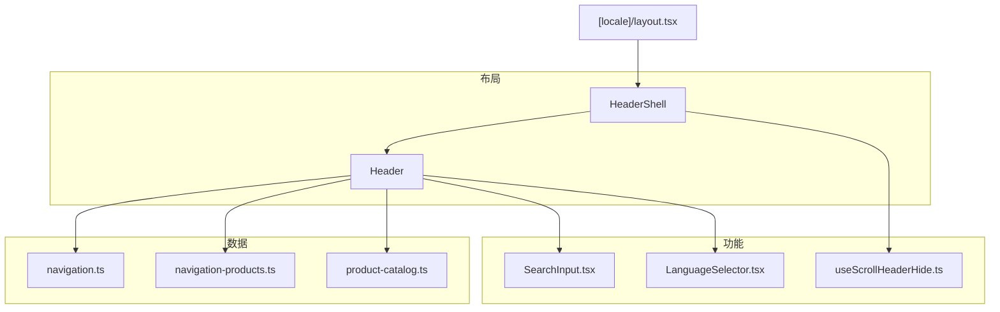
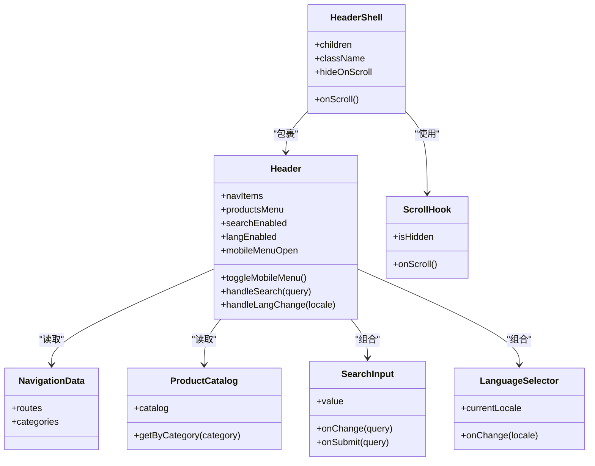
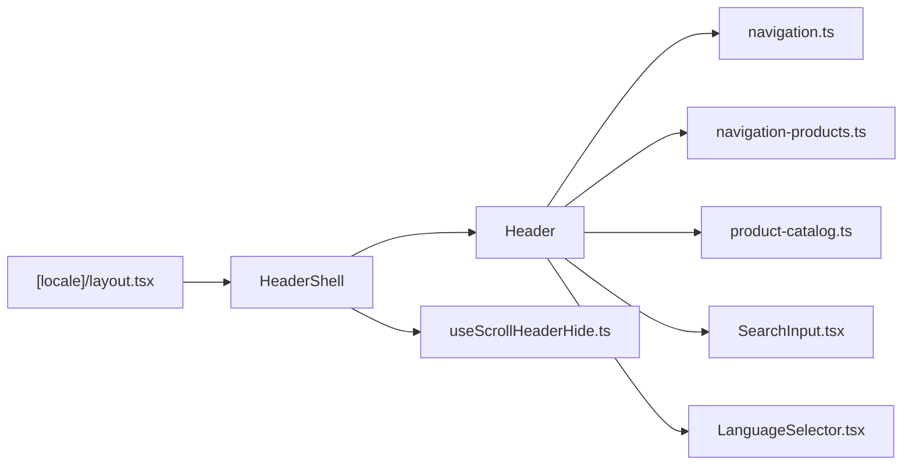

# 头部导航组件

<cite>
**本文档引用的文件**   
- [apps/web/src/components/layout/Header.tsx](file://apps/web/src/components/layout/Header.tsx)
- [apps/web/src/components/layout/HeaderShell.tsx](file://apps/web/src/components/layout/HeaderShell.tsx)
- [apps/web/src/lib/navigation.ts](file://apps/web/src/lib/navigation.ts)
- [apps/web/src/lib/navigation-products.ts](file://apps/web/src/lib/navigation-products.ts)
- [apps/web/src/lib/product-catalog.ts](file://apps/web/src/lib/product-catalog.ts)
- [apps/web/src/components/search/SearchInput.tsx](file://apps/web/src/components/search/SearchInput.tsx)
- [apps/web/src/components/i18n/LanguageSelector.tsx](file://apps/web/src/components/i18n/LanguageSelector.tsx)
- [apps/web/src/hooks/useScrollHeaderHide.ts](file://apps/web/src/hooks/useScrollHeaderHide.ts)
- [apps/web/src/app/[locale]/layout.tsx](file://apps/web/src/app/[locale]/layout.tsx)
</cite>

## 目录
1. [简介](#简介)
2. [项目结构](#项目结构)
3. [核心组件](#核心组件)
4. [架构总览](#架构总览)
5. [详细组件分析](#详细组件分析)
6. [依赖关系分析](#依赖关系分析)
7. [性能考虑](#性能考虑)
8. [故障排查指南](#故障排查指南)
9. [结论](#结论)
10. [附录：使用示例与最佳实践](#附录使用示例与最佳实践)

## 简介
本文件面向头部导航组件（Header 与 HeaderShell）的实现原理与使用方式，覆盖响应式导航菜单、产品目录集成、搜索功能集成、多语言支持、props 接口、事件处理、状态管理与样式定制。文档同时提供移动端适配的最佳实践与性能优化建议，并给出实际代码示例路径，帮助快速自定义导航结构、新增菜单项和集成第三方服务。

## 项目结构
头部导航相关代码主要位于 apps/web 前端应用中：
- 布局层：HeaderShell 负责页面级外壳（如滚动隐藏、全局容器等），Header 负责具体导航内容渲染。
- 数据层：navigation.ts 与 navigation-products.ts 定义站点导航结构与产品目录映射；product-catalog.ts 提供产品目录数据结构与工具。
- 功能模块：SearchInput 提供搜索输入与交互；LanguageSelector 提供多语言切换；useScrollHeaderHide 提供滚动时隐藏/显示头部的能力。
- 集成点：[locale] 路由 layout 将 HeaderShell/Header 注入到页面布局中，确保全站一致体验。

图表来源
- [apps/web/src/components/layout/Header.tsx](file://apps/web/src/components/layout/Header.tsx)
- [apps/web/src/components/layout/HeaderShell.tsx](file://apps/web/src/components/layout/HeaderShell.tsx)
- [apps/web/src/lib/navigation.ts](file://apps/web/src/lib/navigation.ts)
- [apps/web/src/lib/navigation-products.ts](file://apps/web/src/lib/navigation-products.ts)
- [apps/web/src/lib/product-catalog.ts](file://apps/web/src/lib/product-catalog.ts)
- [apps/web/src/components/search/SearchInput.tsx](file://apps/web/src/components/search/SearchInput.tsx)
- [apps/web/src/components/i18n/LanguageSelector.tsx](file://apps/web/src/components/i18n/LanguageSelector.tsx)
- [apps/web/src/hooks/useScrollHeaderHide.ts](file://apps/web/src/hooks/useScrollHeaderHide.ts)
- [apps/web/src/app/[locale]/layout.tsx](file://apps/web/src/app/[locale]/layout.tsx)

章节来源
- [apps/web/src/app/[locale]/layout.tsx](file://apps/web/src/app/[locale]/layout.tsx)

## 核心组件
- HeaderShell：作为头部外壳，负责包裹 Header，并提供滚动行为控制（如滚动时自动隐藏/显示）、全局容器样式、以及可能的品牌区域占位。
- Header：实现具体的导航菜单渲染，包括主导航、产品目录下拉、搜索入口、语言选择器、移动端汉堡菜单等。

章节来源
- [apps/web/src/components/layout/HeaderShell.tsx](file://apps/web/src/components/layout/HeaderShell.tsx)
- [apps/web/src/components/layout/Header.tsx](file://apps/web/src/components/layout/Header.tsx)

## 架构总览
头部导航的架构遵循“外壳 + 内容”的分层设计：
- 外壳层（HeaderShell）关注非业务性横切关注点（滚动、容器、主题）。
- 内容层（Header）聚焦导航数据、交互逻辑与 UI 组合。
- 数据层（navigation.*、product-catalog）集中管理导航结构与产品目录，避免在组件内硬编码。
- 功能模块（SearchInput、LanguageSelector）以可复用子组件形式被 Header 组合。

图表来源
- [apps/web/src/components/layout/HeaderShell.tsx](file://apps/web/src/components/layout/HeaderShell.tsx)
- [apps/web/src/components/layout/Header.tsx](file://apps/web/src/components/layout/Header.tsx)
- [apps/web/src/lib/navigation.ts](file://apps/web/src/lib/navigation.ts)
- [apps/web/src/lib/navigation-products.ts](file://apps/web/src/lib/navigation-products.ts)
- [apps/web/src/lib/product-catalog.ts](file://apps/web/src/lib/product-catalog.ts)
- [apps/web/src/components/search/SearchInput.tsx](file://apps/web/src/components/search/SearchInput.tsx)
- [apps/web/src/components/i18n/LanguageSelector.tsx](file://apps/web/src/components/i18n/LanguageSelector.tsx)
- [apps/web/src/hooks/useScrollHeaderHide.ts](file://apps/web/src/hooks/useScrollHeaderHide.ts)

## 详细组件分析

### HeaderShell 组件
- 职责
  - 提供头部外壳容器，统一样式与布局。
  - 通过滚动钩子控制头部显隐，提升移动端阅读体验。
  - 透传 children（Header）与 className，便于主题定制。
- 关键特性
  - 滚动监听：基于 useScrollHeaderHide 获取 isHidden 状态，动态添加 CSS 类或 transform 实现隐藏/显示。
  - 可配置性：支持 hideOnScroll 开关，默认行为可按需开启。
- 状态管理
  - 内部仅维护滚动相关的本地状态（是否隐藏），不持有业务状态。
- 事件处理
  - onScroll：由滚动钩子触发，更新 isHidden。
- 样式定制
  - 通过 className 扩展样式；推荐在外壳层设置背景、阴影、z-index 等通用样式。

章节来源
- [apps/web/src/components/layout/HeaderShell.tsx](file://apps/web/src/components/layout/HeaderShell.tsx)
- [apps/web/src/hooks/useScrollHeaderHide.ts](file://apps/web/src/hooks/useScrollHeaderHide.ts)

### Header 组件
- 职责
  - 渲染主导航菜单、产品目录下拉、搜索入口、语言选择器与移动端汉堡菜单。
  - 聚合导航数据与产品目录数据，驱动菜单渲染。
  - 处理用户交互（打开/关闭菜单、搜索提交、语言切换）。
- 关键特性
  - 响应式菜单：在小屏设备下切换为抽屉式或折叠菜单。
  - 产品目录集成：根据 navigation-products 与 product-catalog 生成多级菜单。
  - 搜索集成：调用 SearchInput 组件，支持即时建议与跳转。
  - 多语言支持：通过 LanguageSelector 切换 locale，影响路由与文案。
- 状态管理
  - mobileMenuOpen：控制移动端菜单展开/收起。
  - searchQuery：绑定搜索输入框的值。
  - 其他展示状态（如下拉展开）可由子组件内部管理。
- 事件处理
  - toggleMobileMenu：切换移动端菜单可见性。
  - handleSearch：接收查询字符串，执行搜索跳转或调用搜索 API。
  - handleLangChange：切换语言并更新路由前缀。
- 样式定制
  - 通过 props.className 或外层容器样式覆盖；建议保持语义化类名，避免破坏响应式断点。

章节来源
- [apps/web/src/components/layout/Header.tsx](file://apps/web/src/components/layout/Header.tsx)
- [apps/web/src/components/search/SearchInput.tsx](file://apps/web/src/components/search/SearchInput.tsx)
- [apps/web/src/components/i18n/LanguageSelector.tsx](file://apps/web/src/components/i18n/LanguageSelector.tsx)

### 导航数据与产品目录
- navigation.ts
  - 定义站点主导航结构（路由、标题、分组等），供 Header 渲染主菜单。
- navigation-products.ts
  - 定义产品线的导航映射，结合 product-catalog 生成产品目录菜单。
- product-catalog.ts
  - 提供产品目录的数据模型与查询方法（按分类、关键词过滤等）。

章节来源
- [apps/web/src/lib/navigation.ts](file://apps/web/src/lib/navigation.ts)
- [apps/web/src/lib/navigation-products.ts](file://apps/web/src/lib/navigation-products.ts)
- [apps/web/src/lib/product-catalog.ts](file://apps/web/src/lib/product-catalog.ts)

### 搜索与多语言集成
- SearchInput
  - 提供受控或非受控的输入框，支持 onChange 与 onSubmit 回调。
  - 可与后端搜索 API 集成，实现建议列表与结果页跳转。
- LanguageSelector
  - 当前语言标识与切换回调，通常与 Next.js 国际化路由配合。
  - 切换后应更新 URL 前缀与文案资源。

章节来源
- [apps/web/src/components/search/SearchInput.tsx](file://apps/web/src/components/search/SearchInput.tsx)
- [apps/web/src/components/i18n/LanguageSelector.tsx](file://apps/web/src/components/i18n/LanguageSelector.tsx)

## 依赖关系分析
- HeaderShell 依赖滚动钩子（useScrollHeaderHide）控制显隐。
- Header 依赖导航数据（navigation.ts、navigation-products.ts）与产品目录（product-catalog.ts）。
- Header 组合 SearchInput 与 LanguageSelector 完成搜索与多语言功能。
- 路由层 [locale]/layout.tsx 将 HeaderShell/Header 注入到页面布局，保证全站一致性。

图表来源
- [apps/web/src/app/[locale]/layout.tsx](file://apps/web/src/app/[locale]/layout.tsx)
- [apps/web/src/components/layout/HeaderShell.tsx](file://apps/web/src/components/layout/HeaderShell.tsx)
- [apps/web/src/components/layout/Header.tsx](file://apps/web/src/components/layout/Header.tsx)
- [apps/web/src/lib/navigation.ts](file://apps/web/src/lib/navigation.ts)
- [apps/web/src/lib/navigation-products.ts](file://apps/web/src/lib/navigation-products.ts)
- [apps/web/src/lib/product-catalog.ts](file://apps/web/src/lib/product-catalog.ts)
- [apps/web/src/components/search/SearchInput.tsx](file://apps/web/src/components/search/SearchInput.tsx)
- [apps/web/src/components/i18n/LanguageSelector.tsx](file://apps/web/src/components/i18n/LanguageSelector.tsx)
- [apps/web/src/hooks/useScrollHeaderHide.ts](file://apps/web/src/hooks/useScrollHeaderHide.ts)

## 性能考虑
- 滚动性能
  - 使用 requestAnimationFrame 或节流策略减少频繁重排；确保 onScroll 回调轻量。
- 渲染优化
  - 对菜单项进行懒加载或虚拟列表（当菜单项数量较大时）。
  - 使用 React.memo 包裹子组件以减少不必要的重渲染。
- 网络请求
  - 搜索建议采用防抖与缓存策略，避免重复请求。
  - 产品目录数据可在构建期或首屏预取，减少运行时开销。
- 样式与布局
  - 避免在滚动回调中直接操作 DOM；优先使用 CSS transform 与 opacity 提升合成性能。
  - 合理设置 z-index，避免不必要的重绘。

## 故障排查指南
- 头部未随滚动隐藏
  - 检查 useScrollHeaderHide 是否正确挂载与返回 isHidden。
  - 确认 HeaderShell 的 hideOnScroll 开关已启用。
- 产品目录菜单为空
  - 核对 navigation-products.ts 与 product-catalog.ts 的数据结构是否匹配。
  - 检查分类键值是否与路由或菜单项一致。
- 搜索无响应
  - 确认 SearchInput 的 onChange/onSubmit 回调已正确绑定。
  - 检查搜索 API 的跨域与错误处理。
- 语言切换无效
  - 验证 LanguageSelector 的 onChange 是否更新了路由前缀与 i18n 资源。
  - 检查 [locale] 路由配置是否正确。

章节来源
- [apps/web/src/hooks/useScrollHeaderHide.ts](file://apps/web/src/hooks/useScrollHeaderHide.ts)
- [apps/web/src/components/search/SearchInput.tsx](file://apps/web/src/components/search/SearchInput.tsx)
- [apps/web/src/components/i18n/LanguageSelector.tsx](file://apps/web/src/components/i18n/LanguageSelector.tsx)
- [apps/web/src/app/[locale]/layout.tsx](file://apps/web/src/app/[locale]/layout.tsx)

## 结论
Header 与 HeaderShell 通过清晰的分层与模块化设计，实现了响应式导航、产品目录集成、搜索与多语言支持。借助集中化的导航数据与产品目录，组件具备良好的可扩展性与可维护性。遵循本文的性能优化与移动端适配建议，可获得更流畅的用户体验。

## 附录：使用示例与最佳实践

### 自定义导航结构
- 修改导航数据
  - 在 navigation.ts 中添加新的菜单项或分组，确保路由与标题正确。
  - 在 navigation-products.ts 中扩展产品线映射，使 Header 能渲染新菜单。
- 代码示例路径
  - [apps/web/src/lib/navigation.ts](file://apps/web/src/lib/navigation.ts)
  - [apps/web/src/lib/navigation-products.ts](file://apps/web/src/lib/navigation-products.ts)

### 新增菜单项
- 步骤
  - 在导航数据中新增条目（名称、路由、图标可选）。
  - 若属于产品目录，需在 navigation-products.ts 中关联对应分类。
  - 在 Header 中确保渲染逻辑覆盖新条目。
- 代码示例路径
  - [apps/web/src/components/layout/Header.tsx](file://apps/web/src/components/layout/Header.tsx)

### 集成第三方搜索服务
- 步骤
  - 在 SearchInput 中接入第三方 SDK 或 API，实现建议与结果跳转。
  - 处理鉴权与错误提示，确保用户体验。
- 代码示例路径
  - [apps/web/src/components/search/SearchInput.tsx](file://apps/web/src/components/search/SearchInput.tsx)

### 多语言支持
- 步骤
  - 使用 LanguageSelector 切换 locale，并确保路由前缀与文案资源同步更新。
  - 在 [locale]/layout.tsx 中初始化国际化上下文。
- 代码示例路径
  - [apps/web/src/components/i18n/LanguageSelector.tsx](file://apps/web/src/components/i18n/LanguageSelector.tsx)
  - [apps/web/src/app/[locale]/layout.tsx](file://apps/web/src/app/[locale]/layout.tsx)

### 移动端适配最佳实践
- 使用汉堡菜单与抽屉式导航，避免拥挤布局。
- 增大触控目标尺寸，提升点击成功率。
- 利用媒体查询与响应式断点，确保在不同屏幕尺寸下的可读性。
- 代码示例路径
  - [apps/web/src/components/layout/Header.tsx](file://apps/web/src/components/layout/Header.tsx)

### 性能优化建议
- 对搜索输入进行防抖，减少请求频率。
- 菜单项较多时使用懒加载或虚拟化渲染。
- 避免在滚动回调中进行昂贵计算，必要时使用节流。
- 代码示例路径
  - [apps/web/src/components/search/SearchInput.tsx](file://apps/web/src/components/search/SearchInput.tsx)
  - [apps/web/src/hooks/useScrollHeaderHide.ts](file://apps/web/src/hooks/useScrollHeaderHide.ts)