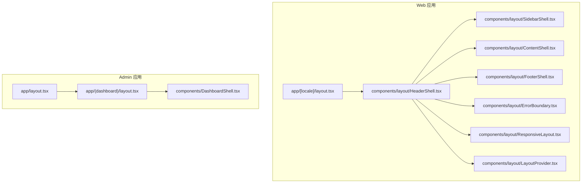
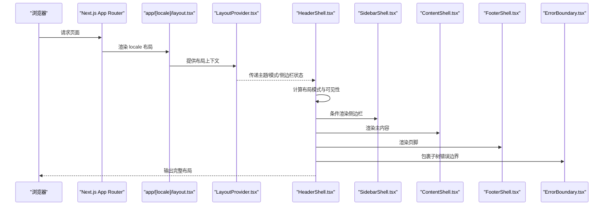
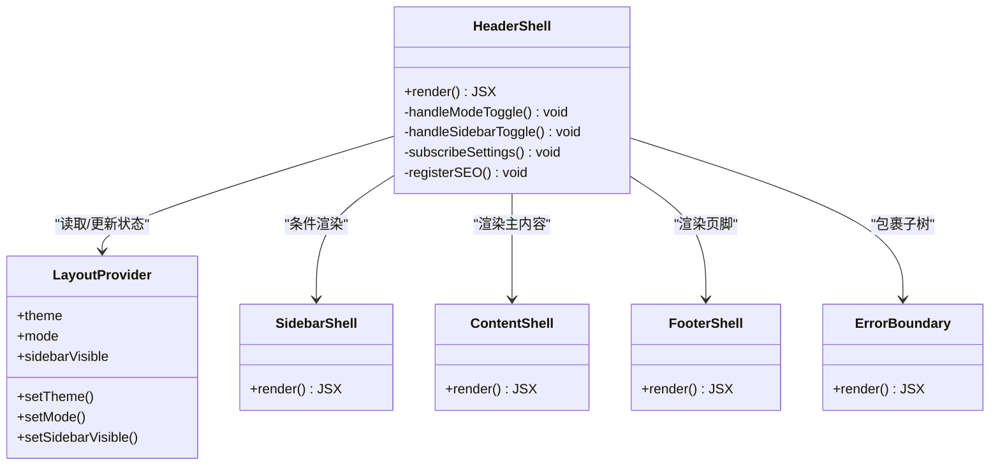
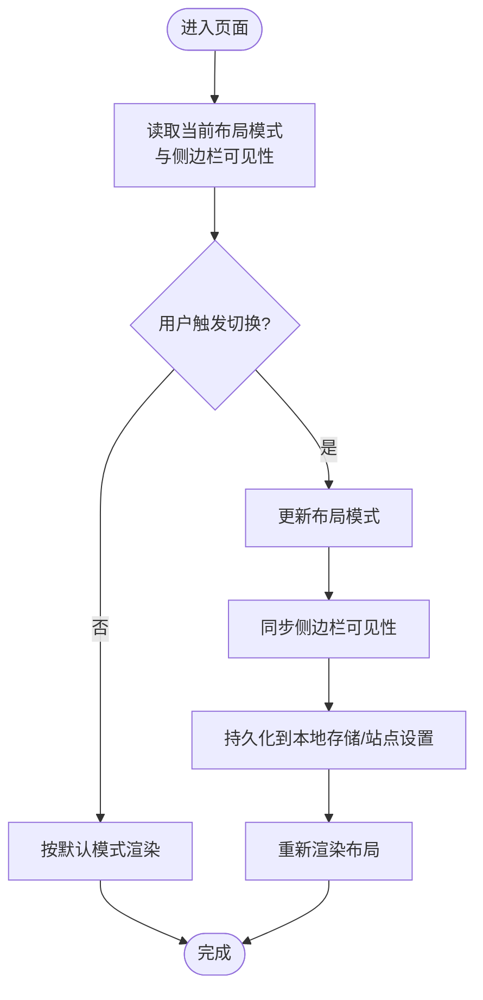
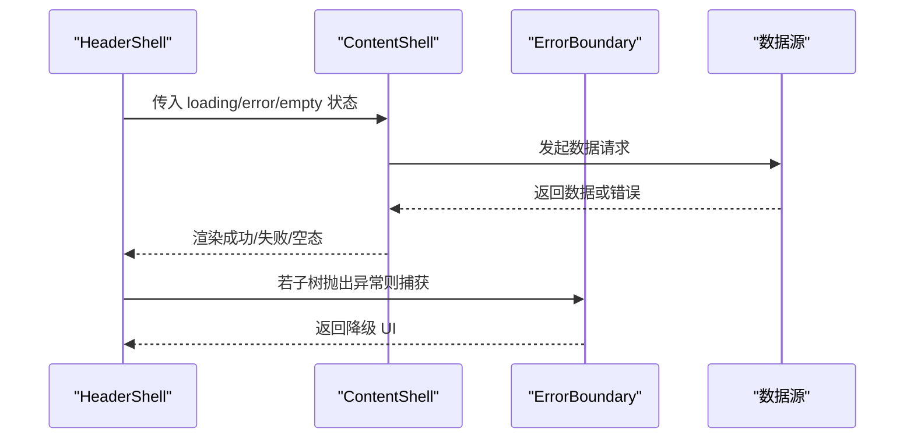
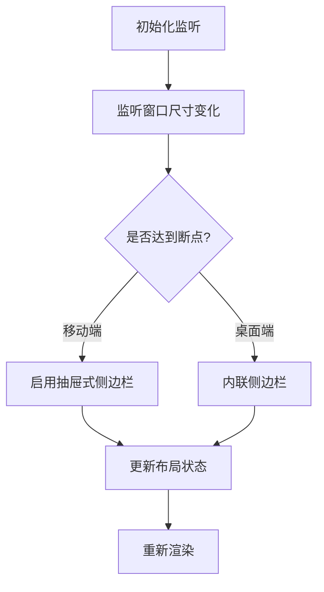
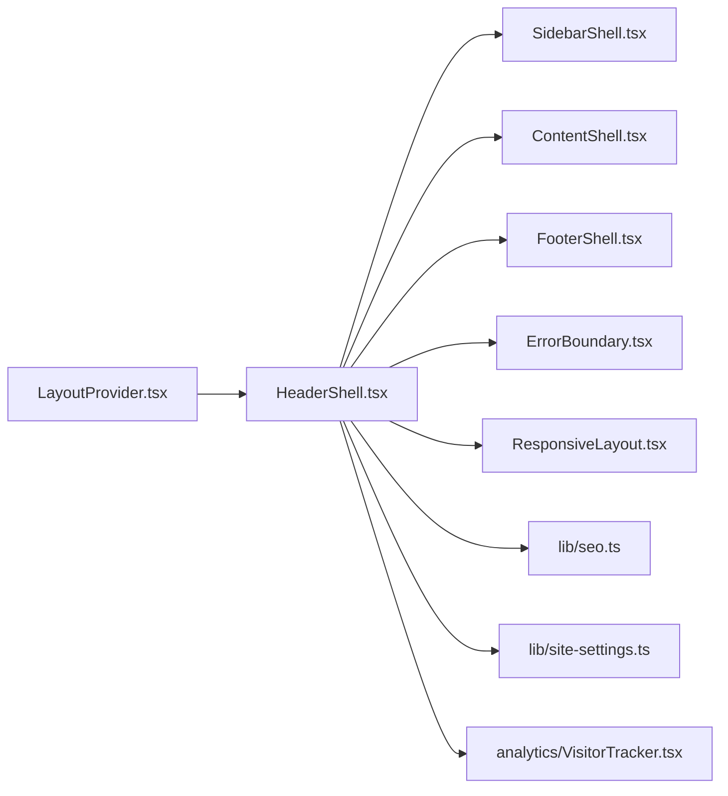

# 布局外壳组件

<cite>
**本文引用的文件**   
- [apps/admin/src/components/DashboardShell.tsx](file://apps/admin/src/components/DashboardShell.tsx)
- [apps/admin/src/app/(dashboard)/layout.tsx](file://apps/admin/src/app/(dashboard)/layout.tsx)
- [apps/admin/src/app/layout.tsx](file://apps/admin/src/app/layout.tsx)
- [apps/web/src/app/[locale]/layout.tsx](file://apps/web/src/app/[locale]/layout.tsx)
- [apps/web/src/app/layout.tsx](file://apps/web/src/app/layout.tsx)
- [apps/web/src/components/layout/index.tsx](file://apps/web/src/components/layout/index.tsx)
- [apps/web/src/components/layout/HeaderShell.tsx](file://apps/web/src/components/layout/HeaderShell.tsx)
- [apps/web/src/components/layout/SidebarShell.tsx](file://apps/web/src/components/layout/SidebarShell.tsx)
- [apps/web/src/components/layout/ContentShell.tsx](file://apps/web/src/components/layout/ContentShell.tsx)
- [apps/web/src/components/layout/FooterShell.tsx](file://apps/web/src/components/layout/FooterShell.tsx)
- [apps/web/src/components/layout/ErrorBoundary.tsx](file://apps/web/src/components/layout/ErrorBoundary.tsx)
- [apps/web/src/components/layout/ResponsiveLayout.tsx](file://apps/web/src/components/layout/ResponsiveLayout.tsx)
- [apps/web/src/components/layout/LayoutProvider.tsx](file://apps/web/src/components/layout/LayoutProvider.tsx)
- [apps/web/src/lib/seo.ts](file://apps/web/src/lib/seo.ts)
- [apps/web/src/lib/site-settings.ts](file://apps/web/src/lib/site-settings.ts)
- [apps/web/src/components/analytics/VisitorTracker.tsx](file://apps/web/src/components/analytics/VisitorTracker.tsx)
</cite>

## 目录
1. [简介](#简介)
2. [项目结构](#项目结构)
3. [核心组件](#核心组件)
4. [架构总览](#架构总览)
5. [详细组件分析](#详细组件分析)
6. [依赖关系分析](#依赖关系分析)
7. [性能考量](#性能考量)
8. [故障排查指南](#故障排查指南)
9. [结论](#结论)
10. [附录](#附录)

## 简介
本文件围绕“布局外壳组件”展开，重点阐述 HeaderShell 作为布局容器的职责与实现方式。内容涵盖页面结构组织、子组件协调、状态共享与生命周期管理；说明布局模式切换、动态内容加载与错误边界处理；并提供布局定制、主题集成、性能监控、响应式适配、SEO 优化与可访问性最佳实践；最后展示如何创建自定义布局模板与扩展布局功能。

## 项目结构
本项目采用多应用（Admin 与 Web）的 Monorepo 结构，布局相关代码主要分布在：
- Admin 应用：以 DashboardShell 为核心的后台布局容器，配合 Next.js App Router 的 layout.tsx 组织页面结构。
- Web 应用：以 HeaderShell 为核心，结合 SidebarShell、ContentShell、FooterShell 等组合成完整页面骨架，并通过 LayoutProvider 提供布局上下文与主题配置。

图表来源
- [apps/web/src/app/[locale]/layout.tsx](file://apps/web/src/app/[locale]/layout.tsx)
- [apps/web/src/components/layout/HeaderShell.tsx](file://apps/web/src/components/layout/HeaderShell.tsx)
- [apps/web/src/components/layout/SidebarShell.tsx](file://apps/web/src/components/layout/SidebarShell.tsx)
- [apps/web/src/components/layout/ContentShell.tsx](file://apps/web/src/components/layout/ContentShell.tsx)
- [apps/web/src/components/layout/FooterShell.tsx](file://apps/web/src/components/layout/FooterShell.tsx)
- [apps/web/src/components/layout/ErrorBoundary.tsx](file://apps/web/src/components/layout/ErrorBoundary.tsx)
- [apps/web/src/components/layout/ResponsiveLayout.tsx](file://apps/web/src/components/layout/ResponsiveLayout.tsx)
- [apps/web/src/components/layout/LayoutProvider.tsx](file://apps/web/src/components/layout/LayoutProvider.tsx)
- [apps/admin/src/app/(dashboard)/layout.tsx](file://apps/admin/src/app/(dashboard)/layout.tsx)
- [apps/admin/src/components/DashboardShell.tsx](file://apps/admin/src/components/DashboardShell.tsx)
- [apps/admin/src/app/layout.tsx](file://apps/admin/src/app/layout.tsx)

章节来源
- [apps/web/src/app/[locale]/layout.tsx](file://apps/web/src/app/[locale]/layout.tsx)
- [apps/admin/src/app/(dashboard)/layout.tsx](file://apps/admin/src/app/(dashboard)/layout.tsx)

## 核心组件
- HeaderShell：作为页面头部外壳，负责导航区域、全局工具栏、搜索入口、用户菜单、语言切换、主题开关等；同时协调侧边栏、主内容与页脚的渲染策略，并承载布局模式切换（如全屏/分栏）、动态内容加载与错误边界。
- SidebarShell：侧边栏容器，管理菜单项、折叠状态、路由高亮与权限过滤。
- ContentShell：主内容容器，负责内容区占位、加载态、错误态与空态展示。
- FooterShell：页脚容器，展示版权信息、链接与站点设置。
- ErrorBoundary：布局级错误边界，捕获子树渲染异常并提供降级 UI。
- ResponsiveLayout：响应式布局适配，根据视口尺寸切换布局模式（如隐藏侧边栏、抽屉化）。
- LayoutProvider：布局上下文提供者，集中管理布局状态（模式、主题、侧边栏状态）、订阅站点设置与 SEO 元数据。

章节来源
- [apps/web/src/components/layout/HeaderShell.tsx](file://apps/web/src/components/layout/HeaderShell.tsx)
- [apps/web/src/components/layout/SidebarShell.tsx](file://apps/web/src/components/layout/SidebarShell.tsx)
- [apps/web/src/components/layout/ContentShell.tsx](file://apps/web/src/components/layout/ContentShell.tsx)
- [apps/web/src/components/layout/FooterShell.tsx](file://apps/web/src/components/layout/FooterShell.tsx)
- [apps/web/src/components/layout/ErrorBoundary.tsx](file://apps/web/src/components/layout/ErrorBoundary.tsx)
- [apps/web/src/components/layout/ResponsiveLayout.tsx](file://apps/web/src/components/layout/ResponsiveLayout.tsx)
- [apps/web/src/components/layout/LayoutProvider.tsx](file://apps/web/src/components/layout/LayoutProvider.tsx)

## 架构总览
HeaderShell 在 Web 应用中承担“布局中枢”的角色：它从 LayoutProvider 获取布局状态（主题、模式、侧边栏可见性等），根据当前路由与设备类型决定渲染哪些子壳层（SidebarShell、ContentShell、FooterShell），并在必要时注入错误边界与性能监控。

图表来源
- [apps/web/src/app/[locale]/layout.tsx](file://apps/web/src/app/[locale]/layout.tsx)
- [apps/web/src/components/layout/LayoutProvider.tsx](file://apps/web/src/components/layout/LayoutProvider.tsx)
- [apps/web/src/components/layout/HeaderShell.tsx](file://apps/web/src/components/layout/HeaderShell.tsx)
- [apps/web/src/components/layout/SidebarShell.tsx](file://apps/web/src/components/layout/SidebarShell.tsx)
- [apps/web/src/components/layout/ContentShell.tsx](file://apps/web/src/components/layout/ContentShell.tsx)
- [apps/web/src/components/layout/FooterShell.tsx](file://apps/web/src/components/layout/FooterShell.tsx)
- [apps/web/src/components/layout/ErrorBoundary.tsx](file://apps/web/src/components/layout/ErrorBoundary.tsx)

## 详细组件分析

### HeaderShell 组件分析
HeaderShell 是布局的核心外壳，职责包括：
- 页面结构组织：统一渲染导航、工具栏、面包屑、搜索、用户菜单等。
- 子组件协调：根据布局模式与路由决定侧边栏、内容区、页脚的显示与交互。
- 状态共享：通过 LayoutProvider 暴露的主题、模式、侧边栏状态供子组件消费。
- 生命周期管理：在挂载时初始化布局监听（如窗口大小变化）、订阅站点设置变更、注册 SEO 元数据。
- 布局模式切换：支持全屏、分栏、紧凑等模式切换，影响侧边栏与内容区宽度。
- 动态内容加载：为内容区提供加载态、重试与错误态的统一处理。
- 错误边界处理：使用 ErrorBoundary 包裹子树，确保局部崩溃不影响整体布局。

图表来源
- [apps/web/src/components/layout/HeaderShell.tsx](file://apps/web/src/components/layout/HeaderShell.tsx)
- [apps/web/src/components/layout/LayoutProvider.tsx](file://apps/web/src/components/layout/LayoutProvider.tsx)
- [apps/web/src/components/layout/SidebarShell.tsx](file://apps/web/src/components/layout/SidebarShell.tsx)
- [apps/web/src/components/layout/ContentShell.tsx](file://apps/web/src/components/layout/ContentShell.tsx)
- [apps/web/src/components/layout/FooterShell.tsx](file://apps/web/src/components/layout/FooterShell.tsx)
- [apps/web/src/components/layout/ErrorBoundary.tsx](file://apps/web/src/components/layout/ErrorBoundary.tsx)

章节来源
- [apps/web/src/components/layout/HeaderShell.tsx](file://apps/web/src/components/layout/HeaderShell.tsx)
- [apps/web/src/components/layout/LayoutProvider.tsx](file://apps/web/src/components/layout/LayoutProvider.tsx)

### 布局模式切换流程
HeaderShell 根据用户操作或系统设置切换布局模式，典型流程如下：

图表来源
- [apps/web/src/components/layout/HeaderShell.tsx](file://apps/web/src/components/layout/HeaderShell.tsx)
- [apps/web/src/components/layout/LayoutProvider.tsx](file://apps/web/src/components/layout/LayoutProvider.tsx)

章节来源
- [apps/web/src/components/layout/HeaderShell.tsx](file://apps/web/src/components/layout/HeaderShell.tsx)

### 动态内容加载与错误边界
HeaderShell 在渲染 ContentShell 时，通常包裹错误边界并处理加载态：

图表来源
- [apps/web/src/components/layout/HeaderShell.tsx](file://apps/web/src/components/layout/HeaderShell.tsx)
- [apps/web/src/components/layout/ContentShell.tsx](file://apps/web/src/components/layout/ContentShell.tsx)
- [apps/web/src/components/layout/ErrorBoundary.tsx](file://apps/web/src/components/layout/ErrorBoundary.tsx)

章节来源
- [apps/web/src/components/layout/ContentShell.tsx](file://apps/web/src/components/layout/ContentShell.tsx)
- [apps/web/src/components/layout/ErrorBoundary.tsx](file://apps/web/src/components/layout/ErrorBoundary.tsx)

### 响应式布局适配
ResponsiveLayout 根据视口尺寸调整布局行为（如侧边栏抽屉化、内容区自适应）：

图表来源
- [apps/web/src/components/layout/ResponsiveLayout.tsx](file://apps/web/src/components/layout/ResponsiveLayout.tsx)

章节来源
- [apps/web/src/components/layout/ResponsiveLayout.tsx](file://apps/web/src/components/layout/ResponsiveLayout.tsx)

### SEO 优化与可访问性
- SEO：通过 LayoutProvider 或 HeaderShell 订阅站点设置，动态生成标题、描述、Open Graph、JSON-LD 等元数据。
- 可访问性：为关键交互元素添加 aria-* 属性，确保键盘导航与屏幕阅读器友好。

章节来源
- [apps/web/src/lib/seo.ts](file://apps/web/src/lib/seo.ts)
- [apps/web/src/lib/site-settings.ts](file://apps/web/src/lib/site-settings.ts)

### 性能监控
在 HeaderShell 或 LayoutProvider 中集成 VisitorTracker，记录页面加载时间、首屏渲染、交互延迟等指标，便于后续分析与优化。

章节来源
- [apps/web/src/components/analytics/VisitorTracker.tsx](file://apps/web/src/components/analytics/VisitorTracker.tsx)

## 依赖关系分析
HeaderShell 与其子组件及上下文的依赖关系如下：

图表来源
- [apps/web/src/components/layout/LayoutProvider.tsx](file://apps/web/src/components/layout/LayoutProvider.tsx)
- [apps/web/src/components/layout/HeaderShell.tsx](file://apps/web/src/components/layout/HeaderShell.tsx)
- [apps/web/src/components/layout/SidebarShell.tsx](file://apps/web/src/components/layout/SidebarShell.tsx)
- [apps/web/src/components/layout/ContentShell.tsx](file://apps/web/src/components/layout/ContentShell.tsx)
- [apps/web/src/components/layout/FooterShell.tsx](file://apps/web/src/components/layout/FooterShell.tsx)
- [apps/web/src/components/layout/ErrorBoundary.tsx](file://apps/web/src/components/layout/ErrorBoundary.tsx)
- [apps/web/src/components/layout/ResponsiveLayout.tsx](file://apps/web/src/components/layout/ResponsiveLayout.tsx)
- [apps/web/src/lib/seo.ts](file://apps/web/src/lib/seo.ts)
- [apps/web/src/lib/site-settings.ts](file://apps/web/src/lib/site-settings.ts)
- [apps/web/src/components/analytics/VisitorTracker.tsx](file://apps/web/src/components/analytics/VisitorTracker.tsx)

章节来源
- [apps/web/src/components/layout/HeaderShell.tsx](file://apps/web/src/components/layout/HeaderShell.tsx)

## 性能考量
- 懒加载与按需渲染：对非首屏内容使用懒加载，减少初始包体与渲染开销。
- 状态提升与最小化重渲染：将布局状态提升至 LayoutProvider，避免不必要的子组件重渲染。
- 防抖与节流：对窗口尺寸监听与搜索输入进行防抖/节流，降低频繁计算。
- 资源预取与缓存：对常用数据与静态资源进行预取与缓存，提升二次访问速度。
- 监控与度量：通过 VisitorTracker 收集关键指标，定位性能瓶颈。

[本节为通用指导，不直接分析具体文件]

## 故障排查指南
- 布局错乱：检查 ResponsiveLayout 断点逻辑与 HeaderShell 的模式切换是否正确。
- 侧边栏不显示：确认 LayoutProvider 的 sidebarVisible 状态与用户操作是否一致。
- 内容区空白：查看 ContentShell 的 loading/error/empty 分支是否覆盖所有情况。
- 错误边界未生效：确保 ErrorBoundary 正确包裹子树且捕获了异常。
- SEO 元数据缺失：检查 seo.ts 与 site-settings.ts 的数据流与优先级。
- 性能问题：通过 VisitorTracker 指标定位慢渲染与网络请求。

章节来源
- [apps/web/src/components/layout/ErrorBoundary.tsx](file://apps/web/src/components/layout/ErrorBoundary.tsx)
- [apps/web/src/components/layout/ContentShell.tsx](file://apps/web/src/components/layout/ContentShell.tsx)
- [apps/web/src/components/layout/ResponsiveLayout.tsx](file://apps/web/src/components/layout/ResponsiveLayout.tsx)
- [apps/web/src/lib/seo.ts](file://apps/web/src/lib/seo.ts)
- [apps/web/src/lib/site-settings.ts](file://apps/web/src/lib/site-settings.ts)
- [apps/web/src/components/analytics/VisitorTracker.tsx](file://apps/web/src/components/analytics/VisitorTracker.tsx)

## 结论
HeaderShell 作为布局外壳，承担了页面结构组织、子组件协调、状态共享与生命周期管理的核心职责。通过合理的模式切换、动态内容加载与错误边界处理，能够构建稳定、可维护且高性能的布局体系。结合响应式适配、SEO 优化与可访问性实践，可为用户提供一致的体验。借助 LayoutProvider 与周边工具链，可轻松扩展布局功能与定制主题。

[本节为总结，不直接分析具体文件]

## 附录
- 自定义布局模板：基于 HeaderShell 抽象出新的 Shell 组件，替换默认布局，复用状态与能力。
- 扩展布局功能：在 LayoutProvider 中新增布局选项，在 HeaderShell 中接入对应交互与样式。
- 主题集成：通过 site-settings.ts 与主题配置，动态切换颜色、字体与间距。
- 性能监控：在关键生命周期埋点，结合 VisitorTracker 输出报表。

[本节为概念性内容，不直接分析具体文件]