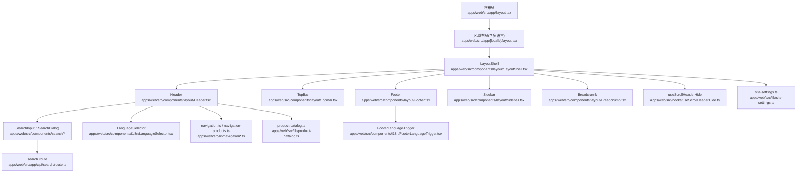
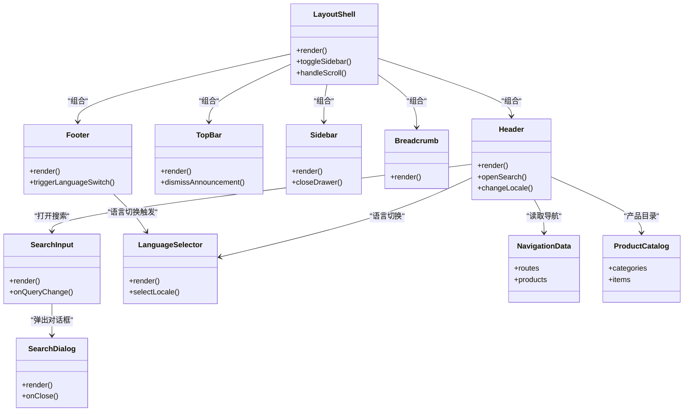
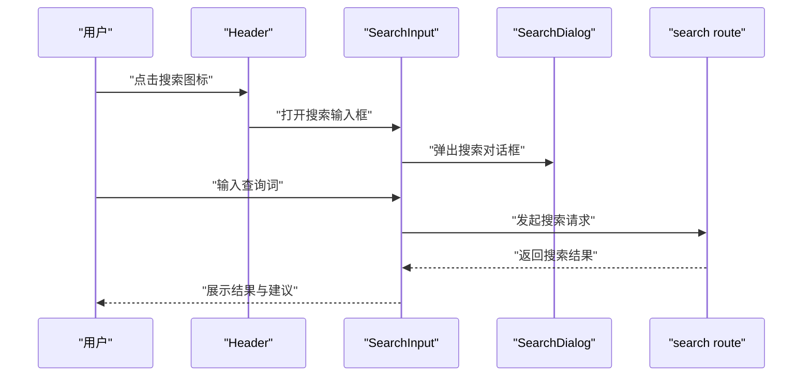
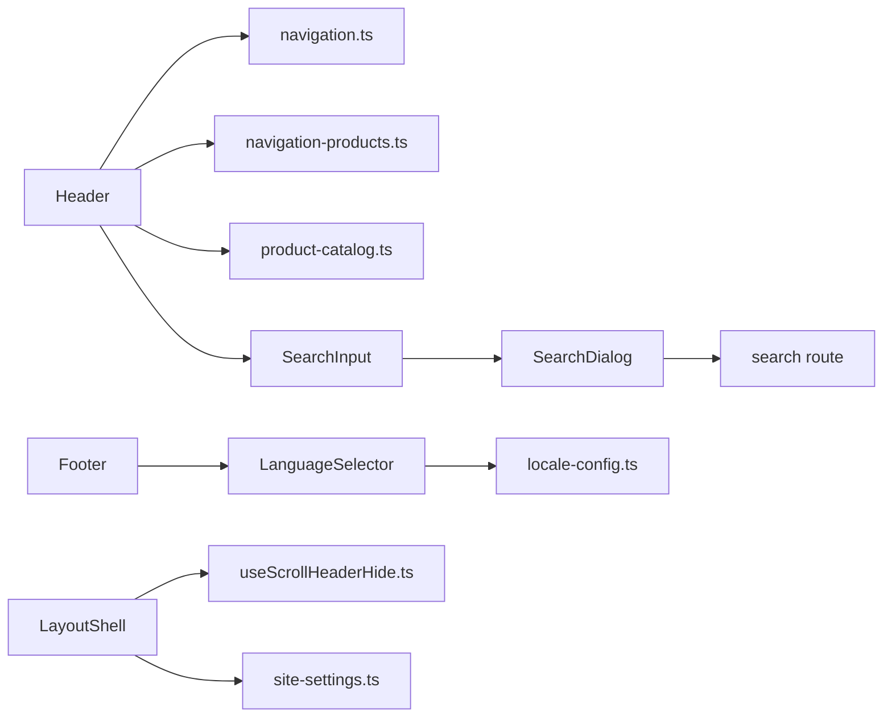

# 布局组件

<cite>
**本文引用的文件**   
- [apps/web/src/app/layout.tsx](file://apps/web/src/app/layout.tsx)
- [apps/web/src/app/[locale]/layout.tsx](file://apps/web/src/app/[locale]/layout.tsx)
- [apps/web/src/components/layout/Header.tsx](file://apps/web/src/components/layout/Header.tsx)
- [apps/web/src/components/layout/Footer.tsx](file://apps/web/src/components/layout/Footer.tsx)
- [apps/web/src/components/layout/TopBar.tsx](file://apps/web/src/components/layout/TopBar.tsx)
- [apps/web/src/components/layout/Sidebar.tsx](file://apps/web/src/components/layout/Sidebar.tsx)
- [apps/web/src/components/layout/Breadcrumb.tsx](file://apps/web/src/components/layout/Breadcrumb.tsx)
- [apps/web/src/components/layout/LayoutShell.tsx](file://apps/web/src/components/layout/LayoutShell.tsx)
- [apps/web/src/components/i18n/LanguageSelector.tsx](file://apps/web/src/components/i18n/LanguageSelector.tsx)
- [apps/web/src/components/i18n/FooterLanguageTrigger.tsx](file://apps/web/src/components/i18n/FooterLanguage触发器.tsx)
- [apps/web/src/lib/navigation.ts](file://apps/web/src/lib/navigation.ts)
- [apps/web/src/lib/navigation-products.ts](file://apps/web/src/lib/navigation-products.ts)
- [apps/web/src/lib/product-catalog.ts](file://apps/web/src/lib/product-catalog.ts)
- [apps/web/src/components/search/SearchInput.tsx](file://apps/web/src/components/search/SearchInput.tsx)
- [apps/web/src/components/search/SearchDialog.tsx](file://apps/web/src/components/search/SearchDialog.tsx)
- [apps/web/src/app/api/search/route.ts](file://apps/web/src/app/api/search/route.ts)
- [apps/web/src/hooks/useScrollHeaderHide.ts](file://apps/web/src/hooks/useScrollHeaderHide.ts)
- [apps/web/src/lib/site-settings.ts](file://apps/web/src/lib/site-settings.ts)
- [apps/web/src/lib/locale-config.ts](file://apps/web/src/lib/locale-config.ts)
- [apps/web/src/messages/zh-CN.json](file://apps/web/src/messages/zh-CN.json)
- [apps/web/src/messages/en.json](file://apps/web/src/messages/en.json)
</cite>

## 目录
1. [简介](#简介)
2. [项目结构](#项目结构)
3. [核心组件](#核心组件)
4. [架构总览](#架构总览)
5. [详细组件分析](#详细组件分析)
6. [依赖关系分析](#依赖关系分析)
7. [性能考量](#性能考量)
8. [故障排查指南](#故障排查指南)
9. [结论](#结论)
10. [附录](#附录)

## 简介
本文件面向“布局组件”的全面文档，覆盖头部导航、页脚、顶部栏等关键布局模块的实现与使用方式。重点说明响应式设计与移动端适配策略、多语言支持方案，以及导航菜单、产品目录、搜索功能的集成方法。同时提供自定义布局与主题配置的最佳实践，帮助开发者快速搭建一致、可维护且高性能的前端页面骨架。

## 项目结构
该仓库采用 Next.js 应用结构，布局相关代码集中在 apps/web 下：
- 根布局与区域布局：位于 apps/web/src/app 与 apps/web/src/app/[locale] 下的 layout.tsx
- 通用布局组件：位于 apps/web/src/components/layout
- 国际化与语言切换：位于 apps/web/src/components/i18n 与 apps/web/src/lib/locale-config.ts
- 导航与产品目录数据：位于 apps/web/src/lib/navigation*.ts 与 product-catalog.ts
- 搜索功能：位于 apps/web/src/components/search 与 apps/web/src/app/api/search/route.ts
- 滚动行为与站点设置：位于 hooks 与 lib 目录

图表来源
- [apps/web/src/app/layout.tsx](file://apps/web/src/app/layout.tsx)
- [apps/web/src/app/[locale]/layout.tsx](file://apps/web/src/app/[locale]/layout.tsx)
- [apps/web/src/components/layout/LayoutShell.tsx](file://apps/web/src/components/layout/LayoutShell.tsx)
- [apps/web/src/components/layout/Header.tsx](file://apps/web/src/components/layout/Header.tsx)
- [apps/web/src/components/layout/TopBar.tsx](file://apps/web/src/components/layout/TopBar.tsx)
- [apps/web/src/components/layout/Footer.tsx](file://apps/web/src/components/layout/Footer.tsx)
- [apps/web/src/components/layout/Sidebar.tsx](file://apps/web/src/components/layout/Sidebar.tsx)
- [apps/web/src/components/layout/Breadcrumb.tsx](file://apps/web/src/components/layout/Breadcrumb.tsx)
- [apps/web/src/components/search/SearchInput.tsx](file://apps/web/src/components/search/SearchInput.tsx)
- [apps/web/src/components/search/SearchDialog.tsx](file://apps/web/src/components/search/SearchDialog.tsx)
- [apps/web/src/app/api/search/route.ts](file://apps/web/src/app/api/search/route.ts)
- [apps/web/src/hooks/useScrollHeaderHide.ts](file://apps/web/src/hooks/useScrollHeaderHide.ts)
- [apps/web/src/lib/site-settings.ts](file://apps/web/src/lib/site-settings.ts)

章节来源
- [apps/web/src/app/layout.tsx](file://apps/web/src/app/layout.tsx)
- [apps/web/src/app/[locale]/layout.tsx](file://apps/web/src/app/[locale]/layout.tsx)
- [apps/web/src/components/layout/LayoutShell.tsx](file://apps/web/src/components/layout/LayoutShell.tsx)

## 核心组件
- 根布局与区域布局
  - 根布局负责全局 HTML/CSS 注入、字体与样式初始化、SEO 基础信息、以及多语言路由上下文。
  - 区域布局负责按 locale 渲染内容壳层，并挂载 i18n 提供者与主题提供者。
- LayoutShell（布局壳）
  - 组合 Header、TopBar、Sidebar、Breadcrumb、主内容区与 Footer。
  - 处理响应式状态（如移动端侧边栏抽屉开关）、滚动隐藏头部、以及根据站点设置动态显示/隐藏模块。
- Header（头部导航）
  - 包含品牌标识、主导航菜单、产品目录入口、搜索入口与语言切换。
  - 在移动端以汉堡菜单展开，支持键盘无障碍与焦点管理。
- TopBar（顶部栏）
  - 展示次级信息（如公告、登录态、通知），可按需折叠或隐藏。
- Sidebar（侧边栏）
  - 用于内容分类、快捷入口或辅助导航；在移动端以抽屉形式呈现。
- Breadcrumb（面包屑）
  - 基于当前路由自动生成层级路径，支持 SEO 结构化数据。
- Footer（页脚）
  - 展示版权、链接、社交媒体与语言切换触发器。

章节来源
- [apps/web/src/app/layout.tsx](file://apps/web/src/app/layout.tsx)
- [apps/web/src/app/[locale]/layout.tsx](file://apps/web/src/app/[locale]/layout.tsx)
- [apps/web/src/components/layout/LayoutShell.tsx](file://apps/web/src/components/layout/LayoutShell.tsx)
- [apps/web/src/components/layout/Header.tsx](file://apps/web/src/components/layout/Header.tsx)
- [apps/web/src/components/layout/TopBar.tsx](file://apps/web/src/components/layout/TopBar.tsx)
- [apps/web/src/components/layout/Sidebar.tsx](file://apps/web/src/components/layout/Sidebar.tsx)
- [apps/web/src/components/layout/Breadcrumb.tsx](file://apps/web/src/components/layout/Breadcrumb.tsx)
- [apps/web/src/components/layout/Footer.tsx](file://apps/web/src/components/layout/Footer.tsx)

## 架构总览
整体布局遵循“壳层 + 模块”的组合模式：
- 根布局与区域布局提供运行时环境（i18n、主题、SEO）。
- LayoutShell 作为布局容器，协调各模块的显隐与交互。
- Header、TopBar、Sidebar、Breadcrumb、Footer 为独立可复用组件，通过 props 与 hooks 进行状态与行为控制。
- 导航与产品目录由集中式配置文件驱动，便于统一维护与扩展。
- 搜索功能通过前端组件与后端 API 协作，实现建议与结果检索。

图表来源
- [apps/web/src/components/layout/LayoutShell.tsx](file://apps/web/src/components/layout/LayoutShell.tsx)
- [apps/web/src/components/layout/Header.tsx](file://apps/web/src/components/layout/Header.tsx)
- [apps/web/src/components/layout/TopBar.tsx](file://apps/web/src/components/layout/TopBar.tsx)
- [apps/web/src/components/layout/Sidebar.tsx](file://apps/web/src/components/layout/Sidebar.tsx)
- [apps/web/src/components/layout/Breadcrumb.tsx](file://apps/web/src/components/layout/Breadcrumb.tsx)
- [apps/web/src/components/layout/Footer.tsx](file://apps/web/src/components/layout/Footer.tsx)
- [apps/web/src/components/search/SearchInput.tsx](file://apps/web/src/components/search/SearchInput.tsx)
- [apps/web/src/components/search/SearchDialog.tsx](file://apps/web/src/components/search/SearchDialog.tsx)
- [apps/web/src/components/i18n/LanguageSelector.tsx](file://apps/web/src/components/i18n/LanguageSelector.tsx)
- [apps/web/src/lib/navigation.ts](file://apps/web/src/lib/navigation.ts)
- [apps/web/src/lib/navigation-products.ts](file://apps/web/src/lib/navigation-products.ts)
- [apps/web/src/lib/product-catalog.ts](file://apps/web/src/lib/product-catalog.ts)

## 详细组件分析

### 头部导航（Header）
- 职责
  - 展示品牌与主导航菜单，提供产品目录入口与搜索入口，支持语言切换。
  - 在移动端以汉堡菜单展开，具备键盘可达性与焦点管理。
- 响应式与移动端适配
  - 使用断点控制菜单展开/收起；在小屏设备隐藏次要操作，保留搜索与语言切换。
  - 侧边抽屉与遮罩层确保移动端体验一致性。
- 多语言支持
  - 通过 LanguageSelector 切换 locale，结合路由前缀与消息文件实现界面文案本地化。
- 导航与产品目录集成
  - 从 navigation.ts 与 navigation-products.ts 读取菜单结构与产品线分组，支持动态更新。
- 搜索集成
  - 点击搜索图标打开 SearchDialog，输入后调用 search API 获取建议与结果。

图表来源
- [apps/web/src/components/layout/Header.tsx](file://apps/web/src/components/layout/Header.tsx)
- [apps/web/src/components/search/SearchInput.tsx](file://apps/web/src/components/search/SearchInput.tsx)
- [apps/web/src/components/search/SearchDialog.tsx](file://apps/web/src/components/search/SearchDialog.tsx)
- [apps/web/src/app/api/search/route.ts](file://apps/web/src/app/api/search/route.ts)

章节来源
- [apps/web/src/components/layout/Header.tsx](file://apps/web/src/components/layout/Header.tsx)
- [apps/web/src/lib/navigation.ts](file://apps/web/src/lib/navigation.ts)
- [apps/web/src/lib/navigation-products.ts](file://apps/web/src/lib/navigation-products.ts)
- [apps/web/src/components/search/SearchInput.tsx](file://apps/web/src/components/search/SearchInput.tsx)
- [apps/web/src/components/search/SearchDialog.tsx](file://apps/web/src/components/search/SearchDialog.tsx)
- [apps/web/src/app/api/search/route.ts](file://apps/web/src/app/api/search/route.ts)

### 顶部栏（TopBar）
- 职责
  - 展示公告、系统通知或登录态提示，支持关闭与跳转。
- 响应式与移动端适配
  - 在小屏设备上自动折叠为可展开条，减少空间占用。
- 配置与主题
  - 通过 site-settings 控制是否显示、颜色与文案，支持暗色主题适配。

章节来源
- [apps/web/src/components/layout/TopBar.tsx](file://apps/web/src/components/layout/TopBar.tsx)
- [apps/web/src/lib/site-settings.ts](file://apps/web/src/lib/site-settings.ts)

### 侧边栏（Sidebar）
- 职责
  - 提供内容分类、快捷入口或辅助导航；在移动端以抽屉形式出现。
- 交互与状态
  - 通过 LayoutShell 控制开合状态，支持键盘导航与无障碍标签。
- 数据源
  - 可从 navigation.ts 或独立配置中加载菜单项，支持动态刷新。

章节来源
- [apps/web/src/components/layout/Sidebar.tsx](file://apps/web/src/components/layout/Sidebar.tsx)
- [apps/web/src/lib/navigation.ts](file://apps/web/src/lib/navigation.ts)

### 面包屑（Breadcrumb）
- 职责
  - 基于当前路由生成层级路径，提升可导航性与 SEO。
- 数据结构
  - 通常由路由参数与标题映射表生成，支持自定义节点与外链。

章节来源
- [apps/web/src/components/layout/Breadcrumb.tsx](file://apps/web/src/components/layout/Breadcrumb.tsx)

### 页脚（Footer）
- 职责
  - 展示版权信息、常用链接、社交媒体与语言切换触发器。
- 多语言支持
  - 通过 FooterLanguageTrigger 与 LanguageSelector 联动，切换语言时同步更新文案。
- 响应式
  - 在小屏设备上堆叠排列，保证可读性与触控友好。

章节来源
- [apps/web/src/components/layout/Footer.tsx](file://apps/web/src/components/layout/Footer.tsx)
- [apps/web/src/components/i18n/FooterLanguageTrigger.tsx](file://apps/web/src/components/i18n/FooterLanguage触发器.tsx)
- [apps/web/src/components/i18n/LanguageSelector.tsx](file://apps/web/src/components/i18n/LanguageSelector.tsx)

### 布局壳（LayoutShell）
- 职责
  - 组合 Header、TopBar、Sidebar、Breadcrumb、主内容与 Footer。
  - 处理滚动行为（如滚动隐藏头部）、移动端侧边栏抽屉、以及根据站点设置动态显示/隐藏模块。
- 响应式与主题
  - 使用 CSS 变量与主题提供者实现明暗主题切换；通过断点与媒体查询优化移动端布局。

章节来源
- [apps/web/src/components/layout/LayoutShell.tsx](file://apps/web/src/components/layout/LayoutShell.tsx)
- [apps/web/src/hooks/useScrollHeaderHide.ts](file://apps/web/src/hooks/useScrollHeaderHide.ts)
- [apps/web/src/lib/site-settings.ts](file://apps/web/src/lib/site-settings.ts)

## 依赖关系分析
- 导航与产品目录
  - Header 依赖 navigation.ts 与 navigation-products.ts 提供的菜单与产品线数据。
  - product-catalog.ts 提供产品类目与条目，供 Header 与产品页面使用。
- 搜索
  - SearchInput 与 SearchDialog 依赖 search route 提供建议与结果。
- 多语言
  - LanguageSelector 与 FooterLanguageTrigger 依赖 locale-config 与 messages 文件。
- 滚动与站点设置
  - useScrollHeaderHide 控制头部显示/隐藏；site-settings 控制模块可见性与主题。

图表来源
- [apps/web/src/components/layout/Header.tsx](file://apps/web/src/components/layout/Header.tsx)
- [apps/web/src/lib/navigation.ts](file://apps/web/src/lib/navigation.ts)
- [apps/web/src/lib/navigation-products.ts](file://apps/web/src/lib/navigation-products.ts)
- [apps/web/src/lib/product-catalog.ts](file://apps/web/src/lib/product-catalog.ts)
- [apps/web/src/components/search/SearchInput.tsx](file://apps/web/src/components/search/SearchInput.tsx)
- [apps/web/src/components/search/SearchDialog.tsx](file://apps/web/src/components/search/SearchDialog.tsx)
- [apps/web/src/app/api/search/route.ts](file://apps/web/src/app/api/search/route.ts)
- [apps/web/src/components/layout/Footer.tsx](file://apps/web/src/components/layout/Footer.tsx)
- [apps/web/src/components/i18n/LanguageSelector.tsx](file://apps/web/src/components/i18n/LanguageSelector.tsx)
- [apps/web/src/lib/locale-config.ts](file://apps/web/src/lib/locale-config.ts)
- [apps/web/src/components/layout/LayoutShell.tsx](file://apps/web/src/components/layout/LayoutShell.tsx)
- [apps/web/src/hooks/useScrollHeaderHide.ts](file://apps/web/src/hooks/useScrollHeaderHide.ts)
- [apps/web/src/lib/site-settings.ts](file://apps/web/src/lib/site-settings.ts)

章节来源
- [apps/web/src/lib/navigation.ts](file://apps/web/src/lib/navigation.ts)
- [apps/web/src/lib/navigation-products.ts](file://apps/web/src/lib/navigation-products.ts)
- [apps/web/src/lib/product-catalog.ts](file://apps/web/src/lib/product-catalog.ts)
- [apps/web/src/app/api/search/route.ts](file://apps/web/src/app/api/search/route.ts)
- [apps/web/src/lib/locale-config.ts](file://apps/web/src/lib/locale-config.ts)
- [apps/web/src/lib/site-settings.ts](file://apps/web/src/lib/site-settings.ts)

## 性能考量
- 组件懒加载与代码分割
  - 将搜索对话框与侧边栏按需加载，减少首屏体积。
- 网络请求优化
  - 搜索建议使用防抖与缓存，避免频繁请求；分页与增量加载提升列表性能。
- 渲染优化
  - 使用 React.memo 包裹静态模块；避免在 Header 中重复计算导航树。
- 资源加载
  - 图片与媒体使用懒加载与占位图；字体与样式预加载关键资源。

[本节为通用指导，不直接分析具体文件]

## 故障排查指南
- 多语言切换无效
  - 检查 locale-config 是否正确配置语言列表与默认语言；确认 messages 文件存在对应键值。
  - 验证路由前缀与语言选择器的联动逻辑。
- 搜索无结果
  - 检查 search route 是否可用；确认请求参数与后端索引状态。
  - 查看控制台错误与网络请求响应。
- 移动端菜单无法展开
  - 检查断点与样式类名；确认遮罩层与事件绑定是否正常。
- 顶部栏或侧边栏未显示
  - 检查 site-settings 中的开关配置；确认 LayoutShell 的条件渲染逻辑。

章节来源
- [apps/web/src/lib/locale-config.ts](file://apps/web/src/lib/locale-config.ts)
- [apps/web/src/messages/zh-CN.json](file://apps/web/src/messages/zh-CN.json)
- [apps/web/src/messages/en.json](file://apps/web/src/messages/en.json)
- [apps/web/src/app/api/search/route.ts](file://apps/web/src/app/api/search/route.ts)
- [apps/web/src/lib/site-settings.ts](file://apps/web/src/lib/site-settings.ts)

## 结论
本布局体系以 LayoutShell 为核心，组合 Header、TopBar、Sidebar、Breadcrumb、Footer 等模块，形成一致的页面骨架。通过集中式导航与产品目录配置、完善的搜索与多语言支持，以及响应式与主题能力，满足复杂业务场景下的可扩展性与可维护性需求。建议遵循本文档的配置与实践，持续优化性能与用户体验。

[本节为总结，不直接分析具体文件]

## 附录
- 自定义布局最佳实践
  - 保持模块职责单一，通过 props 与 hooks 传递状态与行为。
  - 使用 CSS 变量与主题提供者实现明暗主题切换。
  - 在移动端优先设计，确保触控友好与键盘可达。
- 主题配置建议
  - 将颜色、字号、间距等抽象为设计令牌，集中管理。
  - 通过 site-settings 动态启用/禁用模块，提升灵活性。
- 导航与产品目录扩展
  - 在 navigation.ts 与 navigation-products.ts 中新增菜单与产品线，确保路由与文案同步更新。
  - 使用 product-catalog.ts 统一管理产品类目与条目，便于跨页面复用。

[本节为通用指导，不直接分析具体文件]