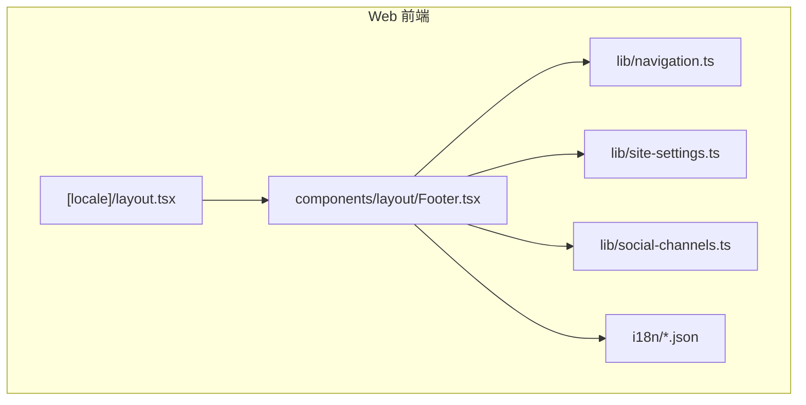
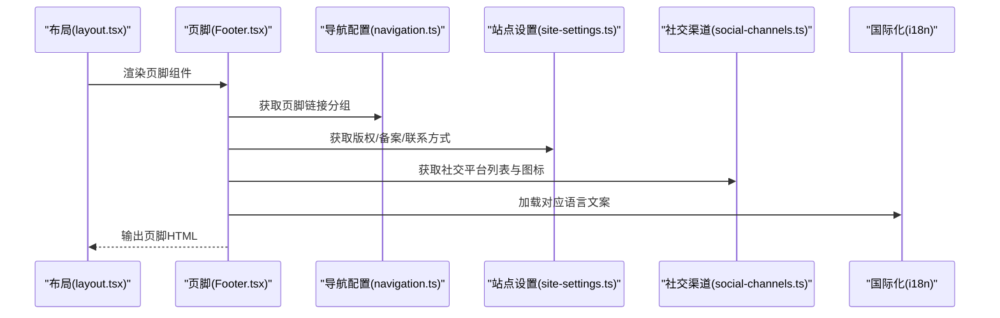
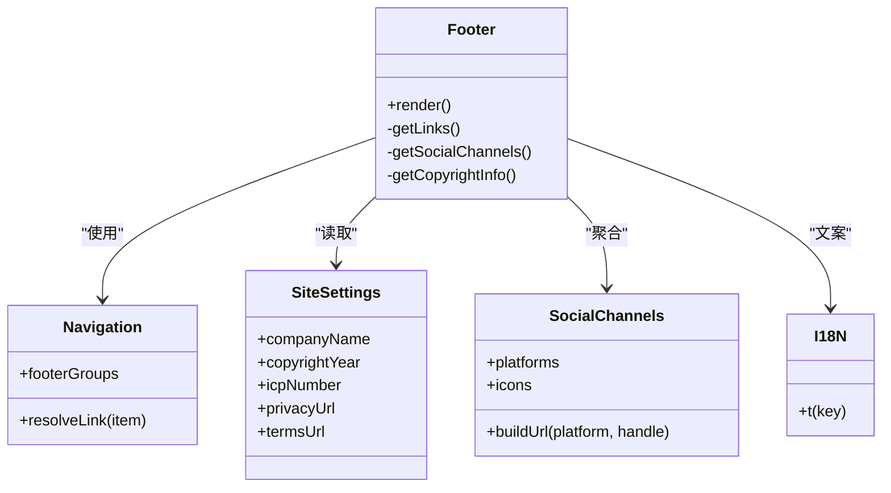
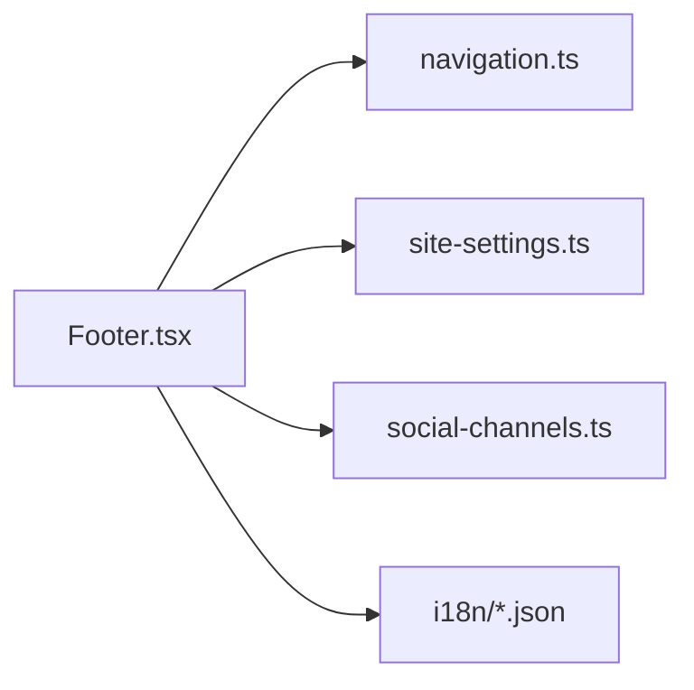

# 页脚组件

<cite>
**本文引用的文件**   
- [apps/web/src/components/layout/Footer.tsx](file://apps/web/src/components/layout/Footer.tsx)
- [apps/web/src/lib/navigation.ts](file://apps/web/src/lib/navigation.ts)
- [apps/web/src/lib/site-settings.ts](file://apps/web/src/lib/site-settings.ts)
- [apps/web/src/lib/social-channels.ts](file://apps/web/src/lib/social-channels.ts)
- [apps/web/src/app/[locale]/layout.tsx](file://apps/web/src/app/[locale]/layout.tsx)
- [apps/web/src/i18n/zh-CN.json](file://apps/web/src/i18n/zh-CN.json)
- [apps/web/src/i18n/en.json](file://apps/web/src/i18n/en.json)
</cite>

## 目录
1. [简介](#简介)
2. [项目结构](#项目结构)
3. [核心组件](#核心组件)
4. [架构总览](#架构总览)
5. [详细组件分析](#详细组件分析)
6. [依赖关系分析](#依赖关系分析)
7. [性能考虑](#性能考虑)
8. [故障排查指南](#故障排查指南)
9. [结论](#结论)
10. [附录](#附录)

## 简介
本文件为网站“页脚组件”的全面技术文档，聚焦 Footer 组件的结构设计、内容组织与样式实现。文档涵盖多区域布局、链接管理、社交媒体集成、版权信息展示、响应式适配、SEO 优化与可访问性（a11y）要点，并提供自定义配置与主题定制指南，以及在不同页面中复用与扩展页脚功能的最佳实践。

## 项目结构
页脚组件位于前端应用（Next.js）的公共布局层，通常由全局 layout 引入并在各页面底部渲染。其数据来源于站点设置、导航配置与国际化文案，样式通过 CSS/Tailwind 等方案实现，确保在多设备上的良好表现。

图表来源
- [apps/web/src/app/[locale]/layout.tsx](file://apps/web/src/app/[locale]/layout.tsx)
- [apps/web/src/components/layout/Footer.tsx](file://apps/web/src/components/layout/Footer.tsx)
- [apps/web/src/lib/navigation.ts](file://apps/web/src/lib/navigation.ts)
- [apps/web/src/lib/site-settings.ts](file://apps/web/src/lib/site-settings.ts)
- [apps/web/src/lib/social-channels.ts](file://apps/web/src/lib/social-channels.ts)
- [apps/web/src/i18n/zh-CN.json](file://apps/web/src/i18n/zh-CN.json)
- [apps/web/src/i18n/en.json](file://apps/web/src/i18n/en.json)

章节来源
- [apps/web/src/app/[locale]/layout.tsx](file://apps/web/src/app/[locale]/layout.tsx)
- [apps/web/src/components/layout/Footer.tsx](file://apps/web/src/components/layout/Footer.tsx)

## 核心组件
- Footer 组件：负责页脚的渲染与交互，包含品牌信息、导航链接、社交媒体图标、订阅或联系方式、版权信息等模块。
- 导航配置：集中管理页脚中的链接分组与路由目标，便于统一维护。
- 站点设置：提供版权文本、备案号、联系方式等动态内容。
- 社交渠道：统一管理社交平台图标与链接，支持多语言与开关控制。
- 国际化：页脚文案通过 i18n 资源文件管理，支持中英文切换。

章节来源
- [apps/web/src/components/layout/Footer.tsx](file://apps/web/src/components/layout/Footer.tsx)
- [apps/web/src/lib/navigation.ts](file://apps/web/src/lib/navigation.ts)
- [apps/web/src/lib/site-settings.ts](file://apps/web/src/lib/site-settings.ts)
- [apps/web/src/lib/social-channels.ts](file://apps/web/src/lib/social-channels.ts)
- [apps/web/src/i18n/zh-CN.json](file://apps/web/src/i18n/zh-CN.json)
- [apps/web/src/i18n/en.json](file://apps/web/src/i18n/en.json)

## 架构总览
页脚的数据流遵循“配置驱动 + 国际化 + 站点设置”的模式：layout 注入上下文，Footer 读取导航与站点设置，结合 i18n 文案进行渲染。社交渠道通过独立模块聚合，便于扩展新平台。

图表来源
- [apps/web/src/app/[locale]/layout.tsx](file://apps/web/src/app/[locale]/layout.tsx)
- [apps/web/src/components/layout/Footer.tsx](file://apps/web/src/components/layout/Footer.tsx)
- [apps/web/src/lib/navigation.ts](file://apps/web/src/lib/navigation.ts)
- [apps/web/src/lib/site-settings.ts](file://apps/web/src/lib/site-settings.ts)
- [apps/web/src/lib/social-channels.ts](file://apps/web/src/lib/social-channels.ts)
- [apps/web/src/i18n/zh-CN.json](file://apps/web/src/i18n/zh-CN.json)

## 详细组件分析

### Footer 组件结构与职责
- 多区域布局：顶部品牌区、中部导航分区、底部版权与法律链接区。
- 链接管理：基于 navigation.ts 的分组数据结构，支持多级菜单与外部链接。
- 社交媒体集成：social-channels.ts 提供平台枚举、图标映射与链接模板。
- 版权信息：从 site-settings.ts 读取企业名、年份、备案号、隐私政策与条款链接。
- 可访问性：语义化标签、aria-label、键盘可达性与对比度。
- SEO 优化：合理的 heading 层级、结构化数据（如 Organization）、nofollow 策略。

章节来源
- [apps/web/src/components/layout/Footer.tsx](file://apps/web/src/components/layout/Footer.tsx)
- [apps/web/src/lib/navigation.ts](file://apps/web/src/lib/navigation.ts)
- [apps/web/src/lib/site-settings.ts](file://apps/web/src/lib/site-settings.ts)
- [apps/web/src/lib/social-channels.ts](file://apps/web/src/lib/social-channels.ts)

#### 类图（概念映射到源码模块）

图表来源
- [apps/web/src/components/layout/Footer.tsx](file://apps/web/src/components/layout/Footer.tsx)
- [apps/web/src/lib/navigation.ts](file://apps/web/src/lib/navigation.ts)
- [apps/web/src/lib/site-settings.ts](file://apps/web/src/lib/site-settings.ts)
- [apps/web/src/lib/social-channels.ts](file://apps/web/src/lib/social-channels.ts)

### 链接管理与导航配置
- 数据结构：按分组组织（如“产品”、“解决方案”、“支持”），每个分组包含标题与链接项。
- 链接类型：内部路由（Next.js 路由）、外部 URL、锚点跳转。
- 动态更新：通过配置文件或 CMS 字段变更，无需修改组件代码。
- SEO 策略：对第三方外链添加 rel="noopener noreferrer"，必要时使用 nofollow。

章节来源
- [apps/web/src/lib/navigation.ts](file://apps/web/src/lib/navigation.ts)

### 社交媒体集成
- 平台枚举：微信、微博、抖音、B站、GitHub、LinkedIn 等。
- 图标与链接：统一的图标映射与链接模板，支持占位符替换（如用户 ID）。
- 开关控制：根据站点设置启用/禁用特定平台。
- 可访问性：为每个图标提供 aria-label 描述平台名称。

章节来源
- [apps/web/src/lib/social-channels.ts](file://apps/web/src/lib/social-channels.ts)

### 版权信息与站点设置
- 动态内容：企业名称、年份、备案号、法律声明链接。
- 多语言支持：不同语言的版权文案与法律链接。
- 默认值：当设置缺失时回退到默认值，保证稳定性。

章节来源
- [apps/web/src/lib/site-settings.ts](file://apps/web/src/lib/site-settings.ts)

### 国际化与文案
- 文案键：footer.brand、footer.links.*、footer.social.*、footer.copyright.*。
- 语言包：zh-CN.json、en.json 等，按需扩展。
- 运行时切换：根据当前 locale 自动加载对应文案。

章节来源
- [apps/web/src/i18n/zh-CN.json](file://apps/web/src/i18n/zh-CN.json)
- [apps/web/src/i18n/en.json](file://apps/web/src/i18n/en.json)

### 响应式设计实现
- 栅格布局：移动端单列、平板双列、桌面端多列。
- 间距与字号：随断点调整，确保可读性与触控友好。
- 折叠与展开：在窄屏下可折叠次要链接组。

章节来源
- [apps/web/src/components/layout/Footer.tsx](file://apps/web/src/components/layout/Footer.tsx)

### SEO 优化与可访问性
- 语义化：使用 footer、nav、ul/li、h3/h4 等标签构建清晰结构。
- 结构化数据：Organization 与 WebSite 的 JSON-LD 片段。
- 可访问性：aria-label、role、tabindex、焦点可见性、颜色对比度。
- 外链安全：rel="noopener noreferrer"，避免潜在安全风险。

章节来源
- [apps/web/src/components/layout/Footer.tsx](file://apps/web/src/components/layout/Footer.tsx)

## 依赖关系分析
页脚组件依赖导航、站点设置、社交渠道与国际化模块，形成低耦合、高内聚的设计。

图表来源
- [apps/web/src/components/layout/Footer.tsx](file://apps/web/src/components/layout/Footer.tsx)
- [apps/web/src/lib/navigation.ts](file://apps/web/src/lib/navigation.ts)
- [apps/web/src/lib/site-settings.ts](file://apps/web/src/lib/site-settings.ts)
- [apps/web/src/lib/social-channels.ts](file://apps/web/src/lib/social-channels.ts)
- [apps/web/src/i18n/zh-CN.json](file://apps/web/src/i18n/zh-CN.json)
- [apps/web/src/i18n/en.json](file://apps/web/src/i18n/en.json)

章节来源
- [apps/web/src/components/layout/Footer.tsx](file://apps/web/src/components/layout/Footer.tsx)
- [apps/web/src/lib/navigation.ts](file://apps/web/src/lib/navigation.ts)
- [apps/web/src/lib/site-settings.ts](file://apps/web/src/lib/site-settings.ts)
- [apps/web/src/lib/social-channels.ts](file://apps/web/src/lib/social-channels.ts)
- [apps/web/src/i18n/zh-CN.json](file://apps/web/src/i18n/zh-CN.json)
- [apps/web/src/i18n/en.json](file://apps/web/src/i18n/en.json)

## 性能考虑
- 静态优先：导航与社交渠道尽量静态化，减少运行时计算。
- 懒加载：非关键图片与脚本延迟加载。
- 缓存策略：站点设置与文案缓存，避免重复请求。
- 样式优化：使用原子化 CSS 或 Tailwind，减少冗余样式。

## 故障排查指南
- 链接失效：检查 navigation.ts 的路由与外部 URL 是否正确。
- 社交图标不显示：确认 social-channels.ts 的平台枚举与图标路径。
- 文案未生效：核对 i18n 键名与当前 locale 是否匹配。
- 版权信息缺失：验证 site-settings.ts 的默认值与后端配置。
- 可访问性问题：使用浏览器无障碍工具检测 aria-label 与焦点顺序。

章节来源
- [apps/web/src/components/layout/Footer.tsx](file://apps/web/src/components/layout/Footer.tsx)
- [apps/web/src/lib/navigation.ts](file://apps/web/src/lib/navigation.ts)
- [apps/web/src/lib/site-settings.ts](file://apps/web/src/lib/site-settings.ts)
- [apps/web/src/lib/social-channels.ts](file://apps/web/src/lib/social-channels.ts)
- [apps/web/src/i18n/zh-CN.json](file://apps/web/src/i18n/zh-CN.json)
- [apps/web/src/i18n/en.json](file://apps/web/src/i18n/en.json)

## 结论
页脚组件通过模块化设计与配置驱动，实现了灵活的内容组织与样式定制。借助导航、站点设置与社交渠道模块，Footer 能够稳定地展示品牌信息、链接与社交媒体入口，同时满足响应式、SEO 与可访问性要求。通过本文档的配置方法与最佳实践，开发者可以快速扩展与维护页脚功能。

## 附录
- 自定义页脚内容：编辑 navigation.ts 增加分组与链接；在 site-settings.ts 补充版权与法律信息。
- 主题定制：通过 CSS 变量或 Tailwind 配置覆盖颜色、间距与字体。
- 复用与扩展：在 layout.tsx 中引入 Footer，或在子页面中按需局部渲染。