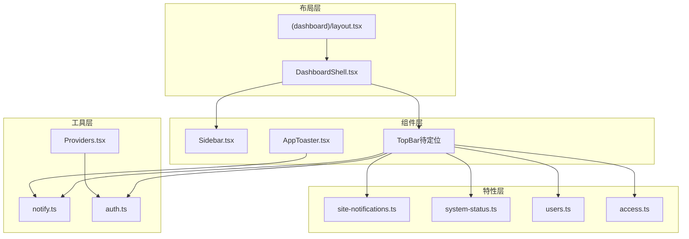
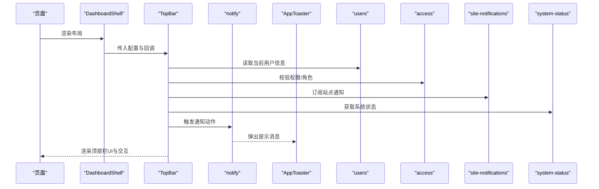
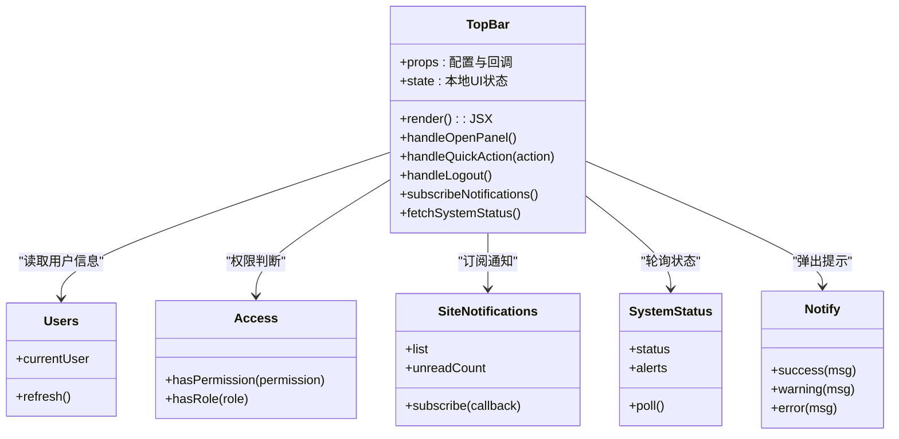
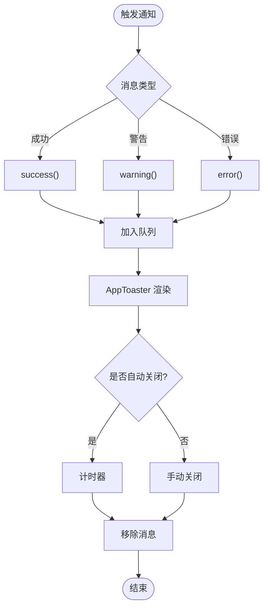
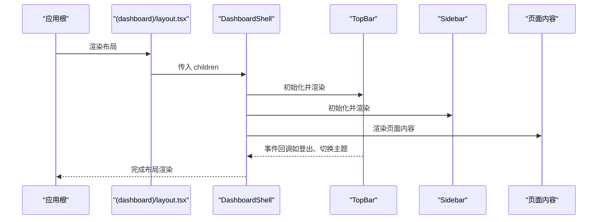
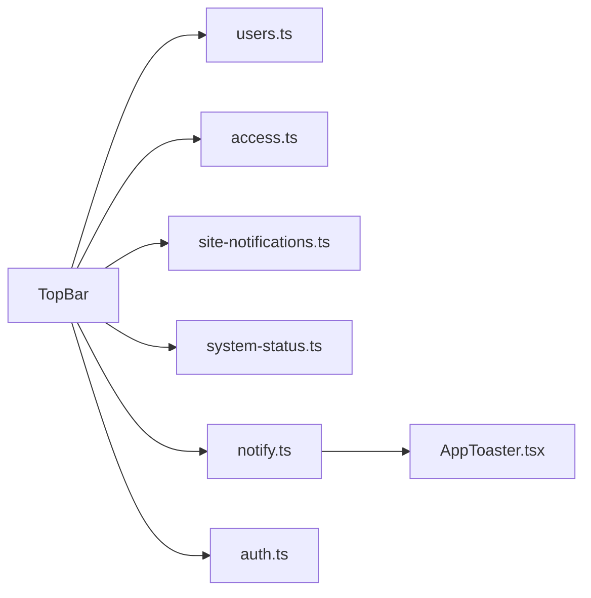

# 顶部栏组件

<cite>
**本文引用的文件**   
- [apps/admin/src/components/Sidebar.tsx](file://apps/admin/src/components/Sidebar.tsx)
- [apps/admin/src/app/(dashboard)/layout.tsx](file://apps/admin/src/app/(dashboard)/layout.tsx)
- [apps/admin/src/features/site-notifications.ts](file://apps/admin/src/features/site-notifications.ts)
- [apps/admin/src/lib/notify.ts](file://apps/admin/src/lib/notify.ts)
- [apps/admin/src/features/system-status.ts](file://apps/admin/src/features/system-status.ts)
- [apps/admin/src/features/users.ts](file://apps/admin/src/features/users.ts)
- [apps/admin/src/features/access.ts](file://apps/admin/src/features/access.ts)
- [apps/admin/src/lib/auth.ts](file://apps/admin/src/lib/auth.ts)
- [apps/admin/src/components/Providers.tsx](file://apps/admin/src/components/Providers.tsx)
- [apps/admin/src/components/AppToaster.tsx](file://apps/admin/src/components/AppToaster.tsx)
- [apps/admin/src/components/DashboardShell.tsx](file://apps/admin/src/components/DashboardShell.tsx)
</cite>

## 目录
1. [简介](#简介)
2. [项目结构](#项目结构)
3. [核心组件与职责](#核心组件与职责)
4. [架构总览](#架构总览)
5. [详细组件分析](#详细组件分析)
6. [依赖关系分析](#依赖关系分析)
7. [性能考量](#性能考量)
8. [故障排查指南](#故障排查指南)
9. [结论](#结论)
10. [附录：扩展与定制指南](#附录扩展与定制指南)

## 简介
本文件面向“顶部栏（TopBar）”组件，系统性说明其在后台管理应用中的功能实现与集成方式。内容涵盖通知显示、用户状态指示、快捷操作按钮与系统消息展示；同时给出状态管理、事件处理、与全局状态集成的实践建议，并提供样式定制、图标配置、行为定制、移动端适配策略与性能优化技巧，以及扩展新业务能力的路径。

## 项目结构
在 admin 应用中，顶部栏通常作为布局壳的一部分出现，并与侧边栏、页面主体共同构成整体布局。与顶部栏相关的常见位置包括：
- 布局层：用于挂载顶部栏与侧边栏的容器
- 组件层：顶部栏及其子模块（通知、用户菜单、快捷操作等）
- 特性层：站点通知、系统状态、用户信息、权限控制等数据源
- 工具层：通知提示、认证信息等通用能力

图表来源
- [apps/admin/src/app/(dashboard)/layout.tsx](file://apps/admin/src/app/(dashboard)/layout.tsx)
- [apps/admin/src/components/DashboardShell.tsx](file://apps/admin/src/components/DashboardShell.tsx)
- [apps/admin/src/components/Sidebar.tsx](file://apps/admin/src/components/Sidebar.tsx)
- [apps/admin/src/features/site-notifications.ts](file://apps/admin/src/features/site-notifications.ts)
- [apps/admin/src/features/system-status.ts](file://apps/admin/src/features/system-status.ts)
- [apps/admin/src/features/users.ts](file://apps/admin/src/features/users.ts)
- [apps/admin/src/features/access.ts](file://apps/admin/src/features/access.ts)
- [apps/admin/src/lib/notify.ts](file://apps/admin/src/lib/notify.ts)
- [apps/admin/src/lib/auth.ts](file://apps/admin/src/lib/auth.ts)
- [apps/admin/src/components/Providers.tsx](file://apps/admin/src/components/Providers.tsx)

章节来源
- [apps/admin/src/app/(dashboard)/layout.tsx](file://apps/admin/src/app/(dashboard)/layout.tsx)
- [apps/admin/src/components/DashboardShell.tsx](file://apps/admin/src/components/DashboardShell.tsx)
- [apps/admin/src/components/Sidebar.tsx](file://apps/admin/src/components/Sidebar.tsx)

## 核心组件与职责
- 顶部栏（TopBar）
  - 负责展示站点通知、系统状态、用户头像与状态、快捷操作入口（如搜索、设置、主题切换、全屏等）
  - 与通知中心、用户信息、权限控制进行交互
  - 提供可定制的插槽或配置项以支持业务扩展
- 通知中心（AppToaster）
  - 集中展示成功、警告、错误等消息
  - 与 notify 工具协作，统一弹出与自动消失策略
- 布局壳（DashboardShell）
  - 组合顶部栏、侧边栏与页面主体
  - 处理响应式布局与滚动行为
- 特性模块
  - site-notifications：站点级通知数据与订阅
  - system-status：系统健康状态、维护公告等
  - users：当前登录用户信息与状态
  - access：权限与角色相关的能力判断
- 工具模块
  - notify：统一的提示与消息通道
  - auth：认证信息与鉴权辅助

章节来源
- [apps/admin/src/components/AppToaster.tsx](file://apps/admin/src/components/AppToaster.tsx)
- [apps/admin/src/lib/notify.ts](file://apps/admin/src/lib/notify.ts)
- [apps/admin/src/components/DashboardShell.tsx](file://apps/admin/src/components/DashboardShell.tsx)
- [apps/admin/src/features/site-notifications.ts](file://apps/admin/src/features/site-notifications.ts)
- [apps/admin/src/features/system-status.ts](file://apps/admin/src/features/system-status.ts)
- [apps/admin/src/features/users.ts](file://apps/admin/src/features/users.ts)
- [apps/admin/src/features/access.ts](file://apps/admin/src/features/access.ts)
- [apps/admin/src/lib/auth.ts](file://apps/admin/src/lib/auth.ts)

## 架构总览
顶部栏处于 UI 层的“布局壳”内，向上暴露给页面使用，向下依赖多个特性与工具模块。其典型调用链如下：

图表来源
- [apps/admin/src/components/DashboardShell.tsx](file://apps/admin/src/components/DashboardShell.tsx)
- [apps/admin/src/lib/notify.ts](file://apps/admin/src/lib/notify.ts)
- [apps/admin/src/components/AppToaster.tsx](file://apps/admin/src/components/AppToaster.tsx)
- [apps/admin/src/features/users.ts](file://apps/admin/src/features/users.ts)
- [apps/admin/src/features/access.ts](file://apps/admin/src/features/access.ts)
- [apps/admin/src/features/site-notifications.ts](file://apps/admin/src/features/site-notifications.ts)
- [apps/admin/src/features/system-status.ts](file://apps/admin/src/features/system-status.ts)

## 详细组件分析

### 顶部栏（TopBar）组件
- 功能要点
  - 通知显示：聚合站点通知与系统状态，支持未读计数与快速跳转
  - 用户状态指示：头像、在线状态、角色标签、快捷退出
  - 快捷操作：搜索、设置、主题切换、全屏、帮助等
  - 系统消息：维护公告、服务降级提示等
- 状态管理
  - 本地状态：下拉面板展开/收起、搜索框聚焦、弹窗开关
  - 全局状态：用户信息、权限、通知列表、系统状态
  - 副作用：监听路由变化、窗口尺寸变化、WebSocket 消息（如有）
- 事件处理
  - 点击事件：打开/关闭面板、执行快捷操作
  - 键盘事件：快捷键触发（如 ESC 关闭面板）
  - 网络事件：拉取通知、刷新状态
- 与全局状态集成
  - 通过特性模块订阅用户、权限、通知、系统状态
  - 通过工具模块触发通知提示

图表来源
- [apps/admin/src/features/users.ts](file://apps/admin/src/features/users.ts)
- [apps/admin/src/features/access.ts](file://apps/admin/src/features/access.ts)
- [apps/admin/src/features/site-notifications.ts](file://apps/admin/src/features/site-notifications.ts)
- [apps/admin/src/features/system-status.ts](file://apps/admin/src/features/system-status.ts)
- [apps/admin/src/lib/notify.ts](file://apps/admin/src/lib/notify.ts)

章节来源
- [apps/admin/src/features/users.ts](file://apps/admin/src/features/users.ts)
- [apps/admin/src/features/access.ts](file://apps/admin/src/features/access.ts)
- [apps/admin/src/features/site-notifications.ts](file://apps/admin/src/features/site-notifications.ts)
- [apps/admin/src/features/system-status.ts](file://apps/admin/src/features/system-status.ts)
- [apps/admin/src/lib/notify.ts](file://apps/admin/src/lib/notify.ts)

### 通知中心（AppToaster）
- 职责
  - 统一管理成功、警告、错误等消息的展示
  - 支持自动消失、手动关闭、堆叠显示
- 与 notify 的关系
  - notify 负责触发消息，AppToaster 负责渲染与生命周期管理
- 可定制点
  - 位置（顶部/底部）、最大堆叠数、动画时长、主题样式

图表来源
- [apps/admin/src/lib/notify.ts](file://apps/admin/src/lib/notify.ts)
- [apps/admin/src/components/AppToaster.tsx](file://apps/admin/src/components/AppToaster.tsx)

章节来源
- [apps/admin/src/components/AppToaster.tsx](file://apps/admin/src/components/AppToaster.tsx)
- [apps/admin/src/lib/notify.ts](file://apps/admin/src/lib/notify.ts)

### 布局壳（DashboardShell）
- 职责
  - 组合顶部栏、侧边栏与页面主体
  - 处理响应式布局、滚动行为、加载态
- 与顶部栏的集成
  - 将必要的上下文（如用户、权限）注入到顶部栏
  - 处理全局快捷键与窗口事件

图表来源
- [apps/admin/src/app/(dashboard)/layout.tsx](file://apps/admin/src/app/(dashboard)/layout.tsx)
- [apps/admin/src/components/DashboardShell.tsx](file://apps/admin/src/components/DashboardShell.tsx)
- [apps/admin/src/components/Sidebar.tsx](file://apps/admin/src/components/Sidebar.tsx)

章节来源
- [apps/admin/src/app/(dashboard)/layout.tsx](file://apps/admin/src/app/(dashboard)/layout.tsx)
- [apps/admin/src/components/DashboardShell.tsx](file://apps/admin/src/components/DashboardShell.tsx)
- [apps/admin/src/components/Sidebar.tsx](file://apps/admin/src/components/Sidebar.tsx)

### 特性模块与工具
- 用户信息（users.ts）
  - 提供当前用户对象、状态更新、刷新机制
- 权限控制（access.ts）
  - 提供权限与角色判断方法，供顶部栏控制按钮可见性
- 站点通知（site-notifications.ts）
  - 提供通知列表、未读数、订阅接口
- 系统状态（system-status.ts）
  - 提供系统健康状态、维护公告、轮询策略
- 通知工具（notify.ts）
  - 提供 success/warning/error 等方法，驱动 AppToaster
- 认证信息（auth.ts）
  - 提供 token、用户会话、鉴权辅助

章节来源
- [apps/admin/src/features/users.ts](file://apps/admin/src/features/users.ts)
- [apps/admin/src/features/access.ts](file://apps/admin/src/features/access.ts)
- [apps/admin/src/features/site-notifications.ts](file://apps/admin/src/features/site-notifications.ts)
- [apps/admin/src/features/system-status.ts](file://apps/admin/src/features/system-status.ts)
- [apps/admin/src/lib/notify.ts](file://apps/admin/src/lib/notify.ts)
- [apps/admin/src/lib/auth.ts](file://apps/admin/src/lib/auth.ts)

## 依赖关系分析
顶部栏依赖的特性与工具模块如下：

图表来源
- [apps/admin/src/features/users.ts](file://apps/admin/src/features/users.ts)
- [apps/admin/src/features/access.ts](file://apps/admin/src/features/access.ts)
- [apps/admin/src/features/site-notifications.ts](file://apps/admin/src/features/site-notifications.ts)
- [apps/admin/src/features/system-status.ts](file://apps/admin/src/features/system-status.ts)
- [apps/admin/src/lib/notify.ts](file://apps/admin/src/lib/notify.ts)
- [apps/admin/src/lib/auth.ts](file://apps/admin/src/lib/auth.ts)
- [apps/admin/src/components/AppToaster.tsx](file://apps/admin/src/components/AppToaster.tsx)

章节来源
- [apps/admin/src/features/users.ts](file://apps/admin/src/features/users.ts)
- [apps/admin/src/features/access.ts](file://apps/admin/src/features/access.ts)
- [apps/admin/src/features/site-notifications.ts](file://apps/admin/src/features/site-notifications.ts)
- [apps/admin/src/features/system-status.ts](file://apps/admin/src/features/system-status.ts)
- [apps/admin/src/lib/notify.ts](file://apps/admin/src/lib/notify.ts)
- [apps/admin/src/lib/auth.ts](file://apps/admin/src/lib/auth.ts)
- [apps/admin/src/components/AppToaster.tsx](file://apps/admin/src/components/AppToaster.tsx)

## 性能考量
- 减少重渲染
  - 将顶部栏拆分为更细粒度的子组件（通知、用户菜单、快捷操作），按需渲染
  - 使用 memo/useMemo/useCallback 避免不必要的计算与重新渲染
- 懒加载与延迟初始化
  - 对非首屏关键逻辑（如系统状态轮询）采用延迟订阅
  - 通知列表分页或增量更新，避免一次性加载大量数据
- 事件节流与防抖
  - 对高频事件（如窗口尺寸变化、输入框搜索）进行节流/防抖
- 网络请求优化
  - 合理设置缓存与失效策略，避免频繁拉取
  - 失败重试与超时控制，提升用户体验
- 移动端优化
  - 使用媒体查询与弹性布局，确保在小屏设备上的可用性
  - 触摸友好的交互区域与手势支持

[本节为通用指导，不直接分析具体文件]

## 故障排查指南
- 通知不显示
  - 检查 notify 是否正确调用，确认 AppToaster 已挂载
  - 查看控制台是否有异常，确认消息队列未被清空
- 用户信息为空或过期
  - 检查认证流程与 token 刷新逻辑
  - 确认用户信息订阅是否生效
- 权限按钮不显示
  - 检查权限判断方法与角色配置
  - 确认权限数据是否正确加载
- 系统状态异常
  - 检查轮询间隔与错误处理
  - 确认后端接口可用性与返回格式

章节来源
- [apps/admin/src/lib/notify.ts](file://apps/admin/src/lib/notify.ts)
- [apps/admin/src/components/AppToaster.tsx](file://apps/admin/src/components/AppToaster.tsx)
- [apps/admin/src/lib/auth.ts](file://apps/admin/src/lib/auth.ts)
- [apps/admin/src/features/access.ts](file://apps/admin/src/features/access.ts)
- [apps/admin/src/features/system-status.ts](file://apps/admin/src/features/system-status.ts)

## 结论
顶部栏作为后台管理应用的关键入口，承担着通知、用户状态、快捷操作与系统消息的核心职责。通过与特性模块与工具层的紧密集成，实现了灵活的状态管理与事件处理。遵循本文提供的定制与扩展指南，可在保持性能与可维护性的前提下，快速适配新的业务需求。

[本节为总结性内容，不直接分析具体文件]

## 附录：扩展与定制指南
- 样式定制
  - 通过 CSS 变量或主题配置覆盖默认样式
  - 针对移动端使用媒体查询调整布局与间距
- 图标配置
  - 使用统一的图标库，按业务场景替换图标
  - 提供 SVG 或字体图标两种方案，便于按需加载
- 行为定制
  - 新增快捷操作：在顶部栏中增加按钮与对应回调
  - 自定义通知类型：扩展 notify 与 AppToaster 支持新消息类型
- 移动端适配策略
  - 折叠面板与抽屉式交互
  - 触摸手势支持与键盘导航
- 性能优化技巧
  - 组件拆分与懒加载
  - 事件节流与防抖
  - 网络请求缓存与重试
- 扩展新业务需求
  - 通过插槽或配置项注入新模块
  - 利用权限控制与角色判断实现差异化展示
  - 使用订阅模式接入实时数据（如 WebSocket）

[本节为通用指导，不直接分析具体文件]