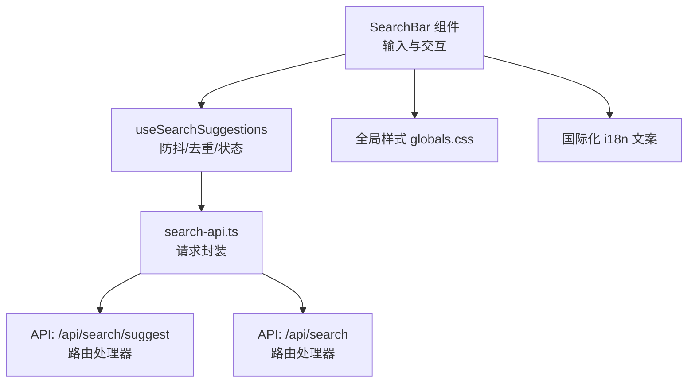
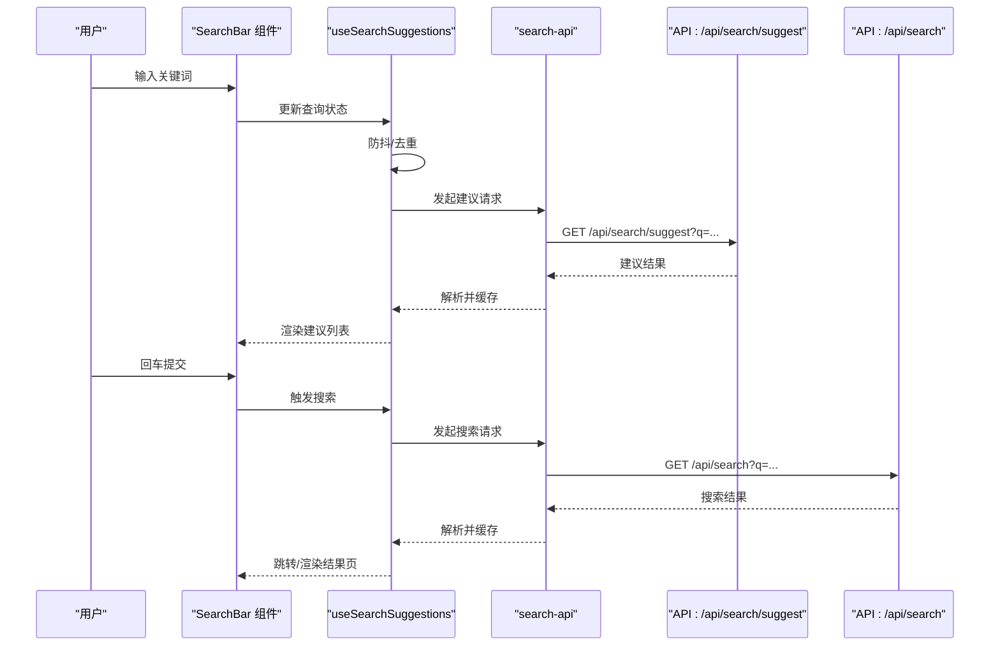
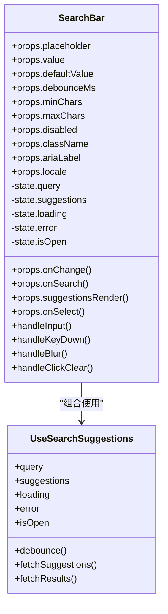
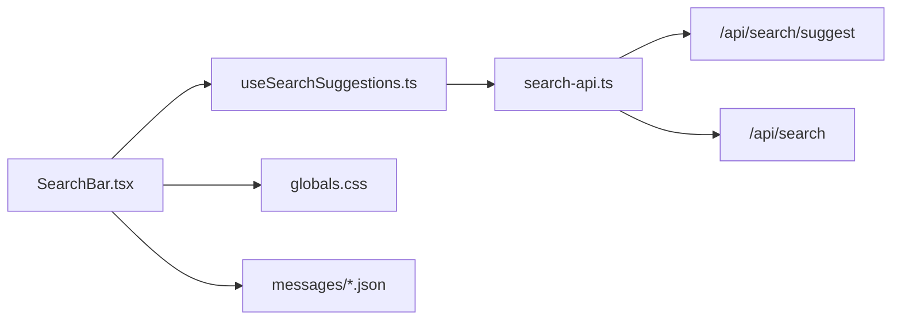

# 搜索框组件

<cite>
**本文引用的文件**   
- [SearchBar.tsx](file://apps/web/src/components/search/SearchBar.tsx)
- [useSearchSuggestions.ts](file://apps/web/src/lib/search/useSearchSuggestions.ts)
- [search-api.ts](file://apps/web/src/lib/search/search-api.ts)
- [i18n-zh-CN.json](file://apps/web/src/messages/zh-CN.json)
- [i18n-en.json](file://apps/web/src/messages/en.json)
- [globals.css](file://apps/web/src/app/globals.css)
- [search/route.ts](file://apps/web/src/app/api/search/route.ts)
- [suggest/route.ts](file://apps/web/src/app/api/search/suggest/route.ts)
</cite>

## 目录
1. [简介](#简介)
2. [项目结构](#项目结构)
3. [核心组件与能力](#核心组件与能力)
4. [架构总览](#架构总览)
5. [详细组件分析](#详细组件分析)
6. [依赖关系分析](#依赖关系分析)
7. [性能考量](#性能考量)
8. [故障排查指南](#故障排查指南)
9. [结论](#结论)
10. [附录：使用示例与最佳实践](#附录使用示例与最佳实践)

## 简介
本文件面向 SearchBar 搜索框组件，系统化说明其功能特性、接口定义、事件处理、状态管理、样式定制、国际化支持与无障碍访问实现。文档同时提供端到端调用流程、常见问题定位方法与最佳实践建议，帮助开发者快速集成并优化搜索体验。

## 项目结构
搜索相关的前端代码主要位于 apps/web 目录：
- 组件层：apps/web/src/components/search/SearchBar.tsx
- 数据与交互：apps/web/src/lib/search/useSearchSuggestions.ts、apps/web/src/lib/search/search-api.ts
- 国际化文案：apps/web/src/messages/zh-CN.json、apps/web/src/messages/en.json
- 全局样式：apps/web/src/app/globals.css
- 后端 API：apps/web/src/app/api/search/route.ts、apps/web/src/app/api/search/suggest/route.ts

图表来源 
- [SearchBar.tsx](file://apps/web/src/components/search/SearchBar.tsx)
- [useSearchSuggestions.ts](file://apps/web/src/lib/search/useSearchSuggestions.ts)
- [search-api.ts](file://apps/web/src/lib/search/search-api.ts)
- [suggest/route.ts](file://apps/web/src/app/api/search/suggest/route.ts)
- [search/route.ts](file://apps/web/src/app/api/search/route.ts)
- [globals.css](file://apps/web/src/app/globals.css)
- [i18n-zh-CN.json](file://apps/web/src/messages/zh-CN.json)
- [i18n-en.json](file://apps/web/src/messages/en.json)

章节来源
- [SearchBar.tsx](file://apps/web/src/components/search/SearchBar.tsx)
- [useSearchSuggestions.ts](file://apps/web/src/lib/search/useSearchSuggestions.ts)
- [search-api.ts](file://apps/web/src/lib/search/search-api.ts)
- [search/route.ts](file://apps/web/src/app/api/search/route.ts)
- [suggest/route.ts](file://apps/web/src/app/api/search/suggest/route.ts)
- [globals.css](file://apps/web/src/app/globals.css)
- [i18n-zh-CN.json](file://apps/web/src/messages/zh-CN.json)
- [i18n-en.json](file://apps/web/src/messages/en.json)

## 核心组件与能力
- 输入处理
  - 受控与非受控模式支持（通过 value/onChange 或 defaultValue）
  - 输入清洗与标准化（去除首尾空白、统一大小写策略可选）
  - 空值与边界长度校验（最小/最大字符数限制）
- 实时搜索触发
  - 防抖机制（默认延迟毫秒数可配置）
  - 取消重复请求（基于查询字符串的简单去重）
  - 加载态与错误态提示
- 键盘导航支持
  - Enter 提交搜索
  - Escape 清空输入并关闭下拉
  - 方向键在建议列表上下移动，Enter 选择
  - Tab/Shift+Tab 符合常规焦点顺序
- 无障碍访问（a11y）
  - aria-label/aria-describedby 关联提示文本
  - role="combobox" + listbox/option 语义化建议列表
  - 焦点管理与可见性控制（展开/收起）
- 国际化支持
  - 占位符、提示文案、错误信息均通过 i18n 键值注入
- 样式定制
  - 主题变量覆盖（颜色、圆角、阴影、字号等）
  - 响应式布局适配（移动端全屏搜索栏）

章节来源
- [SearchBar.tsx](file://apps/web/src/components/search/SearchBar.tsx)
- [useSearchSuggestions.ts](file://apps/web/src/lib/search/useSearchSuggestions.ts)
- [search-api.ts](file://apps/web/src/lib/search/search-api.ts)
- [globals.css](file://apps/web/src/app/globals.css)
- [i18n-zh-CN.json](file://apps/web/src/messages/zh-CN.json)
- [i18n-en.json](file://apps/web/src/messages/en.json)

## 架构总览
SearchBar 组件通过自定义 Hook 管理搜索状态与网络请求，调用统一的 search-api 模块发起建议与搜索结果请求，最终由服务端路由返回数据。

图表来源 
- [SearchBar.tsx](file://apps/web/src/components/search/SearchBar.tsx)
- [useSearchSuggestions.ts](file://apps/web/src/lib/search/useSearchSuggestions.ts)
- [search-api.ts](file://apps/web/src/lib/search/search-api.ts)
- [suggest/route.ts](file://apps/web/src/app/api/search/suggest/route.ts)
- [search/route.ts](file://apps/web/src/app/api/search/route.ts)

## 详细组件分析

### SearchBar 组件
- 职责
  - 渲染输入框、清除按钮、建议列表容器
  - 处理键盘事件与鼠标交互
  - 将用户输入与操作透传给 useSearchSuggestions Hook
  - 根据 a11y 规范设置属性与角色
- 关键 props（建议）
  - placeholder: string | i18nKey
  - value?: string
  - defaultValue?: string
  - onChange?(value: string): void
  - onSearch?(query: string): void
  - debounceMs?: number
  - minChars?: number
  - maxChars?: number
  - disabled?: boolean
  - className?: string
  - suggestionsRender?(items: any[]): ReactNode
  - onSelect?(item: any): void
  - ariaLabel?: string
  - locale?: string
- 内部状态
  - query: string
  - suggestions: any[]
  - loading: boolean
  - error: string | null
  - isOpen: boolean（建议列表展开/收起）
- 事件处理
  - onInput/onKeyDown：防抖触发建议；Enter 提交；Escape 关闭
  - onBlur：失焦后延迟关闭建议列表（避免点击建议时误关闭）
  - onClickClear：清空输入并重置状态
- 无障碍
  - role="combobox"、aria-expanded、aria-controls、aria-activedescendant
  - 建议项 role="option"，当前选中项高亮
- 样式
  - 通过 CSS 变量与类名覆盖主题
  - 聚焦态、禁用态、错误态视觉反馈

章节来源
- [SearchBar.tsx](file://apps/web/src/components/search/SearchBar.tsx)

#### 类图（概念映射）

图表来源 
- [SearchBar.tsx](file://apps/web/src/components/search/SearchBar.tsx)
- [useSearchSuggestions.ts](file://apps/web/src/lib/search/useSearchSuggestions.ts)

### useSearchSuggestions Hook
- 职责
  - 维护查询状态、建议列表与加载/错误状态
  - 实现防抖与请求去重
  - 调用 search-api 获取建议与搜索结果
  - 暴露统一的状态与回调供 SearchBar 使用
- 关键方法
  - setQuery(value)
  - fetchSuggestions(query)
  - fetchResults(query)
  - reset()
- 内部逻辑要点
  - 防抖：基于 setTimeout 的轻量实现，支持 cancel
  - 去重：记录 lastQuery，避免重复请求
  - 错误处理：网络异常与业务错误的降级展示
  - 缓存：对相同查询结果的简单内存缓存（可选）

章节来源
- [useSearchSuggestions.ts](file://apps/web/src/lib/search/useSearchSuggestions.ts)

### search-api 模块
- 职责
  - 统一封装建议与搜索请求
  - 参数序列化与错误码处理
  - 可选的请求头（如语言、追踪标识）
- 关键接口
  - getSuggestions(params): Promise<Suggestion[]>
  - search(params): Promise<Result[]>
- 错误处理
  - 网络错误：重试策略或降级提示
  - 业务错误：错误码映射为可读消息

章节来源
- [search-api.ts](file://apps/web/src/lib/search/search-api.ts)

### 服务端 API 路由
- /api/search/suggest
  - 入参：q（查询词）、limit（数量限制）、locale（可选）
  - 出参：[{id, title, path, score}]
  - 行为：模糊匹配、排序、分页限制
- /api/search
  - 入参：q、page、pageSize、filters（可选）
  - 出参：{results, total, page}
  - 行为：全文检索、过滤、排序、分页

章节来源
- [suggest/route.ts](file://apps/web/src/app/api/search/suggest/route.ts)
- [search/route.ts](file://apps/web/src/app/api/search/route.ts)

## 依赖关系分析
- 组件依赖
  - SearchBar 依赖 useSearchSuggestions 进行状态与请求编排
  - useSearchSuggestions 依赖 search-api 进行网络通信
  - search-api 依赖浏览器 Fetch API 与服务端路由
- 样式与文案
  - 样式通过全局 CSS 变量与类名覆盖
  - 文案通过 i18n JSON 文件注入

图表来源 
- [SearchBar.tsx](file://apps/web/src/components/search/SearchBar.tsx)
- [useSearchSuggestions.ts](file://apps/web/src/lib/search/useSearchSuggestions.ts)
- [search-api.ts](file://apps/web/src/lib/search/search-api.ts)
- [suggest/route.ts](file://apps/web/src/app/api/search/suggest/route.ts)
- [search/route.ts](file://apps/web/src/app/api/search/route.ts)
- [globals.css](file://apps/web/src/app/globals.css)
- [i18n-zh-CN.json](file://apps/web/src/messages/zh-CN.json)
- [i18n-en.json](file://apps/web/src/messages/en.json)

章节来源
- [SearchBar.tsx](file://apps/web/src/components/search/SearchBar.tsx)
- [useSearchSuggestions.ts](file://apps/web/src/lib/search/useSearchSuggestions.ts)
- [search-api.ts](file://apps/web/src/lib/search/search-api.ts)
- [suggest/route.ts](file://apps/web/src/app/api/search/suggest/route.ts)
- [search/route.ts](file://apps/web/src/app/api/search/route.ts)
- [globals.css](file://apps/web/src/app/globals.css)
- [i18n-zh-CN.json](file://apps/web/src/messages/zh-CN.json)
- [i18n-en.json](file://apps/web/src/messages/en.json)

## 性能考量
- 防抖与节流
  - 合理设置 debounceMs（建议 200-400ms），减少频繁请求
  - 长列表建议可使用虚拟滚动（当建议项较多时）
- 请求优化
  - 去重与取消未完成的请求，避免竞态条件
  - 服务端侧限流与缓存（Redis 或内存缓存）
- 渲染优化
  - 建议列表按需渲染，避免不必要的重排
  - 使用 key 稳定化列表项，提升 Diff 效率
- 资源加载
  - 图标与字体懒加载
  - 图片建议采用 WebP/AVIF 与 CDN

[本节为通用指导，不直接分析具体文件]

## 故障排查指南
- 无建议返回
  - 检查 q 参数是否满足 minChars
  - 查看网络面板中 /api/search/suggest 的响应码与内容
  - 确认服务端路由是否启用与鉴权正常
- 输入无响应
  - 检查防抖时间是否过长
  - 确认 onChange 与 setQuery 是否正确绑定
- 键盘导航失效
  - 检查 role/aria-* 属性是否正确设置
  - 验证 focus 与 blur 事件处理是否冲突
- 样式错乱
  - 检查 CSS 变量覆盖是否生效
  - 确认组件类名未被第三方样式覆盖
- 国际化缺失
  - 确认 i18n 键是否存在于对应语言文件
  - 检查 locale 传递是否正确

章节来源
- [SearchBar.tsx](file://apps/web/src/components/search/SearchBar.tsx)
- [useSearchSuggestions.ts](file://apps/web/src/lib/search/useSearchSuggestions.ts)
- [search-api.ts](file://apps/web/src/lib/search/search-api.ts)
- [globals.css](file://apps/web/src/app/globals.css)
- [i18n-zh-CN.json](file://apps/web/src/messages/zh-CN.json)
- [i18n-en.json](file://apps/web/src/messages/en.json)

## 结论
SearchBar 组件以清晰的职责划分与良好的扩展性，实现了输入处理、实时建议、键盘导航与无障碍访问等核心能力。通过 useSearchSuggestions 与 search-api 的解耦设计，便于在不同场景下复用与定制。配合样式变量与 i18n 支持，可满足多主题与多语言的复杂需求。

[本节为总结性内容，不直接分析具体文件]

## 附录：使用示例与最佳实践
- 基本用法
  - 传入 placeholder、onSearch 与 debounceMs，即可实现基础搜索
  - 使用 value/onChange 实现受控输入
- 自定义建议渲染
  - 通过 suggestionsRender 自定义建议项布局与交互
- 无障碍增强
  - 设置 aria-label 与 aria-describedby，确保屏幕阅读器友好
- 样式定制
  - 通过 CSS 变量覆盖主题色、圆角与阴影
  - 使用 className 注入额外样式类
- 国际化
  - 从 messages 文件中引入对应语言键值，动态切换 locale
- 性能优化
  - 合理设置防抖时间与最小查询长度
  - 对建议列表进行虚拟化渲染（大数据量场景）
- 错误处理
  - 在网络失败时显示友好提示，并提供重试入口
  - 对业务错误码进行本地化映射

章节来源
- [SearchBar.tsx](file://apps/web/src/components/search/SearchBar.tsx)
- [useSearchSuggestions.ts](file://apps/web/src/lib/search/useSearchSuggestions.ts)
- [search-api.ts](file://apps/web/src/lib/search/search-api.ts)
- [globals.css](file://apps/web/src/app/globals.css)
- [i18n-zh-CN.json](file://apps/web/src/messages/zh-CN.json)
- [i18n-en.json](file://apps/web/src/messages/en.json)