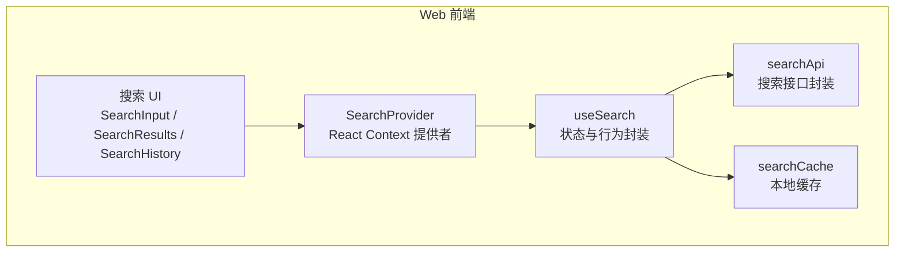
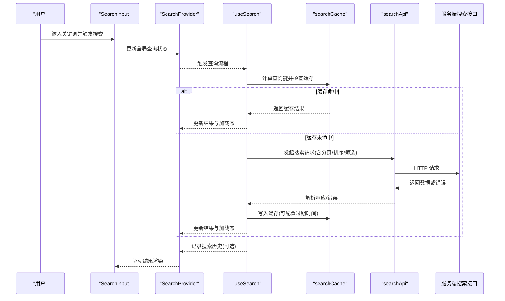
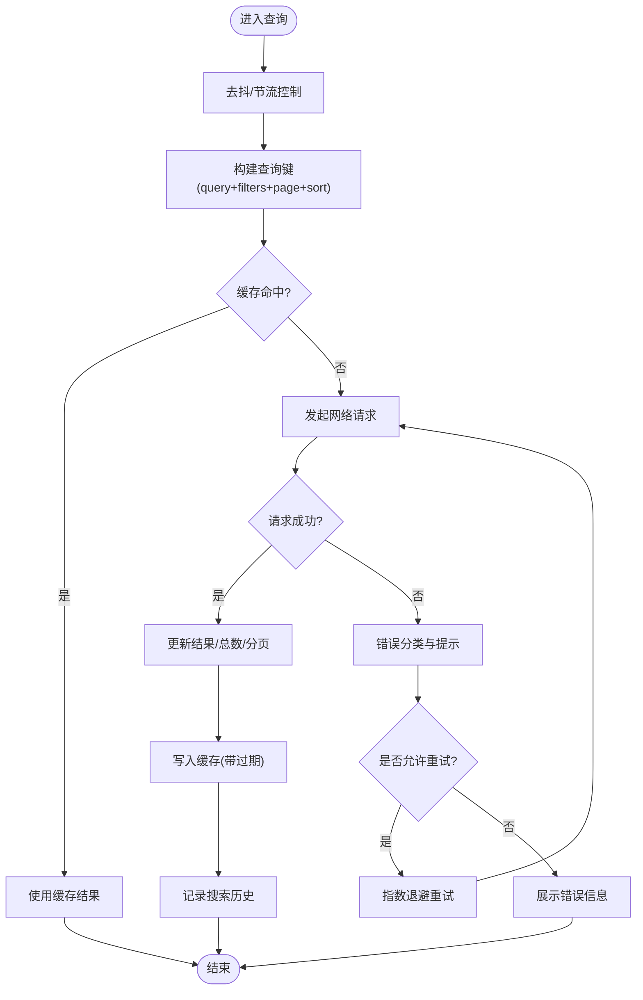
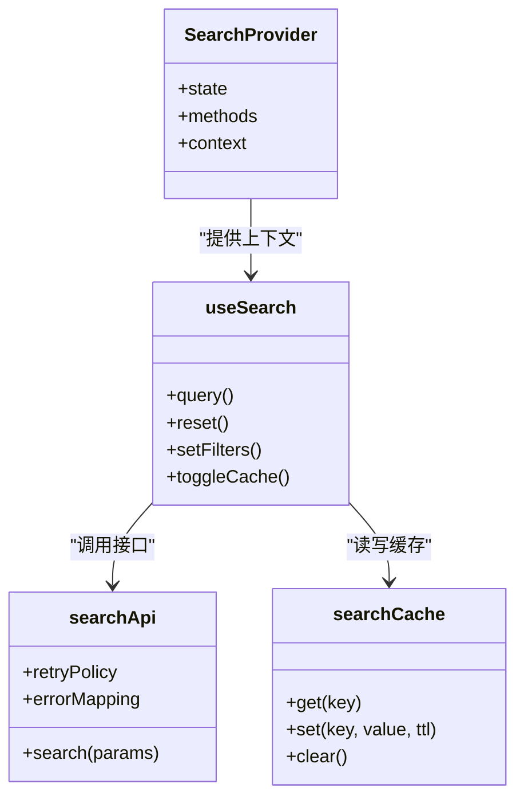

# 搜索状态提供者

<cite>
**本文引用的文件**   
- [SearchProvider.tsx](file://apps/web/src/components/search/SearchProvider.tsx)
- [useSearch.ts](file://apps/web/src/lib/search/useSearch.ts)
- [searchApi.ts](file://apps/web/src/lib/search/searchApi.ts)
- [searchCache.ts](file://apps/web/src/lib/search/searchCache.ts)
- [SearchInput.tsx](file://apps/web/src/components/search/SearchInput.tsx)
- [SearchResults.tsx](file://apps/web/src/components/search/SearchResults.tsx)
- [SearchHistory.tsx](file://apps/web/src/components/search/SearchHistory.tsx)
- [apiClient.ts](file://apps/admin/src/lib/apiClient.ts)
- [fetch-retry.ts](file://apps/admin/src/lib/fetch-retry.ts)
</cite>

## 目录
1. [简介](#简介)
2. [项目结构](#项目结构)
3. [核心组件与状态模型](#核心组件与状态模型)
4. [架构总览](#架构总览)
5. [详细组件分析](#详细组件分析)
6. [依赖关系分析](#依赖关系分析)
7. [性能考量](#性能考量)
8. [故障排查指南](#故障排查指南)
9. [结论](#结论)
10. [附录](#附录)

## 简介
本文件面向“搜索状态提供者”（SearchProvider）的完整技术文档，聚焦以下目标：
- 说明 SearchProvider 的状态管理模式：全局搜索状态、搜索历史与缓存机制
- 文档化 React Context 的使用方式、状态同步策略与性能优化
- 封装搜索 API 调用、错误处理与重试机制
- 提供与其他组件集成的最佳实践与常见问题解决方案

该实现基于 Next.js Web 应用的前端代码，使用 React Context 作为全局状态容器，结合自定义 Hook 与工具模块完成搜索查询、结果渲染、历史记录与缓存管理。

## 项目结构
搜索相关能力主要分布在 apps/web 的 components/search 与 lib/search 两个目录中：
- components/search：UI 层组件（输入框、结果列表、历史面板等）
- lib/search：状态与数据流（Context Provider、Hook、API 封装、缓存）

图表来源
- [SearchProvider.tsx:1-200](file://apps/web/src/components/search/SearchProvider.tsx#L1-L200)
- [useSearch.ts:1-200](file://apps/web/src/lib/search/useSearch.ts#L1-L200)
- [searchApi.ts:1-200](file://apps/web/src/lib/search/searchApi.ts#L1-L200)
- [searchCache.ts:1-200](file://apps/web/src/lib/search/searchCache.ts#L1-L200)

章节来源
- [SearchProvider.tsx:1-200](file://apps/web/src/components/search/SearchProvider.tsx#L1-L200)
- [useSearch.ts:1-200](file://apps/web/src/lib/search/useSearch.ts#L1-L200)
- [searchApi.ts:1-200](file://apps/web/src/lib/search/searchApi.ts#L1-L200)
- [searchCache.ts:1-200](file://apps/web/src/lib/search/searchCache.ts#L1-L200)

## 核心组件与状态模型
- SearchProvider：通过 React Context 暴露全局搜索状态与方法，包括关键词、分页、排序、筛选、加载态、错误态、结果集、历史与缓存开关等。
- useSearch：消费 Context 的 Hook，提供统一的查询入口、去抖/节流、缓存命中、失败重试、历史写入等逻辑。
- searchApi：对后端搜索接口的统一封装，负责参数序列化、请求头设置、错误分类与重试策略。
- searchCache：本地缓存实现，支持按查询键存储结果、过期时间与容量限制。

关键状态字段（示例性描述）：
- query：当前搜索关键词
- filters：筛选条件对象
- page/pageSize：分页参数
- sort：排序规则
- results：搜索结果数组
- total：总数
- loading：是否加载中
- error：错误信息或错误码
- history：搜索历史条目列表
- cacheEnabled：是否启用缓存
- lastQueryKey：最近一次查询键

章节来源
- [SearchProvider.tsx:1-200](file://apps/web/src/components/search/SearchProvider.tsx#L1-L200)
- [useSearch.ts:1-200](file://apps/web/src/lib/search/useSearch.ts#L1-L200)
- [searchCache.ts:1-200](file://apps/web/src/lib/search/searchCache.ts#L1-L200)

## 架构总览
下图展示了从用户输入到结果渲染的端到端流程，以及缓存与重试的介入点。

图表来源
- [SearchProvider.tsx:1-200](file://apps/web/src/components/search/SearchProvider.tsx#L1-L200)
- [useSearch.ts:1-200](file://apps/web/src/lib/search/useSearch.ts#L1-L200)
- [searchApi.ts:1-200](file://apps/web/src/lib/search/searchApi.ts#L1-L200)
- [searchCache.ts:1-200](file://apps/web/src/lib/search/searchCache.ts#L1-L200)

## 详细组件分析

### SearchProvider（全局状态提供者）
职责：
- 创建并维护搜索相关的全局状态
- 提供查询、重置、清空历史、切换缓存开关等方法
- 将状态与方法注入 Context，供子组件与 Hook 消费

设计要点：
- 使用 useMemo/useCallback 稳定引用，避免不必要的重渲染
- 将频繁更新的字段（如 loading、error）与较少更新的字段（filters、sort）分离，便于细粒度订阅
- 提供批量更新方法，减少多次 setState 导致的闪烁

集成建议：
- 在应用根布局或路由级包裹 SearchProvider，确保全局可用
- 对需要精确订阅的组件，优先使用 useSearch Hook 而非直接消费 Context

章节来源
- [SearchProvider.tsx:1-200](file://apps/web/src/components/search/SearchProvider.tsx#L1-L200)

### useSearch（搜索 Hook）
职责：
- 封装搜索生命周期：去抖、缓存命中、请求发送、结果合并、错误处理、重试
- 维护搜索历史与最近查询键
- 暴露统一的查询方法与状态选择器

算法流程（简化）：

图表来源
- [useSearch.ts:1-200](file://apps/web/src/lib/search/useSearch.ts#L1-L200)
- [searchCache.ts:1-200](file://apps/web/src/lib/search/searchCache.ts#L1-L200)
- [searchApi.ts:1-200](file://apps/web/src/lib/search/searchApi.ts#L1-L200)

章节来源
- [useSearch.ts:1-200](file://apps/web/src/lib/search/useSearch.ts#L1-L200)

### searchApi（搜索 API 封装）
职责：
- 统一构造请求 URL、查询参数与请求头
- 处理认证、跨域、超时、错误码映射
- 提供重试策略（可配置次数与退避间隔）

关键点：
- 将业务错误与网络错误区分，便于上层展示与重试决策
- 支持取消重复请求（AbortController），避免竞态问题
- 与 admin 端的 apiClient 和 fetch-retry 保持一致的错误与重试风格

章节来源
- [searchApi.ts:1-200](file://apps/web/src/lib/search/searchApi.ts#L1-L200)
- [apiClient.ts:1-200](file://apps/admin/src/lib/apiClient.ts#L1-L200)
- [fetch-retry.ts:1-200](file://apps/admin/src/lib/fetch-retry.ts#L1-L200)

### searchCache（本地缓存）
职责：
- 以查询键为维度缓存搜索结果
- 支持 TTL（过期时间）、容量上限与 LRU 淘汰
- 提供同步读取与异步写入接口

设计要点：
- 针对大结果集进行压缩或分片存储，降低内存占用
- 对敏感数据做脱敏或加密（可选）
- 提供缓存统计与监控钩子（可选）

章节来源
- [searchCache.ts:1-200](file://apps/web/src/lib/search/searchCache.ts#L1-L200)

### 搜索 UI 组件集成
- SearchInput：监听输入变化，触发去抖查询；支持快捷键与清除按钮
- SearchResults：根据 loading/error/results 状态渲染骨架屏、错误提示或结果列表
- SearchHistory：展示最近搜索历史，支持点击回填与清空

集成最佳实践：
- 所有组件通过 useSearch Hook 获取状态与方法，避免直接操作 Context
- 对高频渲染的结果列表使用虚拟滚动或分页懒加载
- 对搜索历史与缓存开关等低频状态，使用独立的小组件或抽屉面板

章节来源
- [SearchInput.tsx:1-200](file://apps/web/src/components/search/SearchInput.tsx#L1-L200)
- [SearchResults.tsx:1-200](file://apps/web/src/components/search/SearchResults.tsx#L1-L200)
- [SearchHistory.tsx:1-200](file://apps/web/src/components/search/SearchHistory.tsx#L1-L200)

## 依赖关系分析
- SearchProvider 依赖 React Context API，向外暴露状态与方法
- useSearch 依赖 searchApi 与 searchCache，内部组合去抖、重试、历史等逻辑
- UI 组件仅依赖 useSearch，保持低耦合与高内聚

图表来源
- [SearchProvider.tsx:1-200](file://apps/web/src/components/search/SearchProvider.tsx#L1-L200)
- [useSearch.ts:1-200](file://apps/web/src/lib/search/useSearch.ts#L1-L200)
- [searchApi.ts:1-200](file://apps/web/src/lib/search/searchApi.ts#L1-L200)
- [searchCache.ts:1-200](file://apps/web/src/lib/search/searchCache.ts#L1-L200)

章节来源
- [SearchProvider.tsx:1-200](file://apps/web/src/components/search/SearchProvider.tsx#L1-L200)
- [useSearch.ts:1-200](file://apps/web/src/lib/search/useSearch.ts#L1-L200)
- [searchApi.ts:1-200](file://apps/web/src/lib/search/searchApi.ts#L1-L200)
- [searchCache.ts:1-200](file://apps/web/src/lib/search/searchCache.ts#L1-L200)

## 性能考量
- 去抖与节流：在输入阶段使用去抖，避免频繁请求；在翻页/排序时使用节流，防止抖动
- 缓存命中率：合理设置 TTL 与查询键，提升命中率；对热点查询做预取
- 请求取消：使用 AbortController 取消过时请求，避免覆盖最新结果
- 渲染优化：对结果列表采用虚拟滚动、分页懒加载与选择性渲染
- 状态拆分：将易变状态（loading、error）与不变状态（filters、sort）拆分，减少重渲染范围
- 内存控制：对缓存进行容量限制与 LRU 淘汰，避免内存泄漏

[本节为通用指导，不直接分析具体文件]

## 故障排查指南
常见问题与定位思路：
- 无结果或结果陈旧
  - 检查缓存是否命中且未过期；必要时强制刷新或禁用缓存
  - 确认查询键是否正确包含 filters、page、sort
- 频繁请求导致卡顿
  - 检查去抖/节流配置；确认是否存在重复请求未取消
- 错误提示不明确
  - 查看 searchApi 的错误映射；区分网络错误与业务错误
- 历史为空或异常
  - 检查历史记录写入时机与去重逻辑；确认本地存储权限

章节来源
- [useSearch.ts:1-200](file://apps/web/src/lib/search/useSearch.ts#L1-L200)
- [searchApi.ts:1-200](file://apps/web/src/lib/search/searchApi.ts#L1-L200)
- [searchCache.ts:1-200](file://apps/web/src/lib/search/searchCache.ts#L1-L200)

## 结论
SearchProvider 通过 React Context 统一管理搜索状态，配合 useSearch 封装完整的查询生命周期，结合 searchApi 与 searchCache 实现可靠的网络请求与本地缓存。整体架构清晰、职责分明，具备良好的扩展性与可维护性。建议在后续迭代中持续优化缓存策略、错误处理与性能监控，以提升用户体验与系统稳定性。

[本节为总结性内容，不直接分析具体文件]

## 附录
- 与 Admin 端一致性：建议复用 apiClient 与 fetch-retry 的错误与重试策略，保证前后端交互风格一致
- 可观测性：建议增加缓存命中率、请求耗时、错误率等埋点，便于监控与优化

[本节为补充说明，不直接分析具体文件]