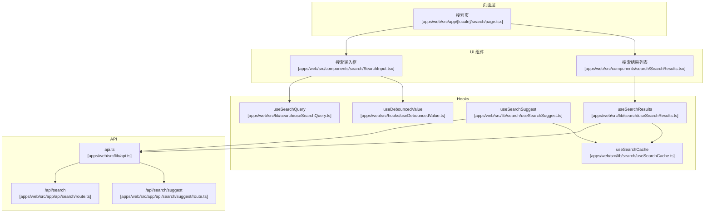
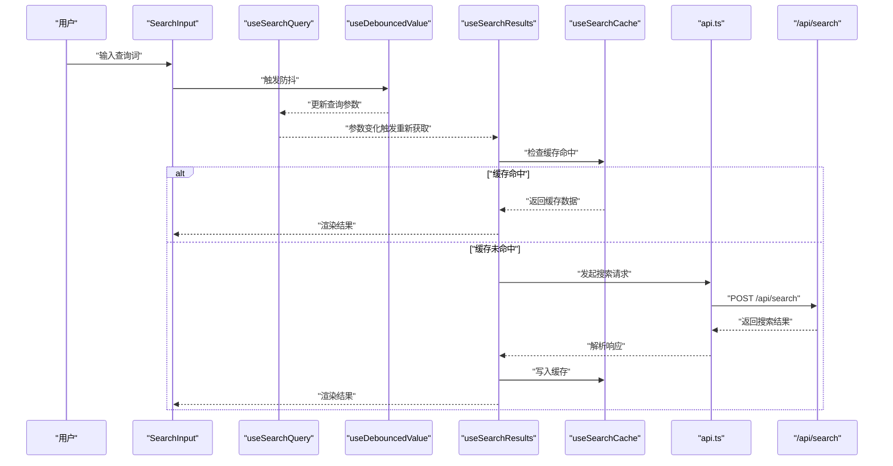
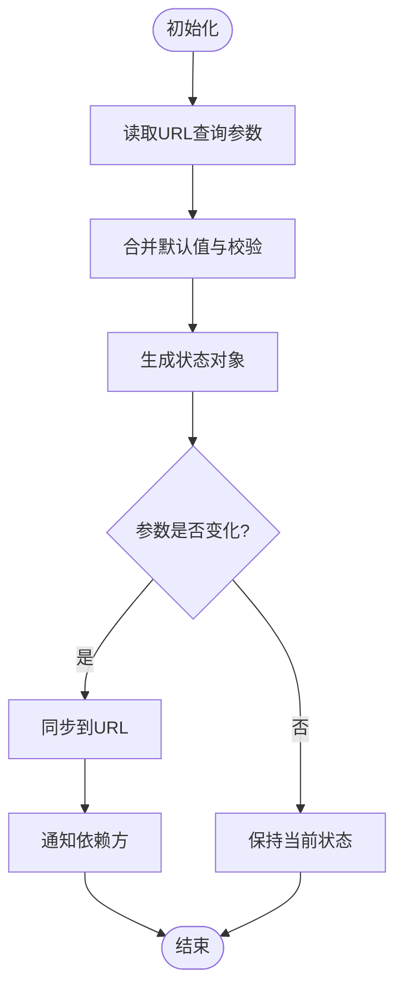
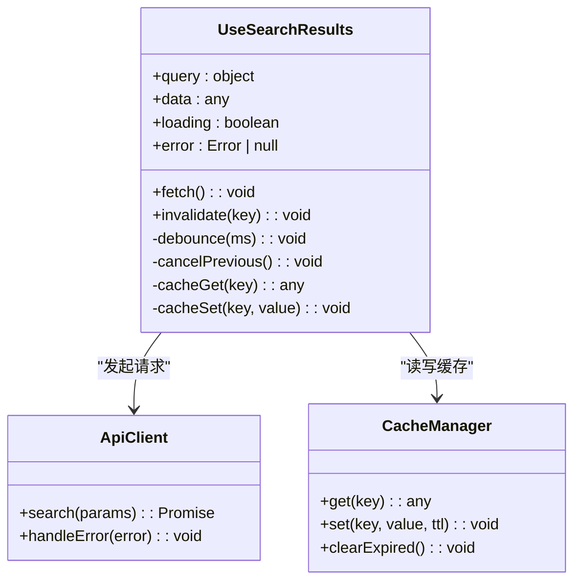
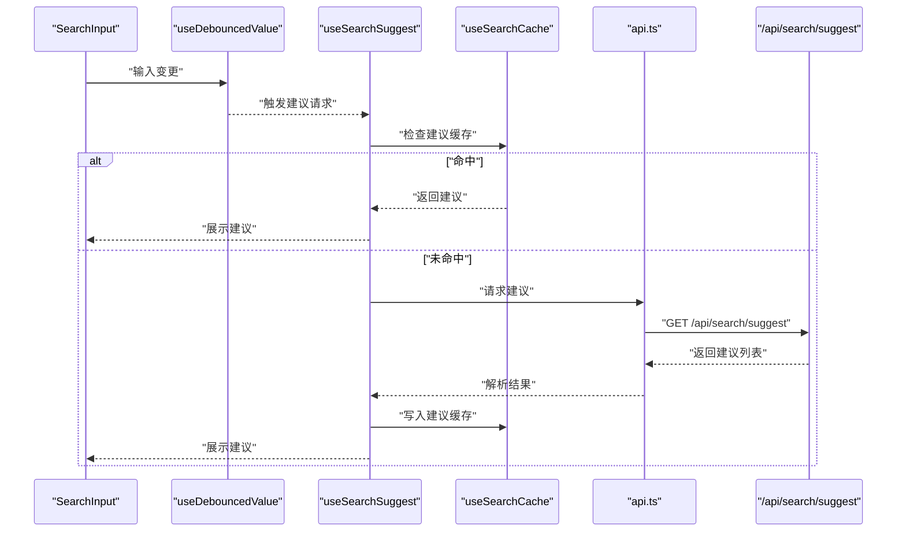
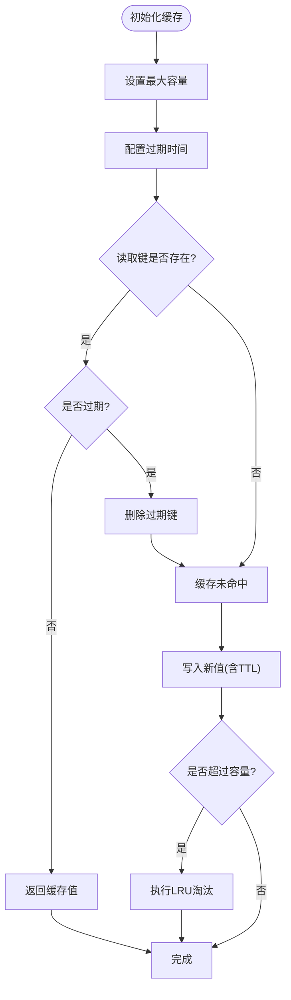
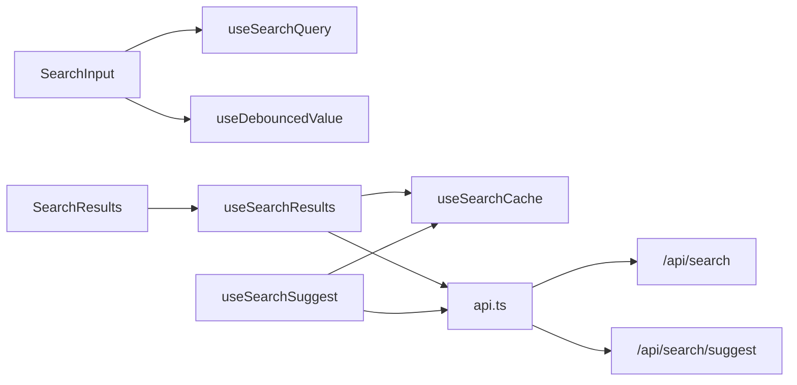

# 搜索相关Hooks

<cite>
**本文档引用的文件**   
- [apps/web/src/app/[locale]/search/page.tsx](file://apps/web/src/app/[locale]/search/page.tsx)
- [apps/web/src/components/search/SearchInput.tsx](file://apps/web/src/components/search/SearchInput.tsx)
- [apps/web/src/components/search/SearchResults.tsx](file://apps/web/src/components/search/SearchResults.tsx)
- [apps/web/src/lib/search/useSearchQuery.ts](file://apps/web/src/lib/search/useSearchQuery.ts)
- [apps/web/src/lib/search/useSearchResults.ts](file://apps/web/src/lib/search/useSearchResults.ts)
- [apps/web/src/lib/search/useSearchSuggest.ts](file://apps/web/src/lib/search/useSearchSuggest.ts)
- [apps/web/src/lib/search/useSearchCache.ts](file://apps/web/src/lib/search/useSearchCache.ts)
- [apps/web/src/lib/search/useDebouncedValue.ts](file://apps/web/src/hooks/useDebouncedValue.ts)
- [apps/web/src/lib/api.ts](file://apps/web/src/lib/api.ts)
- [apps/web/src/app/api/search/route.ts](file://apps/web/src/app/api/search/route.ts)
- [apps/web/src/app/api/search/suggest/route.ts](file://apps/web/src/app/api/search/suggest/route.ts)
</cite>

## 目录
1. [简介](#简介)
2. [项目结构](#项目结构)
3. [核心组件](#核心组件)
4. [架构总览](#架构总览)
5. [详细组件分析](#详细组件分析)
6. [依赖关系分析](#依赖关系分析)
7. [性能考虑](#性能考虑)
8. [故障排查指南](#故障排查指南)
9. [结论](#结论)
10. [附录](#附录)

## 简介
本文件面向前端开发者，系统化梳理搜索相关自定义Hook的设计模式与实现要点，覆盖：
- 搜索状态管理：查询词、分页、排序、筛选等
- 异步数据获取：请求生命周期、错误处理、取消重复请求
- 缓存策略：内存缓存、去重、失效与更新
- 性能优化：防抖/节流、懒加载、渲染优化
- 扩展指南：如何新增搜索维度、接入新后端接口、集成建议

目标读者包括需要快速上手搜索功能的工程师，以及希望深入理解搜索Hook设计与优化的资深开发者。

## 项目结构
搜索功能主要位于 web 应用的前端代码中，围绕以下模块组织：
- 页面层：搜索入口页
- UI 组件：搜索输入框、结果列表
- Hooks：查询参数、结果获取、建议词、缓存、防抖
- API：客户端封装与Next.js路由

**图表来源** 
- [apps/web/src/app/[locale]/search/page.tsx](file://apps/web/src/app/[locale]/search/page.tsx)
- [apps/web/src/components/search/SearchInput.tsx](file://apps/web/src/components/search/SearchInput.tsx)
- [apps/web/src/components/search/SearchResults.tsx](file://apps/web/src/components/search/SearchResults.tsx)
- [apps/web/src/lib/search/useSearchQuery.ts](file://apps/web/src/lib/search/useSearchQuery.ts)
- [apps/web/src/lib/search/useSearchResults.ts](file://apps/web/src/lib/search/useSearchResults.ts)
- [apps/web/src/lib/search/useSearchSuggest.ts](file://apps/web/src/lib/search/useSearchSuggest.ts)
- [apps/web/src/lib/search/useSearchCache.ts](file://apps/web/src/lib/search/useSearchCache.ts)
- [apps/web/src/hooks/useDebouncedValue.ts](file://apps/web/src/hooks/useDebouncedValue.ts)
- [apps/web/src/lib/api.ts](file://apps/web/src/lib/api.ts)
- [apps/web/src/app/api/search/route.ts](file://apps/web/src/app/api/search/route.ts)
- [apps/web/src/app/api/search/suggest/route.ts](file://apps/web/src/app/api/search/suggest/route.ts)

**章节来源**
- [apps/web/src/app/[locale]/search/page.tsx](file://apps/web/src/app/[locale]/search/page.tsx)
- [apps/web/src/components/search/SearchInput.tsx](file://apps/web/src/components/search/SearchInput.tsx)
- [apps/web/src/components/search/SearchResults.tsx](file://apps/web/src/components/search/SearchResults.tsx)
- [apps/web/src/lib/search/useSearchQuery.ts](file://apps/web/src/lib/search/useSearchQuery.ts)
- [apps/web/src/lib/search/useSearchResults.ts](file://apps/web/src/lib/search/useSearchResults.ts)
- [apps/web/src/lib/search/useSearchSuggest.ts](file://apps/web/src/lib/search/useSearchSuggest.ts)
- [apps/web/src/lib/search/useSearchCache.ts](file://apps/web/src/lib/search/useSearchCache.ts)
- [apps/web/src/hooks/useDebouncedValue.ts](file://apps/web/src/hooks/useDebouncedValue.ts)
- [apps/web/src/lib/api.ts](file://apps/web/src/lib/api.ts)
- [apps/web/src/app/api/search/route.ts](file://apps/web/src/app/api/search/route.ts)
- [apps/web/src/app/api/search/suggest/route.ts](file://apps/web/src/app/api/search/suggest/route.ts)

## 核心组件
- useSearchQuery：负责将URL查询参数与本地状态同步，提供查询词、分页、排序、筛选等能力，并支持受控与非受控两种用法。
- useSearchResults：封装搜索结果的异步获取、错误处理、加载态、分页与缓存；内部使用防抖与请求去重，避免频繁请求。
- useSearchSuggest：提供搜索建议（自动补全）能力，结合防抖与缓存，提升输入体验。
- useSearchCache：统一的内存缓存管理器，支持按key存取、过期时间、大小限制与LRU淘汰策略。
- useDebouncedValue：通用防抖Hook，用于对高频输入进行节流，减少不必要的网络请求。

这些Hook共同构成“输入→参数→请求→缓存→渲染”的完整链路，确保搜索流程稳定高效。

**章节来源**
- [apps/web/src/lib/search/useSearchQuery.ts](file://apps/web/src/lib/search/useSearchQuery.ts)
- [apps/web/src/lib/search/useSearchResults.ts](file://apps/web/src/lib/search/useSearchResults.ts)
- [apps/web/src/lib/search/useSearchSuggest.ts](file://apps/web/src/lib/search/useSearchSuggest.ts)
- [apps/web/src/lib/search/useSearchCache.ts](file://apps/web/src/lib/search/useSearchCache.ts)
- [apps/web/src/hooks/useDebouncedValue.ts](file://apps/web/src/hooks/useDebouncedValue.ts)

## 架构总览
下图展示了从用户输入到结果渲染的完整调用链，以及缓存与API层的交互。

**图表来源** 
- [apps/web/src/components/search/SearchInput.tsx](file://apps/web/src/components/search/SearchInput.tsx)
- [apps/web/src/hooks/useDebouncedValue.ts](file://apps/web/src/hooks/useDebouncedValue.ts)
- [apps/web/src/lib/search/useSearchQuery.ts](file://apps/web/src/lib/search/useSearchQuery.ts)
- [apps/web/src/lib/search/useSearchResults.ts](file://apps/web/src/lib/search/useSearchResults.ts)
- [apps/web/src/lib/search/useSearchCache.ts](file://apps/web/src/lib/search/useSearchCache.ts)
- [apps/web/src/lib/api.ts](file://apps/web/src/lib/api.ts)
- [apps/web/src/app/api/search/route.ts](file://apps/web/src/app/api/search/route.ts)

## 详细组件分析

### useSearchQuery：搜索参数与状态管理
职责：
- 维护查询词、分页、排序、筛选等参数
- 与URL查询参数双向同步，支持分享链接与浏览器前进后退
- 提供受控与非受控两种使用方式，便于在不同场景下复用

关键设计点：
- URL同步：读取与写入URL查询参数，保证状态一致性
- 默认值与校验：为必填字段设置默认值与类型校验
- 事件回调：在参数变化时触发回调，供父组件或下游Hook监听

适用场景：
- 搜索页、筛选列表、高级搜索表单等

**图表来源** 
- [apps/web/src/lib/search/useSearchQuery.ts](file://apps/web/src/lib/search/useSearchQuery.ts)

**章节来源**
- [apps/web/src/lib/search/useSearchQuery.ts](file://apps/web/src/lib/search/useSearchQuery.ts)

### useSearchResults：异步数据获取与缓存
职责：
- 根据查询参数发起搜索请求
- 管理加载态、错误态、成功态
- 分页、排序、筛选等参数的组合请求
- 使用缓存减少重复请求，提高性能

关键设计点：
- 请求去重：相同参数在同一时刻只发起一次请求
- 取消机制：参数变化时取消上一次未完成的请求
- 缓存策略：按参数键值存储结果，支持过期时间与容量限制
- 错误处理：网络异常、服务端错误的统一处理与重试

**图表来源** 
- [apps/web/src/lib/search/useSearchResults.ts](file://apps/web/src/lib/search/useSearchResults.ts)
- [apps/web/src/lib/api.ts](file://apps/web/src/lib/api.ts)
- [apps/web/src/lib/search/useSearchCache.ts](file://apps/web/src/lib/search/useSearchCache.ts)

**章节来源**
- [apps/web/src/lib/search/useSearchResults.ts](file://apps/web/src/lib/search/useSearchResults.ts)
- [apps/web/src/lib/api.ts](file://apps/web/src/lib/api.ts)
- [apps/web/src/lib/search/useSearchCache.ts](file://apps/web/src/lib/search/useSearchCache.ts)

### useSearchSuggest：搜索建议与自动补全
职责：
- 基于输入词提供建议列表
- 防抖输入，降低请求频率
- 缓存建议结果，提升用户体验

关键设计点：
- 最小输入长度阈值，避免无意义请求
- 建议词去重与排序
- 与主搜索缓存隔离，避免污染

**图表来源** 
- [apps/web/src/components/search/SearchInput.tsx](file://apps/web/src/components/search/SearchInput.tsx)
- [apps/web/src/hooks/useDebouncedValue.ts](file://apps/web/src/hooks/useDebouncedValue.ts)
- [apps/web/src/lib/search/useSearchSuggest.ts](file://apps/web/src/lib/search/useSearchSuggest.ts)
- [apps/web/src/lib/search/useSearchCache.ts](file://apps/web/src/lib/search/useSearchCache.ts)
- [apps/web/src/lib/api.ts](file://apps/web/src/lib/api.ts)
- [apps/web/src/app/api/search/suggest/route.ts](file://apps/web/src/app/api/search/suggest/route.ts)

**章节来源**
- [apps/web/src/lib/search/useSearchSuggest.ts](file://apps/web/src/lib/search/useSearchSuggest.ts)
- [apps/web/src/app/api/search/suggest/route.ts](file://apps/web/src/app/api/search/suggest/route.ts)

### useSearchCache：内存缓存管理
职责：
- 提供统一的缓存读写接口
- 支持TTL（过期时间）、容量限制、LRU淘汰
- 提供缓存统计与清理方法

关键设计点：
- 线程安全：在React环境中避免并发写入冲突
- 序列化：复杂对象的序列化为字符串存储
- 监控：记录命中率、内存占用等指标

**图表来源** 
- [apps/web/src/lib/search/useSearchCache.ts](file://apps/web/src/lib/search/useSearchCache.ts)

**章节来源**
- [apps/web/src/lib/search/useSearchCache.ts](file://apps/web/src/lib/search/useSearchCache.ts)

### useDebouncedValue：防抖工具Hook
职责：
- 对高频输入进行防抖处理
- 支持自定义延迟与立即执行选项
- 提供取消与重置方法

关键设计点：
- 基于setTimeout实现，避免内存泄漏
- 在组件卸载时自动清理定时器
- 与React状态同步，确保UI一致性

**章节来源**
- [apps/web/src/hooks/useDebouncedValue.ts](file://apps/web/src/hooks/useDebouncedValue.ts)

## 依赖关系分析
搜索相关模块之间的依赖关系如下：

**图表来源** 
- [apps/web/src/components/search/SearchInput.tsx](file://apps/web/src/components/search/SearchInput.tsx)
- [apps/web/src/components/search/SearchResults.tsx](file://apps/web/src/components/search/SearchResults.tsx)
- [apps/web/src/lib/search/useSearchQuery.ts](file://apps/web/src/lib/search/useSearchQuery.ts)
- [apps/web/src/lib/search/useSearchResults.ts](file://apps/web/src/lib/search/useSearchResults.ts)
- [apps/web/src/lib/search/useSearchSuggest.ts](file://apps/web/src/lib/search/useSearchSuggest.ts)
- [apps/web/src/lib/search/useSearchCache.ts](file://apps/web/src/lib/search/useSearchCache.ts)
- [apps/web/src/hooks/useDebouncedValue.ts](file://apps/web/src/hooks/useDebouncedValue.ts)
- [apps/web/src/lib/api.ts](file://apps/web/src/lib/api.ts)
- [apps/web/src/app/api/search/route.ts](file://apps/web/src/app/api/search/route.ts)
- [apps/web/src/app/api/search/suggest/route.ts](file://apps/web/src/app/api/search/suggest/route.ts)

**章节来源**
- [apps/web/src/lib/api.ts](file://apps/web/src/lib/api.ts)
- [apps/web/src/app/api/search/route.ts](file://apps/web/src/app/api/search/route.ts)
- [apps/web/src/app/api/search/suggest/route.ts](file://apps/web/src/app/api/search/suggest/route.ts)

## 性能考虑
- 防抖与节流：对输入事件使用防抖，避免频繁请求；对滚动、缩放等事件使用节流。
- 请求去重：相同参数在同一时刻只发起一次请求，避免重复计算。
- 缓存策略：合理设置TTL与容量，利用LRU淘汰旧数据，减少内存占用。
- 渲染优化：使用React.memo、useMemo、useCallback减少不必要的重渲染。
- 懒加载：结果列表采用虚拟滚动或分页加载，避免一次性渲染大量DOM。
- 内存管理：及时清理定时器、事件监听器与未完成的请求，防止内存泄漏。

## 故障排查指南
常见问题与解决方案：
- 搜索无结果：检查URL参数是否正确，确认缓存是否被误清空。
- 请求频繁：确认防抖是否生效，检查是否有多个组件同时触发请求。
- 缓存不更新：检查TTL设置与失效逻辑，确保参数变化能触发缓存更新。
- 内存增长：监控缓存大小与对象数量，必要时增加清理策略。
- 网络错误：统一错误处理与重试机制，提供用户友好的提示。

**章节来源**
- [apps/web/src/lib/search/useSearchResults.ts](file://apps/web/src/lib/search/useSearchResults.ts)
- [apps/web/src/lib/search/useSearchCache.ts](file://apps/web/src/lib/search/useSearchCache.ts)
- [apps/web/src/lib/api.ts](file://apps/web/src/lib/api.ts)

## 结论
通过模块化、可复用的自定义Hook设计，搜索功能实现了高内聚、低耦合的架构。useSearchQuery、useSearchResults、useSearchSuggest、useSearchCache与useDebouncedValue协同工作，提供了完整的搜索状态管理、异步数据获取、缓存与性能优化能力。在实际项目中，可根据业务需求灵活扩展，如新增搜索维度、接入第三方搜索服务等。

## 附录
- 最佳实践清单：
  - 始终为输入事件添加防抖
  - 合理使用缓存，避免过度存储
  - 统一错误处理与用户反馈
  - 监控性能指标，持续优化
- 扩展指南：
  - 新增搜索维度：在useSearchQuery中添加参数定义，并在useSearchResults中处理逻辑
  - 接入新API：在api.ts中封装新方法，并在对应Hook中使用
  - 集成第三方服务：通过适配器模式封装差异，保持Hook接口一致