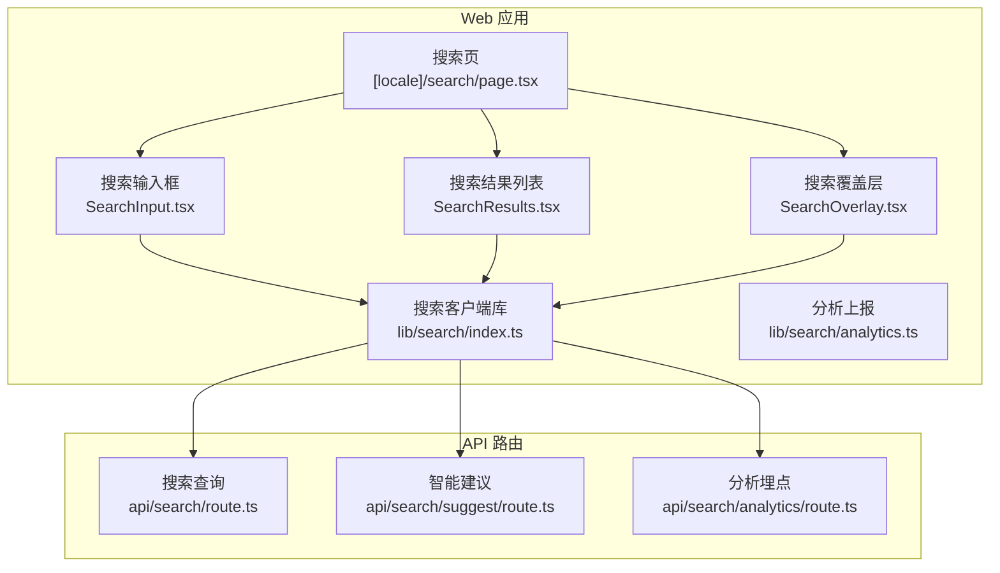
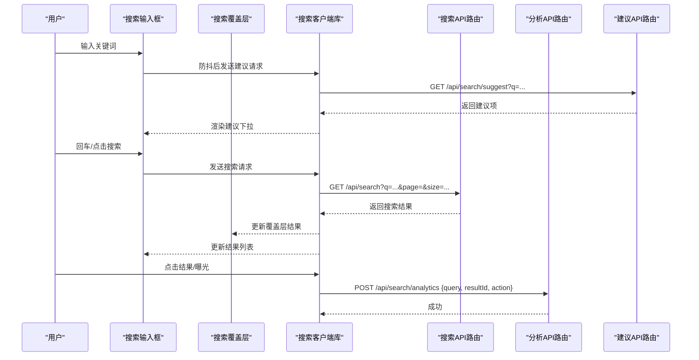
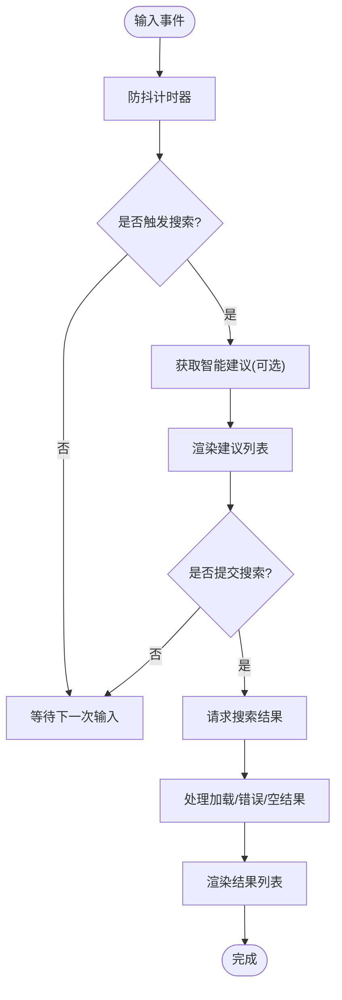
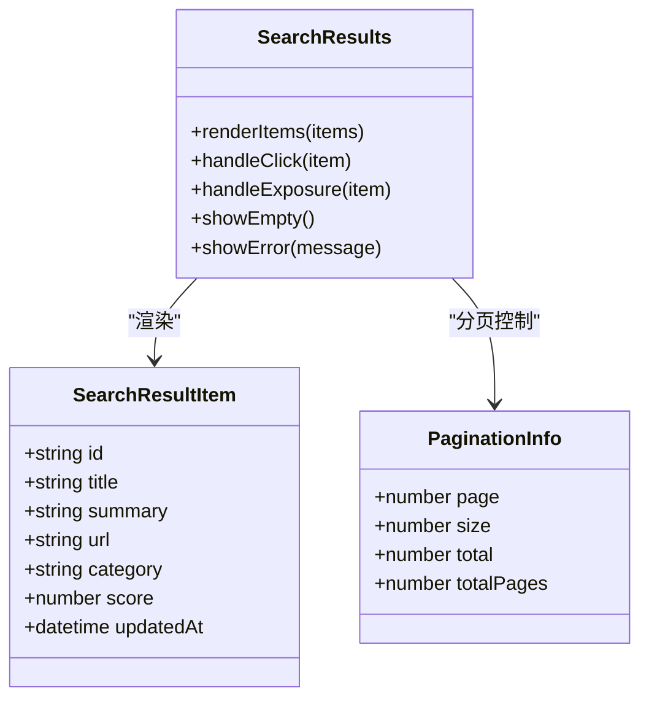
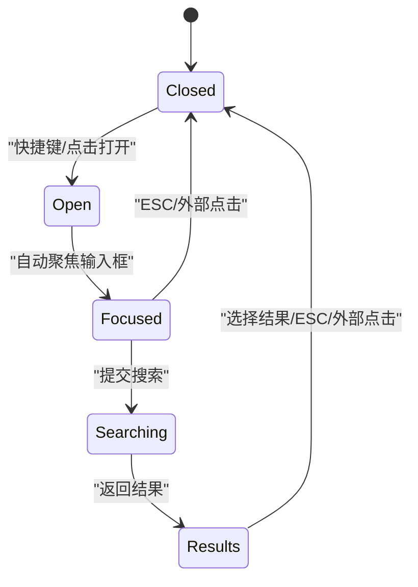
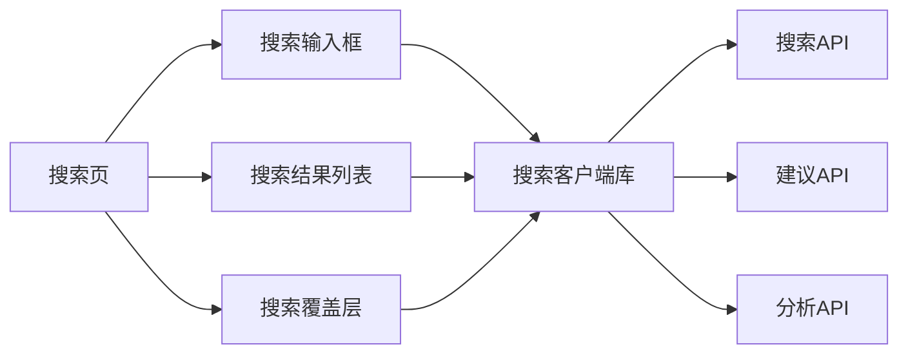

# 搜索组件

<cite>
**本文引用的文件**   
- [apps/web/src/app/[locale]/search/page.tsx](file://apps/web/src/app/[locale]/search/page.tsx)
- [apps/web/src/components/search/SearchInput.tsx](file://apps/web/src/components/search/SearchInput.tsx)
- [apps/web/src/components/search/SearchResults.tsx](file://apps/web/src/components/search/SearchResults.tsx)
- [apps/web/src/components/search/SearchOverlay.tsx](file://apps/web/src/components/search/SearchOverlay.tsx)
- [apps/web/src/lib/search/index.ts](file://apps/web/src/lib/search/index.ts)
- [apps/web/src/lib/search/analytics.ts](file://apps/web/src/lib/search/analytics.ts)
- [apps/web/src/app/api/search/route.ts](file://apps/web/src/app/api/search/route.ts)
- [apps/web/src/app/api/search/suggest/route.ts](file://apps/web/src/app/api/search/suggest/route.ts)
- [apps/web/src/app/api/search/analytics/route.ts](file://apps/web/src/app/api/search/analytics/route.ts)
</cite>

## 目录
1. [简介](#简介)
2. [项目结构](#项目结构)
3. [核心组件](#核心组件)
4. [架构总览](#架构总览)
5. [详细组件分析](#详细组件分析)
6. [依赖关系分析](#依赖关系分析)
7. [性能考虑](#性能考虑)
8. [故障排查指南](#故障排查指南)
9. [结论](#结论)
10. [附录](#附录)

## 简介
本文件面向“搜索组件”的完整实现与使用，覆盖搜索框、搜索结果列表、搜索覆盖层等前端组件，以及实时搜索、智能推荐、搜索分析与结果优化的技术实现。同时给出搜索算法集成、索引管理与性能优化策略，并提供自定义搜索界面与结果的配置指南，帮助开发者快速接入并扩展搜索能力。

## 项目结构
搜索功能在 Web 应用中由以下模块组成：
- 页面入口：搜索页路由与容器
- 前端组件：搜索输入、结果列表、覆盖层（弹窗/抽屉）
- 客户端库：搜索请求封装、分析上报、建议接口调用
- API 路由：搜索查询、智能建议、分析埋点

图表来源
- [apps/web/src/app/[locale]/search/page.tsx](file://apps/web/src/app/[locale]/search/page.tsx)
- [apps/web/src/components/search/SearchInput.tsx](file://apps/web/src/components/search/SearchInput.tsx)
- [apps/web/src/components/search/SearchResults.tsx](file://apps/web/src/components/search/SearchResults.tsx)
- [apps/web/src/components/search/SearchOverlay.tsx](file://apps/web/src/components/search/SearchOverlay.tsx)
- [apps/web/src/lib/search/index.ts](file://apps/web/src/lib/search/index.ts)
- [apps/web/src/app/api/search/route.ts](file://apps/web/src/app/api/search/route.ts)
- [apps/web/src/app/api/search/suggest/route.ts](file://apps/web/src/app/api/search/suggest/route.ts)
- [apps/web/src/app/api/search/analytics/route.ts](file://apps/web/src/app/api/search/analytics/route.ts)

章节来源
- [apps/web/src/app/[locale]/search/page.tsx](file://apps/web/src/app/[locale]/search/page.tsx)
- [apps/web/src/components/search/SearchInput.tsx](file://apps/web/src/components/search/SearchInput.tsx)
- [apps/web/src/components/search/SearchResults.tsx](file://apps/web/src/components/search/SearchResults.tsx)
- [apps/web/src/components/search/SearchOverlay.tsx](file://apps/web/src/components/search/SearchOverlay.tsx)
- [apps/web/src/lib/search/index.ts](file://apps/web/src/lib/search/index.ts)
- [apps/web/src/app/api/search/route.ts](file://apps/web/src/app/api/search/route.ts)
- [apps/web/src/app/api/search/suggest/route.ts](file://apps/web/src/app/api/search/suggest/route.ts)
- [apps/web/src/app/api/search/analytics/route.ts](file://apps/web/src/app/api/search/analytics/route.ts)

## 核心组件
- 搜索输入框（SearchInput）
  - 职责：接收用户输入、防抖触发搜索、展示加载状态、错误提示、清空与快捷键支持
  - 关键行为：输入变化节流/防抖、提交搜索、聚焦/失焦处理、无障碍标签
- 搜索结果列表（SearchResults）
  - 职责：渲染搜索结果、分页或滚动加载、高亮匹配片段、空态与错误态
  - 关键行为：结果去重、排序与过滤、点击跳转、曝光统计
- 搜索覆盖层（SearchOverlay）
  - 职责：全局搜索入口（键盘快捷键）、遮罩与焦点管理、ESC 关闭、移动端适配
  - 关键行为：打开/关闭、外部点击关闭、键盘导航、与搜索输入联动

章节来源
- [apps/web/src/components/search/SearchInput.tsx](file://apps/web/src/components/search/SearchInput.tsx)
- [apps/web/src/components/search/SearchResults.tsx](file://apps/web/src/components/search/SearchResults.tsx)
- [apps/web/src/components/search/SearchOverlay.tsx](file://apps/web/src/components/search/SearchOverlay.tsx)

## 架构总览
搜索流程包含“输入—建议—查询—结果—分析”的闭环：
- 用户在搜索输入框输入关键词
- 实时触发智能建议（可选）
- 发起搜索查询请求
- 渲染结果列表，支持交互与曝光统计
- 将搜索行为与分析数据上报至后端

图表来源
- [apps/web/src/components/search/SearchInput.tsx](file://apps/web/src/components/search/SearchInput.tsx)
- [apps/web/src/components/search/SearchOverlay.tsx](file://apps/web/src/components/search/SearchOverlay.tsx)
- [apps/web/src/lib/search/index.ts](file://apps/web/src/lib/search/index.ts)
- [apps/web/src/app/api/search/route.ts](file://apps/web/src/app/api/search/route.ts)
- [apps/web/src/app/api/search/suggest/route.ts](file://apps/web/src/app/api/search/suggest/route.ts)
- [apps/web/src/app/api/search/analytics/route.ts](file://apps/web/src/app/api/search/analytics/route.ts)

## 详细组件分析

### 搜索输入框（SearchInput）
- 设计要点
  - 防抖与节流：避免频繁请求，提升性能
  - 状态管理：加载中、错误、空结果、正常结果
  - 可访问性：ARIA 标签、键盘导航、屏幕阅读器友好
  - 国际化：文案与占位符多语言
- 交互流程
  - 输入变化 → 防抖 → 触发建议（可选）→ 等待响应 → 渲染建议
  - 回车/点击搜索 → 触发搜索 → 显示加载 → 渲染结果
  - 清空/ESC → 重置状态与焦点

图表来源
- [apps/web/src/components/search/SearchInput.tsx](file://apps/web/src/components/search/SearchInput.tsx)
- [apps/web/src/lib/search/index.ts](file://apps/web/src/lib/search/index.ts)

章节来源
- [apps/web/src/components/search/SearchInput.tsx](file://apps/web/src/components/search/SearchInput.tsx)
- [apps/web/src/lib/search/index.ts](file://apps/web/src/lib/search/index.ts)

### 搜索结果列表（SearchResults）
- 设计要点
  - 渲染策略：分页或无限滚动；虚拟列表优化长列表
  - 高亮匹配：对标题/摘要中的关键词进行高亮
  - 空态与错误态：无结果、网络错误、服务端异常
  - 交互：点击跳转、收藏、分享、曝光统计
- 数据结构
  - 结果项：ID、标题、摘要、URL、分类、时间戳、评分
  - 分页信息：当前页、总页数、总数、每页大小
- 性能优化
  - 结果缓存：相同查询短期缓存
  - 懒加载：图片与富媒体按需加载
  - 去重与排序：按相关性、时间、热度排序

图表来源
- [apps/web/src/components/search/SearchResults.tsx](file://apps/web/src/components/search/SearchResults.tsx)
- [apps/web/src/lib/search/index.ts](file://apps/web/src/lib/search/index.ts)

章节来源
- [apps/web/src/components/search/SearchResults.tsx](file://apps/web/src/components/search/SearchResults.tsx)
- [apps/web/src/lib/search/index.ts](file://apps/web/src/lib/search/index.ts)

### 搜索覆盖层（SearchOverlay）
- 设计要点
  - 全局入口：键盘快捷键（如 Ctrl/Cmd + K）打开
  - 焦点管理：打开时锁定焦点，关闭时恢复
  - 遮罩与层级：确保覆盖层在最上层，支持 ESC 关闭
  - 移动端适配：全屏覆盖、手势关闭
- 交互流程
  - 打开 → 自动聚焦输入框 → 显示建议/结果
  - 选择结果 → 跳转目标页面 → 关闭覆盖层
  - 外部点击/ESC → 关闭覆盖层

图表来源
- [apps/web/src/components/search/SearchOverlay.tsx](file://apps/web/src/components/search/SearchOverlay.tsx)
- [apps/web/src/lib/search/index.ts](file://apps/web/src/lib/search/index.ts)

章节来源
- [apps/web/src/components/search/SearchOverlay.tsx](file://apps/web/src/components/search/SearchOverlay.tsx)
- [apps/web/src/lib/search/index.ts](file://apps/web/src/lib/search/index.ts)

### 搜索客户端库（lib/search/index.ts）
- 职责
  - 统一封装搜索与建议接口调用
  - 参数校验与默认值设置
  - 错误处理与重试策略
  - 分析上报集成
- 关键方法
  - search(query, options)：执行搜索查询
  - suggest(query, options)：获取智能建议
  - reportAnalytics(event)：上报搜索分析事件
- 配置项
  - 超时、重试次数、缓存策略、分页大小、排序规则

章节来源
- [apps/web/src/lib/search/index.ts](file://apps/web/src/lib/search/index.ts)

### 搜索分析（lib/search/analytics.ts）
- 职责
  - 收集搜索行为：查询词、结果点击、曝光、耗时、错误
  - 聚合与上报：批量上报、去重、失败重试
  - 隐私合规：脱敏与匿名化处理
- 事件类型
  - search_query：搜索查询
  - search_result_click：结果点击
  - search_result_exposure：结果曝光
  - search_error：搜索错误

章节来源
- [apps/web/src/lib/search/analytics.ts](file://apps/web/src/lib/search/analytics.ts)

### API 路由
- 搜索查询（api/search/route.ts）
  - 输入验证、权限检查、查询构建、结果返回
  - 支持分页、排序、过滤、高亮片段
- 智能建议（api/search/suggest/route.ts）
  - 基于热词、历史查询、内容标题生成建议
  - 限制返回数量、去重、缓存
- 分析埋点（api/search/analytics/route.ts）
  - 接收分析事件、存储与聚合、异步处理

章节来源
- [apps/web/src/app/api/search/route.ts](file://apps/web/src/app/api/search/route.ts)
- [apps/web/src/app/api/search/suggest/route.ts](file://apps/web/src/app/api/search/suggest/route.ts)
- [apps/web/src/app/api/search/analytics/route.ts](file://apps/web/src/app/api/search/analytics/route.ts)

## 依赖关系分析
搜索组件之间的依赖关系如下：
- 搜索页依赖输入框、结果列表、覆盖层
- 输入框与结果列表依赖搜索客户端库
- 搜索客户端库依赖三个 API 路由
- 分析模块独立于 UI，但被客户端库调用

图表来源
- [apps/web/src/app/[locale]/search/page.tsx](file://apps/web/src/app/[locale]/search/page.tsx)
- [apps/web/src/components/search/SearchInput.tsx](file://apps/web/src/components/search/SearchInput.tsx)
- [apps/web/src/components/search/SearchResults.tsx](file://apps/web/src/components/search/SearchResults.tsx)
- [apps/web/src/components/search/SearchOverlay.tsx](file://apps/web/src/components/search/SearchOverlay.tsx)
- [apps/web/src/lib/search/index.ts](file://apps/web/src/lib/search/index.ts)
- [apps/web/src/app/api/search/route.ts](file://apps/web/src/app/api/search/route.ts)
- [apps/web/src/app/api/search/suggest/route.ts](file://apps/web/src/app/api/search/suggest/route.ts)
- [apps/web/src/app/api/search/analytics/route.ts](file://apps/web/src/app/api/search/analytics/route.ts)

章节来源
- [apps/web/src/app/[locale]/search/page.tsx](file://apps/web/src/app/[locale]/search/page.tsx)
- [apps/web/src/components/search/SearchInput.tsx](file://apps/web/src/components/search/SearchInput.tsx)
- [apps/web/src/components/search/SearchResults.tsx](file://apps/web/src/components/search/SearchResults.tsx)
- [apps/web/src/components/search/SearchOverlay.tsx](file://apps/web/src/components/search/SearchOverlay.tsx)
- [apps/web/src/lib/search/index.ts](file://apps/web/src/lib/search/index.ts)
- [apps/web/src/app/api/search/route.ts](file://apps/web/src/app/api/search/route.ts)
- [apps/web/src/app/api/search/suggest/route.ts](file://apps/web/src/app/api/search/suggest/route.ts)
- [apps/web/src/app/api/search/analytics/route.ts](file://apps/web/src/app/api/search/analytics/route.ts)

## 性能考虑
- 前端优化
  - 防抖与节流：减少不必要的请求
  - 结果缓存：相同查询短期缓存，避免重复请求
  - 虚拟列表：长列表只渲染可视区域
  - 懒加载：图片与富媒体按需加载
  - 骨架屏：提升感知性能
- 后端优化
  - 数据库索引：对常用字段建立索引
  - 查询优化：避免 N+1 查询，使用预加载
  - 缓存策略：Redis 缓存热点查询与建议
  - 分页与限制：限制返回数量，避免大结果集
- 网络优化
  - 压缩传输：启用 Gzip/Brotli
  - CDN 加速：静态资源与图片缓存
  - 连接复用：HTTP/2 或多路复用

## 故障排查指南
- 常见问题
  - 搜索无结果：检查查询词、过滤条件、索引状态
  - 建议不显示：检查建议接口、缓存、网络状态
  - 结果加载慢：检查数据库查询、索引、缓存命中率
  - 分析未上报：检查分析接口、网络、隐私设置
- 调试技巧
  - 浏览器开发者工具：查看网络请求与响应
  - 日志记录：前后端关键路径日志
  - 模拟数据：本地 Mock 接口进行测试
  - A/B 测试：对比不同算法与配置效果

## 结论
搜索组件通过清晰的前端组件划分、统一的客户端库封装与稳定的 API 路由，实现了完整的搜索体验。结合实时搜索、智能推荐、搜索分析与结果优化，提供了高性能、可扩展的搜索解决方案。开发者可根据业务需求自定义界面与结果展示，并通过配置项调整搜索行为与性能策略。

## 附录
- 配置示例
  - 搜索客户端库配置：超时、重试、缓存、分页、排序
  - 分析上报配置：事件类型、批量大小、上报频率
  - 界面定制：主题、布局、交互方式
- 最佳实践
  - 用户体验：即时反馈、错误提示、无障碍支持
  - 数据安全：输入验证、权限控制、敏感信息脱敏
  - 监控告警：性能指标、错误率、用户满意度