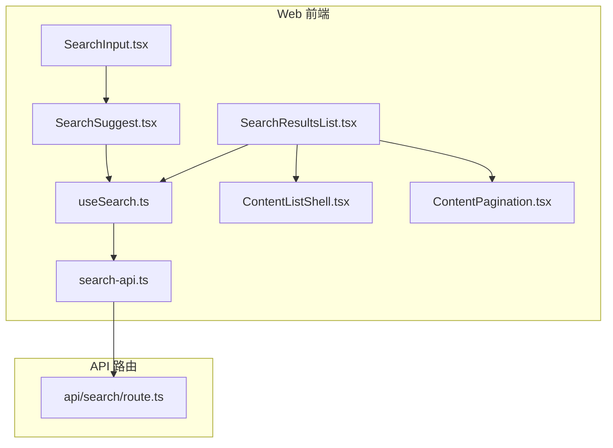
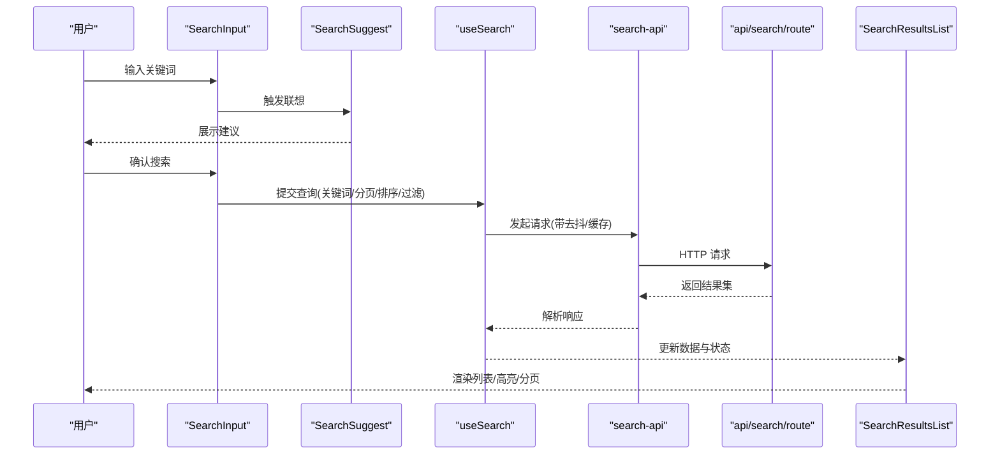
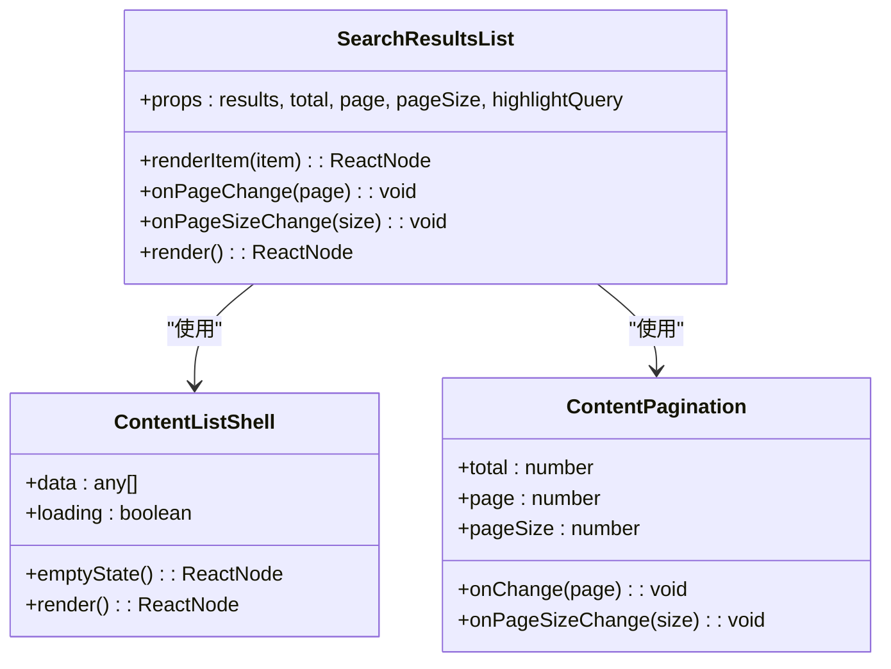
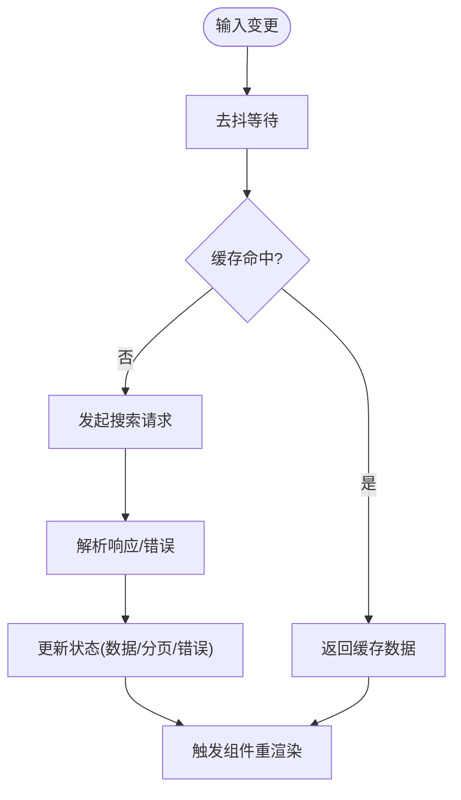
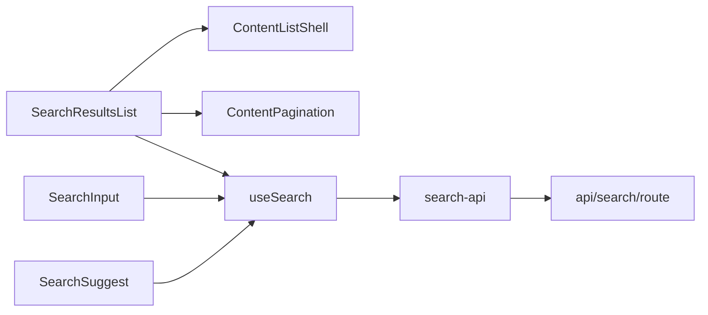

# 搜索结果列表组件

<cite>
**本文引用的文件**   
- [SearchResultsList.tsx](file://apps/web/src/components/search/SearchResultsList.tsx)
- [SearchInput.tsx](file://apps/web/src/components/search/SearchInput.tsx)
- [SearchSuggest.tsx](file://apps/web/src/components/search/SearchSuggest.tsx)
- [search-api.ts](file://apps/web/src/lib/search/search-api.ts)
- [useSearch.ts](file://apps/web/src/lib/search/useSearch.ts)
- [route.ts](file://apps/web/src/app/api/search/route.ts)
- [analytics.ts](file://apps/web/src/lib/analytics.ts)
- [ContentListShell.tsx](file://apps/web/src/components/content/ContentListShell.tsx)
- [ContentPagination.tsx](file://apps/web/src/components/content/ContentPagination.tsx)
</cite>

## 目录
1. [简介](#简介)
2. [项目结构](#项目结构)
3. [核心组件与职责](#核心组件与职责)
4. [架构总览](#架构总览)
5. [详细组件分析](#详细组件分析)
6. [依赖关系分析](#依赖关系分析)
7. [性能考量与优化](#性能考量与优化)
8. [故障排查指南](#故障排查指南)
9. [结论](#结论)
10. [附录：数据结构与接口约定](#附录数据结构与接口约定)

## 简介
本文件为“搜索结果列表组件”的完整技术文档，聚焦 SearchResultsList 组件的数据渲染、分页加载、结果高亮等能力；同时覆盖搜索数据模型、排序算法、过滤机制、虚拟滚动与懒加载策略，以及自定义结果项模板与样式定制指南。文档面向前端开发者与内容运营人员，既提供代码级实现细节，也给出可操作的配置与排错建议。

## 项目结构
搜索结果相关的前端能力集中在 web 应用的 components/search 与 lib/search 目录，后端搜索路由位于 apps/web/src/app/api/search/route.ts。整体采用“组件 + Hook + API 客户端 + 服务端路由”的分层组织方式，便于复用与扩展。

图表来源 
- [SearchInput.tsx](file://apps/web/src/components/search/SearchInput.tsx)
- [SearchSuggest.tsx](file://apps/web/src/components/search/SearchSuggest.tsx)
- [useSearch.ts](file://apps/web/src/lib/search/useSearch.ts)
- [search-api.ts](file://apps/web/src/lib/search/search-api.ts)
- [SearchResultsList.tsx](file://apps/web/src/components/search/SearchResultsList.tsx)
- [ContentListShell.tsx](file://apps/web/src/components/content/ContentListShell.tsx)
- [ContentPagination.tsx](file://apps/web/src/components/content/ContentPagination.tsx)
- [route.ts](file://apps/web/src/app/api/search/route.ts)

章节来源
- [SearchResultsList.tsx](file://apps/web/src/components/search/SearchResultsList.tsx)
- [useSearch.ts](file://apps/web/src/lib/search/useSearch.ts)
- [search-api.ts](file://apps/web/src/lib/search/search-api.ts)
- [route.ts](file://apps/web/src/app/api/search/route.ts)

## 核心组件与职责
- SearchResultsList：负责渲染搜索结果列表，处理分页、高亮、空态与错误态展示，支持自定义结果项模板。
- useSearch：封装搜索状态（关键词、分页、排序、过滤）、请求去抖、缓存与重试逻辑，向上暴露统一查询接口。
- search-api：对后端搜索 API 进行封装，统一参数映射、错误处理与响应解析。
- SearchInput / SearchSuggest：输入与联想建议，驱动搜索流程并上报埋点。
- ContentListShell / ContentPagination：通用列表容器与分页控件，被 SearchResultsList 复用。

章节来源
- [SearchResultsList.tsx](file://apps/web/src/components/search/SearchResultsList.tsx)
- [useSearch.ts](file://apps/web/src/lib/search/useSearch.ts)
- [search-api.ts](file://apps/web/src/lib/search/search-api.ts)
- [SearchInput.tsx](file://apps/web/src/components/search/SearchInput.tsx)
- [SearchSuggest.tsx](file://apps/web/src/components/search/SearchSuggest.tsx)
- [ContentListShell.tsx](file://apps/web/src/components/content/ContentListShell.tsx)
- [ContentPagination.tsx](file://apps/web/src/components/content/ContentPagination.tsx)

## 架构总览
搜索流程从用户输入开始，经联想建议与输入校验后触发 useSearch 查询，search-api 调用后端路由获取数据，SearchResultsList 渲染结果并支持分页与高亮。

图表来源 
- [SearchInput.tsx](file://apps/web/src/components/search/SearchInput.tsx)
- [SearchSuggest.tsx](file://apps/web/src/components/search/SearchSuggest.tsx)
- [useSearch.ts](file://apps/web/src/lib/search/useSearch.ts)
- [search-api.ts](file://apps/web/src/lib/search/search-api.ts)
- [route.ts](file://apps/web/src/app/api/search/route.ts)
- [SearchResultsList.tsx](file://apps/web/src/components/search/SearchResultsList.tsx)

## 详细组件分析

### SearchResultsList 组件
- 数据渲染
  - 接收来自 useSearch 的结果数组与元信息（总数、页码、每页大小），通过 ContentListShell 渲染骨架与空态。
  - 支持按命中片段或摘要进行文本高亮，避免全量重绘。
- 分页加载
  - 基于 ContentPagination 控制页码切换与每页条数调整，结合 useSearch 的状态管理实现无刷新翻页。
- 结果高亮
  - 根据后端返回的高亮片段或本地匹配规则，对标题、摘要中的关键词进行包裹与样式注入。
- 自定义模板
  - 提供 renderItem 插槽/回调，允许外部传入结果项渲染函数，以适配不同业务类型（文章、案例、产品等）。
- 性能优化
  - 列表项按需渲染，配合虚拟滚动（当条目较多时）减少 DOM 节点数量。
  - 图片与媒体资源懒加载，首屏仅加载可见区域内容。

图表来源 
- [SearchResultsList.tsx](file://apps/web/src/components/search/SearchResultsList.tsx)
- [ContentListShell.tsx](file://apps/web/src/components/content/ContentListShell.tsx)
- [ContentPagination.tsx](file://apps/web/src/components/content/ContentPagination.tsx)

章节来源
- [SearchResultsList.tsx](file://apps/web/src/components/search/SearchResultsList.tsx)
- [ContentListShell.tsx](file://apps/web/src/components/content/ContentListShell.tsx)
- [ContentPagination.tsx](file://apps/web/src/components/content/ContentPagination.tsx)

### useSearch Hook
- 状态管理
  - 维护关键词、页码、每页大小、排序字段与方向、过滤条件、是否加载中、错误信息等。
- 请求策略
  - 去抖：输入变化后延迟触发，降低频繁请求压力。
  - 缓存：相同查询参数的结果短期缓存，提升二次访问速度。
  - 重试：网络异常时自动重试有限次数，保障稳定性。
- 数据流
  - 将原始响应转换为统一的数据结构，供 SearchResultsList 消费。

图表来源 
- [useSearch.ts](file://apps/web/src/lib/search/useSearch.ts)
- [search-api.ts](file://apps/web/src/lib/search/search-api.ts)

章节来源
- [useSearch.ts](file://apps/web/src/lib/search/useSearch.ts)
- [search-api.ts](file://apps/web/src/lib/search/search-api.ts)

### search-api 客户端
- 参数映射：将前端查询对象转换为后端期望的查询字符串。
- 错误处理：统一捕获网络错误与业务错误，抛出标准化异常。
- 响应解析：提取数据、分页元信息与高亮片段，保证类型安全。

章节来源
- [search-api.ts](file://apps/web/src/lib/search/search-api.ts)

### 后端搜索路由
- 接收前端查询参数，执行检索、排序、过滤与分页，返回结构化结果。
- 可选地返回高亮片段与统计信息，用于前端展示与分析。

章节来源
- [route.ts](file://apps/web/src/app/api/search/route.ts)

## 依赖关系分析
- 组件层：SearchResultsList 依赖 ContentListShell 与 ContentPagination，解耦了列表容器与分页交互。
- 状态层：useSearch 聚合搜索状态与副作用，屏蔽底层 API 细节。
- 数据层：search-api 与后端 route 形成契约，确保前后端数据结构一致。
- 埋点：SearchInput/Suggest 在关键交互处上报埋点，便于分析搜索行为。

图表来源 
- [SearchResultsList.tsx](file://apps/web/src/components/search/SearchResultsList.tsx)
- [ContentListShell.tsx](file://apps/web/src/components/content/ContentListShell.tsx)
- [ContentPagination.tsx](file://apps/web/src/components/content/ContentPagination.tsx)
- [useSearch.ts](file://apps/web/src/lib/search/useSearch.ts)
- [search-api.ts](file://apps/web/src/lib/search/search-api.ts)
- [route.ts](file://apps/web/src/app/api/search/route.ts)
- [SearchInput.tsx](file://apps/web/src/components/search/SearchInput.tsx)
- [SearchSuggest.tsx](file://apps/web/src/components/search/SearchSuggest.tsx)

章节来源
- [SearchResultsList.tsx](file://apps/web/src/components/search/SearchResultsList.tsx)
- [useSearch.ts](file://apps/web/src/lib/search/useSearch.ts)
- [search-api.ts](file://apps/web/src/lib/search/search-api.ts)
- [route.ts](file://apps/web/src/app/api/search/route.ts)

## 性能考量与优化
- 虚拟滚动
  - 当结果集较大时启用虚拟滚动，仅渲染可视区域内的条目，显著降低 DOM 节点数量与重排开销。
  - 建议设置合理的行高估算值与缓冲区高度，避免频繁计算导致的抖动。
- 懒加载策略
  - 图片与富媒体采用懒加载，进入视口再加载，减少首屏带宽占用。
  - 详情内容按需展开，避免一次性渲染大量复杂节点。
- 请求优化
  - 输入去抖（建议 200-400ms），避免高频重复请求。
  - 结果缓存（相同查询短时间复用），提升二次访问体验。
  - 分页拉取而非全量加载，限制单次返回条数（如 20-50）。
- 渲染优化
  - 列表项使用稳定 key，避免不必要的重渲染。
  - 高亮文本增量更新，避免整表重绘。
  - 使用 memo/React.memo 包裹结果项组件，减少子树更新。
- 监控与调优
  - 结合埋点记录搜索耗时、失败率与点击热区，定位瓶颈。
  - 通过浏览器性能面板观察长任务与布局抖动，针对性优化。

[本节为通用性能指导，不直接分析具体文件]

## 故障排查指南
- 搜索无结果
  - 检查关键词是否为空或包含非法字符。
  - 核对后端路由是否返回空数据集或错误码。
  - 查看 useSearch 的错误状态与日志输出。
- 分页异常
  - 确认 page/pageSize 参数是否正确传递。
  - 验证后端分页边界处理（越界、负数）。
- 高亮错位
  - 检查高亮片段索引与原文长度是否一致。
  - 确认 HTML 转义与拼接顺序，避免标签破坏。
- 性能卡顿
  - 关闭虚拟滚动对比测试，定位是否由渲染引起。
  - 检查图片懒加载是否阻塞主线程。
  - 使用性能面板分析长任务与内存增长。

章节来源
- [useSearch.ts](file://apps/web/src/lib/search/useSearch.ts)
- [search-api.ts](file://apps/web/src/lib/search/search-api.ts)
- [route.ts](file://apps/web/src/app/api/search/route.ts)

## 结论
SearchResultsList 组件通过清晰的职责划分与稳定的数据流，实现了高效、可扩展的搜索结果展示能力。借助 useSearch 的状态管理与 search-api 的封装，前端能够以最小成本对接后端搜索服务。配合虚拟滚动、懒加载与缓存策略，可在大数据量场景下保持流畅体验。通过自定义结果项模板与样式定制，可灵活适配多类业务内容。

[本节为总结性内容，不直接分析具体文件]

## 附录：数据结构与接口约定
- 搜索请求参数
  - keyword: string，搜索关键词
  - page: number，页码（从 1 开始）
  - pageSize: number，每页条数
  - sortBy: string，排序字段
  - sortOrder: asc | desc，排序方向
  - filters: object，过滤条件（按业务定义）
- 搜索结果项
  - id: string | number，唯一标识
  - title: string，标题
  - summary: string，摘要
  - url: string，跳转链接
  - type: string，内容类型（文章/案例/产品等）
  - createdAt: string，创建时间
  - score?: number，相关性得分（可选）
  - highlights?: { field: string; fragments: string[] }[]，高亮片段（可选）
- 分页元信息
  - total: number，总条数
  - page: number，当前页
  - pageSize: number，每页条数
  - totalPages: number，总页数
- 错误结构
  - code: string，错误码
  - message: string，错误消息
  - details?: object，附加信息（可选）

章节来源
- [search-api.ts](file://apps/web/src/lib/search/search-api.ts)
- [route.ts](file://apps/web/src/app/api/search/route.ts)
- [analytics.ts](file://apps/web/src/lib/analytics.ts)