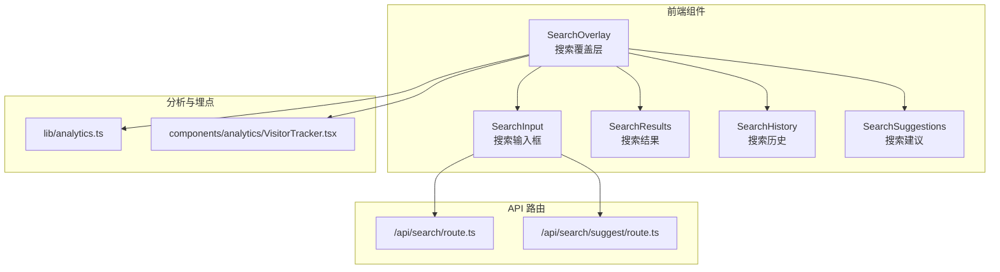
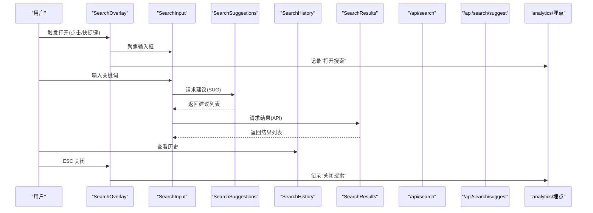
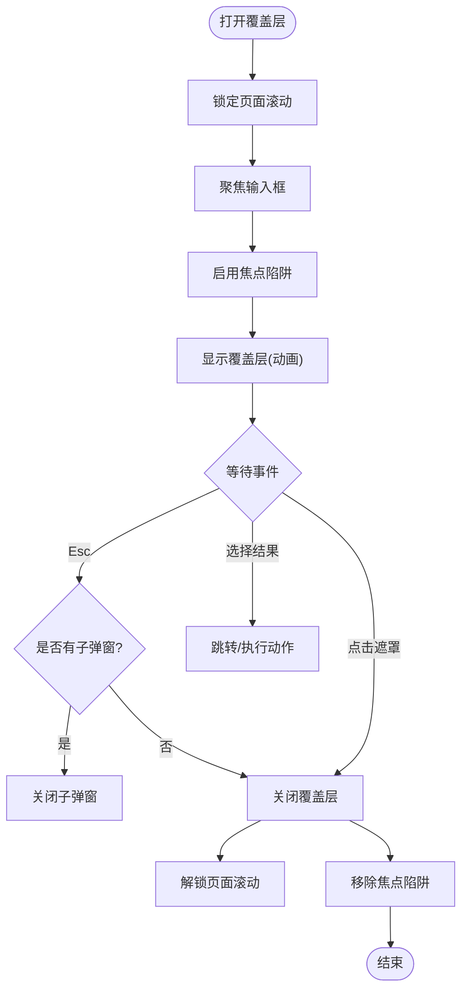
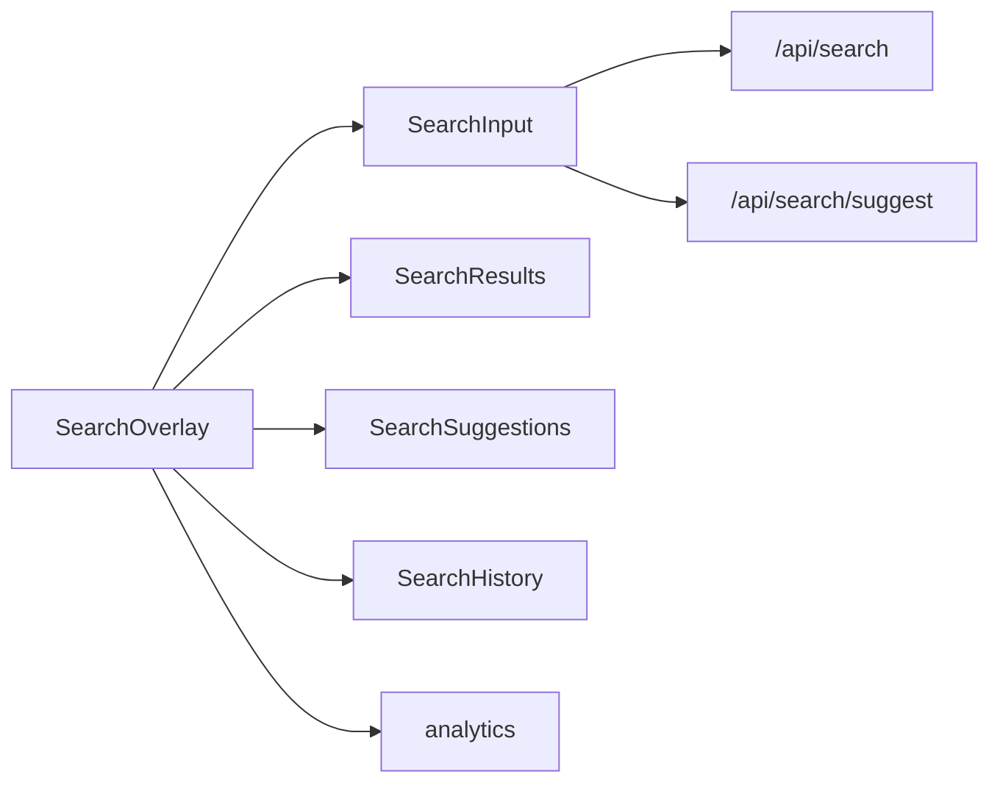

# 搜索覆盖层组件

<cite>
**本文档引用的文件**   
- [apps/web/src/components/search/SearchOverlay.tsx](file://apps/web/src/components/search/SearchOverlay.tsx)
- [apps/web/src/components/search/SearchInput.tsx](file://apps/web/src/components/search/SearchInput.tsx)
- [apps/web/src/components/search/SearchResults.tsx](file://apps/web/src/components/search/SearchResults.tsx)
- [apps/web/src/components/search/SearchHistory.tsx](file://apps/web/src/components/search/SearchHistory.tsx)
- [apps/web/src/components/search/SearchSuggestions.tsx](file://apps/web/src/components/search/SearchSuggestions.tsx)
- [apps/web/src/app/api/search/route.ts](file://apps/web/src/app/api/search/route.ts)
- [apps/web/src/app/api/search/suggest/route.ts](file://apps/web/src/app/api/search/suggest/route.ts)
- [apps/web/src/lib/analytics.ts](file://apps/web/src/lib/analytics.ts)
- [apps/web/src/components/analytics/VisitorTracker.tsx](file://apps/web/src/components/analytics/VisitorTracker.tsx)
</cite>

## 目录
1. [简介](#简介)
2. [项目结构](#项目结构)
3. [核心组件](#核心组件)
4. [架构总览](#架构总览)
5. [详细组件分析](#详细组件分析)
6. [依赖关系分析](#依赖关系分析)
7. [性能考虑](#性能考虑)
8. [故障排查指南](#故障排查指南)
9. [结论](#结论)
10. [附录](#附录)

## 简介
本文件面向“搜索覆盖层组件”（SearchOverlay），提供从交互行为、焦点管理、键盘事件处理到与搜索输入框集成、动画过渡、响应式适配，以及搜索历史、热门搜索推荐和用户行为追踪的完整技术文档。目标是帮助开发者快速理解并正确扩展该组件，同时为产品与测试人员提供清晰的验收要点。

## 项目结构
搜索相关的前端实现集中在 web 应用的 components/search 目录，API 路由位于 app/api/search 下，分析与埋点逻辑在 lib/analytics 与 components/analytics 中。整体采用“覆盖层 + 模态框 + 受控输入 + 结果面板 + 建议列表 + 历史记录”的组合模式。

图表来源
- [apps/web/src/components/search/SearchOverlay.tsx](file://apps/web/src/components/search/SearchOverlay.tsx)
- [apps/web/src/components/search/SearchInput.tsx](file://apps/web/src/components/search/SearchInput.tsx)
- [apps/web/src/components/search/SearchResults.tsx](file://apps/web/src/components/search/SearchResults.tsx)
- [apps/web/src/components/search/SearchHistory.tsx](file://apps/web/src/components/search/SearchHistory.tsx)
- [apps/web/src/components/search/SearchSuggestions.tsx](file://apps/web/src/components/search/SearchSuggestions.tsx)
- [apps/web/src/app/api/search/route.ts](file://apps/web/src/app/api/search/route.ts)
- [apps/web/src/app/api/search/suggest/route.ts](file://apps/web/src/app/api/search/suggest/route.ts)
- [apps/web/src/lib/analytics.ts](file://apps/web/src/lib/analytics.ts)
- [apps/web/src/components/analytics/VisitorTracker.tsx](file://apps/web/src/components/analytics/VisitorTracker.tsx)

章节来源
- [apps/web/src/components/search/SearchOverlay.tsx](file://apps/web/src/components/search/SearchOverlay.tsx)
- [apps/web/src/app/api/search/route.ts](file://apps/web/src/app/api/search/route.ts)
- [apps/web/src/app/api/search/suggest/route.ts](file://apps/web/src/app/api/search/suggest/route.ts)
- [apps/web/src/lib/analytics.ts](file://apps/web/src/lib/analytics.ts)
- [apps/web/src/components/analytics/VisitorTracker.tsx](file://apps/web/src/components/analytics/VisitorTracker.tsx)

## 核心组件
- SearchOverlay：全屏覆盖层容器，负责模态框行为、焦点管理、ESC 关闭、遮罩点击关闭、动画过渡与响应式布局。
- SearchInput：受控输入框，支持防抖查询、快捷键提示、无障碍标签。
- SearchResults：搜索结果列表，支持分页或虚拟滚动、空状态、错误状态。
- SearchHistory：搜索历史展示与清理，支持本地存储持久化。
- SearchSuggestions：热门搜索与建议词下拉，支持键盘导航与选择。

章节来源
- [apps/web/src/components/search/SearchOverlay.tsx](file://apps/web/src/components/search/SearchOverlay.tsx)
- [apps/web/src/components/search/SearchInput.tsx](file://apps/web/src/components/search/SearchInput.tsx)
- [apps/web/src/components/search/SearchResults.tsx](file://apps/web/src/components/search/SearchResults.tsx)
- [apps/web/src/components/search/SearchHistory.tsx](file://apps/web/src/components/search/SearchHistory.tsx)
- [apps/web/src/components/search/SearchSuggestions.tsx](file://apps/web/src/components/search/SearchSuggestions.tsx)

## 架构总览
SearchOverlay 作为入口，协调输入、建议、历史与结果面板，并通过 API 路由获取数据；埋点模块记录用户行为（打开、输入、选择、关闭等）。

图表来源
- [apps/web/src/components/search/SearchOverlay.tsx](file://apps/web/src/components/search/SearchOverlay.tsx)
- [apps/web/src/components/search/SearchInput.tsx](file://apps/web/src/components/search/SearchInput.tsx)
- [apps/web/src/components/search/SearchSuggestions.tsx](file://apps/web/src/components/search/SearchSuggestions.tsx)
- [apps/web/src/components/search/SearchHistory.tsx](file://apps/web/src/components/search/SearchHistory.tsx)
- [apps/web/src/components/search/SearchResults.tsx](file://apps/web/src/components/search/SearchResults.tsx)
- [apps/web/src/app/api/search/route.ts](file://apps/web/src/app/api/search/route.ts)
- [apps/web/src/app/api/search/suggest/route.ts](file://apps/web/src/app/api/search/suggest/route.ts)
- [apps/web/src/lib/analytics.ts](file://apps/web/src/lib/analytics.ts)

## 详细组件分析

### SearchOverlay：全屏覆盖层与模态框行为
- 模态框行为
  - 打开时锁定页面滚动，阻止背景交互；关闭时恢复。
  - 遮罩区域点击可关闭覆盖层。
  - 首次渲染自动将焦点移入输入框，确保键盘操作可用。
- 焦点管理
  - 使用焦点陷阱，限制 Tab 在覆盖层内循环移动。
  - 支持 Esc 键关闭；当存在子级弹窗（如详情抽屉）时，Esc 优先关闭子级。
- 动画过渡
  - 进入/退出使用淡入淡出与缩放过渡，避免抖动。
  - 移动端根据视口高度调整内容区域滚动区域。
- 响应式适配
  - 小屏全高显示，内容区可滚动；大屏居中卡片式布局。
  - 建议与结果面板在小屏下自适应宽度与行高。

图表来源
- [apps/web/src/components/search/SearchOverlay.tsx](file://apps/web/src/components/search/SearchOverlay.tsx)

章节来源
- [apps/web/src/components/search/SearchOverlay.tsx](file://apps/web/src/components/search/SearchOverlay.tsx)

### SearchInput：受控输入与快捷键
- 受控输入：value/onChange 由父组件控制，支持清空按钮与占位符文案。
- 防抖查询：输入变化后延迟发起建议与结果请求，减少无效请求。
- 快捷键提示：显示常用快捷键（如 Esc 关闭、Enter 搜索）。
- 无障碍：aria-label、role 与键盘导航支持。

章节来源
- [apps/web/src/components/search/SearchInput.tsx](file://apps/web/src/components/search/SearchInput.tsx)

### SearchSuggestions：热门搜索与建议
- 数据来源：/api/search/suggest 接口返回热门词与实时建议。
- 交互：键盘上下切换、回车选择；鼠标悬停高亮。
- 去重与缓存：对重复词进行去重，短期缓存最近建议提升体验。

章节来源
- [apps/web/src/components/search/SearchSuggestions.tsx](file://apps/web/src/components/search/SearchSuggestions.tsx)
- [apps/web/src/app/api/search/suggest/route.ts](file://apps/web/src/app/api/search/suggest/route.ts)

### SearchHistory：搜索历史
- 存储策略：优先 localStorage，降级到内存；支持最大条数限制。
- 功能：展示最近搜索、单条删除、清空全部。
- 隐私：敏感信息脱敏后再落盘（如令牌片段）。

章节来源
- [apps/web/src/components/search/SearchHistory.tsx](file://apps/web/src/components/search/SearchHistory.tsx)

### SearchResults：搜索结果
- 数据加载：按关键词请求 /api/search，支持分页或增量加载。
- 状态处理：加载中骨架屏、空结果引导、错误重试。
- 交互：点击条目跳转或展开详情；支持键盘导航与屏幕阅读器。

章节来源
- [apps/web/src/components/search/SearchResults.tsx](file://apps/web/src/components/search/SearchResults.tsx)
- [apps/web/src/app/api/search/route.ts](file://apps/web/src/app/api/search/route.ts)

### 与搜索框组件的集成方式
- SearchOverlay 通过 props 注入 SearchInput，统一控制 value、onChange、onSubmit。
- 建议与历史在 Overlay 内以面板形式呈现，避免跨层级状态同步问题。
- 所有用户行为（打开、输入、选择、关闭）通过 analytics 上报。

章节来源
- [apps/web/src/components/search/SearchOverlay.tsx](file://apps/web/src/components/search/SearchOverlay.tsx)
- [apps/web/src/components/search/SearchInput.tsx](file://apps/web/src/components/search/SearchInput.tsx)
- [apps/web/src/lib/analytics.ts](file://apps/web/src/lib/analytics.ts)

### 动画过渡效果与响应式适配
- 动画：进入/退出使用透明度与变换组合，保证流畅且无闪烁。
- 响应式：基于断点切换布局（卡片 vs 全宽），移动端优化触控区域与滚动区域。

章节来源
- [apps/web/src/components/search/SearchOverlay.tsx](file://apps/web/src/components/search/SearchOverlay.tsx)

### 用户行为追踪
- 埋点事件：search_open、search_input、search_select、search_close、search_history_click 等。
- 数据字段：query、result_count、suggestion_count、duration、device_type 等。
- 工具：封装 analytics.track 与 VisitorTracker 组件，统一上报与过滤。

章节来源
- [apps/web/src/lib/analytics.ts](file://apps/web/src/lib/analytics.ts)
- [apps/web/src/components/analytics/VisitorTracker.tsx](file://apps/web/src/components/analytics/VisitorTracker.tsx)

## 依赖关系分析
- 组件耦合
  - SearchOverlay 强依赖 SearchInput、SearchResults、SearchSuggestions、SearchHistory。
  - 各子组件职责单一，便于独立测试与替换。
- 外部依赖
  - API 路由：/api/search 与 /api/search/suggest。
  - 埋点库：lib/analytics 与 VisitorTracker。
- 潜在循环依赖
  - 当前设计避免子组件反向引用 Overlay，降低循环风险。

图表来源
- [apps/web/src/components/search/SearchOverlay.tsx](file://apps/web/src/components/search/SearchOverlay.tsx)
- [apps/web/src/components/search/SearchInput.tsx](file://apps/web/src/components/search/SearchInput.tsx)
- [apps/web/src/components/search/SearchResults.tsx](file://apps/web/src/components/search/SearchResults.tsx)
- [apps/web/src/components/search/SearchSuggestions.tsx](file://apps/web/src/components/search/SearchSuggestions.tsx)
- [apps/web/src/components/search/SearchHistory.tsx](file://apps/web/src/components/search/SearchHistory.tsx)
- [apps/web/src/app/api/search/route.ts](file://apps/web/src/app/api/search/route.ts)
- [apps/web/src/app/api/search/suggest/route.ts](file://apps/web/src/app/api/search/suggest/route.ts)
- [apps/web/src/lib/analytics.ts](file://apps/web/src/lib/analytics.ts)

章节来源
- [apps/web/src/components/search/SearchOverlay.tsx](file://apps/web/src/components/search/SearchOverlay.tsx)
- [apps/web/src/app/api/search/route.ts](file://apps/web/src/app/api/search/route.ts)
- [apps/web/src/app/api/search/suggest/route.ts](file://apps/web/src/app/api/search/suggest/route.ts)
- [apps/web/src/lib/analytics.ts](file://apps/web/src/lib/analytics.ts)

## 性能考虑
- 请求优化
  - 输入防抖与节流，避免频繁请求。
  - 建议与结果请求合并策略，取消过期请求（AbortController）。
- 渲染优化
  - 长列表虚拟化或分页加载，减少 DOM 节点数量。
  - 骨架屏替代白屏，提升感知速度。
- 资源与体积
  - 按需加载建议与历史模块，首屏最小化。
  - 图片与媒体懒加载。
- 可访问性
  - 合理的 aria 属性与键盘导航，减少不必要的重排重绘。

[本节为通用指导，不直接分析具体文件]

## 故障排查指南
- 无法关闭覆盖层
  - 检查 ESC 事件监听是否被其他组件拦截。
  - 确认焦点陷阱未导致 Tab 循环异常。
- 输入无响应或重复请求
  - 校验受控输入 state 更新是否正确。
  - 检查防抖时间设置与请求取消逻辑。
- 建议与历史为空
  - 确认 API 路由返回结构与字段命名一致。
  - 检查 localStorage 权限与存储空间。
- 埋点缺失
  - 验证 analytics.track 调用时机与参数。
  - 检查网络请求是否被拦截或失败。

章节来源
- [apps/web/src/components/search/SearchOverlay.tsx](file://apps/web/src/components/search/SearchOverlay.tsx)
- [apps/web/src/components/search/SearchInput.tsx](file://apps/web/src/components/search/SearchInput.tsx)
- [apps/web/src/components/search/SearchSuggestions.tsx](file://apps/web/src/components/search/SearchSuggestions.tsx)
- [apps/web/src/components/search/SearchHistory.tsx](file://apps/web/src/components/search/SearchHistory.tsx)
- [apps/web/src/components/search/SearchResults.tsx](file://apps/web/src/components/search/SearchResults.tsx)
- [apps/web/src/app/api/search/route.ts](file://apps/web/src/app/api/search/route.ts)
- [apps/web/src/app/api/search/suggest/route.ts](file://apps/web/src/app/api/search/suggest/route.ts)
- [apps/web/src/lib/analytics.ts](file://apps/web/src/lib/analytics.ts)

## 结论
SearchOverlay 通过统一的覆盖层与模态框行为，结合受控输入、建议与历史面板，提供了完整的搜索体验。其焦点管理、ESC 关闭、动画过渡与响应式适配保证了良好的可用性与可访问性。配合 API 路由与埋点体系，可实现高效、可观测的搜索流程。建议在后续迭代中继续优化请求合并、列表虚拟化与多语言/主题扩展。

[本节为总结性内容，不直接分析具体文件]

## 附录
- 关键交互要点
  - 打开：点击触发或快捷键（如 Ctrl/Cmd + K）。
  - 输入：防抖查询，建议优先展示。
  - 选择：回车或点击跳转到目标页面。
  - 关闭：Esc 或点击遮罩。
- 可访问性清单
  - 正确的 role、aria-* 属性。
  - 键盘导航与焦点顺序合理。
  - 屏幕阅读器朗读文本清晰。
- 测试建议
  - 单元测试：输入变更、防抖、ESC 关闭、焦点陷阱。
  - 集成测试：API 成功/失败、空结果、错误重试。
  - 用户体验：动画流畅度、移动端触控体验。

[本节为补充说明，不直接分析具体文件]