# 聊天组件

<cite>
**本文引用的文件**   
- [ChatMessenger.tsx](file://apps/admin/src/features/chat/ChatMessenger.tsx)
- [useChatSocket.ts](file://apps/admin/src/features/chat/useChatSocket.ts)
- [api.ts](file://apps/admin/src/features/chat/api.ts)
- [types.ts](file://apps/admin/src/features/chat/types.ts)
- [ChatPresenceProvider.tsx](file://apps/admin/src/features/chat/ChatPresenceProvider.tsx)
- [ChatWidget.tsx](file://apps/web/src/components/chat/ChatWidget.tsx)
- [ChatMarkdown.tsx](file://apps/web/src/components/chat/ChatMarkdown.tsx)
- [EmojiPicker.tsx](file://apps/web/src/components/chat/EmojiPicker.tsx)
- [useVisitorChat.ts](file://apps/web/src/features/chat/useVisitorChat.ts)
- [presence.ts](file://apps/web/src/features/chat/presence.ts)
- [chat.gateway.ts](file://apps/api/src/support/chat.gateway.ts)
- [chat-room.controller.ts](file://apps/api/src/support/chat-room.controller.ts)
- [chat-room.service.ts](file://apps/api/src/support/chat-room.service.ts)
- [support.module.ts](file://apps/api/src/support/support.module.ts)
- [seed-chat-mock.ts](file://apps/api/scripts/seed-chat-mock.ts)
</cite>

## 目录
1. [简介](#简介)
2. [项目结构](#项目结构)
3. [核心组件](#核心组件)
4. [架构总览](#架构总览)
5. [详细组件分析](#详细组件分析)
6. [依赖关系分析](#依赖关系分析)
7. [性能考量](#性能考量)
8. [故障排查指南](#故障排查指南)
9. [结论](#结论)
10. [附录](#附录)

## 简介
本文件为“聊天组件”的全面技术文档，覆盖以下能力与主题：
- 聊天窗口（Admin 端与管理后台集成、Web 端访客小部件）
- Markdown 消息渲染
- 表情选择器
- WebSocket 实时通信（NestJS Gateway）
- 消息状态管理（连接、发送、接收、重连、错误处理）
- 文件上传与预览（媒体服务与存储）
- 界面自定义样式、主题配置与国际化支持
- 与后端聊天服务的集成指南（认证、房间、消息、存在性）

## 项目结构
聊天功能横跨三个子应用：
- Admin 管理端：提供完整的聊天工作台（会话列表、消息面板、WebSocket 客户端、API 调用）
- Web 前端：面向访客的轻量聊天小部件（Markdown 渲染、表情选择、最小化交互）
- API 后端：基于 NestJS 的 WebSocket Gateway、REST 控制器与服务层，负责房间生命周期、消息持久化、存在性广播与媒体上传

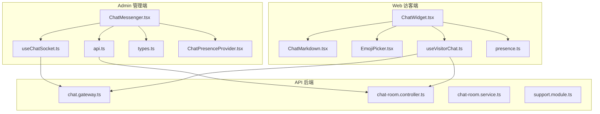

**图表来源** 
- [ChatMessenger.tsx](file://apps/admin/src/features/chat/ChatMessenger.tsx)
- [useChatSocket.ts](file://apps/admin/src/features/chat/useChatSocket.ts)
- [api.ts](file://apps/admin/src/features/chat/api.ts)
- [types.ts](file://apps/admin/src/features/chat/types.ts)
- [ChatPresenceProvider.tsx](file://apps/admin/src/features/chat/ChatPresenceProvider.tsx)
- [ChatWidget.tsx](file://apps/web/src/components/chat/ChatWidget.tsx)
- [ChatMarkdown.tsx](file://apps/web/src/components/chat/ChatMarkdown.tsx)
- [EmojiPicker.tsx](file://apps/web/src/components/chat/EmojiPicker.tsx)
- [useVisitorChat.ts](file://apps/web/src/features/chat/useVisitorChat.ts)
- [presence.ts](file://apps/web/src/features/chat/presence.ts)
- [chat.gateway.ts](file://apps/api/src/support/chat.gateway.ts)
- [chat-room.controller.ts](file://apps/api/src/support/chat-room.controller.ts)
- [chat-room.service.ts](file://apps/api/src/support/chat-room.service.ts)
- [support.module.ts](file://apps/api/src/support/support.module.ts)

**章节来源**
- [ChatMessenger.tsx](file://apps/admin/src/features/chat/ChatMessenger.tsx)
- [useChatSocket.ts](file://apps/admin/src/features/chat/useChatSocket.ts)
- [api.ts](file://apps/admin/src/features/chat/api.ts)
- [types.ts](file://apps/admin/src/features/chat/types.ts)
- [ChatPresenceProvider.tsx](file://apps/admin/src/features/chat/ChatPresenceProvider.tsx)
- [ChatWidget.tsx](file://apps/web/src/components/chat/ChatWidget.tsx)
- [ChatMarkdown.tsx](file://apps/web/src/components/chat/ChatMarkdown.tsx)
- [EmojiPicker.tsx](file://apps/web/src/components/chat/EmojiPicker.tsx)
- [useVisitorChat.ts](file://apps/web/src/features/chat/useVisitorChat.ts)
- [presence.ts](file://apps/web/src/features/chat/presence.ts)
- [chat.gateway.ts](file://apps/api/src/support/chat.gateway.ts)
- [chat-room.controller.ts](file://apps/api/src/support/chat-room.controller.ts)
- [chat-room.service.ts](file://apps/api/src/support/chat-room.service.ts)
- [support.module.ts](file://apps/api/src/support/support.module.ts)

## 核心组件
- Admin 聊天工作台
  - ChatMessenger：主容器，负责房间切换、消息列表渲染、输入区、附件上传、状态提示
  - useChatSocket：封装 WebSocket 连接、事件订阅、自动重连、心跳保活
  - api：REST 接口封装（获取房间、历史消息、创建会话等）
  - types：TypeScript 类型定义（消息、房间、用户、事件载荷）
  - ChatPresenceProvider：在线状态上下文与广播
- Web 访客小部件
  - ChatWidget：悬浮入口、折叠面板、消息展示、输入框、表情选择器
  - ChatMarkdown：Markdown 渲染与代码高亮、链接安全策略
  - EmojiPicker：表情面板与插入逻辑
  - useVisitorChat：访客侧 WebSocket 与状态管理
  - presence：访客在线状态上报与监听

**章节来源**
- [ChatMessenger.tsx](file://apps/admin/src/features/chat/ChatMessenger.tsx)
- [useChatSocket.ts](file://apps/admin/src/features/chat/useChatSocket.ts)
- [api.ts](file://apps/admin/src/features/chat/api.ts)
- [types.ts](file://apps/admin/src/features/chat/types.ts)
- [ChatPresenceProvider.tsx](file://apps/admin/src/features/chat/ChatPresenceProvider.tsx)
- [ChatWidget.tsx](file://apps/web/src/components/chat/ChatWidget.tsx)
- [ChatMarkdown.tsx](file://apps/web/src/components/chat/ChatMarkdown.tsx)
- [EmojiPicker.tsx](file://apps/web/src/components/chat/EmojiPicker.tsx)
- [useVisitorChat.ts](file://apps/web/src/features/chat/useVisitorChat.ts)
- [presence.ts](file://apps/web/src/features/chat/presence.ts)

## 架构总览
聊天系统采用前后端分离 + WebSocket 实时通信架构。Admin 与 Web 通过 REST 初始化会话与获取历史消息，随后建立 WebSocket 通道进行实时收发。后端使用 NestJS Gateway 管理房间与事件广播，并配合服务层完成消息持久化与媒体处理。

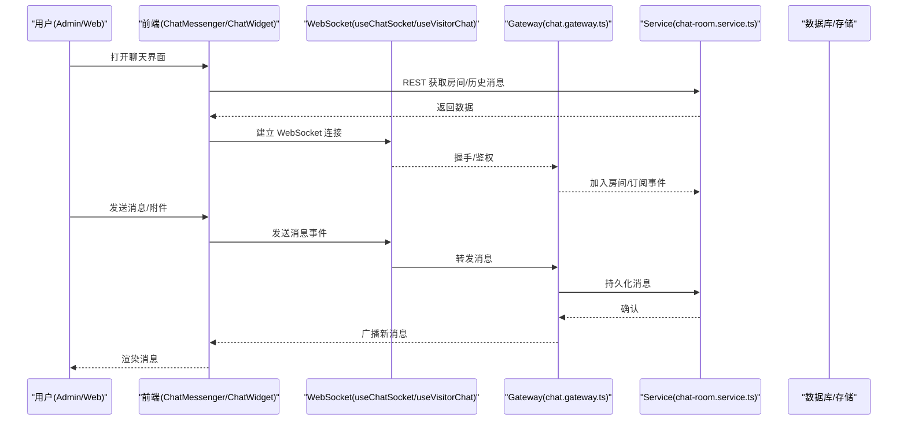

**图表来源** 
- [useChatSocket.ts](file://apps/admin/src/features/chat/useChatSocket.ts)
- [useVisitorChat.ts](file://apps/web/src/features/chat/useVisitorChat.ts)
- [chat.gateway.ts](file://apps/api/src/support/chat.gateway.ts)
- [chat-room.service.ts](file://apps/api/src/support/chat-room.service.ts)

## 详细组件分析

### Admin 聊天工作台（ChatMessenger）
职责与流程：
- 房间管理与切换：加载房间信息、切换会话、拉取历史消息
- 消息列表渲染：按时间排序、区分发送方、显示已读/未读状态
- 输入与发送：文本输入、Markdown 预览、附件上传与预览
- 状态与错误：连接状态、发送中、失败重试、网络异常提示
- 集成点：调用 REST API、订阅 WebSocket 事件、更新本地状态

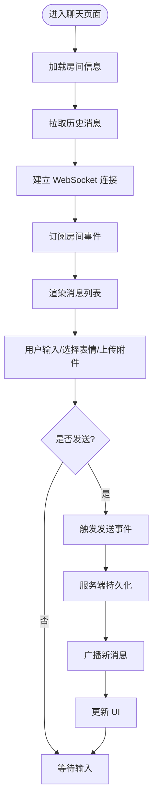

**图表来源** 
- [ChatMessenger.tsx](file://apps/admin/src/features/chat/ChatMessenger.tsx)
- [useChatSocket.ts](file://apps/admin/src/features/chat/useChatSocket.ts)
- [api.ts](file://apps/admin/src/features/chat/api.ts)

**章节来源**
- [ChatMessenger.tsx](file://apps/admin/src/features/chat/ChatMessenger.tsx)
- [useChatSocket.ts](file://apps/admin/src/features/chat/useChatSocket.ts)
- [api.ts](file://apps/admin/src/features/chat/api.ts)

### WebSocket 客户端（useChatSocket / useVisitorChat）
职责与流程：
- 连接管理：URL 构建、鉴权参数注入、断线重连、指数退避
- 事件订阅：消息、在线状态、错误、系统通知
- 心跳保活：定时 ping/pong，超时断开与恢复
- 错误处理：网络异常、服务端错误码、降级策略

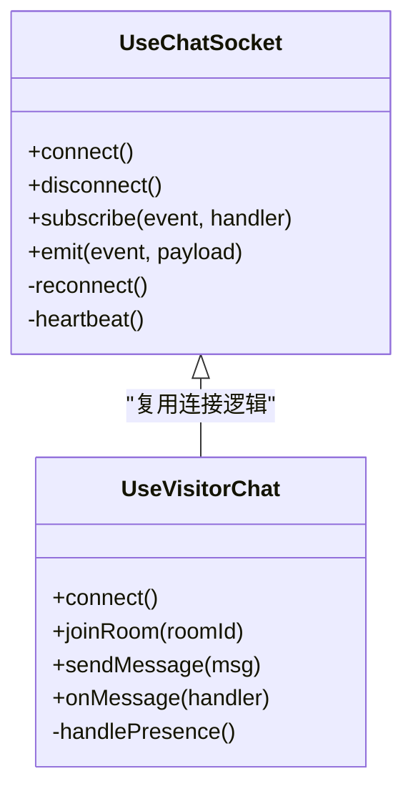

**图表来源** 
- [useChatSocket.ts](file://apps/admin/src/features/chat/useChatSocket.ts)
- [useVisitorChat.ts](file://apps/web/src/features/chat/useVisitorChat.ts)

**章节来源**
- [useChatSocket.ts](file://apps/admin/src/features/chat/useChatSocket.ts)
- [useVisitorChat.ts](file://apps/web/src/features/chat/useVisitorChat.ts)

### Markdown 消息渲染（ChatMarkdown）
职责与特性：
- 将 Markdown 内容渲染为 HTML，支持代码块高亮、表格、链接
- 安全策略：过滤危险标签、外链在新窗口打开、图片懒加载
- 可定制主题：颜色、字体、行高、代码主题
- 无障碍：语义化标签、键盘导航、屏幕阅读器友好

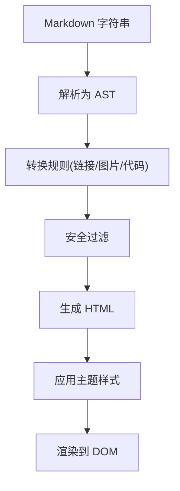

**图表来源** 
- [ChatMarkdown.tsx](file://apps/web/src/components/chat/ChatMarkdown.tsx)

**章节来源**
- [ChatMarkdown.tsx](file://apps/web/src/components/chat/ChatMarkdown.tsx)

### 表情选择器（EmojiPicker）
职责与流程：
- 表情分类与搜索：按类别分组、关键词过滤
- 插入逻辑：在光标位置插入表情字符或短代码
- 主题适配：跟随全局主题色、暗色模式
- 可访问性：键盘操作、ARIA 标签

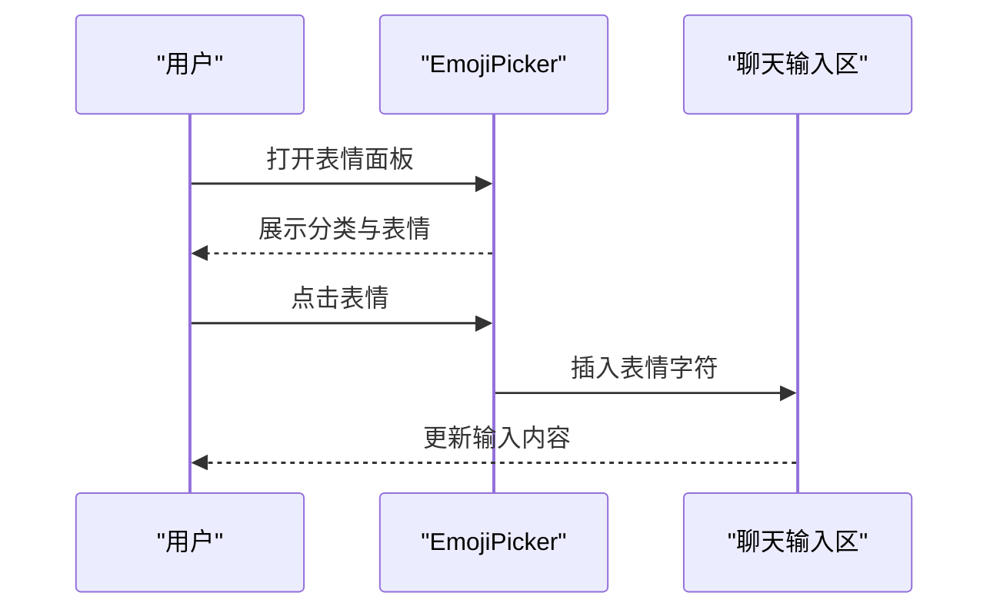

**图表来源** 
- [EmojiPicker.tsx](file://apps/web/src/components/chat/EmojiPicker.tsx)

**章节来源**
- [EmojiPicker.tsx](file://apps/web/src/components/chat/EmojiPicker.tsx)

### 访客小部件（ChatWidget）
职责与流程：
- 悬浮入口：右下角按钮、展开/收起动画
- 消息展示：Markdown 渲染、图片预览、滚动到底部
- 输入与发送：文本输入、表情插入、附件上传
- 状态反馈：连接状态、发送中、错误提示
- 国际化：文案多语言切换

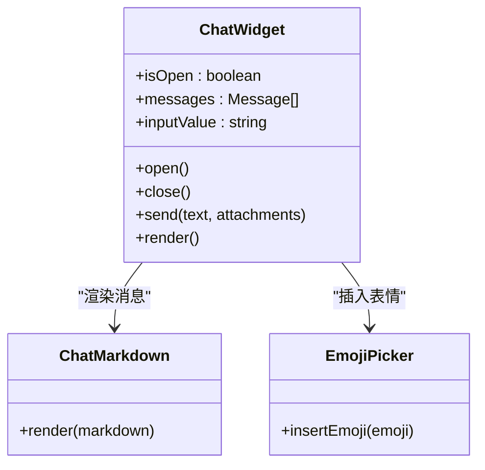

**图表来源** 
- [ChatWidget.tsx](file://apps/web/src/components/chat/ChatWidget.tsx)
- [ChatMarkdown.tsx](file://apps/web/src/components/chat/ChatMarkdown.tsx)
- [EmojiPicker.tsx](file://apps/web/src/components/chat/EmojiPicker.tsx)

**章节来源**
- [ChatWidget.tsx](file://apps/web/src/components/chat/ChatWidget.tsx)
- [ChatMarkdown.tsx](file://apps/web/src/components/chat/ChatMarkdown.tsx)
- [EmojiPicker.tsx](file://apps/web/src/components/chat/EmojiPicker.tsx)

### 后端网关与服务（chat.gateway / chat-room.controller / chat-room.service）
职责与流程：
- Gateway：WebSocket 握手、鉴权、房间加入/离开、事件广播、心跳
- Controller：REST 接口（创建房间、获取历史消息、上传附件元数据）
- Service：消息持久化、媒体处理、存在性统计、清理策略

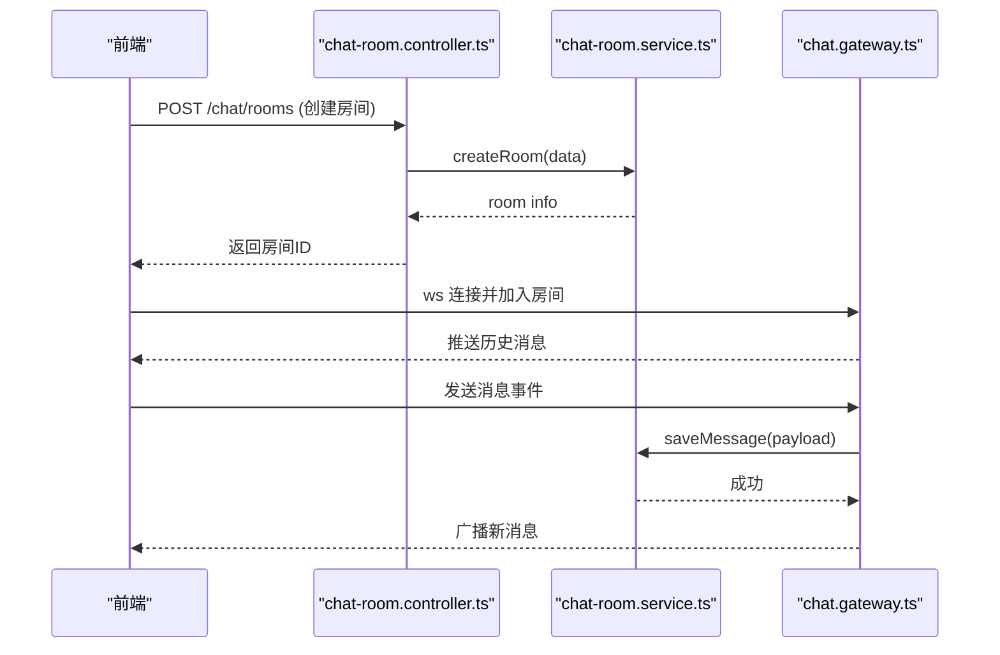

**图表来源** 
- [chat-room.controller.ts](file://apps/api/src/support/chat-room.controller.ts)
- [chat-room.service.ts](file://apps/api/src/support/chat-room.service.ts)
- [chat.gateway.ts](file://apps/api/src/support/chat.gateway.ts)

**章节来源**
- [chat.gateway.ts](file://apps/api/src/support/chat.gateway.ts)
- [chat-room.controller.ts](file://apps/api/src/support/chat-room.controller.ts)
- [chat-room.service.ts](file://apps/api/src/support/chat-room.service.ts)

### 类型与数据模型（types.ts）
- 消息类型：文本、附件、系统消息、状态变更
- 房间类型：ID、名称、成员、状态、创建时间
- 用户类型：ID、昵称、头像、角色
- 事件载荷：发送、接收、在线、离线、错误

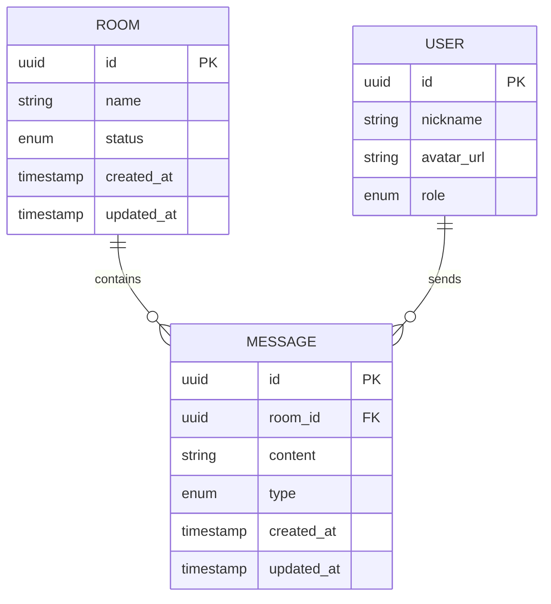

**图表来源** 
- [types.ts](file://apps/admin/src/features/chat/types.ts)

**章节来源**
- [types.ts](file://apps/admin/src/features/chat/types.ts)

### 在线状态与存在性（ChatPresenceProvider / presence.ts）
- 管理用户在线/离线状态
- 房间级存在性广播
- 心跳检测与超时处理
- 与 Gateway 的事件联动

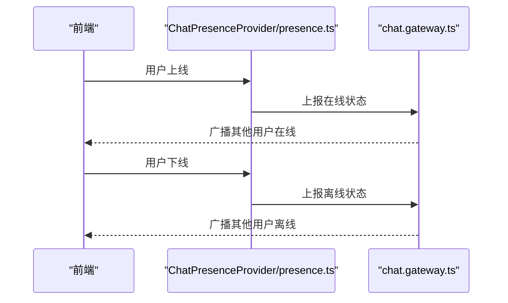

**图表来源** 
- [ChatPresenceProvider.tsx](file://apps/admin/src/features/chat/ChatPresenceProvider.tsx)
- [presence.ts](file://apps/web/src/features/chat/presence.ts)
- [chat.gateway.ts](file://apps/api/src/support/chat.gateway.ts)

**章节来源**
- [ChatPresenceProvider.tsx](file://apps/admin/src/features/chat/ChatPresenceProvider.tsx)
- [presence.ts](file://apps/web/src/features/chat/presence.ts)
- [chat.gateway.ts](file://apps/api/src/support/chat.gateway.ts)

## 依赖关系分析
- 前端模块耦合度低：ChatMessenger 与 useChatSocket 解耦，便于替换通信实现
- Web 小部件独立：ChatWidget 仅依赖 Markdown 与表情组件，易于嵌入
- 后端模块化：Gateway、Controller、Service 分层清晰，便于扩展与测试
- 外部依赖：媒体存储服务（对象存储）、数据库（消息持久化）、缓存（可选，用于在线状态）

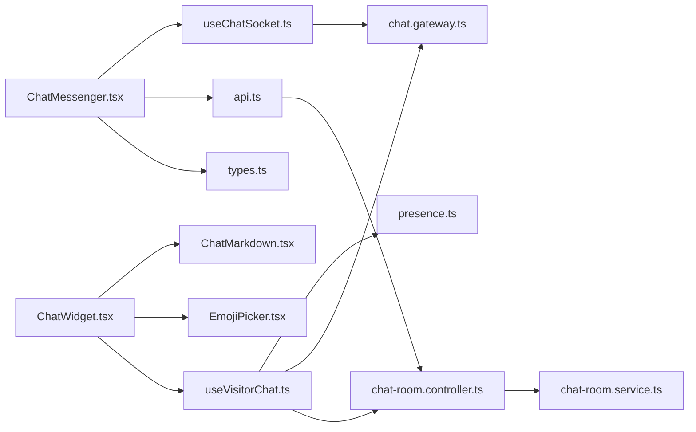

**图表来源** 
- [ChatMessenger.tsx](file://apps/admin/src/features/chat/ChatMessenger.tsx)
- [useChatSocket.ts](file://apps/admin/src/features/chat/useChatSocket.ts)
- [api.ts](file://apps/admin/src/features/chat/api.ts)
- [types.ts](file://apps/admin/src/features/chat/types.ts)
- [ChatWidget.tsx](file://apps/web/src/components/chat/ChatWidget.tsx)
- [ChatMarkdown.tsx](file://apps/web/src/components/chat/ChatMarkdown.tsx)
- [EmojiPicker.tsx](file://apps/web/src/components/chat/EmojiPicker.tsx)
- [useVisitorChat.ts](file://apps/web/src/features/chat/useVisitorChat.ts)
- [presence.ts](file://apps/web/src/features/chat/presence.ts)
- [chat.gateway.ts](file://apps/api/src/support/chat.gateway.ts)
- [chat-room.controller.ts](file://apps/api/src/support/chat-room.controller.ts)
- [chat-room.service.ts](file://apps/api/src/support/chat-room.service.ts)

**章节来源**
- [ChatMessenger.tsx](file://apps/admin/src/features/chat/ChatMessenger.tsx)
- [useChatSocket.ts](file://apps/admin/src/features/chat/useChatSocket.ts)
- [api.ts](file://apps/admin/src/features/chat/api.ts)
- [types.ts](file://apps/admin/src/features/chat/types.ts)
- [ChatWidget.tsx](file://apps/web/src/components/chat/ChatWidget.tsx)
- [ChatMarkdown.tsx](file://apps/web/src/components/chat/ChatMarkdown.tsx)
- [EmojiPicker.tsx](file://apps/web/src/components/chat/EmojiPicker.tsx)
- [useVisitorChat.ts](file://apps/web/src/features/chat/useVisitorChat.ts)
- [presence.ts](file://apps/web/src/features/chat/presence.ts)
- [chat.gateway.ts](file://apps/api/src/support/chat.gateway.ts)
- [chat-room.controller.ts](file://apps/api/src/support/chat-room.controller.ts)
- [chat-room.service.ts](file://apps/api/src/support/chat-room.service.ts)

## 性能考量
- 消息分页与虚拟滚动：长列表按需渲染，减少 DOM 压力
- WebSocket 心跳与重连：避免频繁重连，采用指数退避
- 图片与附件懒加载：首屏快速加载，按需请求资源
- Markdown 渲染优化：AST 缓存、防抖更新、代码高亮按需加载
- 服务端批量广播：同房间消息合并推送，降低带宽占用
- 存储与清理：过期消息与临时附件定期清理

[本节为通用指导，不直接分析具体文件]

## 故障排查指南
常见问题与定位步骤：
- 无法建立 WebSocket 连接
  - 检查鉴权参数与跨域配置
  - 查看浏览器控制台与网络面板
  - 验证 Gateway 健康状态
- 消息未送达或未显示
  - 确认事件订阅是否正确
  - 检查服务端日志与数据库记录
  - 验证消息类型与格式
- 附件上传失败
  - 检查媒体服务权限与 CORS
  - 确认文件大小与类型限制
  - 查看上传进度与错误回调
- 在线状态不准确
  - 检查心跳间隔与超时阈值
  - 确认 Gateway 的存在性广播
  - 排查网络抖动与代理问题

**章节来源**
- [chat.gateway.ts](file://apps/api/src/support/chat.gateway.ts)
- [chat-room.controller.ts](file://apps/api/src/support/chat-room.controller.ts)
- [chat-room.service.ts](file://apps/api/src/support/chat-room.service.ts)
- [useChatSocket.ts](file://apps/admin/src/features/chat/useChatSocket.ts)
- [useVisitorChat.ts](file://apps/web/src/features/chat/useVisitorChat.ts)

## 结论
聊天组件以模块化设计与清晰的职责划分，实现了从 Admin 工作台到 Web 访客小部件的完整体验。通过 WebSocket 实时通信、Markdown 渲染、表情选择与附件上传，满足多样化沟通需求。后端采用 NestJS 分层架构，确保可扩展性与可维护性。建议在生产环境启用监控与日志，持续优化性能与稳定性。

[本节为总结性内容，不直接分析具体文件]

## 附录

### 与后端聊天服务的集成指南
- 认证与鉴权
  - 前端在 WebSocket 握手时携带令牌或签名
  - 后端校验身份并绑定用户与会话
- 房间管理
  - 通过 REST 创建房间、邀请成员、设置权限
  - 前端根据房间 ID 加入对应频道
- 消息协议
  - 定义统一的消息结构与事件命名
  - 支持文本、富文本、附件、系统通知
- 媒体上传
  - 先上传至对象存储，再回写 URL 到消息体
  - 前端实现预览与压缩，提升用户体验
- 存在性与心跳
  - 定期心跳保持连接活跃
  - 在线状态变化及时广播

**章节来源**
- [chat-room.controller.ts](file://apps/api/src/support/chat-room.controller.ts)
- [chat-room.service.ts](file://apps/api/src/support/chat-room.service.ts)
- [chat.gateway.ts](file://apps/api/src/support/chat.gateway.ts)
- [seed-chat-mock.ts](file://apps/api/scripts/seed-chat-mock.ts)