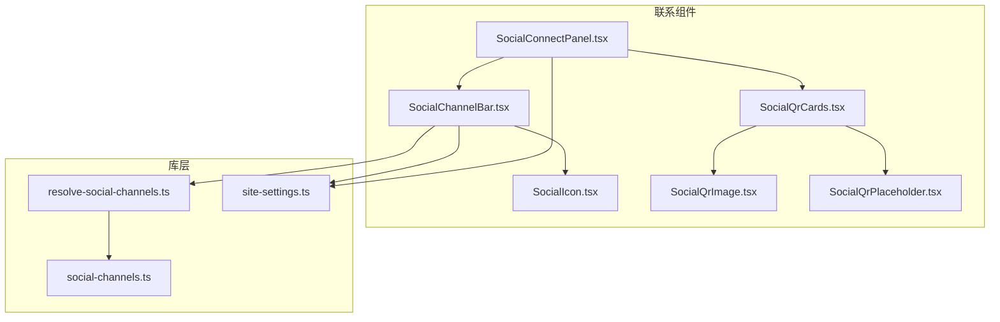
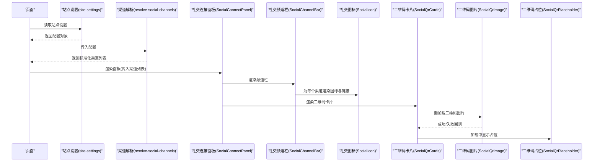
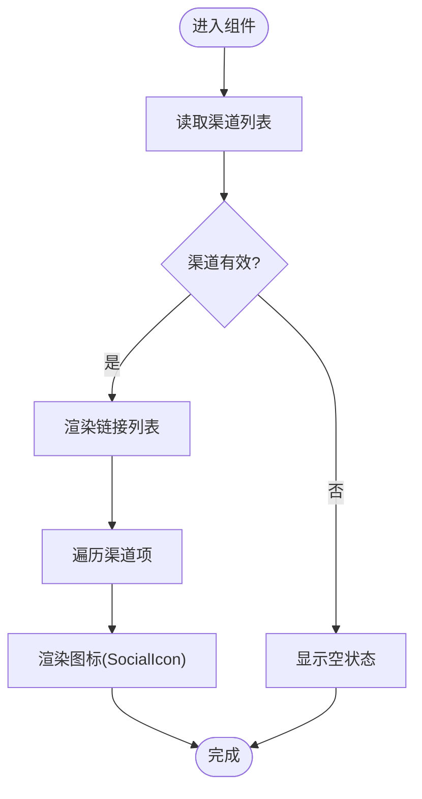
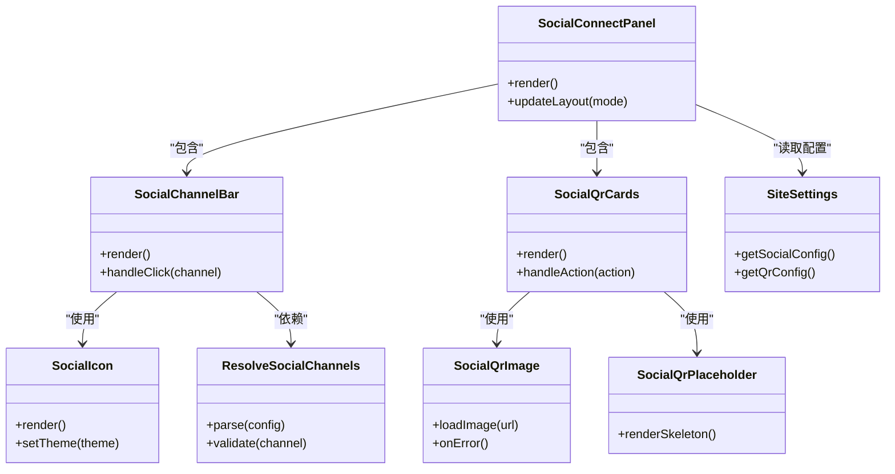

# 联系组件

<cite>
**本文档引用的文件**   
- [SocialChannelBar.tsx](file://apps/web/src/components/contact/SocialChannelBar.tsx)
- [SocialConnectPanel.tsx](file://apps/web/src/components/contact/SocialConnectPanel.tsx)
- [SocialIcon.tsx](file://apps/web/src/components/contact/SocialIcon.tsx)
- [SocialQrCards.tsx](file://apps/web/src/components/contact/SocialQrCards.tsx)
- [SocialQrImage.tsx](file://apps/web/src/components/contact/SocialQrImage.tsx)
- [SocialQrPlaceholder.tsx](file://apps/web/src/components/contact/SocialQrPlaceholder.tsx)
- [resolve-social-channels.ts](file://apps/web/src/lib/resolve-social-channels.ts)
- [social-channels.ts](file://apps/web/src/lib/social-channels.ts)
- [site-settings.ts](file://apps/web/src/lib/site-settings.ts)
</cite>

## 目录
1. [简介](#简介)
2. [项目结构](#项目结构)
3. [核心组件](#核心组件)
4. [架构总览](#架构总览)
5. [详细组件分析](#详细组件分析)
6. [依赖关系分析](#依赖关系分析)
7. [性能考虑](#性能考虑)
8. [故障排查指南](#故障排查指南)
9. [结论](#结论)
10. [附录](#附录)

## 简介
本文件面向“联系组件”模块，系统性说明社交媒体链接、二维码卡片与社交连接面板的实现与使用方法。内容覆盖：
- 动态内容加载：从站点设置中读取并渲染社交平台与二维码信息
- 多平台支持：统一渠道类型定义与解析逻辑，便于扩展新平台
- 响应式设计：适配不同屏幕尺寸与交互方式
- 二维码生成与占位策略：按需生成或懒加载图片，提供占位体验
- 图标管理与样式定制：集中式图标映射与主题化配置
- 与网站设置集成：通过站点配置驱动前端展示，确保内容与运营一致

## 项目结构
联系组件位于 Web 应用的前端代码中，主要包含以下文件：
- 组件层：社交频道栏、社交连接面板、社交图标、二维码卡片、二维码图片、二维码占位
- 库层：社交平台解析与类型定义、站点设置读取
- 资源层：静态媒体路径与国际化文案（由上层页面使用）

图表来源
- [SocialChannelBar.tsx](file://apps/web/src/components/contact/SocialChannelBar.tsx)
- [SocialConnectPanel.tsx](file://apps/web/src/components/contact/SocialConnectPanel.tsx)
- [SocialIcon.tsx](file://apps/web/src/components/contact/SocialIcon.tsx)
- [SocialQrCards.tsx](file://apps/web/src/components/contact/SocialQrCards.tsx)
- [SocialQrImage.tsx](file://apps/web/src/components/contact/SocialQrImage.tsx)
- [SocialQrPlaceholder.tsx](file://apps/web/src/components/contact/SocialQrPlaceholder.tsx)
- [resolve-social-channels.ts](file://apps/web/src/lib/resolve-social-channels.ts)
- [social-channels.ts](file://apps/web/src/lib/social-channels.ts)
- [site-settings.ts](file://apps/web/src/lib/site-settings.ts)

章节来源
- [SocialChannelBar.tsx](file://apps/web/src/components/contact/SocialChannelBar.tsx)
- [SocialConnectPanel.tsx](file://apps/web/src/components/contact/SocialConnectPanel.tsx)
- [SocialQrCards.tsx](file://apps/web/src/components/contact/SocialQrCards.tsx)
- [SocialQrImage.tsx](file://apps/web/src/components/contact/SocialQrImage.tsx)
- [SocialQrPlaceholder.tsx](file://apps/web/src/components/contact/SocialQrPlaceholder.tsx)
- [resolve-social-channels.ts](file://apps/web/src/lib/resolve-social-channels.ts)
- [social-channels.ts](file://apps/web/src/lib/social-channels.ts)
- [site-settings.ts](file://apps/web/src/lib/site-settings.ts)

## 核心组件
- 社交频道栏（SocialChannelBar）：聚合并展示各平台的社交链接入口，支持点击跳转与可访问性标签
- 社交连接面板（SocialConnectPanel）：承载频道栏与二维码卡片的容器，提供布局与交互控制
- 社交图标（SocialIcon）：按平台类型渲染对应图标，支持尺寸与颜色定制
- 二维码卡片（SocialQrCards）：以卡片形式呈现二维码，支持标题、描述与操作按钮
- 二维码图片（SocialQrImage）：负责二维码图片的懒加载与错误处理
- 二维码占位（SocialQrPlaceholder）：在图片未就绪时显示占位骨架，提升感知性能

章节来源
- [SocialChannelBar.tsx](file://apps/web/src/components/contact/SocialChannelBar.tsx)
- [SocialConnectPanel.tsx](file://apps/web/src/components/contact/SocialConnectPanel.tsx)
- [SocialIcon.tsx](file://apps/web/src/components/contact/SocialIcon.tsx)
- [SocialQrCards.tsx](file://apps/web/src/components/contact/SocialQrCards.tsx)
- [SocialQrImage.tsx](file://apps/web/src/components/contact/SocialQrImage.tsx)
- [SocialQrPlaceholder.tsx](file://apps/web/src/components/contact/SocialQrPlaceholder.tsx)

## 架构总览
联系组件采用“数据驱动 + 组件组合”的模式：
- 数据源：站点设置（site-settings）提供社交平台与二维码相关配置
- 解析层：resolve-social-channels 将原始配置转换为统一的渠道数据结构
- 展示层：SocialChannelBar 与 SocialConnectPanel 组合 SocialIcon、SocialQrCards 等子组件进行渲染
- 资源层：SocialQrImage 负责图片懒加载与错误兜底，SocialQrPlaceholder 提供骨架屏

图表来源
- [site-settings.ts](file://apps/web/src/lib/site-settings.ts)
- [resolve-social-channels.ts](file://apps/web/src/lib/resolve-social-channels.ts)
- [SocialConnectPanel.tsx](file://apps/web/src/components/contact/SocialConnectPanel.tsx)
- [SocialChannelBar.tsx](file://apps/web/src/components/contact/SocialChannelBar.tsx)
- [SocialIcon.tsx](file://apps/web/src/components/contact/SocialIcon.tsx)
- [SocialQrCards.tsx](file://apps/web/src/components/contact/SocialQrCards.tsx)
- [SocialQrImage.tsx](file://apps/web/src/components/contact/SocialQrImage.tsx)
- [SocialQrPlaceholder.tsx](file://apps/web/src/components/contact/SocialQrPlaceholder.tsx)

## 详细组件分析

### 社交频道栏（SocialChannelBar）
- 功能：遍历渠道列表，渲染平台图标与链接；支持无障碍标签与键盘导航
- 数据流：从 resolve-social-channels 获取标准化渠道数据，再传递给 SocialIcon
- 响应式：根据屏幕宽度调整间距与布局，移动端优化触控区域
- 可访问性：为每个链接提供 aria-label，确保屏幕阅读器友好

图表来源
- [SocialChannelBar.tsx](file://apps/web/src/components/contact/SocialChannelBar.tsx)
- [resolve-social-channels.ts](file://apps/web/src/lib/resolve-social-channels.ts)
- [SocialIcon.tsx](file://apps/web/src/components/contact/SocialIcon.tsx)

章节来源
- [SocialChannelBar.tsx](file://apps/web/src/components/contact/SocialChannelBar.tsx)
- [resolve-social-channels.ts](file://apps/web/src/lib/resolve-social-channels.ts)
- [SocialIcon.tsx](file://apps/web/src/components/contact/SocialIcon.tsx)

### 社交连接面板（SocialConnectPanel）
- 功能：作为容器整合频道栏与二维码卡片，管理布局与交互状态
- 数据流：接收来自站点设置的渠道与二维码配置，交由子组件渲染
- 响应式：在不同断点切换网格布局，保证移动端可读性与易用性
- 扩展点：预留插槽用于未来新增模块（如联系方式表单）

章节来源
- [SocialConnectPanel.tsx](file://apps/web/src/components/contact/SocialConnectPanel.tsx)

### 社交图标（SocialIcon）
- 功能：根据平台类型选择图标资源，支持尺寸与颜色参数
- 主题化：通过 props 或全局主题变量控制样式，保持品牌一致性
- 性能：图标资源按需加载，避免首屏冗余

章节来源
- [SocialIcon.tsx](file://apps/web/src/components/contact/SocialIcon.tsx)
- [social-channels.ts](file://apps/web/src/lib/social-channels.ts)

### 二维码卡片（SocialQrCards）
- 功能：以卡片形式展示二维码，包含标题、描述与操作按钮
- 数据流：从站点设置读取二维码 URL 与元数据，传递给 SocialQrImage
- 交互：支持点击复制链接、打开新窗口等操作
- 错误处理：图片加载失败时降级为占位图或提示

章节来源
- [SocialQrCards.tsx](file://apps/web/src/components/contact/SocialQrCards.tsx)
- [SocialQrImage.tsx](file://apps/web/src/components/contact/SocialQrImage.tsx)
- [SocialQrPlaceholder.tsx](file://apps/web/src/components/contact/SocialQrPlaceholder.tsx)

### 二维码图片（SocialQrImage）
- 功能：懒加载二维码图片，处理加载状态与错误边界
- 性能：使用 IntersectionObserver 实现视口内加载，减少无关请求
- 容错：网络错误或无效 URL 时回退到占位图

章节来源
- [SocialQrImage.tsx](file://apps/web/src/components/contact/SocialQrImage.tsx)
- [SocialQrPlaceholder.tsx](file://apps/web/src/components/contact/SocialQrPlaceholder.tsx)

### 二维码占位（SocialQrPlaceholder）
- 功能：在图片未就绪时显示骨架屏，提升用户感知性能
- 样式：与真实图片尺寸保持一致，避免布局抖动

章节来源
- [SocialQrPlaceholder.tsx](file://apps/web/src/components/contact/SocialQrPlaceholder.tsx)

### 渠道解析与类型定义（resolve-social-channels.ts, social-channels.ts）
- 功能：将站点设置中的原始渠道数据转换为统一结构，校验必填字段
- 扩展性：新增平台只需在类型定义中添加枚举值，并在解析器中补充映射规则
- 安全性：对 URL 进行基础校验，防止非法链接注入

章节来源
- [resolve-social-channels.ts](file://apps/web/src/lib/resolve-social-channels.ts)
- [social-channels.ts](file://apps/web/src/lib/social-channels.ts)

### 站点设置集成（site-settings.ts）
- 功能：提供统一的站点配置读取接口，包括社交平台与二维码相关字段
- 默认值：当配置缺失时返回安全默认值，保证组件稳定渲染
- 缓存：对频繁读取的配置进行内存缓存，提升性能

章节来源
- [site-settings.ts](file://apps/web/src/lib/site-settings.ts)

## 依赖关系分析
联系组件内部依赖清晰，外部依赖集中于站点设置与渠道类型定义。组件间耦合度低，便于独立测试与维护。

图表来源
- [SocialChannelBar.tsx](file://apps/web/src/components/contact/SocialChannelBar.tsx)
- [SocialConnectPanel.tsx](file://apps/web/src/components/contact/SocialConnectPanel.tsx)
- [SocialIcon.tsx](file://apps/web/src/components/contact/SocialIcon.tsx)
- [SocialQrCards.tsx](file://apps/web/src/components/contact/SocialQrCards.tsx)
- [SocialQrImage.tsx](file://apps/web/src/components/contact/SocialQrImage.tsx)
- [SocialQrPlaceholder.tsx](file://apps/web/src/components/contact/SocialQrPlaceholder.tsx)
- [resolve-social-channels.ts](file://apps/web/src/lib/resolve-social-channels.ts)
- [site-settings.ts](file://apps/web/src/lib/site-settings.ts)

章节来源
- [SocialChannelBar.tsx](file://apps/web/src/components/contact/SocialChannelBar.tsx)
- [SocialConnectPanel.tsx](file://apps/web/src/components/contact/SocialConnectPanel.tsx)
- [SocialQrCards.tsx](file://apps/web/src/components/contact/SocialQrCards.tsx)
- [SocialQrImage.tsx](file://apps/web/src/components/contact/SocialQrImage.tsx)
- [SocialQrPlaceholder.tsx](file://apps/web/src/components/contact/SocialQrPlaceholder.tsx)
- [resolve-social-channels.ts](file://apps/web/src/lib/resolve-social-channels.ts)
- [site-settings.ts](file://apps/web/src/lib/site-settings.ts)

## 性能考虑
- 懒加载：二维码图片仅在进入视口时加载，减少首屏负担
- 骨架屏：使用占位符避免布局抖动，提升用户体验
- 缓存：站点设置读取结果进行内存缓存，避免重复请求
- 图标优化：图标资源按需加载，避免不必要的网络开销
- 错误边界：图片加载失败时快速降级，不影响整体渲染

## 故障排查指南
- 渠道为空：检查站点设置中是否配置了有效的社交平台与二维码字段
- 图标不显示：确认 social-channels.ts 中平台类型定义与图标映射是否正确
- 二维码无法加载：验证二维码 URL 是否有效，检查网络策略与跨域配置
- 响应式异常：检查 CSS 断点与容器宽度计算逻辑
- 可访问性问题：确保所有链接具备正确的 aria-label 与键盘导航支持

章节来源
- [site-settings.ts](file://apps/web/src/lib/site-settings.ts)
- [social-channels.ts](file://apps/web/src/lib/social-channels.ts)
- [SocialQrImage.tsx](file://apps/web/src/components/contact/SocialQrImage.tsx)

## 结论
联系组件通过清晰的架构设计与模块化实现，提供了灵活的社交媒体链接展示与二维码管理能力。其数据驱动模式便于与站点设置集成，响应式设计与性能优化确保了良好的用户体验。建议在实际使用中遵循本文档的最佳实践，以确保系统的稳定性与可扩展性。

## 附录
- 最佳实践：
  - 始终通过站点设置管理社交平台与二维码内容，避免硬编码
  - 为新平台扩展时，优先更新类型定义与解析逻辑，保持向后兼容
  - 使用懒加载与骨架屏优化性能，特别是在移动端
  - 确保所有交互元素具备可访问性标签，符合 WCAG 标准
- 常见问题：
  - 配置缺失导致渲染异常：提供默认值与错误提示
  - 图片加载失败：实现重试机制与降级策略
  - 多语言支持：结合国际化文案库动态渲染文本