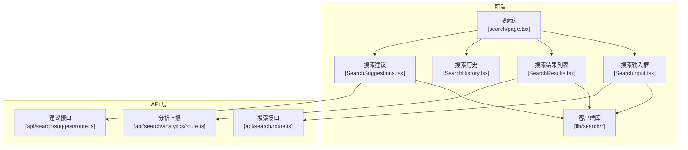
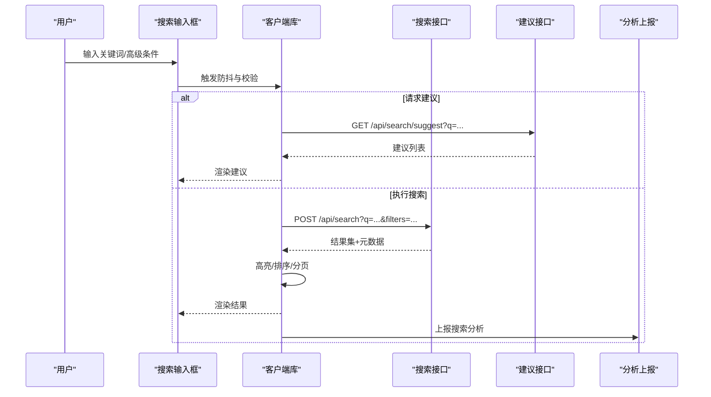
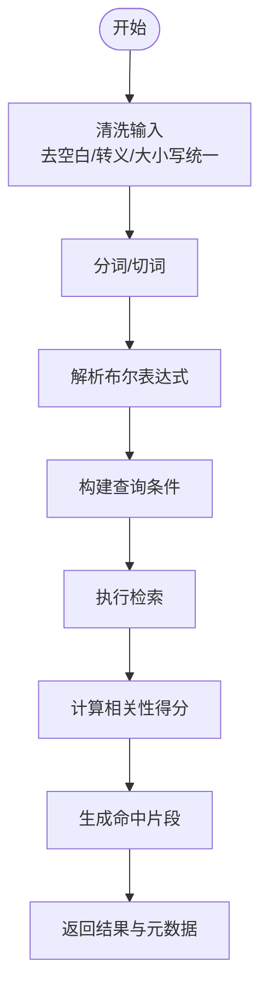
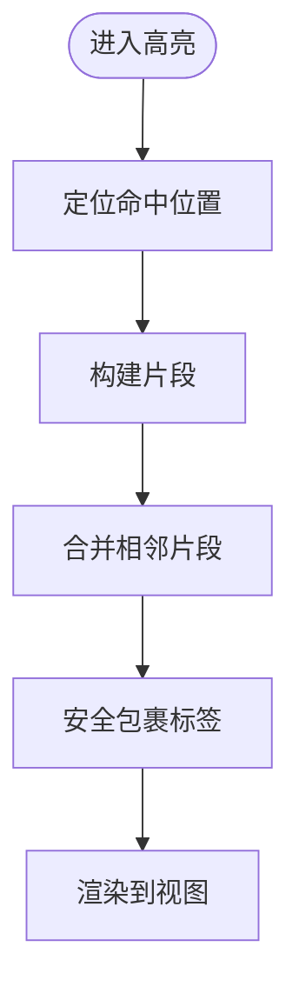
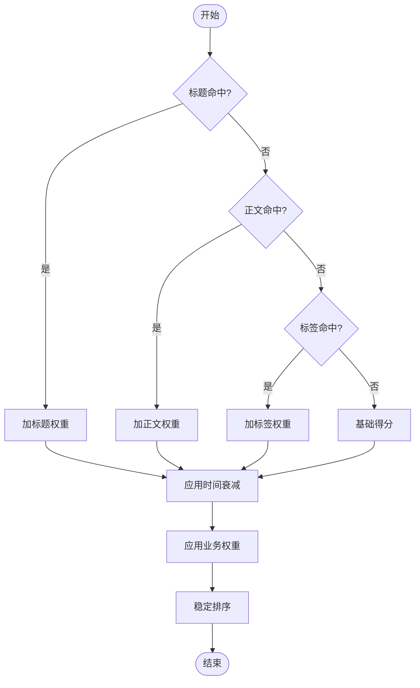
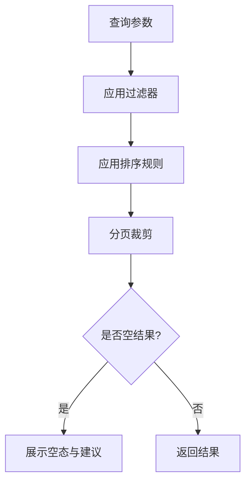
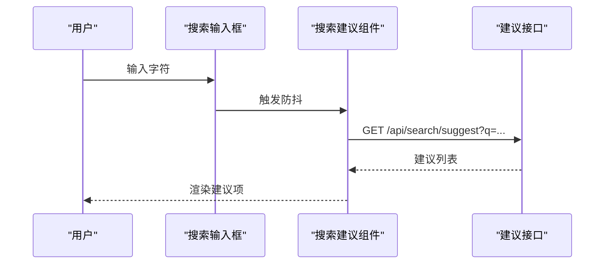
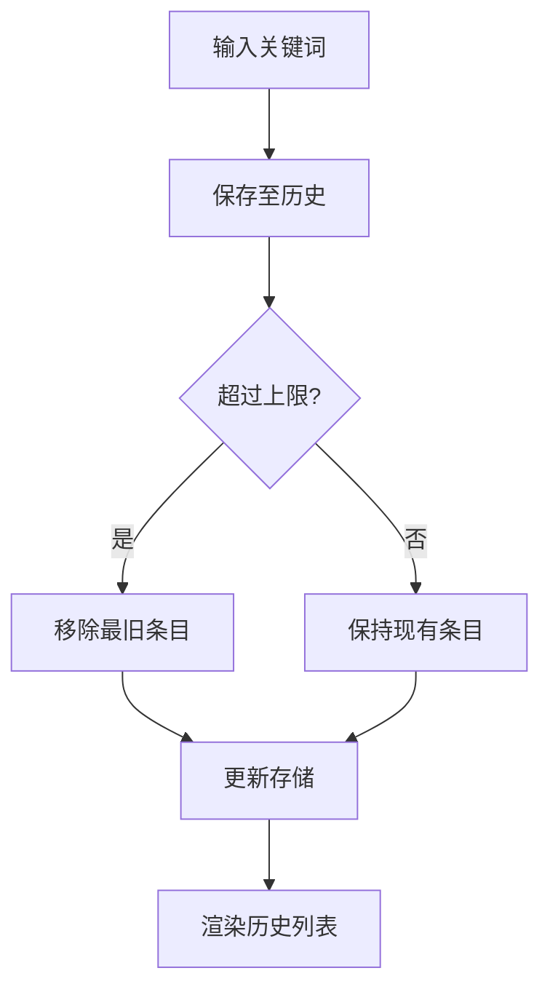
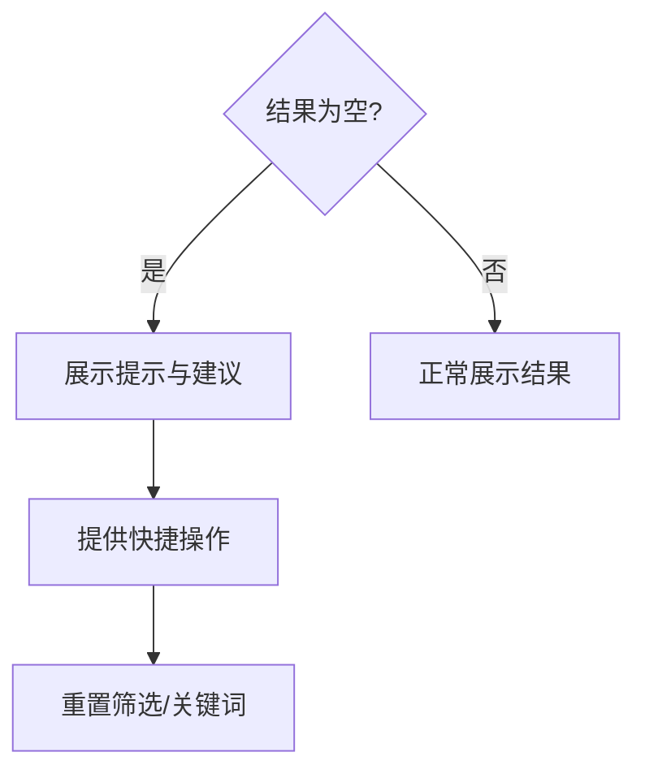
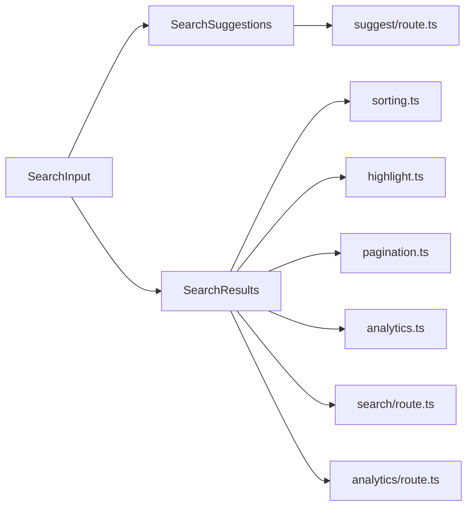

# 内容搜索与过滤

<cite>
**本文引用的文件**   
- [apps/web/src/app/[locale]/search/page.tsx](file://apps/web/src/app/[locale]/search/page.tsx)
- [apps/web/src/components/search/SearchInput.tsx](file://apps/web/src/components/search/SearchInput.tsx)
- [apps/web/src/components/search/SearchResults.tsx](file://apps/web/src/components/search/SearchResults.tsx)
- [apps/web/src/components/search/SearchHistory.tsx](file://apps/web/src/components/search/SearchHistory.tsx)
- [apps/web/src/components/search/SearchSuggestions.tsx](file://apps/web/src/components/search/SearchSuggestions.tsx)
- [apps/web/src/lib/search/index.ts](file://apps/web/src/lib/search/index.ts)
- [apps/web/src/lib/search/highlight.ts](file://apps/web/src/lib/search/highlight.ts)
- [apps/web/src/lib/search/sorting.ts](file://apps/web/src/lib/search/sorting.ts)
- [apps/web/src/lib/search/pagination.ts](file://apps/web/src/lib/search/pagination.ts)
- [apps/web/src/lib/search/analytics.ts](file://apps/web/src/lib/search/analytics.ts)
- [apps/web/src/app/api/search/route.ts](file://apps/web/src/app/api/search/route.ts)
- [apps/web/src/app/api/search/suggest/route.ts](file://apps/web/src/app/api/search/suggest/route.ts)
- [apps/web/src/app/api/search/analytics/route.ts](file://apps/web/src/app/api/search/analytics/route.ts)
</cite>

## 目录
1. [简介](#简介)
2. [项目结构](#项目结构)
3. [核心组件](#核心组件)
4. [架构总览](#架构总览)
5. [详细组件分析](#详细组件分析)
6. [依赖关系分析](#依赖关系分析)
7. [性能考虑](#性能考虑)
8. [故障排查指南](#故障排查指南)
9. [结论](#结论)
10. [附录](#附录)

## 简介
本文件面向“内容搜索与过滤”功能，覆盖全文搜索引擎实现、关键词高亮显示、相关性排序算法、高级搜索选项、布尔查询、搜索结果分页加载、搜索建议、搜索历史、无结果处理等。同时提供搜索性能优化、索引更新与搜索分析的实践指南，帮助读者快速理解并落地相关能力。

## 项目结构
搜索功能由前端页面、UI 组件、客户端库与 Next.js API 路由共同组成：
- 页面层：搜索页入口与路由聚合
- UI 层：输入框、结果列表、历史记录、搜索建议
- 客户端库：高亮、排序、分页、分析采集
- API 层：搜索、建议与分析上报接口

图表来源
- [apps/web/src/app/[locale]/search/page.tsx](file://apps/web/src/app/[locale]/search/page.tsx)
- [apps/web/src/components/search/SearchInput.tsx](file://apps/web/src/components/search/SearchInput.tsx)
- [apps/web/src/components/search/SearchResults.tsx](file://apps/web/src/components/search/SearchResults.tsx)
- [apps/web/src/components/search/SearchHistory.tsx](file://apps/web/src/components/search/SearchHistory.tsx)
- [apps/web/src/components/search/SearchSuggestions.tsx](file://apps/web/src/components/search/SearchSuggestions.tsx)
- [apps/web/src/lib/search/index.ts](file://apps/web/src/lib/search/index.ts)
- [apps/web/src/app/api/search/route.ts](file://apps/web/src/app/api/search/route.ts)
- [apps/web/src/app/api/search/suggest/route.ts](file://apps/web/src/app/api/search/suggest/route.ts)
- [apps/web/src/app/api/search/analytics/route.ts](file://apps/web/src/app/api/search/analytics/route.ts)

章节来源
- [apps/web/src/app/[locale]/search/page.tsx](file://apps/web/src/app/[locale]/search/page.tsx)
- [apps/web/src/components/search/SearchInput.tsx](file://apps/web/src/components/search/SearchInput.tsx)
- [apps/web/src/components/search/SearchResults.tsx](file://apps/web/src/components/search/SearchResults.tsx)
- [apps/web/src/components/search/SearchHistory.tsx](file://apps/web/src/components/search/SearchHistory.tsx)
- [apps/web/src/components/search/SearchSuggestions.tsx](file://apps/web/src/components/search/SearchSuggestions.tsx)
- [apps/web/src/lib/search/index.ts](file://apps/web/src/lib/search/index.ts)
- [apps/web/src/app/api/search/route.ts](file://apps/web/src/app/api/search/route.ts)
- [apps/web/src/app/api/search/suggest/route.ts](file://apps/web/src/app/api/search/suggest/route.ts)
- [apps/web/src/app/api/search/analytics/route.ts](file://apps/web/src/app/api/search/analytics/route.ts)

## 核心组件
- 搜索页（Search Page）：承载搜索状态、参数解析、结果渲染与交互控制
- 搜索输入（SearchInput）：支持防抖、清空、快捷键、错误提示
- 搜索结果（SearchResults）：展示摘要、高亮片段、分页控件、空态
- 搜索历史（SearchHistory）：本地存储最近搜索词，支持清除
- 搜索建议（SearchSuggestions）：基于用户输入的实时建议
- 客户端库（lib/search）：封装高亮、排序、分页与分析采集逻辑

章节来源
- [apps/web/src/app/[locale]/search/page.tsx](file://apps/web/src/app/[locale]/search/page.tsx)
- [apps/web/src/components/search/SearchInput.tsx](file://apps/web/src/components/search/SearchInput.tsx)
- [apps/web/src/components/SearchResults.tsx](file://apps/web/src/components/search/SearchResults.tsx)
- [apps/web/src/components/search/SearchHistory.tsx](file://apps/web/src/components/search/SearchHistory.tsx)
- [apps/web/src/components/search/SearchSuggestions.tsx](file://apps/web/src/components/search/SearchSuggestions.tsx)
- [apps/web/src/lib/search/index.ts](file://apps/web/src/lib/search/index.ts)

## 架构总览
搜索流程从用户输入开始，经过客户端库的预处理（分词、去噪、布尔解析），调用后端 API 获取结果，再在前端进行高亮与排序展示，同时记录分析事件。

图表来源
- [apps/web/src/components/search/SearchInput.tsx](file://apps/web/src/components/search/SearchInput.tsx)
- [apps/web/src/lib/search/index.ts](file://apps/web/src/lib/search/index.ts)
- [apps/web/src/app/api/search/route.ts](file://apps/web/src/app/api/search/route.ts)
- [apps/web/src/app/api/search/suggest/route.ts](file://apps/web/src/app/api/search/suggest/route.ts)
- [apps/web/src/app/api/search/analytics/route.ts](file://apps/web/src/app/api/search/analytics/route.ts)

## 详细组件分析

### 全文搜索引擎与布尔查询
- 输入预处理：去除多余空白、统一大小写、中文分词（按字或词粒度）、特殊字符转义
- 布尔表达式解析：支持 AND/OR/NOT、括号分组、字段限定（如 title:xxx）
- 匹配策略：标题优先、正文匹配、标签/分类加权；命中位置用于片段生成
- 返回结构：文档基础信息、命中片段、得分、分页元数据

图表来源
- [apps/web/src/lib/search/index.ts](file://apps/web/src/lib/search/index.ts)
- [apps/web/src/app/api/search/route.ts](file://apps/web/src/app/api/search/route.ts)

章节来源
- [apps/web/src/lib/search/index.ts](file://apps/web/src/lib/search/index.ts)
- [apps/web/src/app/api/search/route.ts](file://apps/web/src/app/api/search/route.ts)

### 关键词高亮显示
- 片段选择：优先包含关键词的上下文片段，长度可配置
- 高亮标记：使用安全包裹标签，避免 XSS
- 多关键词合并：去重与相邻片段合并，提升可读性
- 性能优化：仅对可见区域渲染高亮，懒加载长列表

图表来源
- [apps/web/src/lib/search/highlight.ts](file://apps/web/src/lib/search/highlight.ts)

章节来源
- [apps/web/src/lib/search/highlight.ts](file://apps/web/src/lib/search/highlight.ts)

### 相关性排序算法
- 评分维度：标题命中权重 > 正文命中权重 > 标签/分类命中权重
- 时间衰减：较新内容适度加分
- 业务权重：收藏/热度/作者权威等可配置权重
- 稳定性：相同得分按 ID 或更新时间稳定排序

图表来源
- [apps/web/src/lib/search/sorting.ts](file://apps/web/src/lib/search/sorting.ts)

章节来源
- [apps/web/src/lib/search/sorting.ts](file://apps/web/src/lib/search/sorting.ts)

### 高级搜索选项与分页加载
- 高级筛选：按类型、分类、标签、作者、时间范围、状态等组合过滤
- 排序选项：相关度、时间、热度、评分等
- 分页策略：服务端分页（limit/offset 或游标），前端缓存上一页结果
- 空结果处理：提示调整关键词、推荐热门内容、引导筛选

图表来源
- [apps/web/src/lib/search/pagination.ts](file://apps/web/src/lib/search/pagination.ts)

章节来源
- [apps/web/src/lib/search/pagination.ts](file://apps/web/src/lib/search/pagination.ts)

### 搜索建议
- 触发时机：输入变化防抖后发起
- 数据来源：热词、历史搜索、同义词扩展、前缀匹配
- 交互：键盘导航、回车跳转、点击填充

图表来源
- [apps/web/src/components/search/SearchSuggestions.tsx](file://apps/web/src/components/search/SearchSuggestions.tsx)
- [apps/web/src/app/api/search/suggest/route.ts](file://apps/web/src/app/api/search/suggest/route.ts)

章节来源
- [apps/web/src/components/search/SearchSuggestions.tsx](file://apps/web/src/components/search/SearchSuggestions.tsx)
- [apps/web/src/app/api/search/suggest/route.ts](file://apps/web/src/app/api/search/suggest/route.ts)

### 搜索历史
- 存储策略：本地存储（localStorage），限制条数与过期时间
- 操作：新增、删除、清空、导入导出
- 隐私：敏感词过滤、匿名化标识

图表来源
- [apps/web/src/components/search/SearchHistory.tsx](file://apps/web/src/components/search/SearchHistory.tsx)

章节来源
- [apps/web/src/components/search/SearchHistory.tsx](file://apps/web/src/components/search/SearchHistory.tsx)

### 无结果处理
- 文案提示：友好提示与常见原因说明
- 智能建议：热门搜索、相近关键词、放宽筛选
- 行为引导：一键重置筛选、跳转到资源中心

图表来源
- [apps/web/src/components/search/SearchResults.tsx](file://apps/web/src/components/search/SearchResults.tsx)

章节来源
- [apps/web/src/components/search/SearchResults.tsx](file://apps/web/src/components/search/SearchResults.tsx)

## 依赖关系分析
- 组件耦合：SearchInput 与 SearchSuggestions 共享输入状态；SearchResults 依赖排序与分页工具
- 外部依赖：Next.js API 路由作为检索与服务端分页的统一入口；本地存储用于历史
- 潜在循环：确保客户端库不反向依赖 UI 组件，API 路由不依赖前端组件

图表来源
- [apps/web/src/components/search/SearchInput.tsx](file://apps/web/src/components/search/SearchInput.tsx)
- [apps/web/src/components/search/SearchSuggestions.tsx](file://apps/web/src/components/search/SearchSuggestions.tsx)
- [apps/web/src/components/search/SearchResults.tsx](file://apps/web/src/components/search/SearchResults.tsx)
- [apps/web/src/lib/search/sorting.ts](file://apps/web/src/lib/search/sorting.ts)
- [apps/web/src/lib/search/highlight.ts](file://apps/web/src/lib/search/highlight.ts)
- [apps/web/src/lib/search/pagination.ts](file://apps/web/src/lib/search/pagination.ts)
- [apps/web/src/lib/search/analytics.ts](file://apps/web/src/lib/search/analytics.ts)
- [apps/web/src/app/api/search/route.ts](file://apps/web/src/app/api/search/route.ts)
- [apps/web/src/app/api/search/suggest/route.ts](file://apps/web/src/app/api/search/suggest/route.ts)
- [apps/web/src/app/api/search/analytics/route.ts](file://apps/web/src/app/api/search/analytics/route.ts)

章节来源
- [apps/web/src/components/search/SearchInput.tsx](file://apps/web/src/components/search/SearchInput.tsx)
- [apps/web/src/components/search/SearchResults.tsx](file://apps/web/src/components/search/SearchResults.tsx)
- [apps/web/src/components/search/SearchSuggestions.tsx](file://apps/web/src/components/search/SearchSuggestions.tsx)
- [apps/web/src/lib/search/sorting.ts](file://apps/web/src/lib/search/sorting.ts)
- [apps/web/src/lib/search/highlight.ts](file://apps/web/src/lib/search/highlight.ts)
- [apps/web/src/lib/search/pagination.ts](file://apps/web/src/lib/search/pagination.ts)
- [apps/web/src/lib/search/analytics.ts](file://apps/web/src/lib/search/analytics.ts)
- [apps/web/src/app/api/search/route.ts](file://apps/web/src/app/api/search/route.ts)
- [apps/web/src/app/api/search/suggest/route.ts](file://apps/web/src/app/api/search/suggest/route.ts)
- [apps/web/src/app/api/search/analytics/route.ts](file://apps/web/src/app/api/search/analytics/route.ts)

## 性能考虑
- 输入防抖：减少不必要的建议与搜索请求
- 服务端分页：限制返回数量，避免大对象传输
- 增量高亮：仅对可视区域渲染，避免全量 DOM 操作
- 缓存策略：对热点查询结果做短期缓存（内存/Redis）
- 索引更新：变更内容后异步重建索引，批量提交，避免阻塞写入
- 分析采样：对高频上报进行采样与合并，降低带宽压力

## 故障排查指南
- 无结果：检查关键词分词、布尔语法、过滤器冲突、权限限制
- 高亮异常：确认文本安全包裹、HTML 转义、片段边界计算
- 排序异常：核对权重配置、时间衰减、稳定性排序键
- 分页异常：验证 limit/offset 合法性、游标一致性、重复或缺失条目
- 建议延迟：检查防抖阈值、网络超时、缓存命中率
- 分析缺失：确认上报接口可用性、事件触发点、隐私开关

## 结论
通过前后端协同的搜索架构，结合布尔查询、相关性排序、高亮与分页，以及建议与历史等增强体验，能够为用户提供高效、准确且易用的内容检索能力。配合性能优化与索引更新策略，可在大规模内容场景下保持稳定与可扩展性。

## 附录
- 最佳实践
  - 将复杂布尔查询在客户端预校验，减少无效请求
  - 为常用筛选建立默认值与快捷按钮
  - 对空结果提供“一键重置”和“热门内容”入口
  - 定期评估排序权重与时间衰减参数，结合点击率优化
- 监控指标
  - 平均响应时间、P95/P99 延迟
  - 零结果率、建议点击率、搜索转化率
  - 索引构建耗时与失败重试次数