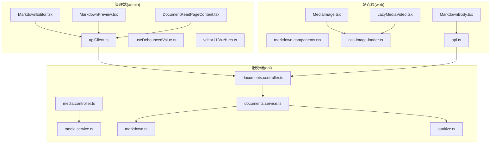
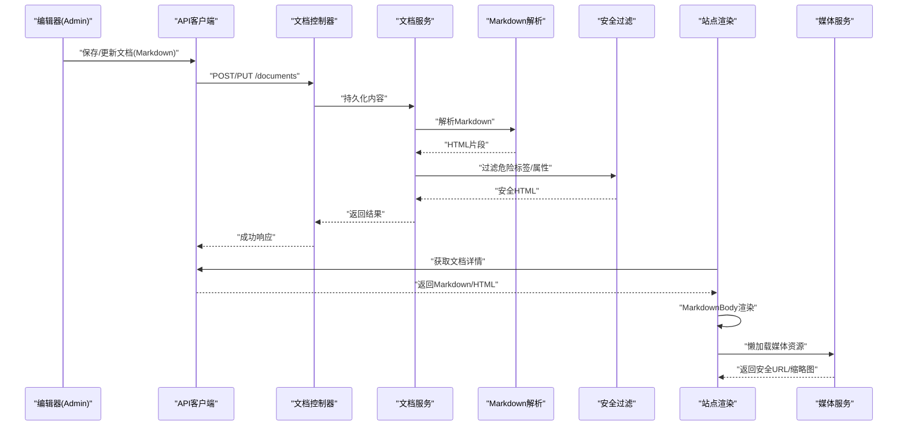
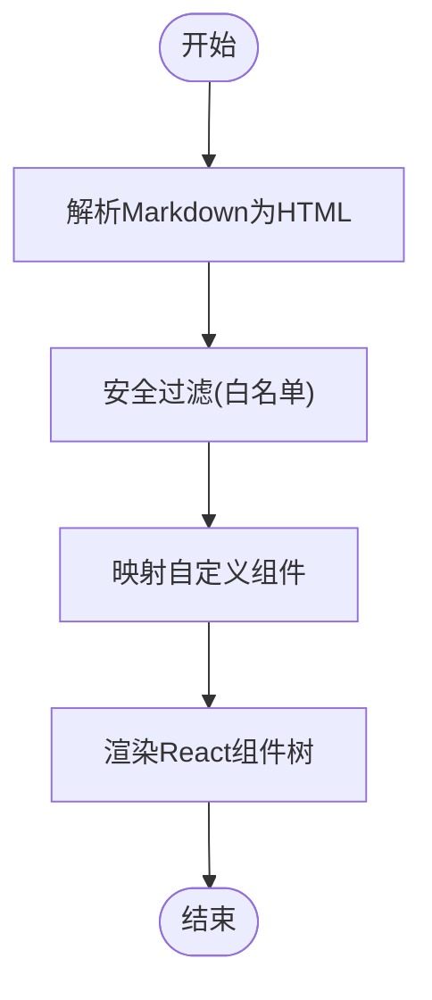
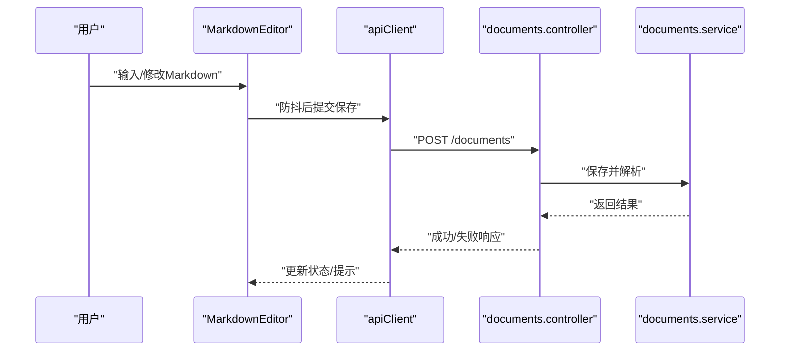
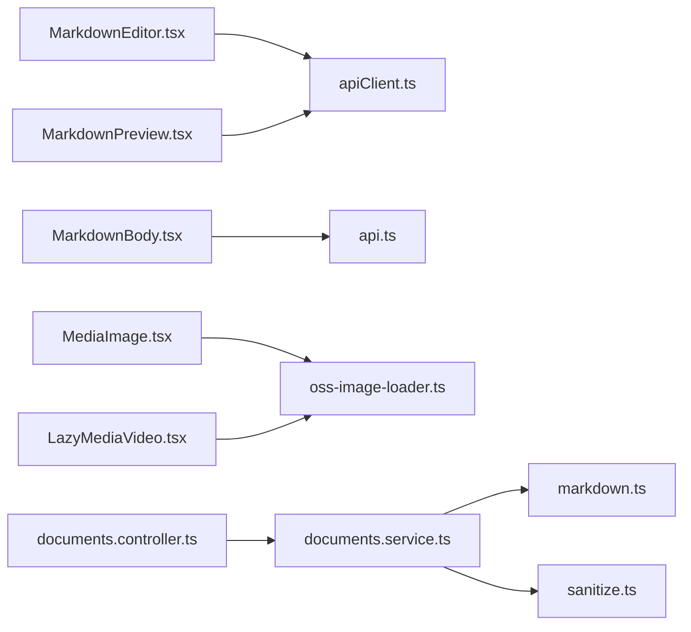

# 内容渲染引擎

<cite>
**本文引用的文件**   
- [MarkdownEditor.tsx](file://apps/admin/src/components/crud/MarkdownEditor.tsx)
- [MarkdownPreview.tsx](file://apps/admin/src/components/documents/MarkdownPreview.tsx)
- [DocumentReadPageContent.tsx](file://apps/admin/src/components/documents/DocumentReadPageContent.tsx)
- [MarkdownBody.tsx](file://apps/web/src/components/content/MarkdownBody.tsx)
- [markdown-components.tsx](file://apps/web/src/components/content/markdown-components.tsx)
- [sanitize.ts](file://apps/api/src/common/utils/sanitize.ts)
- [markdown.ts](file://apps/api/src/common/utils/markdown.ts)
- [apiClient.ts](file://apps/admin/src/lib/apiClient.ts)
- [api.ts](file://apps/web/src/lib/api.ts)
- [oss-image-loader.ts](file://apps/web/src/lib/oss-image-loader.ts)
- [MediaImage.tsx](file://apps/web/src/components/MediaImage.tsx)
- [LazyMediaVideo.tsx](file://apps/web/src/components/LazyMediaVideo.tsx)
- [useDebouncedValue.ts](file://apps/admin/src/hooks/useDebouncedValue.ts)
- [vditor-i18n-zh-cn.ts](file://apps/admin/src/lib/vditor-i18n-zh-cn.ts)
- [documents.controller.ts](file:///apps/api/src/documents/documents.controller.ts)
- [documents.service.ts](file://apps/api/src/documents/documents.service.ts)
- [media.controller.ts](file://apps/api/src/media/media.controller.ts)
- [media.service.ts](file://apps/api/src/media/media.service.ts)
- [next.config.ts](file://apps/web/next.config.ts)
</cite>

## 目录
1. [简介](#简介)
2. [项目结构](#项目结构)
3. [核心组件](#核心组件)
4. [架构总览](#架构总览)
5. [详细组件分析](#详细组件分析)
6. [依赖关系分析](#依赖关系分析)
7. [性能考虑](#性能考虑)
8. [故障排查指南](#故障排查指南)
9. [结论](#结论)
10. [附录](#附录)

## 简介
本文件面向“内容渲染引擎”，聚焦于 Markdown 到 HTML 的转换、自定义组件集成、安全过滤机制，以及富文本编辑器与后端 API 的交互、实时预览与版本对比能力。同时覆盖内容缓存策略、懒加载优化、跨平台兼容性实现细节，并提供性能优化、错误处理与调试工具使用指南。

## 项目结构
本项目采用前后端分离的多应用结构：
- admin（管理端）：提供 Markdown 编辑器、文档编辑与阅读界面、媒体选择器、API 客户端等。
- web（站点端）：负责内容渲染、图片/视频懒加载、SEO 与国际化。
- api（服务端）：提供文档、媒体、设置等 REST API，包含 Markdown 解析与安全过滤工具。

图表来源
- [MarkdownEditor.tsx](file://apps/admin/src/components/crud/MarkdownEditor.tsx)
- [MarkdownPreview.tsx](file://apps/admin/src/components/documents/MarkdownPreview.tsx)
- [DocumentReadPageContent.tsx](file://apps/admin/src/components/documents/DocumentReadPageContent.tsx)
- [apiClient.ts](file://apps/admin/src/lib/apiClient.ts)
- [useDebouncedValue.ts](file://apps/admin/src/hooks/useDebouncedValue.ts)
- [vditor-i18n-zh-cn.ts](file://apps/admin/src/lib/vditor-i18n-zh-cn.ts)
- [MarkdownBody.tsx](file://apps/web/src/components/content/MarkdownBody.tsx)
- [markdown-components.tsx](file://apps/web/src/components/content/markdown-components.tsx)
- [MediaImage.tsx](file://apps/web/src/components/MediaImage.tsx)
- [LazyMediaVideo.tsx](file://apps/web/src/components/LazyMediaVideo.tsx)
- [oss-image-loader.ts](file://apps/web/src/lib/oss-image-loader.ts)
- [api.ts](file://apps/web/src/lib/api.ts)
- [documents.controller.ts](file://apps/api/src/documents/documents.controller.ts)
- [documents.service.ts](file://apps/api/src/documents/documents.service.ts)
- [media.controller.ts](file://apps/api/src/media/media.controller.ts)
- [media.service.ts](file://apps/api/src/media/media.service.ts)
- [markdown.ts](file://apps/api/src/common/utils/markdown.ts)
- [sanitize.ts](file://apps/api/src/common/utils/sanitize.ts)

章节来源
- [next.config.ts](file://apps/web/next.config.ts)

## 核心组件
- 编辑器与预览（admin）
  - MarkdownEditor.tsx：基于 Vditor 的 Markdown 编辑器，支持中文本地化、工具栏配置、上传与预览。
  - MarkdownPreview.tsx：将 Markdown 转换为 HTML 进行预览，可对接服务端渲染或前端渲染。
  - DocumentReadPageContent.tsx：文档阅读页的内容容器，负责获取数据、渲染与交互。
- 站点渲染（web）
  - MarkdownBody.tsx：站点侧 Markdown 渲染主体，统一样式与组件映射。
  - markdown-components.tsx：自定义 Markdown 组件集合（如代码块、表格、链接等）。
  - MediaImage.tsx / LazyMediaVideo.tsx：媒体懒加载组件，结合 OSS 图片处理器。
  - oss-image-loader.ts：Next.js 图片加载器，适配远程资源与尺寸裁剪。
- 服务端工具（api）
  - markdown.ts：Markdown 解析与转换逻辑。
  - sanitize.ts：HTML 安全过滤，防止 XSS 攻击。
- API 客户端
  - admin 端 apiClient.ts：封装请求、重试、鉴权等。
  - web 端 api.ts：站点侧 API 调用封装。

章节来源
- [MarkdownEditor.tsx](file://apps/admin/src/components/crud/MarkdownEditor.tsx)
- [MarkdownPreview.tsx](file://apps/admin/src/components/documents/MarkdownPreview.tsx)
- [DocumentReadPageContent.tsx](file://apps/admin/src/components/documents/DocumentReadPageContent.tsx)
- [MarkdownBody.tsx](file://apps/web/src/components/content/MarkdownBody.tsx)
- [markdown-components.tsx](file://apps/web/src/components/content/markdown-components.tsx)
- [MediaImage.tsx](file://apps/web/src/components/MediaImage.tsx)
- [LazyMediaVideo.tsx](file://apps/web/src/components/LazyMediaVideo.tsx)
- [oss-image-loader.ts](file://apps/web/src/lib/oss-image-loader.ts)
- [markdown.ts](file://apps/api/src/common/utils/markdown.ts)
- [sanitize.ts](file://apps/api/src/common/utils/sanitize.ts)
- [apiClient.ts](file://apps/admin/src/lib/apiClient.ts)
- [api.ts](file://apps/web/src/lib/api.ts)

## 架构总览
内容渲染引擎的整体流程如下：
- 编辑阶段（admin）：用户在 MarkdownEditor 中编辑内容，通过 apiClient 调用后端接口保存草稿/发布；MarkdownPreview 提供实时预览。
- 渲染阶段（web）：页面通过 api.ts 拉取 Markdown 内容，MarkdownBody 将其转换为 HTML，并注入自定义组件；媒体资源由 MediaImage/LazyMediaVideo 懒加载，OSS 图片加载器负责尺寸与格式优化。
- 服务端处理（api）：文档控制器与服务层负责持久化与查询；markdown.ts 负责解析，sanitize.ts 负责安全过滤；媒体控制器与服务层负责上传、访问控制与水印等。

图表来源
- [MarkdownEditor.tsx](file://apps/admin/src/components/crud/MarkdownEditor.tsx)
- [apiClient.ts](file://apps/admin/src/lib/apiClient.ts)
- [documents.controller.ts](file://apps/api/src/documents/documents.controller.ts)
- [documents.service.ts](file://apps/api/src/documents/documents.service.ts)
- [markdown.ts](file://apps/api/src/common/utils/markdown.ts)
- [sanitize.ts](file://apps/api/src/common/utils/sanitize.ts)
- [MarkdownBody.tsx](file://apps/web/src/components/content/MarkdownBody.tsx)
- [MediaImage.tsx](file://apps/web/src/components/MediaImage.tsx)
- [LazyMediaVideo.tsx](file://apps/web/src/components/LazyMediaVideo.tsx)
- [media.controller.ts](file://apps/api/src/media/media.controller.ts)
- [media.service.ts](file://apps/api/src/media/media.service.ts)

## 详细组件分析

### Markdown 到 HTML 的转换过程
- 服务端解析（api）
  - markdown.ts：负责将 Markdown 文本转换为 HTML 片段，可能包括语法高亮、表格、列表、数学公式等扩展。
  - sanitize.ts：对生成的 HTML 进行白名单过滤，移除脚本、事件属性、危险协议等，确保输出安全。
- 前端渲染（web）
  - MarkdownBody.tsx：接收 Markdown 或 HTML，调用解析库或已清洗的 HTML 进行渲染。
  - markdown-components.tsx：定义自定义组件映射，例如将特定的 Markdown 语法节点映射为 React 组件，实现业务组件嵌入。

图表来源
- [markdown.ts](file://apps/api/src/common/utils/markdown.ts)
- [sanitize.ts](file://apps/api/src/common/utils/sanitize.ts)
- [MarkdownBody.tsx](file://apps/web/src/components/content/MarkdownBody.tsx)
- [markdown-components.tsx](file://apps/web/src/components/content/markdown-components.tsx)

章节来源
- [markdown.ts](file://apps/api/src/common/utils/markdown.ts)
- [sanitize.ts](file://apps/api/src/common/utils/sanitize.ts)
- [MarkdownBody.tsx](file://apps/web/src/components/content/MarkdownBody.tsx)
- [markdown-components.tsx](file://apps/web/src/components/content/markdown-components.tsx)

### 自定义组件集成
- 组件映射策略
  - 在 markdown-components.tsx 中定义节点到组件的映射规则，例如将特定标题、引用块、代码块、表格等映射为业务组件。
  - MarkdownBody.tsx 在渲染时根据映射表替换默认元素为自定义组件，从而实现灵活扩展。
- 样式与行为
  - 自定义组件可继承主题样式，或通过 props 传入配置项，保证在不同页面保持一致体验。
  - 对于交互型组件（如展开折叠、动态加载），应在组件内部处理状态与副作用。

章节来源
- [markdown-components.tsx](file://apps/web/src/components/content/markdown-components.tsx)
- [MarkdownBody.tsx](file://apps/web/src/components/content/MarkdownBody.tsx)

### 安全过滤机制
- 白名单策略
  - sanitize.ts 维护允许通过的标签与属性白名单，拒绝脚本、事件处理器、危险协议（如 javascript:）、内联样式等。
- 输入校验与输出清洗
  - 在服务端对 Markdown 生成的 HTML 进行二次清洗，确保即使前端绕过也能保障安全。
- 跨域与资源安全
  - 媒体资源通过受控 URL 生成与校验，避免直接暴露敏感路径。

章节来源
- [sanitize.ts](file://apps/api/src/common/utils/sanitize.ts)
- [media.controller.ts](file://apps/api/src/media/media.controller.ts)
- [media.service.ts](file://apps/api/src/media/media.service.ts)

### 富文本编辑器与后端 API 的交互
- 编辑器（admin）
  - MarkdownEditor.tsx：集成 Vditor，支持中文本地化、工具栏、图片上传、实时预览。
  - useDebouncedValue.ts：用于防抖输入，减少频繁请求。
  - apiClient.ts：封装请求方法，处理鉴权头、错误码、重试策略。
- 后端（api）
  - documents.controller.ts：定义文档相关路由，接收保存/更新请求。
  - documents.service.ts：业务逻辑，包括内容校验、解析、存储与返回。

图表来源
- [MarkdownEditor.tsx](file://apps/admin/src/components/crud/MarkdownEditor.tsx)
- [useDebouncedValue.ts](file://apps/admin/src/hooks/useDebouncedValue.ts)
- [apiClient.ts](file://apps/admin/src/lib/apiClient.ts)
- [documents.controller.ts](file://apps/api/src/documents/documents.controller.ts)
- [documents.service.ts](file://apps/api/src/documents/documents.service.ts)

章节来源
- [MarkdownEditor.tsx](file://apps/admin/src/components/crud/MarkdownEditor.tsx)
- [useDebouncedValue.ts](file://apps/admin/src/hooks/useDebouncedValue.ts)
- [apiClient.ts](file://apps/admin/src/lib/apiClient.ts)
- [documents.controller.ts](file://apps/api/src/documents/documents.controller.ts)
- [documents.service.ts](file://apps/api/src/documents/documents.service.ts)

### 实时预览与版本对比
- 实时预览
  - MarkdownPreview.tsx：在编辑器旁展示渲染后的 HTML，支持同步滚动与高亮。
  - 可通过服务端渲染或前端解析两种方式实现，建议优先使用服务端以保障一致性与安全性。
- 版本对比
  - 在文档读取页（DocumentReadPageContent.tsx）中，可引入差异对比库，比较当前版本与历史版本的 Markdown/HTML 差异。
  - 对比结果可高亮新增、删除、修改的行，便于审核与回滚。

章节来源
- [MarkdownPreview.tsx](file://apps/admin/src/components/documents/MarkdownPreview.tsx)
- [DocumentReadPageContent.tsx](file://apps/admin/src/components/documents/DocumentReadPageContent.tsx)

### 内容缓存策略
- 服务端缓存
  - 对热点文档的解析结果进行缓存（如 Redis），降低重复解析开销。
  - 缓存键包含文档 ID、版本号、语言等维度，确保一致性。
- 前端缓存
  - Next.js 静态生成与增量再生成（ISR）可用于站点页面缓存。
  - 浏览器缓存与 Service Worker 可用于媒体资源与静态资产。

章节来源
- [documents.service.ts](file://apps/api/src/documents/documents.service.ts)
- [next.config.ts](file://apps/web/next.config.ts)

### 懒加载优化
- 图片懒加载
  - MediaImage.tsx：基于 IntersectionObserver 实现按需加载，结合 Next.js 图片优化。
  - oss-image-loader.ts：统一图片加载策略，支持尺寸裁剪、格式转换、CDN 加速。
- 视频懒加载
  - LazyMediaVideo.tsx：延迟初始化播放器，减少首屏负担。

章节来源
- [MediaImage.tsx](file://apps/web/src/components/MediaImage.tsx)
- [LazyMediaVideo.tsx](file://apps/web/src/components/LazyMediaVideo.tsx)
- [oss-image-loader.ts](file://apps/web/src/lib/oss-image-loader.ts)

### 跨平台兼容性
- 浏览器兼容
  - 针对旧版浏览器降级处理（如不支持 IntersectionObserver 时使用轮询）。
  - CSS 与 JS 特性检测与 polyfill 注入。
- 移动端适配
  - 响应式布局与触摸事件优化，确保编辑器与预览在移动端可用。
- 国际化
  - vditor-i18n-zh-cn.ts：为编辑器提供中文本地化文案。

章节来源
- [vditor-i18n-zh-cn.ts](file://apps/admin/src/lib/vditor-i18n-zh-cn.ts)
- [next.config.ts](file://apps/web/next.config.ts)

## 依赖关系分析
- 模块耦合
  - 编辑器与预览强依赖 API 客户端；站点渲染依赖媒体服务与图片加载器。
  - 服务端文档服务依赖解析与安全工具，形成清晰的分层。
- 外部依赖
  - Vditor（编辑器）、Next.js（站点框架）、Prisma（数据库 ORM）、MinIO/OSS（对象存储）。
- 潜在循环依赖
  - 确保组件与工具函数之间单向依赖，避免循环导入。

图表来源
- [MarkdownEditor.tsx](file://apps/admin/src/components/crud/MarkdownEditor.tsx)
- [MarkdownPreview.tsx](file://apps/admin/src/components/documents/MarkdownPreview.tsx)
- [apiClient.ts](file://apps/admin/src/lib/apiClient.ts)
- [MarkdownBody.tsx](file://apps/web/src/components/content/MarkdownBody.tsx)
- [api.ts](file://apps/web/src/lib/api.ts)
- [MediaImage.tsx](file://apps/web/src/components/MediaImage.tsx)
- [LazyMediaVideo.tsx](file://apps/web/src/components/LazyMediaVideo.tsx)
- [oss-image-loader.ts](file://apps/web/src/lib/oss-image-loader.ts)
- [documents.controller.ts](file://apps/api/src/documents/documents.controller.ts)
- [documents.service.ts](file://apps/api/src/documents/documents.service.ts)
- [markdown.ts](file://apps/api/src/common/utils/markdown.ts)
- [sanitize.ts](file://apps/api/src/common/utils/sanitize.ts)

章节来源
- [documents.controller.ts](file://apps/api/src/documents/documents.controller.ts)
- [documents.service.ts](file://apps/api/src/documents/documents.service.ts)
- [markdown.ts](file://apps/api/src/common/utils/markdown.ts)
- [sanitize.ts](file://apps/api/src/common/utils/sanitize.ts)
- [apiClient.ts](file://apps/admin/src/lib/apiClient.ts)
- [api.ts](file://apps/web/src/lib/api.ts)

## 性能考虑
- 解析与渲染
  - 服务端缓存解析结果，减少重复计算。
  - 前端按需加载组件与媒体资源，降低首屏体积。
- 网络与缓存
  - 合理使用 HTTP 缓存头与 CDN 缓存策略。
  - 对大文件启用分片下载与断点续传。
- 内存与 CPU
  - 避免在渲染过程中执行重型计算，必要时使用 Web Worker。
  - 限制并发请求数量，避免阻塞主线程。

[本节为通用指导，不直接分析具体文件]

## 故障排查指南
- 常见问题定位
  - 编辑器无法预览：检查 Markdown 语法与自定义组件映射是否正确。
  - 图片加载失败：确认 OSS 配置、跨域策略与图片加载器参数。
  - 安全过滤误伤：调整 sanitize.ts 白名单，保留必要标签与属性。
- 调试工具
  - 浏览器开发者工具：查看网络请求、控制台日志与 DOM 结构。
  - 服务端日志：记录解析与过滤过程的中间结果，便于问题回溯。
- 错误处理
  - 统一错误码与提示信息，前端友好展示。
  - 对超时与重试进行配置，提升稳定性。

章节来源
- [sanitize.ts](file://apps/api/src/common/utils/sanitize.ts)
- [MediaImage.tsx](file://apps/web/src/components/MediaImage.tsx)
- [MarkdownBody.tsx](file://apps/web/src/components/content/MarkdownBody.tsx)

## 结论
内容渲染引擎通过清晰的前后端分层、严格的安全过滤与灵活的组件映射，实现了从 Markdown 到高质量 HTML 的稳定转换。结合懒加载、缓存与跨平台兼容策略，系统在性能与用户体验方面具备良好表现。建议在后续迭代中持续优化解析效率、增强错误诊断能力，并完善监控与告警体系。

[本节为总结性内容，不直接分析具体文件]

## 附录
- 最佳实践
  - 始终在服务端进行安全过滤，前端仅做展示。
  - 使用统一的媒体加载器与图片优化策略。
  - 对关键路径添加单元测试与集成测试。
- 参考文件
  - 编辑器与预览：MarkdownEditor.tsx、MarkdownPreview.tsx
  - 站点渲染：MarkdownBody.tsx、markdown-components.tsx
  - 安全与解析：sanitize.ts、markdown.ts
  - 媒体与懒加载：MediaImage.tsx、LazyMediaVideo.tsx、oss-image-loader.ts
  - API 客户端：apiClient.ts、api.ts

[本节为补充信息，不直接分析具体文件]