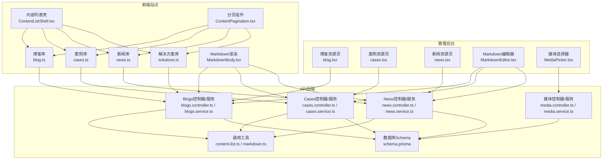
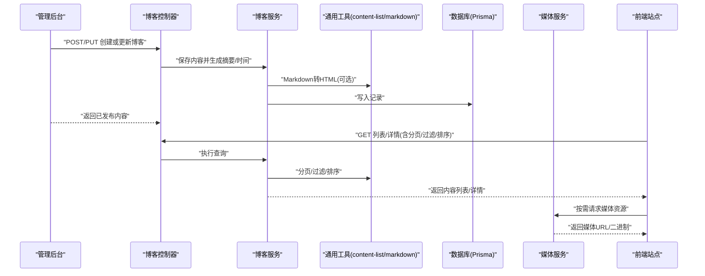
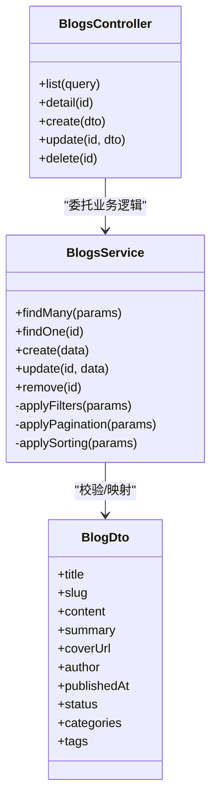
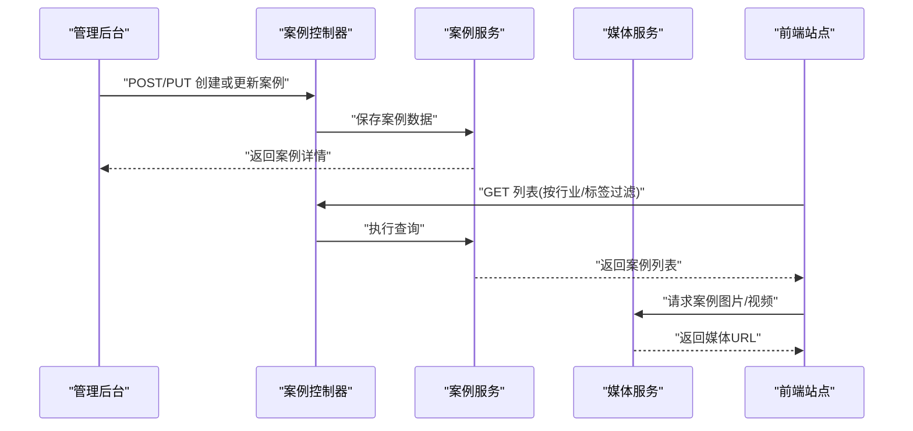
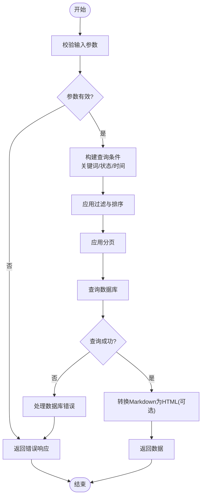
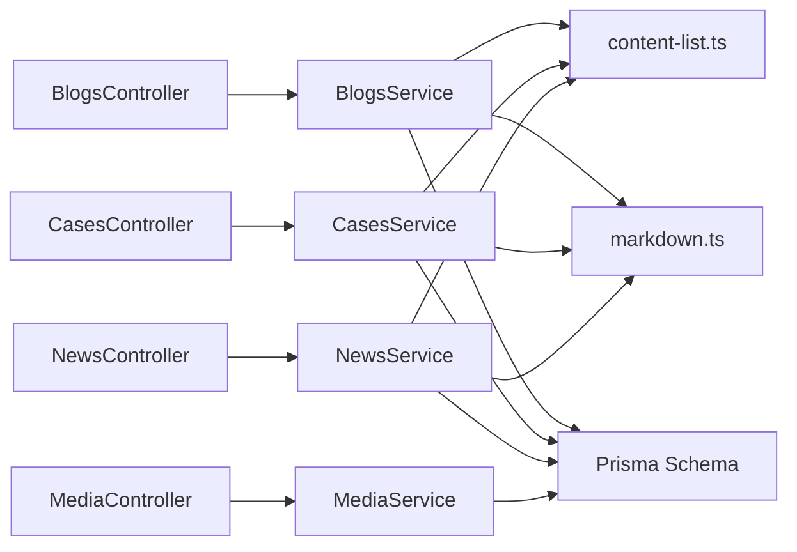

# 内容管理系统

<cite>
**本文引用的文件**   
- [apps/api/src/blogs/blogs.controller.ts](file://apps/api/src/blogs/blogs.controller.ts)
- [apps/api/src/blogs/blogs.service.ts](file://apps/api/src/blogs/blogs.service.ts)
- [apps/api/src/blogs/dto/blog.dto.ts](file://apps/api/src/blogs/dto/blog.dto.ts)
- [apps/api/src/cases/cases.controller.ts](file://apps/api/src/cases/cases.controller.ts)
- [apps/api/src/cases/cases.service.ts](file://apps/api/src/cases/cases.service.ts)
- [apps/api/src/cases/dto/case.dto.ts](file://apps/api/src/cases/dto/case.dto.ts)
- [apps/api/src/news/news.controller.ts](file://apps/api/src/news/news.controller.ts)
- [apps/api/src/news/news.service.ts](file://apps/api/src/news/news.service.ts)
- [apps/api/src/news/dto/news.dto.ts](file://apps/api/src/news/dto/news.dto.ts)
- [apps/api/src/common/utils/content-list.ts](file://apps/api/src/common/utils/content-list.ts)
- [apps/api/src/common/utils/markdown.ts](file://apps/api/src/common/utils/markdown.ts)
- [apps/api/src/media/media.controller.ts](file://apps/api/src/media/media.controller.ts)
- [apps/api/src/media/media.service.ts](file://apps/api/src/media/media.service.ts)
- [apps/api/prisma/schema.prisma](file://apps/api/prisma/schema.prisma)
- [apps/admin/src/features/resources/blog.tsx](file://apps/admin/src/features/resources/blog.tsx)
- [apps/admin/src/features/resources/cases.tsx](file://apps/admin/src/features/resources/cases.tsx)
- [apps/admin/src/features/resources/news.tsx](file://apps/admin/src/features/resources/news.tsx)
- [apps/admin/src/components/crud/MarkdownEditor.tsx](file://apps/admin/src/components/crud/MarkdownEditor.tsx)
- [apps/admin/src/components/crud/MediaPicker.tsx](file://apps/admin/src/components/crud/MediaPicker.tsx)
- [apps/web/src/lib/blog.ts](file://apps/web/src/lib/blog.ts)
- [apps/web/src/lib/cases.ts](file://apps/web/src/lib/cases.ts)
- [apps/web/src/lib/news.ts](file://apps/web/src/lib/news.ts)
- [apps/web/src/lib/solutions.ts](file://apps/web/src/lib/solutions.ts)
- [apps/web/src/components/content/ContentListShell.tsx](file://apps/web/src/components/content/ContentListShell.tsx)
- [apps/web/src/components/content/ContentPagination.tsx](file://apps/web/src/components/content/ContentPagination.tsx)
- [apps/web/src/components/content/MarkdownBody.tsx](file://apps/web/src/components/content/MarkdownBody.tsx)
</cite>

## 目录
1. [简介](#简介)
2. [项目结构](#项目结构)
3. [核心组件](#核心组件)
4. [架构总览](#架构总览)
5. [详细组件分析](#详细组件分析)
6. [依赖关系分析](#依赖关系分析)
7. [性能考量](#性能考量)
8. [故障排查指南](#故障排查指南)
9. [结论](#结论)
10. [附录](#附录)

## 简介
本文件系统性地梳理基于API后端的CMS能力，覆盖博客文章、案例研究、新闻稿与产品解决方案的内容获取、展示与管理。文档重点说明：
- 内容数据结构与字段约定
- 分页加载、搜索过滤与分类标签体系
- Markdown渲染、富文本编辑器与媒体资源嵌入
- 内容更新流程与版本管理最佳实践

该文档面向开发者与内容运营人员，既提供高层架构概览，也给出代码级实现要点与排错建议。

## 项目结构
系统采用前后端分离的多应用架构：
- API后端（NestJS）：提供REST接口，统一处理内容CRUD、分页、过滤、排序、Markdown转换与媒体访问。
- 管理后台（Next.js Admin）：提供可视化编辑界面，集成Markdown编辑器与媒体选择器，调用API完成内容维护。
- 前端站点（Next.js Web）：负责内容列表与详情渲染，支持分页、搜索、分类标签与Markdown渲染。

图表来源
- [apps/api/src/blogs/blogs.controller.ts](file://apps/api/src/blogs/blogs.controller.ts)
- [apps/api/src/blogs/blogs.service.ts](file://apps/api/src/blogs/blogs.service.ts)
- [apps/api/src/cases/cases.controller.ts](file://apps/api/src/cases/cases.controller.ts)
- [apps/api/src/cases/cases.service.ts](file://apps/api/src/cases/cases.service.ts)
- [apps/api/src/news/news.controller.ts](file://apps/api/src/news/news.controller.ts)
- [apps/api/src/news/news.service.ts](file://apps/api/src/news/news.service.ts)
- [apps/api/src/media/media.controller.ts](file://apps/api/src/media/media.controller.ts)
- [apps/api/src/media/media.service.ts](file://apps/api/src/media/media.service.ts)
- [apps/api/src/common/utils/content-list.ts](file://apps/api/src/common/utils/content-list.ts)
- [apps/api/src/common/utils/markdown.ts](file://apps/api/src/common/utils/markdown.ts)
- [apps/api/prisma/schema.prisma](file://apps/api/prisma/schema.prisma)
- [apps/admin/src/features/resources/blog.tsx](file://apps/admin/src/features/resources/blog.tsx)
- [apps/admin/src/features/resources/cases.tsx](file://apps/admin/src/features/resources/cases.tsx)
- [apps/admin/src/features/resources/news.tsx](file://apps/admin/src/features/resources/news.tsx)
- [apps/admin/src/components/crud/MarkdownEditor.tsx](file://apps/admin/src/components/crud/MarkdownEditor.tsx)
- [apps/admin/src/components/crud/MediaPicker.tsx](file://apps/admin/src/components/crud/MediaPicker.tsx)
- [apps/web/src/lib/blog.ts](file://apps/web/src/lib/blog.ts)
- [apps/web/src/lib/cases.ts](file://apps/web/src/lib/cases.ts)
- [apps/web/src/lib/news.ts](file://apps/web/src/lib/news.ts)
- [apps/web/src/lib/solutions.ts](file://apps/web/src/lib/solutions.ts)
- [apps/web/src/components/content/ContentListShell.tsx](file://apps/web/src/components/content/ContentListShell.tsx)
- [apps/web/src/components/content/ContentPagination.tsx](file://apps/web/src/components/content/ContentPagination.tsx)
- [apps/web/src/components/content/MarkdownBody.tsx](file://apps/web/src/components/content/MarkdownBody.tsx)

章节来源
- [apps/api/src/blogs/blogs.controller.ts](file://apps/api/src/blogs/blogs.controller.ts)
- [apps/api/src/blogs/blogs.service.ts](file://apps/api/src/blogs/blogs.service.ts)
- [apps/api/src/cases/cases.controller.ts](file://apps/api/src/cases/cases.controller.ts)
- [apps/api/src/cases/cases.service.ts](file://apps/api/src/cases/cases.service.ts)
- [apps/api/src/news/news.controller.ts](file://apps/api/src/news/news.controller.ts)
- [apps/api/src/news/news.service.ts](file://apps/api/src/news/news.service.ts)
- [apps/api/src/media/media.controller.ts](file://apps/api/src/media/media.controller.ts)
- [apps/api/src/media/media.service.ts](file://apps/api/src/media/media.service.ts)
- [apps/api/src/common/utils/content-list.ts](file://apps/api/src/common/utils/content-list.ts)
- [apps/api/src/common/utils/markdown.ts](file://apps/api/src/common/utils/markdown.ts)
- [apps/api/prisma/schema.prisma](file://apps/api/prisma/schema.prisma)
- [apps/admin/src/features/resources/blog.tsx](file://apps/admin/src/features/resources/blog.tsx)
- [apps/admin/src/features/resources/cases.tsx](file://apps/admin/src/features/resources/cases.tsx)
- [apps/admin/src/features/resources/news.tsx](file://apps/admin/src/features/resources/news.tsx)
- [apps/admin/src/components/crud/MarkdownEditor.tsx](file://apps/admin/src/components/crud/MarkdownEditor.tsx)
- [apps/admin/src/components/crud/MediaPicker.tsx](file://apps/admin/src/components/crud/MediaPicker.tsx)
- [apps/web/src/lib/blog.ts](file://apps/web/src/lib/blog.ts)
- [apps/web/src/lib/cases.ts](file://apps/web/src/lib/cases.ts)
- [apps/web/src/lib/news.ts](file://apps/web/src/lib/news.ts)
- [apps/web/src/lib/solutions.ts](file://apps/web/src/lib/solutions.ts)
- [apps/web/src/components/content/ContentListShell.tsx](file://apps/web/src/components/content/ContentListShell.tsx)
- [apps/web/src/components/content/ContentPagination.tsx](file://apps/web/src/components/content/ContentPagination.tsx)
- [apps/web/src/components/content/MarkdownBody.tsx](file://apps/web/src/components/content/MarkdownBody.tsx)

## 核心组件
- 内容域模块
  - 博客：控制器与服务暴露列表、详情、创建、更新、删除等接口；DTO定义输入校验；服务层封装Prisma查询与分页、过滤、排序。
  - 案例研究：结构与博客类似，强调案例相关字段与筛选维度。
  - 新闻稿：与博客相近，侧重发布时间与状态控制。
  - 产品解决方案：通过Web侧库聚合数据，后端可复用通用内容能力或独立扩展。
- 通用工具
  - content-list.ts：统一分页、过滤、排序、计数逻辑，减少重复代码。
  - markdown.ts：将Markdown转换为HTML，供详情渲染使用。
- 媒体服务
  - media.controller.ts / media.service.ts：上传、预览、访问令牌、水印等能力，为编辑器与内容嵌入提供支撑。
- 管理后台
  - 资源页面：按领域组织列表与表单，调用对应API进行CRUD。
  - MarkdownEditor.tsx：基于Vditor的Markdown编辑器，支持实时预览与媒体插入。
  - MediaPicker.tsx：媒体选择弹窗，返回媒体URL供内容引用。
- 前端站点
  - 内容库：blog.ts / cases.ts / news.ts / solutions.ts 封装API调用与类型定义。
  - ContentListShell.tsx：统一的列表容器，承载搜索、过滤、标签、分页。
  - ContentPagination.tsx：分页控件，与后端分页参数对齐。
  - MarkdownBody.tsx：客户端Markdown渲染组件，配合服务端转换结果展示。

章节来源
- [apps/api/src/blogs/blogs.controller.ts](file://apps/api/src/blogs/blogs.controller.ts)
- [apps/api/src/blogs/blogs.service.ts](file://apps/api/src/blogs/blogs.service.ts)
- [apps/api/src/cases/cases.controller.ts](file://apps/api/src/cases/cases.controller.ts)
- [apps/api/src/cases/cases.service.ts](file://apps/api/src/cases/cases.service.ts)
- [apps/api/src/news/news.controller.ts](file://apps/api/src/news/news.controller.ts)
- [apps/api/src/news/news.service.ts](file://apps/api/src/news/news.service.ts)
- [apps/api/src/common/utils/content-list.ts](file://apps/api/src/common/utils/content-list.ts)
- [apps/api/src/common/utils/markdown.ts](file://apps/api/src/common/utils/markdown.ts)
- [apps/api/src/media/media.controller.ts](file://apps/api/src/media/media.controller.ts)
- [apps/api/src/media/media.service.ts](file://apps/api/src/media/media.service.ts)
- [apps/admin/src/features/resources/blog.tsx](file://apps/admin/src/features/resources/blog.tsx)
- [apps/admin/src/features/resources/cases.tsx](file://apps/admin/src/features/resources/cases.tsx)
- [apps/admin/src/features/resources/news.tsx](file://apps/admin/src/features/resources/news.tsx)
- [apps/admin/src/components/crud/MarkdownEditor.tsx](file://apps/admin/src/components/crud/MarkdownEditor.tsx)
- [apps/admin/src/components/crud/MediaPicker.tsx](file://apps/admin/src/components/crud/MediaPicker.tsx)
- [apps/web/src/lib/blog.ts](file://apps/web/src/lib/blog.ts)
- [apps/web/src/lib/cases.ts](file://apps/web/src/lib/cases.ts)
- [apps/web/src/lib/news.ts](file://apps/web/src/lib/news.ts)
- [apps/web/src/lib/solutions.ts](file://apps/web/src/lib/solutions.ts)
- [apps/web/src/components/content/ContentListShell.tsx](file://apps/web/src/components/content/ContentListShell.tsx)
- [apps/web/src/components/content/ContentPagination.tsx](file://apps/web/src/components/content/ContentPagination.tsx)
- [apps/web/src/components/content/MarkdownBody.tsx](file://apps/web/src/components/content/MarkdownBody.tsx)

## 架构总览
整体数据流遵循“管理后台编辑 → API持久化 → 前端站点消费”的模式。通用工具层抽象了分页、过滤、排序与Markdown转换，确保多内容域的一致性。媒体服务解耦存储与访问策略，便于替换不同对象存储后端。

图表来源
- [apps/api/src/blogs/blogs.controller.ts](file://apps/api/src/blogs/blogs.controller.ts)
- [apps/api/src/blogs/blogs.service.ts](file://apps/api/src/blogs/blogs.service.ts)
- [apps/api/src/common/utils/content-list.ts](file://apps/api/src/common/utils/content-list.ts)
- [apps/api/src/common/utils/markdown.ts](file://apps/api/src/common/utils/markdown.ts)
- [apps/api/src/media/media.controller.ts](file://apps/api/src/media/media.controller.ts)
- [apps/api/src/media/media.service.ts](file://apps/api/src/media/media.service.ts)

## 详细组件分析

### 博客模块（Blogs）
- 职责
  - 提供博客内容的CRUD接口
  - 支持标题、正文（Markdown）、摘要、封面图、作者、发布时间、状态、分类、标签等字段
  - 列表接口支持分页、关键词搜索、分类/标签过滤、排序
- 关键实现
  - DTO定义输入校验规则
  - Service层封装Prisma查询，结合content-list.ts实现分页与过滤
  - 详情接口可选择返回HTML（由markdown.ts转换）或直接返回Markdown
- 典型交互
  - 管理后台通过MarkdownEditor编辑内容，提交到API
  - 前端站点通过lib/blog.ts拉取列表与详情，使用MarkdownBody渲染

图表来源
- [apps/api/src/blogs/blogs.controller.ts](file://apps/api/src/blogs/blogs.controller.ts)
- [apps/api/src/blogs/blogs.service.ts](file://apps/api/src/blogs/blogs.service.ts)
- [apps/api/src/blogs/dto/blog.dto.ts](file://apps/api/src/blogs/dto/blog.dto.ts)

章节来源
- [apps/api/src/blogs/blogs.controller.ts](file://apps/api/src/blogs/blogs.controller.ts)
- [apps/api/src/blogs/blogs.service.ts](file://apps/api/src/blogs/blogs.service.ts)
- [apps/api/src/blogs/dto/blog.dto.ts](file://apps/api/src/blogs/dto/blog.dto.ts)
- [apps/admin/src/features/resources/blog.tsx](file://apps/admin/src/features/resources/blog.tsx)
- [apps/web/src/lib/blog.ts](file://apps/web/src/lib/blog.ts)

### 案例研究模块（Cases）
- 职责
  - 管理案例研究内容，通常包含客户名称、行业、问题描述、解决方案、成果指标、配图与视频等
  - 列表支持按行业、标签、时间范围过滤
- 关键实现
  - 与博客类似的CRUD与分页过滤模式
  - 媒体资源常用于案例配图与演示视频
- 典型交互
  - 管理后台编辑案例详情，插入媒体资源
  - 前端站点展示案例卡片与详情页，支持按行业/标签筛选

图表来源
- [apps/api/src/cases/cases.controller.ts](file://apps/api/src/cases/cases.controller.ts)
- [apps/api/src/cases/cases.service.ts](file://apps/api/src/cases/cases.service.ts)
- [apps/api/src/media/media.controller.ts](file://apps/api/src/media/media.controller.ts)

章节来源
- [apps/api/src/cases/cases.controller.ts](file://apps/api/src/cases/cases.controller.ts)
- [apps/api/src/cases/cases.service.ts](file://apps/api/src/cases/cases.service.ts)
- [apps/api/src/cases/dto/case.dto.ts](file://apps/api/src/cases/dto/case.dto.ts)
- [apps/admin/src/features/resources/cases.tsx](file://apps/admin/src/features/resources/cases.tsx)
- [apps/web/src/lib/cases.ts](file://apps/web/src/lib/cases.ts)

### 新闻稿模块（News）
- 职责
  - 管理企业新闻稿，强调发布时间、状态（草稿/已发布）、摘要与正文
  - 列表支持按发布时间、状态、关键词搜索
- 关键实现
  - 与博客一致的CRUD与分页过滤
  - 可使用相同Markdown转换与媒体嵌入能力
- 典型交互
  - 管理后台编辑并发布新闻稿
  - 前端站点展示新闻列表与详情，支持按状态与时间筛选

图表来源
- [apps/api/src/news/news.controller.ts](file://apps/api/src/news/news.controller.ts)
- [apps/api/src/news/news.service.ts](file://apps/api/src/news/news.service.ts)
- [apps/api/src/common/utils/content-list.ts](file://apps/api/src/common/utils/content-list.ts)
- [apps/api/src/common/utils/markdown.ts](file://apps/api/src/common/utils/markdown.ts)

章节来源
- [apps/api/src/news/news.controller.ts](file://apps/api/src/news/news.controller.ts)
- [apps/api/src/news/news.service.ts](file://apps/api/src/news/news.service.ts)
- [apps/api/src/news/dto/news.dto.ts](file://apps/api/src/news/dto/news.dto.ts)
- [apps/admin/src/features/resources/news.tsx](file://apps/admin/src/features/resources/news.tsx)
- [apps/web/src/lib/news.ts](file://apps/web/src/lib/news.ts)

### 产品解决方案（Solutions）
- 职责
  - 聚合产品解决方案相关内容，可能复用博客/案例/新闻的能力，或作为独立内容域
- 关键实现
  - Web侧通过solutions.ts整合数据源，必要时调用多个API或合并结果
  - 列表与详情渲染复用ContentListShell与MarkdownBody
- 典型交互
  - 前端根据路由动态加载解决方案内容，支持分类与标签筛选

章节来源
- [apps/web/src/lib/solutions.ts](file://apps/web/src/lib/solutions.ts)
- [apps/web/src/components/content/ContentListShell.tsx](file://apps/web/src/components/content/ContentListShell.tsx)
- [apps/web/src/components/content/MarkdownBody.tsx](file://apps/web/src/components/content/MarkdownBody.tsx)

### 媒体资源与嵌入
- 职责
  - 提供媒体上传、预览、访问控制与水印能力
  - 为编辑器与内容详情提供稳定的媒体URL
- 关键实现
  - media.controller.ts暴露上传与访问接口
  - media.service.ts封装存储后端（如对象存储）与签名/缓存策略
- 典型交互
  - 管理后台MediaPicker选择媒体，返回URL供Markdown或富文本插入
  - 前端按需加载媒体资源，支持懒加载与CDN加速

章节来源
- [apps/api/src/media/media.controller.ts](file://apps/api/src/media/media.controller.ts)
- [apps/api/src/media/media.service.ts](file://apps/api/src/media/media.service.ts)
- [apps/admin/src/components/crud/MediaPicker.tsx](file://apps/admin/src/components/crud/MediaPicker.tsx)

### Markdown渲染与富文本编辑器
- 职责
  - 管理后台使用MarkdownEditor进行内容编辑，支持实时预览与媒体插入
  - 前端使用MarkdownBody渲染Markdown内容，保证一致性与安全性
- 关键实现
  - MarkdownEditor基于Vditor，提供中英文本地化与快捷键
  - markdown.ts在服务端将Markdown转换为HTML，避免XSS风险
  - MarkdownBody在客户端渲染HTML片段，支持自定义组件与样式
- 典型交互
  - 编辑时保存Markdown原文，渲染时按需转换或预转换并存入数据库

章节来源
- [apps/admin/src/components/crud/MarkdownEditor.tsx](file://apps/admin/src/components/crud/MarkdownEditor.tsx)
- [apps/api/src/common/utils/markdown.ts](file://apps/api/src/common/utils/markdown.ts)
- [apps/web/src/components/content/MarkdownBody.tsx](file://apps/web/src/components/content/MarkdownBody.tsx)

### 分页、搜索与分类标签
- 职责
  - 统一的分页、过滤与排序逻辑，提升一致性
  - 支持关键词搜索、分类/标签过滤、时间范围与排序字段
- 关键实现
  - content-list.ts提供分页参数解析、SQL/ORM查询构建、计数优化
  - 各域Service层复用该工具，减少重复代码
- 典型交互
  - 前端ContentPagination与后端分页参数对齐，支持URL状态同步

章节来源
- [apps/api/src/common/utils/content-list.ts](file://apps/api/src/common/utils/content-list.ts)
- [apps/web/src/components/content/ContentPagination.tsx](file://apps/web/src/components/content/ContentPagination.tsx)

## 依赖关系分析
- 模块内聚与耦合
  - 各内容域（博客/案例/新闻）控制器与服务高内聚，依赖通用工具与Prisma
  - 媒体服务独立，通过URL与内容解耦
- 外部依赖
  - Prisma用于数据库访问与迁移
  - Vditor用于Markdown编辑
  - 对象存储用于媒体资源持久化
- 潜在循环依赖
  - 通过通用工具与DTO隔离，避免控制器与服务之间的循环引用

图表来源
- [apps/api/src/blogs/blogs.controller.ts](file://apps/api/src/blogs/blogs.controller.ts)
- [apps/api/src/blogs/blogs.service.ts](file://apps/api/src/blogs/blogs.service.ts)
- [apps/api/src/cases/cases.controller.ts](file://apps/api/src/cases/cases.controller.ts)
- [apps/api/src/cases/cases.service.ts](file://apps/api/src/cases/cases.service.ts)
- [apps/api/src/news/news.controller.ts](file://apps/api/src/news/news.controller.ts)
- [apps/api/src/news/news.service.ts](file://apps/api/src/news/news.service.ts)
- [apps/api/src/common/utils/content-list.ts](file://apps/api/src/common/utils/content-list.ts)
- [apps/api/src/common/utils/markdown.ts](file://apps/api/src/common/utils/markdown.ts)
- [apps/api/src/media/media.controller.ts](file://apps/api/src/media/media.controller.ts)
- [apps/api/src/media/media.service.ts](file://apps/api/src/media/media.service.ts)
- [apps/api/prisma/schema.prisma](file://apps/api/prisma/schema.prisma)

章节来源
- [apps/api/src/blogs/blogs.controller.ts](file://apps/api/src/blogs/blogs.controller.ts)
- [apps/api/src/blogs/blogs.service.ts](file://apps/api/src/blogs/blogs.service.ts)
- [apps/api/src/cases/cases.controller.ts](file://apps/api/src/cases/cases.controller.ts)
- [apps/api/src/cases/cases.service.ts](file://apps/api/src/cases/cases.service.ts)
- [apps/api/src/news/news.controller.ts](file://apps/api/src/news/news.controller.ts)
- [apps/api/src/news/news.service.ts](file://apps/api/src/news/news.service.ts)
- [apps/api/src/common/utils/content-list.ts](file://apps/api/src/common/utils/content-list.ts)
- [apps/api/src/common/utils/markdown.ts](file://apps/api/src/common/utils/markdown.ts)
- [apps/api/src/media/media.controller.ts](file://apps/api/src/media/media.controller.ts)
- [apps/api/src/media/media.service.ts](file://apps/api/src/media/media.service.ts)
- [apps/api/prisma/schema.prisma](file://apps/api/prisma/schema.prisma)

## 性能考量
- 分页与计数
  - 使用content-list.ts统一分页逻辑，避免全表扫描；对高频过滤字段建立索引
- Markdown转换
  - 服务端转换可在写入时预计算HTML，减少渲染开销；或按需转换并缓存
- 媒体资源
  - 启用CDN与懒加载，合理设置缓存头；大文件分片上传与断点续传
- 前端渲染
  - ContentListShell与ContentPagination保持轻量，避免不必要的重渲染
  - MarkdownBody按需加载渲染库，减少首屏体积

[本节为通用指导，不直接分析具体文件]

## 故障排查指南
- 常见问题
  - 分页异常：检查分页参数合法性与数据库索引
  - Markdown渲染空白：确认服务端转换是否成功，客户端渲染组件是否正确挂载
  - 媒体无法访问：核对媒体URL、访问权限与CORS配置
- 定位方法
  - 查看API日志与错误过滤器输出
  - 使用浏览器网络面板检查请求与响应
  - 验证Prisma查询与Schema字段映射

章节来源
- [apps/api/src/common/utils/content-list.ts](file://apps/api/src/common/utils/content-list.ts)
- [apps/api/src/common/utils/markdown.ts](file://apps/api/src/common/utils/markdown.ts)
- [apps/api/src/media/media.controller.ts](file://apps/api/src/media/media.controller.ts)
- [apps/api/src/media/media.service.ts](file://apps/api/src/media/media.service.ts)

## 结论
本CMS以统一的通用工具层为核心，实现了博客、案例、新闻与解决方案的一致化内容管理与展示。通过Markdown编辑与渲染、媒体资源嵌入、分页与过滤的统一实现，系统在可扩展性、可维护性与用户体验方面具备良好基础。建议在后续迭代中加强缓存策略、SEO优化与国际化支持。

[本节为总结性内容，不直接分析具体文件]

## 附录
- 内容数据结构建议
  - 标题、Slug、正文（Markdown）、摘要、封面图、作者、发布时间、状态、分类、标签、媒体附件
- 版本管理最佳实践
  - 保留历史版本快照，支持回滚与对比
  - 发布流程引入审批与灰度发布
- SEO与可访问性
  - 生成结构化数据与元信息
  - 确保Markdown内容与媒体资源的语义化

[本节为补充信息，不直接分析具体文件]