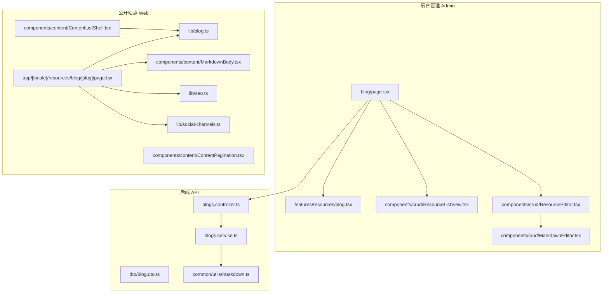
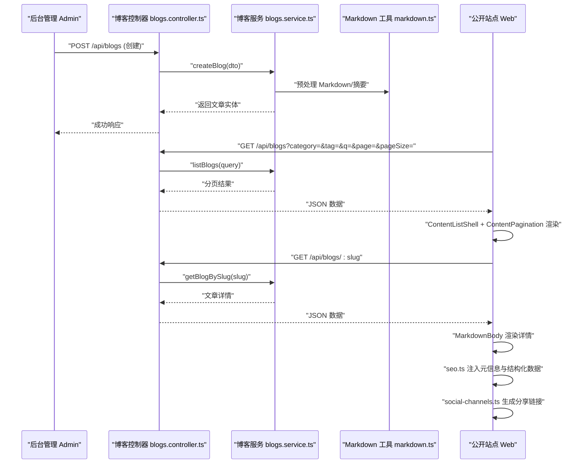
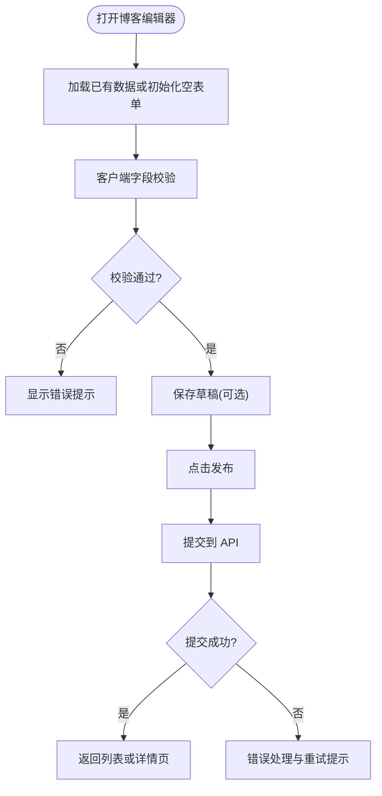
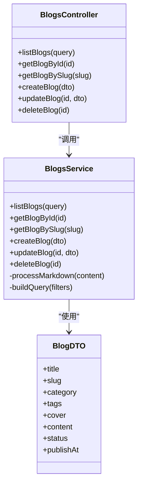
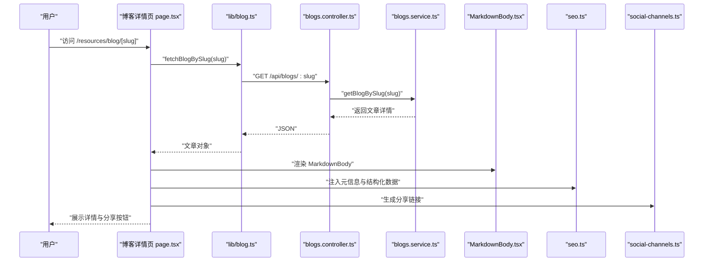
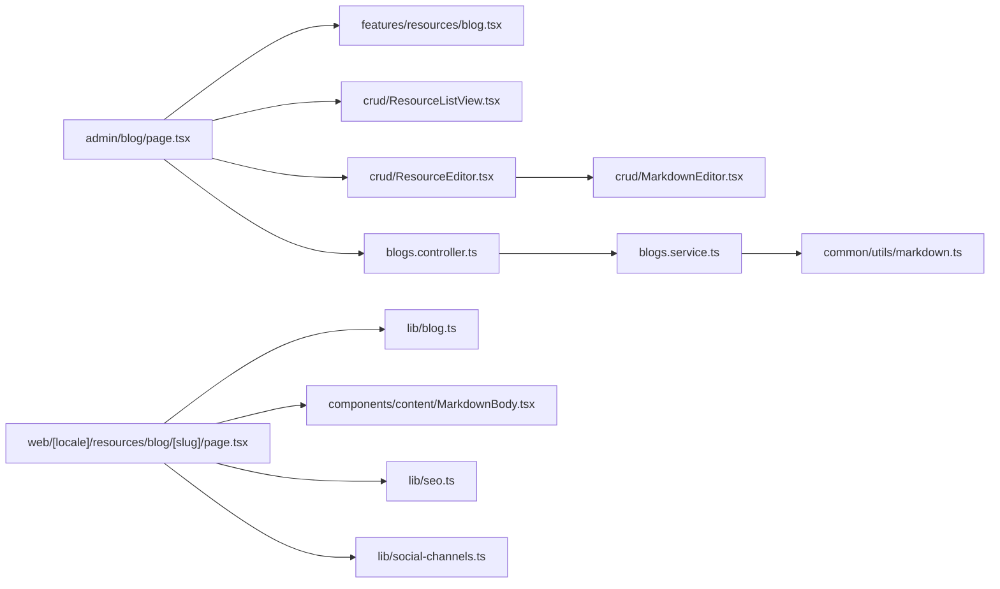

# 博客内容管理

<cite>
**本文引用的文件**   
- [apps/admin/src/app/(dashboard)/blog/page.tsx](file://apps/admin/src/app/(dashboard)/blog/page.tsx)
- [apps/admin/src/features/resources/blog.tsx](file://apps/admin/src/features/resources/blog.tsx)
- [apps/admin/src/components/crud/ResourceEditor.tsx](file://apps/admin/src/components/crud/ResourceEditor.tsx)
- [apps/admin/src/components/crud/MarkdownEditor.tsx](file://apps/admin/src/components/crud/MarkdownEditor.tsx)
- [apps/admin/src/components/crud/ResourceListView.tsx](file://apps/admin/src/components/crud/ResourceListView.tsx)
- [apps/api/src/blogs/blogs.controller.ts](file://apps/api/src/blogs/blogs.controller.ts)
- [apps/api/src/blogs/blogs.service.ts](file://apps/api/src/blogs/blogs.service.ts)
- [apps/api/src/blogs/dto/blog.dto.ts](file://apps/api/src/blogs/dto/blog.dto.ts)
- [apps/api/src/common/utils/markdown.ts](file://apps/api/src/common/utils/markdown.ts)
- [apps/web/src/lib/blog.ts](file://apps/web/src/lib/blog.ts)
- [apps/web/src/components/content/ContentListShell.tsx](file://apps/web/src/components/content/ContentListShell.tsx)
- [apps/web/src/components/content/ContentPagination.tsx](file://apps/web/src/components/content/ContentPagination.tsx)
- [apps/web/src/components/content/MarkdownBody.tsx](file://apps/web/src/components/content/MarkdownBody.tsx)
- [apps/web/src/lib/seo.ts](file://apps/web/src/lib/seo.ts)
- [apps/web/src/lib/social-channels.ts](file://apps/web/src/lib/social-channels.ts)
- [apps/web/src/app/[locale]/resources/blog/[slug]/page.tsx](file://apps/web/src/app/[locale]/resources/blog/[slug]/page.tsx)
</cite>

## 目录
1. [简介](#简介)
2. [项目结构](#项目结构)
3. [核心组件](#核心组件)
4. [架构总览](#架构总览)
5. [详细组件分析](#详细组件分析)
6. [依赖关系分析](#依赖关系分析)
7. [性能考量](#性能考量)
8. [故障排查指南](#故障排查指南)
9. [结论](#结论)
10. [附录](#附录)

## 简介
本文件面向“博客内容管理”子系统，覆盖以下目标：
- 博客文章的增删改查（CRUD）操作
- 分类与标签系统
- 搜索与过滤功能
- 分页加载机制
- Markdown 渲染、SEO 优化与社交媒体分享
- 博客列表页、详情页与编辑器的实现细节
- 发布流程、版本管理与权限控制的最佳实践

本仓库采用前后端分离架构：
- 前端 Admin（Next.js）提供后台管理界面与编辑器
- 后端 API（NestJS）提供 RESTful 接口与业务逻辑
- 前端 Web（Next.js）提供公开站点展示、SEO 与社交分享

## 项目结构
围绕博客模块的关键目录与文件如下：
- 后台管理（Admin）
  - 路由与页面：apps/admin/src/app/(dashboard)/blog/page.tsx
  - 资源定义与配置：apps/admin/src/features/resources/blog.tsx
  - 通用 CRUD 组件：apps/admin/src/components/crud/*（ResourceEditor、ResourceListView、MarkdownEditor）
- 后端 API（API）
  - 控制器与服务：apps/api/src/blogs/*.ts
  - DTO 校验：apps/api/src/blogs/dto/blog.dto.ts
  - Markdown 工具：apps/api/src/common/utils/markdown.ts
- 公开站点（Web）
  - 博客数据获取与类型：apps/web/src/lib/blog.ts
  - 列表与分页：apps/web/src/components/content/ContentListShell.tsx、ContentPagination.tsx
  - Markdown 渲染：apps/web/src/components/content/MarkdownBody.tsx
  - SEO 与社交分享：apps/web/src/lib/seo.ts、social-channels.ts
  - 博客详情页面：apps/web/src/app/[locale]/resources/blog/[slug]/page.tsx

**图表来源** 
- [apps/admin/src/app/(dashboard)/blog/page.tsx](file://apps/admin/src/app/(dashboard)/blog/page.tsx)
- [apps/admin/src/features/resources/blog.tsx](file://apps/admin/src/features/resources/blog.tsx)
- [apps/admin/src/components/crud/ResourceListView.tsx](file://apps/admin/src/components/crud/ResourceListView.tsx)
- [apps/admin/src/components/crud/ResourceEditor.tsx](file://apps/admin/src/components/crud/ResourceEditor.tsx)
- [apps/admin/src/components/crud/MarkdownEditor.tsx](file://apps/admin/src/components/crud/MarkdownEditor.tsx)
- [apps/api/src/blogs/blogs.controller.ts](file://apps/api/src/blogs/blogs.controller.ts)
- [apps/api/src/blogs/blogs.service.ts](file://apps/api/src/blogs/blogs.service.ts)
- [apps/api/src/blogs/dto/blog.dto.ts](file://apps/api/src/blogs/dto/blog.dto.ts)
- [apps/api/src/common/utils/markdown.ts](file://apps/api/src/common/utils/markdown.ts)
- [apps/web/src/lib/blog.ts](file://apps/web/src/lib/blog.ts)
- [apps/web/src/components/content/ContentListShell.tsx](file://apps/web/src/components/content/ContentListShell.tsx)
- [apps/web/src/components/content/ContentPagination.tsx](file://apps/web/src/components/content/ContentPagination.tsx)
- [apps/web/src/components/content/MarkdownBody.tsx](file://apps/web/src/components/content/MarkdownBody.tsx)
- [apps/web/src/lib/seo.ts](file://apps/web/src/lib/seo.ts)
- [apps/web/src/lib/social-channels.ts](file://apps/web/src/lib/social-channels.ts)
- [apps/web/src/app/[locale]/resources/blog/[slug]/page.tsx](file://apps/web/src/app/[locale]/resources/blog/[slug]/page.tsx)

**章节来源**
- [apps/admin/src/app/(dashboard)/blog/page.tsx](file://apps/admin/src/app/(dashboard)/blog/page.tsx)
- [apps/admin/src/features/resources/blog.tsx](file://apps/admin/src/features/resources/blog.tsx)
- [apps/api/src/blogs/blogs.controller.ts](file://apps/api/src/blogs/blogs.controller.ts)
- [apps/api/src/blogs/blogs.service.ts](file://apps/api/src/blogs/blogs.service.ts)
- [apps/web/src/lib/blog.ts](file://apps/web/src/lib/blog.ts)

## 核心组件
- 后台博客列表与编辑器
  - 列表视图：ResourceListView 负责分页、筛选、排序与批量操作
  - 编辑器：ResourceEditor 承载表单字段与校验，MarkdownEditor 提供所见即所得与预览
  - 资源定义：blog.tsx 声明字段、校验规则、枚举与默认值
- 后端博客服务
  - Controller：暴露 REST 接口（列表、详情、创建、更新、删除）
  - Service：封装业务逻辑（查询构建、Markdown 处理、状态流转）
  - DTO：输入校验与类型约束
- 公开站点展示
  - 数据层：blog.ts 统一请求与类型定义
  - 列表与分页：ContentListShell + ContentPagination
  - 详情渲染：MarkdownBody 将 Markdown 转为 HTML
  - SEO 与社交：seo.ts 生成结构化数据与元信息；social-channels.ts 提供分享链接

**章节来源**
- [apps/admin/src/components/crud/ResourceListView.tsx](file://apps/admin/src/components/crud/ResourceListView.tsx)
- [apps/admin/src/components/crud/ResourceEditor.tsx](file://apps/admin/src/components/crud/ResourceEditor.tsx)
- [apps/admin/src/components/crud/MarkdownEditor.tsx](file://apps/admin/src/components/crud/MarkdownEditor.tsx)
- [apps/admin/src/features/resources/blog.tsx](file://apps/admin/src/features/resources/blog.tsx)
- [apps/api/src/blogs/blogs.controller.ts](file://apps/api/src/blogs/blogs.controller.ts)
- [apps/api/src/blogs/blogs.service.ts](file://apps/api/src/blogs/blogs.service.ts)
- [apps/api/src/blogs/dto/blog.dto.ts](file://apps/api/src/blogs/dto/blog.dto.ts)
- [apps/web/src/lib/blog.ts](file://apps/web/src/lib/blog.ts)
- [apps/web/src/components/content/ContentListShell.tsx](file://apps/web/src/components/content/ContentListShell.tsx)
- [apps/web/src/components/content/ContentPagination.tsx](file://apps/web/src/components/content/ContentPagination.tsx)
- [apps/web/src/components/content/MarkdownBody.tsx](file://apps/web/src/components/content/MarkdownBody.tsx)
- [apps/web/src/lib/seo.ts](file://apps/web/src/lib/seo.ts)
- [apps/web/src/lib/social-channels.ts](file://apps/web/src/lib/social-channels.ts)

## 架构总览
博客内容管理的端到端调用链如下：
- 后台管理发起 CRUD 请求至 API
- API 控制器接收并校验参数，服务层执行业务逻辑与 Markdown 处理
- 公开站点通过统一的 blog.ts 拉取数据，渲染列表与详情，注入 SEO 与社交分享

**图表来源** 
- [apps/api/src/blogs/blogs.controller.ts](file://apps/api/src/blogs/blogs.controller.ts)
- [apps/api/src/blogs/blogs.service.ts](file://apps/api/src/blogs/blogs.service.ts)
- [apps/api/src/common/utils/markdown.ts](file://apps/api/src/common/utils/markdown.ts)
- [apps/web/src/lib/blog.ts](file://apps/web/src/lib/blog.ts)
- [apps/web/src/components/content/ContentListShell.tsx](file://apps/web/src/components/content/ContentListShell.tsx)
- [apps/web/src/components/content/ContentPagination.tsx](file://apps/web/src/components/content/ContentPagination.tsx)
- [apps/web/src/components/content/MarkdownBody.tsx](file://apps/web/src/components/content/MarkdownBody.tsx)
- [apps/web/src/lib/seo.ts](file://apps/web/src/lib/seo.ts)
- [apps/web/src/lib/social-channels.ts](file://apps/web/src/lib/social-channels.ts)

## 详细组件分析

### 后台博客列表与编辑器
- 列表页（ResourceListView）
  - 支持分页、排序、筛选（分类、标签、关键词）、批量操作
  - 使用 URL 状态同步，便于分享与刷新保持上下文
- 编辑器（ResourceEditor + MarkdownEditor）
  - 表单字段包括标题、分类、标签、封面、正文等
  - MarkdownEditor 提供实时预览、语法高亮、图片插入与本地缓存
  - 提交前进行客户端校验，失败时提示定位错误字段

**图表来源** 
- [apps/admin/src/components/crud/ResourceEditor.tsx](file://apps/admin/src/components/crud/ResourceEditor.tsx)
- [apps/admin/src/components/crud/MarkdownEditor.tsx](file://apps/admin/src/components/crud/MarkdownEditor.tsx)
- [apps/admin/src/features/resources/blog.tsx](file://apps/admin/src/features/resources/blog.tsx)

**章节来源**
- [apps/admin/src/components/crud/ResourceListView.tsx](file://apps/admin/src/components/crud/ResourceListView.tsx)
- [apps/admin/src/components/crud/ResourceEditor.tsx](file://apps/admin/src/components/crud/ResourceEditor.tsx)
- [apps/admin/src/components/crud/MarkdownEditor.tsx](file://apps/admin/src/components/crud/MarkdownEditor.tsx)
- [apps/admin/src/features/resources/blog.tsx](file://apps/admin/src/features/resources/blog.tsx)

### 后端博客服务与接口
- 控制器（blogs.controller.ts）
  - 定义 REST 路由：列表、详情、创建、更新、删除
  - 参数校验与权限守卫（如需要）
- 服务（blogs.service.ts）
  - 构建查询条件（分类、标签、关键词、分页）
  - Markdown 处理（摘要提取、内容清洗）
  - 事务与一致性保障（创建/更新/删除）
- DTO（blog.dto.ts）
  - 字段校验、必填项、格式限制、枚举值约束

**图表来源** 
- [apps/api/src/blogs/blogs.controller.ts](file://apps/api/src/blogs/blogs.controller.ts)
- [apps/api/src/blogs/blogs.service.ts](file://apps/api/src/blogs/blogs.service.ts)
- [apps/api/src/blogs/dto/blog.dto.ts](file://apps/api/src/blogs/dto/blog.dto.ts)

**章节来源**
- [apps/api/src/blogs/blogs.controller.ts](file://apps/api/src/blogs/blogs.controller.ts)
- [apps/api/src/blogs/blogs.service.ts](file://apps/api/src/blogs/blogs.service.ts)
- [apps/api/src/blogs/dto/blog.dto.ts](file://apps/api/src/blogs/dto/blog.dto.ts)

### 公开站点：列表、详情、Markdown 渲染与 SEO
- 数据层（blog.ts）
  - 统一封装 API 调用与类型定义
  - 提供分页、筛选、排序的参数映射
- 列表与分页（ContentListShell + ContentPagination）
  - 列表壳组件负责布局与骨架屏
  - 分页组件处理页码切换与 URL 同步
- 详情渲染（MarkdownBody）
  - 将 Markdown 转换为安全 HTML，支持代码高亮、表格、图片懒加载
- SEO 与社交分享（seo.ts + social-channels.ts）
  - 生成 title、description、Open Graph、Twitter Card、JSON-LD
  - 提供微信、微博、Facebook、X、LinkedIn 等分享链接

**图表来源** 
- [apps/web/src/app/[locale]/resources/blog/[slug]/page.tsx](file://apps/web/src/app/[locale]/resources/blog/[slug]/page.tsx)
- [apps/web/src/lib/blog.ts](file://apps/web/src/lib/blog.ts)
- [apps/api/src/blogs/blogs.controller.ts](file://apps/api/src/blogs/blogs.controller.ts)
- [apps/api/src/blogs/blogs.service.ts](file://apps/api/src/blogs/blogs.service.ts)
- [apps/web/src/components/content/MarkdownBody.tsx](file://apps/web/src/components/content/MarkdownBody.tsx)
- [apps/web/src/lib/seo.ts](file://apps/web/src/lib/seo.ts)
- [apps/web/src/lib/social-channels.ts](file://apps/web/src/lib/social-channels.ts)

**章节来源**
- [apps/web/src/lib/blog.ts](file://apps/web/src/lib/blog.ts)
- [apps/web/src/components/content/ContentListShell.tsx](file://apps/web/src/components/content/ContentListShell.tsx)
- [apps/web/src/components/content/ContentPagination.tsx](file://apps/web/src/components/content/ContentPagination.tsx)
- [apps/web/src/components/content/MarkdownBody.tsx](file://apps/web/src/components/content/MarkdownBody.tsx)
- [apps/web/src/lib/seo.ts](file://apps/web/src/lib/seo.ts)
- [apps/web/src/lib/social-channels.ts](file://apps/web/src/lib/social-channels.ts)
- [apps/web/src/app/[locale]/resources/blog/[slug]/page.tsx](file://apps/web/src/app/[locale]/resources/blog/[slug]/page.tsx)

### 分类与标签系统
- 模型设计建议
  - 分类（Category）：名称、slug、父级、排序、描述
  - 标签（Tag）：名称、slug、使用计数
  - 文章（Blog）：多对一分类、多对多标签
- 后台管理
  - 在 ResourceEditor 中提供分类下拉与标签多选
  - 列表页支持按分类与标签筛选
- 公开站点
  - 列表页根据分类/标签过滤，URL 参数驱动
  - 详情页展示分类与标签，用于内链与 SEO

**章节来源**
- [apps/admin/src/features/resources/blog.tsx](file://apps/admin/src/features/resources/blog.tsx)
- [apps/api/src/blogs/dto/blog.dto.ts](file://apps/api/src/blogs/dto/blog.dto.ts)
- [apps/web/src/lib/blog.ts](file://apps/web/src/lib/blog.ts)

### 搜索与过滤
- 关键词搜索
  - 后端对标题、摘要、内容进行模糊匹配
  - 前端通过 URL 参数 q 传递关键词
- 组合过滤
  - 分类、标签、状态、时间范围等多条件组合
  - 使用 QueryBuilder 动态拼接 WHERE 条件
- 性能优化
  - 对常用字段建立索引（标题、slug、分类、标签）
  - 分页限制 pageSize，避免大结果集

**章节来源**
- [apps/api/src/blogs/blogs.service.ts](file://apps/api/src/blogs/blogs.service.ts)
- [apps/web/src/components/content/ContentListShell.tsx](file://apps/web/src/components/content/ContentListShell.tsx)

### 分页加载机制
- 后端分页
  - 支持 page、pageSize、sort、order 参数
  - 返回 total、items、hasNext、hasPrev
- 前端分页
  - ContentPagination 组件处理页码切换与 URL 同步
  - 列表组件在切换页码时重新请求数据

**章节来源**
- [apps/api/src/blogs/blogs.service.ts](file://apps/api/src/blogs/blogs.service.ts)
- [apps/web/src/components/content/ContentPagination.tsx](file://apps/web/src/components/content/ContentPagination.tsx)

### Markdown 渲染与 SEO 优化
- Markdown 渲染
  - 后端预处理摘要与内容清洗
  - 前端 MarkdownBody 渲染为 HTML，支持代码高亮、图片懒加载
- SEO 优化
  - 动态生成 title、description、canonical、OG、Twitter Card
  - JSON-LD 结构化数据（Article、BreadcrumbList）
- 社交分享
  - 基于 social-channels.ts 生成各平台分享链接

**章节来源**
- [apps/api/src/common/utils/markdown.ts](file://apps/api/src/common/utils/markdown.ts)
- [apps/web/src/components/content/MarkdownBody.tsx](file://apps/web/src/components/content/MarkdownBody.tsx)
- [apps/web/src/lib/seo.ts](file://apps/web/src/lib/seo.ts)
- [apps/web/src/lib/social-channels.ts](file://apps/web/src/lib/social-channels.ts)

### 发布流程、版本管理与权限控制最佳实践
- 发布流程
  - 草稿 -> 待审核 -> 已发布 -> 已下架
  - 支持定时发布与回滚
- 版本管理
  - 记录每次修改的版本号、作者、变更摘要
  - 支持对比差异与一键恢复
- 权限控制
  - 基于角色的访问控制（RBAC）
  - 细粒度权限：创建、编辑、审核、发布、删除
  - 审计日志记录关键操作

[本节为概念性说明，不直接分析具体文件]

## 依赖关系分析
- 模块耦合
  - Admin 的 blog 页面依赖 ResourceEditor、ResourceListView、MarkdownEditor
  - API 的 blogs.controller 依赖 blogs.service，service 依赖 markdown 工具
  - Web 的详情页面依赖 blog.ts、MarkdownBody、seo.ts、social-channels.ts
- 外部依赖
  - 数据库（Prisma/ORM）
  - 存储（媒体文件）
  - 第三方服务（验证码、邮件、统计）

**图表来源** 
- [apps/admin/src/app/(dashboard)/blog/page.tsx](file://apps/admin/src/app/(dashboard)/blog/page.tsx)
- [apps/admin/src/features/resources/blog.tsx](file://apps/admin/src/features/resources/blog.tsx)
- [apps/admin/src/components/crud/ResourceListView.tsx](file://apps/admin/src/components/crud/ResourceListView.tsx)
- [apps/admin/src/components/crud/ResourceEditor.tsx](file://apps/admin/src/components/crud/ResourceEditor.tsx)
- [apps/admin/src/components/crud/MarkdownEditor.tsx](file://apps/admin/src/components/crud/MarkdownEditor.tsx)
- [apps/api/src/blogs/blogs.controller.ts](file://apps/api/src/blogs/blogs.controller.ts)
- [apps/api/src/blogs/blogs.service.ts](file://apps/api/src/blogs/blogs.service.ts)
- [apps/api/src/common/utils/markdown.ts](file://apps/api/src/common/utils/markdown.ts)
- [apps/web/src/app/[locale]/resources/blog/[slug]/page.tsx](file://apps/web/src/app/[locale]/resources/blog/[slug]/page.tsx)
- [apps/web/src/lib/blog.ts](file://apps/web/src/lib/blog.ts)
- [apps/web/src/components/content/MarkdownBody.tsx](file://apps/web/src/components/content/MarkdownBody.tsx)
- [apps/web/src/lib/seo.ts](file://apps/web/src/lib/seo.ts)
- [apps/web/src/lib/social-channels.ts](file://apps/web/src/lib/social-channels.ts)

**章节来源**
- [apps/admin/src/app/(dashboard)/blog/page.tsx](file://apps/admin/src/app/(dashboard)/blog/page.tsx)
- [apps/api/src/blogs/blogs.controller.ts](file://apps/api/src/blogs/blogs.controller.ts)
- [apps/api/src/blogs/blogs.service.ts](file://apps/api/src/blogs/blogs.service.ts)
- [apps/web/src/app/[locale]/resources/blog/[slug]/page.tsx](file://apps/web/src/app/[locale]/resources/blog/[slug]/page.tsx)

## 性能考量
- 后端
  - 合理分页与限制 pageSize，避免全表扫描
  - 对高频查询字段建立索引（标题、slug、分类、标签）
  - 使用缓存（Redis）缓存热点文章与搜索结果
- 前端
  - 列表与详情按需加载，减少首屏体积
  - 图片懒加载与 CDN 加速
  - 防抖与节流搜索输入，降低请求频率

[本节为通用指导，不直接分析具体文件]

## 故障排查指南
- 常见问题
  - 列表分页异常：检查 page、pageSize 参数与后端分页逻辑
  - Markdown 渲染异常：确认内容清洗与组件支持特性
  - SEO 缺失：检查 meta 与 JSON-LD 注入逻辑
  - 权限错误：核对角色与权限配置
- 调试建议
  - 开启请求日志与错误堆栈
  - 使用浏览器开发者工具检查网络与 DOM
  - 在后端启用详细日志与慢查询监控

**章节来源**
- [apps/api/src/blogs/blogs.controller.ts](file://apps/api/src/blogs/blogs.controller.ts)
- [apps/api/src/blogs/blogs.service.ts](file://apps/api/src/blogs/blogs.service.ts)
- [apps/web/src/components/content/MarkdownBody.tsx](file://apps/web/src/components/content/MarkdownBody.tsx)
- [apps/web/src/lib/seo.ts](file://apps/web/src/lib/seo.ts)

## 结论
本博客内容管理系统以清晰的模块化设计与前后端职责划分，实现了完整的 CRUD、分类标签、搜索过滤、分页加载、Markdown 渲染、SEO 与社交分享能力。通过合理的性能优化与权限控制，可支撑大规模内容运营与公开站点的稳定展示。建议在后续迭代中加强版本管理与审计日志，提升可追溯性与安全性。

[本节为总结性内容，不直接分析具体文件]

## 附录
- 术语
  - Slug：用于 URL 的唯一标识符
  - Markdown：轻量标记语言，用于编写富文本
  - SEO：搜索引擎优化
  - OG/Twitter Card：社交媒体分享卡片
- 参考路径
  - 后台博客页面：apps/admin/src/app/(dashboard)/blog/page.tsx
  - 博客资源定义：apps/admin/src/features/resources/blog.tsx
  - 博客控制器与服务：apps/api/src/blogs/*.ts
  - 公开站点博客库与组件：apps/web/src/lib/blog.ts、apps/web/src/components/content/*

[本节为补充信息，不直接分析具体文件]