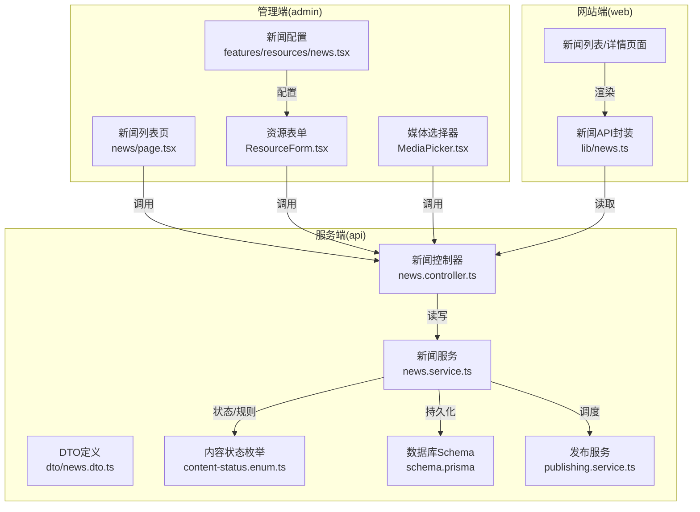
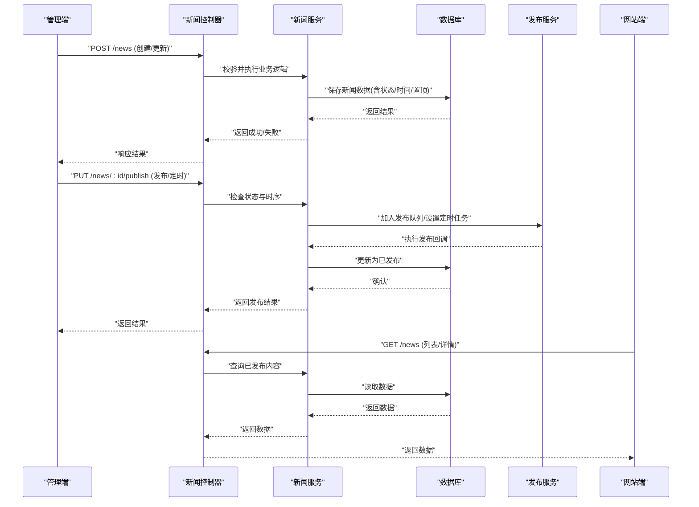
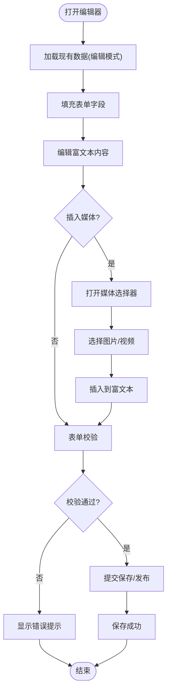
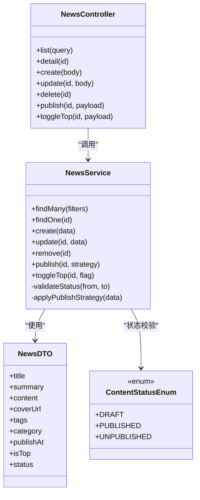
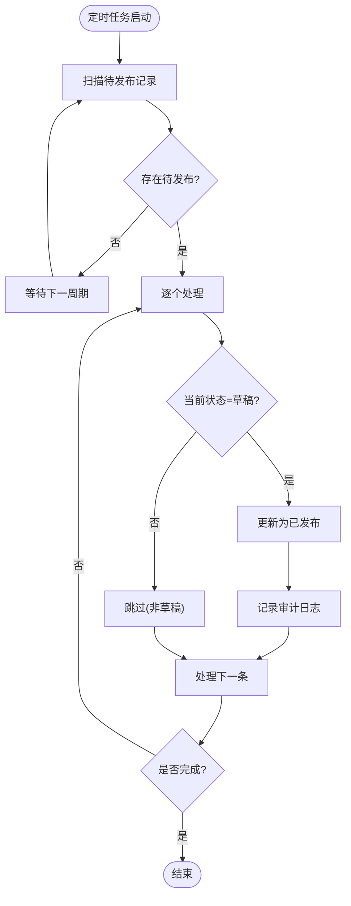
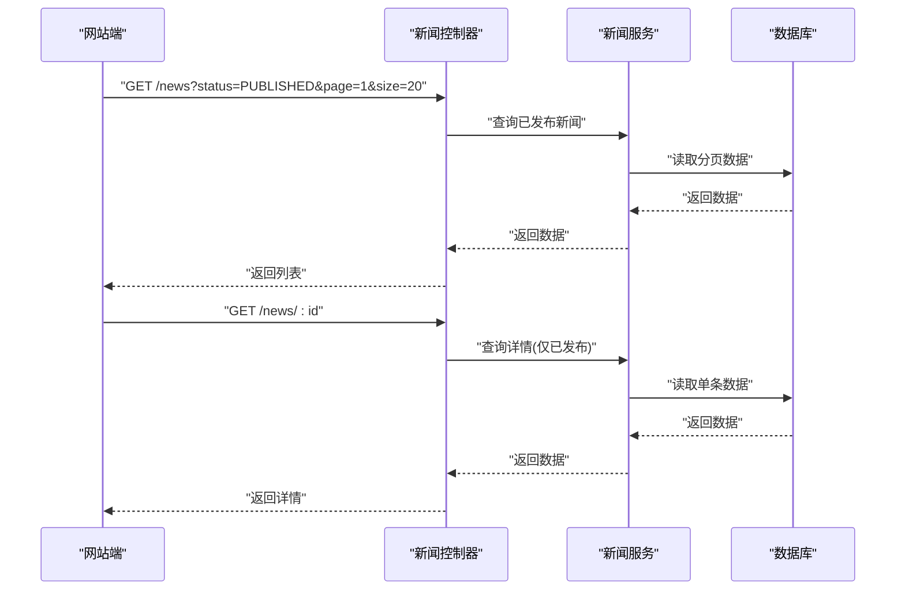
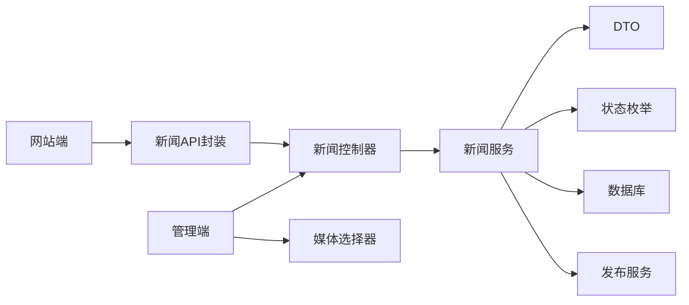

# 新闻稿管理

<cite>
**本文引用的文件**   
- [apps/admin/src/app/(dashboard)/news/page.tsx](file://apps/admin/src/app/(dashboard)/news/page.tsx)
- [apps/admin/src/features/resources/news.tsx](file://apps/admin/src/features/resources/news.tsx)
- [apps/admin/src/components/crud/ResourceForm.tsx](file://apps/admin/src/components/crud/ResourceForm.tsx)
- [apps/admin/src/components/crud/ResourceListView.tsx](file://apps/admin/src/components/crud/ResourceListView.tsx)
- [apps/admin/src/components/crud/MediaPicker.tsx](file://apps/admin/src/components/crud/MediaPicker.tsx)
- [apps/web/src/lib/news.ts](file://apps/web/src/lib/news.ts)
- [apps/api/src/news/news.controller.ts](file://apps/api/src/news/news.controller.ts)
- [apps/api/src/news/news.service.ts](file://apps/api/src/news/news.service.ts)
- [apps/api/src/news/dto/news.dto.ts](file://apps/api/src/news/dto/news.dto.ts)
- [apps/api/src/common/enums/content-status.enum.ts](file://apps/api/src/common/enums/content-status.enum.ts)
- [apps/api/src/prisma/schema.prisma](file://apps/api/src/prisma/schema.prisma)
- [apps/api/src/publishing/publishing.service.ts](file://apps/api/src/publishing/publishing.service.ts)
</cite>

## 目录
1. [简介](#简介)
2. [项目结构](#项目结构)
3. [核心组件](#核心组件)
4. [架构总览](#架构总览)
5. [详细组件分析](#详细组件分析)
6. [依赖分析](#依赖分析)
7. [性能考虑](#性能考虑)
8. [故障排查指南](#故障排查指南)
9. [结论](#结论)
10. [附录](#附录)

## 简介
本文件面向“新闻稿内容管理”的完整实现，覆盖后台管理端与前台展示端的端到端流程。重点包括：
- 新闻稿的增删改查（CRUD）操作
- 发布时间管理与定时发布
- 置顶功能与状态控制（草稿、已发布、已下架等）
- 富文本编辑、图片视频嵌入与格式化排版
- 新闻列表页、详情页与编辑器的实现细节
- 发布流程、权限控制与最佳实践

## 项目结构
本项目采用前后端分离的多应用架构：
- 管理端（admin）：基于 Next.js App Router，提供新闻稿的可视化编辑与管理界面
- 服务端（api）：基于 NestJS，提供新闻稿的 REST API、权限校验、数据持久化与发布调度
- 网站端（web）：基于 Next.js，负责新闻列表与详情渲染、SEO 与媒体资源加载

**图表来源** 
- [apps/admin/src/app/(dashboard)/news/page.tsx](file://apps/admin/src/app/(dashboard)/news/page.tsx)
- [apps/admin/src/components/crud/ResourceForm.tsx](file://apps/admin/src/components/crud/ResourceForm.tsx)
- [apps/admin/src/components/crud/MediaPicker.tsx](file://apps/admin/src/components/crud/MediaPicker.tsx)
- [apps/admin/src/features/resources/news.tsx](file://apps/admin/src/features/resources/news.tsx)
- [apps/api/src/news/news.controller.ts](file://apps/api/src/news/news.controller.ts)
- [apps/api/src/news/news.service.ts](file://apps/api/src/news/news.service.ts)
- [apps/api/src/news/dto/news.dto.ts](file://apps/api/src/news/dto/news.dto.ts)
- [apps/api/src/common/enums/content-status.enum.ts](file://apps/api/src/common/enums/content-status.enum.ts)
- [apps/api/src/prisma/schema.prisma](file://apps/api/src/prisma/schema.prisma)
- [apps/api/src/publishing/publishing.service.ts](file://apps/api/src/publishing/publishing.service.ts)
- [apps/web/src/lib/news.ts](file://apps/web/src/lib/news.ts)

**章节来源**
- [apps/admin/src/app/(dashboard)/news/page.tsx](file://apps/admin/src/app/(dashboard)/news/page.tsx)
- [apps/admin/src/features/resources/news.tsx](file://apps/admin/src/features/resources/news.tsx)
- [apps/admin/src/components/crud/ResourceForm.tsx](file://apps/admin/src/components/crud/ResourceForm.tsx)
- [apps/admin/src/components/crud/ResourceListView.tsx](file://apps/admin/src/components/crud/ResourceListView.tsx)
- [apps/admin/src/components/crud/MediaPicker.tsx](file://apps/admin/src/components/crud/MediaPicker.tsx)
- [apps/web/src/lib/news.ts](file://apps/web/src/lib/news.ts)
- [apps/api/src/news/news.controller.ts](file://apps/api/src/news/news.controller.ts)
- [apps/api/src/news/news.service.ts](file://apps/api/src/news/news.service.ts)
- [apps/api/src/news/dto/news.dto.ts](file://apps/api/src/news/dto/news.dto.ts)
- [apps/api/src/common/enums/content-status.enum.ts](file://apps/api/src/common/enums/content-status.enum.ts)
- [apps/api/src/prisma/schema.prisma](file://apps/api/src/prisma/schema.prisma)
- [apps/api/src/publishing/publishing.service.ts](file://apps/api/src/publishing/publishing.service.ts)

## 核心组件
- 管理端新闻列表与编辑器
  - 列表页：分页、筛选、排序、批量操作、快捷预览
  - 编辑器：标题、摘要、正文富文本、封面图、标签、分类、发布时间、置顶开关、状态切换
  - 媒体选择器：支持图片/视频上传与插入到富文本
- 服务端新闻模块
  - 控制器：REST 接口（列表、详情、创建、更新、删除、发布/下架、置顶）
  - 服务层：业务逻辑、校验、状态机、排序权重（置顶）、时间策略（立即/定时）
  - DTO：请求参数校验与类型约束
  - 枚举：内容状态（草稿、已发布、已下架等）
  - 数据库：Prisma Schema 定义新闻实体字段与关系
  - 发布服务：定时任务与发布队列（可扩展）
- 网站端新闻模块
  - API 封装：统一请求、缓存、错误处理
  - 页面：新闻列表与详情渲染、SEO 元信息、媒体懒加载

**章节来源**
- [apps/admin/src/app/(dashboard)/news/page.tsx](file://apps/admin/src/app/(dashboard)/news/page.tsx)
- [apps/admin/src/components/crud/ResourceForm.tsx](file://apps/admin/src/components/crud/ResourceForm.tsx)
- [apps/admin/src/components/crud/MediaPicker.tsx](file://apps/admin/src/components/crub/MediaPicker.tsx)
- [apps/admin/src/features/resources/news.tsx](file://apps/admin/src/features/resources/news.tsx)
- [apps/api/src/news/news.controller.ts](file://apps/api/src/news/news.controller.ts)
- [apps/api/src/news/news.service.ts](file://apps/api/src/news/news.service.ts)
- [apps/api/src/news/dto/news.dto.ts](file://apps/api/src/news/dto/news.dto.ts)
- [apps/api/src/common/enums/content-status.enum.ts](file://apps/api/src/common/enums/content-status.enum.ts)
- [apps/api/src/prisma/schema.prisma](file://apps/api/src/prisma/schema.prisma)
- [apps/api/src/publishing/publishing.service.ts](file://apps/api/src/publishing/publishing.service.ts)
- [apps/web/src/lib/news.ts](file://apps/web/src/lib/news.ts)

## 架构总览
下图展示了从管理端编辑到服务端处理再到网站端展示的完整链路，以及发布与定时发布的扩展点。

**图表来源** 
- [apps/api/src/news/news.controller.ts](file://apps/api/src/news/news.controller.ts)
- [apps/api/src/news/news.service.ts](file://apps/api/src/news/news.service.ts)
- [apps/api/src/publishing/publishing.service.ts](file://apps/api/src/publishing/publishing.service.ts)
- [apps/api/src/prisma/schema.prisma](file://apps/api/src/prisma/schema.prisma)
- [apps/web/src/lib/news.ts](file://apps/web/src/lib/news.ts)

## 详细组件分析

### 管理端：新闻列表与编辑器
- 列表页
  - 分页与筛选：按状态、分类、标签、发布时间范围过滤；支持搜索关键词
  - 排序：默认按发布时间倒序，置顶项优先
  - 操作：新建、编辑、删除、快速预览、批量发布/下架
- 编辑器（ResourceForm）
  - 字段：标题、副标题、摘要、正文（富文本）、封面图、标签、分类、发布时间、置顶开关、状态（草稿/已发布/已下架）
  - 富文本：支持段落、标题、列表、表格、链接、图片、视频嵌入、代码块、引用等
  - 媒体选择器：弹窗式媒体库，支持上传、选择、替换、预览
  - 校验：必填项、长度限制、格式校验（URL、日期）
  - 提交：创建或更新，自动填充作者、时间戳（可选）

**图表来源** 
- [apps/admin/src/components/crud/ResourceForm.tsx](file://apps/admin/src/components/crud/ResourceForm.tsx)
- [apps/admin/src/components/crud/MediaPicker.tsx](file://apps/admin/src/components/crud/MediaPicker.tsx)

**章节来源**
- [apps/admin/src/app/(dashboard)/news/page.tsx](file://apps/admin/src/app/(dashboard)/news/page.tsx)
- [apps/admin/src/components/crud/ResourceForm.tsx](file://apps/admin/src/components/crud/ResourceForm.tsx)
- [apps/admin/src/components/crud/MediaPicker.tsx](file://apps/admin/src/components/crud/MediaPicker.tsx)
- [apps/admin/src/features/resources/news.tsx](file://apps/admin/src/features/resources/news.tsx)

### 服务端：新闻控制器与服务层
- 控制器（Controller）
  - 路由：/news（列表、详情）、/news（创建、更新、删除）、/news/:id/publish（发布/定时）、/news/:id/top（置顶/取消置顶）
  - 鉴权：JWT 认证与角色权限校验（仅管理员可编辑/发布）
  - 入参：使用 DTO 进行严格校验与类型转换
- 服务层（Service）
  - CRUD：创建、更新、删除、查询（分页、筛选、排序）
  - 状态机：草稿→已发布→已下架；禁止非法状态跳转
  - 置顶逻辑：置顶项提升排序权重，保持发布时间优先级
  - 时间策略：立即发布与定时发布（记录 publishAt），定时任务触发后更新状态
  - 媒体处理：确保富文本中的媒体 URL 合法与安全
- 枚举与 DTO
  - 内容状态枚举：草稿、已发布、已下架等
  - DTO：标题、摘要、正文、封面、标签、分类、发布时间、置顶、状态等字段校验

**图表来源** 
- [apps/api/src/news/news.controller.ts](file://apps/api/src/news/news.controller.ts)
- [apps/api/src/news/news.service.ts](file://apps/api/src/news/news.service.ts)
- [apps/api/src/news/dto/news.dto.ts](file://apps/api/src/news/dto/news.dto.ts)
- [apps/api/src/common/enums/content-status.enum.ts](file://apps/api/src/common/enums/content-status.enum.ts)

**章节来源**
- [apps/api/src/news/news.controller.ts](file://apps/api/src/news/news.controller.ts)
- [apps/api/src/news/news.service.ts](file://apps/api/src/news/news.service.ts)
- [apps/api/src/news/dto/news.dto.ts](file://apps/api/src/news/dto/news.dto.ts)
- [apps/api/src/common/enums/content-status.enum.ts](file://apps/api/src/common/enums/content-status.enum.ts)

### 数据库模型与发布调度
- Prisma Schema（新闻实体）
  - 字段建议：id、title、summary、content、coverUrl、tags、category、publishAt、isTop、status、createdAt、updatedAt、authorId
  - 索引：publishAt、status、isTop、category、tags（用于高效筛选与排序）
- 发布调度（Publishing Service）
  - 定时任务：周期性扫描 publishAt <= now 且 status=DRAFT 的记录，转为 PUBLISHED
  - 队列机制：将发布任务入队，异步执行，避免阻塞主请求
  - 幂等性：重复触发不改变最终状态，保证一致性

**图表来源** 
- [apps/api/src/prisma/schema.prisma](file://apps/api/src/prisma/schema.prisma)
- [apps/api/src/publishing/publishing.service.ts](file://apps/api/src/publishing/publishing.service.ts)

**章节来源**
- [apps/api/src/prisma/schema.prisma](file://apps/api/src/prisma/schema.prisma)
- [apps/api/src/publishing/publishing.service.ts](file://apps/api/src/publishing/publishing.service.ts)

### 网站端：新闻列表与详情
- API 封装（lib/news.ts）
  - 统一请求封装：基础 URL、超时、重试、错误码映射
  - 缓存策略：列表页短期缓存，详情页按需缓存
  - 类型安全：TS 类型定义与返回值校验
- 页面渲染
  - 列表页：分页、筛选、排序、SEO 元信息、媒体缩略图懒加载
  - 详情页：富文本渲染、图片/视频自适应、分享与 SEO

**图表来源** 
- [apps/web/src/lib/news.ts](file://apps/web/src/lib/news.ts)
- [apps/api/src/news/news.controller.ts](file://apps/api/src/news/news.controller.ts)
- [apps/api/src/news/news.service.ts](file://apps/api/src/news/news.service.ts)

**章节来源**
- [apps/web/src/lib/news.ts](file://apps/web/src/lib/news.ts)

## 依赖分析
- 管理端依赖
  - ResourceForm：表单校验、富文本、媒体选择
  - MediaPicker：媒体上传与选择
  - news.ts（features）：字段配置与行为定制
- 服务端依赖
  - Controller → Service：职责分离，便于测试与维护
  - DTO：输入校验与类型约束
  - Enum：状态机与业务规则
  - Prisma：数据持久化与查询优化
  - Publishing：定时任务与队列（可扩展为消息队列）
- 网站端依赖
  - lib/news.ts：统一 API 访问与缓存
  - 页面组件：渲染与交互

**图表来源** 
- [apps/admin/src/components/crud/ResourceForm.tsx](file://apps/admin/src/components/crud/ResourceForm.tsx)
- [apps/admin/src/components/crud/MediaPicker.tsx](file://apps/admin/src/components/crud/MediaPicker.tsx)
- [apps/admin/src/features/resources/news.tsx](file://apps/admin/src/features/resources/news.tsx)
- [apps/api/src/news/news.controller.ts](file://apps/api/src/news/news.controller.ts)
- [apps/api/src/news/news.service.ts](file://apps/api/src/news/news.service.ts)
- [apps/api/src/news/dto/news.dto.ts](file://apps/api/src/news/dto/news.dto.ts)
- [apps/api/src/common/enums/content-status.enum.ts](file://apps/api/src/common/enums/content-status.enum.ts)
- [apps/api/src/prisma/schema.prisma](file://apps/api/src/prisma/schema.prisma)
- [apps/api/src/publishing/publishing.service.ts](file://apps/api/src/publishing/publishing.service.ts)
- [apps/web/src/lib/news.ts](file://apps/web/src/lib/news.ts)

**章节来源**
- [apps/admin/src/components/crud/ResourceForm.tsx](file://apps/admin/src/components/crud/ResourceForm.tsx)
- [apps/admin/src/components/crud/MediaPicker.tsx](file://apps/admin/src/components/crud/MediaPicker.tsx)
- [apps/admin/src/features/resources/news.tsx](file://apps/admin/src/features/resources/news.tsx)
- [apps/api/src/news/news.controller.ts](file://apps/api/src/news/news.controller.ts)
- [apps/api/src/news/news.service.ts](file://apps/api/src/news/news.service.ts)
- [apps/api/src/news/dto/news.dto.ts](file://apps/api/src/news/dto/news.dto.ts)
- [apps/api/src/common/enums/content-status.enum.ts](file://apps/api/src/common/enums/content-status.enum.ts)
- [apps/api/src/prisma/schema.prisma](file://apps/api/src/prisma/schema.prisma)
- [apps/api/src/publishing/publishing.service.ts](file://apps/api/src/publishing/publishing.service.ts)
- [apps/web/src/lib/news.ts](file://apps/web/src/lib/news.ts)

## 性能考虑
- 列表查询优化
  - 分页与筛选：减少数据传输量
  - 索引设计：publishAt、status、isTop、category、tags
  - 缓存策略：Redis 缓存热点列表与详情
- 富文本与媒体
  - 图片/视频懒加载与压缩
  - CDN 加速静态资源
- 发布调度
  - 异步队列避免阻塞
  - 幂等性与重试机制

[本节为通用指导，无需特定文件来源]

## 故障排查指南
- 常见错误
  - 状态非法：如从已发布直接跳到草稿，需遵循状态机规则
  - 定时发布未生效：检查 publishAt 与任务调度器状态
  - 媒体链接无效：富文本中 URL 合法性校验失败
- 调试步骤
  - 查看审计日志与错误日志
  - 检查 DTO 校验与入参格式
  - 验证数据库记录与索引命中
  - 确认权限与 JWT 令牌有效

**章节来源**
- [apps/api/src/news/news.service.ts](file://apps/api/src/news/news.service.ts)
- [apps/api/src/news/dto/news.dto.ts](file://apps/api/src/news/dto/news.dto.ts)
- [apps/api/src/common/enums/content-status.enum.ts](file://apps/api/src/common/enums/content-status.enum.ts)

## 结论
本系统实现了完整的新闻稿管理能力，涵盖管理端编辑、服务端业务逻辑与网站端展示。通过严格的状态机、灵活的发布时间策略与完善的权限控制，确保了内容的质量与安全性。建议在后续迭代中引入更强大的发布队列与监控告警，进一步提升稳定性与可观测性。

[本节为总结，无需特定文件来源]

## 附录
- 最佳实践
  - 发布流程：草稿→预发布→已发布→已下架，每一步均需校验
  - 定时发布：提前规划发布时间，避免高峰期集中发布
  - 权限控制：最小权限原则，区分编辑与审核角色
  - 富文本规范：统一模板与样式，避免不一致排版
  - 媒体管理：命名规范与版本控制，避免重复上传

[本节为通用指导，无需特定文件来源]