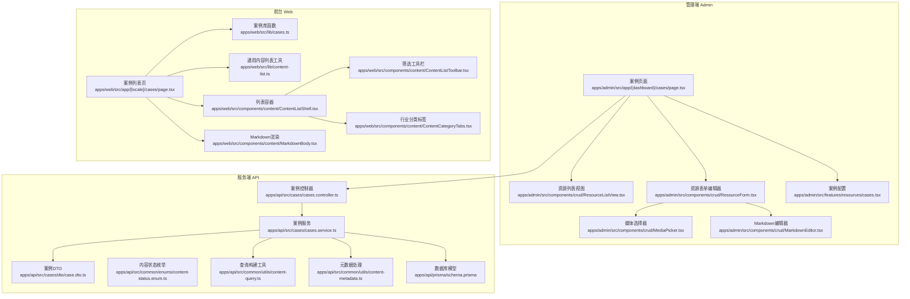
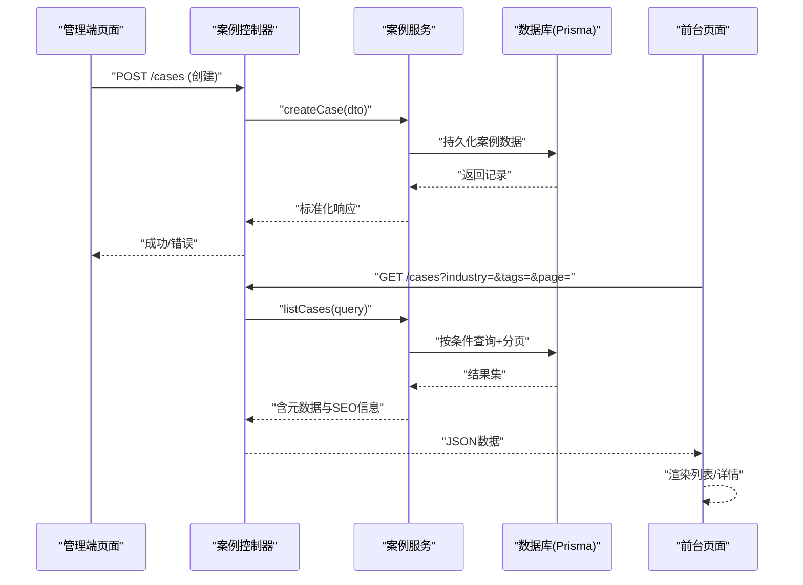
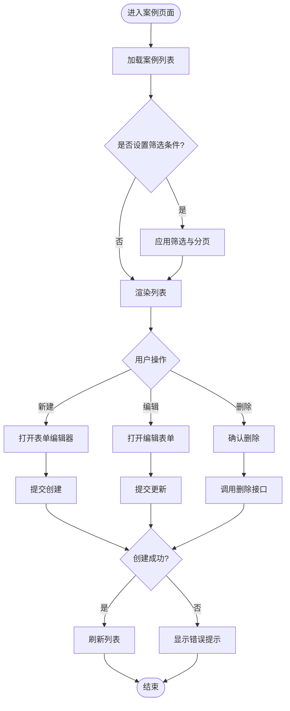
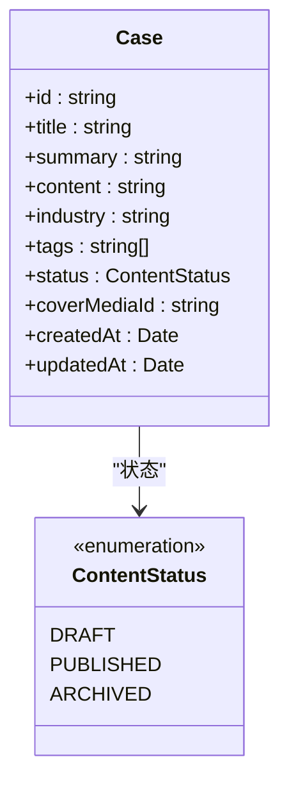
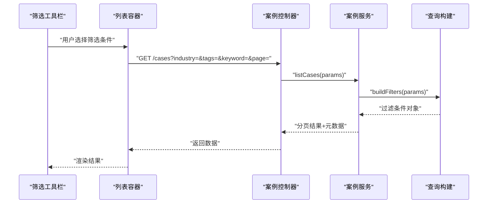
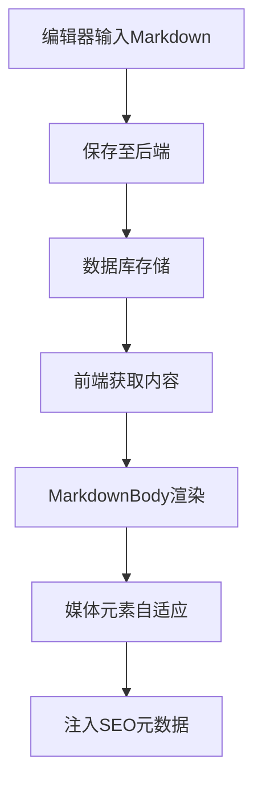
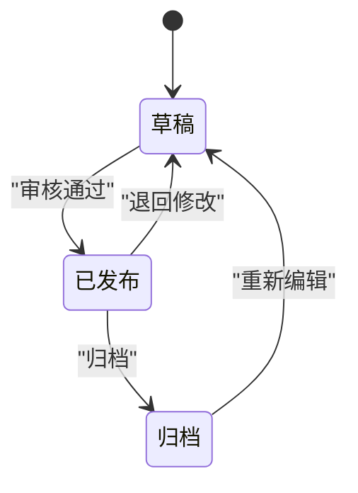
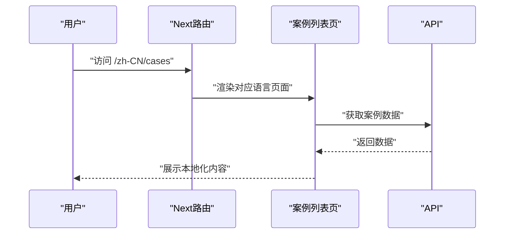
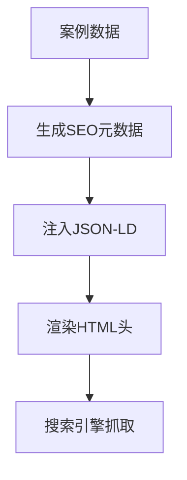
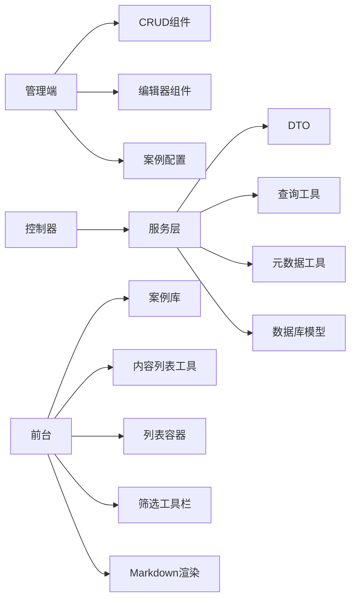

# 案例研究管理

<cite>
**本文档引用的文件**   
- [apps/admin/src/app/(dashboard)/cases/page.tsx](file://apps/admin/src/app/(dashboard)/cases/page.tsx)
- [apps/admin/src/features/resources/cases.tsx](file://apps/admin/src/features/resources/cases.tsx)
- [apps/admin/src/components/crud/ResourceListView.tsx](file://apps/admin/src/components/crud/ResourceListView.tsx)
- [apps/admin/src/components/crud/ResourceForm.tsx](file://apps/admin/src/components/crud/ResourceForm.tsx)
- [apps/admin/src/components/crud/MediaPicker.tsx](file://apps/admin/src/components/crud/MediaPicker.tsx)
- [apps/admin/src/components/crud/MarkdownEditor.tsx](file://apps/admin/src/components/crud/MarkdownEditor.tsx)
- [apps/web/src/app/[locale]/cases/page.tsx](file://apps/web/src/app/[locale]/cases/page.tsx)
- [apps/web/src/lib/cases.ts](file://apps/web/src/lib/cases.ts)
- [apps/web/src/lib/content-list.ts](file://apps/web/src/lib/content-list.ts)
- [apps/web/src/components/content/ContentListShell.tsx](file://apps/web/src/components/content/ContentListShell.tsx)
- [apps/web/src/components/content/ContentListToolbar.tsx](file://apps/web/src/components/content/ContentListToolbar.tsx)
- [apps/web/src/components/content/ContentCategoryTabs.tsx](file://apps/web/src/components/content/ContentCategoryTabs.tsx)
- [apps/web/src/components/content/MarkdownBody.tsx](file://apps/web/src/components/content/MarkdownBody.tsx)
- [apps/api/src/cases/cases.controller.ts](file://apps/api/src/cases/cases.controller.ts)
- [apps/api/src/cases/cases.service.ts](file://apps/api/src/cases/cases.service.ts)
- [apps/api/src/cases/dto/case.dto.ts](file://apps/api/src/cases/dto/case.dto.ts)
- [apps/api/src/common/enums/content-status.enum.ts](file://apps/api/src/common/enums/content-status.enum.ts)
- [apps/api/src/common/utils/content-query.ts](file://apps/api/src/common/utils/content-query.ts)
- [apps/api/src/common/utils/content-metadata.ts](file://apps/api/src/common/utils/content-metadata.ts)
- [apps/api/prisma/schema.prisma](file://apps/api/prisma/schema.prisma)
</cite>

## 目录
1. [简介](#简介)
2. [项目结构](#项目结构)
3. [核心组件](#核心组件)
4. [架构总览](#架构总览)
5. [详细组件分析](#详细组件分析)
6. [依赖关系分析](#依赖关系分析)
7. [性能考量](#性能考量)
8. [故障排查指南](#故障排查指南)
9. [结论](#结论)
10. [附录](#附录)

## 简介
本文件面向“案例研究”内容管理的完整实现，覆盖后台管理端与前台展示端的全链路：包括案例的增删改查、行业分类与技术标签、筛选与搜索、结构化展示、多媒体资源嵌入、响应式布局、编辑体验、审核流程、多语言支持与SEO优化。文档以代码级为依据，提供架构图、流程图与关键路径说明，帮助读者快速理解并扩展该模块。

## 项目结构
案例研究功能横跨三个应用层：
- 管理端（Admin）：负责案例的创建、编辑、列表与媒体选择等。
- 服务端（API）：提供REST接口、数据校验、查询构建、状态枚举与元数据处理。
- 前台（Web）：负责案例列表页、详情页渲染、多语言路由与SEO输出。

**图表来源** 
- [apps/admin/src/app/(dashboard)/cases/page.tsx](file://apps/admin/src/app/(dashboard)/cases/page.tsx)
- [apps/admin/src/components/crud/ResourceListView.tsx](file://apps/admin/src/components/crud/ResourceListView.tsx)
- [apps/admin/src/components/crud/ResourceForm.tsx](file://apps/admin/src/components/crud/ResourceForm.tsx)
- [apps/admin/src/components/crud/MediaPicker.tsx](file://apps/admin/src/components/crud/MediaPicker.tsx)
- [apps/admin/src/components/crud/MarkdownEditor.tsx](file://apps/admin/src/components/crud/MarkdownEditor.tsx)
- [apps/admin/src/features/resources/cases.tsx](file://apps/admin/src/features/resources/cases.tsx)
- [apps/api/src/cases/cases.controller.ts](file://apps/api/src/cases/cases.controller.ts)
- [apps/api/src/cases/cases.service.ts](file://apps/api/src/cases/cases.service.ts)
- [apps/api/src/cases/dto/case.dto.ts](file://apps/api/src/cases/dto/case.dto.ts)
- [apps/api/src/common/enums/content-status.enum.ts](file://apps/api/src/common/enums/content-status.enum.ts)
- [apps/api/src/common/utils/content-query.ts](file://apps/api/src/common/utils/content-query.ts)
- [apps/api/src/common/utils/content-metadata.ts](file://apps/api/src/common/utils/content-metadata.ts)
- [apps/api/prisma/schema.prisma](file://apps/api/prisma/schema.prisma)
- [apps/web/src/app/[locale]/cases/page.tsx](file://apps/web/src/app/[locale]/cases/page.tsx)
- [apps/web/src/lib/cases.ts](file://apps/web/src/lib/cases.ts)
- [apps/web/src/lib/content-list.ts](file://apps/web/src/lib/content-list.ts)
- [apps/web/src/components/content/ContentListShell.tsx](file://apps/web/src/components/content/ContentListShell.tsx)
- [apps/web/src/components/content/ContentListToolbar.tsx](file://apps/web/src/components/content/ContentListToolbar.tsx)
- [apps/web/src/components/content/ContentCategoryTabs.tsx](file://apps/web/src/components/content/ContentCategoryTabs.tsx)
- [apps/web/src/components/content/MarkdownBody.tsx](file://apps/web/src/components/content/MarkdownBody.tsx)

**章节来源**
- [apps/admin/src/app/(dashboard)/cases/page.tsx](file://apps/admin/src/app/(dashboard)/cases/page.tsx)
- [apps/api/src/cases/cases.controller.ts](file://apps/api/src/cases/cases.controller.ts)
- [apps/web/src/app/[locale]/cases/page.tsx](file://apps/web/src/app/[locale]/cases/page.tsx)

## 核心组件
- 管理端案例页面：聚合列表与表单，支持分页、筛选、排序与批量操作。
- 资源列表视图：通用CRUD列表组件，封装表格列、操作按钮、分页与查询参数同步。
- 资源表单编辑器：统一表单容器，集成Markdown编辑器与媒体选择器，支持字段校验与草稿保存。
- 媒体选择器：用于图片/视频等多媒体资源的浏览、选择与预览。
- Markdown编辑器：富文本编辑能力，支持插入媒体、标题层级、表格与代码块。
- 案例配置：定义案例字段、默认值、验证规则与UI行为。
- 服务端控制器与服务：处理HTTP请求、调用服务层、组装查询条件、返回标准化响应。
- DTO与枚举：输入校验与状态约束，确保数据一致性。
- 查询与元数据工具：统一构建过滤、排序、分页与SEO元数据。
- 前台案例列表页：基于多语言路由渲染，使用通用内容列表组件与筛选工具栏。
- Markdown渲染：将后端存储的Markdown安全渲染为HTML，支持媒体嵌入。

**章节来源**
- [apps/admin/src/components/crud/ResourceListView.tsx](file://apps/admin/src/components/crud/ResourceListView.tsx)
- [apps/admin/src/components/crud/ResourceForm.tsx](file://apps/admin/src/components/crud/ResourceForm.tsx)
- [apps/admin/src/components/crud/MediaPicker.tsx](file://apps/admin/src/components/crud/MediaPicker.tsx)
- [apps/admin/src/components/crud/MarkdownEditor.tsx](file://apps/admin/src/components/crud/MarkdownEditor.tsx)
- [apps/admin/src/features/resources/cases.tsx](file://apps/admin/src/features/resources/cases.tsx)
- [apps/api/src/cases/cases.controller.ts](file://apps/api/src/cases/cases.controller.ts)
- [apps/api/src/cases/cases.service.ts](file://apps/api/src/cases/cases.service.ts)
- [apps/api/src/cases/dto/case.dto.ts](file://apps/api/src/cases/dto/case.dto.ts)
- [apps/api/src/common/enums/content-status.enum.ts](file://apps/api/src/common/enums/content-status.enum.ts)
- [apps/api/src/common/utils/content-query.ts](file://apps/api/src/common/utils/content-query.ts)
- [apps/api/src/common/utils/content-metadata.ts](file://apps/api/src/common/utils/content-metadata.ts)
- [apps/web/src/app/[locale]/cases/page.tsx](file://apps/web/src/app/[locale]/cases/page.tsx)
- [apps/web/src/components/content/ContentListShell.tsx](file://apps/web/src/components/content/ContentListShell.tsx)
- [apps/web/src/components/content/ContentListToolbar.tsx](file://apps/web/src/components/content/ContentListToolbar.tsx)
- [apps/web/src/components/content/ContentCategoryTabs.tsx](file://apps/web/src/components/content/ContentCategoryTabs.tsx)
- [apps/web/src/components/content/MarkdownBody.tsx](file://apps/web/src/components/content/MarkdownBody.tsx)

## 架构总览
案例研究模块采用前后端分离架构，管理端通过REST API与后端交互，前台通过同构或SSR获取数据并渲染。

**图表来源** 
- [apps/api/src/cases/cases.controller.ts](file://apps/api/src/cases/cases.controller.ts)
- [apps/api/src/cases/cases.service.ts](file://apps/api/src/cases/cases.service.ts)
- [apps/api/prisma/schema.prisma](file://apps/api/prisma/schema.prisma)
- [apps/web/src/app/[locale]/cases/page.tsx](file://apps/web/src/app/[locale]/cases/page.tsx)

## 详细组件分析

### 管理端案例页面与CRUD
- 列表页：展示案例条目，支持按行业分类、技术标签、状态筛选；支持分页、排序与批量删除。
- 新增/编辑：通过资源表单编辑器完成字段录入，包含标题、摘要、正文（Markdown）、行业分类、技术标签、封面图、状态等。
- 提交流程：前端校验通过后调用API创建或更新，成功后刷新列表并提示。

**图表来源** 
- [apps/admin/src/app/(dashboard)/cases/page.tsx](file://apps/admin/src/app/(dashboard)/cases/page.tsx)
- [apps/admin/src/components/crud/ResourceListView.tsx](file://apps/admin/src/components/crud/ResourceListView.tsx)
- [apps/admin/src/components/crud/ResourceForm.tsx](file://apps/admin/src/components/crud/ResourceForm.tsx)

**章节来源**
- [apps/admin/src/app/(dashboard)/cases/page.tsx](file://apps/admin/src/app/(dashboard)/cases/page.tsx)
- [apps/admin/src/components/crud/ResourceListView.tsx](file://apps/admin/src/components/crud/ResourceListView.tsx)
- [apps/admin/src/components/crud/ResourceForm.tsx](file://apps/admin/src/components/crud/ResourceForm.tsx)

### 行业分类与技术标签
- 行业分类：在案例实体中作为分类字段，用于列表页的分类筛选与导航。
- 技术标签：以数组形式存储，支持多选与模糊匹配，便于细粒度检索。
- 配置：在案例配置文件中定义可选值、默认值与显示顺序。

**图表来源** 
- [apps/api/prisma/schema.prisma](file://apps/api/prisma/schema.prisma)
- [apps/api/src/common/enums/content-status.enum.ts](file://apps/api/src/common/enums/content-status.enum.ts)
- [apps/admin/src/features/resources/cases.tsx](file://apps/admin/src/features/resources/cases.tsx)

**章节来源**
- [apps/api/prisma/schema.prisma](file://apps/api/prisma/schema.prisma)
- [apps/api/src/common/enums/content-status.enum.ts](file://apps/api/src/common/enums/content-status.enum.ts)
- [apps/admin/src/features/resources/cases.tsx](file://apps/admin/src/features/resources/cases.tsx)

### 筛选与搜索
- 筛选维度：行业分类、技术标签、状态、时间范围、关键词。
- 查询构建：后端统一使用查询工具拼装过滤条件、排序与分页参数。
- 前端交互：工具栏组件提供下拉、多选与搜索框，实时同步URL参数。

**图表来源** 
- [apps/web/src/components/content/ContentListToolbar.tsx](file://apps/web/src/components/content/ContentListToolbar.tsx)
- [apps/web/src/components/content/ContentListShell.tsx](file://apps/web/src/components/content/ContentListShell.tsx)
- [apps/api/src/cases/cases.controller.ts](file://apps/api/src/cases/cases.controller.ts)
- [apps/api/src/cases/cases.service.ts](file://apps/api/src/cases/cases.service.ts)
- [apps/api/src/common/utils/content-query.ts](file://apps/api/src/common/utils/content-query.ts)

**章节来源**
- [apps/web/src/components/content/ContentListToolbar.tsx](file://apps/web/src/components/content/ContentListToolbar.tsx)
- [apps/web/src/components/content/ContentListShell.tsx](file://apps/web/src/components/content/ContentListShell.tsx)
- [apps/api/src/cases/cases.controller.ts](file://apps/api/src/cases/cases.controller.ts)
- [apps/api/src/cases/cases.service.ts](file://apps/api/src/cases/cases.service.ts)
- [apps/api/src/common/utils/content-query.ts](file://apps/api/src/common/utils/content-query.ts)

### 结构化展示与多媒体嵌入
- 结构化展示：案例正文使用Markdown存储，前端通过MarkdownBody组件安全渲染，支持标题、段落、列表、表格与代码块。
- 多媒体嵌入：媒体选择器支持图片与视频，编辑器内可插入引用，渲染时自动适配响应式布局。
- SEO增强：元数据工具生成描述、关键词与OpenGraph信息。

**图表来源** 
- [apps/admin/src/components/crud/MarkdownEditor.tsx](file://apps/admin/src/components/crud/MarkdownEditor.tsx)
- [apps/admin/src/components/crud/MediaPicker.tsx](file://apps/admin/src/components/crud/MediaPicker.tsx)
- [apps/web/src/components/content/MarkdownBody.tsx](file://apps/web/src/components/content/MarkdownBody.tsx)
- [apps/api/src/common/utils/content-metadata.ts](file://apps/api/src/common/utils/content-metadata.ts)

**章节来源**
- [apps/admin/src/components/crud/MarkdownEditor.tsx](file://apps/admin/src/components/crud/MarkdownEditor.tsx)
- [apps/admin/src/components/crud/MediaPicker.tsx](file://apps/admin/src/components/crud/MediaPicker.tsx)
- [apps/web/src/components/content/MarkdownBody.tsx](file://apps/web/src/components/content/MarkdownBody.tsx)
- [apps/api/src/common/utils/content-metadata.ts](file://apps/api/src/common/utils/content-metadata.ts)

### 审核流程
- 状态机：草稿、已发布、归档三种状态，控制可见性与编辑权限。
- 工作流：管理员创建后处于草稿，审核后转为已发布；归档后不再出现在公开列表。
- 权限控制：仅具备相应角色的用户可执行审核动作。

**图表来源** 
- [apps/api/src/common/enums/content-status.enum.ts](file://apps/api/src/common/enums/content-status.enum.ts)

**章节来源**
- [apps/api/src/common/enums/content-status.enum.ts](file://apps/api/src/common/enums/content-status.enum.ts)

### 多语言支持
- 路由：前台使用[locale]动态路由，支持中文简体、繁体与英文。
- 文案：管理端与前台均通过i18n资源文件管理界面文案。
- 内容：案例标题、摘要与正文可按语言版本维护（若扩展）。

**图表来源** 
- [apps/web/src/app/[locale]/cases/page.tsx](file://apps/web/src/app/[locale]/cases/page.tsx)

**章节来源**
- [apps/web/src/app/[locale]/cases/page.tsx](file://apps/web/src/app/[locale]/cases/page.tsx)

### SEO优化最佳实践
- 元数据：标题、描述、关键词与OpenGraph/Twitter Card信息自动生成。
- 结构化数据：根据案例类型注入JSON-LD，提升搜索引擎理解。
- URL与缓存：稳定的slug与合理的缓存策略，提高索引效率。

**图表来源** 
- [apps/api/src/common/utils/content-metadata.ts](file://apps/api/src/common/utils/content-metadata.ts)

**章节来源**
- [apps/api/src/common/utils/content-metadata.ts](file://apps/api/src/common/utils/content-metadata.ts)

## 依赖关系分析
- 管理端依赖：资源列表与表单组件、媒体选择器、Markdown编辑器与案例配置。
- 服务端依赖：控制器调用服务层，服务层依赖DTO、查询工具、元数据工具与数据库模型。
- 前台依赖：案例库函数、通用内容列表工具、列表容器、筛选工具栏与Markdown渲染。

**图表来源** 
- [apps/admin/src/components/crud/ResourceListView.tsx](file://apps/admin/src/components/crud/ResourceListView.tsx)
- [apps/admin/src/components/crud/ResourceForm.tsx](file://apps/admin/src/components/crud/ResourceForm.tsx)
- [apps/admin/src/components/crud/MediaPicker.tsx](file://apps/admin/src/components/crud/MediaPicker.tsx)
- [apps/admin/src/components/crud/MarkdownEditor.tsx](file://apps/admin/src/components/crud/MarkdownEditor.tsx)
- [apps/admin/src/features/resources/cases.tsx](file://apps/admin/src/features/resources/cases.tsx)
- [apps/api/src/cases/cases.controller.ts](file://apps/api/src/cases/cases.controller.ts)
- [apps/api/src/cases/cases.service.ts](file://apps/api/src/cases/cases.service.ts)
- [apps/api/src/cases/dto/case.dto.ts](file://apps/api/src/cases/dto/case.dto.ts)
- [apps/api/src/common/utils/content-query.ts](file://apps/api/src/common/utils/content-query.ts)
- [apps/api/src/common/utils/content-metadata.ts](file://apps/api/src/common/utils/content-metadata.ts)
- [apps/api/prisma/schema.prisma](file://apps/api/prisma/schema.prisma)
- [apps/web/src/lib/cases.ts](file://apps/web/src/lib/cases.ts)
- [apps/web/src/lib/content-list.ts](file://apps/web/src/lib/content-list.ts)
- [apps/web/src/components/content/ContentListShell.tsx](file://apps/web/src/components/content/ContentListShell.tsx)
- [apps/web/src/components/content/ContentListToolbar.tsx](file://apps/web/src/components/content/ContentListToolbar.tsx)
- [apps/web/src/components/content/MarkdownBody.tsx](file://apps/web/src/components/content/MarkdownBody.tsx)

**章节来源**
- [apps/api/src/cases/cases.controller.ts](file://apps/api/src/cases/cases.controller.ts)
- [apps/api/src/cases/cases.service.ts](file://apps/api/src/cases/cases.service.ts)
- [apps/api/src/cases/dto/case.dto.ts](file://apps/api/src/cases/dto/case.dto.ts)
- [apps/api/src/common/utils/content-query.ts](file://apps/api/src/common/utils/content-query.ts)
- [apps/api/src/common/utils/content-metadata.ts](file://apps/api/src/common/utils/content-metadata.ts)
- [apps/api/prisma/schema.prisma](file://apps/api/prisma/schema.prisma)
- [apps/web/src/lib/cases.ts](file://apps/web/src/lib/cases.ts)
- [apps/web/src/lib/content-list.ts](file://apps/web/src/lib/content-list.ts)
- [apps/web/src/components/content/ContentListShell.tsx](file://apps/web/src/components/content/ContentListShell.tsx)
- [apps/web/src/components/content/ContentListToolbar.tsx](file://apps/web/src/components/content/ContentListToolbar.tsx)
- [apps/web/src/components/content/MarkdownBody.tsx](file://apps/web/src/components/content/MarkdownBody.tsx)

## 性能考量
- 分页与懒加载：列表页默认分页，避免一次性加载大量数据。
- 查询优化：后端使用统一的查询构建，减少无效字段与重复计算。
- 媒体优化：图片与视频按需加载，使用CDN与压缩策略。
- 缓存策略：对热点案例列表与静态资源启用缓存，降低服务器压力。
- SSR与增量静态：前台可采用SSR或ISR提升首屏性能与SEO。

[本节为通用指导，不直接分析具体文件]

## 故障排查指南
- 列表为空：检查筛选条件是否正确、分页参数是否越界、API返回状态码。
- 媒体无法显示：确认媒体ID有效、路径正确、跨域与CORS配置。
- Markdown渲染异常：检查内容合法性、转义与脚本注入防护。
- 审核状态异常：核对状态枚举与权限配置，确认操作者角色。
- 多语言不生效：检查路由locale与i18n资源文件是否齐全。

**章节来源**
- [apps/api/src/cases/cases.controller.ts](file://apps/api/src/cases/cases.controller.ts)
- [apps/api/src/cases/cases.service.ts](file://apps/api/src/cases/cases.service.ts)
- [apps/web/src/components/content/MarkdownBody.tsx](file://apps/web/src/components/content/MarkdownBody.tsx)

## 结论
案例研究管理模块通过清晰的分层架构与通用CRUD组件，实现了高效的增删改查、灵活的筛选与标签体系、安全的Markdown渲染与多媒体嵌入、完善的审核流程与多语言支持，并结合SEO优化提升内容曝光。建议在生产环境中持续监控性能指标，完善缓存与CDN策略，并根据业务需求扩展多语言内容与高级筛选维度。

[本节为总结性内容，不直接分析具体文件]

## 附录
- 相关API路径：案例列表、详情、创建、更新、删除与审核操作。
- 数据模型字段：标题、摘要、正文、行业分类、技术标签、状态、封面媒体ID、时间戳。
- 前端组件清单：列表容器、筛选工具栏、分类标签、Markdown渲染、媒体选择器。

[本节为补充信息，不直接分析具体文件]