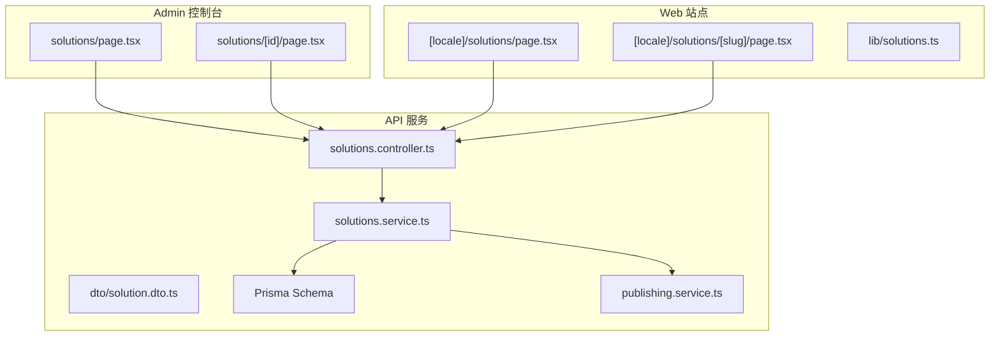
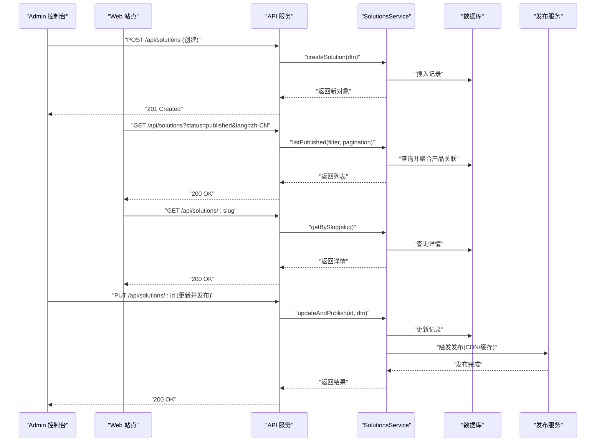
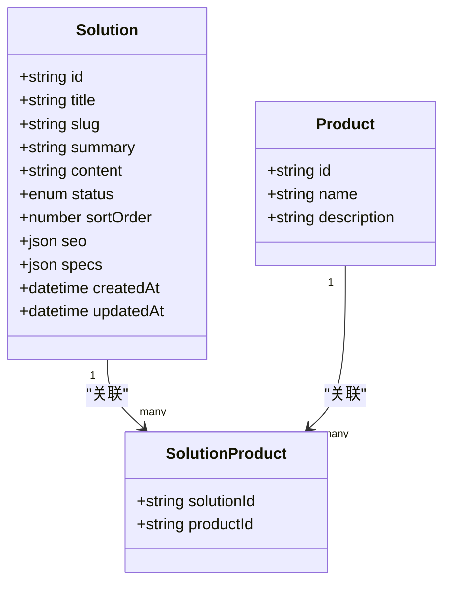
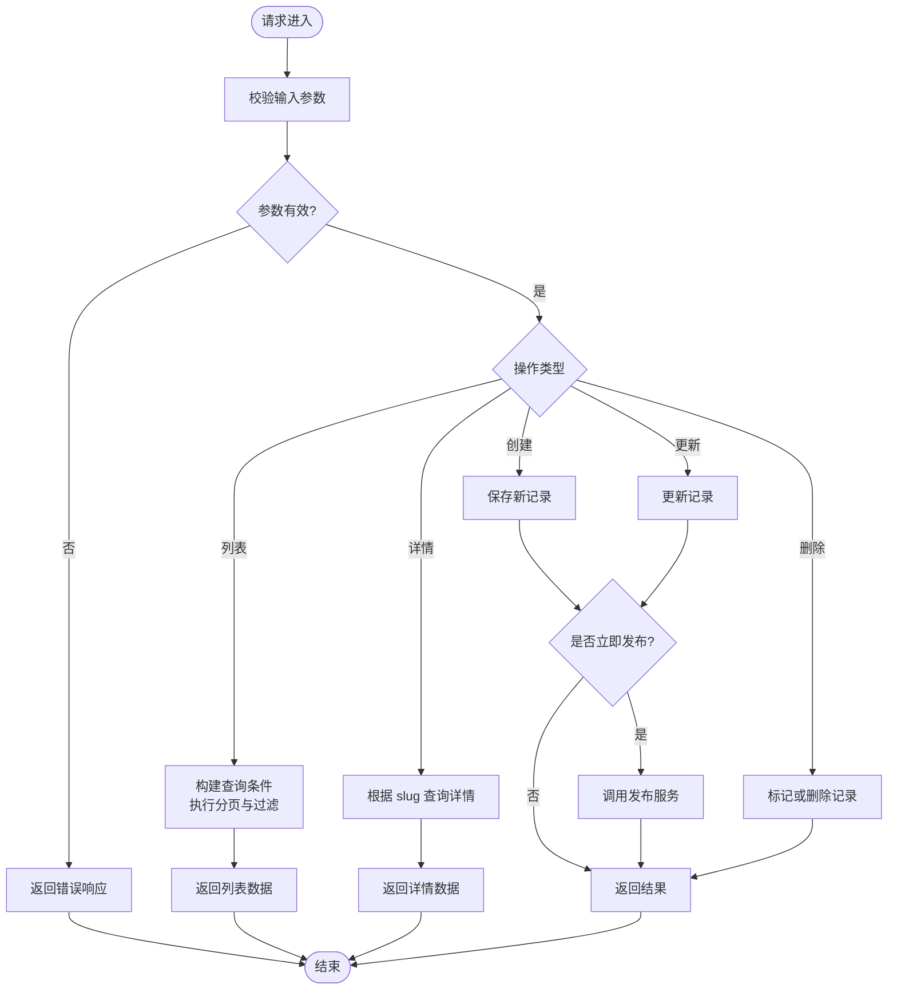
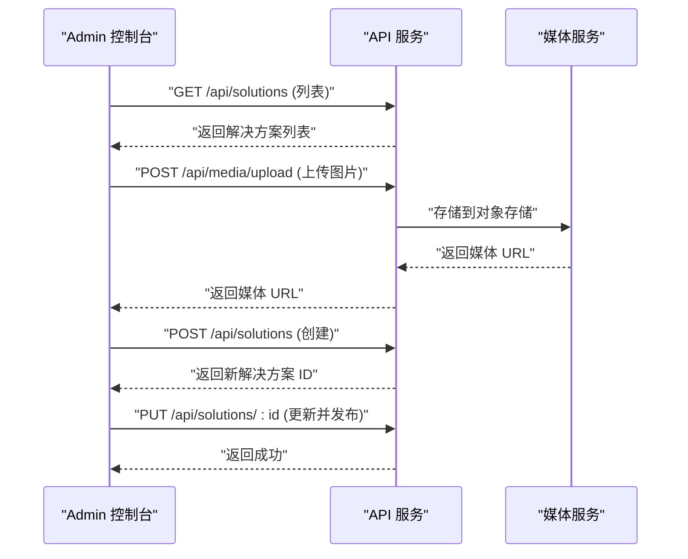
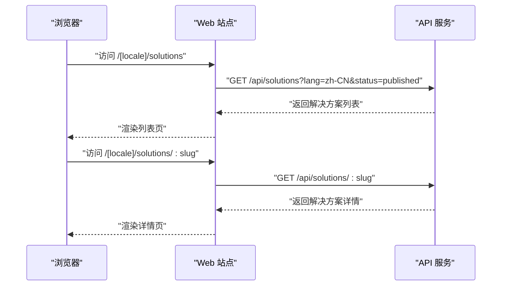
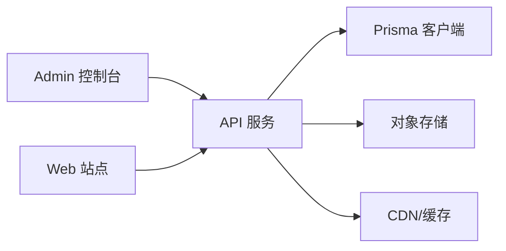

# 解决方案管理

<cite>
**本文引用的文件**   
- [apps/admin/src/app/(dashboard)/solutions/page.tsx](file://apps/admin/src/app/(dashboard)/solutions/page.tsx)
- [apps/admin/src/app/(dashboard)/solutions/[id]/page.tsx](file://apps/admin/src/app/(dashboard)/solutions/[id]/page.tsx)
- [apps/web/src/app/[locale]/solutions/page.tsx](file://apps/web/src/app/[locale]/solutions/page.tsx)
- [apps/web/src/app/[locale]/solutions/[slug]/page.tsx](file://apps/web/src/app/[locale]/solutions/[slug]/page.tsx)
- [apps/web/src/lib/solutions.ts](file://apps/web/src/lib/solutions.ts)
- [apps/web/src/lib/solutions.d.ts](file://apps/web/src/lib/solutions.d.ts)
- [apps/api/src/solutions/dto/solution.dto.ts](file://apps/api/src/solutions/dto/solution.dto.ts)
- [apps/api/src/solutions/solutions.controller.ts](file://apps/api/src/solutions/solutions.controller.ts)
- [apps/api/src/solutions/solutions.service.ts](file://apps/api/src/solutions/solutions.service.ts)
- [apps/api/prisma/schema.prisma](file://apps/api/prisma/schema.prisma)
- [apps/api/src/common/utils/content-query.ts](file://apps/api/src/common/utils/content-query.ts)
- [apps/api/src/common/utils/content-list.ts](file://apps/api/src/common/utils/content-list.ts)
- [apps/api/src/common/utils/markdown.ts](file://apps/api/src/common/utils/markdown.ts)
- [apps/api/src/publishing/publishing.service.ts](file://apps/api/src/publishing/publishing.service.ts)
</cite>

## 目录
1. [简介](#简介)
2. [项目结构](#项目结构)
3. [核心组件](#核心组件)
4. [架构总览](#架构总览)
5. [详细组件分析](#详细组件分析)
6. [依赖关系分析](#依赖关系分析)
7. [性能考量](#性能考量)
8. [故障排查指南](#故障排查指南)
9. [结论](#结论)
10. [附录](#附录)

## 简介
本文件面向“解决方案”内容管理的完整实现，覆盖以下目标：
- 解决方案的 CRUD 操作（创建、读取、更新、删除）
- 与产品的关联关系
- 技术规格字段与演示能力
- 结构化数据模型设计
- 动态内容生成与多渠道分发
- 解决方案列表页、详情页与后台配置界面的实现细节
- 版本管理、A/B 测试与性能监控的最佳实践

本方案采用前后端分离架构：
- 前端 Admin（Next.js App Router）提供解决方案的编辑与管理界面
- 前端 Web（Next.js App Router）提供对外展示的解决方案列表与详情页面
- 后端 API（NestJS）提供统一的 REST 接口与领域服务，数据库使用 Prisma ORM

## 项目结构
解决方案相关代码分布在三个应用层：
- Admin 控制台：解决方案的增删改查与配置
- Web 站点：解决方案的公开列表与详情展示
- API 服务：领域逻辑、数据访问与发布流程

图表来源
- [apps/admin/src/app/(dashboard)/solutions/page.tsx](file://apps/admin/src/app/(dashboard)/solutions/page.tsx)
- [apps/admin/src/app/(dashboard)/solutions/[id]/page.tsx](file://apps/admin/src/app/(dashboard)/solutions/[id]/page.tsx)
- [apps/web/src/app/[locale]/solutions/page.tsx](file://apps/web/src/app/[locale]/solutions/page.tsx)
- [apps/web/src/app/[locale]/solutions/[slug]/page.tsx](file://apps/web/src/app/[locale]/solutions/[slug]/page.tsx)
- [apps/web/src/lib/solutions.ts](file://apps/web/src/lib/solutions.ts)
- [apps/api/src/solutions/solutions.controller.ts](file://apps/api/src/solutions/solutions.controller.ts)
- [apps/api/src/solutions/solutions.service.ts](file://apps/api/src/solutions/solutions.service.ts)
- [apps/api/src/solutions/dto/solution.dto.ts](file://apps/api/src/solutions/dto/solution.dto.ts)
- [apps/api/prisma/schema.prisma](file://apps/api/prisma/schema.prisma)
- [apps/api/src/publishing/publishing.service.ts](file://apps/api/src/publishing/publishing.service.ts)

章节来源
- [apps/api/prisma/schema.prisma](file://apps/api/prisma/schema.prisma)
- [apps/api/src/solutions/solutions.controller.ts](file://apps/api/src/solutions/solutions.controller.ts)
- [apps/api/src/solutions/solutions.service.ts](file://apps/api/src/solutions/solutions.service.ts)
- [apps/api/src/solutions/dto/solution.dto.ts](file://apps/api/src/solutions/dto/solution.dto.ts)
- [apps/web/src/lib/solutions.ts](file://apps/web/src/lib/solutions.ts)
- [apps/web/src/app/[locale]/solutions/page.tsx](file://apps/web/src/app/[locale]/solutions/page.tsx)
- [apps/web/src/app/[locale]/solutions/[slug]/page.tsx](file://apps/web/src/app/[locale]/solutions/[slug]/page.tsx)
- [apps/admin/src/app/(dashboard)/solutions/page.tsx](file://apps/admin/src/app/(dashboard)/solutions/page.tsx)
- [apps/admin/src/app/(dashboard)/solutions/[id]/page.tsx](file://apps/admin/src/app/(dashboard)/solutions/[id]/page.tsx)

## 核心组件
- 数据模型与 DTO
  - 解决方案实体包含标题、摘要、正文、状态、排序、SEO 元信息、产品关联、技术规格、演示资源等字段
  - DTO 用于输入校验与序列化，确保前后端数据结构一致
- 控制器与服务
  - Controller 暴露 REST 接口，负责路由与参数校验
  - Service 封装业务逻辑，包括查询、分页、过滤、排序、发布流程
- 前端页面与库
  - Admin 侧提供列表与编辑页，支持富文本、媒体选择、标签与 SEO 设置
  - Web 侧提供多语言列表与详情渲染，支持 Markdown 解析与图片优化
- 发布与多渠道分发
  - PublishingService 将已发布的解决方案推送到 CDN/静态站点或缓存层，提升访问性能

章节来源
- [apps/api/src/solutions/dto/solution.dto.ts](file://apps/api/src/solutions/dto/solution.dto.ts)
- [apps/api/src/solutions/solutions.controller.ts](file://apps/api/src/solutions/solutions.controller.ts)
- [apps/api/src/solutions/solutions.service.ts](file://apps/api/src/solutions/solutions.service.ts)
- [apps/web/src/lib/solutions.ts](file://apps/web/src/lib/solutions.ts)
- [apps/api/src/publishing/publishing.service.ts](file://apps/api/src/publishing/publishing.service.ts)

## 架构总览
解决方案模块遵循分层架构：
- 表现层：Admin 与 Web 页面通过 Next.js 路由组织
- 接口层：NestJS Controller 定义 REST API
- 领域层：SolutionsService 处理业务规则与编排
- 数据层：Prisma 访问数据库，Schema 定义实体与关系
- 发布层：PublishingService 负责将内容推送到边缘节点或缓存

图表来源
- [apps/api/src/solutions/solutions.controller.ts](file://apps/api/src/solutions/solutions.controller.ts)
- [apps/api/src/solutions/solutions.service.ts](file://apps/api/src/solutions/solutions.service.ts)
- [apps/api/prisma/schema.prisma](file://apps/api/prisma/schema.prisma)
- [apps/api/src/publishing/publishing.service.ts](file://apps/api/src/publishing/publishing.service.ts)

## 详细组件分析

### 数据模型与 DTO
- 解决方案实体字段建议
  - 基础信息：标题、副标题、摘要、正文（Markdown）、状态、排序权重、创建/更新时间
  - SEO：Meta 标题、描述、关键词、OG 图像
  - 产品关联：一对多或多对多关系，便于在详情页展示相关产品
  - 技术规格：键值对或结构化 JSON，支持表格与对比
  - 演示：视频链接、演示截图、在线体验入口
- DTO 职责
  - 输入校验：必填项、长度限制、枚举值
  - 输出序列化：隐藏敏感字段、格式化时间戳

图表来源
- [apps/api/prisma/schema.prisma](file://apps/api/prisma/schema.prisma)
- [apps/api/src/solutions/dto/solution.dto.ts](file://apps/api/src/solutions/dto/solution.dto.ts)

章节来源
- [apps/api/prisma/schema.prisma](file://apps/api/prisma/schema.prisma)
- [apps/api/src/solutions/dto/solution.dto.ts](file://apps/api/src/solutions/dto/solution.dto.ts)

### 控制器与服务（CRUD 与发布）
- 控制器接口
  - 列表：支持按状态、语言、产品、标签过滤与分页
  - 详情：按 slug 获取单条解决方案
  - 创建/更新：接收 DTO，写入数据库
  - 删除：软删除或硬删除策略
- 服务逻辑
  - 查询优化：索引字段、避免 N+1 查询
  - 发布流程：更新后调用发布服务，推送至 CDN/缓存
  - 版本管理：记录变更历史，支持回滚

图表来源
- [apps/api/src/solutions/solutions.controller.ts](file://apps/api/src/solutions/solutions.controller.ts)
- [apps/api/src/solutions/solutions.service.ts](file://apps/api/src/solutions/solutions.service.ts)
- [apps/api/src/publishing/publishing.service.ts](file://apps/api/src/publishing/publishing.service.ts)

章节来源
- [apps/api/src/solutions/solutions.controller.ts](file://apps/api/src/solutions/solutions.controller.ts)
- [apps/api/src/solutions/solutions.service.ts](file://apps/api/src/solutions/solutions.service.ts)

### 前端 Admin 配置界面
- 列表页
  - 展示解决方案卡片，支持搜索、筛选、排序与批量操作
  - 快速预览与状态切换
- 编辑页
  - 富文本编辑器（Markdown）
  - 媒体选择器（图片/视频）
  - SEO 设置面板（Meta、OG、关键词）
  - 产品关联选择器
  - 技术规格表单（动态键值对）
  - 演示资源上传与预览

图表来源
- [apps/admin/src/app/(dashboard)/solutions/page.tsx](file://apps/admin/src/app/(dashboard)/solutions/page.tsx)
- [apps/admin/src/app/(dashboard)/solutions/[id]/page.tsx](file://apps/admin/src/app/(dashboard)/solutions/[id]/page.tsx)
- [apps/api/src/solutions/solutions.controller.ts](file://apps/api/src/solutions/solutions.controller.ts)

章节来源
- [apps/admin/src/app/(dashboard)/solutions/page.tsx](file://apps/admin/src/app/(dashboard)/solutions/page.tsx)
- [apps/admin/src/app/(dashboard)/solutions/[id]/page.tsx](file://apps/admin/src/app/(dashboard)/solutions/[id]/page.tsx)

### 前端 Web 展示页面
- 列表页
  - 多语言支持（locale 路由）
  - 分类与标签筛选
  - 分页与懒加载
- 详情页
  - 基于 slug 的动态路由
  - Markdown 内容渲染
  - 产品关联展示与技术规格表格
  - 演示资源嵌入（视频/图片）

图表来源
- [apps/web/src/app/[locale]/solutions/page.tsx](file://apps/web/src/app/[locale]/solutions/page.tsx)
- [apps/web/src/app/[locale]/solutions/[slug]/page.tsx](file://apps/web/src/app/[locale]/solutions/[slug]/page.tsx)
- [apps/web/src/lib/solutions.ts](file://apps/web/src/lib/solutions.ts)
- [apps/api/src/solutions/solutions.controller.ts](file://apps/api/src/solutions/solutions.controller.ts)

章节来源
- [apps/web/src/app/[locale]/solutions/page.tsx](file://apps/web/src/app/[locale]/solutions/page.tsx)
- [apps/web/src/app/[locale]/solutions/[slug]/page.tsx](file://apps/web/src/app/[locale]/solutions/[slug]/page.tsx)
- [apps/web/src/lib/solutions.ts](file://apps/web/src/lib/solutions.ts)

### 动态内容生成与多渠道分发
- 动态内容生成
  - 服务端渲染（SSR）与静态生成（SSG）结合
  - Markdown 转 HTML 与图片优化
  - 多语言内容本地化
- 多渠道分发
  - 发布服务将内容推送到 CDN/边缘节点
  - 缓存预热与失效策略
  - 与邮件、社交媒体分享集成

章节来源
- [apps/api/src/publishing/publishing.service.ts](file://apps/api/src/publishing/publishing.service.ts)
- [apps/api/src/common/utils/markdown.ts](file://apps/api/src/common/utils/markdown.ts)

## 依赖关系分析
- 模块耦合
  - Controller 依赖 DTO 进行输入校验
  - Service 依赖 Prisma 客户端与发布服务
  - 前端页面依赖 API 客户端与本地工具库
- 外部依赖
  - 对象存储（媒体上传）
  - CDN/缓存（发布与分发）
  - 搜索引擎（可选，用于全文检索）

图表来源
- [apps/api/src/solutions/solutions.controller.ts](file://apps/api/src/solutions/solutions.controller.ts)
- [apps/api/src/solutions/solutions.service.ts](file://apps/api/src/solutions/solutions.service.ts)
- [apps/api/prisma/schema.prisma](file://apps/api/prisma/schema.prisma)

章节来源
- [apps/api/src/solutions/solutions.controller.ts](file://apps/api/src/solutions/solutions.controller.ts)
- [apps/api/src/solutions/solutions.service.ts](file://apps/api/src/solutions/solutions.service.ts)
- [apps/api/prisma/schema.prisma](file://apps/api/prisma/schema.prisma)

## 性能考量
- 查询优化
  - 使用合适的索引（slug、status、language）
  - 避免 N+1 查询，使用关联预加载
  - 分页与游标分页结合
- 缓存策略
  - 列表页与详情页启用 HTTP 缓存
  - 发布后主动刷新缓存
- 前端优化
  - 图片懒加载与自适应尺寸
  - 关键 CSS/JS 内联与代码分割
- 监控指标
  - 接口响应时间与错误率
  - 缓存命中率与 CDN 带宽
  - 用户行为与转化率

## 故障排查指南
- 常见问题
  - 列表为空：检查状态过滤与语言参数
  - 详情页 404：确认 slug 是否存在且已发布
  - 媒体无法加载：验证对象存储权限与 CORS 配置
- 调试步骤
  - 查看 API 日志与错误堆栈
  - 检查数据库记录与发布状态
  - 验证前端请求参数与响应格式

章节来源
- [apps/api/src/solutions/solutions.controller.ts](file://apps/api/src/solutions/solutions.controller.ts)
- [apps/api/src/solutions/solutions.service.ts](file://apps/api/src/solutions/solutions.service.ts)

## 结论
本解决方案管理系统通过清晰的分层架构与标准化的数据模型，实现了完整的 CRUD 操作、产品关联、技术规格与演示功能。结合动态内容生成与多渠道分发，确保了高性能与可扩展性。建议在生产环境中实施版本管理、A/B 测试与性能监控，以持续提升用户体验与业务价值。

## 附录
- 最佳实践
  - 版本管理：每次发布生成版本号，支持回滚与差异对比
  - A/B 测试：通过特性开关与实验分组，评估不同内容与布局的效果
  - 性能监控：集成 APM 与日志系统，实时监控关键指标
- 扩展方向
  - 全文检索：引入 Elasticsearch 或 Algolia
  - 国际化增强：支持更多语言与区域化内容
  - 协作编辑：多人实时编辑与评论功能