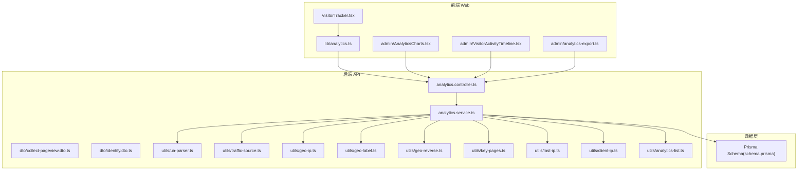
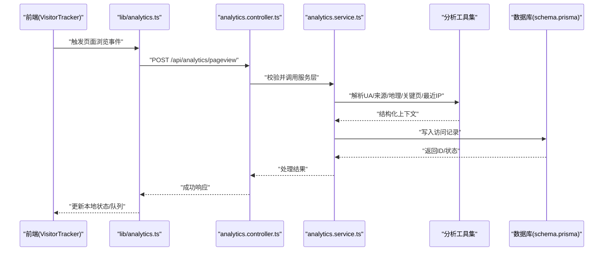
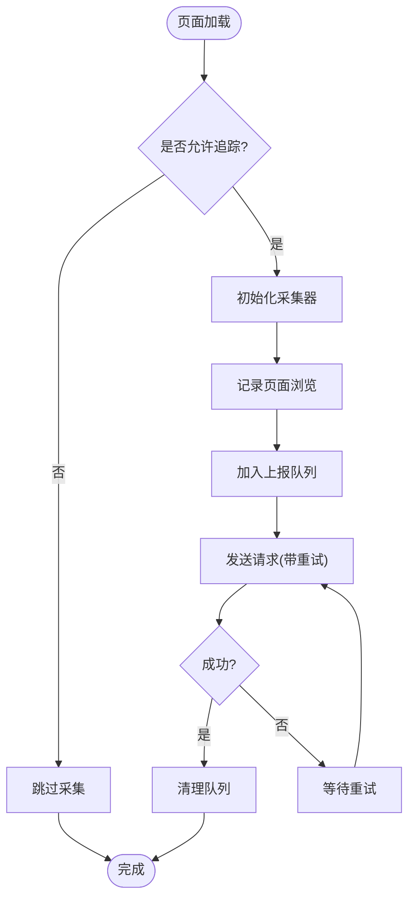
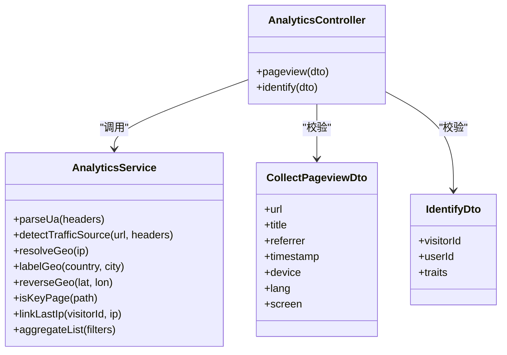
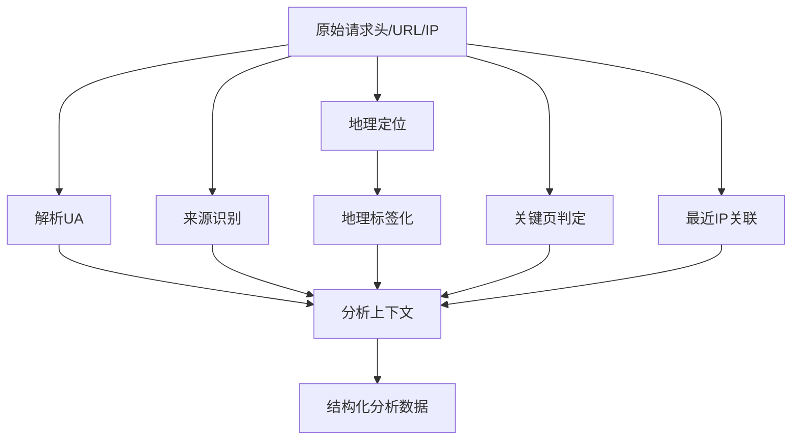
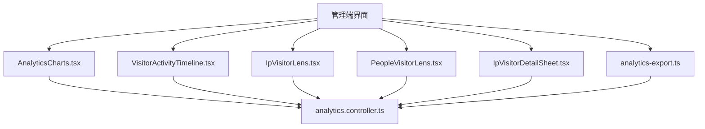
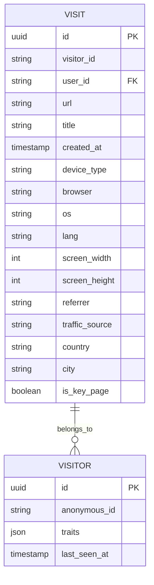
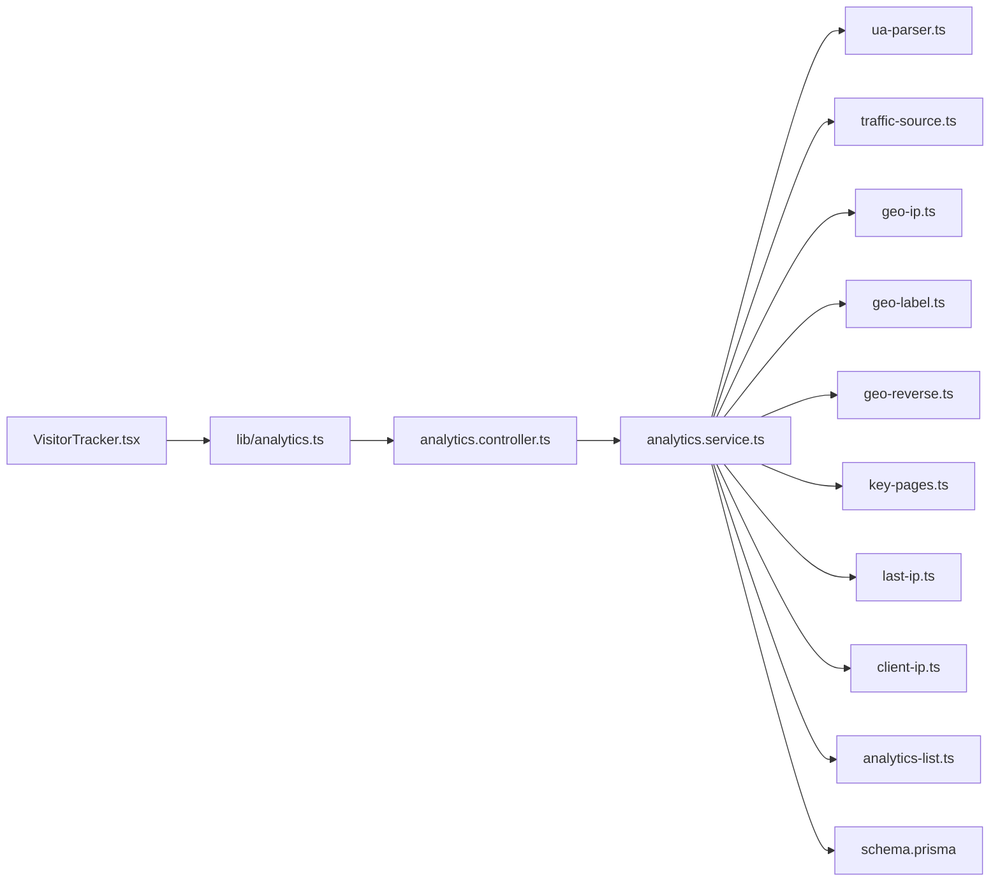

# 分析与追踪

<cite>
**本文引用的文件**   
- [VisitorTracker.tsx](file://apps/web/src/components/analytics/VisitorTracker.tsx)
- [analytics.ts](file://apps/web/src/lib/analytics.ts)
- [analytics.controller.ts](file://apps/api/src/analytics/analytics.controller.ts)
- [analytics.service.ts](file://apps/api/src/analytics/analytics.service.ts)
- [collect-pageview.dto.ts](file://apps/api/src/analytics/dto/collect-pageview.dto.ts)
- [identify.dto.ts](file://apps/api/src/analytics/dto/identify.dto.ts)
- [ua-parser.ts](file://apps/api/src/analytics/utils/ua-parser.ts)
- [traffic-source.ts](file://apps/api/src/analytics/utils/traffic-source.ts)
- [geo-ip.ts](file://apps/api/src/analytics/utils/geo-ip.ts)
- [geo-label.ts](file://apps/api/src/analytics/utils/geo-label.ts)
- [geo-reverse.ts](file://apps/api/src/analytics/utils/geo-reverse.ts)
- [key-pages.ts](file://apps/api/src/analytics/utils/key-pages.ts)
- [last-ip.ts](file://apps/api/src/analytics/utils/last-ip.ts)
- [client-ip.ts](file://apps/api/src/analytics/utils/client-ip.ts)
- [analytics-list.ts](file://apps/api/src/analytics/utils/analytics-list.ts)
- [IpVisitorLens.tsx](file://apps/admin/src/components/visitors/IpVisitorLens.tsx)
- [PeopleVisitorLens.tsx](file://apps/admin/src/components/visitors/PeopleVisitorLens.tsx)
- [AnalyticsCharts.tsx](file://apps/admin/src/components/analytics/AnalyticsCharts.tsx)
- [VisitorActivityTimeline.tsx](file://apps/admin/src/components/analytics/VisitorActivityTimeline.tsx)
- [IpVisitorDetailSheet.tsx](file://apps/admin/src/components/analytics/IpVisitorDetailSheet.tsx)
- [analytics-export.ts](file://apps/admin/src/features/analytics-export.ts)
- [analytics.ts](file://apps/admin/src/features/analytics.ts)
- [schema.prisma](file://apps/api/prisma/schema.prisma)
</cite>

## 目录
1. [简介](#简介)
2. [项目结构](#项目结构)
3. [核心组件](#核心组件)
4. [架构总览](#架构总览)
5. [详细组件分析](#详细组件分析)
6. [依赖关系分析](#依赖关系分析)
7. [性能考虑](#性能考虑)
8. [故障排查指南](#故障排查指南)
9. [结论](#结论)
10. [附录](#附录)

## 简介
本文件面向“分析与追踪”能力，覆盖访客行为追踪、页面访问统计、用户画像分析、性能监控、搜索引擎分析、转化跟踪、A/B测试支持与报表生成。文档从前端采集脚本的异步加载与隐私保护，到后端数据收集与上报机制，再到管理端可视化展示与导出，提供端到端的实现说明与最佳实践。

## 项目结构
本项目采用前后端分离：
- 前端（Next.js）负责埋点采集、事件上报、可视化图表与导出。
- 后端（NestJS）提供分析接口、数据处理、地理定位、来源识别、关键页判定等能力，并持久化至数据库。
- 管理端（Admin）提供访客维度、设备维度、活动时序、IP画像等分析视图与导出功能。

**图示来源** 
- [VisitorTracker.tsx](file://apps/web/src/components/analytics/VisitorTracker.tsx)
- [analytics.ts](file://apps/web/src/lib/analytics.ts)
- [analytics.controller.ts](file://apps/api/src/analytics/analytics.controller.ts)
- [analytics.service.ts](file://apps/api/src/analytics/analytics.service.ts)
- [collect-pageview.dto.ts](file://apps/api/src/analytics/dto/collect-pageview.dto.ts)
- [identify.dto.ts](file://apps/api/src/analytics/dto/identify.dto.ts)
- [ua-parser.ts](file://apps/api/src/analytics/utils/ua-parser.ts)
- [traffic-source.ts](file://apps/api/src/analytics/utils/traffic-source.ts)
- [geo-ip.ts](file://apps/api/src/analytics/utils/geo-ip.ts)
- [geo-label.ts](file://apps/api/src/analytics/utils/geo-label.ts)
- [geo-reverse.ts](file://apps/api/src/analytics/utils/geo-reverse.ts)
- [key-pages.ts](file://apps/api/src/analytics/utils/key-pages.ts)
- [last-ip.ts](file://apps/api/src/analytics/utils/last-ip.ts)
- [client-ip.ts](file://apps/api/src/analytics/utils/client-ip.ts)
- [analytics-list.ts](file://apps/api/src/analytics/utils/analytics-list.ts)
- [schema.prisma](file://apps/api/prisma/schema.prisma)

**章节来源**
- [VisitorTracker.tsx](file://apps/web/src/components/analytics/VisitorTracker.tsx)
- [analytics.ts](file://apps/web/src/lib/analytics.ts)
- [analytics.controller.ts](file://apps/api/src/analytics/analytics.controller.ts)
- [analytics.service.ts](file://apps/api/src/analytics/analytics.service.ts)
- [schema.prisma](file://apps/api/prisma/schema.prisma)

## 核心组件
- 前端采集器
  - VisitorTracker：在页面挂载时触发页面浏览事件，支持异步加载与隐私开关控制。
  - lib/analytics：封装上报逻辑、去抖/重试、事件队列与标识符管理。
- 后端分析服务
  - analytics.controller：接收页面浏览与身份识别请求，参数校验与路由分发。
  - analytics.service：解析UA、识别来源、地理定位、关键页判定、最近IP关联、列表聚合等。
- 管理端可视化
  - AnalyticsCharts：趋势图、渠道占比、设备分布等。
  - VisitorActivityTimeline：按时间线展示访客活动。
  - IpVisitorLens / PeopleVisitorLens：按IP或人维度的筛选与钻取。
  - IpVisitorDetailSheet：IP画像详情面板。
  - analytics-export：导出分析数据为CSV/Excel。

**章节来源**
- [VisitorTracker.tsx](file://apps/web/src/components/analytics/VisitorTracker.tsx)
- [analytics.ts](file://apps/web/src/lib/analytics.ts)
- [analytics.controller.ts](file://apps/api/src/analytics/analytics.controller.ts)
- [analytics.service.ts](file://apps/api/src/analytics/analytics.service.ts)
- [AnalyticsCharts.tsx](file://apps/admin/src/components/analytics/AnalyticsCharts.tsx)
- [VisitorActivityTimeline.tsx](file://apps/admin/src/components/analytics/VisitorActivityTimeline.tsx)
- [IpVisitorLens.tsx](file://apps/admin/src/components/visitors/IpVisitorLens.tsx)
- [PeopleVisitorLens.tsx](file://apps/admin/src/components/visitors/PeopleVisitorLens.tsx)
- [IpVisitorDetailSheet.tsx](file://apps/admin/src/components/analytics/IpVisitorDetailSheet.tsx)
- [analytics-export.ts](file://apps/admin/src/features/analytics-export.ts)

## 架构总览
整体流程分为“采集—传输—处理—存储—展示—导出”六个阶段：
- 采集：前端在页面可见时异步上报页面浏览事件；支持自定义事件与用户标识。
- 传输：通过轻量HTTP接口上报，支持失败重试与离线队列。
- 处理：服务端解析UA、来源、地理位置、关键页、最近IP等，形成结构化分析数据。
- 存储：持久化至数据库，供查询与聚合。
- 展示：管理端提供多维图表与时间线视图。
- 导出：支持批量导出与分析结果下载。

**图示来源** 
- [VisitorTracker.tsx](file://apps/web/src/components/analytics/VisitorTracker.tsx)
- [analytics.ts](file://apps/web/src/lib/analytics.ts)
- [analytics.controller.ts](file://apps/api/src/analytics/analytics.controller.ts)
- [analytics.service.ts](file://apps/api/src/analytics/analytics.service.ts)
- [collect-pageview.dto.ts](file://apps/api/src/analytics/dto/collect-pageview.dto.ts)
- [ua-parser.ts](file://apps/api/src/analytics/utils/ua-parser.ts)
- [traffic-source.ts](file://apps/api/src/analytics/utils/traffic-source.ts)
- [geo-ip.ts](file://apps/api/src/analytics/utils/geo-ip.ts)
- [geo-label.ts](file://apps/api/src/analytics/utils/geo-label.ts)
- [key-pages.ts](file://apps/api/src/analytics/utils/key-pages.ts)
- [last-ip.ts](file://apps/api/src/analytics/utils/last-ip.ts)
- [schema.prisma](file://apps/api/prisma/schema.prisma)

## 详细组件分析

### 前端采集与上报（VisitorTracker + lib/analytics）
- 异步加载与隐私保护
  - 仅在页面可见且用户未拒绝追踪时执行上报。
  - 支持延迟初始化与条件启用，避免阻塞首屏。
- 数据收集
  - 页面浏览：URL、标题、来源、时间戳、设备信息、语言、屏幕尺寸等。
  - 自定义事件：按钮点击、表单提交、媒体播放等，可携带键值对。
  - 用户画像：匿名ID、登录态标识（可选）、渠道标记、A/B实验分组。
- 上报机制
  - 使用Beacon或fetch，失败重试与队列缓存。
  - 批量上报与节流，降低网络开销。
- 隐私合规
  - 遵循最小化原则，不采集敏感字段。
  - 支持Cookie与本地存储策略配置。

**图示来源** 
- [VisitorTracker.tsx](file://apps/web/src/components/analytics/VisitorTracker.tsx)
- [analytics.ts](file://apps/web/src/lib/analytics.ts)

**章节来源**
- [VisitorTracker.tsx](file://apps/web/src/components/analytics/VisitorTracker.tsx)
- [analytics.ts](file://apps/web/src/lib/analytics.ts)

### 后端分析控制器与服务（controller + service）
- 控制器职责
  - 接收页面浏览与身份识别请求，进行DTO校验与权限检查。
  - 将请求转发至服务层处理。
- 服务层职责
  - UA解析：浏览器、操作系统、设备类型与版本。
  - 来源识别：直接访问、搜索引擎、社交媒体、广告渠道等。
  - 地理定位：基于IP获取国家/城市/运营商，支持反向解析与标签化。
  - 关键页判定：根据路径规则识别落地页、产品页、联系页等。
  - 最近IP关联：结合会话与历史访问，提升用户归因准确性。
  - 列表聚合：按时间粒度、渠道、设备、地域等维度聚合指标。
- 错误处理
  - 参数缺失、非法输入、外部服务超时等异常统一捕获与降级。

**图示来源** 
- [analytics.controller.ts](file://apps/api/src/analytics/analytics.controller.ts)
- [analytics.service.ts](file://apps/api/src/analytics/analytics.service.ts)
- [collect-pageview.dto.ts](file://apps/api/src/analytics/dto/collect-pageview.dto.ts)
- [identify.dto.ts](file://apps/api/src/analytics/dto/identify.dto.ts)

**章节来源**
- [analytics.controller.ts](file://apps/api/src/analytics/analytics.controller.ts)
- [analytics.service.ts](file://apps/api/src/analytics/analytics.service.ts)
- [collect-pageview.dto.ts](file://apps/api/src/analytics/dto/collect-pageview.dto.ts)
- [identify.dto.ts](file://apps/api/src/analytics/dto/identify.dto.ts)

### 分析工具集（UA、来源、地理、关键页、最近IP、列表）
- UA解析：标准化设备、浏览器、操作系统信息，便于后续分群与对比。
- 来源识别：解析referrer与UTM参数，区分自然搜索、付费投放、社媒引流等。
- 地理定位：IP→国家/城市/运营商，支持多源融合与标签映射。
- 关键页判定：匹配业务关键路径，用于转化漏斗与ROI评估。
- 最近IP关联：跨会话关联，提高访客画像连续性。
- 列表聚合：灵活过滤与分页，支撑报表与导出。

**图示来源** 
- [ua-parser.ts](file://apps/api/src/analytics/utils/ua-parser.ts)
- [traffic-source.ts](file://apps/api/src/analytics/utils/traffic-source.ts)
- [geo-ip.ts](file://apps/api/src/analytics/utils/geo-ip.ts)
- [geo-label.ts](file://apps/api/src/analytics/utils/geo-label.ts)
- [geo-reverse.ts](file://apps/api/src/analytics/utils/geo-reverse.ts)
- [key-pages.ts](file://apps/api/src/analytics/utils/key-pages.ts)
- [last-ip.ts](file://apps/api/src/analytics/utils/last-ip.ts)
- [client-ip.ts](file://apps/api/src/analytics/utils/client-ip.ts)
- [analytics-list.ts](file://apps/api/src/analytics/utils/analytics-list.ts)

**章节来源**
- [ua-parser.ts](file://apps/api/src/analytics/utils/ua-parser.ts)
- [traffic-source.ts](file://apps/api/src/analytics/utils/traffic-source.ts)
- [geo-ip.ts](file://apps/api/src/analytics/utils/geo-ip.ts)
- [geo-label.ts](file://apps/api/src/analytics/utils/geo-label.ts)
- [geo-reverse.ts](file://apps/api/src/analytics/utils/geo-reverse.ts)
- [key-pages.ts](file://apps/api/src/analytics/utils/key-pages.ts)
- [last-ip.ts](file://apps/api/src/analytics/utils/last-ip.ts)
- [client-ip.ts](file://apps/api/src/analytics/utils/client-ip.ts)
- [analytics-list.ts](file://apps/api/src/analytics/utils/analytics-list.ts)

### 管理端可视化与导出（Admin 分析视图）
- 图表与时间线
  - AnalyticsCharts：趋势、渠道占比、设备分布等。
  - VisitorActivityTimeline：按时间轴查看访客活动轨迹。
- 访客维度
  - IpVisitorLens：按IP筛选、聚合与下钻。
  - PeopleVisitorLens：按人维度聚合，合并同设备/同账号访问。
  - IpVisitorDetailSheet：IP画像详情，包含来源、地理、设备、关键页等。
- 数据导出
  - analytics-export：支持按筛选条件导出CSV/Excel，便于二次分析。

**图示来源** 
- [AnalyticsCharts.tsx](file://apps/admin/src/components/analytics/AnalyticsCharts.tsx)
- [VisitorActivityTimeline.tsx](file://apps/admin/src/components/analytics/VisitorActivityTimeline.tsx)
- [IpVisitorLens.tsx](file://apps/admin/src/components/visitors/IpVisitorLens.tsx)
- [PeopleVisitorLens.tsx](file://apps/admin/src/components/visitors/PeopleVisitorLens.tsx)
- [IpVisitorDetailSheet.tsx](file://apps/admin/src/components/analytics/IpVisitorDetailSheet.tsx)
- [analytics-export.ts](file://apps/admin/src/features/analytics-export.ts)
- [analytics.ts](file://apps/admin/src/features/analytics.ts)
- [analytics.controller.ts](file://apps/api/src/analytics/analytics.controller.ts)

**章节来源**
- [AnalyticsCharts.tsx](file://apps/admin/src/components/analytics/AnalyticsCharts.tsx)
- [VisitorActivityTimeline.tsx](file://apps/admin/src/components/analytics/VisitorActivityTimeline.tsx)
- [IpVisitorLens.tsx](file://apps/admin/src/components/visitors/IpVisitorLens.tsx)
- [PeopleVisitorLens.tsx](file://apps/admin/src/components/visitors/PeopleVisitorLens.tsx)
- [IpVisitorDetailSheet.tsx](file://apps/admin/src/components/analytics/IpVisitorDetailSheet.tsx)
- [analytics-export.ts](file://apps/admin/src/features/analytics-export.ts)
- [analytics.ts](file://apps/admin/src/features/analytics.ts)

### 数据模型（Prisma）
- 访问记录：包含URL、标题、时间戳、设备、语言、屏幕、来源、地理、关键页标记等。
- 访客与用户关联：匿名ID与登录态用户ID的映射，支持会话级与跨会话归因。
- 索引与约束：针对常用查询字段建立索引，优化聚合与导出性能。

**图示来源** 
- [schema.prisma](file://apps/api/prisma/schema.prisma)

**章节来源**
- [schema.prisma](file://apps/api/prisma/schema.prisma)

## 依赖关系分析
- 前端依赖
  - VisitorTracker依赖lib/analytics进行上报与队列管理。
  - 管理端组件依赖统一的analytics接口封装。
- 后端依赖
  - controller依赖service进行业务处理。
  - service依赖多个工具模块进行上下文构建。
  - 所有数据落库依赖Prisma与数据库。
- 外部依赖
  - UA解析库、地理定位服务、可能的第三方分析SDK（可选）。

**图示来源** 
- [VisitorTracker.tsx](file://apps/web/src/components/analytics/VisitorTracker.tsx)
- [analytics.ts](file://apps/web/src/lib/analytics.ts)
- [analytics.controller.ts](file://apps/api/src/analytics/analytics.controller.ts)
- [analytics.service.ts](file://apps/api/src/analytics/analytics.service.ts)
- [ua-parser.ts](file://apps/api/src/analytics/utils/ua-parser.ts)
- [traffic-source.ts](file://apps/api/src/analytics/utils/traffic-source.ts)
- [geo-ip.ts](file://apps/api/src/analytics/utils/geo-ip.ts)
- [geo-label.ts](file://apps/api/src/analytics/utils/geo-label.ts)
- [geo-reverse.ts](file://apps/api/src/analytics/utils/geo-reverse.ts)
- [key-pages.ts](file://apps/api/src/analytics/utils/key-pages.ts)
- [last-ip.ts](file://apps/api/src/analytics/utils/last-ip.ts)
- [client-ip.ts](file://apps/api/src/analytics/utils/client-ip.ts)
- [analytics-list.ts](file://apps/api/src/analytics/utils/analytics-list.ts)
- [schema.prisma](file://apps/api/prisma/schema.prisma)

**章节来源**
- [analytics.controller.ts](file://apps/api/src/analytics/analytics.controller.ts)
- [analytics.service.ts](file://apps/api/src/analytics/analytics.service.ts)
- [schema.prisma](file://apps/api/prisma/schema.prisma)

## 性能考虑
- 前端
  - 异步加载与懒初始化，避免阻塞首屏渲染。
  - 批量上报与节流，减少网络请求频率。
  - 失败重试与离线队列，保证数据完整性。
- 后端
  - 参数校验前置，快速失败。
  - 工具函数无副作用与幂等设计，便于缓存与并行处理。
  - 数据库索引优化，聚合查询分页与限流。
- 存储
  - 合理分区与归档策略，控制表大小与查询成本。
  - 冷热数据分离，热点数据缓存。

[本节为通用指导，无需具体文件引用]

## 故障排查指南
- 常见问题
  - 采集未生效：检查隐私开关、页面可见性、网络拦截与CORS设置。
  - 上报失败：查看重试策略、队列积压、接口限流与错误码。
  - 来源识别不准：核对referrer与UTM参数规范。
  - 地理定位偏差：确认IP库更新与代理/CDN透传真实IP。
  - 关键页误判：检查路径规则与动态路由匹配。
- 调试建议
  - 前端控制台输出采集日志与队列状态。
  - 后端开启请求日志与慢查询分析。
  - 使用管理端“最近活动”与“IP画像”验证链路。

**章节来源**
- [analytics.controller.ts](file://apps/api/src/analytics/analytics.controller.ts)
- [analytics.service.ts](file://apps/api/src/analytics/analytics.service.ts)
- [analytics.ts](file://apps/web/src/lib/analytics.ts)

## 结论
本分析与追踪方案以“轻量采集、稳健上报、丰富上下文、多维可视化、便捷导出”为核心目标，覆盖从前端埋点到后端处理与管理端展示的完整链路。通过严格的隐私保护与性能优化，确保数据采集的合规性与可用性。建议在业务演进中持续完善关键页规则、来源识别与地理定位精度，并结合A/B测试与转化漏斗，驱动增长决策。

[本节为总结性内容，无需具体文件引用]

## 附录
- 实施清单
  - 在前端集成VisitorTracker与lib/analytics，配置隐私开关与上报策略。
  - 在后端部署analytics.controller与analytics.service，接入UA、来源、地理等工具。
  - 在管理端启用图表、时间线与导出功能，配置筛选维度与权限。
  - 维护数据模型与索引，定期归档与备份。
- 扩展方向
  - 增加自定义事件与属性定义，支持更细粒度的行为分析。
  - 引入A/B测试框架与实验分组，结合转化跟踪评估效果。
  - 对接第三方分析平台，实现数据互通与互补。

[本节为补充说明，无需具体文件引用]