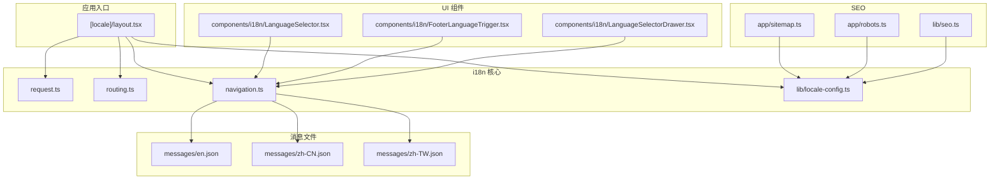
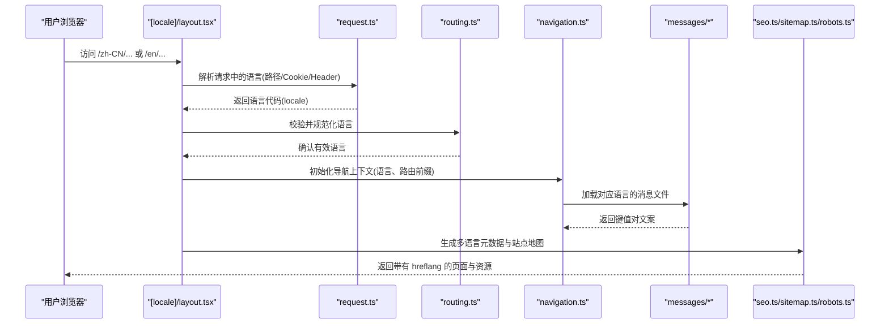
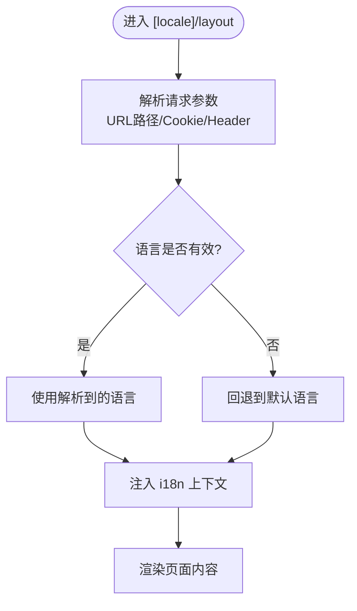
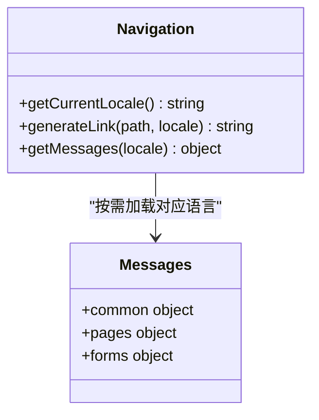
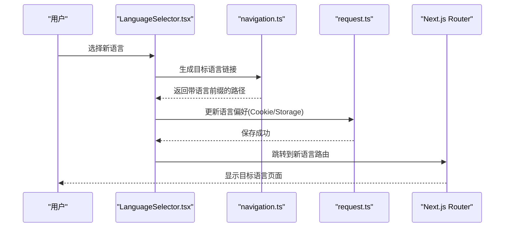
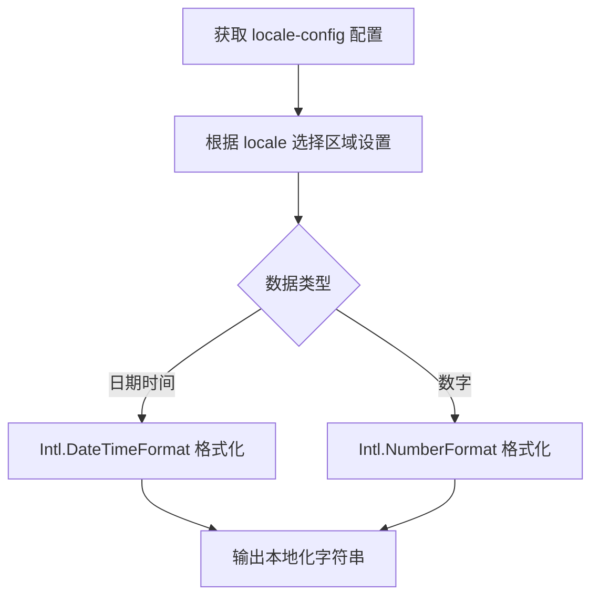
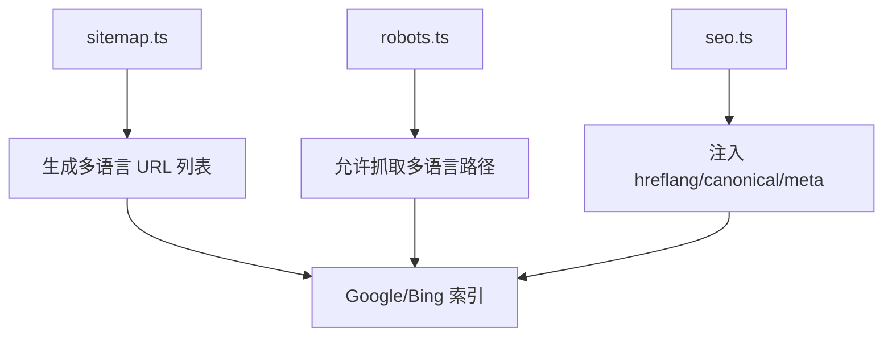
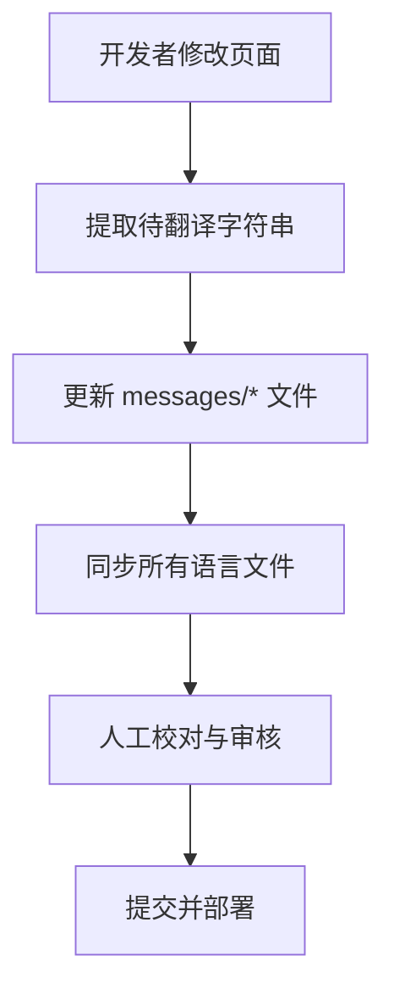
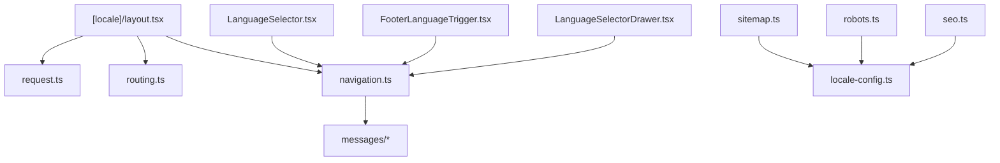

# 国际化(i18n)

<cite>
**本文引用的文件**   
- [apps/web/src/app/[locale]/layout.tsx](file://apps/web/src/app/[locale]/layout.tsx)
- [apps/web/src/i18n/navigation.ts](file://apps/web/src/i18n/navigation.ts)
- [apps/web/src/i18n/request.ts](file://apps/web/src/i18n/request.ts)
- [apps/web/src/i18n/routing.ts](file://apps/web/src/i18n/routing.ts)
- [apps/web/src/messages/en.json](file://apps/web/src/messages/en.json)
- [apps/web/src/messages/zh-CN.json](file://apps/web/src/messages/zh-CN.json)
- [apps/web/src/messages/zh-TW.json](file://apps/web/src/messages/zh-TW.json)
- [apps/web/src/components/i18n/LanguageSelector.tsx](file://apps/web/src/components/i18n/LanguageSelector.tsx)
- [apps/web/src/components/i18n/FooterLanguageTrigger.tsx](file://apps/web/src/components/i18n/FooterLanguageTrigger.tsx)
- [apps/web/src/components/i18n/LanguageSelectorDrawer.tsx](file://apps/web/src/components/i18n/LanguageSelectorDrawer.tsx)
- [apps/web/src/lib/locale-config.ts](file://apps/web/src/lib/locale-config.ts)
- [apps/web/src/lib/seo.ts](file://apps/web/src/lib/seo.ts)
- [apps/web/src/app/sitemap.ts](file://apps/web/src/app/sitemap.ts)
- [apps/web/src/app/robots.ts](file://apps/web/src/app/robots.ts)
- [apps/web/scripts/i18n-batch-refactor.py](file://apps/web/scripts/i18n-batch-refactor.py)
- [apps/web/scripts/i18n-extract-pages.py](file://apps/web/scripts/i18n-extract-pages.py)
- [apps/web/scripts/i18n-replace-strings.py](file://apps/web/scripts/i18n-replace-strings.py)
- [apps/web/scripts/i18n-sync-locales.py](file://apps/web/scripts/i18n-sync-locales.py)
</cite>

## 目录
1. [简介](#简介)
2. [项目结构](#项目结构)
3. [核心组件](#核心组件)
4. [架构总览](#架构总览)
5. [详细组件分析](#详细组件分析)
6. [依赖关系分析](#依赖关系分析)
7. [性能考虑](#性能考虑)
8. [故障排查指南](#故障排查指南)
9. [结论](#结论)
10. [附录](#附录)

## 简介
本文件面向基于 Next.js App Router 的国际化（i18n）实现，覆盖多语言配置、消息文件管理、路由国际化与本地化策略。重点说明：
- 语言检测与切换机制
- 日期时间格式化与数字格式化策略
- 翻译文件的组织结构与工作流程
- 多语言 SEO 优化、URL 结构与用户偏好设置
- 工具脚本与最佳实践

## 项目结构
本项目采用 Next.js App Router 的多语言路由模式，通过 [locale] 动态段组织页面，并在根布局中注入 i18n 上下文。消息文件按语言分目录存放，并提供统一的导航与请求处理模块。

图表来源
- [apps/web/src/app/[locale]/layout.tsx](file://apps/web/src/app/[locale]/layout.tsx)
- [apps/web/src/i18n/request.ts](file://apps/web/src/i18n/request.ts)
- [apps/web/src/i18n/routing.ts](file://apps/web/src/i18n/routing.ts)
- [apps/web/src/i18n/navigation.ts](file://apps/web/src/i18n/navigation.ts)
- [apps/web/src/lib/locale-config.ts](file://apps/web/src/lib/locale-config.ts)
- [apps/web/src/messages/en.json](file://apps/web/src/messages/en.json)
- [apps/web/src/messages/zh-CN.json](file://apps/web/src/messages/zh-CN.json)
- [apps/web/src/messages/zh-TW.json](file://apps/web/src/messages/zh-TW.json)
- [apps/web/src/components/i18n/LanguageSelector.tsx](file://apps/web/src/components/i18n/LanguageSelector.tsx)
- [apps/web/src/components/i18n/FooterLanguageTrigger.tsx](file://apps/web/src/components/i18n/FooterLanguageTrigger.tsx)
- [apps/web/src/components/i18n/LanguageSelectorDrawer.tsx](file://apps/web/src/components/i18n/LanguageSelectorDrawer.tsx)
- [apps/web/src/app/sitemap.ts](file://apps/web/src/app/sitemap.ts)
- [apps/web/src/app/robots.ts](file://apps/web/src/app/robots.ts)
- [apps/web/src/lib/seo.ts](file://apps/web/src/lib/seo.ts)

章节来源
- [apps/web/src/app/[locale]/layout.tsx](file://apps/web/src/app/[locale]/layout.tsx)
- [apps/web/src/i18n/routing.ts](file://apps/web/src/i18n/routing.ts)
- [apps/web/src/i18n/request.ts](file://apps/web/src/i18n/request.ts)
- [apps/web/src/i18n/navigation.ts](file://apps/web/src/i18n/navigation.ts)
- [apps/web/src/lib/locale-config.ts](file://apps/web/src/lib/locale-config.ts)

## 核心组件
- 路由与语言检测
  - routing.ts：定义支持的语言集合与默认语言，供 Next.js i18n 使用。
  - request.ts：在请求阶段解析语言（优先从 URL 路径、Cookie、Header 等），并注入到请求上下文。
  - [locale]/layout.tsx：作为带语言的布局入口，确保所有子页面具备 i18n 上下文。
- 导航与消息
  - navigation.ts：提供与语言相关的导航辅助函数，如生成带语言的链接、获取当前语言等。
  - messages/*：按语言划分的 JSON 消息文件，用于 UI 文案、表单提示、错误信息等。
- 用户交互
  - LanguageSelector.tsx、FooterLanguageTrigger.tsx、LanguageSelectorDrawer.tsx：提供语言选择入口，触发语言切换与路由跳转。
- 本地化配置与 SEO
  - locale-config.ts：集中管理语言相关配置（如区域设置、时区、格式选项）。
  - seo.ts、sitemap.ts、robots.ts：为多语言站点生成 SEO 元数据、站点地图与爬虫规则。

章节来源
- [apps/web/src/i18n/routing.ts](file://apps/web/src/i18n/routing.ts)
- [apps/web/src/i18n/request.ts](file://apps/web/src/i18n/request.ts)
- [apps/web/src/app/[locale]/layout.tsx](file://apps/web/src/app/[locale]/layout.tsx)
- [apps/web/src/i18n/navigation.ts](file://apps/web/src/i18n/navigation.ts)
- [apps/web/src/messages/en.json](file://apps/web/src/messages/en.json)
- [apps/web/src/messages/zh-CN.json](file://apps/web/src/messages/zh-CN.json)
- [apps/web/src/messages/zh-TW.json](file://apps/web/src/messages/zh-TW.json)
- [apps/web/src/components/i18n/LanguageSelector.tsx](file://apps/web/src/components/i18n/LanguageSelector.tsx)
- [apps/web/src/components/i18n/FooterLanguageTrigger.tsx](file://apps/web/src/components/i18n/FooterLanguageTrigger.tsx)
- [apps/web/src/components/i18n/LanguageSelectorDrawer.tsx](file://apps/web/src/components/i18n/LanguageSelectorDrawer.tsx)
- [apps/web/src/lib/locale-config.ts](file://apps/web/src/lib/locale-config.ts)
- [apps/web/src/lib/seo.ts](file://apps/web/src/lib/seo.ts)
- [apps/web/src/app/sitemap.ts](file://apps/web/src/app/sitemap.ts)
- [apps/web/src/app/robots.ts](file://apps/web/src/app/robots.ts)

## 架构总览
下图展示了语言检测、切换与渲染的关键流程，以及各模块之间的依赖关系。

图表来源
- [apps/web/src/app/[locale]/layout.tsx](file://apps/web/src/app/[locale]/layout.tsx)
- [apps/web/src/i18n/request.ts](file://apps/web/src/i18n/request.ts)
- [apps/web/src/i18n/routing.ts](file://apps/web/src/i18n/routing.ts)
- [apps/web/src/i18n/navigation.ts](file://apps/web/src/i18n/navigation.ts)
- [apps/web/src/messages/en.json](file://apps/web/src/messages/en.json)
- [apps/web/src/messages/zh-CN.json](file://apps/web/src/messages/zh-CN.json)
- [apps/web/src/messages/zh-TW.json](file://apps/web/src/messages/zh-TW.json)
- [apps/web/src/lib/seo.ts](file://apps/web/src/lib/seo.ts)
- [apps/web/src/app/sitemap.ts](file://apps/web/src/app/sitemap.ts)
- [apps/web/src/app/robots.ts](file://apps/web/src/app/robots.ts)

## 详细组件分析

### 语言检测与路由国际化
- routing.ts：声明支持的语言列表与默认语言，供 Next.js 路由系统识别。
- request.ts：在请求生命周期内解析语言，优先级建议为：URL 路径 > Cookie > Header > 默认语言。
- [locale]/layout.tsx：作为带语言的布局入口，确保后续页面渲染时使用正确的 locale。

图表来源
- [apps/web/src/i18n/routing.ts](file://apps/web/src/i18n/routing.ts)
- [apps/web/src/i18n/request.ts](file://apps/web/src/i18n/request.ts)
- [apps/web/src/app/[locale]/layout.tsx](file://apps/web/src/app/[locale]/layout.tsx)

章节来源
- [apps/web/src/i18n/routing.ts](file://apps/web/src/i18n/routing.ts)
- [apps/web/src/i18n/request.ts](file://apps/web/src/i18n/request.ts)
- [apps/web/src/app/[locale]/layout.tsx](file://apps/web/src/app/[locale]/layout.tsx)

### 导航与消息管理
- navigation.ts：封装语言感知的导航方法，例如生成带语言前缀的路由、获取当前语言、构建多语言链接等。
- messages/*：每个语言一个 JSON 文件，建议按功能域拆分键名（如 common、pages、forms），保持键一致性与可维护性。

图表来源
- [apps/web/src/i18n/navigation.ts](file://apps/web/src/i18n/navigation.ts)
- [apps/web/src/messages/en.json](file://apps/web/src/messages/en.json)
- [apps/web/src/messages/zh-CN.json](file://apps/web/src/messages/zh-CN.json)
- [apps/web/src/messages/zh-TW.json](file://apps/web/src/messages/zh-TW.json)

章节来源
- [apps/web/src/i18n/navigation.ts](file://apps/web/src/i18n/navigation.ts)
- [apps/web/src/messages/en.json](file://apps/web/src/messages/en.json)
- [apps/web/src/messages/zh-CN.json](file://apps/web/src/messages/zh-CN.json)
- [apps/web/src/messages/zh-TW.json](file://apps/web/src/messages/zh-TW.json)

### 语言切换与用户偏好设置
- LanguageSelector.tsx、FooterLanguageTrigger.tsx、LanguageSelectorDrawer.tsx：提供多种入口进行语言切换，通常通过更新 Cookie 或 URL 参数来持久化用户偏好，并触发客户端重定向到目标语言路由。
- 推荐策略：将首选语言存储在 Cookie 或 localStorage，并在 request.ts 中读取以决定默认语言；同时保证 URL 始终显式包含语言前缀，便于 SEO 与分享。

图表来源
- [apps/web/src/components/i18n/LanguageSelector.tsx](file://apps/web/src/components/i18n/LanguageSelector.tsx)
- [apps/web/src/components/i18n/FooterLanguageTrigger.tsx](file://apps/web/src/components/i18n/FooterLanguageTrigger.tsx)
- [apps/web/src/components/i18n/LanguageSelectorDrawer.tsx](file://apps/web/src/components/i18n/LanguageSelectorDrawer.tsx)
- [apps/web/src/i18n/navigation.ts](file://apps/web/src/i18n/navigation.ts)
- [apps/web/src/i18n/request.ts](file://apps/web/src/i18n/request.ts)

章节来源
- [apps/web/src/components/i18n/LanguageSelector.tsx](file://apps/web/src/components/i18n/LanguageSelector.tsx)
- [apps/web/src/components/i18n/FooterLanguageTrigger.tsx](file://apps/web/src/components/i18n/FooterLanguageTrigger.tsx)
- [apps/web/src/components/i18n/LanguageSelectorDrawer.tsx](file://apps/web/src/components/i18n/LanguageSelectorDrawer.tsx)
- [apps/web/src/i18n/navigation.ts](file://apps/web/src/i18n/navigation.ts)
- [apps/web/src/i18n/request.ts](file://apps/web/src/i18n/request.ts)

### 日期时间与数字格式化
- 建议使用 locale-config.ts 集中管理区域设置（如 zh-CN、en-US、zh-TW），并通过 Intl API 进行日期、时间与数字格式化。
- 推荐做法：在服务端与客户端统一使用同一份区域配置，避免不一致；对于需要本地化的字符串，优先走 messages/*，而非硬编码格式化结果。

图表来源
- [apps/web/src/lib/locale-config.ts](file://apps/web/src/lib/locale-config.ts)

章节来源
- [apps/web/src/lib/locale-config.ts](file://apps/web/src/lib/locale-config.ts)

### 多语言 SEO 优化与 URL 结构
- sitemap.ts：为每种语言生成对应的站点地图条目，确保搜索引擎索引多语言版本。
- robots.ts：允许爬虫抓取多语言路径，避免重复内容问题。
- seo.ts：为页面注入 hreflang、canonical、title、description 等多语言元数据，提升 SEO 表现。

图表来源
- [apps/web/src/app/sitemap.ts](file://apps/web/src/app/sitemap.ts)
- [apps/web/src/app/robots.ts](file://apps/web/src/app/robots.ts)
- [apps/web/src/lib/seo.ts](file://apps/web/src/lib/seo.ts)

章节来源
- [apps/web/src/app/sitemap.ts](file://apps/web/src/app/sitemap.ts)
- [apps/web/src/app/robots.ts](file://apps/web/src/app/robots.ts)
- [apps/web/src/lib/seo.ts](file://apps/web/src/lib/seo.ts)

### 翻译文件组织与工作流程
- 文件结构：按语言划分目录（如 en、zh-CN、zh-TW），每个语言一个 JSON 文件，建议按功能域拆分键名，保持一致性。
- 工具脚本：
  - i18n-extract-pages.py：从页面组件中提取待翻译字符串。
  - i18n-batch-refactor.py：批量重构与迁移翻译键。
  - i18n-replace-strings.py：替换已废弃或变更的字符串。
  - i18n-sync-locales.py：同步新增键到所有语言文件，确保一致性。

图表来源
- [apps/web/scripts/i18n-extract-pages.py](file://apps/web/scripts/i18n-extract-pages.py)
- [apps/web/scripts/i18n-batch-refactor.py](file://apps/web/scripts/i18n-batch-refactor.py)
- [apps/web/scripts/i18n-replace-strings.py](file://apps/web/scripts/i18n-replace-strings.py)
- [apps/web/scripts/i18n-sync-locales.py](file://apps/web/scripts/i18n-sync-locales.py)

章节来源
- [apps/web/scripts/i18n-extract-pages.py](file://apps/web/scripts/i18n-extract-pages.py)
- [apps/web/scripts/i18n-batch-refactor.py](file://apps/web/scripts/i18n-batch-refactor.py)
- [apps/web/scripts/i18n-replace-strings.py](file://apps/web/scripts/i18n-replace-strings.py)
- [apps/web/scripts/i18n-sync-locales.py](file://apps/web/scripts/i18n-sync-locales.py)

## 依赖关系分析
- 组件耦合：
  - [locale]/layout.tsx 依赖 request.ts 与 routing.ts 完成语言检测与校验。
  - navigation.ts 依赖 messages/* 提供文案，被语言选择组件调用。
  - 语言选择组件依赖 navigation.ts 生成链接，并依赖 request.ts 持久化用户偏好。
- SEO 模块：
  - sitemap.ts、robots.ts、seo.ts 共同协作，确保多语言站点的可索引性与元数据正确性。

图表来源
- [apps/web/src/app/[locale]/layout.tsx](file://apps/web/src/app/[locale]/layout.tsx)
- [apps/web/src/i18n/request.ts](file://apps/web/src/i18n/request.ts)
- [apps/web/src/i18n/routing.ts](file://apps/web/src/i18n/routing.ts)
- [apps/web/src/i18n/navigation.ts](file://apps/web/src/i18n/navigation.ts)
- [apps/web/src/messages/en.json](file://apps/web/src/messages/en.json)
- [apps/web/src/messages/zh-CN.json](file://apps/web/src/messages/zh-CN.json)
- [apps/web/src/messages/zh-TW.json](file://apps/web/src/messages/zh-TW.json)
- [apps/web/src/components/i18n/LanguageSelector.tsx](file://apps/web/src/components/i18n/LanguageSelector.tsx)
- [apps/web/src/components/i18n/FooterLanguageTrigger.tsx](file://apps/web/src/components/i18n/FooterLanguageTrigger.tsx)
- [apps/web/src/components/i18n/LanguageSelectorDrawer.tsx](file://apps/web/src/components/i18n/LanguageSelectorDrawer.tsx)
- [apps/web/src/app/sitemap.ts](file://apps/web/src/app/sitemap.ts)
- [apps/web/src/app/robots.ts](file://apps/web/src/app/robots.ts)
- [apps/web/src/lib/locale-config.ts](file://apps/web/src/lib/locale-config.ts)

章节来源
- [apps/web/src/app/[locale]/layout.tsx](file://apps/web/src/app/[locale]/layout.tsx)
- [apps/web/src/i18n/request.ts](file://apps/web/src/i18n/request.ts)
- [apps/web/src/i18n/routing.ts](file://apps/web/src/i18n/routing.ts)
- [apps/web/src/i18n/navigation.ts](file://apps/web/src/i18n/navigation.ts)
- [apps/web/src/messages/en.json](file://apps/web/src/messages/en.json)
- [apps/web/src/messages/zh-CN.json](file://apps/web/src/messages/zh-CN.json)
- [apps/web/src/messages/zh-TW.json](file://apps/web/src/messages/zh-TW.json)
- [apps/web/src/components/i18n/LanguageSelector.tsx](file://apps/web/src/components/i18n/LanguageSelector.tsx)
- [apps/web/src/components/i18n/FooterLanguageTrigger.tsx](file://apps/web/src/components/i18n/FooterLanguageTrigger.tsx)
- [apps/web/src/components/i18n/LanguageSelectorDrawer.tsx](file://apps/web/src/components/i18n/LanguageSelectorDrawer.tsx)
- [apps/web/src/app/sitemap.ts](file://apps/web/src/app/sitemap.ts)
- [apps/web/src/app/robots.ts](file://apps/web/src/app/robots.ts)
- [apps/web/src/lib/locale-config.ts](file://apps/web/src/lib/locale-config.ts)

## 性能考虑
- 按需加载消息文件：仅在需要时加载对应语言的消息，减少首屏体积。
- 缓存语言偏好：使用 Cookie 或 localStorage 缓存用户首选语言，避免重复解析。
- 静态生成与增量预渲染：对静态页面启用 SSG，结合 ISR 提升多语言页面的加载速度。
- 图片与媒体本地化：针对不同地区提供合适的媒体资源，减少不必要的下载。

## 故障排查指南
- 语言未生效
  - 检查 routing.ts 是否包含目标语言。
  - 确认 request.ts 是否正确解析 URL、Cookie、Header。
  - 验证 [locale]/layout.tsx 是否正确注入 i18n 上下文。
- 文案缺失或错位
  - 使用 i18n-extract-pages.py 重新提取待翻译字符串。
  - 运行 i18n-sync-locales.py 同步新增键到所有语言文件。
  - 人工校对 messages/* 文件，确保键一致。
- SEO 问题
  - 检查 sitemap.ts 是否包含所有语言版本。
  - 确认 seo.ts 生成的 hreflang 与 canonical 标签正确。
  - 查看 robots.ts 是否阻止了多语言路径的抓取。

章节来源
- [apps/web/src/i18n/routing.ts](file://apps/web/src/i18n/routing.ts)
- [apps/web/src/i18n/request.ts](file://apps/web/src/i18n/request.ts)
- [apps/web/src/app/[locale]/layout.tsx](file://apps/web/src/app/[locale]/layout.tsx)
- [apps/web/src/i18n/navigation.ts](file://apps/web/src/i18n/navigation.ts)
- [apps/web/src/messages/en.json](file://apps/web/src/messages/en.json)
- [apps/web/src/messages/zh-CN.json](file://apps/web/src/messages/zh-CN.json)
- [apps/web/src/messages/zh-TW.json](file://apps/web/src/messages/zh-TW.json)
- [apps/web/src/app/sitemap.ts](file://apps/web/src/app/sitemap.ts)
- [apps/web/src/app/robots.ts](file://apps/web/src/app/robots.ts)
- [apps/web/src/lib/seo.ts](file://apps/web/src/lib/seo.ts)

## 结论
本项目通过 Next.js App Router 的多语言路由与请求处理，实现了完整的国际化能力。配合消息文件管理、语言切换组件与 SEO 优化，能够满足多语言站点的业务需求。建议持续完善翻译工作流程与自动化脚本，确保文案一致性与可维护性。

## 附录
- 最佳实践清单
  - 始终在 URL 中包含语言前缀，便于 SEO 与分享。
  - 使用统一的区域配置管理日期、时间与数字格式化。
  - 通过工具脚本自动化翻译键的提取、同步与替换。
  - 为每种语言生成独立的站点地图与 SEO 元数据。
  - 在语言切换后持久化用户偏好，提升用户体验。