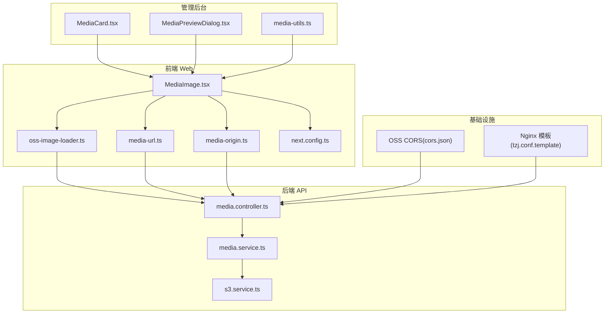
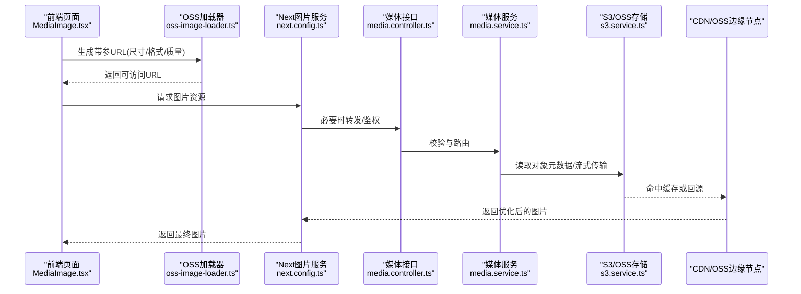
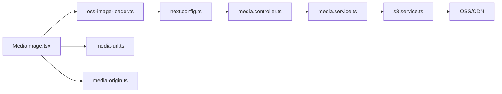

# 图片优化与处理

<cite>
**本文引用的文件**   
- [MediaImage.tsx](file://apps/web/src/components/MediaImage.tsx)
- [oss-image-loader.ts](file://apps/web/src/lib/oss-image-loader.ts)
- [media-url.ts](file://apps/web/src/lib/media-url.ts)
- [media-origin.ts](file://apps/web/src/lib/media-origin.ts)
- [next.config.ts](file://apps/web/next.config.ts)
- [MediaCard.tsx](file://apps/admin/src/components/media/MediaCard.tsx)
- [MediaPreviewDialog.tsx](file://apps/admin/src/components/media/MediaPreviewDialog.tsx)
- [media-utils.ts](file://apps/admin/src/components/media/media-utils.ts)
- [media.controller.ts](file://apps/api/src/media/media.controller.ts)
- [media.service.ts](file://apps/api/src/media/media.service.ts)
- [s3.service.ts](file://apps/api/src/storage/s3.service.ts)
- [cors.json](file://infra/docker/oss/cors.json)
- [tzj.conf.template](file://infra/docker/nginx/tzj.conf.template)
</cite>

## 目录
1. [简介](#简介)
2. [项目结构](#项目结构)
3. [核心组件](#核心组件)
4. [架构总览](#架构总览)
5. [详细组件分析](#详细组件分析)
6. [依赖关系分析](#依赖关系分析)
7. [性能考量](#性能考量)
8. [故障排查指南](#故障排查指南)
9. [结论](#结论)
10. [附录](#附录)

## 简介
本文件面向前端、后端与运维人员，系统性阐述本项目中“图片优化与处理”的实现方案与最佳实践。重点覆盖：
- MediaImage 组件的实现原理与使用方式
- OSS 图片加载器的配置与扩展
- 图片格式转换（WebP、AVIF）策略与兼容性回退
- 尺寸适配、懒加载与缓存策略
- 图片压缩算法选择与 CDN 加速配置
- 移动端适配方案
- 图片 SEO 优化、Alt 文本处理与性能监控

## 项目结构
与图片相关的代码主要分布在以下位置：
- 前端 Web 应用（Next.js）
  - 组件层：MediaImage.tsx
  - 资源加载器：oss-image-loader.ts
  - URL 构建与来源解析：media-url.ts、media-origin.ts
  - Next 配置：next.config.ts（图片服务与远程域名白名单）
- 管理后台（Next.js）
  - 媒体卡片与预览：MediaCard.tsx、MediaPreviewDialog.tsx、media-utils.ts
- 后端 API（NestJS）
  - 媒体接口：media.controller.ts、media.service.ts
  - 存储抽象：s3.service.ts（兼容 S3/OSS）
- 基础设施
  - OSS CORS 配置：cors.json
  - Nginx 模板：tzj.conf.template（CDN/代理相关）

图表来源
- [MediaImage.tsx](file://apps/web/src/components/MediaImage.tsx)
- [oss-image-loader.ts](file://apps/web/src/lib/oss-image-loader.ts)
- [media-url.ts](file://apps/web/src/lib/media-url.ts)
- [media-origin.ts](file://apps/web/src/lib/media-origin.ts)
- [next.config.ts](file://apps/web/next.config.ts)
- [MediaCard.tsx](file://apps/admin/src/components/media/MediaCard.tsx)
- [MediaPreviewDialog.tsx](file://apps/admin/src/components/media/MediaPreviewDialog.tsx)
- [media-utils.ts](file://apps/admin/src/components/media/media-utils.ts)
- [media.controller.ts](file://apps/api/src/media/media.controller.ts)
- [media.service.ts](file://apps/api/src/media/media.service.ts)
- [s3.service.ts](file://apps/api/src/storage/s3.service.ts)
- [cors.json](file://infra/docker/oss/cors.json)
- [tzj.conf.template](file://infra/docker/nginx/tzj.conf.template)

章节来源
- [MediaImage.tsx](file://apps/web/src/components/MediaImage.tsx)
- [oss-image-loader.ts](file://apps/web/src/lib/oss-image-loader.ts)
- [media-url.ts](file://apps/web/src/lib/media-url.ts)
- [media-origin.ts](file://apps/web/src/lib/media-origin.ts)
- [next.config.ts](file://apps/web/next.config.ts)
- [MediaCard.tsx](file://apps/admin/src/components/media/MediaCard.tsx)
- [MediaPreviewDialog.tsx](file://apps/admin/src/components/media/MediaPreviewDialog.tsx)
- [media-utils.ts](file://apps/admin/src/components/media/media-utils.ts)
- [media.controller.ts](file://apps/api/src/media/media.controller.ts)
- [media.service.ts](file://apps/api/src/media/media.service.ts)
- [s3.service.ts](file://apps/api/src/storage/s3.service.ts)
- [cors.json](file://infra/docker/oss/cors.json)
- [tzj.conf.template](file://infra/docker/nginx/tzj.conf.template)

## 核心组件
- MediaImage 组件
  - 职责：统一渲染图片，支持懒加载、占位图、尺寸适配、格式优先（WebP/AVIF）、SEO 属性注入（alt/title/aria）。
  - 关键能力：通过 Next 的 Image 机制与自定义 loader 组合，实现按设备 DPR 与容器宽度输出合适尺寸；在不可用或失败时降级为原图或占位图。
- OSS 图片加载器
  - 职责：将原始对象路径转换为带参数的 CDN/OSS 访问 URL，支持尺寸裁剪、质量、格式转换、水印等参数拼装。
- 媒体 URL 构建与来源解析
  - 职责：根据环境（本地/生产）与站点设置动态决定媒体基址（origin），并规范化相对/绝对路径。
- Next 配置
  - 职责：声明允许的远程图片域名（如 OSS/CDN），启用图片优化服务，配置默认质量与格式偏好。

章节来源
- [MediaImage.tsx](file://apps/web/src/components/MediaImage.tsx)
- [oss-image-loader.ts](file://apps/web/src/lib/oss-image-loader.ts)
- [media-url.ts](file://apps/web/src/lib/media-url.ts)
- [media-origin.ts](file://apps/web/src/lib/media-origin.ts)
- [next.config.ts](file://apps/web/next.config.ts)

## 架构总览
整体流程从前端请求到后端存储与 CDN 的链路如下：

图表来源
- [MediaImage.tsx](file://apps/web/src/components/MediaImage.tsx)
- [oss-image-loader.ts](file://apps/web/src/lib/oss-image-loader.ts)
- [next.config.ts](file://apps/web/next.config.ts)
- [media.controller.ts](file://apps/api/src/media/media.controller.ts)
- [media.service.ts](file://apps/api/src/media/media.service.ts)
- [s3.service.ts](file://apps/api/src/storage/s3.service.ts)

## 详细组件分析

### MediaImage 组件
- 设计要点
  - 基于 Next Image 封装，统一传入 alt/title/aria-label，提升可访问性与 SEO。
  - 自动计算 srcSet/picture 标签，优先 WebP/AVIF，回退 JPEG/PNG。
  - 支持懒加载与占位图，减少首屏压力。
  - 对移动端 DPR 与容器宽度进行适配，避免大图浪费带宽。
- 使用建议
  - 始终提供有意义的 alt 文本，描述性且简洁。
  - 合理设置 width/height，避免布局抖动。
  - 列表页使用较小尺寸，详情页按需放大。
  - 结合主题色或骨架屏占位，提升感知性能。

章节来源
- [MediaImage.tsx](file://apps/web/src/components/MediaImage.tsx)

### OSS 图片加载器
- 功能说明
  - 将对象键拼接为带参数的访问 URL，包括尺寸裁剪、缩放、质量、格式转换、水印、旋转等。
  - 根据浏览器能力与配置选择最优格式（WebP/AVIF）。
  - 支持 CDN 域名与签名参数（如需鉴权）。
- 配置项参考
  - 基础域名（origin）、是否启用 CDN、默认质量、默认格式优先级、是否开启水印、安全签名开关等。
- 扩展点
  - 新增参数（如锐化、去背）只需在 URL 拼装处追加即可。
  - 可按业务域（商品图/文章图）定制不同策略。

章节来源
- [oss-image-loader.ts](file://apps/web/src/lib/oss-image-loader.ts)

### 媒体 URL 构建与来源解析
- media-url.ts
  - 负责将相对路径转为完整 URL，处理协议、主机名与路径规范化。
- media-origin.ts
  - 根据运行环境与站点配置返回媒体基址（本地开发 vs 生产 CDN）。
- 与 Next 集成
  - next.config.ts 中需声明允许的远程域名，确保图片服务能拉取并优化。

章节来源
- [media-url.ts](file://apps/web/src/lib/media-url.ts)
- [media-origin.ts](file://apps/web/src/lib/media-origin.ts)
- [next.config.ts](file://apps/web/next.config.ts)

### 管理后台媒体组件
- MediaCard.tsx / MediaPreviewDialog.tsx
  - 复用 MediaImage 展示缩略图与大图预览，支持点击放大、下载、替换等操作。
- media-utils.ts
  - 提供媒体类型判断、大小格式化、预览链接生成等工具函数。

章节来源
- [MediaCard.tsx](file://apps/admin/src/components/media/MediaCard.tsx)
- [MediaPreviewDialog.tsx](file://apps/admin/src/components/media/MediaPreviewDialog.tsx)
- [media-utils.ts](file://apps/admin/src/components/media/media-utils.ts)

### 后端媒体接口与存储
- media.controller.ts / media.service.ts
  - 暴露媒体查询、上传、转码、水印等接口；负责权限校验、限流与审计。
- s3.service.ts
  - 抽象 S3/OSS 客户端，统一上传、下载、删除、预签名 URL 生成等能力。
- 与 CDN/OSS 的交互
  - 通过预签名或公开地址配合 CDN 缓存，降低回源压力。

章节来源
- [media.controller.ts](file://apps/api/src/media/media.controller.ts)
- [media.service.ts](file://apps/api/src/media/media.service.ts)
- [s3.service.ts](file://apps/api/src/storage/s3.service.ts)

### 基础设施与跨域
- cors.json
  - 配置 OSS/CORS 允许的来源与方法，确保前端跨域访问受控。
- tzj.conf.template
  - Nginx 模板用于反向代理、缓存控制、Gzip/Brotli、HTTP/2 等，影响 CDN 行为与响应头。

章节来源
- [cors.json](file://infra/docker/oss/cors.json)
- [tzj.conf.template](file://infra/docker/nginx/tzj.conf.template)

## 依赖关系分析
- 前端依赖
  - MediaImage 依赖 oss-image-loader 与 media-url/media-origin，由 next.config.ts 约束远程域名。
- 后端依赖
  - media.controller/service 依赖 s3.service 与外部存储（S3/OSS），并通过 Nginx/CDN 加速。
- 跨域与安全
  - 前端通过 CORS 与签名策略访问 OSS；Nginx 作为入口统一管控。

图表来源
- [MediaImage.tsx](file://apps/web/src/components/MediaImage.tsx)
- [oss-image-loader.ts](file://apps/web/src/lib/oss-image-loader.ts)
- [media-url.ts](file://apps/web/src/lib/media-url.ts)
- [media-origin.ts](file://apps/web/src/lib/media-origin.ts)
- [next.config.ts](file://apps/web/next.config.ts)
- [media.controller.ts](file://apps/api/src/media/media.controller.ts)
- [media.service.ts](file://apps/api/src/media/media.service.ts)
- [s3.service.ts](file://apps/api/src/storage/s3.service.ts)

章节来源
- [MediaImage.tsx](file://apps/web/src/components/MediaImage.tsx)
- [oss-image-loader.ts](file://apps/web/src/lib/oss-image-loader.ts)
- [media-url.ts](file://apps/web/src/lib/media-url.ts)
- [media-origin.ts](file://apps/web/src/lib/media-origin.ts)
- [next.config.ts](file://apps/web/next.config.ts)
- [media.controller.ts](file://apps/api/src/media/media.controller.ts)
- [media.service.ts](file://apps/api/src/media/media.service.ts)
- [s3.service.ts](file://apps/api/src/storage/s3.service.ts)

## 性能考量
- 格式转换与兼容性
  - 优先 WebP/AVIF，浏览器不支持时回退 JPEG/PNG；通过 picture/srcset 自动选择。
- 尺寸适配
  - 依据容器宽度与 DPR 输出多分辨率，避免大图传输；列表/详情分离尺寸策略。
- 懒加载与占位
  - 使用 IntersectionObserver 延迟加载非首屏图片；占位图/骨架屏提升感知速度。
- 缓存策略
  - CDN 长缓存 + 版本号/指纹；服务端响应头 Cache-Control 与 ETag 协同。
- 压缩算法
  - 服务端转码采用有损压缩（JPEG/WebP/AVIF）与无损（PNG）混合策略；质量阈值按内容类型设定。
- 移动端适配
  - 限制最大宽度、禁用不必要的高清图；针对弱网场景提供更小尺寸与更低质量。
- 监控与度量
  - 采集 LCP/CLS/FID、图片加载耗时、错误率；结合 RUM 与日志定位热点与瓶颈。

[本节为通用指导，不直接分析具体文件]

## 故障排查指南
- 图片无法加载
  - 检查 next.config.ts 中的远程域名白名单是否包含 OSS/CDN 域名。
  - 确认 CORS 配置（cors.json）允许前端来源与方法。
  - 若启用签名，核对签名有效期与密钥配置。
- 格式未生效
  - 确认浏览器是否支持 WebP/AVIF；检查 loader 参数是否正确传递。
- 缓存异常
  - 检查 CDN 缓存规则与响应头；清理缓存后重试。
- 性能劣化
  - 查看网络瀑布图，定位大图或未压缩资源；调整尺寸与质量策略。
- 常见问题定位
  - 使用浏览器开发者工具的 Network/Performance/Lighthouse 面板；在后端查看媒体接口日志与存储访问记录。

章节来源
- [next.config.ts](file://apps/web/next.config.ts)
- [cors.json](file://infra/docker/oss/cors.json)
- [oss-image-loader.ts](file://apps/web/src/lib/oss-image-loader.ts)
- [media.controller.ts](file://apps/api/src/media/media.controller.ts)

## 结论
本项目通过 MediaImage 组件与 OSS 图片加载器形成端到端的图片优化体系：前端智能选择格式与尺寸、后端统一管理与转码、CDN 加速分发。遵循本文的尺寸适配、懒加载、缓存与监控最佳实践，可在保证视觉质量的前提下显著提升加载性能与用户体验。

[本节为总结性内容，不直接分析具体文件]

## 附录
- 最佳实践清单
  - 为所有图片提供准确 alt 文本，避免空值与重复。
  - 列表页使用缩略图，详情页按需加载高清图。
  - 启用 WebP/AVIF 并设置回退；合理设置质量与尺寸。
  - 使用 CDN 长缓存与版本化 URL；避免频繁变更文件名。
  - 监控 LCP/CLS 与图片错误率，持续优化。
- 参考配置位置
  - 远程域名与图片服务：next.config.ts
  - 媒体 URL 与来源：media-url.ts、media-origin.ts
  - 加载器参数：oss-image-loader.ts
  - 跨域与代理：cors.json、tzj.conf.template

[本节为补充信息，不直接分析具体文件]