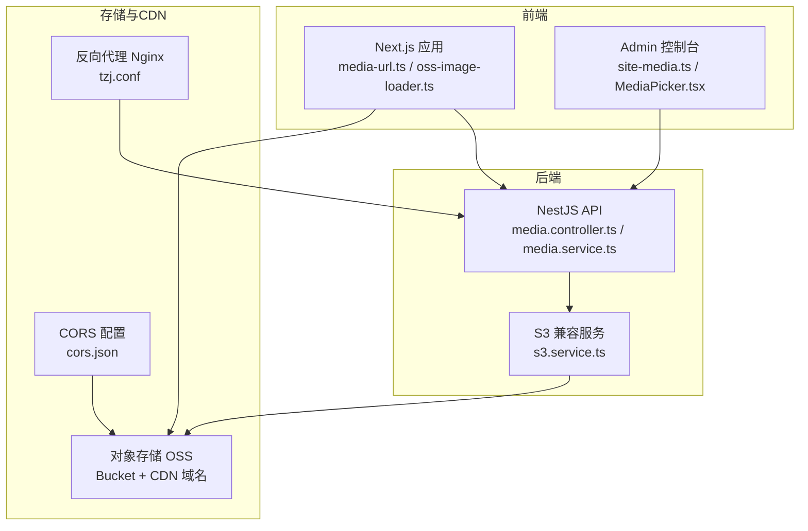
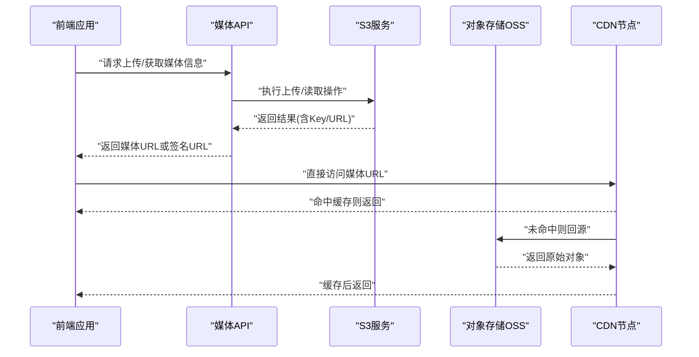
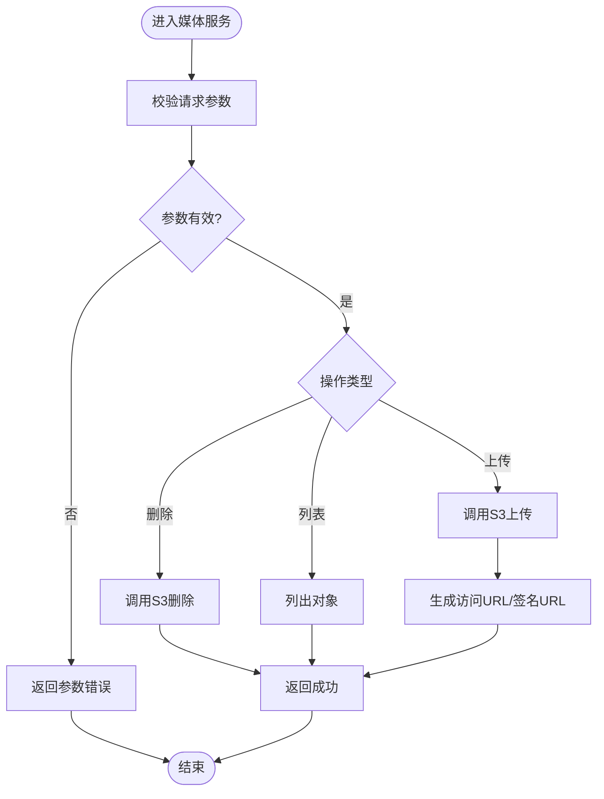
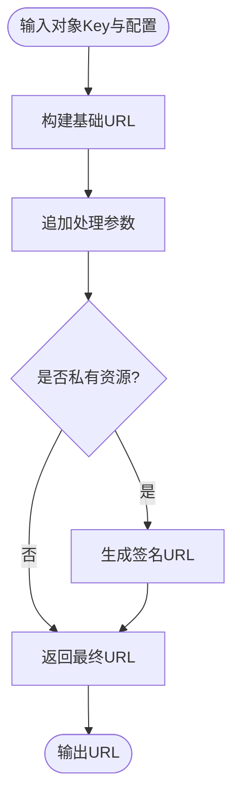
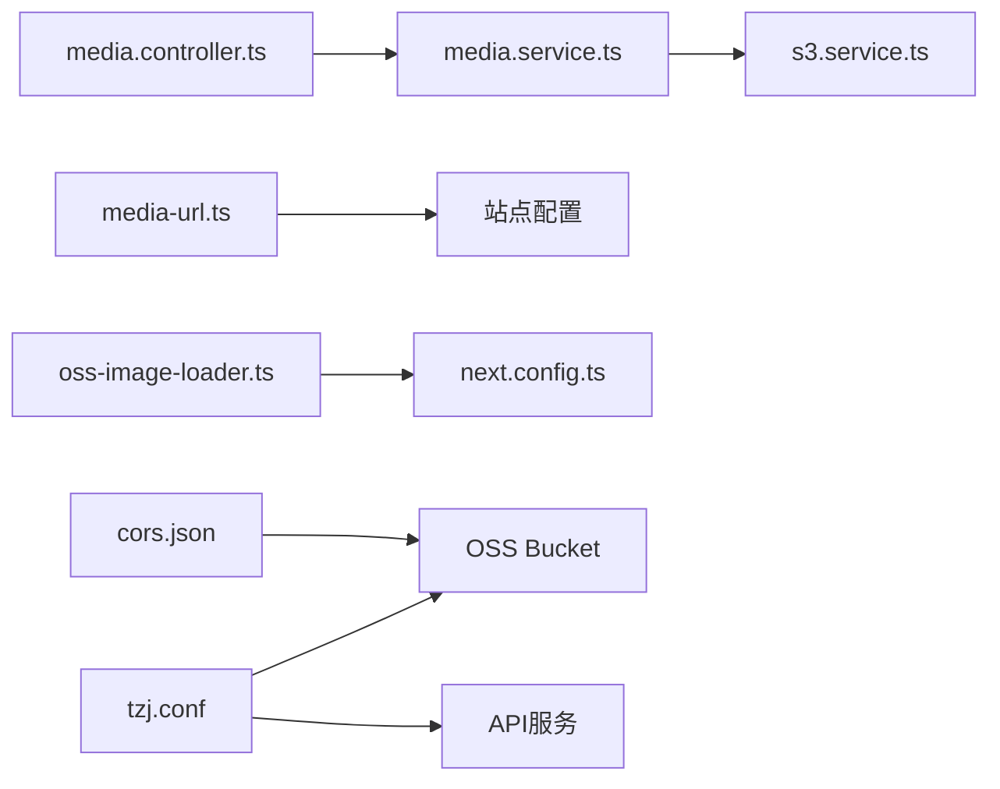

# 媒体CDN集成

<cite>
**本文档引用的文件**   
- [apps/api/src/media/media.service.ts](file://apps/api/src/media/media.service.ts)
- [apps/api/src/media/media.controller.ts](file://apps/api/src/media/media.controller.ts)
- [apps/api/src/storage/s3.service.ts](file://apps/api/src/storage/s3.service.ts)
- [apps/api/src/settings/settings-media.schema.ts](file://apps/api/src/settings/settings-media.schema.ts)
- [apps/api/src/settings/settings-media.defaults.ts](file://apps/api/src/settings/settings-media.defaults.ts)
- [apps/web/src/lib/media-url.ts](file://apps/web/src/lib/media-url.ts)
- [apps/web/src/lib/media-origin.ts](file://apps/web/src/lib/media-origin.ts)
- [apps/web/src/lib/oss-image-loader.ts](file://apps/web/src/lib/oss-image-loader.ts)
- [apps/admin/src/features/site-media.ts](file://apps/admin/src/features/site-media.ts)
- [apps/admin/src/components/crud/MediaPicker.tsx](file://apps/admin/src/components/crud/MediaPicker.tsx)
- [infra/docker/oss/cors.json](file://infra/docker/oss/cors.json)
- [infra/docker/nginx/tzj.conf](file://infra/docker/nginx/tzj.conf)
- [apps/web/next.config.ts](file://apps/web/next.config.ts)
</cite>

## 目录
1. [简介](#简介)
2. [项目结构](#项目结构)
3. [核心组件](#核心组件)
4. [架构总览](#架构总览)
5. [详细组件分析](#详细组件分析)
6. [依赖关系分析](#依赖关系分析)
7. [性能考虑](#性能考虑)
8. [故障排查指南](#故障排查指南)
9. [结论](#结论)
10. [附录](#附录)

## 简介
本文件面向“媒体CDN集成”的落地与运维，聚焦于OSS存储服务的配置与访问控制、媒体URL生成规则与路径映射、域名与CDN配置、缓存策略与回源机制、以及安全访问（防盗链）与带宽优化方案。文档基于仓库中API层媒体服务、Web端媒体URL处理、Next.js图片加载器、以及基础设施中的OSS CORS与Nginx配置进行系统化说明，帮助读者快速理解并正确部署媒体CDN链路。

## 项目结构
本项目采用前后端分离与多应用组织方式：
- API 服务（NestJS）提供媒体上传、鉴权、签名与代理能力，并通过S3兼容接口对接对象存储（如阿里云OSS）。
- Web 前端（Next.js）负责媒体URL拼装、CDN域名解析与图片加载器配置，确保静态资源通过CDN高效分发。
- Admin 管理端提供站点媒体配置界面，便于运营人员调整媒体域名、路径前缀等。
- 基础设施（Docker/Nginx/OSS）提供本地或生产环境的CORS、反向代理与跨域访问支持。

图表来源
- [apps/web/src/lib/media-url.ts](file://apps/web/src/lib/media-url.ts)
- [apps/web/src/lib/oss-image-loader.ts](file://apps/web/src/lib/oss-image-loader.ts)
- [apps/api/src/media/media.controller.ts](file://apps/api/src/media/media.controller.ts)
- [apps/api/src/media/media.service.ts](file://apps/api/src/media/media.service.ts)
- [apps/api/src/storage/s3.service.ts](file://apps/api/src/storage/s3.service.ts)
- [infra/docker/oss/cors.json](file://infra/docker/oss/cors.json)
- [infra/docker/nginx/tzj.conf](file://infra/docker/nginx/tzj.conf)

章节来源
- [apps/api/src/media/media.controller.ts](file://apps/api/src/media/media.controller.ts)
- [apps/api/src/media/media.service.ts](file://apps/api/src/media/media.service.ts)
- [apps/api/src/storage/s3.service.ts](file://apps/api/src/storage/s3.service.ts)
- [apps/web/src/lib/media-url.ts](file://apps/web/src/lib/media-url.ts)
- [apps/web/src/lib/oss-image-loader.ts](file://apps/web/src/lib/oss-image-loader.ts)
- [infra/docker/oss/cors.json](file://infra/docker/oss/cors.json)
- [infra/docker/nginx/tzj.conf](file://infra/docker/nginx/tzj.conf)

## 核心组件
- 媒体控制器与服务（API）
  - 媒体控制器暴露上传、列表、删除、预览等REST接口，统一入口处理请求校验与响应封装。
  - 媒体服务封装业务逻辑：生成媒体元数据、构造访问URL、调用S3服务执行上传/下载/删除等操作。
- S3 兼容存储服务
  - 抽象对象存储操作，屏蔽底层实现差异；支持AK/SK、Endpoint、Bucket、Region等配置项。
- 媒体URL生成（Web）
  - 根据站点配置动态拼接CDN域名、路径前缀、查询参数（如水印、压缩、裁剪），输出最终可访问URL。
- Next.js 图片加载器
  - 配置自定义loader以适配OSS/CDN的图片处理参数，提升渲染性能与缓存命中率。
- 站点媒体设置（Admin）
  - 提供可视化配置媒体域名、路径前缀、是否启用CDN、默认图片质量等选项。

章节来源
- [apps/api/src/media/media.controller.ts](file://apps/api/src/media/media.controller.ts)
- [apps/api/src/media/media.service.ts](file://apps/api/src/media/media.service.ts)
- [apps/api/src/storage/s3.service.ts](file://apps/api/src/storage/s3.service.ts)
- [apps/web/src/lib/media-url.ts](file://apps/web/src/lib/media-url.ts)
- [apps/web/src/lib/oss-image-loader.ts](file://apps/web/src/lib/oss-image-loader.ts)
- [apps/admin/src/features/site-media.ts](file://apps/admin/src/features/site-media.ts)

## 架构总览
媒体CDN整体链路如下：
- 前端通过媒体URL生成模块拼装CDN域名与路径，直接访问OSS/CDN资源。
- 受控资源（如私有Bucket）通过API获取临时签名URL，避免密钥泄露。
- Nginx作为反向代理，将部分媒体请求转发至API或直接回源到OSS。
- OSS开启CORS允许跨域访问，CDN缓存热点内容，降低回源压力。

图表来源
- [apps/api/src/media/media.controller.ts](file://apps/api/src/media/media.controller.ts)
- [apps/api/src/media/media.service.ts](file://apps/api/src/media/media.service.ts)
- [apps/api/src/storage/s3.service.ts](file://apps/api/src/storage/s3.service.ts)
- [apps/web/src/lib/media-url.ts](file://apps/web/src/lib/media-url.ts)
- [apps/web/src/lib/oss-image-loader.ts](file://apps/web/src/lib/oss-image-loader.ts)

## 详细组件分析

### 媒体服务（API）
- 职责
  - 接收媒体上传、删除、列表等请求，校验权限与参数。
  - 生成媒体访问URL（公开或签名），封装元数据返回给前端。
  - 调用S3服务完成实际的对象存储操作。
- 关键流程
  - 上传：校验文件类型/大小 -> 生成唯一Key -> 调用S3上传 -> 返回URL。
  - 访问控制：对私有资源生成带过期时间的签名URL，防止盗用。
  - 错误处理：捕获网络异常、权限不足、Bucket不存在等错误并返回标准错误码。

图表来源
- [apps/api/src/media/media.service.ts](file://apps/api/src/media/media.service.ts)
- [apps/api/src/storage/s3.service.ts](file://apps/api/src/storage/s3.service.ts)

章节来源
- [apps/api/src/media/media.service.ts](file://apps/api/src/media/media.service.ts)
- [apps/api/src/storage/s3.service.ts](file://apps/api/src/storage/s3.service.ts)

### S3 兼容存储服务
- 职责
  - 封装对象存储SDK，提供统一的上传、下载、删除、列举接口。
  - 支持多种配置（Endpoint、Bucket、AccessKey、SecretKey、Region）。
- 关键点
  - 连接失败重试与超时控制。
  - 错误分类（网络、权限、对象不存在）以便上层处理。
  - 可选的分片上传与大文件支持。

章节来源
- [apps/api/src/storage/s3.service.ts](file://apps/api/src/storage/s3.service.ts)

### 媒体URL生成（Web）
- 职责
  - 根据站点配置（CDN域名、路径前缀、图片处理参数）生成最终媒体URL。
  - 支持动态参数（如水印、压缩、裁剪、格式转换）。
- 规则
  - 基础URL = CDN域名 + 路径前缀 + 对象Key
  - 查询参数按顺序追加（如 ?x-oss-process=...）
  - 若为私有资源，优先使用API签名的临时URL

图表来源
- [apps/web/src/lib/media-url.ts](file://apps/web/src/lib/media-url.ts)

章节来源
- [apps/web/src/lib/media-url.ts](file://apps/web/src/lib/media-url.ts)

### Next.js 图片加载器
- 职责
  - 配置自定义loader以适配OSS/CDN的图片处理参数。
  - 在页面渲染时自动注入合适的图片尺寸与格式。
- 关键点
  - 与媒体URL生成模块协作，确保参数一致性。
  - 支持懒加载与占位图优化。

章节来源
- [apps/web/src/lib/oss-image-loader.ts](file://apps/web/src/lib/oss-image-loader.ts)
- [apps/web/next.config.ts](file://apps/web/next.config.ts)

### 站点媒体设置（Admin）
- 职责
  - 提供媒体域名、路径前缀、是否启用CDN、默认图片质量等配置界面。
  - 保存配置到后端，供API与Web端读取。
- 关键点
  - 配置变更即时生效（或通过缓存刷新）。
  - 支持多环境配置（开发/测试/生产）。

章节来源
- [apps/admin/src/features/site-media.ts](file://apps/admin/src/features/site-media.ts)
- [apps/api/src/settings/settings-media.schema.ts](file://apps/api/src/settings/settings-media.schema.ts)
- [apps/api/src/settings/settings-media.defaults.ts](file://apps/api/src/settings/settings-media.defaults.ts)

## 依赖关系分析
- API层依赖
  - media.controller.ts 依赖 media.service.ts 处理业务逻辑。
  - media.service.ts 依赖 s3.service.ts 执行对象存储操作。
- Web层依赖
  - media-url.ts 依赖站点配置（域名、前缀）生成URL。
  - oss-image-loader.ts 依赖 next.config.ts 中的图片加载器配置。
- 基础设施依赖
  - cors.json 定义OSS的CORS策略，允许跨域访问。
  - tzj.conf 定义Nginx反向代理规则，将媒体请求路由到API或直连OSS。

图表来源
- [apps/api/src/media/media.controller.ts](file://apps/api/src/media/media.controller.ts)
- [apps/api/src/media/media.service.ts](file://apps/api/src/media/media.service.ts)
- [apps/api/src/storage/s3.service.ts](file://apps/api/src/storage/s3.service.ts)
- [apps/web/src/lib/media-url.ts](file://apps/web/src/lib/media-url.ts)
- [apps/web/src/lib/oss-image-loader.ts](file://apps/web/src/lib/oss-image-loader.ts)
- [apps/web/next.config.ts](file://apps/web/next.config.ts)
- [infra/docker/oss/cors.json](file://infra/docker/oss/cors.json)
- [infra/docker/nginx/tzj.conf](file://infra/docker/nginx/tzj.conf)

章节来源
- [apps/api/src/media/media.controller.ts](file://apps/api/src/media/media.controller.ts)
- [apps/api/src/media/media.service.ts](file://apps/api/src/media/media.service.ts)
- [apps/api/src/storage/s3.service.ts](file://apps/api/src/storage/s3.service.ts)
- [apps/web/src/lib/media-url.ts](file://apps/web/src/lib/media-url.ts)
- [apps/web/src/lib/oss-image-loader.ts](file://apps/web/src/lib/oss-image-loader.ts)
- [apps/web/next.config.ts](file://apps/web/next.config.ts)
- [infra/docker/oss/cors.json](file://infra/docker/oss/cors.json)
- [infra/docker/nginx/tzj.conf](file://infra/docker/nginx/tzj.conf)

## 性能考虑
- CDN缓存策略
  - 对静态媒体资源设置较长的缓存时间（如7天以上），减少回源。
  - 针对频繁变动的资源使用短缓存或无缓存，确保内容及时更新。
- 图片优化
  - 使用CDN图片处理功能（如裁剪、压缩、格式转换）减少传输体积。
  - 启用HTTP/2与Gzip/Brotli压缩提升传输效率。
- 带宽优化
  - 合理设置CDN带宽峰值与告警阈值，避免突发流量导致限流。
  - 使用分片上传与断点续传提升大文件上传成功率。
- 回源优化
  - 配置多级缓存（边缘缓存+源站缓存）提高命中率。
  - 对热点内容进行预热，避免冷启动冲击源站。

## 故障排查指南
- 常见问题
  - CORS错误：检查OSS的CORS配置是否允许前端域名与方法。
  - 403禁止访问：确认签名URL是否过期或权限不足。
  - 404未找到：检查对象Key是否正确，路径前缀是否匹配。
  - 回源超时：检查OSS/CDN状态与网络连接。
- 排查步骤
  - 使用浏览器开发者工具查看请求头与响应码。
  - 检查API日志与S3服务日志定位错误原因。
  - 验证CDN缓存命中情况（通过响应头判断）。
- 解决方案
  - 修正CORS配置，确保允许的域名、方法、头部字段正确。
  - 重新生成签名URL并确保有效期足够。
  - 清理CDN缓存后重试，或预热热点内容。

章节来源
- [infra/docker/oss/cors.json](file://infra/docker/oss/cors.json)
- [apps/api/src/media/media.controller.ts](file://apps/api/src/media/media.controller.ts)
- [apps/api/src/media/media.service.ts](file://apps/api/src/media/media.service.ts)

## 结论
通过合理的OSS配置、严格的访问控制、高效的CDN缓存策略与安全机制，本项目的媒体CDN集成实现了高性能、高可用的媒体资源分发。前端与后端的紧密协作确保了URL生成的灵活性与安全性，基础设施层的CORS与反向代理配置保障了跨域访问与流量调度。建议在生产环境中持续监控CDN命中率与带宽使用情况，定期优化缓存策略与图片处理参数，以获得最佳的用户体验与成本效益。

## 附录
- 配置清单
  - OSS Bucket名称、地域、Endpoint
  - AccessKey与SecretKey（建议使用最小权限原则）
  - CDN域名与回源配置
  - CORS策略（允许的域名、方法、头部）
  - Next.js图片加载器配置（自定义loader）
- 最佳实践
  - 使用子域名隔离不同环境的媒体资源（如cdn.dev、cdn.prod）
  - 启用HTTPS与HSTS确保传输安全
  - 定期轮换密钥并审计访问日志
  - 对敏感内容进行加密存储与访问控制