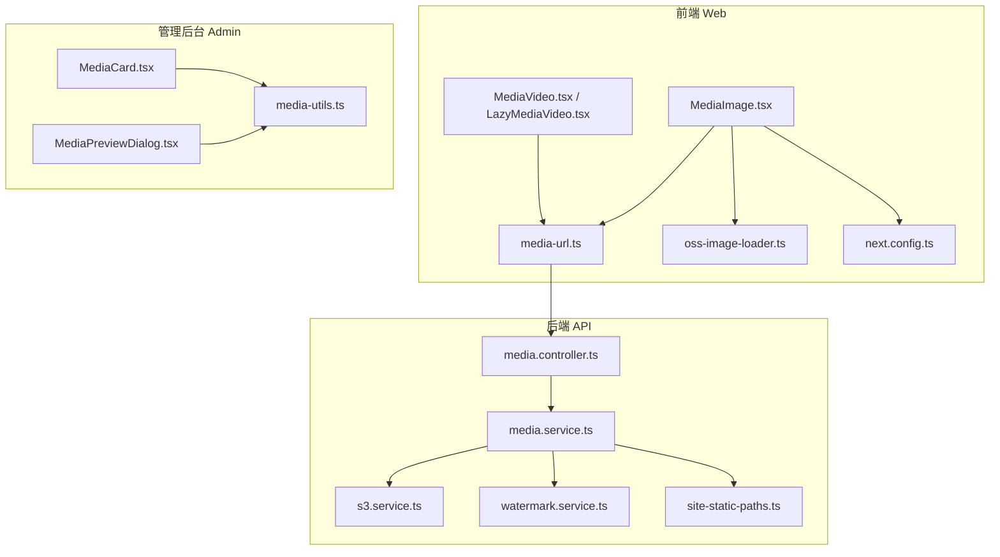
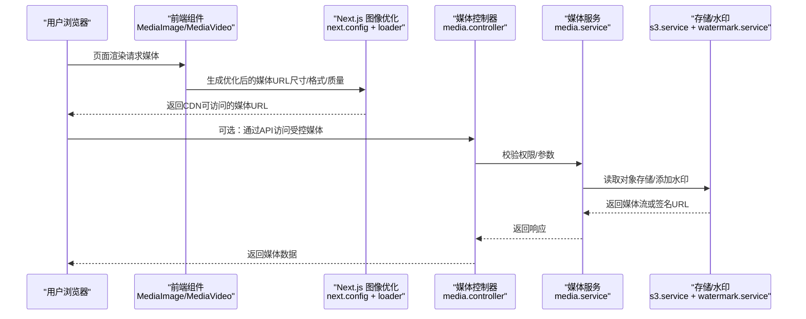
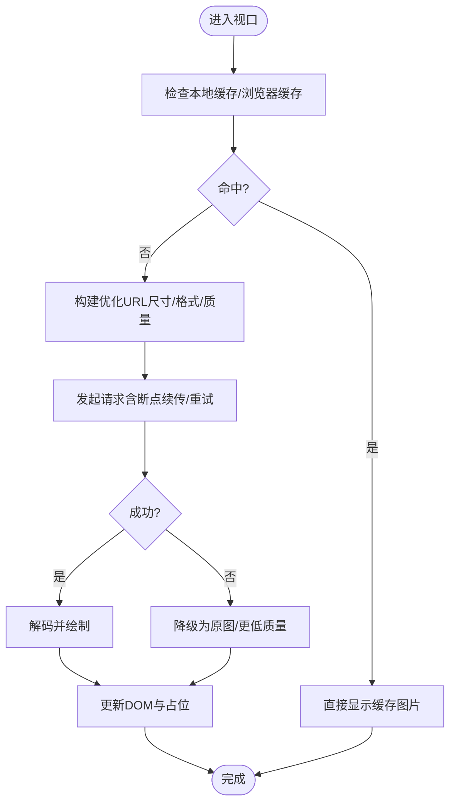
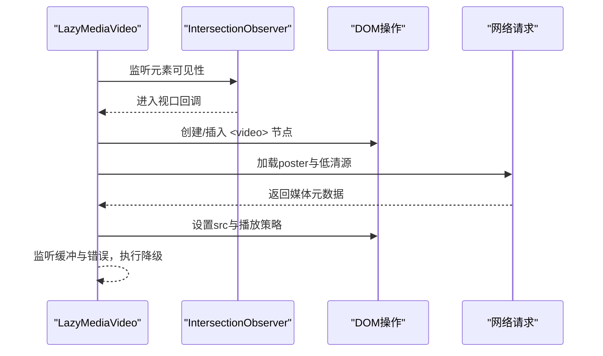
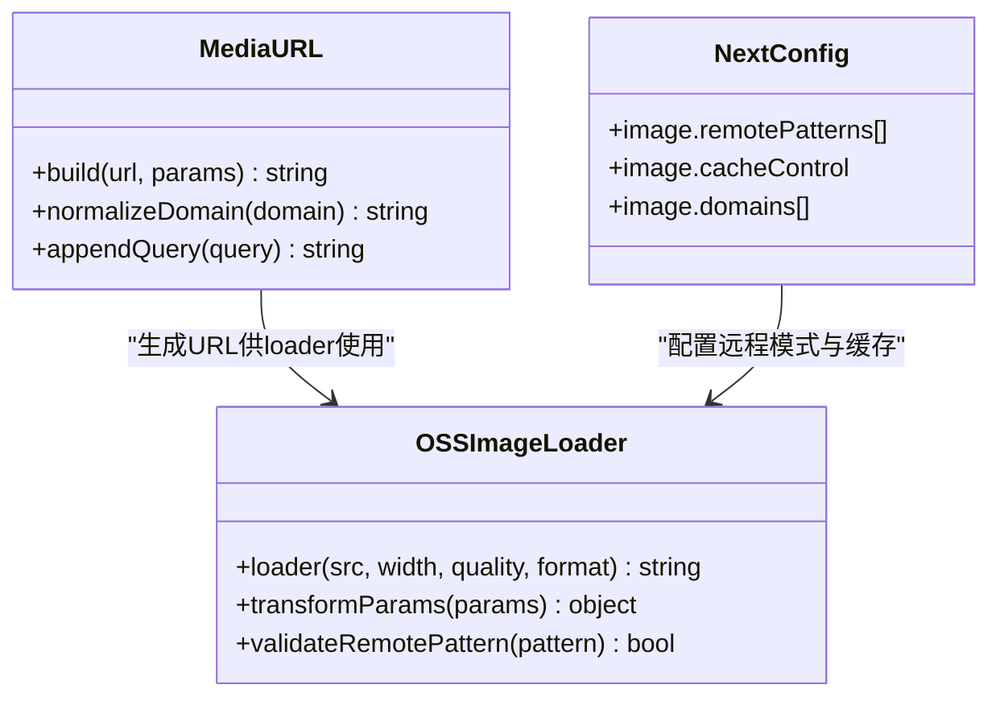
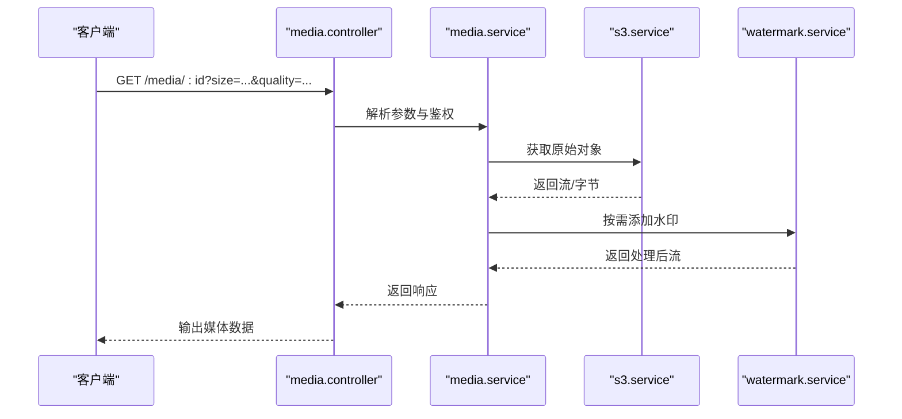

# 媒体性能优化

<cite>
**本文引用的文件**   
- [MediaImage.tsx](file://apps/web/src/components/MediaImage.tsx)
- [MediaVideo.tsx](file://apps/web/src/components/MediaVideo.tsx)
- [LazyMediaVideo.tsx](file://apps/web/src/components/LazyMediaVideo.tsx)
- [oss-image-loader.ts](file://apps/web/src/lib/oss-image-loader.ts)
- [media-url.ts](file://apps/web/src/lib/media-url.ts)
- [next.config.ts](file://apps/web/next.config.ts)
- [lighthouserc.json](file://apps/web/lighthouserc.json)
- [MediaCard.tsx](file://apps/admin/src/components/media/MediaCard.tsx)
- [MediaPreviewDialog.tsx](file://apps/admin/src/components/media/MediaPreviewDialog.tsx)
- [media-utils.ts](file://apps/admin/src/components/media/media-utils.ts)
- [media.controller.ts](file://apps/api/src/media/media.controller.ts)
- [media.service.ts](file://apps/api/src/media/media.service.ts)
- [s3.service.ts](file://apps/api/src/storage/s3.service.ts)
- [watermark.service.ts](file://apps/api/src/media/watermark.service.ts)
- [site-static-paths.ts](file://apps/api/src/media/site-static-paths.ts)
</cite>

## 目录
1. [简介](#简介)
2. [项目结构](#项目结构)
3. [核心组件](#核心组件)
4. [架构总览](#架构总览)
5. [详细组件分析](#详细组件分析)
6. [依赖关系分析](#依赖关系分析)
7. [性能考量](#性能考量)
8. [故障排查指南](#故障排查指南)
9. [结论](#结论)
10. [附录](#附录)

## 简介
本文件面向媒体资源（图片、视频）在前端渲染与后端处理的全链路性能优化，覆盖以下主题：
- 图片懒加载与预加载策略
- 资源优先级管理与关键渲染路径优化
- 首屏加载优化与用户体验指标
- 内存管理、垃圾回收与性能监控
- 性能测试工具、监控告警与故障排查方案

目标读者包括前端工程师、全栈工程师与运维人员。文档既提供高层设计思路，也给出代码级实现要点与可视化图示，帮助快速定位瓶颈并落地优化。

## 项目结构
本项目采用多应用仓库结构，媒体相关能力分布在三个层次：
- 前端展示层（Next.js 应用）：负责图片/视频的懒加载、占位、尺寸控制、CDN 加载器与 Next.js 图像优化集成
- 管理后台（Admin 应用）：提供媒体选择、预览与上传流程的交互与体验优化
- 后端服务（API/NestJS）：提供媒体访问接口、存储抽象（S3/OSS）、水印与静态路径配置

图表来源
- [MediaImage.tsx](file://apps/web/src/components/MediaImage.tsx)
- [MediaVideo.tsx](file://apps/web/src/components/MediaVideo.tsx)
- [LazyMediaVideo.tsx](file://apps/web/src/components/LazyMediaVideo.tsx)
- [media-url.ts](file://apps/web/src/lib/media-url.ts)
- [oss-image-loader.ts](file://apps/web/src/lib/oss-image-loader.ts)
- [next.config.ts](file://apps/web/next.config.ts)
- [MediaCard.tsx](file://apps/admin/src/components/media/MediaCard.tsx)
- [MediaPreviewDialog.tsx](file://apps/admin/src/components/media/MediaPreviewDialog.tsx)
- [media-utils.ts](file://apps/admin/src/components/media/media-utils.ts)
- [media.controller.ts](file://apps/api/src/media/media.controller.ts)
- [media.service.ts](file://apps/api/src/media/media.service.ts)
- [s3.service.ts](file://apps/api/src/storage/s3.service.ts)
- [watermark.service.ts](file://apps/api/src/media/watermark.service.ts)
- [site-static-paths.ts](file://apps/api/src/media/site-static-paths.ts)

章节来源
- [MediaImage.tsx](file://apps/web/src/components/MediaImage.tsx)
- [MediaVideo.tsx](file://apps/web/src/components/MediaVideo.tsx)
- [LazyMediaVideo.tsx](file://apps/web/src/components/LazyMediaVideo.tsx)
- [media-url.ts](file://apps/web/src/lib/media-url.ts)
- [oss-image-loader.ts](file://apps/web/src/lib/oss-image-loader.ts)
- [next.config.ts](file://apps/web/next.config.ts)
- [MediaCard.tsx](file://apps/admin/src/components/media/MediaCard.tsx)
- [MediaPreviewDialog.tsx](file://apps/admin/src/components/media/MediaPreviewDialog.tsx)
- [media-utils.ts](file://apps/admin/src/components/media/media-utils.ts)
- [media.controller.ts](file://apps/api/src/media/media.controller.ts)
- [media.service.ts](file://apps/api/src/media/media.service.ts)
- [s3.service.ts](file://apps/api/src/storage/s3.service.ts)
- [watermark.service.ts](file://apps/api/src/media/watermark.service.ts)
- [site-static-paths.ts](file://apps/api/src/media/site-static-paths.ts)

## 核心组件
- MediaImage：封装图片懒加载、占位图、尺寸约束、格式降级与 Next.js 图像优化；通过自定义 loader 对接 OSS/CDN 动态裁剪与压缩
- MediaVideo/LazyMediaVideo：视频懒加载与按需播放，避免首屏阻塞；支持 poster 占位与低带宽降级
- media-url：统一构建媒体 URL，支持域名、路径、查询参数与 CDN 参数拼接
- oss-image-loader：Next.js 图像 loader，将请求转译为 OSS 处理链（缩放、裁剪、质量、WebP/AVIF）
- next.config：注册 image.loader、remotePatterns、缓存与传输策略
- Admin 媒体组件：MediaCard、MediaPreviewDialog、media-utils 提供列表与预览的性能优化（缩略图、延迟加载、防抖）
- API 媒体层：controller/service 暴露媒体访问接口，结合 S3/OSS 存储与水印服务，配合静态路径配置提升直连效率

章节来源
- [MediaImage.tsx](file://apps/web/src/components/MediaImage.tsx)
- [MediaVideo.tsx](file://apps/web/src/components/MediaVideo.tsx)
- [LazyMediaVideo.tsx](file://apps/web/src/components/LazyMediaVideo.tsx)
- [media-url.ts](file://apps/web/src/lib/media-url.ts)
- [oss-image-loader.ts](file://apps/web/src/lib/oss-image-loader.ts)
- [next.config.ts](file://apps/web/next.config.ts)
- [MediaCard.tsx](file://apps/admin/src/components/media/MediaCard.tsx)
- [MediaPreviewDialog.tsx](file://apps/admin/src/components/media/MediaPreviewDialog.tsx)
- [media-utils.ts](file://apps/admin/src/components/media/media-utils.ts)
- [media.controller.ts](file://apps/api/src/media/media.controller.ts)
- [media.service.ts](file://apps/api/src/media/media.service.ts)
- [s3.service.ts](file://apps/api/src/storage/s3.service.ts)
- [watermark.service.ts](file://apps/api/src/media/watermark.service.ts)
- [site-static-paths.ts](file://apps/api/src/media/site-static-paths.ts)

## 架构总览
媒体资源从前端到后端的完整链路如下：
- 前端根据设备与网络状况选择合适的图片/视频尺寸与格式
- 通过 Next.js 图像优化与自定义 loader 生成带参数的 CDN 链接
- 后端提供统一的媒体访问接口，必要时进行鉴权、水印、转码或代理
- 存储层使用对象存储（S3/OSS），并通过 CDN 加速分发

图表来源
- [MediaImage.tsx](file://apps/web/src/components/MediaImage.tsx)
- [MediaVideo.tsx](file://apps/web/src/components/MediaVideo.tsx)
- [next.config.ts](file://apps/web/next.config.ts)
- [media.controller.ts](file://apps/api/src/media/media.controller.ts)
- [media.service.ts](file://apps/api/src/media/media.service.ts)
- [s3.service.ts](file://apps/api/src/storage/s3.service.ts)
- [watermark.service.ts](file://apps/api/src/media/watermark.service.ts)

## 详细组件分析

### 图片组件与懒加载策略（MediaImage）
- 懒加载：基于 IntersectionObserver 实现视口内才加载，减少首屏请求
- 占位图与骨架屏：在真实图片加载前显示占位，降低布局抖动（CLS）
- 尺寸与容器：固定宽高比与容器尺寸，避免重排；使用 srcset/picture 适配不同屏幕密度
- 格式降级：优先 WebP/AVIF，回退 JPEG/PNG；通过 loader 与浏览器能力检测决定
- 缓存与预取：对即将进入视口的图片进行预取，提升滚动流畅度

图表来源
- [MediaImage.tsx](file://apps/web/src/components/MediaImage.tsx)
- [oss-image-loader.ts](file://apps/web/src/lib/oss-image-loader.ts)
- [media-url.ts](file://apps/web/src/lib/media-url.ts)

章节来源
- [MediaImage.tsx](file://apps/web/src/components/MediaImage.tsx)
- [oss-image-loader.ts](file://apps/web/src/lib/oss-image-loader.ts)
- [media-url.ts](file://apps/web/src/lib/media-url.ts)

### 视频组件与懒加载策略（MediaVideo / LazyMediaVideo）
- 懒加载：仅在进入视口时创建 <video> 元素并触发加载，避免首屏阻塞
- 占位海报：使用 poster 与低分辨率缩略图，提升感知速度
- 自适应码率：根据网络状态切换清晰度，降低卡顿
- 自动播放限制：遵循浏览器策略，静音自动播放或等待用户交互

图表来源
- [MediaVideo.tsx](file://apps/web/src/components/MediaVideo.tsx)
- [LazyMediaVideo.tsx](file://apps/web/src/components/LazyMediaVideo.tsx)

章节来源
- [MediaVideo.tsx](file://apps/web/src/components/MediaVideo.tsx)
- [LazyMediaVideo.tsx](file://apps/web/src/components/LazyMediaVideo.tsx)

### 媒体 URL 构建与 Next.js 图像优化（media-url + oss-image-loader + next.config）
- media-url：统一拼接域名、路径与查询参数，确保跨环境一致性
- oss-image-loader：将 Next.js 图像请求转换为 OSS 处理链（缩放、裁剪、质量、格式转换）
- next.config：配置 image.remotePatterns、缓存头、传输策略与安全白名单

图表来源
- [media-url.ts](file://apps/web/src/lib/media-url.ts)
- [oss-image-loader.ts](file://apps/web/src/lib/oss-image-loader.ts)
- [next.config.ts](file://apps/web/next.config.ts)

章节来源
- [media-url.ts](file://apps/web/src/lib/media-url.ts)
- [oss-image-loader.ts](file://apps/web/src/lib/oss-image-loader.ts)
- [next.config.ts](file://apps/web/next.config.ts)

### 管理后台媒体组件（MediaCard / MediaPreviewDialog / media-utils）
- MediaCard：列表项使用缩略图与懒加载，减少初始渲染压力
- MediaPreviewDialog：弹窗内按需加载高清资源，关闭时释放引用
- media-utils：提供去抖、节流、尺寸计算与缓存策略，提升交互性能

章节来源
- [MediaCard.tsx](file://apps/admin/src/components/media/MediaCard.tsx)
- [MediaPreviewDialog.tsx](file://apps/admin/src/components/media/MediaPreviewDialog.tsx)
- [media-utils.ts](file://apps/admin/src/components/media/media-utils.ts)

### 后端媒体服务（media.controller / media.service / s3.service / watermark.service / site-static-paths）
- controller：接收媒体访问请求，校验参数与权限
- service：组合存储与水印逻辑，返回流或签名URL
- s3.service：对象存储访问封装，支持分块下载与并发
- watermark.service：动态添加水印，支持位置、透明度与尺寸
- site-static-paths：静态路径映射，提升直连效率与缓存命中率

图表来源
- [media.controller.ts](file://apps/api/src/media/media.controller.ts)
- [media.service.ts](file://apps/api/src/media/media.service.ts)
- [s3.service.ts](file://apps/api/src/storage/s3.service.ts)
- [watermark.service.ts](file://apps/api/src/media/watermark.service.ts)

章节来源
- [media.controller.ts](file://apps/api/src/media/media.controller.ts)
- [media.service.ts](file://apps/api/src/media/media.service.ts)
- [s3.service.ts](file://apps/api/src/storage/s3.service.ts)
- [watermark.service.ts](file://apps/api/src/media/watermark.service.ts)
- [site-static-paths.ts](file://apps/api/src/media/site-static-paths.ts)

## 依赖关系分析
- 前端依赖 Next.js 图像优化与自定义 loader，统一由 next.config 管理远程模式与缓存
- 媒体 URL 构建与 loader 解耦，便于替换后端存储（S3/OSS）与 CDN
- 管理后台组件依赖 utils 工具函数，保证一致的交互与性能策略
- 后端服务通过 controller/service 分层，存储与水印作为可插拔模块

图表来源
- [MediaImage.tsx](file://apps/web/src/components/MediaImage.tsx)
- [media-url.ts](file://apps/web/src/lib/media-url.ts)
- [oss-image-loader.ts](file://apps/web/src/lib/oss-image-loader.ts)
- [next.config.ts](file://apps/web/next.config.ts)
- [MediaVideo.tsx](file://apps/web/src/components/MediaVideo.tsx)
- [LazyMediaVideo.tsx](file://apps/web/src/components/LazyMediaVideo.tsx)
- [MediaCard.tsx](file://apps/admin/src/components/media/MediaCard.tsx)
- [MediaPreviewDialog.tsx](file://apps/admin/src/components/media/MediaPreviewDialog.tsx)
- [media-utils.ts](file://apps/admin/src/components/media/media-utils.ts)
- [media.controller.ts](file://apps/api/src/media/media.controller.ts)
- [media.service.ts](file://apps/api/src/media/media.service.ts)
- [s3.service.ts](file://apps/api/src/storage/s3.service.ts)
- [watermark.service.ts](file://apps/api/src/media/watermark.service.ts)
- [site-static-paths.ts](file://apps/api/src/media/site-static-paths.ts)

章节来源
- [MediaImage.tsx](file://apps/web/src/components/MediaImage.tsx)
- [media-url.ts](file://apps/web/src/lib/media-url.ts)
- [oss-image-loader.ts](file://apps/web/src/lib/oss-image-loader.ts)
- [next.config.ts](file://apps/web/next.config.ts)
- [MediaVideo.tsx](file://apps/web/src/components/MediaVideo.tsx)
- [LazyMediaVideo.tsx](file://apps/web/src/components/LazyMediaVideo.tsx)
- [MediaCard.tsx](file://apps/admin/src/components/media/MediaCard.tsx)
- [MediaPreviewDialog.tsx](file://apps/admin/src/components/media/MediaPreviewDialog.tsx)
- [media-utils.ts](file://apps/admin/src/components/media/media-utils.ts)
- [media.controller.ts](file://apps/api/src/media/media.controller.ts)
- [media.service.ts](file://apps/api/src/media/media.service.ts)
- [s3.service.ts](file://apps/api/src/storage/s3.service.ts)
- [watermark.service.ts](file://apps/api/src/media/watermark.service.ts)
- [site-static-paths.ts](file://apps/api/src/media/site-static-paths.ts)

## 性能考量
- 首屏加载优化
  - 图片懒加载与占位图，避免阻塞渲染
  - 视频延迟加载与 poster 占位，降低首屏体积
  - 使用 Next.js 图像优化与 CDN 缓存，减少重复请求
- 关键渲染路径
  - 优先加载首屏可见媒体，非关键媒体延后加载
  - 合理设置 loading="lazy" 与 fetchpriority，控制资源优先级
  - 使用 srcset/picture 与 AVIF/WebP，减小体积
- 内存管理与垃圾回收
  - 及时移除未使用的媒体引用，避免内存泄漏
  - 大视频/图片在离开视口时销毁实例，释放解码缓存
  - 避免频繁创建/销毁媒体对象，使用复用池或单例
- 性能监控与指标
  - LCP（最大内容绘制）、CLS（累积布局偏移）、FID/INP（交互延迟）
  - 媒体加载耗时、解码失败率、缓存命中率
  - 使用 Lighthouse CI 与浏览器 Performance API 持续监控

[本节为通用指导，不直接分析具体文件]

## 故障排查指南
- 常见问题
  - 图片无法加载：检查 remotePatterns、域名白名单与 CORS 配置
  - 视频无法自动播放：检查浏览器策略与静音设置
  - 内存增长：排查未释放的媒体对象与事件监听器
  - 水印异常：确认水印服务可用性与参数合法性
- 诊断步骤
  - 使用浏览器开发者工具的网络面板查看请求与缓存命中
  - 使用 Performance 面板分析主线程阻塞与解码耗时
  - 检查 Lighthouse 报告中的媒体相关建议
  - 在后端日志中追踪媒体访问与存储调用链路
- 告警与监控
  - 设置媒体加载失败率阈值告警
  - 监控 CDN 带宽与命中率，识别热点资源
  - 建立性能基线，对比版本变更影响

章节来源
- [next.config.ts](file://apps/web/next.config.ts)
- [oss-image-loader.ts](file://apps/web/src/lib/oss-image-loader.ts)
- [media.controller.ts](file://apps/api/src/media/media.controller.ts)
- [media.service.ts](file://apps/api/src/media/media.service.ts)
- [s3.service.ts](file://apps/api/src/storage/s3.service.ts)
- [watermark.service.ts](file://apps/api/src/media/watermark.service.ts)

## 结论
通过前端懒加载与占位、Next.js 图像优化与自定义 loader、后端存储与水印服务的协同，可实现媒体资源的高效加载与稳定交付。结合性能监控与自动化测试，持续优化首屏体验与整体性能，保障用户在弱网与低端设备上的良好体验。

[本节为总结，不直接分析具体文件]

## 附录
- 性能测试工具
  - Lighthouse CI：自动化性能审计与回归
  - Chrome DevTools：网络与性能面板
  - WebPageTest：端到端性能测试
- 监控与告警
  - 前端埋点：LCP/CLS/FID/INP 上报
  - 后端日志：媒体访问成功率与耗时
  - CDN 监控：带宽、命中率与错误率
- 最佳实践清单
  - 所有图片使用合适的尺寸与格式
  - 视频使用懒加载与 poster
  - 启用 CDN 缓存与 HTTP/2
  - 定期清理未使用媒体与缓存

[本节为补充信息，不直接分析具体文件]