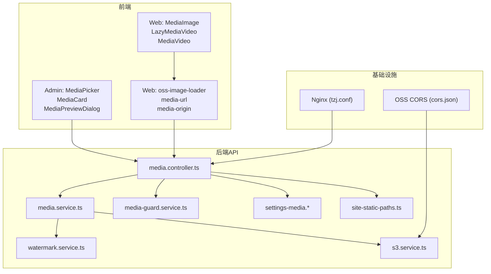
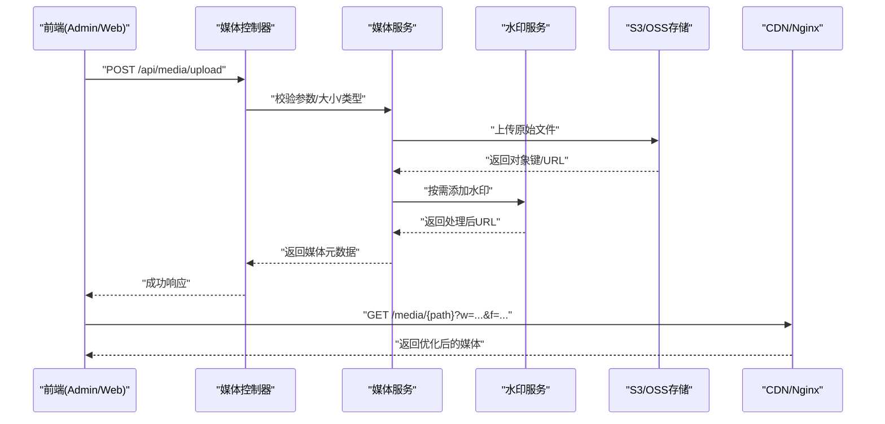
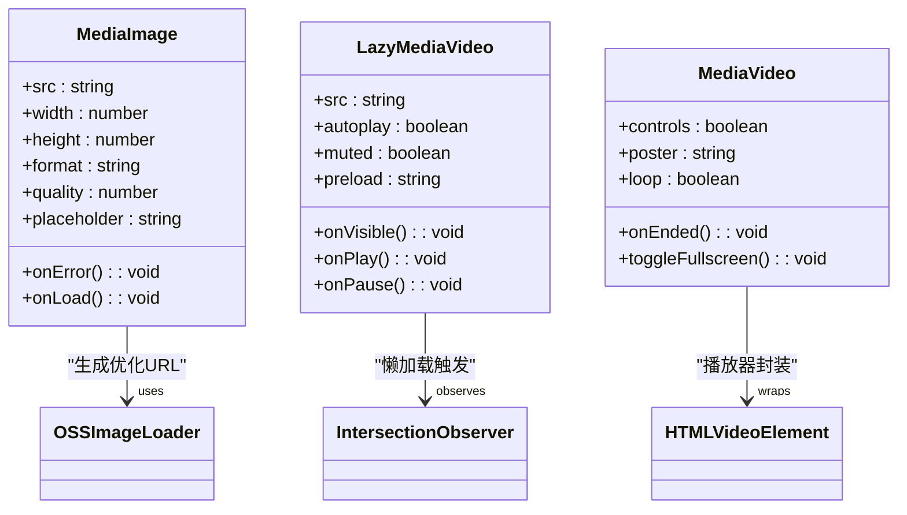
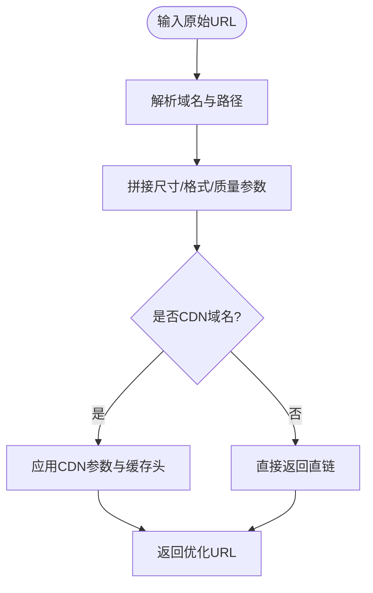
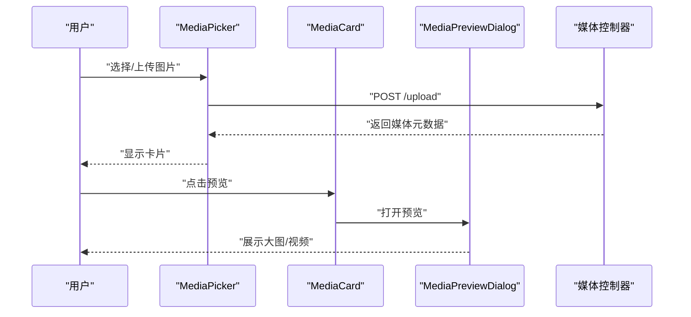
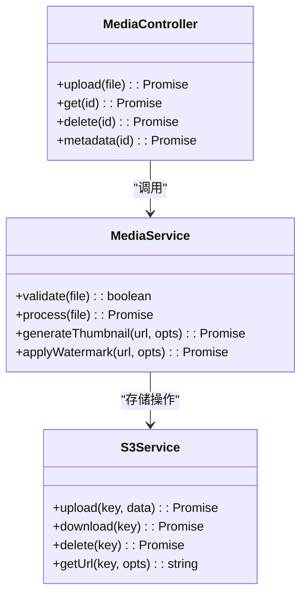
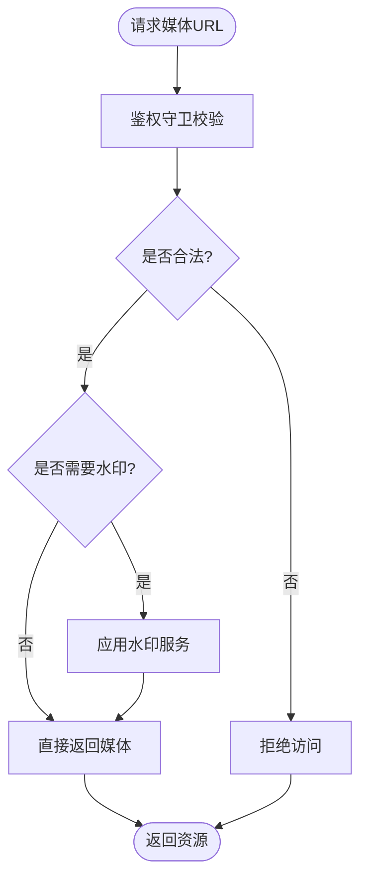
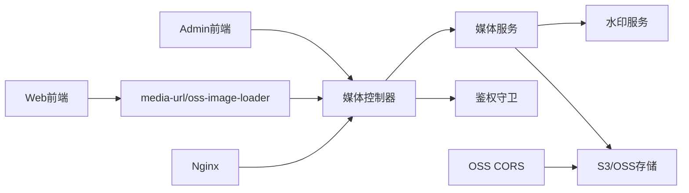

# 媒体资源管理

<cite>
**本文引用的文件**   
- [apps/admin/src/features/media.ts](file://apps/admin/src/features/media.ts)
- [apps/admin/src/components/crud/MediaPicker.tsx](file://apps/admin/src/components/crud/MediaPicker.tsx)
- [apps/admin/src/components/media/MediaCard.tsx](file://apps/admin/src/components/media/MediaCard.tsx)
- [apps/admin/src/components/media/MediaPreviewDialog.tsx](file://apps/admin/src/components/media/MediaPreviewDialog.tsx)
- [apps/admin/src/lib/media-url.ts](file://apps/admin/src/lib/media-url.ts)
- [apps/web/src/components/MediaImage.tsx](file://apps/web/src/components/MediaImage.tsx)
- [apps/web/src/components/LazyMediaVideo.tsx](file://apps/web/src/components/LazyMediaVideo.tsx)
- [apps/web/src/components/MediaVideo.tsx](file://apps/web/src/components/MediaVideo.tsx)
- [apps/web/src/lib/oss-image-loader.ts](file://apps/web/src/lib/oss-image-loader.ts)
- [apps/web/src/lib/media-url.ts](file://apps/web/src/lib/media-url.ts)
- [apps/web/src/lib/media-origin.ts](file://apps/web/src/lib/media-origin.ts)
- [apps/api/src/media/media.controller.ts](file://apps/api/src/media/media.controller.ts)
- [apps/api/src/media/media.service.ts](file://apps/api/src/media/media.service.ts)
- [apps/api/src/media/watermark.service.ts](file://apps/api/src/media/watermark.service.ts)
- [apps/api/src/storage/s3.service.ts](file://apps/api/src/storage/s3.service.ts)
- [apps/api/src/settings/settings-media.schema.ts](file://apps/api/src/settings/settings-media.schema.ts)
- [apps/api/src/settings/settings-media.defaults.ts](file://apps/api/src/settings/settings-media.defaults.ts)
- [apps/api/src/media/media-guard.service.ts](file://apps/api/src/media/media-guard.service.ts)
- [apps/api/src/media/site-static-paths.ts](file://apps/api/src/media/site-static-paths.ts)
- [infra/docker/nginx/tzj.conf](file://infra/docker/nginx/tzj.conf)
- [infra/docker/oss/cors.json](file://infra/docker/oss/cors.json)
</cite>

## 目录
1. [引言](#引言)
2. [项目结构](#项目结构)
3. [核心组件](#核心组件)
4. [架构总览](#架构总览)
5. [详细组件分析](#详细组件分析)
6. [依赖关系分析](#依赖关系分析)
7. [性能考量](#性能考量)
8. [故障排查指南](#故障排查指南)
9. [结论](#结论)
10. [附录](#附录)

## 引言
本文件面向“媒体资源管理”模块，覆盖图片优化、懒加载、视频播放与媒体CDN配置；解释OSS集成、图片格式转换、尺寸适配与缓存策略；并给出媒体上传、预览、水印处理与版权保护的实现要点。同时提供媒体资源性能优化、SEO优化与移动端适配的最佳实践，帮助前后端协同构建高性能、可维护的媒体系统。

## 项目结构
媒体相关代码横跨前端（Admin控制台、Web站点）、后端API与基础设施（Nginx、OSS CORS）：
- Admin控制台：媒体选择器、卡片展示、预览对话框、URL工具
- Web站点：图片组件（含OSS Loader）、懒加载视频组件、媒体URL与来源解析
- API服务：媒体控制器与服务、水印服务、S3/OSS存储抽象、媒体鉴权守卫、静态路径白名单、媒体设置Schema与默认值
- 基础设施：Nginx反向代理与缓存、OSS跨域配置

图表来源
- [apps/admin/src/components/crud/MediaPicker.tsx](file://apps/admin/src/components/crud/MediaPicker.tsx)
- [apps/admin/src/components/media/MediaCard.tsx](file://apps/admin/src/components/media/MediaCard.tsx)
- [apps/admin/src/components/media/MediaPreviewDialog.tsx](file://apps/admin/src/components/media/MediaPreviewDialog.tsx)
- [apps/web/src/components/MediaImage.tsx](file://apps/web/src/components/MediaImage.tsx)
- [apps/web/src/components/LazyMediaVideo.tsx](file://apps/web/src/components/LazyMediaVideo.tsx)
- [apps/web/src/components/MediaVideo.tsx](file://apps/web/src/components/MediaVideo.tsx)
- [apps/web/src/lib/oss-image-loader.ts](file://apps/web/src/lib/oss-image-loader.ts)
- [apps/web/src/lib/media-url.ts](file://apps/web/src/lib/media-url.ts)
- [apps/web/src/lib/media-origin.ts](file://apps/web/src/lib/media-origin.ts)
- [apps/api/src/media/media.controller.ts](file://apps/api/src/media/media.controller.ts)
- [apps/api/src/media/media.service.ts](file://apps/api/src/media/media.service.ts)
- [apps/api/src/media/watermark.service.ts](file://apps/api/src/media/watermark.service.ts)
- [apps/api/src/storage/s3.service.ts](file://apps/api/src/storage/s3.service.ts)
- [apps/api/src/media/media-guard.service.ts](file://apps/api/src/media/media-guard.service.ts)
- [apps/api/src/settings/settings-media.schema.ts](file://apps/api/src/settings/settings-media.schema.ts)
- [apps/api/src/settings/settings-media.defaults.ts](file://apps/api/src/settings/settings-media.defaults.ts)
- [apps/api/src/media/site-static-paths.ts](file://apps/api/src/media/site-static-paths.ts)
- [infra/docker/nginx/tzj.conf](file://infra/docker/nginx/tzj.conf)
- [infra/docker/oss/cors.json](file://infra/docker/oss/cors.json)

章节来源
- [apps/admin/src/features/media.ts](file://apps/admin/src/features/media.ts)
- [apps/api/src/media/media.controller.ts](file://apps/api/src/media/media.controller.ts)
- [apps/api/src/media/media.service.ts](file://apps/api/src/media/media.service.ts)
- [apps/api/src/storage/s3.service.ts](file://apps/api/src/storage/s3.service.ts)
- [apps/api/src/media/watermark.service.ts](file://apps/api/src/media/watermark.service.ts)
- [apps/api/src/media/media-guard.service.ts](file://apps/api/src/media/media-guard.service.ts)
- [apps/api/src/settings/settings-media.schema.ts](file://apps/api/src/settings/settings-media.schema.ts)
- [apps/api/src/settings/settings-media.defaults.ts](file://apps/api/src/settings/settings-media.defaults.ts)
- [apps/api/src/media/site-static-paths.ts](file://apps/api/src/media/site-static-paths.ts)
- [apps/web/src/lib/oss-image-loader.ts](file://apps/web/src/lib/oss-image-loader.ts)
- [apps/web/src/lib/media-url.ts](file://apps/web/src/lib/media-url.ts)
- [apps/web/src/lib/media-origin.ts](file://apps/web/src/lib/media-origin.ts)
- [infra/docker/nginx/tzj.conf](file://infra/docker/nginx/tzj.conf)
- [infra/docker/oss/cors.json](file://infra/docker/oss/cors.json)

## 核心组件
- 媒体上传与选择（Admin）
  - 媒体选择器用于在内容编辑时挑选已上传的图片/视频，支持列表、分页与搜索过滤。
  - 媒体卡片展示缩略图、名称、类型与操作入口。
  - 预览对话框支持大图查看与基础信息展示。
- 媒体URL与来源（Web/Admin）
  - 统一构造媒体URL，拼接尺寸、格式、质量等参数，适配不同场景。
  - OSS图片Loader负责将原始URL转换为CDN优化后的地址。
  - 媒体来源解析用于区分本地、CDN或第三方域名。
- 媒体服务（API）
  - 控制器暴露上传、获取、删除、元数据查询等接口。
  - 服务层封装业务逻辑：校验、转码、生成缩略图、水印、权限校验。
  - 存储抽象通过S3兼容接口对接OSS或其他对象存储。
- 水印与版权保护
  - 水印服务支持文字/图片水印、位置、透明度、缩放等。
  - 鉴权守卫控制访问令牌、签名与防盗链。
- 媒体设置与静态路径
  - Schema定义媒体相关配置项（如最大大小、允许格式、压缩级别）。
  - 默认值提供开箱即用的安全基线。
  - 静态路径白名单用于快速放行公共媒体资源。

章节来源
- [apps/admin/src/components/crud/MediaPicker.tsx](file://apps/admin/src/components/crud/MediaPicker.tsx)
- [apps/admin/src/components/media/MediaCard.tsx](file://apps/admin/src/components/media/MediaCard.tsx)
- [apps/admin/src/components/media/MediaPreviewDialog.tsx](file://apps/admin/src/components/media/MediaPreviewDialog.tsx)
- [apps/admin/src/lib/media-url.ts](file://apps/admin/src/lib/media-url.ts)
- [apps/web/src/lib/media-url.ts](file://apps/web/src/lib/media-url.ts)
- [apps/web/src/lib/media-origin.ts](file://apps/web/src/lib/media-origin.ts)
- [apps/api/src/media/media.controller.ts](file://apps/api/src/media/media.controller.ts)
- [apps/api/src/media/media.service.ts](file://apps/api/src/media/media.service.ts)
- [apps/api/src/storage/s3.service.ts](file://apps/api/src/storage/s3.service.ts)
- [apps/api/src/media/watermark.service.ts](file://apps/api/src/media/watermark.service.ts)
- [apps/api/src/media/media-guard.service.ts](file://apps/api/src/media/media-guard.service.ts)
- [apps/api/src/settings/settings-media.schema.ts](file://apps/api/src/settings/settings-media.schema.ts)
- [apps/api/src/settings/settings-media.defaults.ts](file://apps/api/src/settings/settings-media.defaults.ts)
- [apps/api/src/media/site-static-paths.ts](file://apps/api/src/media/site-static-paths.ts)

## 架构总览
媒体资源从上传到分发的整体流程如下：
- 前端发起上传请求至API，后端校验并写入对象存储（OSS/S3），返回媒体元数据。
- 读取媒体时，前端通过统一的URL构造与OSS Loader生成优化后的CDN链接。
- Nginx作为边缘缓存与反代，结合CORS与鉴权策略保障安全与性能。
- 可选的水印与转码在服务层完成，确保输出符合业务需求。

图表来源
- [apps/api/src/media/media.controller.ts](file://apps/api/src/media/media.controller.ts)
- [apps/api/src/media/media.service.ts](file://apps/api/src/media/media.service.ts)
- [apps/api/src/media/watermark.service.ts](file://apps/api/src/media/watermark.service.ts)
- [apps/api/src/storage/s3.service.ts](file://apps/api/src/storage/s3.service.ts)
- [infra/docker/nginx/tzj.conf](file://infra/docker/nginx/tzj.conf)

## 详细组件分析

### 图片优化与懒加载（Web）
- MediaImage组件
  - 使用OSS图片Loader动态生成不同尺寸与格式的URL，避免前端重复计算。
  - 支持占位图、错误回退、加载状态与无障碍属性。
- LazyMediaVideo组件
  - 基于IntersectionObserver实现懒加载，进入视口再触发加载，降低首屏压力。
  - 支持自动播放策略、静音与预加载控制。
- MediaVideo组件
  - 封装播放器能力，提供控制条、全屏、字幕与事件回调。

图表来源
- [apps/web/src/components/MediaImage.tsx](file://apps/web/src/components/MediaImage.tsx)
- [apps/web/src/components/LazyMediaVideo.tsx](file://apps/web/src/components/LazyMediaVideo.tsx)
- [apps/web/src/components/MediaVideo.tsx](file://apps/web/src/components/MediaVideo.tsx)
- [apps/web/src/lib/oss-image-loader.ts](file://apps/web/src/lib/oss-image-loader.ts)

章节来源
- [apps/web/src/components/MediaImage.tsx](file://apps/web/src/components/MediaImage.tsx)
- [apps/web/src/components/LazyMediaVideo.tsx](file://apps/web/src/components/LazyMediaVideo.tsx)
- [apps/web/src/components/MediaVideo.tsx](file://apps/web/src/components/MediaVideo.tsx)
- [apps/web/src/lib/oss-image-loader.ts](file://apps/web/src/lib/oss-image-loader.ts)

### 媒体URL与来源解析（Web/Admin）
- media-url
  - 统一拼接媒体路径与查询参数（尺寸、格式、质量、水印开关等）。
  - 提供便捷方法生成缩略图、封面图与适配不同屏幕密度的URL。
- media-origin
  - 根据环境或配置决定媒体域名（本地开发、生产CDN、第三方托管）。
  - 支持多源切换与降级策略。

图表来源
- [apps/web/src/lib/media-url.ts](file://apps/web/src/lib/media-url.ts)
- [apps/web/src/lib/media-origin.ts](file://apps/web/src/lib/media-origin.ts)
- [apps/admin/src/lib/media-url.ts](file://apps/admin/src/lib/media-url.ts)

章节来源
- [apps/web/src/lib/media-url.ts](file://apps/web/src/lib/media-url.ts)
- [apps/web/src/lib/media-origin.ts](file://apps/web/src/lib/media-origin.ts)
- [apps/admin/src/lib/media-url.ts](file://apps/admin/src/lib/media-url.ts)

### 媒体上传与预览（Admin）
- MediaPicker
  - 提供上传入口、列表展示、搜索与多选能力。
  - 与后端上传接口交互，返回媒体元数据供表单绑定。
- MediaCard
  - 渲染缩略图与基本信息，支持点击预览与删除操作。
- MediaPreviewDialog
  - 弹窗展示大图或视频预览，包含下载与复制链接功能。

图表来源
- [apps/admin/src/components/crud/MediaPicker.tsx](file://apps/admin/src/components/crud/MediaPicker.tsx)
- [apps/admin/src/components/media/MediaCard.tsx](file://apps/admin/src/components/media/MediaCard.tsx)
- [apps/admin/src/components/media/MediaPreviewDialog.tsx](file://apps/admin/src/components/media/MediaPreviewDialog.tsx)
- [apps/api/src/media/media.controller.ts](file://apps/api/src/media/media.controller.ts)

章节来源
- [apps/admin/src/components/crud/MediaPicker.tsx](file://apps/admin/src/components/crud/MediaPicker.tsx)
- [apps/admin/src/components/media/MediaCard.tsx](file://apps/admin/src/components/media/MediaCard.tsx)
- [apps/admin/src/components/media/MediaPreviewDialog.tsx](file://apps/admin/src/components/media/MediaPreviewDialog.tsx)

### 媒体服务与存储（API）
- media.controller.ts
  - 暴露上传、获取、删除、元数据查询等REST接口。
  - 集成鉴权守卫与请求体校验。
- media.service.ts
  - 封装上传流程、格式校验、转码与缩略图生成。
  - 调用水印服务与存储抽象，返回标准化结果。
- s3.service.ts
  - 抽象S3/OSS客户端，提供上传、下载、删除与URL生成。
  - 支持分片上传、断点续传与并发优化。

图表来源
- [apps/api/src/media/media.controller.ts](file://apps/api/src/media/media.controller.ts)
- [apps/api/src/media/media.service.ts](file://apps/api/src/media/media.service.ts)
- [apps/api/src/storage/s3.service.ts](file://apps/api/src/storage/s3.service.ts)

章节来源
- [apps/api/src/media/media.controller.ts](file://apps/api/src/media/media.controller.ts)
- [apps/api/src/media/media.service.ts](file://apps/api/src/media/media.service.ts)
- [apps/api/src/storage/s3.service.ts](file://apps/api/src/storage/s3.service.ts)

### 水印与版权保护
- watermark.service.ts
  - 支持文字/图片水印，可配置位置、透明度、缩放与重复模式。
  - 与媒体服务协作，在上传后或按需生成带水印的URL。
- media-guard.service.ts
  - 校验访问令牌、签名与Referer防盗链。
  - 对敏感媒体进行临时授权访问（短期有效链接）。

图表来源
- [apps/api/src/media/watermark.service.ts](file://apps/api/src/media/watermark.service.ts)
- [apps/api/src/media/media-guard.service.ts](file://apps/api/src/media/media-guard.service.ts)

章节来源
- [apps/api/src/media/watermark.service.ts](file://apps/api/src/media/watermark.service.ts)
- [apps/api/src/media/media-guard.service.ts](file://apps/api/src/media/media-guard.service.ts)

### 媒体设置与静态路径
- settings-media.schema.ts
  - 定义媒体相关配置项：最大文件大小、允许格式、压缩级别、水印开关等。
- settings-media.defaults.ts
  - 提供默认配置，确保安全与性能基线。
- site-static-paths.ts
  - 白名单路径用于快速放行公共媒体资源，减少鉴权开销。

章节来源
- [apps/api/src/settings/settings-media.schema.ts](file://apps/api/src/settings/settings-media.schema.ts)
- [apps/api/src/settings/settings-media.defaults.ts](file://apps/api/src/settings/settings-media.defaults.ts)
- [apps/api/src/media/site-static-paths.ts](file://apps/api/src/media/site-static-paths.ts)

## 依赖关系分析
媒体模块依赖关系清晰，前后端职责分离，存储抽象解耦具体实现：
- 前端依赖URL工具与OSS Loader，不关心存储细节。
- 后端服务层聚合水印、存储与鉴权能力，对外暴露简洁接口。
- Nginx与OSS CORS为边缘加速与安全提供基础支撑。

图表来源
- [apps/admin/src/features/media.ts](file://apps/admin/src/features/media.ts)
- [apps/web/src/lib/media-url.ts](file://apps/web/src/lib/media-url.ts)
- [apps/web/src/lib/oss-image-loader.ts](file://apps/web/src/lib/oss-image-loader.ts)
- [apps/api/src/media/media.controller.ts](file://apps/api/src/media/media.controller.ts)
- [apps/api/src/media/media.service.ts](file://apps/api/src/media/media.service.ts)
- [apps/api/src/media/watermark.service.ts](file://apps/api/src/media/watermark.service.ts)
- [apps/api/src/storage/s3.service.ts](file://apps/api/src/storage/s3.service.ts)
- [apps/api/src/media/media-guard.service.ts](file://apps/api/src/media/media-guard.service.ts)
- [infra/docker/nginx/tzj.conf](file://infra/docker/nginx/tzj.conf)
- [infra/docker/oss/cors.json](file://infra/docker/oss/cors.json)

章节来源
- [apps/api/src/media/media.controller.ts](file://apps/api/src/media/media.controller.ts)
- [apps/api/src/media/media.service.ts](file://apps/api/src/media/media.service.ts)
- [apps/api/src/storage/s3.service.ts](file://apps/api/src/storage/s3.service.ts)
- [apps/api/src/media/watermark.service.ts](file://apps/api/src/media/watermark.service.ts)
- [apps/api/src/media/media-guard.service.ts](file://apps/api/src/media/media-guard.service.ts)
- [infra/docker/nginx/tzj.conf](file://infra/docker/nginx/tzj.conf)
- [infra/docker/oss/cors.json](file://infra/docker/oss/cors.json)

## 性能考量
- 图片优化
  - 使用OSS图片服务按需提供尺寸与格式转换，减少带宽与存储冗余。
  - 合理设置缓存头（Cache-Control、ETag）提升CDN命中率。
- 懒加载与预加载
  - 视频懒加载仅在进入视口时加载，降低首屏负载。
  - 关键图片使用预加载提示，非关键资源延迟加载。
- 传输优化
  - 启用Gzip/Brotli压缩，优先使用现代格式（WebP/AVIF）。
  - 合并小图标与字体，减少HTTP请求数。
- 服务端优化
  - 缩略图与水印异步处理，避免阻塞主流程。
  - 分片上传与断点续传提升大文件稳定性。

[本节为通用指导，无需引用具体文件]

## 故障排查指南
- 上传失败
  - 检查文件大小与格式是否符合Schema限制。
  - 确认S3/OSS凭证与网络连通性。
- 预览异常
  - 验证媒体URL是否正确拼接参数。
  - 检查CORS配置是否允许前端域名访问。
- 水印未生效
  - 确认水印服务配置与素材可用性。
  - 检查鉴权守卫是否拦截了访问。
- CDN缓存问题
  - 清理CDN缓存或强制刷新特定URL。
  - 调整缓存策略与版本化命名。

章节来源
- [apps/api/src/settings/settings-media.schema.ts](file://apps/api/src/settings/settings-media.schema.ts)
- [apps/api/src/storage/s3.service.ts](file://apps/api/src/storage/s3.service.ts)
- [apps/web/src/lib/media-url.ts](file://apps/web/src/lib/media-url.ts)
- [infra/docker/oss/cors.json](file://infra/docker/oss/cors.json)
- [apps/api/src/media/watermark.service.ts](file://apps/api/src/media/watermark.service.ts)
- [apps/api/src/media/media-guard.service.ts](file://apps/api/src/media/media-guard.service.ts)

## 结论
本媒体资源管理方案以前后端分离为基础，结合OSS与Nginx构建高效、安全的媒体分发体系。通过统一的URL构造、懒加载与水印服务，满足多样化业务场景。建议持续优化缓存策略与CDN配置，完善监控与告警，确保高可用与低成本运行。

[本节为总结性内容，无需引用具体文件]

## 附录
- SEO优化建议
  - 为图片提供alt描述与结构化数据（JSON-LD）。
  - 使用语义化标签与合适的标题层级。
- 移动端适配
  - 根据设备像素比与屏幕宽度选择合适的图片尺寸。
  - 视频播放器适配横竖屏与手势控制。
- 最佳实践清单
  - 统一媒体命名规范与目录结构。
  - 实施严格的输入校验与输出编码。
  - 定期审计权限与访问日志。

[本节为通用指导，无需引用具体文件]