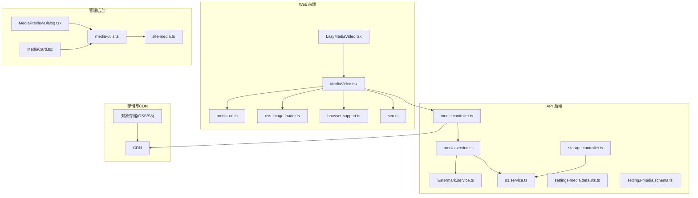
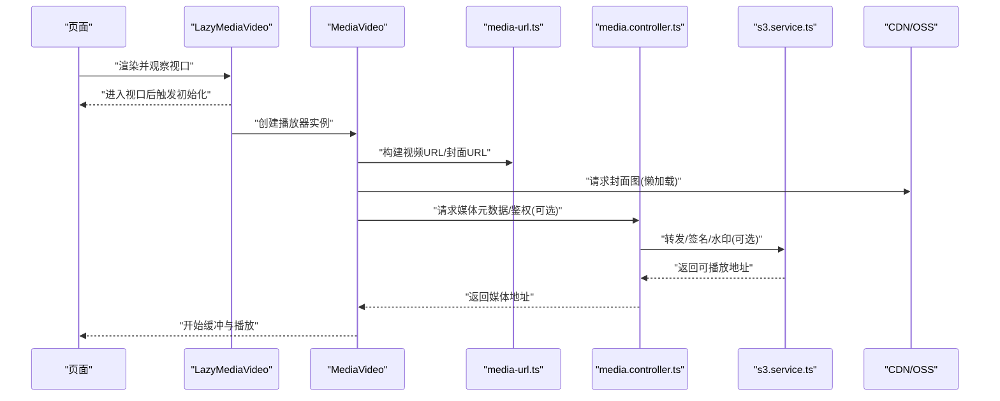
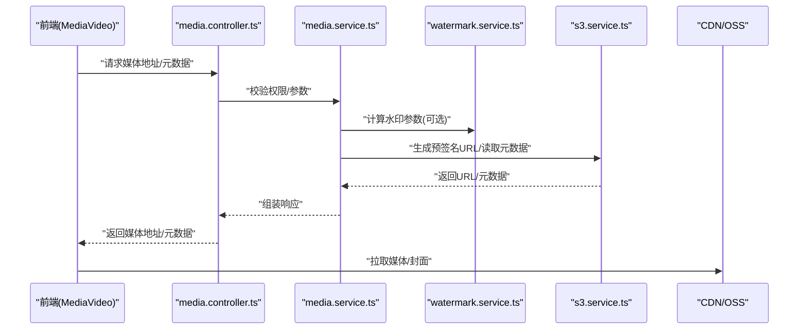
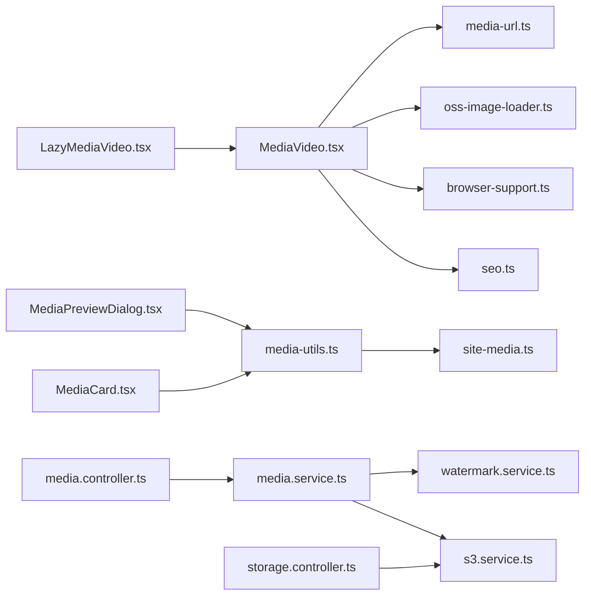

# 视频管理与播放

<cite>
**本文引用的文件**   
- [LazyMediaVideo.tsx](file://apps/web/src/components/LazyMediaVideo.tsx)
- [MediaVideo.tsx](file://apps/web/src/components/MediaVideo.tsx)
- [media-url.ts](file://apps/web/src/lib/media-url.ts)
- [oss-image-loader.ts](file://apps/web/src/lib/oss-image-loader.ts)
- [MediaPreviewDialog.tsx](file://apps/admin/src/components/media/MediaPreviewDialog.tsx)
- [MediaCard.tsx](file://apps/admin/src/components/media/MediaCard.tsx)
- [media-utils.ts](file://apps/admin/src/components/media/media-utils.ts)
- [site-media.ts](file://apps/admin/src/features/site-media.ts)
- [settings-media.defaults.ts](file://apps/api/src/settings/settings-media.defaults.ts)
- [settings-media.schema.ts](file://apps/api/src/settings/settings-media.schema.ts)
- [media.controller.ts](file://apps/api/src/media/media.controller.ts)
- [media.service.ts](file://apps/api/src/media/media.service.ts)
- [watermark.service.ts](file://apps/api/src/media/watermark.service.ts)
- [s3.service.ts](file://apps/api/src/storage/s3.service.ts)
- [storage.controller.ts](file://apps/api/src/storage/storage.controller.ts)
- [browser-support.ts](file://apps/web/src/lib/browser-support.ts)
- [seo.ts](file://apps/web/src/lib/seo.ts)
</cite>

## 目录
1. [简介](#简介)
2. [项目结构](#项目结构)
3. [核心组件](#核心组件)
4. [架构总览](#架构总览)
5. [详细组件分析](#详细组件分析)
6. [依赖关系分析](#依赖关系分析)
7. [性能与优化](#性能与优化)
8. [故障排查指南](#故障排查指南)
9. [结论](#结论)
10. [附录](#附录)

## 简介
本文件面向“视频管理与播放”能力，围绕 LazyMediaVideo 组件的懒加载机制、视频格式支持、播放器配置、编码优化、流媒体传输与自适应码率、封面图处理、播放统计与用户交互事件、SEO 优化、跨浏览器兼容性与移动端体验等主题进行系统化说明。文档同时覆盖前端展示层（Next.js Web 应用）、管理后台（Admin）以及后端 API 服务（NestJS）在视频链路中的职责与协作方式。

## 项目结构
- 前端 Web 应用负责视频渲染、懒加载、事件上报与 SEO 注入；
- 管理后台提供媒体资源预览、选择与基础工具；
- 后端 API 提供媒体访问、水印、存储转发与配置能力；
- 基础设施通过对象存储（如 OSS/S3）承载视频与封面图，并通过 CDN 加速。

图表来源
- [LazyMediaVideo.tsx](file://apps/web/src/components/LazyMediaVideo.tsx)
- [MediaVideo.tsx](file://apps/web/src/components/MediaVideo.tsx)
- [media-url.ts](file://apps/web/src/lib/media-url.ts)
- [oss-image-loader.ts](file://apps/web/src/lib/oss-image-loader.ts)
- [browser-support.ts](file://apps/web/src/lib/browser-support.ts)
- [seo.ts](file://apps/web/src/lib/seo.ts)
- [MediaPreviewDialog.tsx](file://apps/admin/src/components/media/MediaPreviewDialog.tsx)
- [MediaCard.tsx](file://apps/admin/src/components/media/MediaCard.tsx)
- [media-utils.ts](file://apps/admin/src/components/media/media-utils.ts)
- [site-media.ts](file://apps/admin/src/features/site-media.ts)
- [media.controller.ts](file://apps/api/src/media/media.controller.ts)
- [media.service.ts](file://apps/api/src/media/media.service.ts)
- [watermark.service.ts](file://apps/api/src/media/watermark.service.ts)
- [s3.service.ts](file://apps/api/src/storage/s3.service.ts)
- [storage.controller.ts](file://apps/api/src/storage/storage.controller.ts)
- [settings-media.defaults.ts](file://apps/api/src/settings/settings-media.defaults.ts)
- [settings-media.schema.ts](file://apps/api/src/settings/settings-media.schema.ts)

章节来源
- [LazyMediaVideo.tsx](file://apps/web/src/components/LazyMediaVideo.tsx)
- [MediaVideo.tsx](file://apps/web/src/components/MediaVideo.tsx)
- [media-url.ts](file://apps/web/src/lib/media-url.ts)
- [oss-image-loader.ts](file://apps/web/src/lib/oss-image-loader.ts)
- [MediaPreviewDialog.tsx](file://apps/admin/src/components/media/MediaPreviewDialog.tsx)
- [MediaCard.tsx](file://apps/admin/src/components/media/MediaCard.tsx)
- [media-utils.ts](file://apps/admin/src/components/media/media-utils.ts)
- [site-media.ts](file://apps/admin/src/features/site-media.ts)
- [media.controller.ts](file://apps/api/src/media/media.controller.ts)
- [media.service.ts](file://apps/api/src/media/media.service.ts)
- [watermark.service.ts](file://apps/api/src/media/watermark.service.ts)
- [s3.service.ts](file://apps/api/src/storage/s3.service.ts)
- [storage.controller.ts](file://apps/api/src/storage/storage.controller.ts)
- [settings-media.defaults.ts](file://apps/api/src/settings/settings-media.defaults.ts)
- [settings-media.schema.ts](file://apps/api/src/settings/settings-media.schema.ts)

## 核心组件
- LazyMediaVideo：实现“按需加载”的视频播放器，仅在进入视口或触发条件时初始化播放器，减少首屏开销与无效请求。
- MediaVideo：封装原生 HTML5 播放器行为，统一设置源、控制条、事件监听与错误处理。
- media-url：构建媒体 URL（含域名、路径、查询参数），便于适配多环境与 CDN。
- oss-image-loader：为封面图提供统一的图片加载策略（占位、压缩、裁剪）。
- MediaPreviewDialog / MediaCard：管理后台用于预览与选择媒体，辅助编辑流程。
- media-utils / site-media：管理后台侧媒体工具与站点级媒体配置。
- API 层（media.controller/service、watermark.service、s3.service、storage.controller）：提供媒体访问、水印、存储转发与配置能力。
- 配置（settings-media.defaults/schema）：定义媒体相关默认值与校验规则。

章节来源
- [LazyMediaVideo.tsx](file://apps/web/src/components/LazyMediaVideo.tsx)
- [MediaVideo.tsx](file://apps/web/src/components/MediaVideo.tsx)
- [media-url.ts](file://apps/web/src/lib/media-url.ts)
- [oss-image-loader.ts](file://apps/web/src/lib/oss-image-loader.ts)
- [MediaPreviewDialog.tsx](file://apps/admin/src/components/media/MediaPreviewDialog.tsx)
- [MediaCard.tsx](file://apps/admin/src/components/media/MediaCard.tsx)
- [media-utils.ts](file://apps/admin/src/components/media/media-utils.ts)
- [site-media.ts](file://apps/admin/src/features/site-media.ts)
- [media.controller.ts](file://apps/api/src/media/media.controller.ts)
- [media.service.ts](file://apps/api/src/media/media.service.ts)
- [watermark.service.ts](file://apps/api/src/media/watermark.service.ts)
- [s3.service.ts](file://apps/api/src/storage/s3.service.ts)
- [storage.controller.ts](file://apps/api/src/storage/storage.controller.ts)
- [settings-media.defaults.ts](file://apps/api/src/settings/settings-media.defaults.ts)
- [settings-media.schema.ts](file://apps/api/src/settings/settings-media.schema.ts)

## 架构总览
下图展示了从页面渲染到媒体获取与播放的关键路径，包括懒加载触发、播放器初始化、URL 生成、封面图加载、后端媒体接口与存储转发。

图表来源
- [LazyMediaVideo.tsx](file://apps/web/src/components/LazyMediaVideo.tsx)
- [MediaVideo.tsx](file://apps/web/src/components/MediaVideo.tsx)
- [media-url.ts](file://apps/web/src/lib/media-url.ts)
- [media.controller.ts](file://apps/api/src/media/media.controller.ts)
- [s3.service.ts](file://apps/api/src/storage/s3.service.ts)

## 详细组件分析

### LazyMediaVideo 组件（懒加载机制）
- 懒加载策略：使用 IntersectionObserver 检测元素是否进入视口，或在用户交互（点击/滚动）时再初始化播放器，避免首屏不必要的网络与解码开销。
- 生命周期：挂载时注册观察者；进入视口后卸载观察者并触发播放器初始化；组件卸载时清理状态与事件。
- 降级与容错：当不支持懒加载或环境受限（如内存紧张）时，回退为立即加载；失败时显示重试入口。
- 与 MediaVideo 的关系：仅负责“何时加载”，具体播放逻辑委托给 MediaVideo。

图表来源
- [LazyMediaVideo.tsx](file://apps/web/src/components/LazyMediaVideo.tsx)

章节来源
- [LazyMediaVideo.tsx](file://apps/web/src/components/LazyMediaVideo.tsx)

### MediaVideo 组件（播放器与配置）
- 播放器内核：基于 HTML5 <video>，统一封装源设置、控制条、字幕、倍速、全屏等能力。
- 格式支持：优先使用浏览器原生支持的容器与编码（如 MP4/H.264、WebM/Vp9、HLS/DASH 若由后端转码输出）。
- 封面图：先展示静态封面，提升感知速度；封面图通过 oss-image-loader 统一处理。
- 事件上报：播放开始、暂停、结束、错误、缓冲、时间更新等事件可上报至埋点系统。
- 错误处理：网络错误、解码失败、权限拒绝等场景给出友好提示与重试。

图表来源
- [MediaVideo.tsx](file://apps/web/src/components/MediaVideo.tsx)

章节来源
- [MediaVideo.tsx](file://apps/web/src/components/MediaVideo.tsx)

### 媒体 URL 与封面图处理
- media-url：集中构建媒体 URL，支持多环境域名、路径拼接、查询参数（如水印、分辨率、格式）注入。
- oss-image-loader：封面图加载策略，包含占位图、尺寸裁剪、质量压缩、缓存头设置。
- 最佳实践：封面图使用轻量格式（如 WebP/AVIF），视频源尽量使用 H.264/AAC 以最大化兼容性。

章节来源
- [media-url.ts](file://apps/web/src/lib/media-url.ts)
- [oss-image-loader.ts](file://apps/web/src/lib/oss-image-loader.ts)

### 管理后台媒体预览与选择
- MediaPreviewDialog：弹窗预览媒体，支持播放、下载、复制链接等操作。
- MediaCard：列表卡片展示缩略图、标题、时长、大小等关键信息。
- media-utils：提供媒体类型判断、时长解析、大小格式化等工具函数。
- site-media：站点级媒体配置（如默认封面、上传限制、水印开关）。

章节来源
- [MediaPreviewDialog.tsx](file://apps/admin/src/components/media/MediaPreviewDialog.tsx)
- [MediaCard.tsx](file://apps/admin/src/components/media/MediaCard.tsx)
- [media-utils.ts](file://apps/admin/src/components/media/media-utils.ts)
- [site-media.ts](file://apps/admin/src/features/site-media.ts)

### 后端媒体服务与存储转发
- media.controller：暴露媒体访问接口，支持鉴权、防盗链、限流、日志。
- media.service：业务编排，调用水印、存储、元数据处理等服务。
- watermark.service：动态叠加水印（文本/图片），支持位置、透明度、尺寸。
- s3.service：与对象存储交互，生成预签名 URL、批量操作、元数据读取。
- storage.controller：通用存储控制器，统一上传/下载/删除入口。

图表来源
- [media.controller.ts](file://apps/api/src/media/media.controller.ts)
- [media.service.ts](file://apps/api/src/media/media.service.ts)
- [watermark.service.ts](file://apps/api/src/media/watermark.service.ts)
- [s3.service.ts](file://apps/api/src/storage/s3.service.ts)

章节来源
- [media.controller.ts](file://apps/api/src/media/media.controller.ts)
- [media.service.ts](file://apps/api/src/media/media.service.ts)
- [watermark.service.ts](file://apps/api/src/media/watermark.service.ts)
- [s3.service.ts](file://apps/api/src/storage/s3.service.ts)
- [storage.controller.ts](file://apps/api/src/storage/storage.controller.ts)

### 媒体配置与校验
- settings-media.defaults：定义媒体相关默认值（如最大文件大小、允许格式、水印开关、默认封面策略）。
- settings-media.schema：对媒体配置进行结构化校验，确保运行时安全与一致性。

章节来源
- [settings-media.defaults.ts](file://apps/api/src/settings/settings-media.defaults.ts)
- [settings-media.schema.ts](file://apps/api/src/settings/settings-media.schema.ts)

## 依赖关系分析
- 前端依赖：
  - LazyMediaVideo 依赖 MediaVideo 与 media-url；
  - MediaVideo 依赖 oss-image-loader 与 browser-support；
  - SEO 相关依赖 seo.ts 注入结构化数据。
- 管理后台依赖：
  - MediaPreviewDialog/MediaCard 依赖 media-utils 与 site-media。
- 后端依赖：
  - media.controller 依赖 media.service；
  - media.service 依赖 watermark.service 与 s3.service；
  - storage.controller 依赖 s3.service。

图表来源
- [LazyMediaVideo.tsx](file://apps/web/src/components/LazyMediaVideo.tsx)
- [MediaVideo.tsx](file://apps/web/src/components/MediaVideo.tsx)
- [media-url.ts](file://apps/web/src/lib/media-url.ts)
- [oss-image-loader.ts](file://apps/web/src/lib/oss-image-loader.ts)
- [browser-support.ts](file://apps/web/src/lib/browser-support.ts)
- [seo.ts](file://apps/web/src/lib/seo.ts)
- [MediaPreviewDialog.tsx](file://apps/admin/src/components/media/MediaPreviewDialog.tsx)
- [MediaCard.tsx](file://apps/admin/src/components/media/MediaCard.tsx)
- [media-utils.ts](file://apps/admin/src/components/media/media-utils.ts)
- [site-media.ts](file://apps/admin/src/features/site-media.ts)
- [media.controller.ts](file://apps/api/src/media/media.controller.ts)
- [media.service.ts](file://apps/api/src/media/media.service.ts)
- [watermark.service.ts](file://apps/api/src/media/watermark.service.ts)
- [s3.service.ts](file://apps/api/src/storage/s3.service.ts)
- [storage.controller.ts](file://apps/api/src/storage/storage.controller.ts)

章节来源
- [LazyMediaVideo.tsx](file://apps/web/src/components/LazyMediaVideo.tsx)
- [MediaVideo.tsx](file://apps/web/src/components/MediaVideo.tsx)
- [media-url.ts](file://apps/web/src/lib/media-url.ts)
- [oss-image-loader.ts](file://apps/web/src/lib/oss-image-loader.ts)
- [browser-support.ts](file://apps/web/src/lib/browser-support.ts)
- [seo.ts](file://apps/web/src/lib/seo.ts)
- [MediaPreviewDialog.tsx](file://apps/admin/src/components/media/MediaPreviewDialog.tsx)
- [MediaCard.tsx](file://apps/admin/src/components/media/MediaCard.tsx)
- [media-utils.ts](file://apps/admin/src/components/media/media-utils.ts)
- [site-media.ts](file://apps/admin/src/features/site-media.ts)
- [media.controller.ts](file://apps/api/src/media/media.controller.ts)
- [media.service.ts](file://apps/api/src/media/media.service.ts)
- [watermark.service.ts](file://apps/api/src/media/watermark.service.ts)
- [s3.service.ts](file://apps/api/src/storage/s3.service.ts)
- [storage.controller.ts](file://apps/api/src/storage/storage.controller.ts)

## 性能与优化
- 懒加载与按需初始化：
  - 使用 IntersectionObserver 延迟加载，降低首屏压力；
  - 非视口内不发起网络请求，节省带宽与电量。
- 视频编码与格式：
  - 首选 H.264+AAC 的 MP4 以获得最佳兼容性；
  - 在支持环境下提供 WebM(VP9) 以提升压缩比；
  - 长视频建议采用 HLS/DASH 实现自适应码率（需后端转码与分发）。
- 封面图优化：
  - 使用 WebP/AVIF 小体积封面，配合懒加载；
  - 合理设置宽高与缓存头，减少重绘与重复请求。
- 流媒体与自适应码率：
  - 通过多码率切片与 m3u8/mpd 清单，根据网络状况切换清晰度；
  - 结合 CDN 边缘缓存与 HTTP/2 多路复用提升吞吐。
- 播放器策略：
  - 自动播放需遵循浏览器策略（静音/用户手势）；
  - 预加载策略设置为 metadata 或 none，避免浪费带宽。
- 监控与埋点：
  - 记录播放开始/结束、卡顿、错误、清晰度切换等指标；
  - 结合 APM 与日志平台定位问题。

[本节为通用指导，无需特定文件引用]

## 故障排查指南
- 无法自动播放：
  - 检查浏览器自动播放策略（需要静音或用户交互）；
  - 确认媒体 CORS 与 MIME 类型正确。
- 黑屏或无声音：
  - 检查编码格式是否被当前浏览器支持；
  - 验证音频轨道是否存在且未被静音。
- 加载缓慢或频繁卡顿：
  - 检查 CDN 命中率与缓存策略；
  - 评估网络带宽与码率匹配度。
- 权限或防盗链失败：
  - 校验 Referer/Token 签名；
  - 检查预签名 URL 有效期与权限。
- 错误上报与调试：
  - 捕获 video.onerror 与网络错误；
  - 打印媒体元数据与播放器状态以便定位。

章节来源
- [browser-support.ts](file://apps/web/src/lib/browser-support.ts)
- [media.controller.ts](file://apps/api/src/media/media.controller.ts)
- [media.service.ts](file://apps/api/src/media/media.service.ts)

## 结论
通过 LazyMediaVideo 的懒加载与 MediaVideo 的统一播放器封装，结合后端媒体服务与对象存储/CDN 的分发能力，本项目实现了高效、稳定且可扩展的视频播放体系。配合合理的编码策略、自适应码率、封面图优化与完善的埋点监控，可在多端与多网络环境下提供良好的观看体验。建议在后续迭代中引入 HLS/DASH 转码流水线与更细粒度的性能指标采集，持续优化首帧时间与卡顿率。

[本节为总结性内容，无需特定文件引用]

## 附录
- 最佳实践清单：
  - 封面图使用 WebP/AVIF，尺寸与比例一致；
  - 视频优先 H.264+AAC 的 MP4，必要时提供 WebM；
  - 长视频启用 HLS/DASH 自适应码率；
  - 所有媒体请求走 CDN，开启缓存与压缩；
  - 自动播放遵循浏览器策略，必要时提供手动播放入口；
  - 完善错误提示与重试机制；
  - 埋点覆盖播放关键事件与性能指标。

[本节为补充信息，无需特定文件引用]