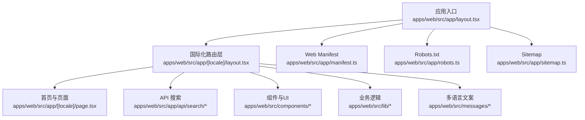
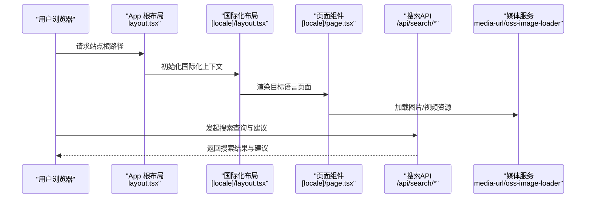
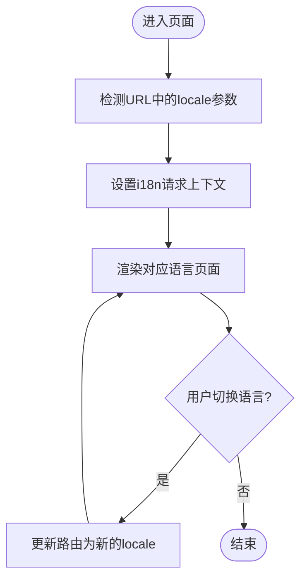
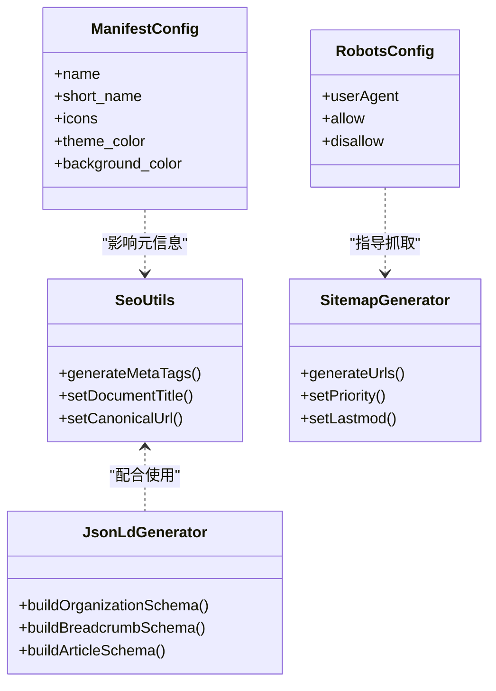
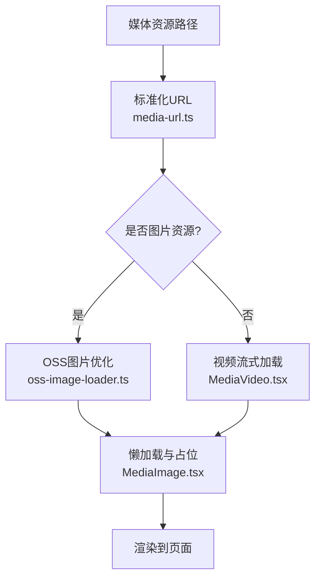
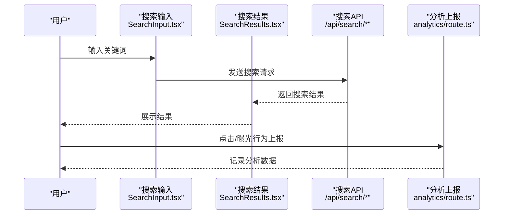
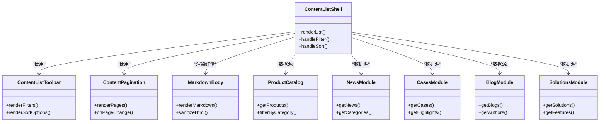
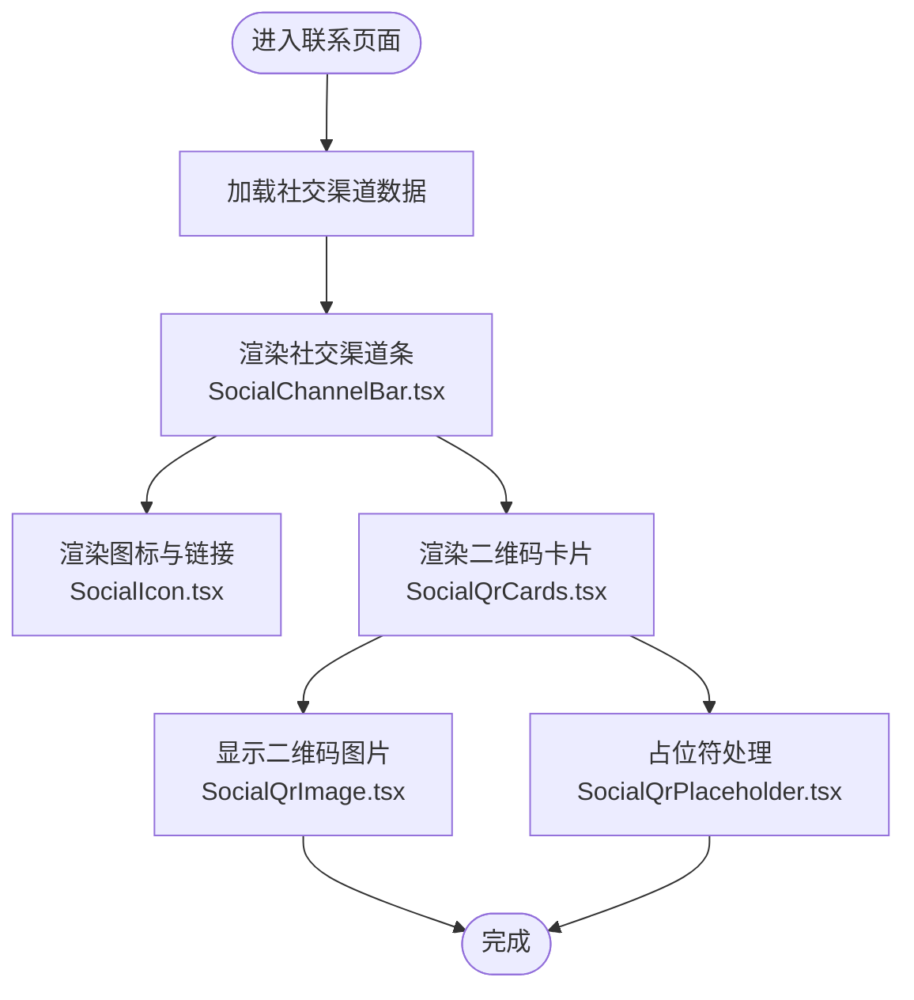
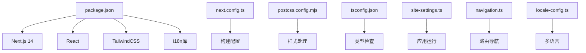

# 官方网站前端

<cite>
**本文档引用的文件**   
- [apps/web/src/app/[locale]/layout.tsx](file://apps/web/src/app/[locale]/layout.tsx)
- [apps/web/src/app/[locale]/page.tsx](file://apps/web/src/app/[locale]/page.tsx)
- [apps/web/src/app/layout.tsx](file://apps/web/src/app/layout.tsx)
- [apps/web/src/app/manifest.ts](file://apps/web/src/app/manifest.ts)
- [apps/web/src/app/robots.ts](file://apps/web/src/app/robots.ts)
- [apps/web/src/app/sitemap.ts](file://apps/web/src/app/sitemap.ts)
- [apps/web/src/i18n/navigation.ts](file://apps/web/src/i18n/navigation.ts)
- [apps/web/src/i18n/request.ts](file://apps/web/src/i18n/request.ts)
- [apps/web/src/i18n/routing.ts](file://apps/web/src/i18n/routing.ts)
- [apps/web/src/lib/locale-config.ts](file://apps/web/src/lib/locale-config.ts)
- [apps/web/src/lib/seo.ts](file://apps/web/src/lib/seo.ts)
- [apps/web/src/lib/media-url.ts](file://apps/web/src/lib/media-url.ts)
- [apps/web/src/lib/oss-image-loader.ts](file://apps/web/src/lib/oss-image-loader.ts)
- [apps/web/src/components/MediaImage.tsx](file://apps/web/src/components/MediaImage.tsx)
- [apps/web/src/components/MediaVideo.tsx](file://apps/web/src/components/MediaVideo.tsx)
- [apps/web/src/components/LazyMediaVideo.tsx](file://apps/web/src/components/LazyMediaVideo.tsx)
- [apps/web/src/components/i18n/LanguageSelector.tsx](file://apps/web/src/components/i18n/LanguageSelector.tsx)
- [apps/web/src/components/i18n/FooterLanguageTrigger.tsx](file://apps/web/src/components/i18n/FooterLanguageTrigger.tsx)
- [apps/web/src/components/i18n/LanguageSelectorDrawer.tsx](file://apps/web/src/components/i18n/LanguageSelectorDrawer.tsx)
- [apps/web/src/components/search/SearchInput.tsx](file://apps/web/src/components/search/SearchInput.tsx)
- [apps/web/src/components/search/SearchResults.tsx](file://apps/web/src/components/search/SearchResults.tsx)
- [apps/web/src/app/api/search/route.ts](file://apps/web/src/app/api/search/route.ts)
- [apps/web/src/app/api/search/suggest/route.ts](file://apps/web/src/app/api/search/suggest/route.ts)
- [apps/web/src/app/api/search/analytics/route.ts](file://apps/web/src/app/api/search/analytics/route.ts)
- [apps/web/src/lib/content-list.ts](file://apps/web/src/lib/content-list.ts)
- [apps/web/src/lib/product-catalog.ts](file://apps/web/src/lib/product-catalog.ts)
- [apps/web/src/lib/news.ts](file://apps/web/src/lib/news.ts)
- [apps/web/src/lib/cases.ts](file://apps/web/src/lib/cases.ts)
- [apps/web/src/lib/blog.ts](file://apps/web/src/lib/blog.ts)
- [apps/web/src/lib/solutions.ts](file://apps/web/src/lib/solutions.ts)
- [apps/web/src/lib/site-settings.ts](file://apps/web/src/lib/site-settings.ts)
- [apps/web/src/lib/navigation.ts](file://apps/web/src/lib/navigation.ts)
- [apps/web/src/lib/jsonld.ts](file://apps/web/src/lib/jsonld.ts)
- [apps/web/src/components/content/ContentListShell.tsx](file://apps/web/src/components/content/ContentListShell.tsx)
- [apps/web/src/components/content/ContentListToolbar.tsx](file://apps/web/src/components/content/ContentListToolbar.tsx)
- [apps/web/src/components/content/ContentPagination.tsx](file://apps/web/src/components/content/ContentPagination.tsx)
- [apps/web/src/components/content/MarkdownBody.tsx](file://apps/web/src/components/content/MarkdownBody.tsx)
- [apps/web/src/components/JsonLd.tsx](file://apps/web/src/components/JsonLd.tsx)
- [apps/web/src/components/analytics/VisitorTracker.tsx](file://apps/web/src/components/analytics/VisitorTracker.tsx)
- [apps/web/src/components/contact/SocialChannelBar.tsx](file://apps/web/src/components/contact/SocialChannelBar.tsx)
- [apps/web/src/components/contact/SocialConnectPanel.tsx](file://apps/web/src/components/contact/SocialConnectPanel.tsx)
- [apps/web/src/components/contact/SocialIcon.tsx](file://apps/web/src/components/contact/SocialIcon.tsx)
- [apps/web/src/components/contact/SocialQrCards.tsx](file://apps/web/src/components/contact/SocialQrCards.tsx)
- [apps/web/src/components/contact/SocialQrImage.tsx](file://apps/web/src/components/contact/SocialQrImage.tsx)
- [apps/web/src/components/contact/SocialQrPlaceholder.tsx](file://apps/web/src/components/contact/SocialQrPlaceholder.tsx)
- [apps/web/src/messages/zh-CN.json](file://apps/web/src/messages/zh-CN.json)
- [apps/web/src/messages/en.json](file://apps/web/src/messages/en.json)
- [apps/web/src/messages/zh-TW.json](file://apps/web/src/messages/zh-TW.json)
- [apps/web/next.config.ts](file://apps/web/next.config.ts)
- [apps/web/package.json](file://apps/web/package.json)
</cite>

## 目录
1. [简介](#简介)
2. [项目结构](#项目结构)
3. [核心组件](#核心组件)
4. [架构总览](#架构总览)
5. [详细组件分析](#详细组件分析)
6. [依赖分析](#依赖分析)
7. [性能考虑](#性能考虑)
8. [故障排查指南](#故障排查指南)
9. [结论](#结论)
10. [附录](#附录)

## 简介
本文件面向官方网站前端的开发者与内容运营人员，基于 Next.js 14 的 App Router 构建，提供多语言支持、SEO 优化、性能优化策略与用户体验设计说明。文档覆盖页面路由结构、产品目录展示、案例研究、新闻博客与资源中心等内容管理系统，以及国际化实现、主题切换、搜索功能、联系表单、媒体资源管理、图片优化、视频播放与移动端适配等关键能力。

## 项目结构
网站前端位于 apps/web 目录，采用 Next.js 14 App Router 组织页面与路由：
- 应用根布局与全局配置：layout.tsx、manifest.ts、robots.ts、sitemap.ts
- 国际化路由：[locale] 动态段用于多语言路径
- API 路由：/api/search 系列接口用于搜索建议与分析上报
- 组件库：i18n、search、content、media、contact、analytics 等
- 业务逻辑：lib 目录下的内容列表、产品目录、新闻、案例、博客、解决方案、站点设置、导航、SEO、JSON-LD、媒体 URL 等
- 消息与文案：messages 目录包含 zh-CN、en、zh-TW 等多语言文案

**图表来源** 
- [apps/web/src/app/layout.tsx](file://apps/web/src/app/layout.tsx)
- [apps/web/src/app/[locale]/layout.tsx](file://apps/web/src/app/[locale]/layout.tsx)
- [apps/web/src/app/[locale]/page.tsx](file://apps/web/src/app/[locale]/page.tsx)
- [apps/web/src/app/manifest.ts](file://apps/web/src/app/manifest.ts)
- [apps/web/src/app/robots.ts](file://apps/web/src/app/robots.ts)
- [apps/web/src/app/sitemap.ts](file://apps/web/src/app/sitemap.ts)
- [apps/web/src/app/api/search/route.ts](file://apps/web/src/app/api/search/route.ts)
- [apps/web/src/app/api/search/suggest/route.ts](file://apps/web/src/app/api/search/suggest/route.ts)
- [apps/web/src/app/api/search/analytics/route.ts](file://apps/web/src/app/api/search/analytics/route.ts)

**章节来源**
- [apps/web/src/app/layout.tsx](file://apps/web/src/app/layout.tsx)
- [apps/web/src/app/[locale]/layout.tsx](file://apps/web/src/app/[locale]/layout.tsx)
- [apps/web/src/app/[locale]/page.tsx](file://apps/web/src/app/[locale]/page.tsx)
- [apps/web/src/app/manifest.ts](file://apps/web/src/app/manifest.ts)
- [apps/web/src/app/robots.ts](file://apps/web/src/app/robots.ts)
- [apps/web/src/app/sitemap.ts](file://apps/web/src/app/sitemap.ts)

## 核心组件
- 国际化（i18n）
  - 路由与请求上下文：navigation.ts、request.ts、routing.ts
  - 本地化配置：locale-config.ts
  - 语言选择器：LanguageSelector.tsx、FooterLanguageTrigger.tsx、LanguageSelectorDrawer.tsx
- SEO 与结构化数据
  - SEO 工具：seo.ts
  - JSON-LD 生成：jsonld.ts、JsonLd.tsx
  - Web Manifest、Robots、Sitemap：manifest.ts、robots.ts、sitemap.ts
- 媒体资源与图片优化
  - 媒体 URL 处理：media-url.ts
  - OSS 图片加载器：oss-image-loader.ts
  - 图片与视频组件：MediaImage.tsx、MediaVideo.tsx、LazyMediaVideo.tsx
- 搜索功能
  - 搜索输入与结果：SearchInput.tsx、SearchResults.tsx
  - 搜索 API：route.ts、suggest/route.ts、analytics/route.ts
- 内容管理与展示
  - 内容列表壳与工具栏：ContentListShell.tsx、ContentListToolbar.tsx、ContentPagination.tsx
  - Markdown 渲染：MarkdownBody.tsx
  - 业务数据：content-list.ts、product-catalog.ts、news.ts、cases.ts、blog.ts、solutions.ts
- 站点设置与导航
  - 站点设置：site-settings.ts
  - 导航定义：navigation.ts
- 分析与访客追踪
  - 访客追踪：VisitorTracker.tsx

**章节来源**
- [apps/web/src/i18n/navigation.ts](file://apps/web/src/i18n/navigation.ts)
- [apps/web/src/i18n/request.ts](file://apps/web/src/i18n/request.ts)
- [apps/web/src/i18n/routing.ts](file://apps/web/src/i18n/routing.ts)
- [apps/web/src/lib/locale-config.ts](file://apps/web/src/lib/locale-config.ts)
- [apps/web/src/components/i18n/LanguageSelector.tsx](file://apps/web/src/components/i18n/LanguageSelector.tsx)
- [apps/web/src/components/i18n/FooterLanguageTrigger.tsx](file://apps/web/src/components/i18n/FooterLanguageTrigger.tsx)
- [apps/web/src/components/i18n/LanguageSelectorDrawer.tsx](file://apps/web/src/components/i18n/LanguageSelectorDrawer.tsx)
- [apps/web/src/lib/seo.ts](file://apps/web/src/lib/seo.ts)
- [apps/web/src/lib/jsonld.ts](file://apps/web/src/lib/jsonld.ts)
- [apps/web/src/components/JsonLd.tsx](file://apps/web/src/components/JsonLd.tsx)
- [apps/web/src/app/manifest.ts](file://apps/web/src/app/manifest.ts)
- [apps/web/src/app/robots.ts](file://apps/web/src/app/robots.ts)
- [apps/web/src/app/sitemap.ts](file://apps/web/src/app/sitemap.ts)
- [apps/web/src/lib/media-url.ts](file://apps/web/src/lib/media-url.ts)
- [apps/web/src/lib/oss-image-loader.ts](file://apps/web/src/lib/oss-image-loader.ts)
- [apps/web/src/components/MediaImage.tsx](file://apps/web/src/components/MediaImage.tsx)
- [apps/web/src/components/MediaVideo.tsx](file://apps/web/src/components/MediaVideo.tsx)
- [apps/web/src/components/LazyMediaVideo.tsx](file://apps/web/src/components/LazyMediaVideo.tsx)
- [apps/web/src/components/search/SearchInput.tsx](file://apps/web/src/components/search/SearchInput.tsx)
- [apps/web/src/components/search/SearchResults.tsx](file://apps/web/src/components/search/SearchResults.tsx)
- [apps/web/src/app/api/search/route.ts](file://apps/web/src/app/api/search/route.ts)
- [apps/web/src/app/api/search/suggest/route.ts](file://apps/web/src/app/api/search/suggest/route.ts)
- [apps/web/src/app/api/search/analytics/route.ts](file://apps/web/src/app/api/search/analytics/route.ts)
- [apps/web/src/components/content/ContentListShell.tsx](file://apps/web/src/components/content/ContentListShell.tsx)
- [apps/web/src/components/content/ContentListToolbar.tsx](file://apps/web/src/components/content/ContentListToolbar.tsx)
- [apps/web/src/components/content/ContentPagination.tsx](file://apps/web/src/components/content/ContentPagination.tsx)
- [apps/web/src/components/content/MarkdownBody.tsx](file://apps/web/src/components/content/MarkdownBody.tsx)
- [apps/web/src/lib/content-list.ts](file://apps/web/src/lib/content-list.ts)
- [apps/web/src/lib/product-catalog.ts](file://apps/web/src/lib/product-catalog.ts)
- [apps/web/src/lib/news.ts](file://apps/web/src/lib/news.ts)
- [apps/web/src/lib/cases.ts](file://apps/web/src/lib/cases.ts)
- [apps/web/src/lib/blog.ts](file://apps/web/src/lib/blog.ts)
- [apps/web/src/lib/solutions.ts](file://apps/web/src/lib/solutions.ts)
- [apps/web/src/lib/site-settings.ts](file://apps/web/src/lib/site-settings.ts)
- [apps/web/src/lib/navigation.ts](file://apps/web/src/lib/navigation.ts)
- [apps/web/src/components/analytics/VisitorTracker.tsx](file://apps/web/src/components/analytics/VisitorTracker.tsx)

## 架构总览
Next.js 14 App Router 的多语言路由通过 [locale] 动态段实现，结合 i18n 请求上下文与导航模块，确保页面与链接在不同语言下正确解析。SEO 相关由 manifest、robots、sitemap 与 JSON-LD 共同完成；媒体资源通过统一的 media-url 与 oss-image-loader 进行优化；搜索通过 /api/search 系列接口提供服务端建议与分析上报；内容展示通过 ContentListShell 与 MarkdownBody 组合渲染。

**图表来源** 
- [apps/web/src/app/layout.tsx](file://apps/web/src/app/layout.tsx)
- [apps/web/src/app/[locale]/layout.tsx](file://apps/web/src/app/[locale]/layout.tsx)
- [apps/web/src/app/[locale]/page.tsx](file://apps/web/src/app/[locale]/page.tsx)
- [apps/web/src/app/api/search/route.ts](file://apps/web/src/app/api/search/route.ts)
- [apps/web/src/app/api/search/suggest/route.ts](file://apps/web/src/app/api/search/suggest/route.ts)
- [apps/web/src/lib/media-url.ts](file://apps/web/src/lib/media-url.ts)
- [apps/web/src/lib/oss-image-loader.ts](file://apps/web/src/lib/oss-image-loader.ts)

## 详细组件分析

### 国际化（i18n）与多语言路由
- 路由与请求上下文
  - navigation.ts：提供跨语言的导航与链接生成
  - request.ts：在请求阶段解析 locale 并注入上下文
  - routing.ts：定义路由与语言映射规则
- 本地化配置
  - locale-config.ts：集中管理支持的语种与默认语言
- 语言选择器
  - LanguageSelector.tsx：顶部或侧边语言切换控件
  - FooterLanguageTrigger.tsx：页脚快捷语言切换
  - LanguageSelectorDrawer.tsx：移动端抽屉式语言选择

**图表来源** 
- [apps/web/src/i18n/navigation.ts](file://apps/web/src/i18n/navigation.ts)
- [apps/web/src/i18n/request.ts](file://apps/web/src/i18n/request.ts)
- [apps/web/src/i18n/routing.ts](file://apps/web/src/i18n/routing.ts)
- [apps/web/src/lib/locale-config.ts](file://apps/web/src/lib/locale-config.ts)
- [apps/web/src/components/i18n/LanguageSelector.tsx](file://apps/web/src/components/i18n/LanguageSelector.tsx)
- [apps/web/src/components/i18n/FooterLanguageTrigger.tsx](file://apps/web/src/components/i18n/FooterLanguageTrigger.tsx)
- [apps/web/src/components/i18n/LanguageSelectorDrawer.tsx](file://apps/web/src/components/i18n/LanguageSelectorDrawer.tsx)

**章节来源**
- [apps/web/src/i18n/navigation.ts](file://apps/web/src/i18n/navigation.ts)
- [apps/web/src/i18n/request.ts](file://apps/web/src/i18n/request.ts)
- [apps/web/src/i18n/routing.ts](file://apps/web/src/i18n/routing.ts)
- [apps/web/src/lib/locale-config.ts](file://apps/web/src/lib/locale-config.ts)
- [apps/web/src/components/i18n/LanguageSelector.tsx](file://apps/web/src/components/i18n/LanguageSelector.tsx)
- [apps/web/src/components/i18n/FooterLanguageTrigger.tsx](file://apps/web/src/components/i18n/FooterLanguageTrigger.tsx)
- [apps/web/src/components/i18n/LanguageSelectorDrawer.tsx](file://apps/web/src/components/i18n/LanguageSelectorDrawer.tsx)

### SEO 优化与结构化数据
- Web Manifest：manifest.ts 定义 PWA 元数据与应用名称、图标、主题色等
- Robots：robots.ts 控制搜索引擎抓取策略
- Sitemap：sitemap.ts 生成站点地图，提升索引效率
- JSON-LD：jsonld.ts 与 JsonLd.tsx 生成结构化数据，增强搜索引擎理解

**图表来源** 
- [apps/web/src/lib/seo.ts](file://apps/web/src/lib/seo.ts)
- [apps/web/src/lib/jsonld.ts](file://apps/web/src/lib/jsonld.ts)
- [apps/web/src/components/JsonLd.tsx](file://apps/web/src/components/JsonLd.tsx)
- [apps/web/src/app/manifest.ts](file://apps/web/src/app/manifest.ts)
- [apps/web/src/app/robots.ts](file://apps/web/src/app/robots.ts)
- [apps/web/src/app/sitemap.ts](file://apps/web/src/app/sitemap.ts)

**章节来源**
- [apps/web/src/lib/seo.ts](file://apps/web/src/lib/seo.ts)
- [apps/web/src/lib/jsonld.ts](file://apps/web/src/lib/jsonld.ts)
- [apps/web/src/components/JsonLd.tsx](file://apps/web/src/components/JsonLd.tsx)
- [apps/web/src/app/manifest.ts](file://apps/web/src/app/manifest.ts)
- [apps/web/src/app/robots.ts](file://apps/web/src/app/robots.ts)
- [apps/web/src/app/sitemap.ts](file://apps/web/src/app/sitemap.ts)

### 媒体资源管理与图片优化
- 媒体 URL 处理：media-url.ts 统一媒体资源地址拼接与域名处理
- OSS 图片加载器：oss-image-loader.ts 集成阿里云 OSS 的图片尺寸、格式转换与缓存策略
- 图片与视频组件：MediaImage.tsx、MediaVideo.tsx、LazyMediaVideo.tsx 提供懒加载与响应式支持

**图表来源** 
- [apps/web/src/lib/media-url.ts](file://apps/web/src/lib/media-url.ts)
- [apps/web/src/lib/oss-image-loader.ts](file://apps/web/src/lib/oss-image-loader.ts)
- [apps/web/src/components/MediaImage.tsx](file://apps/web/src/components/MediaImage.tsx)
- [apps/web/src/components/MediaVideo.tsx](file://apps/web/src/components/MediaVideo.tsx)
- [apps/web/src/components/LazyMediaVideo.tsx](file://apps/web/src/components/LazyMediaVideo.tsx)

**章节来源**
- [apps/web/src/lib/media-url.ts](file://apps/web/src/lib/media-url.ts)
- [apps/web/src/lib/oss-image-loader.ts](file://apps/web/src/lib/oss-image-loader.ts)
- [apps/web/src/components/MediaImage.tsx](file://apps/web/src/components/MediaImage.tsx)
- [apps/web/src/components/MediaVideo.tsx](file://apps/web/src/components/MediaVideo.tsx)
- [apps/web/src/components/LazyMediaVideo.tsx](file://apps/web/src/components/LazyMediaVideo.tsx)

### 搜索功能与交互流程
- 搜索输入与结果：SearchInput.tsx、SearchResults.tsx 提供关键词输入与结果展示
- 搜索 API：/api/search/route.ts 主搜索接口；/api/search/suggest/route.ts 搜索建议；/api/search/analytics/route.ts 分析上报

**图表来源** 
- [apps/web/src/components/search/SearchInput.tsx](file://apps/web/src/components/search/SearchInput.tsx)
- [apps/web/src/components/search/SearchResults.tsx](file://apps/web/src/components/search/SearchResults.tsx)
- [apps/web/src/app/api/search/route.ts](file://apps/web/src/app/api/search/route.ts)
- [apps/web/src/app/api/search/suggest/route.ts](file://apps/web/src/app/api/search/suggest/route.ts)
- [apps/web/src/app/api/search/analytics/route.ts](file://apps/web/src/app/api/search/analytics/route.ts)

**章节来源**
- [apps/web/src/components/search/SearchInput.tsx](file://apps/web/src/components/search/SearchInput.tsx)
- [apps/web/src/components/search/SearchResults.tsx](file://apps/web/src/components/search/SearchResults.tsx)
- [apps/web/src/app/api/search/route.ts](file://apps/web/src/app/api/search/route.ts)
- [apps/web/src/app/api/search/suggest/route.ts](file://apps/web/src/app/api/search/suggest/route.ts)
- [apps/web/src/app/api/search/analytics/route.ts](file://apps/web/src/app/api/search/analytics/route.ts)

### 内容管理系统与页面展示
- 内容列表壳与工具栏：ContentListShell.tsx、ContentListToolbar.tsx、ContentPagination.tsx 提供分页、筛选与排序
- Markdown 渲染：MarkdownBody.tsx 将 Markdown 内容安全渲染为 HTML
- 业务数据模块：content-list.ts、product-catalog.ts、news.ts、cases.ts、blog.ts、solutions.ts 分别管理不同内容类型的数据获取与格式化

**图表来源** 
- [apps/web/src/components/content/ContentListShell.tsx](file://apps/web/src/components/content/ContentListShell.tsx)
- [apps/web/src/components/content/ContentListToolbar.tsx](file://apps/web/src/components/content/ContentListToolbar.tsx)
- [apps/web/src/components/content/ContentPagination.tsx](file://apps/web/src/components/content/ContentPagination.tsx)
- [apps/web/src/components/content/MarkdownBody.tsx](file://apps/web/src/components/content/MarkdownBody.tsx)
- [apps/web/src/lib/content-list.ts](file://apps/web/src/lib/content-list.ts)
- [apps/web/src/lib/product-catalog.ts](file://apps/web/src/lib/product-catalog.ts)
- [apps/web/src/lib/news.ts](file://apps/web/src/lib/news.ts)
- [apps/web/src/lib/cases.ts](file://apps/web/src/lib/cases.ts)
- [apps/web/src/lib/blog.ts](file://apps/web/src/lib/blog.ts)
- [apps/web/src/lib/solutions.ts](file://apps/web/src/lib/solutions.ts)

**章节来源**
- [apps/web/src/components/content/ContentListShell.tsx](file://apps/web/src/components/content/ContentListShell.tsx)
- [apps/web/src/components/content/ContentListToolbar.tsx](file://apps/web/src/components/content/ContentListToolbar.tsx)
- [apps/web/src/components/content/ContentPagination.tsx](file://apps/web/src/components/content/ContentPagination.tsx)
- [apps/web/src/components/content/MarkdownBody.tsx](file://apps/web/src/components/content/MarkdownBody.tsx)
- [apps/web/src/lib/content-list.ts](file://apps/web/src/lib/content-list.ts)
- [apps/web/src/lib/product-catalog.ts](file://apps/web/src/lib/product-catalog.ts)
- [apps/web/src/lib/news.ts](file://apps/web/src/lib/news.ts)
- [apps/web/src/lib/cases.ts](file://apps/web/src/lib/cases.ts)
- [apps/web/src/lib/blog.ts](file://apps/web/src/lib/blog.ts)
- [apps/web/src/lib/solutions.ts](file://apps/web/src/lib/solutions.ts)

### 联系表单与社交渠道
- 社交渠道展示：SocialChannelBar.tsx、SocialIcon.tsx、SocialQrCards.tsx、SocialQrImage.tsx、SocialQrPlaceholder.tsx
- 社交连接面板：SocialConnectPanel.tsx 提供二维码与联系方式展示

**图表来源** 
- [apps/web/src/components/contact/SocialChannelBar.tsx](file://apps/web/src/components/contact/SocialChannelBar.tsx)
- [apps/web/src/components/contact/SocialIcon.tsx](file://apps/web/src/components/contact/SocialIcon.tsx)
- [apps/web/src/components/contact/SocialQrCards.tsx](file://apps/web/src/components/contact/SocialQrCards.tsx)
- [apps/web/src/components/contact/SocialQrImage.tsx](file://apps/web/src/components/contact/SocialQrImage.tsx)
- [apps/web/src/components/contact/SocialQrPlaceholder.tsx](file://apps/web/src/components/contact/SocialQrPlaceholder.tsx)
- [apps/web/src/components/contact/SocialConnectPanel.tsx](file://apps/web/src/components/contact/SocialConnectPanel.tsx)

**章节来源**
- [apps/web/src/components/contact/SocialChannelBar.tsx](file://apps/web/src/components/contact/SocialChannelBar.tsx)
- [apps/web/src/components/contact/SocialIcon.tsx](file://apps/web/src/components/contact/SocialIcon.tsx)
- [apps/web/src/components/contact/SocialQrCards.tsx](file://apps/web/src/components/contact/SocialQrCards.tsx)
- [apps/web/src/components/contact/SocialQrImage.tsx](file://apps/web/src/components/contact/SocialQrImage.tsx)
- [apps/web/src/components/contact/SocialQrPlaceholder.tsx](file://apps/web/src/components/contact/SocialQrPlaceholder.tsx)
- [apps/web/src/components/contact/SocialConnectPanel.tsx](file://apps/web/src/components/contact/SocialConnectPanel.tsx)

### 分析与访客追踪
- VisitorTracker.tsx：收集页面访问、事件与用户行为数据，用于后续分析与优化

**章节来源**
- [apps/web/src/components/analytics/VisitorTracker.tsx](file://apps/web/src/components/analytics/VisitorTracker.tsx)

## 依赖分析
- 外部依赖与包管理：package.json 定义了 Next.js、React、TailwindCSS、i18n 库等依赖
- 构建与样式：next.config.ts、postcss.config.mjs、tsconfig.json 配置构建流程与类型检查
- 运行时配置：site-settings.ts、navigation.ts、locale-config.ts 等模块提供运行时配置

**图表来源** 
- [apps/web/package.json](file://apps/web/package.json)
- [apps/web/next.config.ts](file://apps/web/next.config.ts)
- [apps/web/src/lib/site-settings.ts](file://apps/web/src/lib/site-settings.ts)
- [apps/web/src/lib/navigation.ts](file://apps/web/src/lib/navigation.ts)
- [apps/web/src/lib/locale-config.ts](file://apps/web/src/lib/locale-config.ts)

**章节来源**
- [apps/web/package.json](file://apps/web/package.json)
- [apps/web/next.config.ts](file://apps/web/next.config.ts)

## 性能考虑
- 图片与媒体优化
  - 使用 oss-image-loader.ts 进行图片尺寸与格式优化，减少带宽占用
  - MediaImage.tsx 与 LazyMediaVideo.tsx 实现懒加载与按需加载
- 路由与数据加载
  - Next.js 14 App Router 支持服务端渲染与静态生成，合理划分页面与 API 路由
  - 内容列表与分页通过 ContentListShell 与 ContentPagination 优化首屏加载
- SEO 与可发现性
  - sitemap.ts 与 robots.ts 提升搜索引擎索引效率
  - JSON-LD 结构化数据增强搜索结果展示
- 分析与监控
  - VisitorTracker.tsx 收集性能与用户行为数据，辅助持续优化

[本节为通用性能建议，不直接分析具体文件]

## 故障排查指南
- 多语言问题
  - 检查 [locale] 路由是否正确解析，确认 request.ts 与 routing.ts 的配置
  - 验证 messages 目录下各语言文件是否存在且键名一致
- 媒体资源加载失败
  - 确认 media-url.ts 与 oss-image-loader.ts 的域名与权限配置
  - 检查图片与视频路径是否有效，CDN 是否可达
- 搜索功能异常
  - 检查 /api/search/* 接口是否可用，网络请求是否成功
  - 查看 SearchInput.tsx 与 SearchResults.tsx 的状态管理与错误处理
- SEO 相关问题
  - 验证 manifest.ts、robots.ts、sitemap.ts 生成的内容与预期一致
  - 检查 JsonLd.tsx 的结构化数据是否符合规范

**章节来源**
- [apps/web/src/i18n/request.ts](file://apps/web/src/i18n/request.ts)
- [apps/web/src/i18n/routing.ts](file://apps/web/src/i18n/routing.ts)
- [apps/web/src/messages/zh-CN.json](file://apps/web/src/messages/zh-CN.json)
- [apps/web/src/messages/en.json](file://apps/web/src/messages/en.json)
- [apps/web/src/messages/zh-TW.json](file://apps/web/src/messages/zh-TW.json)
- [apps/web/src/lib/media-url.ts](file://apps/web/src/lib/media-url.ts)
- [apps/web/src/lib/oss-image-loader.ts](file://apps/web/src/lib/oss-image-loader.ts)
- [apps/web/src/components/search/SearchInput.tsx](file://apps/web/src/components/search/SearchInput.tsx)
- [apps/web/src/components/search/SearchResults.tsx](file://apps/web/src/components/search/SearchResults.tsx)
- [apps/web/src/app/manifest.ts](file://apps/web/src/app/manifest.ts)
- [apps/web/src/app/robots.ts](file://apps/web/src/app/robots.ts)
- [apps/web/src/app/sitemap.ts](file://apps/web/src/app/sitemap.ts)
- [apps/web/src/components/JsonLd.tsx](file://apps/web/src/components/JsonLd.tsx)

## 结论
本项目基于 Next.js 14 的 App Router 构建了完整的官方网站前端，具备多语言支持、SEO 优化、性能优化与丰富的内容管理能力。通过模块化设计与清晰的职责划分，开发者和内容运营人员可以高效地维护与扩展功能。建议在后续迭代中持续关注性能指标与用户反馈，进一步优化体验与可访问性。

[本节为总结性内容，不直接分析具体文件]

## 附录
- 开发环境搭建
  - 安装依赖：pnpm install
  - 启动开发服务器：pnpm dev
  - 构建生产版本：pnpm build
- 部署与运维
  - Docker 镜像构建与部署参考 infra/docker 目录
  - CI/CD 流水线配置参考 .github/workflows 目录

[本节为补充信息，不直接分析具体文件]