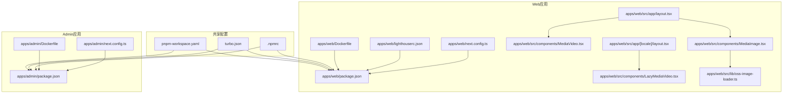
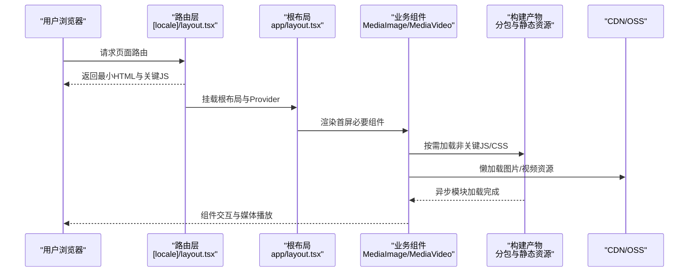
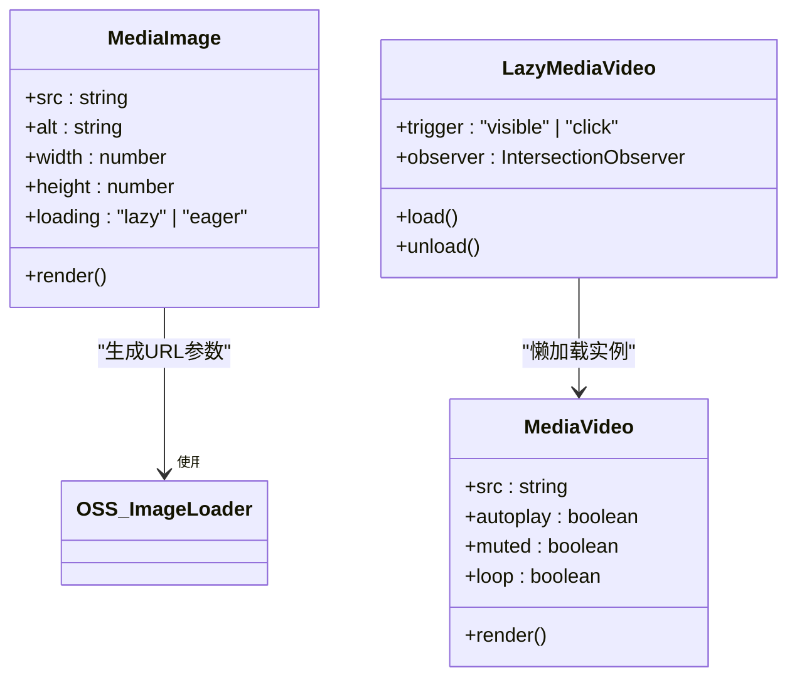
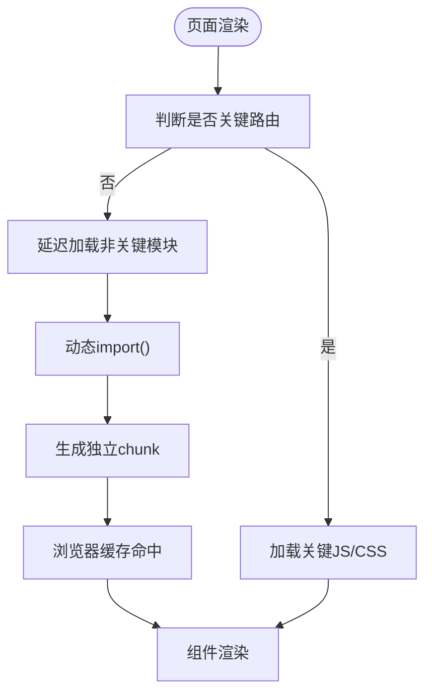
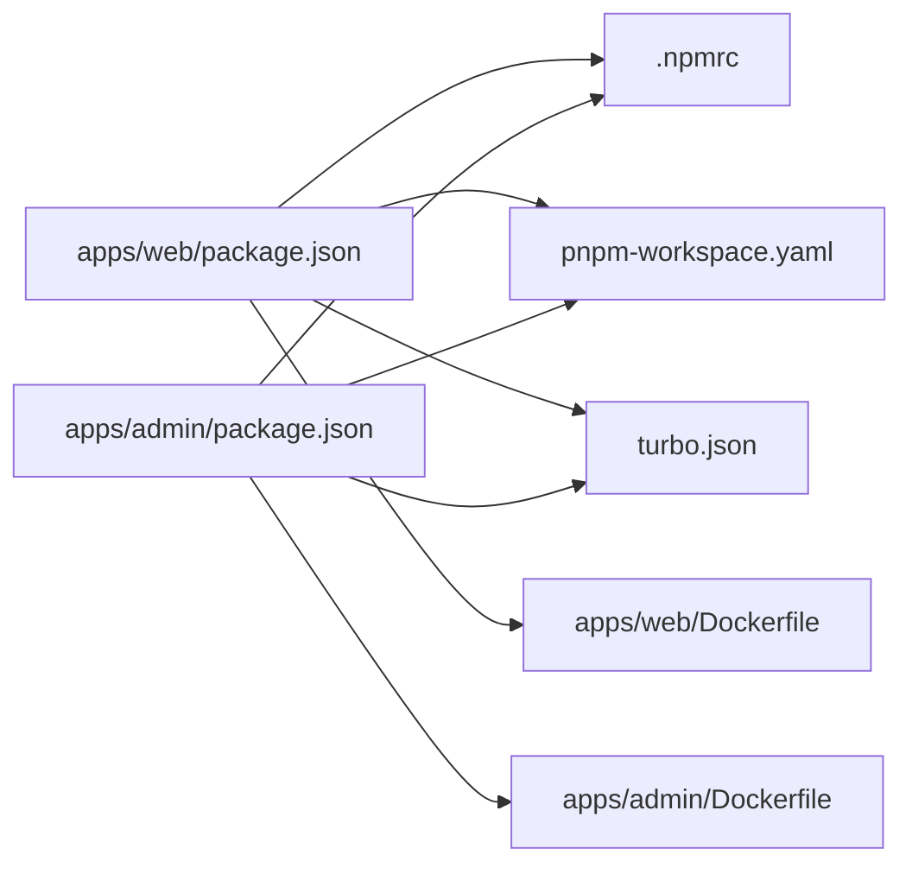

# 代码优化

<cite>
**本文引用的文件**   
- [apps/web/next.config.ts](file://apps/web/next.config.ts)
- [apps/admin/next.config.ts](file://apps/admin/next.config.ts)
- [apps/web/package.json](file://apps/web/package.json)
- [apps/admin/package.json](file://apps/admin/package.json)
- [apps/web/src/app/layout.tsx](file://apps/web/src/app/layout.tsx)
- [apps/web/src/app/[locale]/layout.tsx](file://apps/web/src/app/[locale]/layout.tsx)
- [apps/web/src/components/LazyMediaVideo.tsx](file://apps/web/src/components/LazyMediaVideo.tsx)
- [apps/web/src/components/MediaImage.tsx](file://apps/web/src/components/MediaImage.tsx)
- [apps/web/src/components/MediaVideo.tsx](file://apps/web/src/components/MediaVideo.tsx)
- [apps/web/src/lib/oss-image-loader.ts](file://apps/web/src/lib/oss-image-loader.ts)
- [apps/web/lighthouserc.json](file://apps/web/lighthouserc.json)
- [apps/web/Dockerfile](file://apps/web/Dockerfile)
- [apps/admin/Dockerfile](file://apps/admin/Dockerfile)
- [.npmrc](file://.npmrc)
- [turbo.json](file://turbo.json)
- [pnpm-workspace.yaml](file://pnpm-workspace.yaml)
</cite>

## 目录
1. [简介](#简介)
2. [项目结构](#项目结构)
3. [核心组件](#核心组件)
4. [架构总览](#架构总览)
5. [详细组件分析](#详细组件分析)
6. [依赖分析](#依赖分析)
7. [性能考虑](#性能考虑)
8. [故障排查指南](#故障排查指南)
9. [结论](#结论)
10. [附录](#附录)

## 简介
本文件面向Next.js应用（web与admin）的代码优化实践，围绕以下目标展开：
- 代码分割策略：组件级、路由级与第三方库的按需加载
- 动态导入与懒加载：在运行时按需引入重型模块与UI组件
- Tree Shaking与Bundle分析：构建期无用代码剔除与产物体积分析
- TypeScript编译优化：增量编译、类型检查与构建缓存
- 开发环境性能调优：热更新、并行构建与缓存加速
- 内存泄漏检测：前端资源清理与事件监听生命周期管理

## 项目结构
本项目采用多应用（apps/web、apps/admin）+ 包仓库（packages/*）的Monorepo组织方式。Next.js应用位于各自apps目录下，分别拥有独立的配置文件与依赖。

图表来源
- [apps/web/next.config.ts](file://apps/web/next.config.ts)
- [apps/admin/next.config.ts](file://apps/admin/next.config.ts)
- [apps/web/package.json](file://apps/web/package.json)
- [apps/admin/package.json](file://apps/admin/package.json)
- [apps/web/src/app/layout.tsx](file://apps/web/src/app/layout.tsx)
- [apps/web/src/app/[locale]/layout.tsx](file://apps/web/src/app/[locale]/layout.tsx)
- [apps/web/src/components/MediaImage.tsx](file://apps/web/src/components/MediaImage.tsx)
- [apps/web/src/components/MediaVideo.tsx](file://apps/web/src/components/MediaVideo.tsx)
- [apps/web/src/components/LazyMediaVideo.tsx](file://apps/web/src/components/LazyMediaVideo.tsx)
- [apps/web/src/lib/oss-image-loader.ts](file://apps/web/src/lib/oss-image-loader.ts)
- [apps/web/lighthouserc.json](file://apps/web/lighthouserc.json)
- [apps/web/Dockerfile](file://apps/web/Dockerfile)
- [apps/admin/Dockerfile](file://apps/admin/Dockerfile)
- [.npmrc](file://.npmrc)
- [turbo.json](file://turbo.json)
- [pnpm-workspace.yaml](file://pnpm-workspace.yaml)

章节来源
- [apps/web/next.config.ts](file://apps/web/next.config.ts)
- [apps/admin/next.config.ts](file://apps/admin/next.config.ts)
- [apps/web/package.json](file://apps/web/package.json)
- [apps/admin/package.json](file://apps/admin/package.json)
- [apps/web/src/app/layout.tsx](file://apps/web/src/app/layout.tsx)
- [apps/web/src/app/[locale]/layout.tsx](file://apps/web/src/app/[locale]/layout.tsx)
- [apps/web/src/components/MediaImage.tsx](file://apps/web/src/components/MediaImage.tsx)
- [apps/web/src/components/MediaVideo.tsx](file://apps/web/src/components/MediaVideo.tsx)
- [apps/web/src/components/LazyMediaVideo.tsx](file://apps/web/src/components/LazyMediaVideo.tsx)
- [apps/web/src/lib/oss-image-loader.ts](file://apps/web/src/lib/oss-image-loader.ts)
- [apps/web/lighthouserc.json](file://apps/web/lighthouserc.json)
- [apps/web/Dockerfile](file://apps/web/Dockerfile)
- [apps/admin/Dockerfile](file://apps/admin/Dockerfile)
- [.npmrc](file://.npmrc)
- [turbo.json](file://turbo.json)
- [pnpm-workspace.yaml](file://pnpm-workspace.yaml)

## 核心组件
- Next.js配置层：通过next.config.ts对Webpack/Rspack进行打包优化，包括代码分割、外部化、图片处理、压缩等。
- 应用布局层：根布局与国际化布局负责全局Provider与首屏关键资源注入。
- 媒体组件层：图片与视频组件实现懒加载、占位图、按需渲染与CDN优化。
- 构建工具链：pnpm工作区、Turbo、Docker镜像与Lighthouse CI共同保障构建与性能度量。

章节来源
- [apps/web/next.config.ts](file://apps/web/next.config.ts)
- [apps/admin/next.config.ts](file://apps/admin/next.config.ts)
- [apps/web/src/app/layout.tsx](file://apps/web/src/app/layout.tsx)
- [apps/web/src/app/[locale]/layout.tsx](file://apps/web/src/app/[locale]/layout.tsx)
- [apps/web/src/components/MediaImage.tsx](file://apps/web/src/components/MediaImage.tsx)
- [apps/web/src/components/MediaVideo.tsx](file://apps/web/src/components/MediaVideo.tsx)
- [apps/web/src/components/LazyMediaVideo.tsx](file://apps/web/src/components/LazyMediaVideo.tsx)

## 架构总览
下图展示从页面到组件再到资源加载的整体流程，体现路由级与组件级的代码分割与懒加载协同。

图表来源
- [apps/web/src/app/[locale]/layout.tsx](file://apps/web/src/app/[locale]/layout.tsx)
- [apps/web/src/app/layout.tsx](file://apps/web/src/app/layout.tsx)
- [apps/web/src/components/MediaImage.tsx](file://apps/web/src/components/MediaImage.tsx)
- [apps/web/src/components/MediaVideo.tsx](file://apps/web/src/components/MediaVideo.tsx)
- [apps/web/src/components/LazyMediaVideo.tsx](file://apps/web/src/components/LazyMediaVideo.tsx)

## 详细组件分析

### 组件级代码分割与懒加载
- MediaImage：结合OSS图片处理器实现按需尺寸裁剪与延迟加载，避免首屏大图阻塞。
- MediaVideo：仅在进入视口或用户交互时加载播放器与媒体源，降低初始包体。
- LazyMediaVideo：封装IntersectionObserver或类似机制，确保视频组件在需要时才初始化。

图表来源
- [apps/web/src/components/MediaImage.tsx](file://apps/web/src/components/MediaImage.tsx)
- [apps/web/src/components/MediaVideo.tsx](file://apps/web/src/components/MediaVideo.tsx)
- [apps/web/src/components/LazyMediaVideo.tsx](file://apps/web/src/components/LazyMediaVideo.tsx)
- [apps/web/src/lib/oss-image-loader.ts](file://apps/web/src/lib/oss-image-loader.ts)

章节来源
- [apps/web/src/components/MediaImage.tsx](file://apps/web/src/components/MediaImage.tsx)
- [apps/web/src/components/MediaVideo.tsx](file://apps/web/src/components/MediaVideo.tsx)
- [apps/web/src/components/LazyMediaVideo.tsx](file://apps/web/src/components/LazyMediaVideo.tsx)
- [apps/web/src/lib/oss-image-loader.ts](file://apps/web/src/lib/oss-image-loader.ts)

### 路由级代码分割与动态导入
- 路由级分割：Next.js默认按路由拆分chunk，配合App Router的页面级组件可进一步细化。
- 动态导入：对重型图表、编辑器、第三方SDK等使用动态import()，减少首屏负载。
- 预取与优先级：对可能访问的路由启用prefetch，对非关键资源设置低优先级。

图表来源
- [apps/web/src/app/[locale]/layout.tsx](file://apps/web/src/app/[locale]/layout.tsx)
- [apps/web/src/app/layout.tsx](file://apps/web/src/app/layout.tsx)

章节来源
- [apps/web/src/app/[locale]/layout.tsx](file://apps/web/src/app/[locale]/layout.tsx)
- [apps/web/src/app/layout.tsx](file://apps/web/src/app/layout.tsx)

### 第三方库的按需加载
- 大体积库（如富文本、图表、地图）通过动态导入与条件加载，避免常驻内存。
- 图标与样式按需引入，避免全量CSS与字体加载。
- 将平台相关或仅服务端使用的库标记为external，减小客户端包体。

章节来源
- [apps/web/next.config.ts](file://apps/web/next.config.ts)
- [apps/admin/next.config.ts](file://apps/admin/next.config.ts)

### Tree Shaking与Bundle分析
- Tree Shaking：确保ESM导出与纯函数式组件，避免副作用污染；在配置中开启压缩与死代码消除。
- Bundle分析：使用内置或第三方工具（如webpack-bundle-analyzer）定期分析产物大小与依赖关系。
- 图片与字体优化：通过Next.js内置优化与CDN参数控制，减少传输体积。

章节来源
- [apps/web/next.config.ts](file://apps/web/next.config.ts)
- [apps/admin/next.config.ts](file://apps/admin/next.config.ts)
- [apps/web/package.json](file://apps/web/package.json)
- [apps/admin/package.json](file://apps/admin/package.json)

### TypeScript编译优化
- 启用incremental与tsBuildInfo缓存，缩短冷启动与重建时间。
- 分离类型声明与运行时代码，减少客户端包体。
- 严格模式与路径映射提升类型安全与开发体验。

章节来源
- [apps/web/tsconfig.json](file://apps/web/tsconfig.json)
- [apps/admin/tsconfig.json](file://apps/admin/tsconfig.json)
- [tsconfig.base.json](file://tsconfig.base.json)
- [turbo.json](file://turbo.json)

### 构建缓存与开发环境调优
- pnpm工作区与Turbo：并行执行任务，复用构建缓存，加速CI与本地开发。
- Docker镜像分层：基础镜像与依赖层分离，提高拉取与构建效率。
- 开发服务器：启用HMR、SourceMap与调试端口，提升迭代速度。

章节来源
- [pnpm-workspace.yaml](file://pnpm-workspace.yaml)
- [turbo.json](file://turbo.json)
- [apps/web/Dockerfile](file://apps/web/Dockerfile)
- [apps/admin/Dockerfile](file://apps/admin/Dockerfile)
- [.npmrc](file://.npmrc)

## 依赖分析
下图展示应用与构建工具的依赖关系，突出缓存与并行构建的关键节点。

图表来源
- [apps/web/package.json](file://apps/web/package.json)
- [apps/admin/package.json](file://apps/admin/package.json)
- [.npmrc](file://.npmrc)
- [pnpm-workspace.yaml](file://pnpm-workspace.yaml)
- [turbo.json](file://turbo.json)
- [apps/web/Dockerfile](file://apps/web/Dockerfile)
- [apps/admin/Dockerfile](file://apps/admin/Dockerfile)

章节来源
- [apps/web/package.json](file://apps/web/package.json)
- [apps/admin/package.json](file://apps/admin/package.json)
- [.npmrc](file://.npmrc)
- [pnpm-workspace.yaml](file://pnpm-workspace.yaml)
- [turbo.json](file://turbo.json)
- [apps/web/Dockerfile](file://apps/web/Dockerfile)
- [apps/admin/Dockerfile](file://apps/admin/Dockerfile)

## 性能考虑
- 首屏优化：关键CSS内联、关键JS优先加载、图片懒加载与占位图。
- 网络优化：HTTP/2、CDN缓存、ETag与缓存失效策略。
- 内存管理：及时释放事件监听、取消未完成的请求、避免闭包引用长生命周期对象。
- 监控与分析：集成Lighthouse CI与性能指标上报，持续追踪回归。

章节来源
- [apps/web/lighthouserc.json](file://apps/web/lighthouserc.json)
- [apps/web/src/components/LazyMediaVideo.tsx](file://apps/web/src/components/LazyMediaVideo.tsx)
- [apps/web/src/components/MediaImage.tsx](file://apps/web/src/components/MediaImage.tsx)

## 故障排查指南
- 构建失败：检查Node版本、pnpm缓存与依赖锁定文件一致性。
- 包体过大：使用Bundle分析定位大依赖，替换或按需加载。
- 内存泄漏：排查定时器、事件监听与WebSocket连接未清理。
- 缓存问题：清除构建缓存与浏览器缓存，验证CDN缓存策略。

章节来源
- [apps/web/Dockerfile](file://apps/web/Dockerfile)
- [apps/admin/Dockerfile](file://apps/admin/Dockerfile)
- [.npmrc](file://.npmrc)
- [turbo.json](file://turbo.json)

## 结论
通过路由级与组件级的代码分割、动态导入与懒加载，结合Tree Shaking、构建缓存与性能监控，可在保证功能完整性的同时显著降低首屏负载与内存占用。建议持续使用Bundle分析与Lighthouse进行度量与优化，形成闭环改进。

## 附录
- 最佳实践清单：
  - 将重型模块拆分为动态导入并设置加载优先级
  - 使用图片与媒体懒加载，结合CDN参数优化
  - 启用TypeScript增量编译与构建缓存
  - 使用pnpm与Turbo并行构建，减少CI耗时
  - 定期运行Bundle分析与Lighthouse，跟踪性能指标