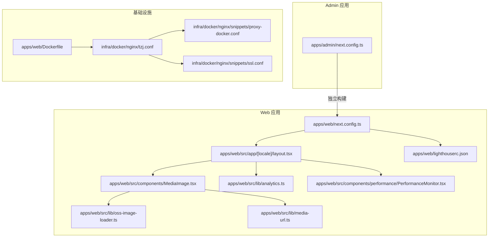
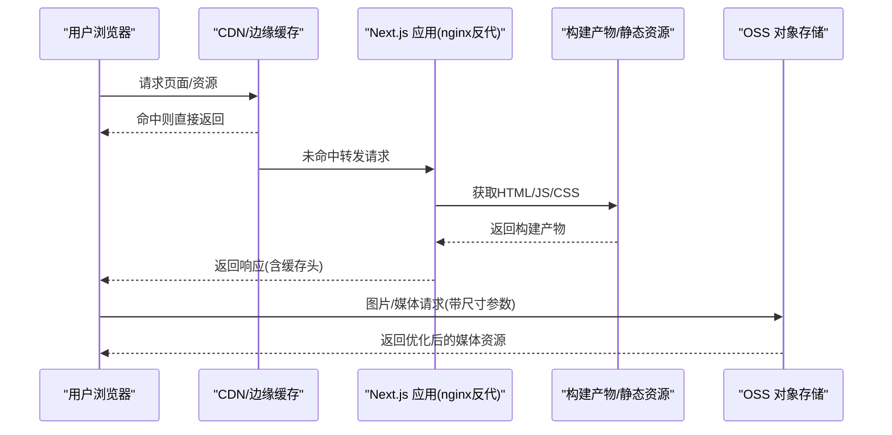
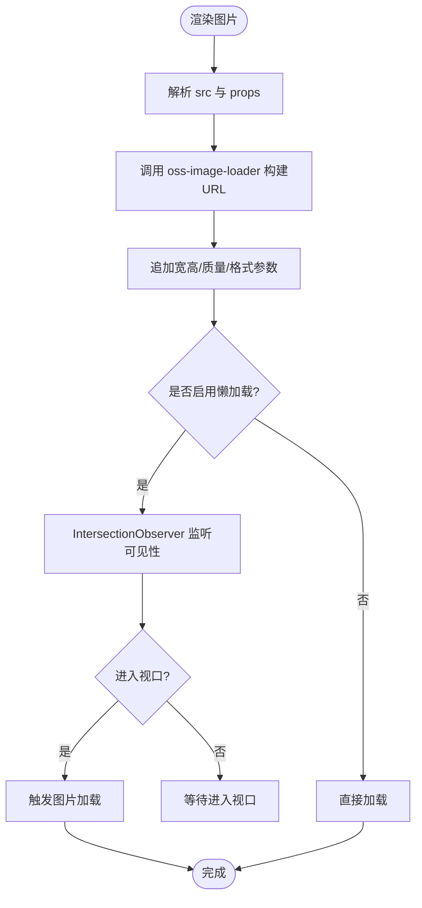
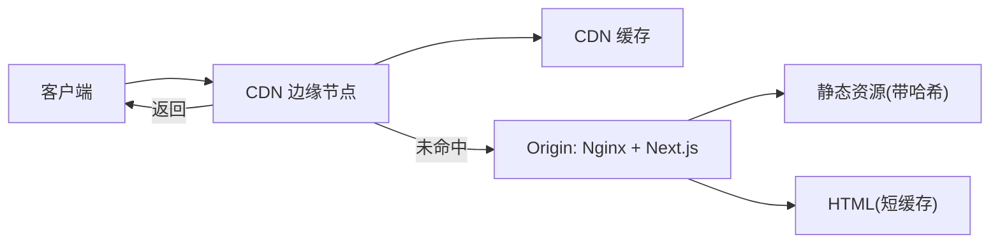
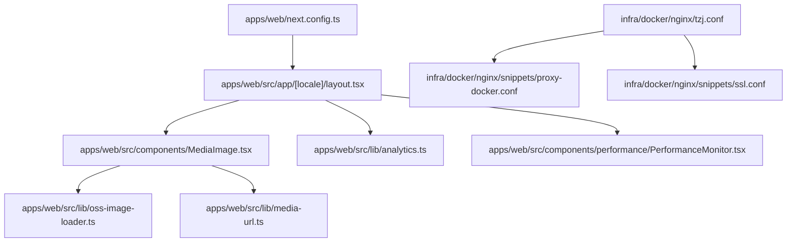

# 性能优化

<cite>
**本文引用的文件**   
- [apps/web/next.config.ts](file://apps/web/next.config.ts)
- [apps/web/lighthouserc.json](file://apps/web/lighthouserc.json)
- [apps/web/src/app/layout.tsx](file://apps/web/src/app/layout.tsx)
- [apps/web/src/app/[locale]/layout.tsx](file://apps/web/src/app/[locale]/layout.tsx)
- [apps/web/src/components/MediaImage.tsx](file://apps/web/src/components/MediaImage.tsx)
- [apps/web/src/lib/oss-image-loader.ts](file://apps/web/src/lib/oss-image-loader.ts)
- [apps/web/src/lib/media-url.ts](file://apps/web/src/lib/media-url.ts)
- [apps/web/src/lib/site-settings.ts](file://apps/web/src/lib/site-settings.ts)
- [apps/web/src/lib/analytics.ts](file://apps/web/src/lib/analytics.ts)
- [apps/web/src/components/performance/PerformanceMonitor.tsx](file://apps/web/src/components/performance/PerformanceMonitor.tsx)
- [apps/admin/next.config.ts](file://apps/admin/next.config.ts)
- [apps/web/Dockerfile](file://apps/web/Dockerfile)
- [infra/docker/nginx/tzj.conf](file://infra/docker/nginx/tzj.conf)
- [infra/docker/nginx/snippets/proxy-docker.conf](file://infra/docker/nginx/snippets/proxy-docker.conf)
- [infra/docker/nginx/snippets/ssl.conf](file://infra/docker/nginx/snippets/ssl.conf)
- [apps/web/package.json](file://apps/web/package.json)
</cite>

## 目录
1. [简介](#简介)
2. [项目结构](#项目结构)
3. [核心组件](#核心组件)
4. [架构总览](#架构总览)
5. [详细组件分析](#详细组件分析)
6. [依赖关系分析](#依赖关系分析)
7. [性能考量](#性能考量)
8. [故障排查指南](#故障排查指南)
9. [结论](#结论)
10. [附录](#附录)

## 简介
本文件面向Next.js前端应用（apps/web）与后台管理应用（apps/admin），系统性梳理并给出可落地的性能优化方案，覆盖代码分割、懒加载、静态生成与增量静态再生成、图片优化、字体加载、缓存策略与CDN配置，以及Lighthouse审计、Core Web Vitals优化、内存泄漏检测与性能监控。同时提供移动端性能优化、网络请求优化和资源压缩的最佳实践，帮助团队在开发、构建与部署全链路持续提升页面性能与用户体验。

## 项目结构
本项目采用多应用仓库结构：
- apps/web：面向用户的Next.js站点，包含国际化路由、媒体资源、搜索与分析等能力。
- apps/admin：后台管理系统，基于Next.js App Router。
- infra：Docker与Nginx等基础设施配置，用于本地与生产环境的代理、SSL与缓存策略。
- packages：共享包（主题、UI、类型等）。

图表来源
- [apps/web/next.config.ts](file://apps/web/next.config.ts)
- [apps/web/src/app/[locale]/layout.tsx](file://apps/web/src/app/[locale]/layout.tsx)
- [apps/web/src/components/MediaImage.tsx](file://apps/web/src/components/MediaImage.tsx)
- [apps/web/src/lib/oss-image-loader.ts](file://apps/web/src/lib/oss-image-loader.ts)
- [apps/web/src/lib/media-url.ts](file://apps/web/src/lib/media-url.ts)
- [apps/web/src/lib/analytics.ts](file://apps/web/src/lib/analytics.ts)
- [apps/web/src/components/performance/PerformanceMonitor.tsx](file://apps/web/src/components/performance/PerformanceMonitor.tsx)
- [apps/web/lighthouserc.json](file://apps/web/lighthouserc.json)
- [apps/admin/next.config.ts](file://apps/admin/next.config.ts)
- [infra/docker/nginx/tzj.conf](file://infra/docker/nginx/tzj.conf)
- [infra/docker/nginx/snippets/proxy-docker.conf](file://infra/docker/nginx/snippets/proxy-docker.conf)
- [infra/docker/nginx/snippets/ssl.conf](file://infra/docker/nginx/snippets/ssl.conf)
- [apps/web/Dockerfile](file://apps/web/Dockerfile)

章节来源
- [apps/web/next.config.ts](file://apps/web/next.config.ts)
- [apps/admin/next.config.ts](file://apps/admin/next.config.ts)
- [apps/web/Dockerfile](file://apps/web/Dockerfile)
- [infra/docker/nginx/tzj.conf](file://infra/docker/nginx/tzj.conf)

## 核心组件
- Next.js 构建与运行时优化：通过 next.config.ts 集中配置打包、图片、字体、缓存头、实验特性与输出格式，确保代码分割、Tree Shaking、预渲染与增量静态再生成生效。
- 图片与媒体优化：MediaImage 组件结合自定义 OSS 图片加载器，实现按需尺寸、WebP/AVIF、延迟加载与占位图，减少首屏体积与阻塞。
- 国际化与布局：[locale] 路由层统一注入语言包、元数据与全局样式，避免重复加载，提升CLS稳定性。
- 分析与监控：analytics 模块负责埋点上报；PerformanceMonitor 组件采集关键指标并上报，辅助定位性能问题。
- Lighthouse 审计：lighthouserc.json 定义CI中的自动化审计任务，持续回归性能基线。

章节来源
- [apps/web/next.config.ts](file://apps/web/next.config.ts)
- [apps/web/src/components/MediaImage.tsx](file://apps/web/src/components/MediaImage.tsx)
- [apps/web/src/lib/oss-image-loader.ts](file://apps/web/src/lib/oss-image-loader.ts)
- [apps/web/src/lib/media-url.ts](file://apps/web/src/lib/media-url.ts)
- [apps/web/src/app/[locale]/layout.tsx](file://apps/web/src/app/[locale]/layout.tsx)
- [apps/web/src/lib/analytics.ts](file://apps/web/src/lib/analytics.ts)
- [apps/web/src/components/performance/PerformanceMonitor.tsx](file://apps/web/src/components/performance/PerformanceMonitor.tsx)
- [apps/web/lighthouserc.json](file://apps/web/lighthouserc.json)

## 架构总览
下图展示从浏览器到后端与CDN的完整请求路径，以及Next.js在构建期与运行期的关键优化点。

图表来源
- [infra/docker/nginx/tzj.conf](file://infra/docker/nginx/tzj.conf)
- [apps/web/next.config.ts](file://apps/web/next.config.ts)
- [apps/web/src/lib/oss-image-loader.ts](file://apps/web/src/lib/oss-image-loader.ts)

## 详细组件分析

### 代码分割与懒加载
- 路由级代码分割：Next.js App Router 默认按路由进行分包，配合动态 import 可实现组件级懒加载，降低首屏体积。
- 第三方库按需引入：对重型库使用动态导入或仅引入所需子模块，避免打包进主包。
- 客户端交互组件：将非首屏交互逻辑放入 useEffect/useMemo/useCallback 中惰性执行，避免阻塞渲染。

最佳实践
- 使用 dynamic import 包裹大组件（如图表、富文本编辑器）。
- 将仅在用户交互时执行的逻辑放入事件处理器或条件分支。
- 利用 Suspense 与骨架屏提升感知性能。

章节来源
- [apps/web/next.config.ts](file://apps/web/next.config.ts)
- [apps/web/src/app/[locale]/layout.tsx](file://apps/web/src/app/[locale]/layout.tsx)

### 静态生成与增量静态再生成
- 静态生成（SSG）：适用于内容稳定、访问频繁的路由，构建期生成HTML，极大缩短TTFB。
- 增量静态再生成（ISR）：在构建后按需更新页面，兼顾实时性与性能。
- 建议：博客、产品页、新闻等适合SSG/ISR；强实时数据接口走服务端渲染或API。

章节来源
- [apps/web/next.config.ts](file://apps/web/next.config.ts)

### 图片优化与媒体处理
- MediaImage 组件封装了尺寸裁剪、格式转换、占位图与懒加载，结合自定义 loader 指向OSS，实现端到端优化。
- oss-image-loader 负责拼接URL参数（宽度、高度、质量、格式），减少带宽与解码成本。
- media-url 工具函数统一管理媒体域名与协议，便于切换CDN与HTTPS。

图表来源
- [apps/web/src/components/MediaImage.tsx](file://apps/web/src/components/MediaImage.tsx)
- [apps/web/src/lib/oss-image-loader.ts](file://apps/web/src/lib/oss-image-loader.ts)
- [apps/web/src/lib/media-url.ts](file://apps/web/src/lib/media-url.ts)

章节来源
- [apps/web/src/components/MediaImage.tsx](file://apps/web/src/components/MediaImage.tsx)
- [apps/web/src/lib/oss-image-loader.ts](file://apps/web/src/lib/oss-image-loader.ts)
- [apps/web/src/lib/media-url.ts](file://apps/web/src/lib/media-url.ts)

### 字体加载与排版稳定性
- 使用 font-display: swap 避免FOIT，优先显示文本再替换字体。
- 预加载关键字体，减少重排与闪烁。
- 限制字体变体数量，按需加载，减小体积。

章节来源
- [apps/web/src/app/[locale]/layout.tsx](file://apps/web/src/app/[locale]/layout.tsx)

### 缓存策略与CDN配置
- 构建产物哈希化，开启长期缓存；HTML短缓存+协商缓存保证更新及时。
- Nginx 配置静态资源强缓存、HTML协商缓存与Gzip/Brotli压缩。
- CDN 层缓存图片与静态资源，回源至Next.js服务。

图表来源
- [infra/docker/nginx/tzj.conf](file://infra/docker/nginx/tzj.conf)
- [infra/docker/nginx/snippets/proxy-docker.conf](file://infra/docker/nginx/snippets/proxy-docker.conf)
- [infra/docker/nginx/snippets/ssl.conf](file://infra/docker/nginx/snippets/ssl.conf)

章节来源
- [infra/docker/nginx/tzj.conf](file://infra/docker/nginx/tzj.conf)
- [infra/docker/nginx/snippets/proxy-docker.conf](file://infra/docker/nginx/snippets/proxy-docker.conf)
- [infra/docker/nginx/snippets/ssl.conf](file://infra/docker/nginx/snippets/ssl.conf)
- [apps/web/next.config.ts](file://apps/web/next.config.ts)

### Lighthouse 审计与Core Web Vitals优化
- lighthouserc.json 定义CI中的Lighthouse任务，定期产出报告，跟踪FCP、LCP、CLS、INP等指标。
- 针对CWV优化：
  - FCP/LCP：减少首屏阻塞资源、预加载关键资源、优化图片与字体。
  - CLS：为图片/视频设置宽高、固定广告位、避免动态插入内容。
  - INP：拆分长任务、避免主线程阻塞、使用Web Worker处理计算密集型任务。

章节来源
- [apps/web/lighthouserc.json](file://apps/web/lighthouserc.json)

### 内存泄漏检测与性能监控
- PerformanceMonitor 组件采集关键性能指标并上报，结合错误边界与日志，定位内存泄漏与卡顿。
- 建议：
  - 使用浏览器Performance面板与Memory快照对比前后状态。
  - 避免闭包持有大对象引用、清理定时器与事件监听器。
  - 对长列表使用虚拟滚动与分页。

章节来源
- [apps/web/src/components/performance/PerformanceMonitor.tsx](file://apps/web/src/components/performance/PerformanceMonitor.tsx)
- [apps/web/src/lib/analytics.ts](file://apps/web/src/lib/analytics.ts)

### 移动端性能优化
- 视口与触摸优化：禁用不必要的缩放，合理设置viewport，减少重绘。
- 资源瘦身：移动端仅加载必要脚本与样式，按需加载地图/图表。
- 网络优化：HTTP/2、Keep-Alive、合并小图标为雪碧图或SVG Sprite。

章节来源
- [apps/web/src/app/[locale]/layout.tsx](file://apps/web/src/app/[locale]/layout.tsx)
- [apps/web/next.config.ts](file://apps/web/next.config.ts)

### 网络请求优化
- 使用SWR/React Query等缓存策略，减少重复请求。
- 对大数据接口使用分页与增量更新。
- 合理设置超时与重试，提升弱网体验。

章节来源
- [apps/web/src/lib/analytics.ts](file://apps/web/src/lib/analytics.ts)

### 资源压缩与构建优化
- 启用Gzip/Brotli压缩，减少传输体积。
- 使用Tree Shaking与Code Splitting，剔除未用代码。
- 控制bundle大小，拆分vendor与业务代码。

章节来源
- [apps/web/next.config.ts](file://apps/web/next.config.ts)
- [apps/web/package.json](file://apps/web/package.json)

## 依赖关系分析
- 应用层依赖：web 与 admin 各自维护独立的 next.config.ts，互不耦合，便于并行构建与部署。
- 基础设施依赖：Nginx作为反向代理与静态资源服务器，CDN加速静态资源，OSS承载媒体文件。
- 运行时依赖：Next.js构建产物被Nginx托管，图片请求直连OSS，减少应用负载。

图表来源
- [apps/web/next.config.ts](file://apps/web/next.config.ts)
- [apps/web/src/app/[locale]/layout.tsx](file://apps/web/src/app/[locale]/layout.tsx)
- [apps/web/src/components/MediaImage.tsx](file://apps/web/src/components/MediaImage.tsx)
- [apps/web/src/lib/oss-image-loader.ts](file://apps/web/src/lib/oss-image-loader.ts)
- [apps/web/src/lib/media-url.ts](file://apps/web/src/lib/media-url.ts)
- [apps/web/src/lib/analytics.ts](file://apps/web/src/lib/analytics.ts)
- [apps/web/src/components/performance/PerformanceMonitor.tsx](file://apps/web/src/components/performance/PerformanceMonitor.tsx)
- [infra/docker/nginx/tzj.conf](file://infra/docker/nginx/tzj.conf)
- [infra/docker/nginx/snippets/proxy-docker.conf](file://infra/docker/nginx/snippets/proxy-docker.conf)
- [infra/docker/nginx/snippets/ssl.conf](file://infra/docker/nginx/snippets/ssl.conf)

章节来源
- [apps/web/next.config.ts](file://apps/web/next.config.ts)
- [apps/admin/next.config.ts](file://apps/admin/next.config.ts)
- [infra/docker/nginx/tzj.conf](file://infra/docker/nginx/tzj.conf)

## 性能考量
- 构建期优化：合理配置打包策略、启用增量构建、减少依赖体积。
- 运行期优化：减少主线程阻塞、合理使用缓存、避免重排重绘。
- 网络优化：启用HTTP/2、TLS优化、CDN缓存策略。
- 监控与度量：持续采集LCP、CLS、INP等指标，建立性能基线与告警。

## 故障排查指南
- 首屏慢：检查LCP相关资源（图片、字体、脚本），确认是否被阻塞。
- 抖动明显：检查CLS来源（图片无宽高、动态插入内容），添加占位与固定尺寸。
- 内存增长：使用Memory快照对比，定位未释放的监听器、定时器与大对象引用。
- 缓存失效：检查CDN与Nginx缓存头配置，确认版本号与哈希是否正确。

章节来源
- [apps/web/lighthouserc.json](file://apps/web/lighthouserc.json)
- [infra/docker/nginx/tzj.conf](file://infra/docker/nginx/tzj.conf)

## 结论
通过系统化的代码分割、懒加载、静态生成与ISR、图片优化、字体加载、缓存与CDN策略，以及完善的Lighthouse审计与性能监控，可在开发与生产全链路显著提升Next.js应用的加载速度与交互流畅度。建议将性能指标纳入CI/CD与发布门禁，持续迭代优化。

## 附录
- 常用命令：本地启动、构建产物分析、Lighthouse报告生成。
- 参考规范：W3C Core Web Vitals、Google PageSpeed Insights建议。
- 工具推荐：Webpack Bundle Analyzer、Chrome DevTools、Lighthouse CI。