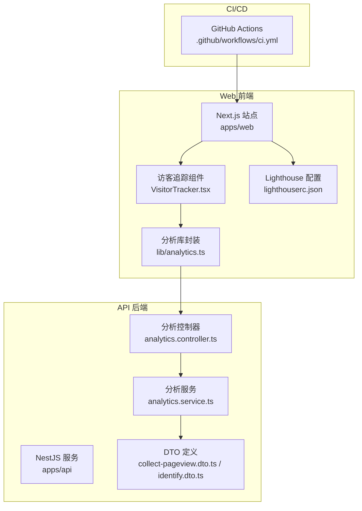
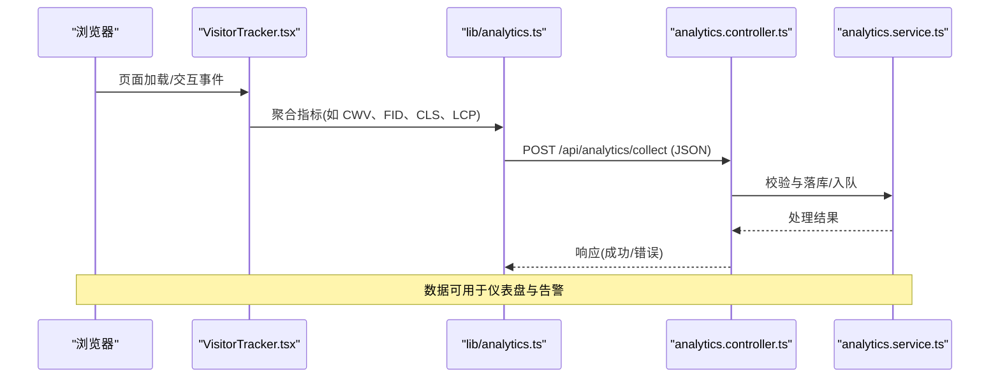
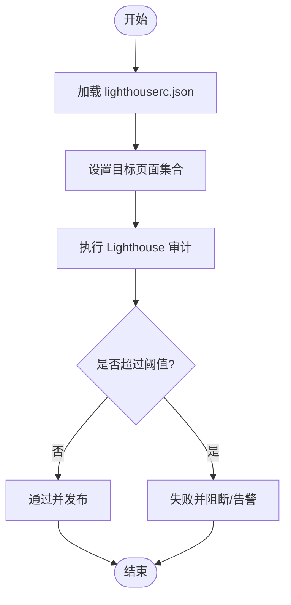
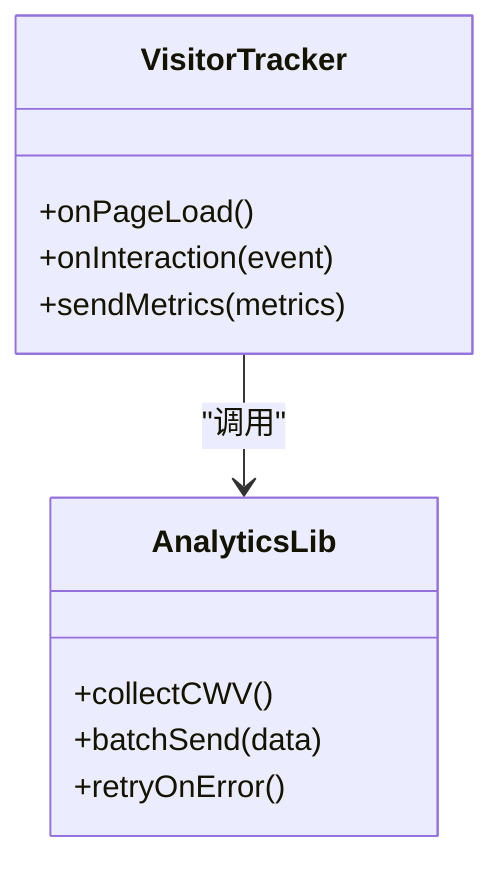
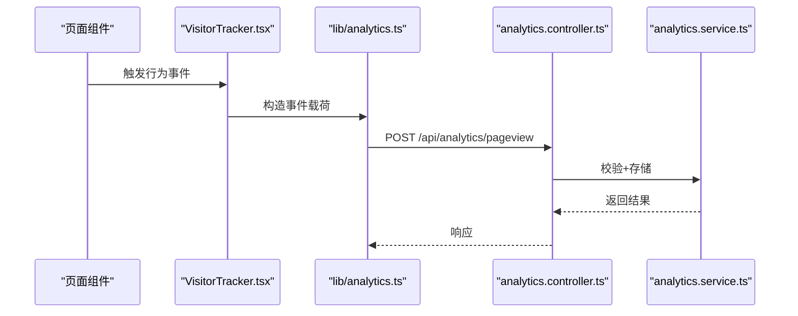
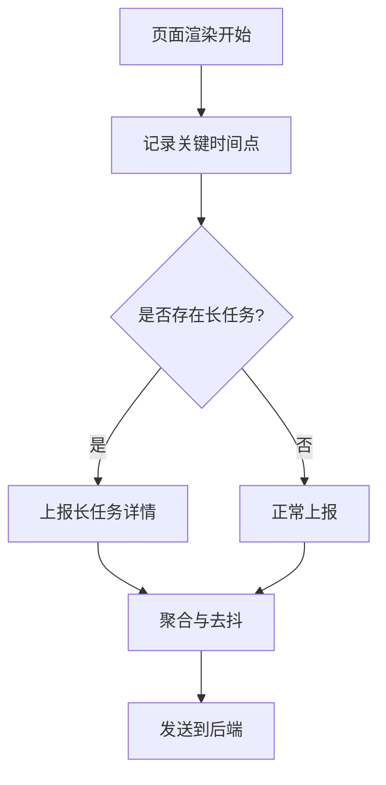
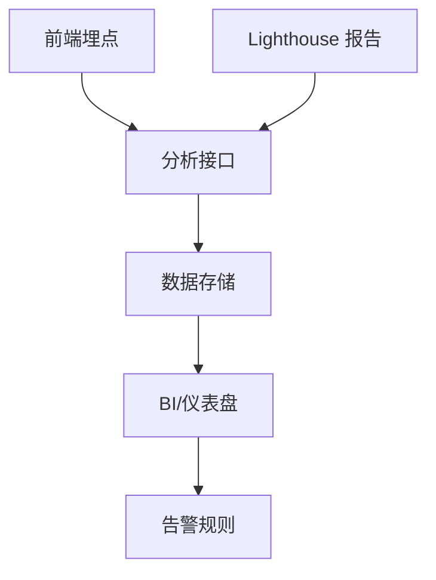
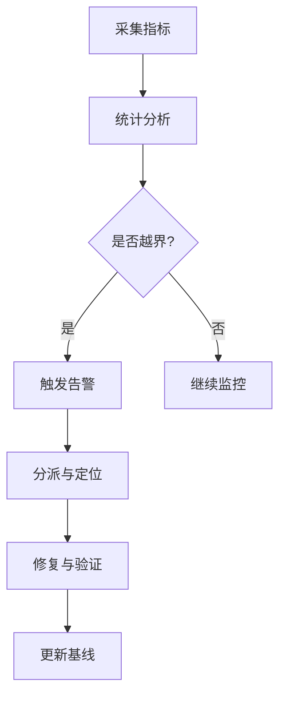
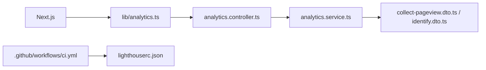

# 性能监控

<cite>
**本文引用的文件**   
- [lighthouserc.json](file://apps/web/lighthouserc.json)
- [VisitorTracker.tsx](file://apps/web/src/components/analytics/VisitorTracker.tsx)
- [analytics.ts](file://apps/web/src/lib/analytics.ts)
- [analytics.controller.ts](file://apps/api/src/analytics/analytics.controller.ts)
- [analytics.service.ts](file://apps/api/src/analytics/analytics.service.ts)
- [collect-pageview.dto.ts](file://apps/api/src/analytics/dto/collect-pageview.dto.ts)
- [identify.dto.ts](file://apps/api/src/analytics/dto/identify.dto.ts)
- [next.config.ts](file://apps/web/next.config.ts)
- [package.json](file://apps/web/package.json)
- [ci.yml](file://.github/workflows/ci.yml)
</cite>

## 目录
1. [简介](#简介)
2. [项目结构](#项目结构)
3. [核心组件](#核心组件)
4. [架构总览](#架构总览)
5. [详细组件分析](#详细组件分析)
6. [依赖关系分析](#依赖关系分析)
7. [性能考量](#性能考量)
8. [故障排查指南](#故障排查指南)
9. [结论](#结论)
10. [附录](#附录)

## 简介
本文件面向“性能监控”主题，围绕 Lighthouse 审计配置、Core Web Vitals（CWV）指标采集与可视化、页面加载时间分析与渲染性能监控进行系统化说明。文档覆盖前端埋点、后端收集接口、数据存储与展示、问题定位方法、监控告警与回归检测方案，帮助团队建立可度量、可预警、可追溯的性能治理体系。

## 项目结构
本项目为多应用仓库，性能监控相关能力主要分布在：
- 前端站点（Next.js）：集成 Lighthouse 配置、浏览器端性能指标上报与用户行为追踪
- API 服务（NestJS）：提供性能数据收集与分析接口，支撑数据持久化与查询
- CI/CD：在流水线中执行 Lighthouse 基准测试并输出报告

图表来源 
- [VisitorTracker.tsx](file://apps/web/src/components/analytics/VisitorTracker.tsx)
- [analytics.ts](file://apps/web/src/lib/analytics.ts)
- [lighthouserc.json](file://apps/web/lighthouserc.json)
- [analytics.controller.ts](file://apps/api/src/analytics/analytics.controller.ts)
- [analytics.service.ts](file://apps/api/src/analytics/analytics.service.ts)
- [collect-pageview.dto.ts](file://apps/api/src/analytics/dto/collect-pageview.dto.ts)
- [identify.dto.ts](file://apps/api/src/analytics/dto/identify.dto.ts)
- [ci.yml](file://.github/workflows/ci.yml)

章节来源
- [lighthouserc.json](file://apps/web/lighthouserc.json)
- [VisitorTracker.tsx](file://apps/web/src/components/analytics/VisitorTracker.tsx)
- [analytics.ts](file://apps/web/src/lib/analytics.ts)
- [analytics.controller.ts](file://apps/api/src/analytics/analytics.controller.ts)
- [analytics.service.ts](file://apps/api/src/analytics/analytics.service.ts)
- [collect-pageview.dto.ts](file://apps/api/src/analytics/dto/collect-pageview.dto.ts)
- [identify.dto.ts](file://apps/api/src/analytics/dto/identify.dto.ts)
- [next.config.ts](file://apps/web/next.config.ts)
- [package.json](file://apps/web/package.json)
- [ci.yml](file://.github/workflows/ci.yml)

## 核心组件
- Lighthouse 审计配置：用于在本地或 CI 环境中执行性能审计，统一阈值与目标页面集，保障发布前质量门禁。
- 前端性能埋点：基于 Web Vitals 与自定义事件，采集页面加载时间、交互延迟、渲染耗时等指标，并上报至后端。
- 后端分析接口：接收并校验性能数据，落库或写入消息队列，供仪表盘与报表消费。
- 用户行为追踪：记录关键交互路径与转化漏斗，辅助定位体验瓶颈。
- 基准测试与回归检测：在 CI 中运行 Lighthouse 并对比基线，失败则阻断合并或触发告警。

章节来源
- [lighthouserc.json](file://apps/web/lighthouserc.json)
- [VisitorTracker.tsx](file://apps/web/src/components/analytics/VisitorTracker.tsx)
- [analytics.ts](file://apps/web/src/lib/analytics.ts)
- [analytics.controller.ts](file://apps/api/src/analytics/analytics.controller.ts)
- [analytics.service.ts](file://apps/api/src/analytics/analytics.service.ts)
- [collect-pageview.dto.ts](file://apps/api/src/analytics/dto/collect-pageview.dto.ts)
- [identify.dto.ts](file://apps/api/src/analytics/dto/identify.dto.ts)
- [ci.yml](file://.github/workflows/ci.yml)

## 架构总览
下图展示了从浏览器到后端的性能数据采集链路，以及 Lighthouse 在 CI 中的集成方式。

图表来源 
- [VisitorTracker.tsx](file://apps/web/src/components/analytics/VisitorTracker.tsx)
- [analytics.ts](file://apps/web/src/lib/analytics.ts)
- [analytics.controller.ts](file://apps/api/src/analytics/analytics.controller.ts)
- [analytics.service.ts](file://apps/api/src/analytics/analytics.service.ts)

## 详细组件分析

### Lighthouse 审计配置与基准测试
- 配置文件位置与用途：集中管理 Lighthouse 的断网/在线模式、设备模拟、目标 URL 列表、阈值策略与报告输出路径。
- 基线管理与阈值：通过配置文件设定各指标的合格线，结合 CI 任务实现自动化门禁。
- 报告与归档：生成 HTML/JSON 报告，便于历史对比与趋势分析。

图表来源 
- [lighthouserc.json](file://apps/web/lighthouserc.json)
- [ci.yml](file://.github/workflows/ci.yml)

章节来源
- [lighthouserc.json](file://apps/web/lighthouserc.json)
- [ci.yml](file://.github/workflows/ci.yml)

### Core Web Vitals 指标监控
- 指标范围：LCP、FID、CLS、INP、TTFB 等，覆盖首字节、主内容绘制、交互延迟、累积布局偏移与输入响应。
- 采集时机：页面可见性变化、路由切换、关键交互事件回调时上报。
- 上报策略：批量上报、去抖与重试，降低对主线程影响。

图表来源 
- [VisitorTracker.tsx](file://apps/web/src/components/analytics/VisitorTracker.tsx)
- [analytics.ts](file://apps/web/src/lib/analytics.ts)

章节来源
- [VisitorTracker.tsx](file://apps/web/src/components/analytics/VisitorTracker.tsx)
- [analytics.ts](file://apps/web/src/lib/analytics.ts)

### 用户行为追踪与页面加载时间分析
- 行为事件：页面浏览、点击、滚动、表单提交、搜索、跳转等，附带上下文（页面、设备、网络环境）。
- 加载时间：记录导航开始、DNS/TLS、TTB、DOM 解析、资源加载、渲染完成等阶段时间。
- 数据模型：使用 DTO 明确字段约束，确保前后端一致。

图表来源 
- [VisitorTracker.tsx](file://apps/web/src/components/analytics/VisitorTracker.tsx)
- [analytics.ts](file://apps/web/src/lib/analytics.ts)
- [analytics.controller.ts](file://apps/api/src/analytics/analytics.controller.ts)
- [analytics.service.ts](file://apps/api/src/analytics/analytics.service.ts)
- [collect-pageview.dto.ts](file://apps/api/src/analytics/dto/collect-pageview.dto.ts)
- [identify.dto.ts](file://apps/api/src/analytics/dto/identify.dto.ts)

章节来源
- [VisitorTracker.tsx](file://apps/web/src/components/analytics/VisitorTracker.tsx)
- [analytics.ts](file://apps/web/src/lib/analytics.ts)
- [analytics.controller.ts](file://apps/api/src/analytics/analytics.controller.ts)
- [analytics.service.ts](file://apps/api/src/analytics/analytics.service.ts)
- [collect-pageview.dto.ts](file://apps/api/src/analytics/dto/collect-pageview.dto.ts)
- [identify.dto.ts](file://apps/api/src/analytics/dto/identify.dto.ts)

### 渲染性能监控
- 监控点：长任务、阻塞脚本、图片解码、样式计算、合成层重排等。
- 采集方式：PerformanceObserver、requestIdleCallback、自定义标记（mark/measure）。
- 上报粒度：按页面/路由维度聚合，支持分时段统计与异常峰值识别。

[本节为概念性流程，不直接映射具体代码文件]

### 性能数据的收集、存储与可视化
- 收集：前端埋点与 Lighthouse 报告双通道；后端接口负责校验与入库。
- 存储：建议采用时序数据库或分析型数据库，支持高吞吐写入与多维查询。
- 可视化：仪表盘展示趋势、分布、Top 慢页面与热点事件；支持钻取与对比。

[本节为概念性流程，不直接映射具体代码文件]

### 性能问题的定位方法
- 分层定位：网络层（请求大小、缓存命中）、渲染层（长任务、重排重绘）、业务层（复杂逻辑、第三方脚本）。
- 工具链：浏览器开发者工具、Performance Panel、Lighthouse、RUM 数据回溯。
- 关联分析：将 RUM 指标与 Lighthouse 报告、错误日志、用户会话串联，快速复现与归因。

[本节为方法论说明，不直接映射具体代码文件]

### 监控告警与性能回归检测
- 告警策略：基于阈值（如 LCP > 2.5s、CLS > 0.1）与同比/环比异常波动触发通知。
- 回归检测：CI 中对比基线，若指标劣化则阻断合并或创建缺陷单。
- 闭环管理：告警→定位→修复→验证→复盘，形成持续改进机制。

[本节为概念性流程，不直接映射具体代码文件]

## 依赖关系分析
- 前端依赖：Next.js 运行时、Web Vitals 库、自定义 analytics 封装。
- 后端依赖：NestJS 模块、DTO 校验、数据库/消息队列驱动。
- CI 依赖：Node/Lighthouse 环境、工作流配置。

图表来源 
- [analytics.ts](file://apps/web/src/lib/analytics.ts)
- [analytics.controller.ts](file://apps/api/src/analytics/analytics.controller.ts)
- [analytics.service.ts](file://apps/api/src/analytics/analytics.service.ts)
- [collect-pageview.dto.ts](file://apps/api/src/analytics/dto/collect-pageview.dto.ts)
- [identify.dto.ts](file://apps/api/src/analytics/dto/identify.dto.ts)
- [ci.yml](file://.github/workflows/ci.yml)
- [lighthouserc.json](file://apps/web/lighthouserc.json)

章节来源
- [analytics.ts](file://apps/web/src/lib/analytics.ts)
- [analytics.controller.ts](file://apps/api/src/analytics/analytics.controller.ts)
- [analytics.service.ts](file://apps/api/src/analytics/analytics.service.ts)
- [collect-pageview.dto.ts](file://apps/api/src/analytics/dto/collect-pageview.dto.ts)
- [identify.dto.ts](file://apps/api/src/analytics/dto/identify.dto.ts)
- [ci.yml](file://.github/workflows/ci.yml)
- [lighthouserc.json](file://apps/web/lighthouserc.json)

## 性能考量
- 采样与去抖：避免高频上报导致主线程抖动，合理批量化与节流。
- 传输优化：压缩 payload、选择合适协议（HTTP/2 或 gRPC），减少带宽占用。
- 降级策略：在网络差或低性能设备上关闭非关键指标采集。
- 存储与查询：按时间分区、冷热分离，提升查询效率与成本可控。
- 可观测性：增加结构化日志与 Trace ID，便于端到端追踪。

[本节为通用指导，不直接映射具体代码文件]

## 故障排查指南
- 常见问题：
  - 指标未上报：检查埋点初始化、网络拦截、跨域与隐私策略。
  - 数据不一致：核对 DTO 字段与序列化逻辑，确保前后端契约一致。
  - 报告缺失：确认 Lighthouse 配置与环境变量，检查 CI 任务输出。
- 定位步骤：
  - 前端：打开开发者工具，查看 Performance/Network/Console，确认事件触发与上报。
  - 后端：检查接口日志、错误堆栈、数据库写入情况。
  - CI：查看工作流日志与 Lighthouse 报告产物。
- 恢复措施：
  - 临时降级采集、回滚变更、补充容错与重试逻辑。

章节来源
- [analytics.controller.ts](file://apps/api/src/analytics/analytics.controller.ts)
- [analytics.service.ts](file://apps/api/src/analytics/analytics.service.ts)
- [collect-pageview.dto.ts](file://apps/api/src/analytics/dto/collect-pageview.dto.ts)
- [identify.dto.ts](file://apps/api/src/analytics/dto/identify.dto.ts)
- [lighthouserc.json](file://apps/web/lighthouserc.json)
- [ci.yml](file://.github/workflows/ci.yml)

## 结论
通过统一的 Lighthouse 配置、完善的 CWV 埋点与后端分析接口，配合 CI 基准测试与告警机制，可实现从采集、存储、可视化到回归检测的全链路性能治理。建议持续完善指标口径、优化上报策略、强化数据质量与可观测性，形成稳定的性能基线与改进闭环。

## 附录
- 指标口径建议：明确 LCP/FID/CLS/INP/TTFB 的计算边界与采样窗口。
- 告警阈值参考：根据业务 SLA 制定分级阈值与通知渠道。
- 基线维护：定期更新基线版本，保留历史报告以便趋势分析。
- 扩展方向：接入 APM、分布式追踪、错误率与可用性指标，构建综合性能看板。

[本节为补充信息，不直接映射具体代码文件]