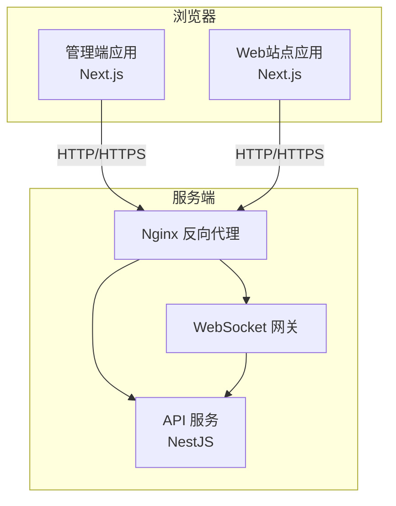
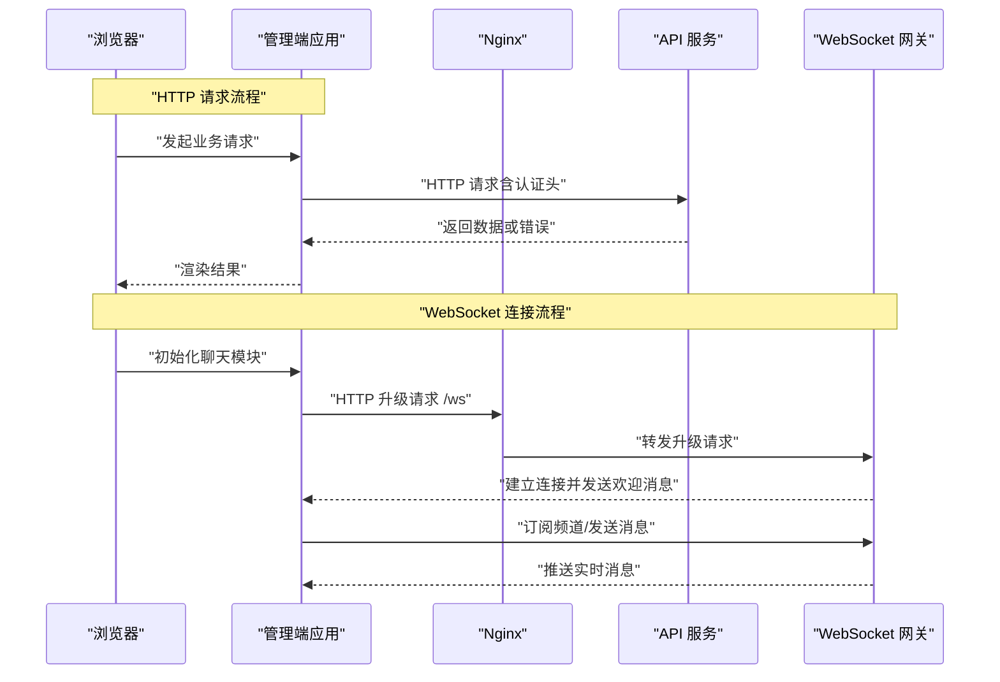
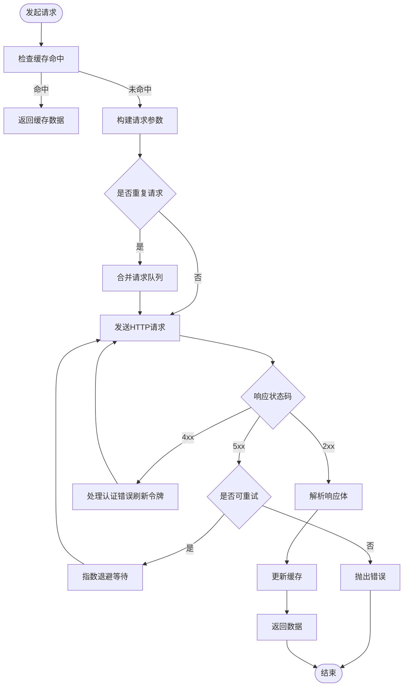
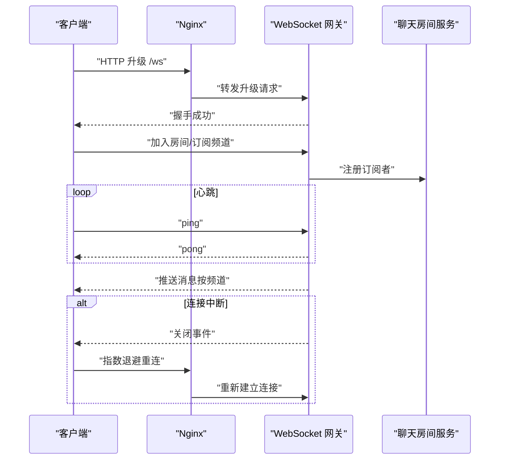
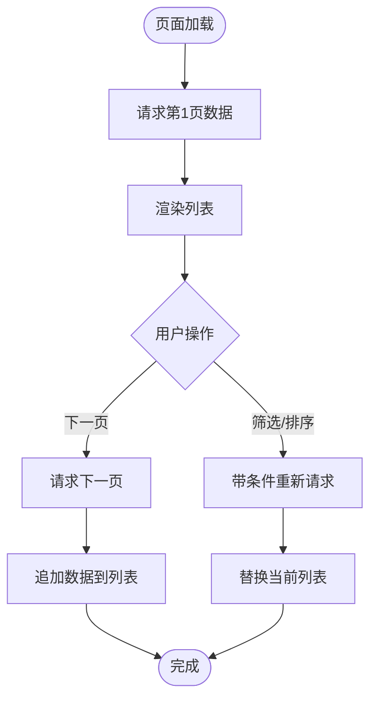
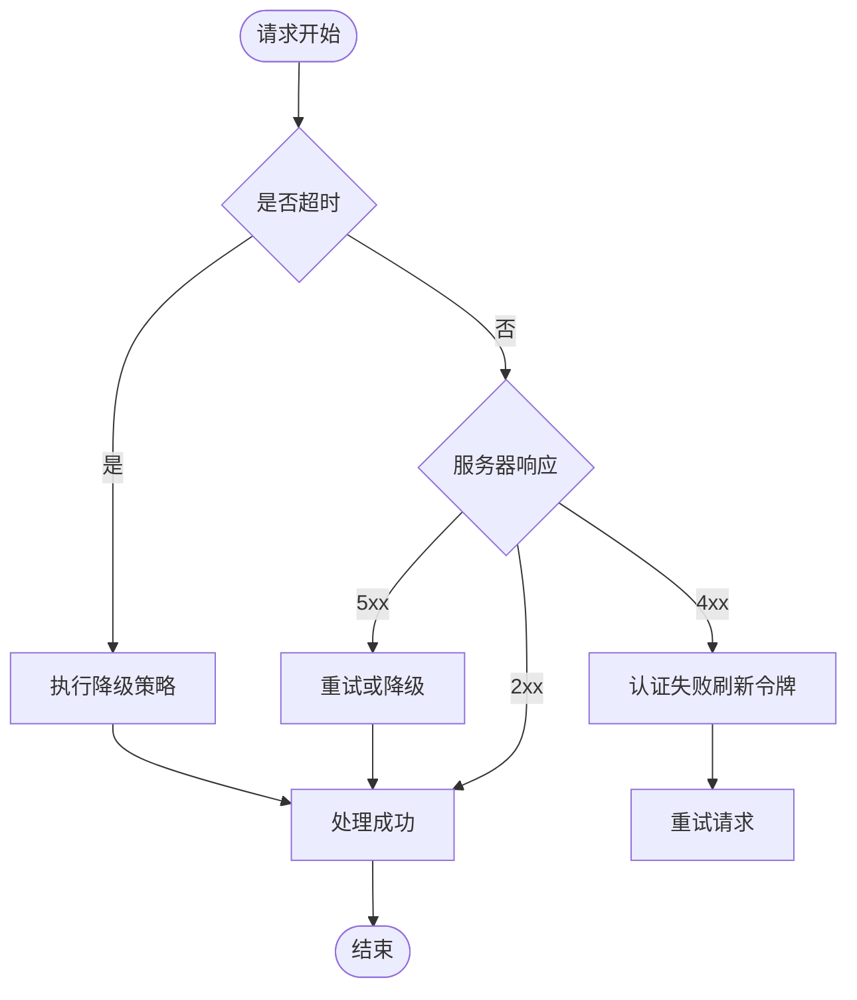
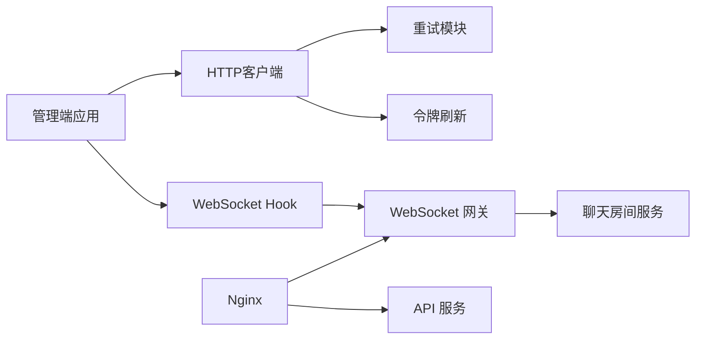

# 网络优化

<cite>
**本文引用的文件**   
- [apiClient.ts](file://apps/admin/src/lib/apiClient.ts)
- [fetch-retry.ts](file://apps/admin/src/lib/fetch-retry.ts)
- [tokenRefresh.ts](file://apps/admin/src/lib/tokenRefresh.ts)
- [useChatSocket.ts](file://apps/admin/src/features/chat/useChatSocket.ts)
- [chat.gateway.ts](file://apps/api/src/support/chat.gateway.ts)
- [chat-room.service.ts](file://apps/api/src/support/chat-room.service.ts)
- [ContentPagination.tsx](file://apps/web/src/components/content/ContentPagination.tsx)
- [api.ts](file://apps/web/src/lib/api.ts)
- [next.config.ts](file://apps/admin/next.config.ts)
- [nginx/tzj.conf](file://infra/docker/nginx/tzj.conf)
</cite>

## 目录
1. [简介](#简介)
2. [项目结构](#项目结构)
3. [核心组件](#核心组件)
4. [架构总览](#架构总览)
5. [详细组件分析](#详细组件分析)
6. [依赖分析](#依赖分析)
7. [性能考虑](#性能考虑)
8. [故障排查指南](#故障排查指南)
9. [结论](#结论)
10. [附录](#附录)

## 简介
本文件围绕网络优化展开，覆盖HTTP请求优化（合并、缓存、重试）、WebSocket连接与实时推送、网络状态监控、API接口设计优化（分页与增量更新）、错误处理、超时控制与降级策略。文档基于仓库中的前端客户端、后端网关与服务实现进行系统性梳理，并提供可视化图示帮助理解数据流与调用链。

## 项目结构
本项目为多应用仓库，包含管理端（admin）、Web站点（web）与API服务（api），并通过Nginx进行反向代理与静态资源托管。网络相关的关键位置如下：
- 管理端（Next.js）：统一的HTTP客户端封装、重试机制、令牌刷新、WebSocket Hook等
- Web端（Next.js）：内容列表分页组件、通用API工具
- API服务（NestJS）：WebSocket网关、聊天房间服务、健康检查等
- 基础设施（Nginx）：反向代理配置、WebSocket升级、超时与缓冲参数

**图表来源** 
- [next.config.ts](file://apps/admin/next.config.ts)
- [nginx/tzj.conf](file://infra/docker/nginx/tzj.conf)

**章节来源**
- [next.config.ts](file://apps/admin/next.config.ts)
- [nginx/tzj.conf](file://infra/docker/nginx/tzj.conf)

## 核心组件
- HTTP客户端与重试：统一封装的HTTP客户端、可插拔的重试逻辑、令牌自动刷新
- WebSocket连接：长连接建立、心跳保活、断线重连、消息订阅与发布
- 分页与增量更新：服务端分页接口、客户端分页组件、增量数据拉取策略
- 错误处理与降级：全局异常过滤、网络错误分类、降级与回退策略
- 网络状态监控：连接状态、延迟与失败率统计、关键指标上报

**章节来源**
- [apiClient.ts](file://apps/admin/src/lib/apiClient.ts)
- [fetch-retry.ts](file://apps/admin/src/lib/fetch-retry.ts)
- [tokenRefresh.ts](file://apps/admin/src/lib/tokenRefresh.ts)
- [useChatSocket.ts](file://apps/admin/src/features/chat/useChatSocket.ts)
- [chat.gateway.ts](file://apps/api/src/support/chat.gateway.ts)
- [chat-room.service.ts](file://apps/api/src/support/chat-room.service.ts)
- [ContentPagination.tsx](file://apps/web/src/components/content/ContentPagination.tsx)
- [api.ts](file://apps/web/src/lib/api.ts)

## 架构总览
下图展示了从浏览器到后端的完整网络路径，包括HTTP请求与WebSocket连接的典型流程。

**图表来源** 
- [next.config.ts](file://apps/admin/next.config.ts)
- [nginx/tzj.conf](file://infra/docker/nginx/tzj.conf)
- [chat.gateway.ts](file://apps/api/src/support/chat.gateway.ts)

## 详细组件分析

### HTTP请求优化：合并、缓存与重试
- 请求合并：在高频触发场景下（如搜索建议、滚动加载），通过防抖/节流与请求去重减少重复请求；对相同参数的并发请求进行合并，避免多次网络往返。
- 缓存策略：对读多写少的接口采用内存缓存与HTTP缓存（ETag/Last-Modified）结合；对列表类数据使用版本化键名，配合失效策略保证一致性。
- 重试机制：针对瞬时性错误（网络抖动、5xx）实施指数退避重试；对幂等GET请求允许有限次重试，非幂等POST默认不重试或仅在用户明确操作时重试。

**图表来源** 
- [apiClient.ts](file://apps/admin/src/lib/apiClient.ts)
- [fetch-retry.ts](file://apps/admin/src/lib/fetch-retry.ts)
- [tokenRefresh.ts](file://apps/admin/src/lib/tokenRefresh.ts)

**章节来源**
- [apiClient.ts](file://apps/admin/src/lib/apiClient.ts)
- [fetch-retry.ts](file://apps/admin/src/lib/fetch-retry.ts)
- [tokenRefresh.ts](file://apps/admin/src/lib/tokenRefresh.ts)

### WebSocket连接优化与实时数据推送
- 连接建立：通过Nginx将/ws路径升级到WebSocket协议；客户端在连接成功后订阅频道并维护会话ID。
- 心跳与保活：客户端定期发送ping，服务端回复pong；若连续N次无响应则判定连接断开并触发重连。
- 断线重连：采用指数退避与最大重试次数限制；重连前清理未确认消息，确保消息顺序与一致性。
- 消息分发：按频道路由消息，支持广播与点对点推送；对大消息进行分片与压缩。

**图表来源** 
- [nginx/tzj.conf](file://infra/docker/nginx/tzj.conf)
- [chat.gateway.ts](file://apps/api/src/support/chat.gateway.ts)
- [chat-room.service.ts](file://apps/api/src/support/chat-room.service.ts)
- [useChatSocket.ts](file://apps/admin/src/features/chat/useChatSocket.ts)

**章节来源**
- [useChatSocket.ts](file://apps/admin/src/features/chat/useChatSocket.ts)
- [chat.gateway.ts](file://apps/api/src/support/chat.gateway.ts)
- [chat-room.service.ts](file://apps/api/src/support/chat-room.service.ts)
- [nginx/tzj.conf](file://infra/docker/nginx/tzj.conf)

### API接口设计优化：分页与增量更新
- 分页设计：统一使用page/size或cursor-based分页；服务端返回total、hasMore等元信息，客户端提供分页控件。
- 增量更新：对列表数据采用版本号或时间戳字段，客户端仅拉取变更部分；对热点数据使用短轮询+增量合并策略。
- 接口规范：RESTful命名、统一错误码、幂等性标注；对大数据量接口启用流式响应或分块传输。

**图表来源** 
- [ContentPagination.tsx](file://apps/web/src/components/content/ContentPagination.tsx)
- [api.ts](file://apps/web/src/lib/api.ts)

**章节来源**
- [ContentPagination.tsx](file://apps/web/src/components/content/ContentPagination.tsx)
- [api.ts](file://apps/web/src/lib/api.ts)

### 网络错误处理、超时控制与降级策略
- 错误分类：区分网络错误（超时、DNS失败）、服务端错误（4xx/5xx）、业务错误（校验失败）；对每类错误提供用户友好提示。
- 超时控制：设置合理的请求超时与读取超时；对长耗时任务使用独立超时通道，避免阻塞主流程。
- 降级策略：当后端不可用时返回缓存数据或空数据；对非关键功能（如推荐、广告）进行开关控制与快速失败。

**章节来源**
- [fetch-retry.ts](file://apps/admin/src/lib/fetch-retry.ts)
- [tokenRefresh.ts](file://apps/admin/src/lib/tokenRefresh.ts)

## 依赖分析
- 前端依赖：HTTP客户端封装依赖重试模块与令牌刷新模块；WebSocket Hook依赖网关与服务层。
- 后端依赖：WebSocket网关依赖房间服务与消息存储；NestJS控制器依赖Prisma数据库访问。
- 基础设施依赖：Nginx负责反向代理、SSL终止与WebSocket升级；Redis用于会话与缓存（如有）。

**图表来源** 
- [apiClient.ts](file://apps/admin/src/lib/apiClient.ts)
- [fetch-retry.ts](file://apps/admin/src/lib/fetch-retry.ts)
- [tokenRefresh.ts](file://apps/admin/src/lib/tokenRefresh.ts)
- [useChatSocket.ts](file://apps/admin/src/features/chat/useChatSocket.ts)
- [chat.gateway.ts](file://apps/api/src/support/chat.gateway.ts)
- [chat-room.service.ts](file://apps/api/src/support/chat-room.service.ts)
- [nginx/tzj.conf](file://infra/docker/nginx/tzj.conf)

**章节来源**
- [apiClient.ts](file://apps/admin/src/lib/apiClient.ts)
- [fetch-retry.ts](file://apps/admin/src/lib/fetch-retry.ts)
- [tokenRefresh.ts](file://apps/admin/src/lib/tokenRefresh.ts)
- [useChatSocket.ts](file://apps/admin/src/features/chat/useChatSocket.ts)
- [chat.gateway.ts](file://apps/api/src/support/chat.gateway.ts)
- [chat-room.service.ts](file://apps/api/src/support/chat-room.service.ts)
- [nginx/tzj.conf](file://infra/docker/nginx/tzj.conf)

## 性能考虑
- 请求合并与去重：在高并发场景下显著降低网络开销，提升首屏渲染速度。
- 缓存命中率：合理设置TTL与失效策略，平衡一致性与性能。
- WebSocket优化：减少心跳频率与消息体积，使用二进制协议或压缩提升吞吐。
- 分页与懒加载：按需加载数据，避免一次性加载大量数据导致卡顿。
- 超时与重试：避免雪崩效应，设置合理的重试上限与退避策略。

[本节为通用指导，无需特定文件引用]

## 故障排查指南
- 常见问题定位：
  - 网络连接失败：检查DNS、防火墙、Nginx配置与证书
  - WebSocket断连：查看心跳日志、重连次数与错误码
  - 请求超时：调整超时阈值、检查后端处理耗时与数据库锁
  - 缓存不一致：清理缓存键、验证ETag/Last-Modified逻辑
- 调试工具：
  - 浏览器开发者工具的网络面板与WebSocket面板
  - 后端日志与链路追踪（Request ID）
  - 性能监控与错误上报（Sentry等）

**章节来源**
- [fetch-retry.ts](file://apps/admin/src/lib/fetch-retry.ts)
- [useChatSocket.ts](file://apps/admin/src/features/chat/useChatSocket.ts)

## 结论
通过统一的HTTP客户端封装、智能重试与缓存策略、健壮的WebSocket连接管理与分页增量更新机制，项目在用户体验与系统稳定性方面得到显著提升。建议持续监控关键指标（成功率、延迟、重连率），并根据业务变化动态调优参数。

[本节为总结性内容，无需特定文件引用]

## 附录
- 最佳实践清单：
  - 所有外部请求必须设置超时与重试上限
  - 敏感操作需幂等性保障与用户确认
  - WebSocket连接需具备心跳与自动重连
  - 分页接口需提供完整的元信息与边界条件处理
  - 错误信息需对用户友好且便于定位问题

[本节为补充说明，无需特定文件引用]