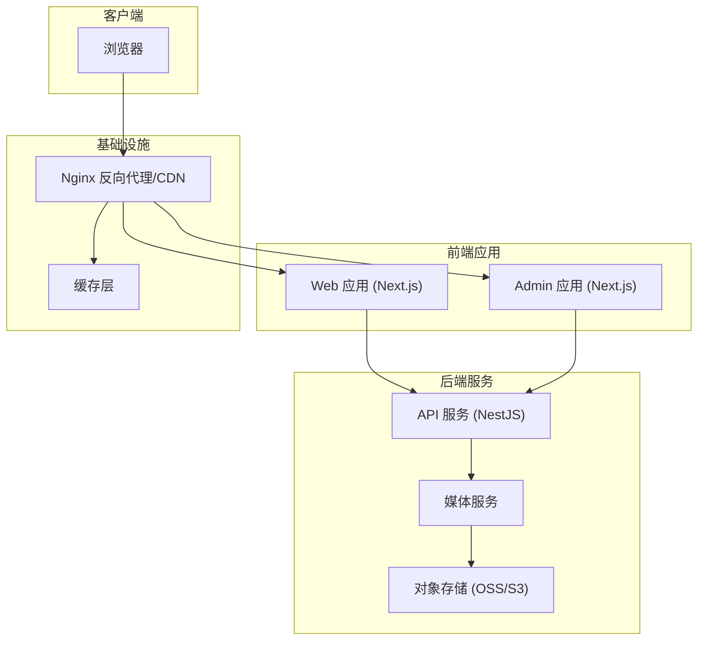
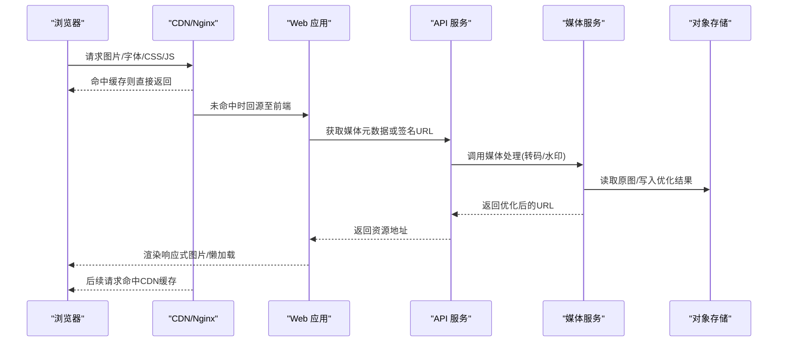
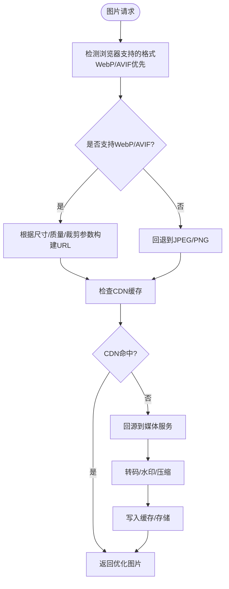
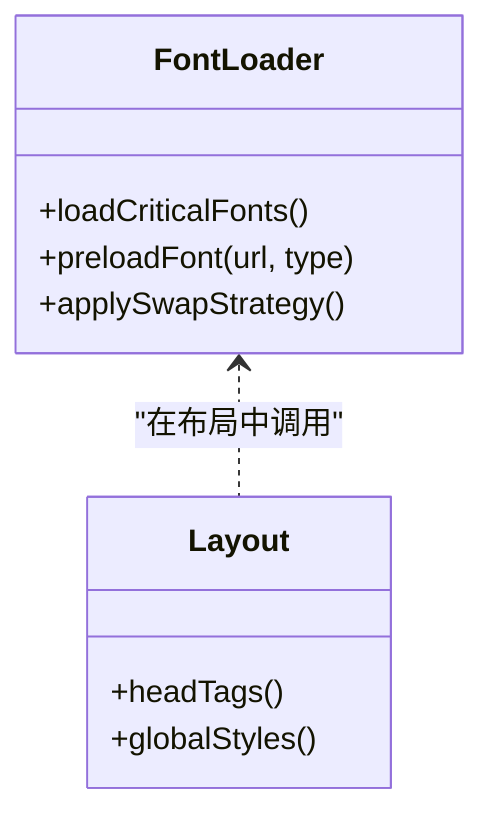
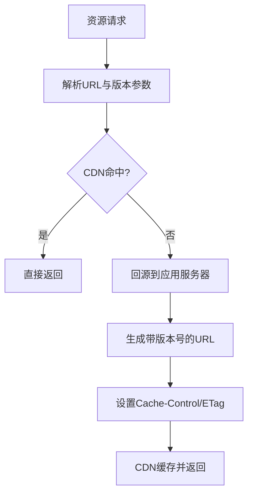
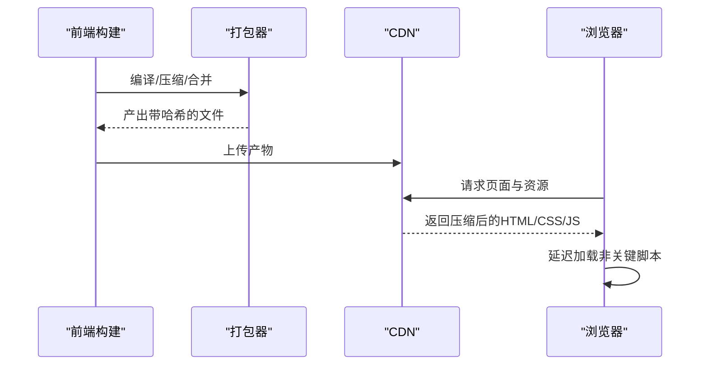
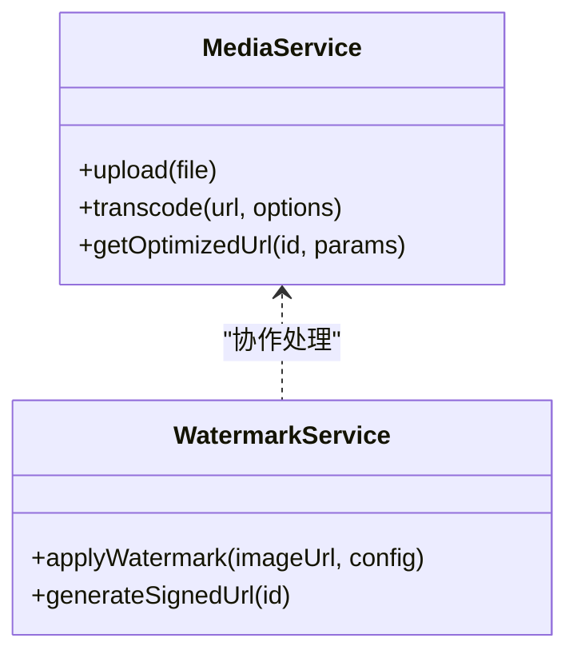
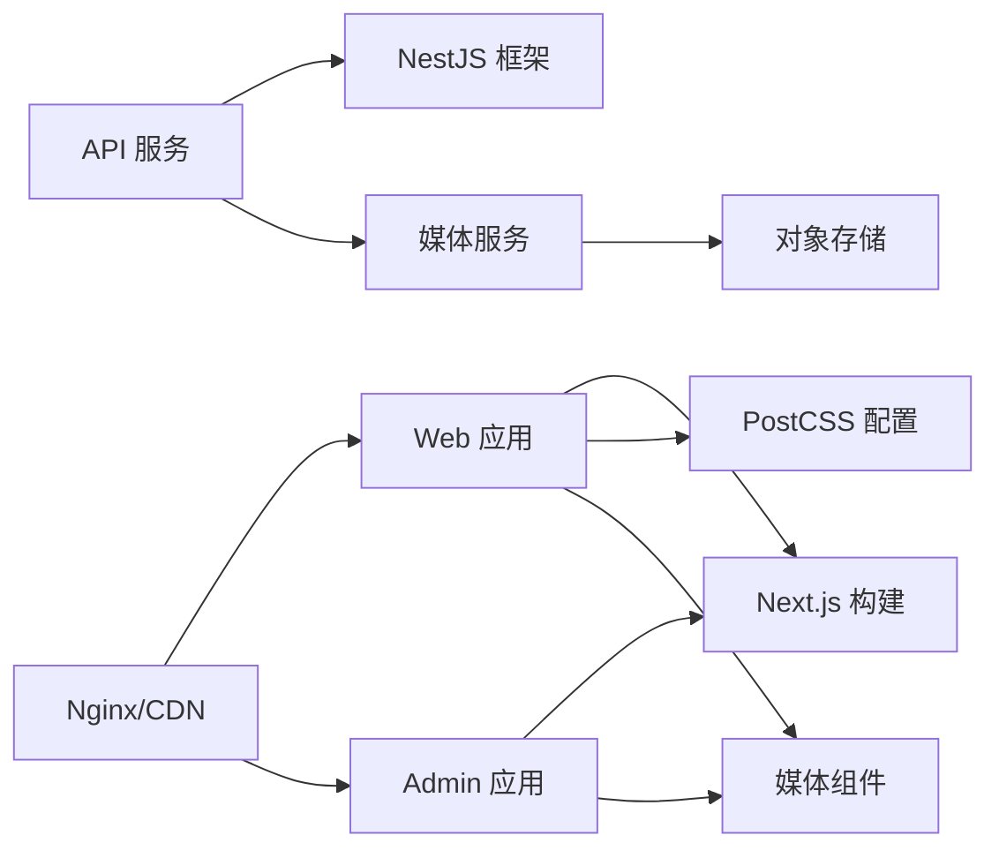

# 资源优化

<cite>
**本文引用的文件**   
- [apps/web/next.config.ts](file://apps/web/next.config.ts)
- [apps/web/src/lib/media-url.ts](file://apps/web/src/lib/media-url.ts)
- [apps/web/src/lib/oss-image-loader.ts](file://apps/web/src/lib/oss-image-loader.ts)
- [apps/web/src/components/MediaImage.tsx](file://apps/web/src/components/MediaImage.tsx)
- [apps/web/src/components/LazyMediaVideo.tsx](file://apps/web/src/components/LazyMediaVideo.tsx)
- [apps/web/src/app/[locale]/layout.tsx](file://apps/web/src/app/[locale]/layout.tsx)
- [apps/web/src/app/layout.tsx](file://apps/web/src/app/layout.tsx)
- [apps/web/public/browser-support.js](file://apps/web/public/browser-support.js)
- [apps/web/lighthouserc.json](file://apps/web/lighthouserc.json)
- [apps/admin/next.config.ts](file://apps/admin/next.config.ts)
- [apps/api/src/media/media.service.ts](file://apps/api/src/media/media.service.ts)
- [apps/api/src/media/watermark.service.ts](file://apps/api/src/media/watermark.service.ts)
- [infra/docker/nginx/tzj.conf](file://infra/docker/nginx/tzj.conf)
- [infra/docker/nginx/templates/tzj.conf.template](file://infra/docker/nginx/templates/tzj.conf.template)
- [infra/docker/nginx/snippets/proxy-docker.conf](file://infra/docker/nginx/snippets/proxy-docker.conf)
- [infra/docker/nginx/snippets/ssl.conf](file://infra/docker/nginx/snippets/ssl.conf)
- [packages/theme/package.json](file://packages/theme/package.json)
- [apps/web/postcss.config.mjs](file://apps/web/postcss.config.mjs)
</cite>

## 目录
1. [简介](#简介)
2. [项目结构](#项目结构)
3. [核心组件](#核心组件)
4. [架构总览](#架构总览)
5. [详细组件分析](#详细组件分析)
6. [依赖关系分析](#依赖关系分析)
7. [性能考量](#性能考量)
8. [故障排查指南](#故障排查指南)
9. [结论](#结论)
10. [附录](#附录)

## 简介
本文件聚焦于网站与后台应用的静态资源优化实践，覆盖图片优化（WebP转换、响应式图片、懒加载）、字体优化（子集化与预加载）、静态资源版本管理、CDN与缓存策略，以及CSS与JavaScript的压缩、合并与延迟加载。文档基于仓库中的Next.js配置、媒体处理服务、Nginx部署配置与前端组件实现进行系统化梳理，并提供可视化架构图与流程图，帮助读者快速理解并落地优化方案。

## 项目结构
本项目采用多应用（web、admin、api）+ 基础设施（nginx、docker）的组织方式：
- web 应用：面向用户的站点，使用 Next.js 构建，包含图片与媒体组件、OSS 图片加载器、浏览器兼容性脚本等。
- admin 应用：管理后台，同样基于 Next.js，提供资源管理与媒体选择能力。
- api 服务：NestJS 后端，负责媒体上传、水印、存储与访问控制。
- infra：Nginx 反向代理、SSL、CDN 相关配置，以及 Docker 编排。

图表来源
- [apps/web/next.config.ts](file://apps/web/next.config.ts)
- [apps/admin/next.config.ts](file://apps/admin/next.config.ts)
- [apps/api/src/media/media.service.ts](file://apps/api/src/media/media.service.ts)
- [infra/docker/nginx/tzj.conf](file://infra/docker/nginx/tzj.conf)

章节来源
- [apps/web/next.config.ts](file://apps/web/next.config.ts)
- [apps/admin/next.config.ts](file://apps/admin/next.config.ts)
- [apps/api/src/media/media.service.ts](file://apps/api/src/media/media.service.ts)
- [infra/docker/nginx/tzj.conf](file://infra/docker/nginx/tzj.conf)

## 核心组件
- 图片与媒体组件：MediaImage、LazyMediaVideo，封装响应式图片、懒加载与占位图逻辑。
- OSS 图片加载器：oss-image-loader.ts，统一图片尺寸、格式与质量参数，支持 WebP/AVIF 输出。
- 媒体 URL 工具：media-url.ts，生成带版本与 CDN 前缀的资源路径。
- 布局与资源注入：app layout，集中引入全局样式、字体与关键脚本。
- API 媒体服务：media.service.ts、watermark.service.ts，负责上传、转码、水印与访问控制。
- Nginx 配置：tzj.conf 及其模板与片段，定义缓存头、压缩、Gzip/Brotli、HTTP/2 与 CDN 回源。

章节来源
- [apps/web/src/components/MediaImage.tsx](file://apps/web/src/components/MediaImage.tsx)
- [apps/web/src/components/LazyMediaVideo.tsx](file://apps/web/src/components/LazyMediaVideo.tsx)
- [apps/web/src/lib/oss-image-loader.ts](file://apps/web/src/lib/oss-image-loader.ts)
- [apps/web/src/lib/media-url.ts](file://apps/web/src/lib/media-url.ts)
- [apps/api/src/media/media.service.ts](file://apps/api/src/media/media.service.ts)
- [apps/api/src/media/watermark.service.ts](file://apps/api/src/media/watermark.service.ts)
- [infra/docker/nginx/tzj.conf](file://infra/docker/nginx/tzj.conf)

## 架构总览
下图展示从浏览器到存储的完整资源请求链路，包括图片优化、CDN 缓存与后端转码流程。

图表来源
- [apps/web/src/lib/oss-image-loader.ts](file://apps/web/src/lib/oss-image-loader.ts)
- [apps/web/src/components/MediaImage.tsx](file://apps/web/src/components/MediaImage.tsx)
- [apps/api/src/media/media.service.ts](file://apps/api/src/media/media.service.ts)
- [infra/docker/nginx/tzj.conf](file://infra/docker/nginx/tzj.conf)

## 详细组件分析

### 图片优化策略（WebP、响应式、懒加载）
- WebP/AVIF 转换：通过 oss-image-loader.ts 在请求时动态生成不同尺寸与格式的缩略图，优先返回 WebP/AVIF，自动降级到 JPEG/PNG。
- 响应式图片：MediaImage 组件结合 srcset/sizes 与 next/image 的 loader 机制，按设备像素密度与视口宽度加载合适分辨率。
- 懒加载：LazyMediaVideo 与 MediaImage 均启用懒加载，仅在进入视口时发起网络请求，降低首屏负载。
- 占位图与渐进式加载：为视频与图片设置占位图，提升感知性能；对大图启用渐进式解码。

图表来源
- [apps/web/src/lib/oss-image-loader.ts](file://apps/web/src/lib/oss-image-loader.ts)
- [apps/web/src/components/MediaImage.tsx](file://apps/web/src/components/MediaImage.tsx)
- [apps/api/src/media/media.service.ts](file://apps/api/src/media/media.service.ts)

章节来源
- [apps/web/src/lib/oss-image-loader.ts](file://apps/web/src/lib/oss-image-loader.ts)
- [apps/web/src/components/MediaImage.tsx](file://apps/web/src/components/MediaImage.tsx)
- [apps/web/src/components/LazyMediaVideo.tsx](file://apps/web/src/components/LazyMediaVideo.tsx)
- [apps/api/src/media/media.service.ts](file://apps/api/src/media/media.service.ts)

### 字体文件的优化加载、子集化与预加载
- 子集化：建议在生产构建阶段对字体进行子集化，仅保留所需字符集，减少体积。
- 预加载：在布局中通过 link rel="preload" 预加载关键字体，避免阻塞首屏渲染。
- 异步加载：非关键字体使用 loadFont 或 CSS font-display: swap 策略，避免 FOIT/FOUT。
- 缓存策略：字体文件设置长期缓存与强校验，配合版本号更新。

图表来源
- [apps/web/src/app/[locale]/layout.tsx](file://apps/web/src/app/[locale]/layout.tsx)
- [apps/web/src/app/layout.tsx](file://apps/web/src/app/layout.tsx)

章节来源
- [apps/web/src/app/[locale]/layout.tsx](file://apps/web/src/app/[locale]/layout.tsx)
- [apps/web/src/app/layout.tsx](file://apps/web/src/app/layout.tsx)

### 静态资源的版本管理、CDN配置与缓存策略
- 版本管理：通过 media-url.ts 为资源追加版本号或哈希，确保更新后强制刷新缓存。
- CDN 配置：Nginx 作为边缘节点，开启 HTTP/2、Gzip/Brotli 压缩，设置合理的 Cache-Control 与 ETag。
- 缓存策略：静态资源长缓存（如一年），内容变更通过文件名或查询参数触发失效；动态接口短缓存或无缓存。
- 安全与跨域：CORS 白名单、HTTPS 强制、HSTS 与安全头。

图表来源
- [apps/web/src/lib/media-url.ts](file://apps/web/src/lib/media-url.ts)
- [infra/docker/nginx/tzj.conf](file://infra/docker/nginx/tzj.conf)
- [infra/docker/nginx/templates/tzj.conf.template](file://infra/docker/nginx/templates/tzj.conf.template)
- [infra/docker/nginx/snippets/proxy-docker.conf](file://infra/docker/nginx/snippets/proxy-docker.conf)
- [infra/docker/nginx/snippets/ssl.conf](file://infra/docker/nginx/snippets/ssl.conf)

章节来源
- [apps/web/src/lib/media-url.ts](file://apps/web/src/lib/media-url.ts)
- [infra/docker/nginx/tzj.conf](file://infra/docker/nginx/tzj.conf)
- [infra/docker/nginx/templates/tzj.conf.template](file://infra/docker/nginx/templates/tzj.conf.template)
- [infra/docker/nginx/snippets/proxy-docker.conf](file://infra/docker/nginx/snippets/proxy-docker.conf)
- [infra/docker/nginx/snippets/ssl.conf](file://infra/docker/nginx/snippets/ssl.conf)

### CSS 与 JavaScript 的压缩、合并与延迟加载
- 压缩：Next.js 默认启用 Terser 与 CSS 压缩；PostCSS 可集成 autoprefixer、minify 插件。
- 合并：生产构建将模块打包合并，减少请求数；按需拆分代码（路由级与组件级）。
- 延迟加载：第三方脚本与重型组件使用动态 import 或 defer/async 属性，避免阻塞首屏。
- 浏览器兼容：通过 browser-support.js 提供 polyfill 与特性检测，按需加载。

图表来源
- [apps/web/postcss.config.mjs](file://apps/web/postcss.config.mjs)
- [apps/web/public/browser-support.js](file://apps/web/public/browser-support.js)
- [apps/web/next.config.ts](file://apps/web/next.config.ts)

章节来源
- [apps/web/postcss.config.mjs](file://apps/web/postcss.config.mjs)
- [apps/web/public/browser-support.js](file://apps/web/public/browser-support.js)
- [apps/web/next.config.ts](file://apps/web/next.config.ts)

### 媒体处理与水印服务
- 媒体服务：media.service.ts 负责上传、转码、格式转换与尺寸裁剪，返回优化后的URL。
- 水印服务：watermark.service.ts 在图片上叠加品牌水印，支持位置、透明度与尺寸自适应。
- 存储与访问：对接对象存储（OSS/S3），通过签名URL或CDN域名访问，保障安全与性能。

图表来源
- [apps/api/src/media/media.service.ts](file://apps/api/src/media/media.service.ts)
- [apps/api/src/media/watermark.service.ts](file://apps/api/src/media/watermark.service.ts)

章节来源
- [apps/api/src/media/media.service.ts](file://apps/api/src/media/media.service.ts)
- [apps/api/src/media/watermark.service.ts](file://apps/api/src/media/watermark.service.ts)

## 依赖关系分析
- 前端依赖：Next.js 构建系统、PostCSS、媒体组件与加载器。
- 后端依赖：NestJS 模块、媒体处理库、对象存储 SDK。
- 基础设施依赖：Nginx、CDN、Docker、SSL 证书管理。

图表来源
- [apps/web/next.config.ts](file://apps/web/next.config.ts)
- [apps/admin/next.config.ts](file://apps/admin/next.config.ts)
- [apps/web/postcss.config.mjs](file://apps/web/postcss.config.mjs)
- [apps/api/src/media/media.service.ts](file://apps/api/src/media/media.service.ts)
- [infra/docker/nginx/tzj.conf](file://infra/docker/nginx/tzj.conf)

章节来源
- [apps/web/next.config.ts](file://apps/web/next.config.ts)
- [apps/admin/next.config.ts](file://apps/admin/next.config.ts)
- [apps/web/postcss.config.mjs](file://apps/web/postcss.config.mjs)
- [apps/api/src/media/media.service.ts](file://apps/api/src/media/media.service.ts)
- [infra/docker/nginx/tzj.conf](file://infra/docker/nginx/tzj.conf)

## 性能考量
- 首屏优化：关键资源预加载、内联关键CSS、延迟加载非关键脚本与组件。
- 图片优化：优先 WebP/AVIF、按需尺寸、懒加载与占位图。
- 缓存策略：静态资源长缓存、动态接口短缓存、CDN 多级缓存。
- 构建优化：代码分割、Tree Shaking、压缩与去重。
- 监控与评估：使用 Lighthouse 与 lighthouserc.json 持续评估性能指标。

章节来源
- [apps/web/lighthouserc.json](file://apps/web/lighthouserc.json)

## 故障排查指南
- 图片无法显示：检查 oss-image-loader 参数是否正确、CDN 缓存是否生效、浏览器格式支持。
- 字体加载缓慢：确认 preload 标签与 font-display 策略、子集化是否成功、CDN 缓存头是否设置。
- 资源未压缩：验证 Nginx Gzip/Brotli 开关、MIME 类型、Content-Encoding 头。
- 缓存不生效：检查 Cache-Control、ETag、版本号与 CDN 配置一致性。
- 媒体上传失败：核对存储凭证、CORS 配置、权限与大小限制。

章节来源
- [apps/web/src/lib/oss-image-loader.ts](file://apps/web/src/lib/oss-image-loader.ts)
- [apps/web/src/lib/media-url.ts](file://apps/web/src/lib/media-url.ts)
- [infra/docker/nginx/tzj.conf](file://infra/docker/nginx/tzj.conf)
- [apps/api/src/media/media.service.ts](file://apps/api/src/media/media.service.ts)

## 结论
通过统一的图片加载器、媒体服务与 Nginx 缓存策略，项目在图片优化、字体加载、静态资源版本管理与CDN缓存方面形成了闭环。结合构建时的压缩与代码分割、运行时的懒加载与占位图，显著提升了首屏性能与用户体验。建议持续监控 Lighthouse 指标，并根据业务需求迭代优化策略。

## 附录
- 主题包依赖：packages/theme/package.json 定义了 UI 主题与样式依赖，影响 CSS 体积与加载顺序。
- 浏览器兼容性：public/browser-support.js 提供 polyfill 与特性检测，确保旧版浏览器可用。

章节来源
- [packages/theme/package.json](file://packages/theme/package.json)
- [apps/web/public/browser-support.js](file://apps/web/public/browser-support.js)