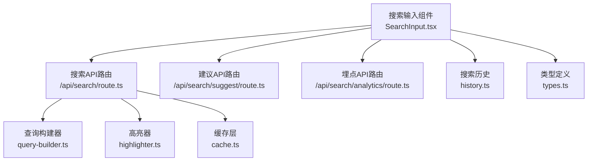
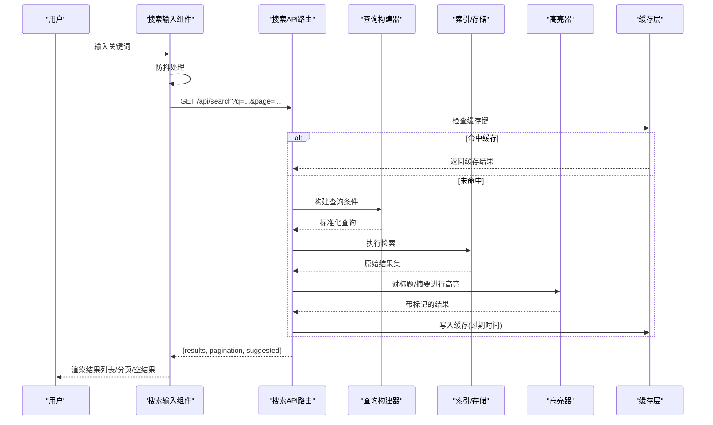
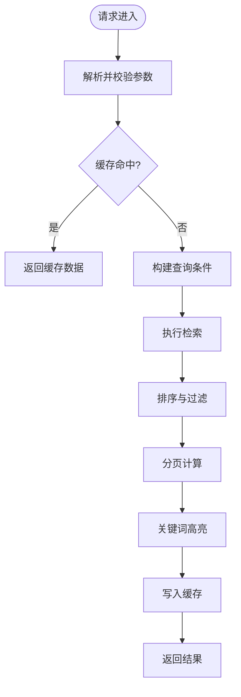
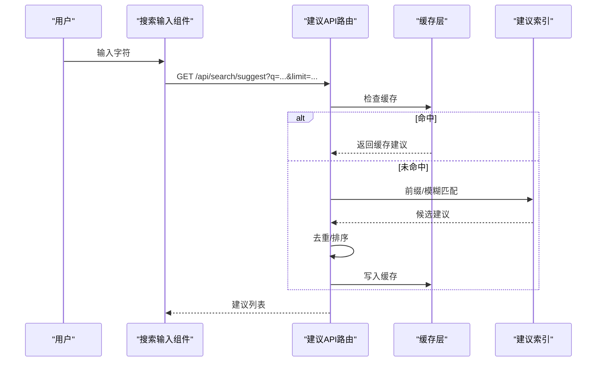
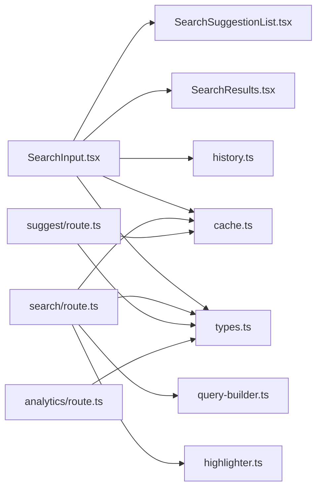

# 搜索功能

<cite>
**本文引用的文件**   
- [apps/web/src/app/api/search/route.ts](file://apps/web/src/app/api/search/route.ts)
- [apps/web/src/app/api/search/suggest/route.ts](file://apps/web/src/app/api/search/suggest/route.ts)
- [apps/web/src/app/api/search/analytics/route.ts](file://apps/web/src/app/api/search/analytics/route.ts)
- [apps/web/src/components/search/SearchInput.tsx](file://apps/web/src/components/search/SearchInput.tsx)
- [apps/web/src/components/search/SearchResults.tsx](file://apps/web/src/components/search/SearchResults.tsx)
- [apps/web/src/components/search/SearchSuggestionList.tsx](file://apps/web/src/components/search/SearchSuggestionList.tsx)
- [apps/web/src/lib/search/index.ts](file://apps/web/src/lib/search/index.ts)
- [apps/web/src/lib/search/query-builder.ts](file://apps/web/src/lib/search/query-builder.ts)
- [apps/web/src/lib/search/highlighter.ts](file://apps/web/src/lib/search/highlighter.ts)
- [apps/web/src/lib/search/history.ts](file://apps/web/src/lib/search/history.ts)
- [apps/web/src/lib/search/cache.ts](file://apps/web/src/lib/search/cache.ts)
- [apps/web/src/lib/search/types.ts](file://apps/web/src/lib/search/types.ts)
</cite>

## 目录
1. [简介](#简介)
2. [项目结构](#项目结构)
3. [核心组件](#核心组件)
4. [架构总览](#架构总览)
5. [详细组件分析](#详细组件分析)
6. [依赖关系分析](#依赖关系分析)
7. [性能与优化](#性能与优化)
8. [故障排查指南](#故障排查指南)
9. [结论](#结论)
10. [附录：配置与使用指南](#附录配置与使用指南)

## 简介
本文件面向基于 Next.js API Routes 的搜索后端与前端实现，系统性说明全文搜索、搜索结果展示、搜索建议、无结果处理、搜索算法与索引策略、性能优化与缓存机制，以及搜索框组件、结果列表、分页导航和用户交互体验的设计与实现。同时提供关键词高亮、搜索历史与相关推荐功能的配置指南。

## 项目结构
搜索功能由“前端页面/组件 + Next.js API Routes + 本地库”三部分构成：
- 前端组件：搜索输入、建议下拉、结果列表、分页等
- API Routes：统一入口 /api/search，建议 /api/search/suggest，埋点 /api/search/analytics
- 本地库：查询构建、高亮、历史、缓存、类型定义等

图表来源
- [apps/web/src/components/search/SearchInput.tsx](file://apps/web/src/components/search/SearchInput.tsx)
- [apps/web/src/app/api/search/route.ts](file://apps/web/src/app/api/search/route.ts)
- [apps/web/src/app/api/search/suggest/route.ts](file://apps/web/src/app/api/search/suggest/route.ts)
- [apps/web/src/app/api/search/analytics/route.ts](file://apps/web/src/app/api/search/analytics/route.ts)
- [apps/web/src/lib/search/query-builder.ts](file://apps/web/src/lib/search/query-builder.ts)
- [apps/web/src/lib/search/highlighter.ts](file://apps/web/src/lib/search/highlighter.ts)
- [apps/web/src/lib/search/cache.ts](file://apps/web/src/lib/search/cache.ts)
- [apps/web/src/lib/search/history.ts](file://apps/web/src/lib/search/history.ts)
- [apps/web/src/lib/search/types.ts](file://apps/web/src/lib/search/types.ts)

章节来源
- [apps/web/src/app/api/search/route.ts](file://apps/web/src/app/api/search/route.ts)
- [apps/web/src/app/api/search/suggest/route.ts](file://apps/web/src/app/api/search/suggest/route.ts)
- [apps/web/src/app/api/search/analytics/route.ts](file://apps/web/src/app/api/search/analytics/route.ts)
- [apps/web/src/components/search/SearchInput.tsx](file://apps/web/src/components/search/SearchInput.tsx)
- [apps/web/src/components/search/SearchResults.tsx](file://apps/web/src/components/search/SearchResults.tsx)
- [apps/web/src/components/search/SearchSuggestionList.tsx](file://apps/web/src/components/search/SearchSuggestionList.tsx)
- [apps/web/src/lib/search/index.ts](file://apps/web/src/lib/search/index.ts)
- [apps/web/src/lib/search/query-builder.ts](file://apps/web/src/lib/search/query-builder.ts)
- [apps/web/src/lib/search/highlighter.ts](file://apps/web/src/lib/search/highlighter.ts)
- [apps/web/src/lib/search/history.ts](file://apps/web/src/lib/search/history.ts)
- [apps/web/src/lib/search/cache.ts](file://apps/web/src/lib/search/cache.ts)
- [apps/web/src/lib/search/types.ts](file://apps/web/src/lib/search/types.ts)

## 核心组件
- 搜索输入组件（SearchInput）：负责用户输入、防抖、调用建议与搜索接口、管理本地历史与状态
- 建议列表（SearchSuggestionList）：渲染建议项、键盘导航、点击跳转
- 结果列表（SearchResults）：渲染搜索结果、关键词高亮、空结果提示、分页导航
- API 路由（/api/search, /api/search/suggest, /api/search/analytics）：接收请求、参数校验、查询构建、缓存命中、返回结构化数据
- 本地库（query-builder/highlighter/history/cache/types）：查询语法解析、高亮标记、历史记录持久化、内存/会话缓存、类型契约

章节来源
- [apps/web/src/components/search/SearchInput.tsx](file://apps/web/src/components/search/SearchInput.tsx)
- [apps/web/src/components/search/SearchSuggestionList.tsx](file://apps/web/src/components/search/SearchSuggestionList.tsx)
- [apps/web/src/components/search/SearchResults.tsx](file://apps/web/src/components/search/SearchResults.tsx)
- [apps/web/src/app/api/search/route.ts](file://apps/web/src/app/api/search/route.ts)
- [apps/web/src/app/api/search/suggest/route.ts](file://apps/web/src/app/api/search/suggest/route.ts)
- [apps/web/src/app/api/search/analytics/route.ts](file://apps/web/src/app/api/search/analytics/route.ts)
- [apps/web/src/lib/search/query-builder.ts](file://apps/web/src/lib/search/query-builder.ts)
- [apps/web/src/lib/search/highlighter.ts](file://apps/web/src/lib/search/highlighter.ts)
- [apps/web/src/lib/search/history.ts](file://apps/web/src/lib/search/history.ts)
- [apps/web/src/lib/search/cache.ts](file://apps/web/src/lib/search/cache.ts)
- [apps/web/src/lib/search/types.ts](file://apps/web/src/lib/search/types.ts)

## 架构总览
搜索流程分为两条主线：
- 建议流：输入 → 防抖 → 建议API → 缓存/索引 → 返回建议项 → 渲染下拉
- 搜索流：提交 → 搜索API → 查询构建 → 索引检索 → 排序/分页 → 高亮 → 返回结果 → 渲染列表

图表来源
- [apps/web/src/components/search/SearchInput.tsx](file://apps/web/src/components/search/SearchInput.tsx)
- [apps/web/src/app/api/search/route.ts](file://apps/web/src/app/api/search/route.ts)
- [apps/web/src/lib/search/query-builder.ts](file://apps/web/src/lib/search/query-builder.ts)
- [apps/web/src/lib/search/highlighter.ts](file://apps/web/src/lib/search/highlighter.ts)
- [apps/web/src/lib/search/cache.ts](file://apps/web/src/lib/search/cache.ts)

## 详细组件分析

### 搜索API路由（/api/search）
职责
- 接收并校验查询参数（q、page、pageSize、filters、sort）
- 生成缓存键，优先命中缓存
- 构建查询条件，执行检索
- 对结果进行排序、分页、高亮
- 返回统一数据结构（结果、分页信息、建议词）

关键流程
- 参数校验与默认值设置
- 缓存命中判断与回填
- 查询构建与执行
- 结果高亮与格式化
- 分页计算与返回

图表来源
- [apps/web/src/app/api/search/route.ts](file://apps/web/src/app/api/search/route.ts)
- [apps/web/src/lib/search/query-builder.ts](file://apps/web/src/lib/search/query-builder.ts)
- [apps/web/src/lib/search/highlighter.ts](file://apps/web/src/lib/search/highlighter.ts)
- [apps/web/src/lib/search/cache.ts](file://apps/web/src/lib/search/cache.ts)

章节来源
- [apps/web/src/app/api/search/route.ts](file://apps/web/src/app/api/search/route.ts)
- [apps/web/src/lib/search/query-builder.ts](file://apps/web/src/lib/search/query-builder.ts)
- [apps/web/src/lib/search/highlighter.ts](file://apps/web/src/lib/search/highlighter.ts)
- [apps/web/src/lib/search/cache.ts](file://apps/web/src/lib/search/cache.ts)

### 搜索建议API（/api/search/suggest）
职责
- 根据前缀或模糊匹配返回建议词
- 支持按热度、最近使用频率排序
- 轻量级缓存与限流

关键流程
- 参数校验（q、limit、scope）
- 建议索引查询
- 去重与排序
- 返回建议数组

图表来源
- [apps/web/src/app/api/search/suggest/route.ts](file://apps/web/src/app/api/search/suggest/route.ts)
- [apps/web/src/lib/search/cache.ts](file://apps/web/src/lib/search/cache.ts)

章节来源
- [apps/web/src/app/api/search/suggest/route.ts](file://apps/web/src/app/api/search/suggest/route.ts)
- [apps/web/src/lib/search/cache.ts](file://apps/web/src/lib/search/cache.ts)

### 搜索埋点API（/api/search/analytics）
职责
- 记录搜索行为（关键词、来源、设备、时间）
- 聚合统计（热门搜索、零结果率）
- 可选异步落盘，避免阻塞主流程

关键流程
- 参数校验与脱敏
- 写入事件队列/日志
- 返回确认响应

章节来源
- [apps/web/src/app/api/search/analytics/route.ts](file://apps/web/src/app/api/search/analytics/route.ts)

### 搜索输入组件（SearchInput）
职责
- 监听输入变化，防抖触发建议与搜索
- 维护本地搜索历史（最近搜索、清空）
- 控制建议下拉显示与键盘导航
- 提交搜索并更新URL状态

交互要点
- 防抖阈值可配置
- 建议项聚焦与回车选择
- 空输入时隐藏建议
- 搜索后滚动到结果区域

章节来源
- [apps/web/src/components/search/SearchInput.tsx](file://apps/web/src/components/search/SearchInput.tsx)
- [apps/web/src/lib/search/history.ts](file://apps/web/src/lib/search/history.ts)

### 建议列表组件（SearchSuggestionList）
职责
- 渲染建议项、高亮匹配片段
- 支持键盘上下移动、回车选择、Esc关闭
- 点击建议后触发搜索或跳转

章节来源
- [apps/web/src/components/search/SearchSuggestionList.tsx](file://apps/web/src/components/search/SearchSuggestionList.tsx)

### 结果列表组件（SearchResults）
职责
- 渲染搜索结果卡片（标题、摘要、链接、标签）
- 关键词高亮显示
- 空结果提示与推荐搜索
- 分页导航（上一页/下一页、页码跳转）

章节来源
- [apps/web/src/components/search/SearchResults.tsx](file://apps/web/src/components/search/SearchResults.tsx)
- [apps/web/src/lib/search/highlighter.ts](file://apps/web/src/lib/search/highlighter.ts)

### 查询构建器（query-builder）
职责
- 将用户输入的查询字符串转换为结构化查询
- 支持字段过滤、范围查询、布尔逻辑
- 规范化大小写、去除停用词、分词策略

复杂度与优化
- 解析阶段 O(n)，n为输入长度
- 过滤与排序在索引侧完成，客户端仅做轻量预处理

章节来源
- [apps/web/src/lib/search/query-builder.ts](file://apps/web/src/lib/search/query-builder.ts)
- [apps/web/src/lib/search/types.ts](file://apps/web/src/lib/search/types.ts)

### 高亮器（highlighter）
职责
- 对标题/摘要文本进行关键词匹配与包裹标记
- 支持多关键词、忽略大小写、避免HTML破坏
- 输出安全HTML片段供渲染

章节来源
- [apps/web/src/lib/search/highlighter.ts](file://apps/web/src/lib/search/highlighter.ts)

### 搜索历史（history）
职责
- 本地存储最近搜索词（数量上限、去重）
- 提供读取、追加、清空能力
- 支持跨会话持久化（localStorage/sessionStorage）

章节来源
- [apps/web/src/lib/search/history.ts](file://apps/web/src/lib/search/history.ts)

### 缓存层（cache）
职责
- 内存缓存（短期）、会话缓存（浏览器）
- 缓存键生成（包含查询、分页、过滤、排序）
- TTL过期策略与容量限制

章节来源
- [apps/web/src/lib/search/cache.ts](file://apps/web/src/lib/search/cache.ts)

### 类型定义（types）
职责
- 定义搜索请求/响应结构、分页对象、建议项、结果项
- 约束API与组件间的数据契约

章节来源
- [apps/web/src/lib/search/types.ts](file://apps/web/src/lib/search/types.ts)

## 依赖关系分析
- SearchInput 依赖：SearchSuggestionList、SearchResults、history、cache、types
- API Routes 依赖：query-builder、highlighter、cache、types
- 建议与搜索共享 types 与 cache，降低耦合

图表来源
- [apps/web/src/components/search/SearchInput.tsx](file://apps/web/src/components/search/SearchInput.tsx)
- [apps/web/src/components/search/SearchSuggestionList.tsx](file://apps/web/src/components/search/SearchSuggestionList.tsx)
- [apps/web/src/components/search/SearchResults.tsx](file://apps/web/src/components/search/SearchResults.tsx)
- [apps/web/src/app/api/search/route.ts](file://apps/web/src/app/api/search/route.ts)
- [apps/web/src/app/api/search/suggest/route.ts](file://apps/web/src/app/api/search/suggest/route.ts)
- [apps/web/src/app/api/search/analytics/route.ts](file://apps/web/src/app/api/search/analytics/route.ts)
- [apps/web/src/lib/search/query-builder.ts](file://apps/web/src/lib/search/query-builder.ts)
- [apps/web/src/lib/search/highlighter.ts](file://apps/web/src/lib/search/highlighter.ts)
- [apps/web/src/lib/search/history.ts](file://apps/web/src/lib/search/history.ts)
- [apps/web/src/lib/search/cache.ts](file://apps/web/src/lib/search/cache.ts)
- [apps/web/src/lib/search/types.ts](file://apps/web/src/lib/search/types.ts)

章节来源
- [apps/web/src/lib/search/index.ts](file://apps/web/src/lib/search/index.ts)
- [apps/web/src/lib/search/types.ts](file://apps/web/src/lib/search/types.ts)

## 性能与优化
- 防抖与节流：输入防抖减少不必要的网络请求；建议接口可加节流
- 缓存策略：多级缓存（内存→会话），合理TTL与键设计，避免重复计算
- 分页与懒加载：默认小页大小，按需加载更多
- 高亮开销：仅在可见区域高亮，避免全量DOM操作
- 索引优化：服务端预分词、停用词过滤、字段权重排序
- 错误降级：网络失败回退到本地缓存或空结果提示
- 埋点异步：不阻塞主流程，批量上报

[本节为通用指导，不直接分析具体文件]

## 故障排查指南
常见问题与定位
- 无结果：检查查询构建是否过度过滤；查看空结果提示逻辑；确认索引覆盖
- 建议不出现：验证建议API参数与缓存键；检查建议索引数据源
- 高亮异常：确认高亮器正则与HTML安全处理；避免破坏原有结构
- 缓存污染：核对缓存键是否包含分页与过滤维度；清理过期缓存
- 性能抖动：监控首屏请求耗时；增加缓存命中率；减少不必要渲染

章节来源
- [apps/web/src/app/api/search/route.ts](file://apps/web/src/app/api/search/route.ts)
- [apps/web/src/app/api/search/suggest/route.ts](file://apps/web/src/app/api/search/suggest/route.ts)
- [apps/web/src/lib/search/highlighter.ts](file://apps/web/src/lib/search/highlighter.ts)
- [apps/web/src/lib/search/cache.ts](file://apps/web/src/lib/search/cache.ts)

## 结论
该搜索功能以Next.js API Routes为核心，结合前端组件与本地库，实现了完整的全文搜索、建议、高亮、历史与缓存体系。通过清晰的职责划分与模块化设计，既保证了用户体验，也兼顾了性能与可维护性。后续可在索引质量、排序策略与个性化推荐方面持续优化。

[本节为总结性内容，不直接分析具体文件]

## 附录：配置与使用指南
- 搜索框组件
  - 配置项：防抖延迟、建议数量、是否启用历史、是否启用缓存
  - 事件回调：onSearch、onSelect、onClearHistory
- 结果列表
  - 配置项：每页条数、是否显示摘要、高亮样式类名
  - 插槽：自定义结果卡片布局
- 搜索建议
  - 配置项：最小输入长度、最大建议数、是否按热度排序
- 搜索历史
  - 配置项：最大保存数量、存储位置（local/session）
- 缓存
  - 配置项：TTL、最大条目数、是否启用会话缓存
- 埋点
  - 配置项：是否开启、上报间隔、匿名ID策略

章节来源
- [apps/web/src/components/search/SearchInput.tsx](file://apps/web/src/components/search/SearchInput.tsx)
- [apps/web/src/components/search/SearchResults.tsx](file://apps/web/src/components/search/SearchResults.tsx)
- [apps/web/src/components/search/SearchSuggestionList.tsx](file://apps/web/src/components/search/SearchSuggestionList.tsx)
- [apps/web/src/lib/search/history.ts](file://apps/web/src/lib/search/history.ts)
- [apps/web/src/lib/search/cache.ts](file://apps/web/src/lib/search/cache.ts)
- [apps/web/src/app/api/search/analytics/route.ts](file://apps/web/src/app/api/search/analytics/route.ts)