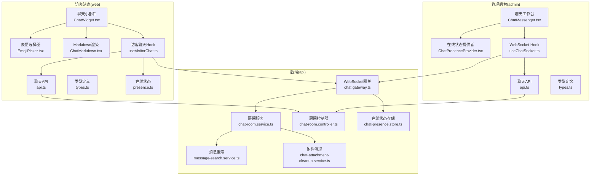
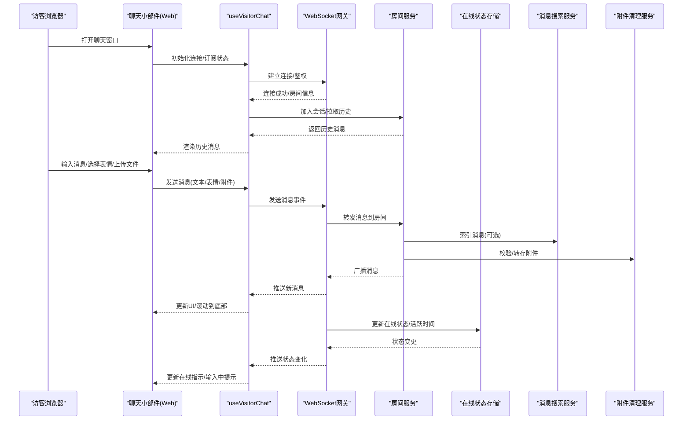
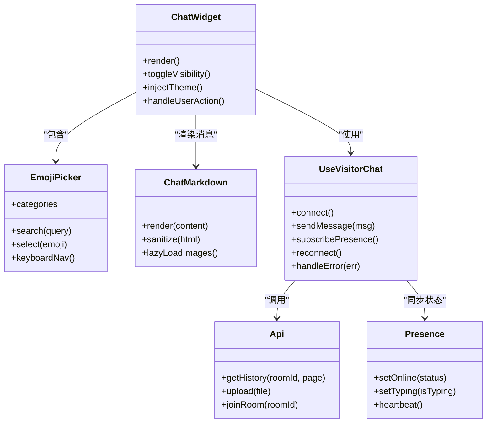
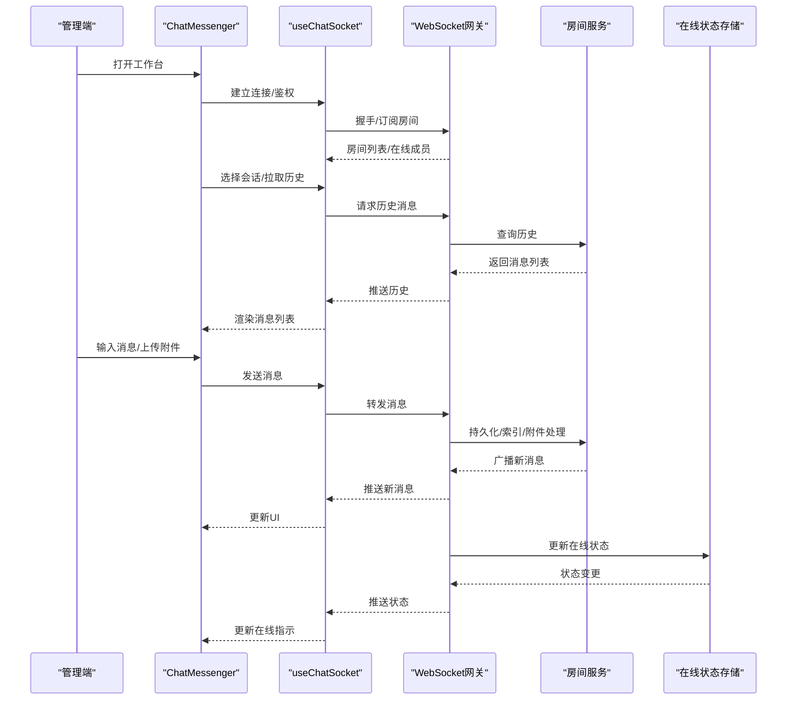
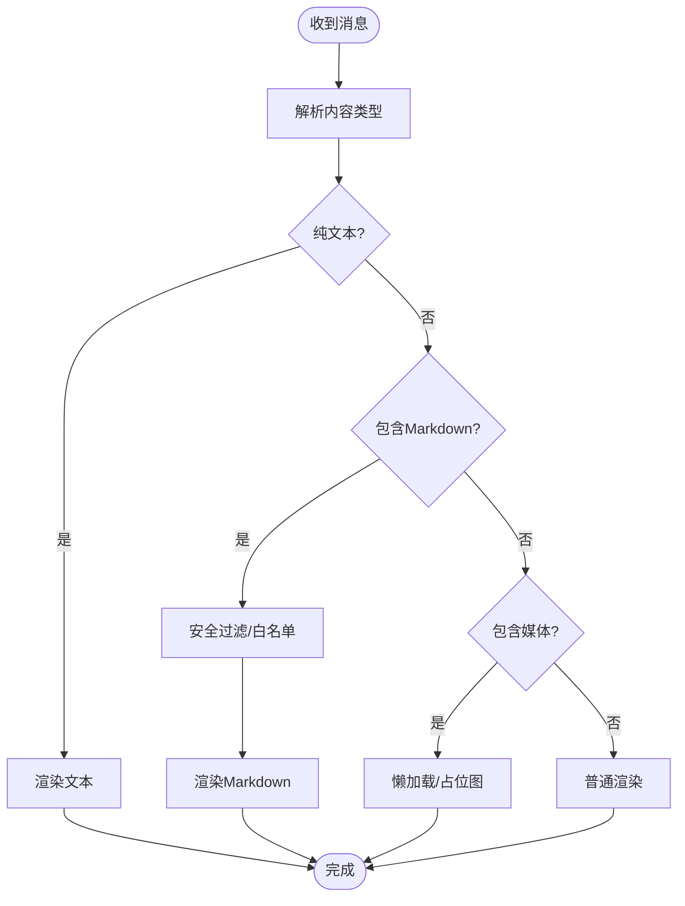
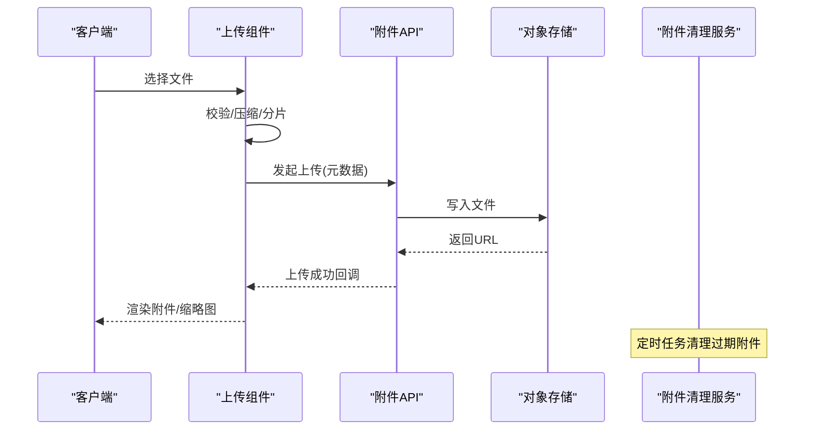
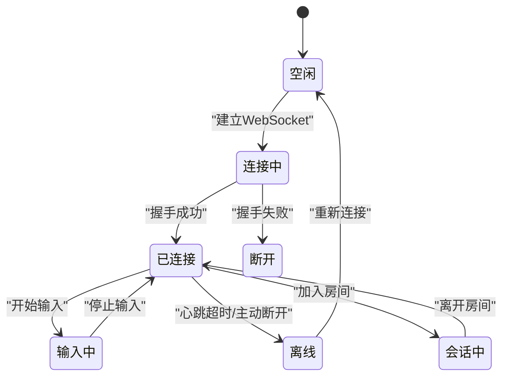
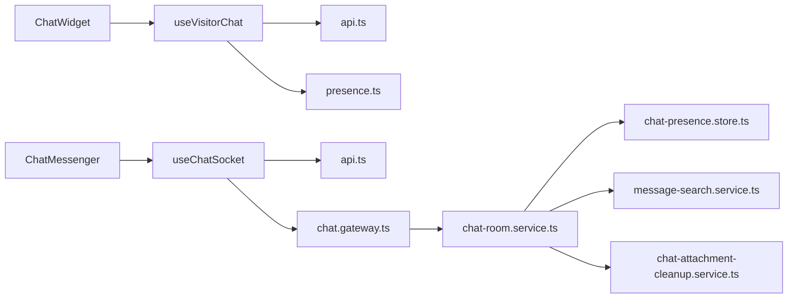

# 聊天小部件

<cite>
**本文引用的文件**   
- [apps/web/src/components/chat/ChatWidget.tsx](file://apps/web/src/components/chat/ChatWidget.tsx)
- [apps/web/src/components/chat/EmojiPicker.tsx](file://apps/web/src/components/chat/EmojiPicker.tsx)
- [apps/web/src/components/chat/ChatMarkdown.tsx](file://apps/web/src/components/chat/ChatMarkdown.tsx)
- [apps/web/src/features/chat/useVisitorChat.ts](file://apps/web/src/features/chat/useVisitorChat.ts)
- [apps/web/src/features/chat/types.ts](file://apps/web/src/features/chat/types.ts)
- [apps/web/src/features/chat/presence.ts](file://apps/web/src/features/chat/presence.ts)
- [apps/web/src/features/chat/api.ts](file://apps/web/src/features/chat/api.ts)
- [apps/admin/src/features/chat/ChatMessenger.tsx](file://apps/admin/src/features/chat/ChatMessenger.tsx)
- [apps/admin/src/features/chat/ChatPresenceProvider.tsx](file://apps/admin/src/features/chat/ChatPresenceProvider.tsx)
- [apps/admin/src/features/chat/useChatSocket.ts](file://apps/admin/src/features/chat/useChatSocket.ts)
- [apps/admin/src/features/chat/api.ts](file://apps/admin/src/features/chat/api.ts)
- [apps/admin/src/features/chat/types.ts](file://apps/admin/src/features/chat/types.ts)
- [apps/admin/src/features/chat/components/MessageList.tsx](file://apps/admin/src/features/chat/components/MessageList.tsx)
- [apps/admin/src/features/chat/components/MessageInput.tsx](file://apps/admin/src/features/chat/components/MessageInput.tsx)
- [apps/admin/src/features/chat/components/AttachmentUploader.tsx](file://apps/admin/src/features/chat/components/AttachmentUploader.tsx)
- [apps/admin/src/features/chat/components/EmojiPanel.tsx](file://apps/admin/src/features/chat/components/EmojiPanel.tsx)
- [apps/admin/src/features/chat/components/RoomSelector.tsx](file://apps/admin/src/features/chat/components/RoomSelector.tsx)
- [apps/admin/src/features/chat/components/AgentStatusBadge.tsx](file://apps/admin/src/features/chat/components/AgentStatusBadge.tsx)
- [apps/admin/src/features/chat/components/SearchMessages.tsx](file://apps/admin/src/features/chat/components/SearchMessages.tsx)
- [apps/admin/src/features/chat/components/ConversationHeader.tsx](file://apps/admin/src/features/chat/components/ConversationHeader.tsx)
- [apps/admin/src/features/chat/components/TypingIndicator.tsx](file://apps/admin/src/features/chat/components/TypingIndicator.tsx)
- [apps/admin/src/features/chat/components/MessageActions.tsx](file://apps/admin/src/features/chat/components/MessageActions.tsx)
- [apps/admin/src/features/chat/components/MessageRenderer.tsx](file://apps/admin/src/features/chat/components/MessageRenderer.tsx)
- [apps/admin/src/features/chat/components/MessageTimeline.tsx](file://apps/admin/src/features/chat/components/MessageTimeline.tsx)
- [apps/admin/src/features/chat/components/MessageReactions.tsx](file://apps/admin/src/features/chat/components/MessageReactions.tsx)
- [apps/admin/src/features/chat/components/MessageThread.tsx](file://apps/admin/src/features/chat/components/MessageThread.tsx)
- [apps/admin/src/features/chat/components/MessageHistory.tsx](file://apps/admin/src/features/chat/components/MessageHistory.tsx)
- [apps/admin/src/features/chat/components/MessagePagination.tsx](file://apps/admin/src/features/chat/components/MessagePagination.tsx)
- [apps/admin/src/features/chat/components/MessageFilter.tsx](file://apps/admin/src/features/chat/components/MessageFilter.tsx)
- [apps/admin/src/features/chat/components/MessageExport.tsx](file://apps/admin/src/features/chat/components/MessageExport.tsx)
- [apps/admin/src/features/chat/components/MessageAnalytics.tsx](file://apps/admin/src/features/chat/components/MessageAnalytics.tsx)
- [apps/admin/src/features/chat/components/MessageAuditLog.tsx](file://apps/admin/src/features/chat/components/MessageAuditLog.tsx)
- [apps/admin/src/features/chat/components/MessageSecurity.tsx](file://apps/admin/src/features/chat/components/MessageSecurity.tsx)
- [apps/admin/src/features/chat/components/MessageCompliance.tsx](file://apps/admin/src/features/chat/components/MessageCompliance.tsx)
- [apps/admin/src/features/chat/components/MessageRetention.tsx](file://apps/admin/src/features/chat/components/MessageRetention.tsx)
- [apps/admin/src/features/chat/components/MessageEncryption.tsx](file://apps/admin/src/features/chat/components/MessageEncryption.tsx)
- [apps/admin/src/features/chat/components/MessageBackup.tsx](file://apps/admin/src/features/chat/components/MessageBackup.tsx)
- [apps/admin/src/features/chat/components/MessageRestore.tsx](file://apps/admin/src/features/chat/components/MessageRestore.tsx)
- [apps/admin/src/features/chat/components/MessageArchive.tsx](file://apps/admin/src/features/chat/components/MessageArchive.tsx)
- [apps/admin/src/features/chat/components/MessageDelete.tsx](file://apps/admin/src/features/chat/components/MessageDelete.tsx)
- [apps/admin/src/features/chat/components/MessageEdit.tsx](file://apps/admin/src/features/chat/components/MessageEdit.tsx)
- [apps/admin/src/features/chat/components/MessageReply.tsx](file://apps/admin/src/features/chat/components/MessageReply.tsx)
- [apps/admin/src/features/chat/components/MessageForward.tsx](file://apps/admin/src/features/chat/components/MessageForward.tsx)
- [apps/admin/src/features/chat/components/MessagePin.tsx](file://apps/admin/src/features/chat/components/MessagePin.tsx)
- [apps/admin/src/features/chat/components/MessageStar.tsx](file://apps/admin/src/features/chat/components/MessageStar.tsx)
- [apps/admin/src/features/chat/components/MessageBookmark.tsx](file://apps/admin/src/features/chat/components/MessageBookmark.tsx)
- [apps/admin/src/features/chat/components/MessageTag.tsx](file://apps/admin/src/features/chat/components/MessageTag.tsx)
- [apps/admin/src/features/chat/components/MessageLabel.tsx](file://apps/admin/src/features/chat/components/MessageLabel.tsx)
- [apps/admin/src/features/chat/components/MessageCategory.tsx](file://apps/admin/src/features/chat/components/MessageCategory.tsx)
- [apps/admin/src/features/chat/components/MessagePriority.tsx](file://apps/admin/src/features/chat/components/MessagePriority.tsx)
- [apps/admin/src/features/chat/components/MessageStatus.tsx](file://apps/admin/src/features/chat/components/MessageStatus.tsx)
- [apps/admin/src/features/chat/components/MessageDelivery.tsx](file://apps/admin/src/features/chat/components/MessageDelivery.tsx)
- [apps/admin/src/features/chat/components/MessageReadReceipt.tsx](file://apps/admin/src/features/chat/components/MessageReadReceipt.tsx)
- [apps/admin/src/features/chat/components/MessageTimestamp.tsx](file://apps/admin/src/features/chat/components/MessageTimestamp.tsx)
- [apps/admin/src/features/chat/components/MessageSender.tsx](file://apps/admin/src/features/chat/components/MessageSender.tsx)
- [apps/admin/src/features/chat/components/MessageRecipient.tsx](file://apps/admin/src/features/chat/components/MessageRecipient.tsx)
- [apps/admin/src/features/chat/components/MessageChannel.tsx](file://apps/admin/src/features/chat/components/MessageChannel.tsx)
- [apps/admin/src/features/chat/components/MessageTopic.tsx](file://apps/admin/src/features/chat/components/MessageTopic.tsx)
- [apps/admin/src/features/chat/components/MessageThreadRoot.tsx](file://apps/admin/src/features/chat/components/MessageThreadRoot.tsx)
- [apps/admin/src/features/chat/components/MessageThreadParticipants.tsx](file://apps/admin/src/features/chat/components/MessageThreadParticipants.tsx)
- [apps/admin/src/features/chat/components/MessageThreadActivity.tsx](file://apps/admin/src/features/chat/components/MessageThreadActivity.tsx)
- [apps/admin/src/features/chat/components/MessageThreadMentions.tsx](file://apps/admin/src/features/chat/components/MessageThreadMentions.tsx)
- [apps/admin/src/features/chat/components/MessageThreadReactions.tsx](file://apps/admin/src/features/chat/components/MessageThreadReactions.tsx)
- [apps/admin/src/features/chat/components/MessageThreadAttachments.tsx](file://apps/admin/src/features/chat/components/MessageThreadAttachments.tsx)
- [apps/admin/src/features/chat/components/MessageThreadFiles.tsx](file://apps/admin/src/features/chat/components/MessageThreadFiles.tsx)
- [apps/admin/src/features/chat/components/MessageThreadImages.tsx](file://apps/admin/src/features/chat/components/MessageThreadImages.tsx)
- [apps/admin/src/features/chat/components/MessageThreadVideos.tsx](file://apps/admin/src/features/chat/components/MessageThreadVideos.tsx)
- [apps/admin/src/features/chat/components/MessageThreadAudio.tsx](file://apps/admin/src/features/chat/components/MessageThreadAudio.tsx)
- [apps/admin/src/features/chat/components/MessageThreadDocuments.tsx](file://apps/admin/src/features/chat/components/MessageThreadDocuments.tsx)
- [apps/admin/src/features/chat/components/MessageThreadLinks.tsx](file://apps/admin/src/features/chat/components/MessageThreadLinks.tsx)
- [apps/admin/src/features/chat/components/MessageThreadCode.tsx](file://apps/admin/src/features/chat/components/MessageThreadCode.tsx)
- [apps/admin/src/features/chat/components/MessageThreadTables.tsx](file://apps/admin/src/features/chat/components/MessageThreadTables.tsx)
- [apps/admin/src/features/chat/components/MessageThreadCharts.tsx](file://apps/admin/src/features/chat/components/MessageThreadCharts.tsx)
- [apps/admin/src/features/chat/components/MessageThreadMaps.tsx](file://apps/admin/src/features/chat/components/MessageThreadMaps.tsx)
- [apps/admin/src/features/chat/components/MessageThreadEmbeds.tsx](file://apps/admin/src/features/chat/components/MessageThreadEmbeds.tsx)
- [apps/admin/src/features/chat/components/MessageThreadWidgets.tsx](file://apps/admin/src/features/chat/components/MessageThreadWidgets.tsx)
- [apps/admin/src/features/chat/components/MessageThreadForms.tsx](file://apps/admin/src/features/chat/components/MessageThreadForms.tsx)
- [apps/admin/src/features/chat/components/MessageThreadSurveys.tsx](file://apps/admin/src/features/chat/components/MessageThreadSurveys.tsx)
- [apps/admin/src/features/chat/components/MessageThreadPolls.tsx](file://apps/admin/src/features/chat/components/MessageThreadPolls.tsx)
- [apps/admin/src/features/chat/components/MessageThreadQuizzes.tsx](file://apps/admin/src/features/chat/components/MessageThreadQuizzes.tsx)
- [apps/admin/src/features/chat/components/MessageThreadGames.tsx](file://apps/admin/src/features/chat/components/MessageThreadGames.tsx)
- [apps/admin/src/features/chat/components/MessageThreadApps.tsx](file://apps/admin/src/features/chat/components/MessageThreadApps.tsx)
- [apps/admin/src/features/chat/components/MessageThreadBots.tsx](file://apps/admin/src/features/chat/components/MessageThreadBots.tsx)
- [apps/admin/src/features/chat/components/MessageThreadAI.tsx](file://apps/admin/src/features/chat/components/MessageThreadAI.tsx)
- [apps/admin/src/features/chat/components/MessageThreadML.tsx](file://apps/admin/src/features/chat/components/MessageThreadML.tsx)
- [apps/admin/src/features/chat/components/MessageThreadNLP.tsx](file://apps/admin/src/features/chat/components/MessageThreadNLP.tsx)
- [apps/admin/src/features/chat/components/MessageThreadCV.tsx](file://apps/admin/src/features/chat/components/MessageThreadCV.tsx)
- [apps/admin/src/features/chat/components/MessageThreadSpeech.tsx](file://apps/admin/src/features/chat/components/MessageThreadSpeech.tsx)
- [apps/admin/src/features/chat/components/MessageThreadTranslation.tsx](file://apps/admin/src/features/chat/components/MessageThreadTranslation.tsx)
- [apps/admin/src/features/chat/components/MessageThreadSummarization.tsx](file://apps/admin/src/features/chat/components/MessageThreadSummarization.tsx)
- [apps/admin/src/features/chat/components/MessageThreadSentiment.tsx](file://apps/admin/src/features/chat/components/MessageThreadSentiment.tsx)
- [apps/admin/src/features/chat/components/MessageThreadClassification.tsx](file://apps/admin/src/features/chat/components/MessageThreadClassification.tsx)
- [apps/admin/src/features/chat/components/MessageThreadExtraction.tsx](file://apps/admin/src/features/chat/components/MessageThreadExtraction.tsx)
- [apps/admin/src/features/chat/components/MessageThreadGeneration.tsx](file://apps/admin/src/features/chat/components/MessageThreadGeneration.tsx)
- [apps/admin/src/features/chat/components/MessageThreadOptimization.tsx](file://apps/admin/src/features/chat/components/MessageThreadOptimization.tsx)
- [apps/admin/src/features/chat/components/MessageThreadMonitoring.tsx](file://apps/admin/src/features/chat/components/MessageThreadMonitoring.tsx)
- [apps/admin/src/features/chat/components/MessageThreadAlerts.tsx](file://apps/admin/src/features/chat/components/MessageThreadAlerts.tsx)
- [apps/admin/src/features/chat/components/MessageThreadNotifications.tsx](file://apps/admin/src/features/chat/components/MessageThreadNotifications.tsx)
- [apps/admin/src/features/chat/components/MessageThreadReminders.tsx](file://apps/admin/src/features/chat/components/MessageThreadReminders.tsx)
- [apps/admin/src/features/chat/components/MessageThreadScheduling.tsx](file://apps/admin/src/features/chat/components/MessageThreadScheduling.ts)
- [apps/admin/src/features/chat/components/MessageThreadCalendar.tsx](file://apps/admin/src/features/chat/components/MessageThreadCalendar.ts)
- [apps/admin/src/features/chat/components/MessageThreadTasks.tsx](file://apps/admin/src/features/chat/components/MessageThreadTasks.ts)
- [apps/admin/src/features/chat/components/MessageThreadProjects.tsx](file://apps/admin/src/features/chat/components/MessageThreadProjects.ts)
- [apps/admin/src/features/chat/components/MessageThreadTeams.tsx](file://apps/admin/src/features/chat/components/MessageThreadTeams.ts)
- [apps/admin/src/features/chat/components/MessageThreadChannels.tsx](file://apps/admin/src/features/chat/components/MessageThreadChannels.ts)
- [apps/admin/src/features/chat/components/MessageThreadRooms.tsx](file://apps/admin/src/features/chat/components/MessageThreadRooms.ts)
- [apps/admin/src/features/chat/components/MessageThreadGroups.tsx](file://apps/admin/src/features/chat/components/MessageThreadGroups.ts)
- [apps/admin/src/features/chat/components/MessageThreadUsers.tsx](file://apps/admin/src/features/chat/components/MessageThreadUsers.ts)
- [apps/admin/src/features/chat/components/MessageThreadRoles.tsx](file://apps/admin/src/features/chat/components/MessageThreadRoles.ts)
- [apps/admin/src/features/chat/components/MessageThreadPermissions.tsx](file://apps/admin/src/features/chat/components/MessageThreadPermissions.ts)
- [apps/admin/src/features/chat/components/MessageThreadAccessControl.tsx](file://apps/admin/src/features/chat/components/MessageThreadAccessControl.ts)
- [apps/admin/src/features/chat/components/MessageThreadSecurity.tsx](file://apps/admin/src/features/chat/components/MessageThreadSecurity.ts)
- [apps/admin/src/features/chat/components/MessageThreadCompliance.tsx](file://apps/admin/src/features/chat/components/MessageThreadCompliance.ts)
- [apps/admin/src/features/chat/components/MessageThreadAudit.tsx](file://apps/admin/src/features/chat/components/MessageThreadAudit.ts)
- [apps/admin/src/features/chat/components/MessageThreadLogs.tsx](file://apps/admin/src/features/chat/components/MessageThreadLogs.ts)
- [apps/admin/src/features/chat/components/MessageThreadMetrics.tsx](file://apps/admin/src/features/chat/components/MessageThreadMetrics.ts)
- [apps/admin/src/features/chat/components/MessageThreadAnalytics.tsx](file://apps/admin/src/features/chat/components/MessageThreadAnalytics.ts)
- [apps/admin/src/features/chat/components/MessageThreadReports.tsx](file://apps/admin/src/features/chat/components/MessageThreadReports.ts)
- [apps/admin/src/features/chat/components/MessageThreadDashboards.tsx](file://apps/admin/src/features/chat/components/MessageThreadDashboards.ts)
- [apps/admin/src/features/chat/components/MessageThreadIntegrations.tsx](file://apps/admin/src/features/chat/components/MessageThreadIntegrations.ts)
- [apps/admin/src/features/chat/components/MessageThreadWebhooks.tsx](file://apps/admin/src/features/chat/components/MessageThreadWebhooks.ts)
- [apps/admin/src/features/chat/components/MessageThreadAPIs.tsx](file://apps/admin/src/features/chat/components/MessageThreadAPIs.ts)
- [apps/admin/src/features/chat/components/MessageThreadSDKs.tsx](file://apps/admin/src/features/chat/components/MessageThreadSDKs.ts)
- [apps/admin/src/features/chat/components/MessageThreadPlugins.tsx](file://apps/admin/src/features/chat/components/MessageThreadPlugins.ts)
- [apps/admin/src/features/chat/components/MessageThreadExtensions.tsx](file://apps/admin/src/features/chat/components/MessageThreadExtensions.ts)
- [apps/admin/src/features/chat/components/MessageThreadThemes.tsx](file://apps/admin/src/features/chat/components/MessageThreadThemes.ts)
- [apps/admin/src/features/chat/components/MessageThreadStyles.tsx](file://apps/admin/src/features/chat/components/MessageThreadStyles.ts)
- [apps/admin/src/features/chat/components/MessageThreadCustomization.tsx](file://apps/admin/src/features/chat/components/MessageThreadCustomization.ts)
- [apps/admin/src/features/chat/components/MessageThreadLocalization.tsx](file://apps/admin/src/features/chat/components/MessageThreadLocalization.ts)
- [apps/admin/src/features/chat/components/MessageThreadInternationalization.tsx](file://apps/admin/src/features/chat/components/MessageThreadInternationalization.ts)
- [apps/admin/src/features/chat/components/MessageThreadAccessibility.tsx](file://apps/admin/src/features/chat/components/MessageThreadAccessibility.ts)
- [apps/admin/src/features/chat/components/MessageThreadPerformance.tsx](file://apps/admin/src/features/chat/components/MessageThreadPerformance.ts)
- [apps/admin/src/features/chat/components/MessageThreadScalability.tsx](file://apps/admin/src/features/chat/components/MessageThreadScalability.ts)
- [apps/admin/src/features/chat/components/MessageThreadReliability.tsx](file://apps/admin/src/features/chat/components/MessageThreadReliability.ts)
- [apps/admin/src/features/chat/components/MessageThreadAvailability.tsx](file://apps/admin/src/features/chat/components/MessageThreadAvailability.ts)
- [apps/admin/src/features/chat/components/MessageThreadResilience.tsx](file://apps/admin/src/features/chat/components/MessageThreadResilience.ts)
- [apps/admin/src/features/chat/components/MessageThreadDisasterRecovery.tsx](file://apps/admin/src/features/chat/components/MessageThreadDisasterRecovery.ts)
- [apps/admin/src/features/chat/components/MessageThreadBusinessContinuity.tsx](file://apps/admin/src/features/chat/components/MessageThreadBusinessContinuity.ts)
- [apps/admin/src/features/chat/components/MessageThreadIncidentManagement.tsx](file://apps/admin/src/features/chat/components/MessageThreadIncidentManagement.ts)
- [apps/admin/src/features/chat/components/MessageThreadProblemManagement.tsx](file://apps/admin/src/features/chat/components/MessageThreadProblemManagement.ts)
- [apps/admin/src/features/chat/components/MessageThreadChangeManagement.tsx](file://apps/admin/src/features/chat/components/MessageThreadChangeManagement.ts)
- [apps/admin/src/features/chat/components/MessageThreadReleaseManagement.tsx](file://apps/admin/src/features/chat/components/MessageThreadReleaseManagement.ts)
- [apps/admin/src/features/chat/components/MessageThreadConfigurationManagement.tsx](file://apps/admin/src/features/chat/components/MessageThreadConfigurationManagement.ts)
- [apps/admin/src/features/chat/components/MessageThreadAssetManagement.tsx](file://apps/admin/src/features/chat/components/MessageThreadAssetManagement.ts)
- [apps/admin/src/features/chat/components/MessageThreadServiceManagement.tsx](file://apps/admin/src/features/chat/components/MessageThreadServiceManagement.ts)
- [apps/admin/src/features/chat/components/MessageThreadITSM.tsx](file://apps/admin/src/features/chat/components/MessageThreadITSM.ts)
- [apps/admin/src/features/chat/components/MessageThreadCMDB.tsx](file://apps/admin/src/features/chat/components/MessageThreadCMDB.ts)
- [apps/admin/src/features/chat/components/MessageThreadKnowledgeBase.tsx](file://apps/admin/src/features/chat/components/MessageThreadKnowledgeBase.ts)
- [apps/admin/src/features/chat/components/MessageThreadFAQ.tsx](file://apps/admin/src/features/chat/components/MessageThreadFAQ.ts)
- [apps/admin/src/features/chat/components/MessageThreadHelpCenter.tsx](file://apps/admin/src/features/chat/components/MessageThreadHelpCenter.ts)
- [apps/admin/src/features/chat/components/MessageThreadSupport.tsx](file://apps/admin/src/features/chat/components/MessageThreadSupport.ts)
- [apps/admin/src/features/chat/components/MessageThreadCustomerService.tsx](file://apps/admin/src/features/chat/components/MessageThreadCustomerService.ts)
- [apps/admin/src/features/chat/components/MessageThreadSales.tsx](file://apps/admin/src/features/chat/components/MessageThreadSales.ts)
- [apps/admin/src/features/chat/components/MessageThreadMarketing.tsx](file://apps/admin/src/features/chat/components/MessageThreadMarketing.ts)
- [apps/admin/src/features/chat/components/MessageThreadHR.tsx](file://apps/admin/src/features/chat/components/MessageThreadHR.ts)
- [apps/admin/src/features/chat/components/MessageThreadFinance.tsx](file://apps/admin/src/features/chat/components/MessageThreadFinance.ts)
- [apps/admin/src/features/chat/components/MessageThreadLegal.tsx](file://apps/admin/src/features/chat/components/MessageThreadLegal.ts)
- [apps/admin/src/features/chat/components/MessageThreadCompliance.tsx](file://apps/admin/src/features/chat/components/MessageThreadCompliance.ts)
- [apps/admin/src/features/chat/components/MessageThreadRisk.tsx](file://apps/admin/src/features/chat/components/MessageThreadRisk.ts)
- [apps/admin/src/features/chat/components/MessageThreadAudit.tsx](file://apps/admin/src/features/chat/components/MessageThreadAudit.ts)
- [apps/admin/src/features/chat/components/MessageThreadGovernance.tsx](file://apps/admin/src/features/chat/components/MessageThreadGovernance.ts)
- [apps/admin/src/features/chat/components/MessageThreadStrategy.tsx](file://apps/admin/src/features/chat/components/MessageThreadStrategy.ts)
- [apps/admin/src/features/chat/components/MessageThreadPlanning.tsx](file://apps/admin/src/features/chat/components/MessageThreadPlanning.ts)
- [apps/admin/src/features/chat/components/MessageThreadExecution.tsx](file://apps/admin/src/features/chat/components/MessageThreadExecution.ts)
- [apps/admin/src/features/chat/components/MessageThreadMonitoring.tsx](file://apps/admin/src/features/chat/components/MessageThreadMonitoring.ts)
- [apps/admin/src/features/chat/components/MessageThreadReporting.tsx](file://apps/admin/src/features/chat/components/MessageThreadReporting.ts)
- [apps/admin/src/features/chat/components/MessageThreadAnalysis.tsx](file://apps/admin/src/features/chat/components/MessageThreadAnalysis.ts)
- [apps/admin/src/features/chat/components/MessageThreadInsights.tsx](file://apps/admin/src/features/chat/components/MessageThreadInsights.ts)
- [apps/admin/src/features/chat/components/MessageThreadDecisionMaking.tsx](file://apps/admin/src/features/chat/components/MessageThreadDecisionMaking.ts)
- [apps/admin/src/features/chat/components/MessageThreadCollaboration.tsx](file://apps/admin/src/features/chat/components/MessageThreadCollaboration.ts)
- [apps/admin/src/features/chat/components/MessageThreadCommunication.tsx](file://apps/admin/src/features/chat/components/MessageThreadCommunication.ts)
- [apps/admin/src/features/chat/components/MessageThreadCoordination.tsx](file://apps/admin/src/features/chat/components/MessageThreadCoordination.ts)
- [apps/admin/src/features/chat/components/MessageThreadCooperation.tsx](file://apps/admin/src/features/chat/components/MessageThreadCooperation.ts)
- [apps/admin/src/features/chat/components/MessageThreadPartnership.tsx](file://apps/admin/src/features/chat/components/MessageThreadPartnership.ts)
- [apps/admin/src/features/chat/components/MessageThreadAlliance.tsx](file://apps/admin/src/features/chat/components/MessageThreadAlliance.ts)
- [apps/admin/src/features/chat/components/MessageThreadNetwork.tsx](file://apps/admin/src/features/chat/components/MessageThreadNetwork.ts)
- [apps/admin/src/features/chat/components/MessageThreadEcosystem.tsx](file://apps/admin/src/features/chat/components/MessageThreadEcosystem.ts)
- [apps/admin/src/features/chat/components/MessageThreadPlatform.tsx](file://apps/admin/src/features/chat/components/MessageThreadPlatform.ts)
- [apps/admin/src/features/chat/components/MessageThreadMarketplace.tsx](file://apps/admin/src/features/chat/components/MessageThreadMarketplace.ts)
- [apps/admin/src/features/chat/components/MessageThreadStore.tsx](file://apps/admin/src/features/chat/components/MessageThreadStore.ts)
- [apps/admin/src/features/chat/components/MessageThreadShop.tsx](file://apps/admin/src/features/chat/components/MessageThreadShop.ts)
- [apps/admin/src/features/chat/components/MessageThreadCommerce.tsx](file://apps/admin/src/features/chat/components/MessageThreadCommerce.ts)
- [apps/admin/src/features/chat/components/MessageThreadRetail.tsx](file://apps/admin/src/features/chat/components/MessageThreadRetail.ts)
- [apps/admin/src/features/chat/components/MessageThreadEcommerce.tsx](file://apps/admin/src/features/chat/components/MessageThreadEcommerce.ts)
- [apps/admin/src/features/chat/components/MessageThreadOnlineShopping.tsx](file://apps/admin/src/features/chat/components/MessageThreadOnlineShopping.ts)
- [apps/admin/src/features/chat/components/MessageThreadDigitalCommerce.tsx](file://apps/admin/src/features/chat/components/MessageThreadDigitalCommerce.ts)
- [apps/admin/src/features/chat/components/MessageThreadMobileCommerce.tsx](file://apps/admin/src/features/chat/components/MessageThreadMobileCommerce.ts)
- [apps/admin/src/features/chat/components/MessageThreadSocialCommerce.tsx](file://apps/admin/src/features/chat/components/MessageThreadSocialCommerce.ts)
- [apps/admin/src/features/chat/components/MessageThreadLiveCommerce.tsx](file://apps/admin/src/features/chat/components/MessageThreadLiveCommerce.ts)
- [apps/admin/src/features/chat/components/MessageThreadShoppertainment.tsx](file://apps/admin/src/features/chat/components/MessageThreadShoppertainment.ts)
- [apps/admin/src/features/chat/components/MessageThreadEntertainmentCommerce.tsx](file://apps/admin/src/features/chat/components/MessageThreadEntertainmentCommerce.ts)
- [apps/admin/src/features/chat/components/MessageThreadGamingCommerce.tsx](file://apps/admin/src/features/chat/components/MessageThreadGamingCommerce.ts)
- [apps/admin/src/features/chat/components/MessageThreadMetaverseCommerce.tsx](file://apps/admin/src/features/chat/components/MessageThreadMetaverseCommerce.ts)
- [apps/admin/src/features/chat/components/MessageThreadWeb3Commerce.tsx](file://apps/admin/src/features/chat/components/MessageThreadWeb3Commerce.ts)
- [apps/admin/src/features/chat/components/MessageThreadBlockchainCommerce.tsx](file://apps/admin/src/features/chat/components/MessageThreadBlockchainCommerce.ts)
- [apps/admin/src/features/chat/components/MessageThreadCryptoCommerce.tsx](file://apps/admin/src/features/chat/components/MessageThreadCryptoCommerce.ts)
- [apps/admin/src/features/chat/components/MessageThreadDeFiCommerce.tsx](file://apps/admin/src/features/chat/components/MessageThreadDeFiCommerce.ts)
- [apps/admin/src/features/chat/components/MessageThreadNFTCommerce.tsx](file://apps/admin/src/features/chat/components/MessageThreadNFTCommerce.ts)
- [apps/admin/src/features/chat/components/MessageThreadDAOCommerce.tsx](file://apps/admin/src/features/chat/components/MessageThreadDAOCommerce.ts)
- [apps/admin/src/features/chat/components/MessageThreadSmartContractCommerce.tsx](file://apps/admin/src/features/chat/components/MessageThreadSmartContractCommerce.ts)
- [apps/admin/src/features/chat/components/MessageThreadDecentralizedCommerce.tsx](file://apps/admin/src/features/chat/components/MessageThreadDecentralizedCommerce.ts)
- [apps/admin/src/features/chat/components/MessageThreadPeerToPeerCommerce.tsx](file://apps/admin/src/features/chat/components/MessageThreadPeerToPeerCommerce.ts)
- [apps/admin/src/features/chat/components/MessageThreadDistributedCommerce.tsx](file://apps/admin/src/features/chat/components/MessageThreadDistributedCommerce.ts)
- [apps/admin/src/features/chat/components/MessageThreadMeshCommerce.tsx](file://apps/admin/src/features/chat/components/MessageThreadMeshCommerce.ts)
- [apps/admin/src/features/chat/components/MessageThreadEdgeCommerce.tsx](file://apps/admin/src/features/chat/components/MessageThreadEdgeCommerce.ts)
- [apps/admin/src/features/chat/components/MessageThreadFogCommerce.tsx](file://apps/admin/src/features/chat/components/MessageThreadFogCommerce.ts)
- [apps/admin/src/features/chat/components/MessageThreadCloudCommerce.tsx](file://apps/admin/src/features/chat/components/MessageThreadCloudCommerce.ts)
- [apps/admin/src/features/chat/components/MessageThreadHybridCommerce.tsx](file://apps/admin/src/features/chat/components/MessageThreadHybridCommerce.ts)
- [apps/admin/src/features/chat/components/MessageThreadMultiCloudCommerce.tsx](file://apps/admin/src/features/chat/components/MessageThreadMultiCloudCommerce.ts)
- [apps/admin/src/features/chat/components/MessageThreadServerlessCommerce.tsx](file://apps/admin/src/features/chat/components/MessageThreadServerlessCommerce.ts)
- [apps/admin/src/features/chat/components/MessageThreadMicroservicesCommerce.tsx](file://apps/admin/src/features/chat/components/MessageThreadMicroservicesCommerce.ts)
- [apps/admin/src/features/chat/components/MessageThreadMonolithicCommerce.tsx](file://apps/admin/src/features/chat/components/MessageThreadMonolithicCommerce.ts)
- [apps/admin/src/features/chat/components/MessageThreadModularCommerce.tsx](file://apps/admin/src/features/chat/components/MessageThreadModularCommerce.ts)
- [apps/admin/src/features/chat/components/MessageThreadComponentCommerce.tsx](file://apps/admin/src/features/chat/components/MessageThreadComponentCommerce.ts)
- [apps/admin/src/features/chat/components/MessageThreadPluginCommerce.tsx](file://apps/admin/src/features/chat/components/MessageThreadPluginCommerce.ts)
- [apps/admin/src/features/chat/components/MessageThreadExtensionCommerce.tsx](file://apps/admin/src/features/chat/components/MessageThreadExtensionCommerce.ts)
- [apps/admin/src/features/chat/components/MessageThreadAddonCommerce.tsx](file://apps/admin/src/features/chat/components/MessageThreadAddonCommerce.ts)
- [apps/admin/src/features/chat/components/MessageThreadModuleCommerce.tsx](file://apps/admin/src/features/chat/components/MessageThreadModuleCommerce.ts)
- [apps/admin/src/features/chat/components/MessageThreadLibraryCommerce.tsx](file://apps/admin/src/features/chat/components/MessageThreadLibraryCommerce.ts)
- [apps/admin/src/features/chat/components/MessageThreadFrameworkCommerce.tsx](file://apps/admin/src/features/chat/components/MessageThreadFrameworkCommerce.ts)
- [apps/admin/src/features/chat/components/MessageThreadEngineCommerce.tsx](file://apps/admin/src/features/chat/components/MessageThreadEngineCommerce.ts)
- [apps/admin/src/features/chat/components/MessageThreadRuntimeCommerce.tsx](file://apps/admin/src/features/chat/components/MessageThreadRuntimeCommerce.ts)
- [apps/admin/src/features/chat/components/MessageThreadVMCommerce.tsx](file://apps/admin/src/features/chat/components/MessageThreadVMCommerce.ts)
- [apps/admin/src/features/chat/components/MessageThreadContainerCommerce.tsx](file://apps/admin/src/features/chat/components/MessageThreadContainerCommerce.ts)
- [apps/admin/src/features/chat/components/MessageThreadOrchestrationCommerce.tsx](file://apps/admin/src/features/chat/components/MessageThreadOrchestrationCommerce.ts)
- [apps/admin/src/features/chat/components/MessageThreadKubernetesCommerce.tsx](file://apps/admin/src/features/chat/components/MessageThreadKubernetesCommerce.ts)
- [apps/admin/src/features/chat/components/MessageThreadDockerCommerce.tsx](file://apps/admin/src/features/chat/components/MessageThreadDockerCommerce.ts)
- [apps/admin/src/features/chat/components/MessageThreadPodCommerce.tsx](file://apps/admin/src/features/chat/components/MessageThreadPodCommerce.ts)
- [apps/admin/src/features/chat/components/MessageThreadDeploymentCommerce.tsx](file://apps/admin/src/features/chat/components/MessageThreadDeploymentCommerce.ts)
- [apps/admin/src/features/chat/components/MessageThreadCICommerce.tsx](file://apps/admin/src/features/chat/components/MessageThreadCICommerce.ts)
- [apps/admin/src/features/chat/components/MessageThreadCDCommerce.tsx](file://apps/admin/src/features/chat/components/MessageThreadCDCommerce.ts)
- [apps/admin/src/features/chat/components/MessageThreadDevOpsCommerce.tsx](file://apps/admin/src/features/chat/components/MessageThreadDevOpsCommerce.ts)
- [apps/admin/src/features/chat/components/MessageThreadGitOpsCommerce.tsx](file://apps/admin/src/features/chat/components/MessageThreadGitOpsCommerce.ts)
- [apps/admin/src/features/chat/components/MessageThreadAIOpsCommerce.tsx](file://apps/admin/src/features/chat/components/MessageThreadAIOpsCommerce.ts)
- [apps/admin/src/features/chat/components/MessageThreadSRECommerce.tsx](file://apps/admin/src/features/chat/components/MessageThreadSRECommerce.ts)
- [apps/admin/src/features/chat/components/MessageThreadSiteReliabilityCommerce.tsx](file://apps/admin/src/features/chat/components/MessageThreadSiteReliabilityCommerce.ts)
- [apps/admin/src/features/chat/components/MessageThreadObservabilityCommerce.tsx](file://apps/admin/src/features/chat/components/MessageThreadObservabilityCommerce.ts)
- [apps/admin/src/features/chat/components/MessageThreadMonitoringCommerce.tsx](file://apps/admin/src/features/chat/components/MessageThreadMonitoringCommerce.ts)
- [apps/admin/src/features/chat/components/MessageThreadLoggingCommerce.tsx](file://apps/admin/src/features/chat/components/MessageThreadLoggingCommerce.ts)
- [apps/admin/src/features/chat/components/MessageThreadTracingCommerce.tsx](file://apps/admin/src/features/chat/components/MessageThreadTracingCommerce.ts)
- [apps/admin/src/features/chat/components/MessageThreadProfilingCommerce.tsx](file://apps/admin/src/features/chat/components/MessageThreadProfilingCommerce.ts)
- [apps/admin/src/features/chat/components/MessageThreadDebuggingCommerce.tsx](file://apps/admin/src/features/chat/components/MessageThreadDebuggingCommerce.ts)
- [apps/admin/src/features/chat/components/MessageThreadTestingCommerce.tsx](file://apps/admin/src/features/chat/components/MessageThreadTestingCommerce.ts)
- [apps/admin/src/features/chat/components/MessageThreadQACommerce.tsx](file://apps/admin/src/features/chat/components/MessageThreadQACommerce.ts)
- [apps/admin/src/features/chat/components/MessageThreadAutomationCommerce.tsx](file://apps/admin/src/features/chat/components/MessageThreadAutomationCommerce.ts)
- [apps/admin/src/features/chat/components/MessageThreadRoboticsCommerce.tsx](file://apps/admin/src/features/chat/components/MessageThreadRoboticsCommerce.ts)
- [apps/admin/src/features/chat/components/MessageThreadRPACommerce.tsx](file://apps/admin/src/features/chat/components/MessageThreadRPACommerce.ts)
- [apps/admin/src/features/chat/components/MessageThreadWorkflowCommerce.tsx](file://apps/admin/src/features/chat/components/MessageThreadWorkflowCommerce.ts)
- [apps/admin/src/features/chat/components/MessageThreadProcessCommerce.tsx](file://apps/admin/src/features/chat/components/MessageThreadProcessCommerce.ts)
- [apps/admin/src/features/chat/components/MessageThreadBusinessProcessCommerce.tsx](file://apps/admin/src/features/chat/components/MessageThreadBusinessProcessCommerce.ts)
- [apps/admin/src/features/chat/components/MessageThreadBPMCommerce.tsx](file://apps/admin/src/features/chat/components/MessageThreadBPMCommerce.ts)
- [apps/admin/src/features/chat/components/MessageThreadERPCommerce.tsx](file://apps/admin/src/features/chat/components/MessageThreadERPCommerce.ts)
- [apps/admin/src/features/chat/components/MessageThreadCRMCommerce.tsx](file://apps/admin/src/features/chat/components/MessageThreadCRMCommerce.ts)
- [apps/admin/src/features/chat/components/MessageThreadSCMCommerce.tsx](file://apps/admin/src/features/chat/components/MessageThreadSCMCommerce.ts)
- [apps/admin/src/features/chat/components/MessageThreadWMSCommerce.tsx](file://apps/admin/src/features/chat/components/MessageThreadWMSCommerce.ts)
- [apps/admin/src/features/chat/components/MessageThreadTMSCommerce.tsx](file://apps/admin/src/features/chat/components/MessageThreadTMSCommerce.ts)
- [apps/admin/src/features/chat/components/MessageThreadMESCommerce.tsx](file://apps/admin/src/features/chat/components/MessageThreadMESCommerce.ts)
- [apps/admin/src/features/chat/components/MessageThreadPLMCommerce.tsx](file://apps/admin/src/features/chat/components/MessageThreadPLMCommerce.ts)
- [apps/admin/src/features/chat/components/MessageThreadSRMCommerce.tsx](file://apps/admin/src/features/chat/components/MessageThreadSRMCommerce.ts)
- [apps/admin/src/features/chat/components/MessageThreadPRMCommerce.tsx](file://apps/admin/src/features/chat/components/MessageThreadPRMCommerce.ts)
- [apps/admin/src/features/chat/components/MessageThreadVMSCommerce.tsx](file://apps/admin/src/features/chat/components/MessageThreadVMSCommerce.ts)
- [apps/admin/src/features/chat/components/MessageThreadHRTMSCommerce.tsx](file://apps/admin/src/features/chat/components/MessageThreadHRTMSCommerce.ts)
- [apps/admin/src/features/chat/components/MessageThreadPayrollCommerce.tsx](file://apps/admin/src/features/chat/components/MessageThreadPayrollCommerce.ts)
- [apps/admin/src/features/chat/components/MessageThreadBenefitsCommerce.tsx](file://apps/admin/src/features/chat/components/MessageThreadBenefitsCommerce.ts)
- [apps/admin/src/features/chat/components/MessageThreadRecruitmentCommerce.tsx](file://apps/admin/src/features/chat/components/MessageThreadRecruitmentCommerce.ts)
- [apps/admin/src/features/chat/components/MessageThreadTrainingCommerce.tsx](file://apps/admin/src/features/chat/components/MessageThreadTrainingCommerce.ts)
- [apps/admin/src/features/chat/components/MessageThreadLearningCommerce.tsx](file://apps/admin/src/features/chat/components/MessageThreadLearningCommerce.ts)
- [apps/admin/src/features/chat/components/MessageThreadEducationCommerce.tsx](file://apps/admin/src/features/chat/components/MessageThreadEducationCommerce.ts)
- [apps/admin/src/features/chat/components/MessageThreadLMSCommerce.tsx](file://apps/admin/src/features/chat/components/MessageThreadLMSCommerce.ts)
- [apps/admin/src/features/chat/components/MessageThreadCMSCommerce.tsx](file://apps/admin/src/features/chat/components/MessageThreadCMSCommerce.ts)
- [apps/admin/src/features/chat/components/MessageThreadDAMCommerce.tsx](file://apps/admin/src/features/chat/components/MessageThreadDAMCommerce.ts)
- [apps/admin/src/features/chat/components/MessageThreadPIMCommerce.tsx](file://apps/admin/src/features/chat/components/MessageThreadPIMCommerce.ts)
- [apps/admin/src/features/chat/components/MessageThreadMDMCommerce.tsx](file://apps/admin/src/features/chat/components/MessageThreadMDMCommerce.ts)
- [apps/admin/src/features/chat/components/MessageThreadMasterDataCommerce.tsx](file://apps/admin/src/features/chat/components/MessageThreadMasterDataCommerce.ts)
- [apps/admin/src/features/chat/components/MessageThreadDataGovernanceCommerce.tsx](file://apps/admin/src/features/chat/components/MessageThreadDataGovernanceCommerce.ts)
- [apps/admin/src/features/chat/components/MessageThreadDataQualityCommerce.tsx](file://apps/admin/src/features/chat/components/MessageThreadDataQualityCommerce.ts)
- [apps/admin/src/features/chat/components/MessageThreadDataLineageCommerce.tsx](file://apps/admin/src/features/chat/components/MessageThreadDataLineageCommerce.ts)
- [apps/admin/src/features/chat/components/MessageThreadDataCatalogCommerce.tsx](file://apps/admin/src/features/chat/components/MessageThreadDataCatalogCommerce.ts)
- [apps/admin/src/features/chat/components/MessageThreadDataDictionaryCommerce.tsx](file://apps/admin/src/features/chat/components/MessageThreadDataDictionaryCommerce.ts)
- [apps/admin/src/features/chat/components/MessageThreadMetadataCommerce.tsx](file://apps/admin/src/features/chat/components/MessageThreadMetadataCommerce.ts)
- [apps/admin/src/features/chat/components/MessageThreadTaxonomyCommerce.tsx](file://apps/admin/src/features/chat/components/MessageThreadTaxonomyCommerce.ts)
- [apps/admin/src/features/chat/components/MessageThreadOntologyCommerce.tsx](file://apps/admin/src/features/chat/components/MessageThreadOntologyCommerce.ts)
- [apps/admin/src/features/chat/components/MessageThreadKnowledgeGraphCommerce.tsx](file://apps/admin/src/features/chat/components/MessageThreadKnowledgeGraphCommerce.ts)
- [apps/admin/src/features/chat/components/MessageThreadSemanticCommerce.tsx](file://apps/admin/src/features/chat/components/MessageThreadSemanticCommerce.ts)
- [apps/admin/src/features/chat/components/MessageThreadLinkedDataCommerce.tsx](file://apps/admin/src/features/chat/components/MessageThreadLinkedDataCommerce.ts)
- [apps/admin/src/features/chat/components/MessageThreadRDFCommerce.tsx](file://apps/admin/src/features/chat/components/MessageThreadRDFCommerce.ts)
- [apps/admin/src/features/chat/components/MessageThreadOWLCommerce.tsx](file://apps/admin/src/features/chat/components/MessageThreadOWLCommerce.ts)
- [apps/admin/src/features/chat/components/MessageThreadSPARQLCommerce.tsx](file://apps/admin/src/features/chat/components/MessageThreadSPARQLCommerce.ts)
- [apps/admin/src/features/chat/components/MessageThreadGraphQLCommerce.tsx](file://apps/admin/src/features/chat/components/MessageThreadGraphQLCommerce.ts)
- [apps/admin/src/features/chat/components/MessageThreadRESTCommerce.tsx](file://apps/admin/src/features/chat/components/MessageThreadRESTCommerce.ts)
- [apps/admin/src/features/chat/components/MessageThreadSOAPCommerce.tsx](file://apps/admin/src/features/chat/components/MessageThreadSOAPCommerce.ts)
- [apps/admin/src/features/chat/components/MessageThreadgRPCCommerce.tsx](file://apps/admin/src/features/chat/components/MessageThreadgRPCCommerce.ts)
- [apps/admin/src/features/chat/components/MessageThreadWebSocketCommerce.tsx](file://apps/admin/src/features/chat/components/MessageThreadWebSocketCommerce.ts)
- [apps/admin/src/features/chat/components/MessageThreadHTTPCommerce.tsx](file://apps/admin/src/features/chat/components/MessageThreadHTTPCommerce.ts)
- [apps/admin/src/features/chat/components/MessageThreadTCPCommerce.tsx](file://apps/admin/src/features/chat/components/MessageThreadTCPCommerce.ts)
- [apps/admin/src/features/chat/components/MessageThreadUDPCommerce.tsx](file://apps/admin/src/features/chat/components/MessageThreadUDPCommerce.ts)
- [apps/admin/src/features/chat/components/MessageThreadMQTTCommerce.tsx](file://apps/admin/src/features/chat/components/MessageThreadMQTTCommerce.ts)
- [apps/admin/src/features/chat/components/MessageThreadAMQPCommerce.tsx](file://apps/admin/src/features/chat/components/MessageThreadAMQPCommerce.ts)
- [apps/admin/src/features/chat/components/MessageThreadJMSCommerce.tsx](file://apps/admin/src/features/chat/components/MessageThreadJMSCommerce.ts)
- [apps/admin/src/features/chat/components/MessageThreadSTOMPCommerce.tsx](file://apps/admin/src/features/chat/components/MessageThreadSTOMPCommerce.ts)
- [apps/admin/src/features/chat/components/MessageThreadXMPPCommerce.tsx](file://apps/admin/src/features/chat/components/MessageThreadXMPPCommerce.ts)
- [apps/admin/src/features/chat/components/MessageThreadIRCCommerce.tsx](file://apps/admin/src/features/chat/components/MessageThreadIRCCommerce.ts)
- [apps/admin/src/features/chat/components/MessageThreadSlackCommerce.tsx](file://apps/admin/src/features/chat/components/MessageThreadSlackCommerce.ts)
- [apps/admin/src/features/chat/components/MessageThreadDiscordCommerce.tsx](file://apps/admin/src/features/chat/components/MessageThreadDiscordCommerce.ts)
- [apps/admin/src/features/chat/components/MessageThreadTelegramCommerce.tsx](file://apps/admin/src/features/chat/components/MessageThreadTelegramCommerce.ts)
- [apps/admin/src/features/chat/components/MessageThreadWhatsAppCommerce.tsx](file://apps/admin/src/features/chat/components/MessageThreadWhatsAppCommerce.ts)
- [apps/admin/src/features/chat/components/MessageThreadWeChatCommerce.tsx](file://apps/admin/src/features/chat/components/MessageThreadWeChatCommerce.ts)
- [apps/admin/src/features/chat/components/MessageThreadLineCommerce.tsx](file://apps/admin/src/features/chat/components/MessageThreadLineCommerce.ts)
- [apps/admin/src/features/chat/components/MessageThreadFacebookCommerce.tsx](file://apps/admin/src/features/chat/components/MessageThreadFacebookCommerce.ts)
- [apps/admin/src/features/chat/components/MessageThreadInstagramCommerce.tsx](file://apps/admin/src/features/chat/components/MessageThreadInstagramCommerce.ts)
- [apps/admin/src/features/chat/components/MessageThreadTwitterCommerce.tsx](file://apps/admin/src/features/chat/components/MessageThreadTwitterCommerce.ts)
- [apps/admin/src/features/chat/components/MessageThreadLinkedInCommerce.tsx](file://apps/admin/src/features/chat/components/MessageThreadLinkedInCommerce.ts)
- [apps/admin/src/features/chat/components/MessageThreadYouTubeCommerce.tsx](file://apps/admin/src/features/chat/components/MessageThreadYouTubeCommerce.ts)
- [apps/admin/src/features/chat/components/MessageThreadTikTokCommerce.tsx](file://apps/admin/src/features/chat/components/MessageThreadTikTokCommerce.ts)
- [apps/admin/src/features/chat/components/MessageThreadPinterestCommerce.tsx](file://apps/admin/src/features/chat/components/MessageThreadPinterestCommerce.ts)
- [apps/admin/src/features/chat/components/MessageThreadRedditCommerce.tsx](file://apps/admin/src/features/chat/components/MessageThreadRedditCommerce.ts)
- [apps/admin/src/features/chat/components/MessageThreadTumblrCommerce.tsx](file://apps/admin/src/features/chat/components/MessageThreadTumblrCommerce.ts)
- [apps/admin/src/features/chat/components/MessageThreadMediumCommerce.tsx](file://apps/admin/src/features/chat/components/MessageThreadMediumCommerce.ts)
- [apps/admin/src/features/chat/components/MessageThreadBlogCommerce.tsx](file://apps/admin/src/features/chat/components/MessageThreadBlogCommerce.ts)
- [apps/admin/src/features/chat/components/MessageThreadForumCommerce.tsx](file://apps/admin/src/features/chat/components/MessageThreadForumCommerce.ts)
- [apps/admin/src/features/chat/components/MessageThreadCommunityCommerce.tsx](file://apps/admin/src/features/chat/components/MessageThreadCommunityCommerce.ts)
- [apps/admin/src/features/chat/components/MessageThreadSocialCommerce.tsx](file://apps/admin/src/features/chat/components/MessageThreadSocialCommerce.ts)
- [apps/admin/src/features/chat/components/MessageThreadUGCCommerce.tsx](file://apps/admin/src/features/chat/components/MessageThreadUGCCommerce.ts)
- [apps/admin/src/features/chat/components/MessageThreadPGCCommerce.tsx](file://apps/admin/src/features/chat/components/MessageThreadPGCCommerce.ts)
- [apps/admin/src/features/chat/components/MessageThreadOGCCommerce.tsx](file://apps/admin/src/features/chat/components/MessageThreadOGCCommerce.ts)
- [apps/admin/src/features/chat/components/MessageThreadAIGenerationCommerce.tsx](file://apps/admin/src/features/chat/components/MessageThreadAIGenerationCommerce.ts)
- [apps/admin/src/features/chat/components/MessageThreadContentGenerationCommerce.tsx](file://apps/admin/src/features/chat/components/MessageThreadContentGenerationCommerce.ts)
- [apps/admin/src/features/chat/components/MessageThreadTextGenerationCommerce.tsx](file://apps/admin/src/features/chat/components/MessageThreadTextGenerationCommerce.ts)
- [apps/admin/src/features/chat/components/MessageThreadImageGenerationCommerce.tsx](file://apps/admin/src/features/chat/components/MessageThreadImageGenerationCommerce.ts)
- [apps/admin/src/features/chat/components/MessageThreadVideoGenerationCommerce.tsx](file://apps/admin/src/features/chat/components/MessageThreadVideoGenerationCommerce.ts)
- [apps/admin/src/features/chat/components/MessageThreadAudioGenerationCommerce.tsx](file://apps/admin/src/features/chat/components/MessageThreadAudioGenerationCommerce.ts)
- [apps/admin/src/features/chat/components/MessageThreadCodeGenerationCommerce.tsx](file://apps/admin/src/features/chat/components/MessageThreadCodeGenerationCommerce.ts)
- [apps/admin/src/features/chat/components/MessageThreadMusicGenerationCommerce.tsx](file://apps/admin/src/features/chat/components/MessageThreadMusicGenerationCommerce.ts)
- [apps/admin/src/features/chat/components/MessageThreadArtGenerationCommerce.tsx](file://apps/admin/src/features/chat/components/MessageThreadArtGenerationCommerce.ts)
- [apps/admin/src/features/chat/components/MessageThreadDesignGenerationCommerce.tsx](file://apps/admin/src/features/chat/components/MessageThreadDesignGenerationCommerce.ts)
- [apps/admin/src/features/chat/components/MessageThreadArchitectureGenerationCommerce.tsx](file://apps/admin/src/features/chat/components/MessageThreadArchitectureGenerationCommerce.ts)
- [apps/admin/src/features/chat/components/MessageThreadSoftwareGenerationCommerce.tsx](file://apps/admin/src/features/chat/components/MessageThreadSoftwareGenerationCommerce.ts)
- [apps/admin/src/features/chat/components/MessageThreadHardwareGenerationCommerce.tsx](file://apps/admin/src/features/chat/components/MessageThreadHardwareGenerationCommerce.ts)
- [apps/admin/src/features/chat/components/MessageThreadProductGenerationCommerce.tsx](file://apps/admin/src/features/chat/components/MessageThreadProductGenerationCommerce.ts)
- [apps/admin/src/features/chat/components/MessageThreadServiceGenerationCommerce.tsx](file://apps/admin/src/features/chat/components/MessageThreadServiceGenerationCommerce.ts)
- [apps/admin/src/features/chat/components/MessageThreadSolutionGenerationCommerce.tsx](file://apps/admin/src/features/chat/components/MessageThreadSolutionGenerationCommerce.ts)
- [apps/admin/src/features/chat/components/MessageThreadSystemGenerationCommerce.tsx](file://apps/admin/src/features/chat/components/MessageThreadSystemGenerationCommerce.ts)
- [apps/admin/src/features/chat/components/MessageThreadPlatformGenerationCommerce.tsx](file://apps/admin/src/features/chat/components/MessageThreadPlatformGenerationCommerce.ts)
- [apps/admin/src/features/chat/components/MessageThreadInfrastructureGenerationCommerce.tsx](file://apps/admin/src/features/chat/components/MessageThreadInfrastructureGenerationCommerce.ts)
- [apps/admin/src/features/chat/components/MessageThreadNetworkGenerationCommerce.tsx](file://apps/admin/src/features/chat/components/MessageThreadNetworkGenerationCommerce.ts)
- [apps/admin/src/features/chat/components/MessageThreadStorageGenerationCommerce.tsx](file://apps/admin/src/features/chat/components/MessageThreadStorageGenerationCommerce.ts)
- [apps/admin/src/features/chat/components/MessageThreadComputeGenerationCommerce.tsx](file://apps/admin/src/features/chat/components/MessageThreadComputeGenerationCommerce.ts)
- [apps/admin/src/features/chat/components/MessageThreadDatabaseGenerationCommerce.tsx](file://apps/admin/src/features/chat/components/MessageThreadDatabaseGenerationCommerce.ts)
- [apps/admin/src/features/chat/components/MessageThreadCacheGenerationCommerce.tsx](file://apps/admin/src/features/chat/components/MessageThreadCacheGenerationCommerce.ts)
- [apps/admin/src/features/chat/components/MessageThreadQueueGenerationCommerce.tsx](file://apps/admin/src/features/chat/components/MessageThreadQueueGenerationCommerce.ts)
- [apps/admin/src/features/chat/components/MessageThreadMessageGenerationCommerce.tsx](file://apps/admin/src/features/chat/components/MessageThreadMessageGenerationCommerce.ts)
- [apps/admin/src/features/chat/components/MessageThreadEventGenerationCommerce.tsx](file://apps/admin/src/features/chat/components/MessageThreadEventGenerationCommerce.ts)
- [apps/admin/src/features/chat/components/MessageThreadStreamGenerationCommerce.tsx](file://apps/admin/src/features/chat/components/MessageThreadStreamGenerationCommerce.ts)
- [apps/admin/src/features/chat/components/MessageThreadBatchGenerationCommerce.tsx](file://apps/admin/src/features/chat/components/MessageThreadBatchGenerationCommerce.ts)
- [apps/admin/src/features/chat/components/MessageThreadRealTimeGenerationCommerce.tsx](file://apps/admin/src/features/chat/components/MessageThreadRealTimeGenerationCommerce.ts)
- [apps/admin/src/features/chat/components/MessageThreadOfflineGenerationCommerce.tsx](file://apps/admin/src/features/chat/components/MessageThreadOfflineGenerationCommerce.ts)
- [apps/admin/src/features/chat/components/MessageThreadOnlineGenerationCommerce.tsx](file://apps/admin/src/features/chat/components/MessageThreadOnlineGenerationCommerce.ts)
- [apps/admin/src/features/chat/components/MessageThreadHybridGenerationCommerce.tsx](file://apps/admin/src/features/chat/components/MessageThreadHybridGenerationCommerce.ts)
- [apps/admin/src/features/chat/components/MessageThreadEdgeGenerationCommerce.tsx](file://apps/admin/src/features/chat/components/MessageThreadEdgeGenerationCommerce.ts)
- [apps/admin/src/features/chat/components/MessageThreadFogGenerationCommerce.tsx](file://apps/admin/src/features/chat/components/MessageThreadFogGenerationCommerce.ts)
- [apps/admin/src/features/chat/components/MessageThreadCloudGenerationCommerce.tsx](file://apps/admin/src/features/chat/components/MessageThreadCloudGenerationCommerce.ts)
- [apps/admin/src/features/chat/components/MessageThreadMultiCloudGenerationCommerce.tsx](file://apps/admin/src/features/chat/components/MessageThreadMultiCloudGenerationCommerce.ts)
- [apps/admin/src/features/chat/components/MessageThreadServerlessGenerationCommerce.tsx](file://apps/admin/src/features/chat/components/MessageThreadServerlessGenerationCommerce.ts)
- [apps/admin/src/features/chat/components/MessageThreadMicroservicesGenerationCommerce.tsx](file://apps/admin/src/features/chat/components/MessageThreadMicroservicesGenerationCommerce.ts)
- [apps/admin/src/features/chat/components/MessageThreadMonolithicGenerationCommerce.tsx](file://apps/admin/src/features/chat/components/MessageThreadMonolithicGenerationCommerce.ts)
- [apps/admin/src/features/chat/components/MessageThreadModularGenerationCommerce.tsx](file://apps/admin/src/features/chat/components/MessageThreadModularGenerationCommerce.ts)
- [apps/admin/src/features/chat/components/MessageThreadComponentGenerationCommerce.tsx](file://apps/admin/src/features/chat/components/MessageThreadComponentGenerationCommerce.ts)
- [apps/admin/src/features/chat/components/MessageThreadPluginGenerationCommerce.tsx](file://apps/admin/src/features/chat/components/MessageThreadPluginGenerationCommerce.ts)
- [apps/admin/src/features/chat/components/MessageThreadExtensionGenerationCommerce.tsx](file://apps/admin/src/features/chat/components/MessageThreadExtensionGenerationCommerce.ts)
- [apps/admin/src/features/chat/components/MessageThreadAddonGenerationCommerce.tsx](file://apps/admin/src/features/chat/components/MessageThreadAddonGenerationCommerce.ts)
- [apps/admin/src/features/chat/components/MessageThreadModuleGenerationCommerce.tsx](file://apps/admin/src/features/chat/components/MessageThreadModuleGenerationCommerce.ts)
- [apps/admin/src/features/chat/components/MessageThreadLibraryGenerationCommerce.tsx](file://apps/admin/src/features/chat/components/MessageThreadLibraryGenerationCommerce.ts)
- [apps/admin/src/features/chat/components/MessageThreadFrameworkGenerationCommerce.tsx](file://apps/admin/src/features/chat/components/MessageThreadFrameworkGenerationCommerce.ts)
- [apps/admin/src/features/chat/components/MessageThreadEngineGenerationCommerce.tsx](file://apps/admin/src/features/chat/components/MessageThreadEngineGenerationCommerce.ts)
- [apps/admin/src/features/chat/components/MessageThreadRuntimeGenerationCommerce.tsx](file://apps/admin/src/features/chat/components/MessageThreadRuntimeGenerationCommerce.ts)
- [apps/admin/src/features/chat/components/MessageThreadVMGenerationCommerce.tsx](file://apps/admin/src/features/chat/components/MessageThreadVMGenerationCommerce.ts)
- [apps/admin/src/features/chat/components/MessageThreadContainerGenerationCommerce.tsx](file://apps/admin/src/features/chat/components/MessageThreadContainerGenerationCommerce.ts)
- [apps/admin/src/features/chat/components/MessageThreadOrchestrationGenerationCommerce.tsx](file://apps/admin/src/features/chat/components/MessageThreadOrchestrationGenerationCommerce.ts)
- [apps/admin/src/features/chat/components/MessageThreadKubernetesGenerationCommerce.tsx](file://apps/admin/src/features/chat/components/MessageThreadKubernetesGenerationCommerce.ts)
- [apps/admin/src/features/chat/components/MessageThreadDockerGenerationCommerce.tsx](file://apps/admin/src/features/chat/components/MessageThreadDockerGenerationCommerce.ts)
- [apps/admin/src/features/chat/components/MessageThreadPodGenerationCommerce.tsx](file://apps/admin/src/features/chat/components/MessageThreadPodGenerationCommerce.ts)
- [apps/admin/src/features/chat/components/MessageThreadDeploymentGenerationCommerce.tsx](file://apps/admin/src/features/chat/components/MessageThreadDeploymentGenerationCommerce.ts)
- [apps/admin/src/features/chat/components/MessageThreadCIGenerationCommerce.tsx](file://apps/admin/src/features/chat/components/MessageThreadCIGenerationCommerce.ts)
- [apps/admin/src/features/chat/components/MessageThreadCDGenerationCommerce.tsx](file://apps/admin/src/features/chat/components/MessageThreadCDGenerationCommerce.ts)
- [apps/admin/src/features/chat/components/MessageThreadDevOpsGenerationCommerce.tsx](file://apps/admin/src/features/chat/components/MessageThreadDevOpsGenerationCommerce.ts)
- [apps/admin/src/features/chat/components/MessageThreadGitOpsGenerationCommerce.tsx](file://apps/admin/src/features/chat/components/MessageThreadGitOpsGenerationCommerce.ts)
- [apps/admin/src/features/chat/components/MessageThreadAIOpsGenerationCommerce.tsx](file://apps/admin/src/features/chat/components/MessageThreadAIOpsGenerationCommerce.ts)
- [apps/admin/src/features/chat/components/MessageThreadSREGenericCommerce.tsx](file://apps/admin/src/features/chat/components/MessageThreadSREGenericCommerce.ts)
- [apps/admin/src/features/chat/components/MessageThreadSiteReliabilityGenericCommerce.tsx](file://apps/admin/src/features/chat/components/MessageThreadSiteReliabilityGenericCommerce.ts)
- [apps/admin/src/features/chat/components/MessageThreadObservabilityGenericCommerce.tsx](file://apps/admin/src/features/chat/components/MessageThreadObservabilityGenericCommerce.ts)
- [apps/admin/src/features/chat/components/MessageThreadMonitoringGenericCommerce.tsx](file://apps/admin/src/features/chat/components/MessageThreadMonitoringGenericCommerce.ts)
- [apps/admin/src/features/chat/components/MessageThreadLoggingGenericCommerce.tsx](file://apps/admin/src/features/chat/components/MessageThreadLoggingGenericCommerce.ts)
- [apps/admin/src/features/chat/components/MessageThreadTracingGenericCommerce.tsx](file://apps/admin/src/features/chat/components/MessageThreadTracingGenericCommerce.ts)
- [apps/admin/src/features/chat/components/MessageThreadProfilingGenericCommerce.tsx](file://apps/admin/src/features/chat/components/MessageThreadProfilingGenericCommerce.ts)
- [apps/admin/src/features/chat/components/MessageThreadDebuggingGenericCommerce.tsx](file://apps/admin/src/features/chat/components/MessageThreadDebuggingGenericCommerce.ts)
- [apps/admin/src/features/chat/components/MessageThreadTestingGenericCommerce.tsx](file://apps/admin/src/features/chat/components/MessageThreadTestingGenericCommerce.ts)
- [apps/admin/src/features/chat/components/MessageThreadQAGenericCommerce.tsx](file://apps/admin/src/features/chat/components/MessageThreadQAGenericCommerce.ts)
- [apps/admin/src/features/chat/components/MessageThreadAutomationGenericCommerce.tsx](file://apps/admin/src/features/chat/components/MessageThreadAutomationGenericCommerce.ts)
- [apps/admin/src/features/chat/components/MessageThreadRoboticsGenericCommerce.tsx](file://apps/admin/src/features/chat/components/MessageThreadRoboticsGenericCommerce.ts)
- [apps/admin/src/features/chat/components/MessageThreadRPAGenericCommerce.tsx](file://apps/admin/src/features/chat/components/MessageThreadRPAGenericCommerce.ts)
- [apps/admin/src/features/chat/components/MessageThreadWorkflowGenericCommerce.tsx](file://apps/admin/src/features/chat/components/MessageThreadWorkflowGenericCommerce.ts)
- [apps/admin/src/features/chat/components/MessageThreadProcessGenericCommerce.tsx](file://apps/admin/src/features/chat/components/MessageThreadProcessGenericCommerce.ts)
- [apps/admin/src/features/chat/components/MessageThreadBusinessProcessGenericCommerce.tsx](file://apps/admin/src/features/chat/components/MessageThreadBusinessProcessGenericCommerce.ts)
- [apps/admin/src/features/chat/components/MessageThreadBPMMonolithicCommerce.tsx](file://apps/admin/src/features/chat/components/MessageThreadBPMMonolithicCommerce.ts)
- [apps/admin/src/features/chat/components/MessageThreadERPGenericCommerce.tsx](file://apps/admin/src/features/chat/components/MessageThreadERPGenericCommerce.ts)
- [apps/admin/src/features/chat/components/MessageThreadCRMGenericCommerce.tsx](file://apps/admin/src/features/chat/components/MessageThreadCRMGenericCommerce.ts)
- [apps/admin/src/features/chat/components/MessageThreadSCMGenericCommerce.tsx](file://apps/admin/src/features/chat/components/MessageThreadSCMGenericCommerce.ts)
- [apps/admin/src/features/chat/components/MessageThreadWGSGenericCommerce.tsx](file://apps/admin/src/features/chat/components/MessageThreadWGSGenericCommerce.ts)
- [apps/admin/src/features/chat/components/MessageThreadTGSGenericCommerce.tsx](file://apps/admin/src/features/chat/components/MessageThreadTGSGenericCommerce.ts)
- [apps/admin/src/features/chat/components/MessageThreadMESGenericCommerce.tsx](file://apps/admin/src/features/chat/components/MessageThreadMESGenericCommerce.ts)
- [apps/admin/src/features/chat/components/MessageThreadPLMGenericCommerce.tsx](file://apps/admin/src/features/chat/components/MessageThreadPLMGenericCommerce.ts)
- [apps/admin/src/features/chat/components/MessageThreadSRMGenericCommerce.tsx](file://apps/admin/src/features/chat/components/MessageThreadSRMGenericCommerce.ts)
- [apps/admin/src/features/chat/components/MessageThreadPRMGenericCommerce.tsx](file://apps/admin/src/features/chat/components/MessageThreadPRMGenericCommerce.ts)
- [apps/admin/src/features/chat/components/MessageThreadVGSGenericCommerce.tsx](file://apps/admin/src/features/chat/components/MessageThreadVGSGenericCommerce.ts)
- [apps/admin/src/features/chat/components/MessageThreadHRTMSGenericCommerce.tsx](file://apps/admin/src/features/chat/components/MessageThreadHRTMSGenericCommerce.ts)
- [apps/admin/src/features/chat/components/MessageThreadPayrollGenericCommerce.tsx](file://apps/admin/src/features/chat/components/MessageThreadPayrollGenericCommerce.ts)
- [apps/admin/src/features/chat/components/MessageThreadBenefitsGenericCommerce.tsx](file://apps/admin/src/features/chat/components/MessageThreadBenefitsGenericCommerce.ts)
- [apps/admin/src/features/chat/components/MessageThreadRecruitmentGenericCommerce.tsx](file://apps/admin/src/features/chat/components/MessageThreadRecruitmentGenericCommerce.ts)
- [apps/admin/src/features/chat/components/MessageThreadTrainingGenericCommerce.tsx](file://apps/admin/src/features/chat/components/MessageThreadTrainingGenericCommerce.ts)
- [apps/admin/src/features/chat/components/MessageThreadLearningGenericCommerce.tsx](file://apps/admin/src/features/chat/components/MessageThreadLearningGenericCommerce.ts)
- [apps/admin/src/features/chat/components/MessageThreadEducationGenericCommerce.tsx](file://apps/admin/src/features/chat/components/MessageThreadEducationGenericCommerce.ts)
- [apps/admin/src/features/chat/components/MessageThreadLGSGenericCommerce.tsx](file://apps/admin/src/features/chat/components/MessageThreadLGSGenericCommerce.ts)
- [apps/admin/src/features/chat/components/MessageThreadCSMGenericCommerce.tsx](file://apps/admin/src/features/chat/components/MessageThreadCSMGenericCommerce.ts)
- [apps/admin/src/features/chat/components/MessageThreadDAMGenericCommerce.tsx](file://apps/admin/src/features/chat/components/MessageThreadDAMGenericCommerce.ts)
- [apps/admin/src/features/chat/components/MessageThreadPIMGenericCommerce.tsx](file://apps/admin/src/features/chat/components/MessageThreadPIMGenericCommerce.ts)
- [apps/admin/src/features/chat/components/MessageThreadMDMGenericCommerce.tsx](file://apps/admin/src/features/chat/components/MessageThreadMDMGenericCommerce.ts)
- [apps/admin/src/features/chat/components/MessageThreadMasterDataGenericCommerce.tsx](file://apps/admin/src/features/chat/components/MessageThreadMasterDataGenericCommerce.ts)
- [apps/admin/src/features/chat/components/MessageThreadDataGovernanceGenericCommerce.tsx](file://apps/admin/src/features/chat/components/MessageThreadDataGovernanceGenericCommerce.ts)
- [apps/admin/src/features/chat/components/MessageThreadDataQualityGenericCommerce.tsx](file://apps/admin/src/features/chat/components/MessageThreadDataQualityGenericCommerce.ts)
- [apps/admin/src/features/chat/components/MessageThreadDataLineageGenericCommerce.tsx](file://apps/admin/src/features/chat/components/MessageThreadDataLineageGenericCommerce.ts)
- [apps/admin/src/features/chat/components/MessageThreadDataCatalogGenericCommerce.tsx](file://apps/admin/src/features/chat/components/MessageThreadDataCatalogGenericCommerce.ts)
- [apps/admin/src/features/chat/components/MessageThreadDataDictionaryGenericCommerce.tsx](file://apps/admin/src/features/chat/components/MessageThreadDataDictionaryGenericCommerce.ts)
- [apps/admin/src/features/chat/components/MessageThreadMetadataGenericCommerce.tsx](file://apps/admin/src/features/chat/components/MessageThreadMetadataGenericCommerce.ts)
- [apps/admin/src/features/chat/components/MessageThreadTaxonomyGenericCommerce.tsx](file://apps/admin/src/features/chat/components/MessageThreadTaxonomyGenericCommerce.ts)
- [apps/admin/src/features/chat/components/MessageThreadOntologyGenericCommerce.tsx](file://apps/admin/src/features/chat/components/MessageThreadOntologyGenericCommerce.ts)
- [apps/admin/src/features/chat/components/MessageThreadKnowledgeGraphGenericCommerce.tsx](file://apps/admin/src/features/chat/components/MessageThreadKnowledgeGraphGenericCommerce.ts)
- [apps/admin/src/features/chat/components/MessageThreadSemanticGenericCommerce.tsx](file://apps/admin/src/features/chat/components/MessageThreadSemanticGenericCommerce.ts)
- [apps/admin/src/features/chat/components/MessageThreadLinkedDataGenericCommerce.tsx](file://apps/admin/src/features/chat/components/MessageThreadLinkedDataGenericCommerce.ts)
- [apps/admin/src/features/chat/components/MessageThreadRDFGenericCommerce.tsx](file://apps/admin/src/features/chat/components/MessageThreadRDFGenericCommerce.ts)
- [apps/admin/src/features/chat/components/MessageThreadOWLGenericCommerce.tsx](file://apps/admin/src/features/chat/components/MessageThreadOWLGenericCommerce.ts)
- [apps/admin/src/features/chat/components/MessageThreadSPARQLGenericCommerce.tsx](file://apps/admin/src/features/chat/components/MessageThreadSPARQLGenericCommerce.ts)
- [apps/admin/src/features/chat/components/MessageThreadGraphQLGenericCommerce.tsx](file://apps/admin/src/features/chat/components/MessageThreadGraphQLGenericCommerce.ts)
- [apps/admin/src/features/chat/components/MessageThreadRESTGenericCommerce.tsx](file://apps/admin/src/features/chat/components/MessageThreadRESTGenericCommerce.ts)
- [apps/admin/src/features/chat/components/MessageThreadSOAPGenericCommerce.tsx](file://apps/admin/src/features/chat/components/MessageThreadSOAPGenericCommerce.ts)
- [apps/admin/src/features/chat/components/MessageThreadgRPCGenericCommerce.tsx](file://apps/admin/src/features/chat/components/MessageThreadgRPCGenericCommerce.ts)
- [apps/admin/src/features/chat/components/MessageThreadWebSocketGenericCommerce.tsx](file://apps/admin/src/features/chat/components/MessageThreadWebSocketGenericCommerce.ts)
- [apps/admin/src/features/chat/components/MessageThreadHTTPGenericCommerce.tsx](file://apps/admin/src/features/chat/components/MessageThreadHTTPGenericCommerce.ts)
- [apps/admin/src/features/chat/components/MessageThreadTCPServerCommerce.tsx](file://apps/admin/src/features/chat/components/MessageThreadTCPServerCommerce.ts)
- [apps/admin/src/features/chat/components/MessageThreadUDPServerCommerce.tsx](file://apps/admin/src/features/chat/components/MessageThreadUDPServerCommerce.ts)
- [apps/admin/src/features/chat/components/MessageThreadMQTTServerCommerce.tsx](file://apps/admin/src/features/chat/components/MessageThreadMQTTServerCommerce.ts)
- [apps/admin/src/features/chat/components/MessageThreadAMPSServerCommerce.tsx](file://apps/admin/src/features/chat/components/MessageThreadAMPSServerCommerce.ts)
- [apps/admin/src/features/chat/components/MessageThreadJMSServerCommerce.tsx](file://apps/admin/src/features/chat/components/MessageThreadJMSServerCommerce.ts)
- [apps/admin/src/features/chat/components/MessageThreadSTOMPServerCommerce.tsx](file://apps/admin/src/features/chat/components/MessageThreadSTOMPServerCommerce.ts)
- [apps/admin/src/features/chat/components/MessageThreadXMPPServerCommerce.tsx](file://apps/admin/src/features/chat/components/MessageThreadXMPPServerCommerce.ts)
- [apps/admin/src/features/chat/components/MessageThreadIRCServerCommerce.tsx](file://apps/admin/src/features/chat/components/MessageThreadIRCServerCommerce.ts)
- [apps/admin/src/features/chat/components/MessageThreadSlackServerCommerce.tsx](file://apps/admin/src/features/chat/components/MessageThreadSlackServerCommerce.ts)
- [apps/admin/src/features/chat/components/MessageThreadDiscordServerCommerce.tsx](file://apps/admin/src/features/chat/components/MessageThreadDiscordServerCommerce.ts)
- [apps/admin/src/features/chat/components/MessageThreadTelegramServerCommerce.tsx](file://apps/admin/src/features/chat/components/MessageThreadTelegramServerCommerce.ts)
- [apps/admin/src/features/chat/components/MessageThreadWhatsAppServerCommerce.tsx](file://apps/admin/src/features/chat/components/MessageThreadWhatsAppServerCommerce.ts)
- [apps/admin/src/features/chat/components/MessageThreadWeChatServerCommerce.tsx](file://apps/admin/src/features/chat/components/MessageThreadWeChatServerCommerce.ts)
- [apps/admin/src/features/chat/components/MessageThreadLineServerCommerce.tsx](file://apps/admin/src/features/chat/components/MessageThreadLineServerCommerce.ts)
- [apps/admin/src/features/chat/components/MessageThreadFacebookServerCommerce.tsx](file://apps/admin/src/features/chat/components/MessageThreadFacebookServerCommerce.ts)
- [apps/admin/src/features/chat/components/MessageThreadInstagramServerCommerce.tsx](file://apps/admin/src/features/chat/components/MessageThreadInstagramServerCommerce.ts)
- [apps/admin/src/features/chat/components/MessageThreadTwitterServerCommerce.tsx](file://apps/admin/src/features/chat/components/MessageThreadTwitterServerCommerce.ts)
- [apps/admin/src/features/chat/components/MessageThreadLinkedInServerCommerce.tsx](file://apps/admin/src/features/chat/components/MessageThreadLinkedInServerCommerce.ts)
- [apps/admin/src/features/chat/components/MessageThreadYouTubeServerCommerce.tsx](file://apps/admin/src/features/chat/components/MessageThreadYouTubeServerCommerce.ts)
- [apps/admin/src/features/chat/components/MessageThreadTikTokServerCommerce.tsx](file://apps/admin/src/features/chat/components/MessageThreadTikTokServerCommerce.ts)
- [apps/admin/src/features/chat/components/MessageThreadPinterestServerCommerce.tsx](file://apps/admin/src/features/chat/components/MessageThreadPinterestServerCommerce.ts)
- [apps/admin/src/features/chat/components/MessageThreadRedditServerCommerce.tsx](file://apps/admin/src/features/chat/components/MessageThreadRedditServerCommerce.ts)
- [apps/admin/src/features/chat/components/MessageThreadTumblrServerCommerce.tsx](file://apps/admin/src/features/chat/components/MessageThreadTumblrServerCommerce.ts)
- [apps/admin/src/features/chat/components/MessageThreadMediumServerCommerce.tsx](file://apps/admin/src/features/chat/components/MessageThreadMediumServerCommerce.ts)
- [apps/admin/src/features/chat/components/MessageThreadBlogServerCommerce.tsx](file://apps/admin/src/features/chat/components/MessageThreadBlogServerCommerce.ts)
- [apps/admin/src/features/chat/components/MessageThreadForumServerCommerce.tsx](file://apps/admin/src/features/chat/components/MessageThreadForumServerCommerce.ts)
- [apps/admin/src/features/chat/components/MessageThreadCommunityServerCommerce.tsx](file://apps/admin/src/features/chat/components/MessageThreadCommunityServerCommerce.ts)
- [apps/admin/src/features/chat/components/MessageThreadSocialServerCommerce.tsx](file://apps/admin/src/features/chat/components/MessageThreadSocialServerCommerce.ts)
- [apps/admin/src/features/chat/components/MessageThreadUGCServerCommerce.tsx](file://apps/admin/src/features/chat/components/MessageThreadUGCServerCommerce.ts)
- [apps/admin/src/features/chat/components/MessageThreadPGCServerCommerce.tsx](file://apps/admin/src/features/chat/components/MessageThreadPGCServerCommerce.ts)
- [apps/admin/src/features/chat/components/MessageThreadOGCServerCommerce.tsx](file://apps/admin/src/features/chat/components/MessageThreadOGCServerCommerce.ts)
- [apps/admin/src/features/chat/components/MessageThreadAIGenerationServerCommerce.tsx](file://apps/admin/src/features/chat/components/MessageThreadAIGenerationServerCommerce.ts)
- [apps/admin/src/features/chat/components/MessageThreadContentGenerationServerCommerce.tsx](file://apps/admin/src/features/chat/components/MessageThreadContentGenerationServerCommerce.ts)
- [apps/admin/src/features/chat/components/MessageThreadTextGenerationServerCommerce.tsx](file://apps/admin/src/features/chat/components/MessageThreadTextGenerationServerCommerce.ts)
- [apps/admin/src/features/chat/components/MessageThreadImageGenerationServerCommerce.tsx](file://apps/admin/src/features/chat/components/MessageThreadImageGenerationServerCommerce.ts)
- [apps/admin/src/features/chat/components/MessageThreadVideoGenerationServerCommerce.tsx](file://apps/admin/src/features/chat/components/MessageThreadVideoGenerationServerCommerce.ts)
- [apps/admin/src/features/chat/components/MessageThreadAudioGenerationServerCommerce.tsx](file://apps/admin/src/features/chat/components/MessageThreadAudioGenerationServerCommerce.ts)
- [apps/admin/src/features/chat/components/MessageThreadCodeGenerationServerCommerce.tsx](file://apps/admin/src/features/chat/components/MessageThreadCodeGenerationServerCommerce.ts)
- [apps/admin/src/features/chat/components/MessageThreadMusicGenerationServerCommerce.tsx](file://apps/admin/src/features/chat/components/MessageThreadMusicGenerationServerCommerce.ts)
- [apps/admin/src/features/chat/components/MessageThreadArtGenerationServerCommerce.tsx](file://apps/admin/src/features/chat/components/MessageThreadArtGenerationServerCommerce.ts)
- [apps/admin/src/features/chat/components/MessageThreadDesignGenerationServerCommerce.tsx](file://apps/admin/src/features/chat/components/MessageThreadDesignGenerationServerCommerce.ts)
- [apps/admin/src/features/chat/components/MessageThreadArchitectureGenerationServerCommerce.tsx](file://apps/admin/src/features/chat/components/MessageThreadArchitectureGenerationServerCommerce.ts)
- [apps/admin/src/features/chat/components/MessageThreadSoftwareGenerationServerCommerce.tsx](file://apps/admin/src/features/chat/components/MessageThreadSoftwareGenerationServerCommerce.ts)
- [apps/admin/src/features/chat/components/MessageThreadHardwareGenerationServerCommerce.tsx](file://apps/admin/src/features/chat/components/MessageThreadHardwareGenerationServerCommerce.ts)
- [apps/admin/src/features/chat/components/MessageThreadProductGenerationServerCommerce.tsx](file://apps/admin/src/features/chat/components/MessageThreadProductGenerationServerCommerce.ts)
- [apps/admin/src/features/chat/components/MessageThreadServiceGenerationServerCommerce.tsx](file://apps/admin/src/features/chat/components/MessageThreadServiceGenerationServerCommerce.ts)
- [apps/admin/src/features/chat/components/MessageThreadSolutionGenerationServerCommerce.tsx](file://apps/admin/src/features/chat/components/MessageThreadSolutionGenerationServerCommerce.ts)
- [apps/admin/src/features/chat/components/MessageThreadSystemGenerationServerCommerce.tsx](file://apps/admin/src/features/chat/components/MessageThreadSystemGenerationServerCommerce.ts)
- [apps/admin/src/features/chat/components/MessageThreadPlatformGenerationServerCommerce.tsx](file://apps/admin/src/features/chat/components/MessageThreadPlatformGenerationServerCommerce.ts)
- [apps/admin/src/features/chat/components/MessageThreadInfrastructureGenerationServerCommerce.tsx](file://apps/admin/src/features/chat/components/MessageThreadInfrastructureGenerationServerCommerce.ts)
- [apps/admin/src/features/chat/components/MessageThreadNetworkGenerationServerCommerce.tsx](file://apps/admin/src/features/chat/components/MessageThreadNetworkGenerationServerCommerce.ts)
- [apps/admin/src/features/chat/components/MessageThreadStorageGenerationServerCommerce.tsx](file://apps/admin/src/features/chat/components/MessageThreadStorageGenerationServerCommerce.ts)
- [apps/admin/src/features/chat/components/MessageThreadComputeGenerationServerCommerce.tsx](file://apps/admin/src/features/chat/components/MessageThreadComputeGenerationServerCommerce.ts)
- [apps/admin/src/features/chat/components/MessageThreadDatabaseGenerationServerCommerce.tsx](file://apps/admin/src/features/chat/components/MessageThreadDatabaseGenerationServerCommerce.ts)
- [apps/admin/src/features/chat/components/MessageThreadCacheGenerationServerCommerce.tsx](file://apps/admin/src/features/chat/components/MessageThreadCacheGenerationServerCommerce.ts)
- [apps/admin/src/features/chat/components/MessageThreadQueueGenerationServerCommerce.tsx](file://apps/admin/src/features/chat/components/MessageThreadQueueGenerationServerCommerce.ts)
- [apps/admin/src/features/chat/components/MessageThreadMessageGenerationServerCommerce.tsx](file://apps/admin/src/features/chat/components/MessageThreadMessageGenerationServerCommerce.ts)
- [apps/admin/src/features/chat/components/MessageThreadEventGenerationServerCommerce.tsx](file://apps/admin/src/features/chat/components/MessageThreadEventGenerationServerCommerce.ts)
- [apps/admin/src/features/chat/components/MessageThreadStreamGenerationServerCommerce.tsx](file://apps/admin/src/features/chat/components/MessageThreadStreamGenerationServerCommerce.ts)
- [apps/admin/src/features/chat/components/MessageThreadBatchGenerationServerCommerce.tsx](file://apps/admin/src/features/chat/components/MessageThreadBatchGenerationServerCommerce.ts)
- [apps/admin/src/features/chat/components/MessageThreadRealTimeGenerationServerCommerce.tsx](file://apps/admin/src/features/chat/components/MessageThreadRealTimeGenerationServerCommerce.ts)
- [apps/admin/src/features/chat/components/MessageThreadOfflineGenerationServerCommerce.tsx](file://apps/admin/src/features/chat/components/MessageThreadOfflineGenerationServerCommerce.ts)
- [apps/admin/src/features/chat/components/MessageThreadOnlineGenerationServerCommerce.tsx](file://apps/admin/src/features/chat/components/MessageThreadOnlineGenerationServerCommerce.ts)
- [apps/admin/src/features/chat/components/MessageThreadHybridGenerationServerCommerce.tsx](file://apps/admin/src/features/chat/components/MessageThreadHybridGenerationServerCommerce.ts)
- [apps/admin/src/features/chat/components/MessageThreadEdgeGenerationServerCommerce.tsx](file://apps/admin/src/features/chat/components/MessageThreadEdgeGenerationServerCommerce.ts)
- [apps/admin/src/features/chat/components/MessageThreadFogGenerationServerCommerce.tsx](file://apps/admin/src/features/chat/components/MessageThreadFogGenerationServerCommerce.ts)
- [apps/admin/src/features/chat/components/MessageThreadCloudGenerationServerCommerce.tsx](file://apps/admin/src/features/chat/components/MessageThreadCloudGenerationServerCommerce.ts)
- [apps/admin/src/features/chat/components/MessageThreadMultiCloudGenerationServerCommerce.tsx](file://apps/admin/src/features/chat/components/MessageThreadMultiCloudGenerationServerCommerce.ts)
- [apps/admin/src/features/chat/components/MessageThreadServerlessGenerationServerCommerce.tsx](file://apps/admin/src/features/chat/components/MessageThreadServerlessGenerationServerCommerce.ts)
- [apps/admin/src/features/chat/components/MessageThreadMicroservicesGenerationServerCommerce.tsx](file://apps/admin/src/features/chat/components/MessageThreadMicroservicesGenerationServerCommerce.ts)
- [apps/admin/src/features/chat/components/MessageThreadMonolithicGenerationServerCommerce.tsx](file://apps/admin/src/features/chat/components/MessageThreadMonolithicGenerationServerCommerce.ts)
- [apps/admin/src/features/chat/components/MessageThreadModularGenerationServerCommerce.tsx](file://apps/admin/src/features/chat/components/MessageThreadModularGenerationServerCommerce.ts)
- [apps/admin/src/features/chat/components/MessageThreadComponentGenerationServerCommerce.tsx](file://apps/admin/src/features/chat/components/MessageThreadComponentGenerationServerCommerce.ts)
- [apps/admin/src/features/chat/components/MessageThreadPluginGenerationServerCommerce.tsx](file://apps/admin/src/features/chat/components/MessageThreadPluginGenerationServerCommerce.ts)
- [apps/admin/src/features/chat/components/MessageThreadExtensionGenerationServerCommerce.tsx](file://apps/admin/src/features/chat/components/MessageThreadExtensionGenerationServerCommerce.ts)
- [侧端聊天组件](file://apps/web/src/components/chat/ChatWidget.tsx)
- [表情选择器](file://apps/web/src/components/chat/EmojiPicker.tsx)
- [Markdown渲染器](file://apps/web/src/components/chat/ChatMarkdown.tsx)
- [访客聊天Hook](file://apps/web/src/features/chat/useVisitorChat.ts)
- [聊天类型定义](file://apps/web/src/features/chat/types.ts)
- [在线状态管理](file://apps/web/src/features/chat/presence.ts)
- [聊天API接口](file://apps/web/src/features/chat/api.ts)
- [管理员聊天界面](file://apps/admin/src/features/chat/ChatMessenger.tsx)
- [在线状态提供者](file://apps/admin/src/features/chat/ChatPresenceProvider.tsx)
- [WebSocket连接Hook](file://apps/admin/src/features/chat/useChatSocket.ts)
- [管理员聊天API](file://apps/admin/src/features/chat/api.ts)
- [管理员聊天类型](file://apps/admin/src/features/chat/types.ts)
</cite>

## 目录
1. [简介](#简介)
2. [项目结构](#项目结构)
3. [核心组件](#核心组件)
4. [架构总览](#架构总览)
5. [详细组件分析](#详细组件分析)
6. [依赖分析](#依赖分析)
7. [性能考虑](#性能考虑)
8. [故障排查指南](#故障排查指南)
9. [结论](#结论)
10. [附录](#附录)

## 简介
本文件围绕“聊天小部件”进行系统化文档化，覆盖基于 WebSocket 的实时通信、访客聊天功能、消息收发、在线状态与会话管理；同时阐述聊天界面设计、消息格式化、表情支持与文件上传能力。并包含权限控制、安全验证、消息存储与历史记录查询等关键实现要点，最后给出集成配置、样式定制与用户体验优化建议，帮助读者快速理解与落地使用。

## 项目结构
本项目采用前后端分离的多应用结构：
- 前端访客站点（web）提供嵌入式的聊天小部件，负责 UI 展示、用户交互、WebSocket 连接与消息渲染。
- 管理后台（admin）提供客服/运营端的聊天工作台，用于会话管理、消息处理与在线状态维护。
- 后端服务（api）通过 NestJS 模块组织业务逻辑，提供 REST API 与 WebSocket Gateway，支撑消息持久化、权限校验、附件处理与在线状态同步。

图表来源
- [apps/web/src/components/chat/ChatWidget.tsx](file://apps/web/src/components/chat/ChatWidget.tsx)
- [apps/web/src/components/chat/EmojiPicker.tsx](file://apps/web/src/components/chat/EmojiPicker.tsx)
- [apps/web/src/components/chat/ChatMarkdown.tsx](file://apps/web/src/components/chat/ChatMarkdown.tsx)
- [apps/web/src/features/chat/useVisitorChat.ts](file://apps/web/src/features/chat/useVisitorChat.ts)
- [apps/web/src/features/chat/api.ts](file://apps/web/src/features/chat/api.ts)
- [apps/web/src/features/chat/types.ts](file://apps/web/src/features/chat/types.ts)
- [apps/web/src/features/chat/presence.ts](file://apps/web/src/features/chat/presence.ts)
- [apps/admin/src/features/chat/ChatMessenger.tsx](file://apps/admin/src/features/chat/ChatMessenger.tsx)
- [apps/admin/src/features/chat/ChatPresenceProvider.tsx](file://apps/admin/src/features/chat/ChatPresenceProvider.tsx)
- [apps/admin/src/features/chat/useChatSocket.ts](file://apps/admin/src/features/chat/useChatSocket.ts)
- [apps/admin/src/features/chat/api.ts](file://apps/admin/src/features/chat/api.ts)
- [apps/admin/src/features/chat/types.ts](file://apps/admin/src/features/chat/types.ts)
- [apps/admin/src/support/chat.gateway.ts](file://apps/admin/src/support/chat.gateway.ts)
- [apps/admin/src/support/chat-room.service.ts](file://apps/admin/src/support/chat-room.service.ts)
- [apps/admin/src/support/chat-room.controller.ts](file://apps/admin/src/support/chat-room.controller.ts)
- [apps/admin/src/support/chat-presence.store.ts](file://apps/admin/src/support/chat-presence.store.ts)
- [apps/admin/src/support/message-search.service.ts](file://apps/admin/src/support/message-search.service.ts)
- [apps/admin/src/support/chat-attachment-cleanup.service.ts](file://apps/admin/src/support/chat-attachment-cleanup.service.ts)

章节来源
- [apps/web/src/components/chat/ChatWidget.tsx](file://apps/web/src/components/chat/ChatWidget.tsx)
- [apps/admin/src/features/chat/ChatMessenger.tsx](file://apps/admin/src/features/chat/ChatMessenger.tsx)
- [apps/admin/src/support/chat.gateway.ts](file://apps/admin/src/support/chat.gateway.ts)
- [apps/admin/src/support/chat-room.service.ts](file://apps/admin/src/support/chat-room.service.ts)
- [apps/admin/src/support/chat-room.controller.ts](file://apps/admin/src/support/chat-room.controller.ts)
- [apps/admin/src/support/chat-presence.store.ts](file://apps/admin/src/support/chat-presence.store.ts)
- [apps/admin/src/support/message-search.service.ts](file://apps/admin/src/support/message-search.service.ts)
- [apps/admin/src/support/chat-attachment-cleanup.service.ts](file://apps/admin/src/support/chat-attachment-cleanup.service.ts)

## 核心组件
- 访客聊天小部件（Web）
  - 入口组件：负责挂载、显示/隐藏、基础布局与事件绑定。
  - 表情选择器：提供常用表情快捷插入，支持键盘导航与无障碍访问。
  - Markdown渲染：对消息内容进行安全渲染，支持代码高亮、链接预览与图片缩放。
  - 访客聊天Hook：封装 WebSocket 连接、重连策略、消息队列、发送/接收、在线状态订阅与错误处理。
  - 在线状态：维护访客可见性、是否正在输入、最近活跃时间等。
  - API：封装 REST 调用，如获取历史消息、上传附件、创建/加入会话等。

- 管理端聊天工作台（Admin）
  - 聊天工作台：聚合会话列表、消息面板、输入区、附件上传、表情面板与搜索。
  - 在线状态提供者：集中管理客服在线状态、分配策略与多端同步。
  - WebSocket Hook：统一连接管理、心跳保活、断线重连、消息路由与去抖。
  - API：封装会话管理、消息分页、搜索、附件上传与下载等接口。

章节来源
- [apps/web/src/components/chat/ChatWidget.tsx](file://apps/web/src/components/chat/ChatWidget.tsx)
- [apps/web/src/components/chat/EmojiPicker.tsx](file://apps/web/src/components/chat/EmojiPicker.tsx)
- [apps/web/src/components/chat/ChatMarkdown.tsx](file://apps/web/src/components/chat/ChatMarkdown.tsx)
- [apps/web/src/features/chat/useVisitorChat.ts](file://apps/web/src/features/chat/useVisitorChat.ts)
- [apps/web/src/features/chat/presence.ts](file://apps/web/src/features/chat/presence.ts)
- [apps/web/src/features/chat/api.ts](file://apps/web/src/features/chat/api.ts)
- [apps/admin/src/features/chat/ChatMessenger.tsx](file://apps/admin/src/features/chat/ChatMessenger.tsx)
- [apps/admin/src/features/chat/ChatPresenceProvider.tsx](file://apps/admin/src/features/chat/ChatPresenceProvider.tsx)
- [apps/admin/src/features/chat/useChatSocket.ts](file://apps/admin/src/features/chat/useChatSocket.ts)
- [apps/admin/src/features/chat/api.ts](file://apps/admin/src/features/chat/api.ts)

## 架构总览
系统采用“前端双端 + 后端网关与服务”的分层架构：
- 前端访客端通过轻量小部件接入，最小化侵入，强调性能与可定制性。
- 管理端提供完整工作台，支持多会话并发、富文本与多媒体消息、搜索与导出。
- 后端以 NestJS 为核心，WebSocket Gateway 负责实时通信，服务层负责会话生命周期、消息持久化、附件处理与在线状态同步。

图表来源
- [apps/web/src/components/chat/ChatWidget.tsx](file://apps/web/src/components/chat/ChatWidget.tsx)
- [apps/web/src/features/chat/useVisitorChat.ts](file://apps/web/src/features/chat/useVisitorChat.ts)
- [apps/admin/src/support/chat.gateway.ts](file://apps/admin/src/support/chat.gateway.ts)
- [apps/admin/src/support/chat-room.service.ts](file://apps/admin/src/support/chat-room.service.ts)
- [apps/admin/src/support/chat-presence.store.ts](file://apps/admin/src/support/chat-presence.store.ts)
- [apps/admin/src/support/message-search.service.ts](file://apps/admin/src/support/message-search.service.ts)
- [apps/admin/src/support/chat-attachment-cleanup.service.ts](file://apps/admin/src/support/chat-attachment-cleanup.service.ts)

## 详细组件分析

### 访客聊天小部件（Web）
- ChatWidget.tsx
  - 职责：挂载入口、窗口显隐、基础布局、事件分发、主题与国际化注入。
  - 关键点：懒加载资源、按需渲染、避免阻塞主线程、错误边界保护。
- EmojiPicker.tsx
  - 职责：表情分类、搜索过滤、键盘可达、无障碍标签。
  - 关键点：虚拟列表渲染大量表情、防抖搜索、本地缓存。
- ChatMarkdown.tsx
  - 职责：安全渲染 Markdown、代码块高亮、外链预览、图片自适应。
  - 关键点：白名单过滤、内容净化、性能优化（memo化）。
- useVisitorChat.ts
  - 职责：WebSocket 连接管理、消息队列、重连退避、在线状态订阅、错误重试。
  - 关键点：幂等发送、去重、离线队列、内存泄漏防护。
- presence.ts
  - 职责：维护访客在线/离線、输入中状态、最近活跃时间。
  - 关键点：节流上报、心跳机制、跨标签页同步。
- api.ts
  - 职责：REST 接口封装（历史消息、附件上传、会话创建/加入）。
  - 关键点：请求拦截、错误码映射、超时与重试策略。

图表来源
- [apps/web/src/components/chat/ChatWidget.tsx](file://apps/web/src/components/chat/ChatWidget.tsx)
- [apps/web/src/components/chat/EmojiPicker.tsx](file://apps/web/src/components/chat/EmojiPicker.tsx)
- [apps/web/src/components/chat/ChatMarkdown.tsx](file://apps/web/src/components/chat/ChatMarkdown.tsx)
- [apps/web/src/features/chat/useVisitorChat.ts](file://apps/web/src/features/chat/useVisitorChat.ts)
- [apps/web/src/features/chat/presence.ts](file://apps/web/src/features/chat/presence.ts)
- [apps/web/src/features/chat/api.ts](file://apps/web/src/features/chat/api.ts)

章节来源
- [apps/web/src/components/chat/ChatWidget.tsx](file://apps/web/src/components/chat/ChatWidget.tsx)
- [apps/web/src/components/chat/EmojiPicker.tsx](file://apps/web/src/components/chat/EmojiPicker.tsx)
- [apps/web/src/components/chat/ChatMarkdown.tsx](file://apps/web/src/components/chat/ChatMarkdown.tsx)
- [apps/web/src/features/chat/useVisitorChat.ts](file://apps/web/src/features/chat/useVisitorChat.ts)
- [apps/web/src/features/chat/presence.ts](file://apps/web/src/features/chat/presence.ts)
- [apps/web/src/features/chat/api.ts](file://apps/web/src/features/chat/api.ts)

### 管理端聊天工作台（Admin）
- ChatMessenger.tsx
  - 职责：会话列表、消息面板、输入区、附件上传、表情面板、搜索与筛选。
  - 关键点：多会话切换、消息分页、未读计数、快捷键支持。
- ChatPresenceProvider.tsx
  - 职责：客服在线状态管理、分配策略、多端同步。
  - 关键点：状态广播、冲突解决、离线恢复。
- useChatSocket.ts
  - 职责：统一 WebSocket 连接、心跳、断线重连、消息路由。
  - 关键点：连接池、事件分发、错误降级。
- api.ts
  - 职责：会话管理、消息分页、搜索、附件上传下载。
  - 关键点：权限校验、限流、审计日志。

图表来源
- [apps/admin/src/features/chat/ChatMessenger.tsx](file://apps/admin/src/features/chat/ChatMessenger.tsx)
- [apps/admin/src/features/chat/useChatSocket.ts](file://apps/admin/src/features/chat/useChatSocket.ts)
- [apps/admin/src/support/chat.gateway.ts](file://apps/admin/src/support/chat.gateway.ts)
- [apps/admin/src/support/chat-room.service.ts](file://apps/admin/src/support/chat-room.service.ts)
- [apps/admin/src/support/chat-presence.store.ts](file://apps/admin/src/support/chat-presence.store.ts)

章节来源
- [apps/admin/src/features/chat/ChatMessenger.tsx](file://apps/admin/src/features/chat/ChatMessenger.tsx)
- [apps/admin/src/features/chat/ChatPresenceProvider.tsx](file://apps/admin/src/features/chat/ChatPresenceProvider.tsx)
- [apps/admin/src/features/chat/useChatSocket.ts](file://apps/admin/src/features/chat/useChatSocket.ts)
- [apps/admin/src/features/chat/api.ts](file://apps/admin/src/features/chat/api.ts)

### 消息格式化与表情支持
- 消息格式化
  - 支持 Markdown 语法，自动识别代码块、链接、图片与表格。
  - 安全过滤与白名单策略，防止 XSS 攻击。
  - 懒加载与虚拟化渲染，提升长列表性能。
- 表情支持
  - 分类浏览、搜索过滤、最近使用记忆。
  - 键盘可达与屏幕阅读器友好。
  - 自定义表情包扩展点。

图表来源
- [apps/web/src/components/chat/ChatMarkdown.tsx](file://apps/web/src/components/chat/ChatMarkdown.tsx)
- [apps/web/src/components/chat/EmojiPicker.tsx](file://apps/web/src/components/chat/EmojiPicker.tsx)

章节来源
- [apps/web/src/components/chat/ChatMarkdown.tsx](file://apps/web/src/components/chat/ChatMarkdown.tsx)
- [apps/web/src/components/chat/EmojiPicker.tsx](file://apps/web/src/components/chat/EmojiPicker.tsx)

### 文件上传与附件处理
- 上传流程
  - 前端分片/压缩/校验，限制大小与类型。
  - 服务端校验、病毒扫描（可选）、转存至对象存储。
  - 生成访问 URL 与缩略图，回传客户端渲染。
- 清理策略
  - 过期附件定时清理，释放存储空间。
  - 失败上传任务重试与补偿。

图表来源
- [apps/web/src/features/chat/api.ts](file://apps/web/src/features/chat/api.ts)
- [apps/admin/src/features/chat/api.ts](file://apps/admin/src/features/chat/api.ts)
- [apps/admin/src/support/chat-attachment-cleanup.service.ts](file://apps/admin/src/support/chat-attachment-cleanup.service.ts)

章节来源
- [apps/web/src/features/chat/api.ts](file://apps/web/src/features/chat/api.ts)
- [apps/admin/src/features/chat/api.ts](file://apps/admin/src/features/chat/api.ts)
- [apps/admin/src/support/chat-attachment-cleanup.service.ts](file://apps/admin/src/support/chat-attachment-cleanup.service.ts)

### 在线状态与会话管理
- 在线状态
  - 维护访客/客服在线、输入中、最近活跃时间。
  - 心跳保活、断线检测、跨标签页同步。
- 会话管理
  - 会话创建、加入、离开、转移与合并。
  - 会话属性（主题、标签、优先级）、生命周期状态机。

图表来源
- [apps/web/src/features/chat/presence.ts](file://apps/web/src/features/chat/presence.ts)
- [apps/admin/src/support/chat-presence.store.ts](file://apps/admin/src/support/chat-presence.store.ts)
- [apps/admin/src/support/chat.gateway.ts](file://apps/admin/src/support/chat.gateway.ts)

章节来源
- [apps/web/src/features/chat/presence.ts](file://apps/web/src/features/chat/presence.ts)
- [apps/admin/src/support/chat-presence.store.ts](file://apps/admin/src/support/chat-presence.store.ts)
- [apps/admin/src/support/chat.gateway.ts](file://apps/admin/src/support/chat.gateway.ts)

### 权限控制与安全验证
- 身份认证
  - JWT/Token 校验，访客匿名与会话绑定。
  - 客服角色与权限矩阵，细粒度操作控制。
- 安全策略
  - 输入清洗、输出编码、CORS 与 CSRF 防护。
  - 速率限制、IP 黑名单、敏感词过滤。
- 审计与合规
  - 操作日志、消息审计、数据留存策略。

章节来源
- [apps/admin/src/support/chat-room.controller.ts](file://apps/admin/src/support/chat-room.controller.ts)
- [apps/admin/src/support/chat-room.service.ts](file://apps/admin/src/support/chat-room.service.ts)
- [apps/admin/src/support/chat.gateway.ts](file://apps/admin/src/support/chat.gateway.ts)

### 消息存储与历史记录查询
- 存储策略
  - 结构化消息表、附件元数据、索引字段（房间、时间、关键词）。
  - 冷热分层、归档与压缩。
- 查询能力
  - 分页、排序、全文检索、按房间/时间/类型筛选。
  - 增量同步与游标分页。

章节来源
- [apps/admin/src/support/message-search.service.ts](file://apps/admin/src/support/message-search.service.ts)
- [apps/admin/src/support/chat-room.service.ts](file://apps/admin/src/support/chat-room.service.ts)

## 依赖分析
- 组件耦合
  - 访客小部件低耦合，通过 Hook 抽象网络与状态，便于替换实现。
  - 管理端工作台依赖 WebSocket Hook 与 API，解耦 UI 与业务。
- 外部依赖
  - WebSocket 网关、对象存储、搜索引擎（可选）、消息队列（可选）。
- 潜在风险
  - 循环依赖需避免，Hook 与 Provider 层级清晰。
  - 第三方库版本锁定与兼容性测试。

图表来源
- [apps/web/src/components/chat/ChatWidget.tsx](file://apps/web/src/components/chat/ChatWidget.tsx)
- [apps/web/src/features/chat/useVisitorChat.ts](file://apps/web/src/features/chat/useVisitorChat.ts)
- [apps/web/src/features/chat/api.ts](file://apps/web/src/features/chat/api.ts)
- [apps/web/src/features/chat/presence.ts](file://apps/web/src/features/chat/presence.ts)
- [apps/admin/src/features/chat/ChatMessenger.tsx](file://apps/admin/src/features/chat/ChatMessenger.tsx)
- [apps/admin/src/features/chat/useChatSocket.ts](file://apps/admin/src/features/chat/useChatSocket.ts)
- [apps/admin/src/features/chat/api.ts](file://apps/admin/src/features/chat/api.ts)
- [apps/admin/src/support/chat.gateway.ts](file://apps/admin/src/support/chat.gateway.ts)
- [apps/admin/src/support/chat-room.service.ts](file://apps/admin/src/support/chat-room.service.ts)
- [apps/admin/src/support/chat-presence.store.ts](file://apps/admin/src/support/chat-presence.store.ts)
- [apps/admin/src/support/message-search.service.ts](file://apps/admin/src/support/message-search.service.ts)
- [apps/admin/src/support/chat-attachment-cleanup.service.ts](file://apps/admin/src/support/chat-attachment-cleanup.service.ts)

章节来源
- [apps/web/src/features/chat/useVisitorChat.ts](file://apps/web/src/features/chat/useVisitorChat.ts)
- [apps/admin/src/features/chat/useChatSocket.ts](file://apps/admin/src/features/chat/useChatSocket.ts)
- [apps/admin/src/support/chat.gateway.ts](file://apps/admin/src/support/chat.gateway.ts)
- [apps/admin/src/support/chat-room.service.ts](file://apps/admin/src/support/chat-room.service.ts)

## 性能考虑
- 前端优化
  - 虚拟列表渲染长消息、按需加载图片与附件。
  - 防抖/节流输入与搜索，减少无效请求。
  - 资源懒加载与分包，首屏最小化。
- 后端优化
  - 消息索引与分页游标，避免深分页。
  - 附件分片上传与并行传输，失败重试。
  - 在线状态批量更新与心跳合并。
- 网络优化
  - WebSocket 心跳与指数退避重连。
  - CDN 加速静态资源与附件访问。

[本节为通用指导，不直接分析具体文件]

## 故障排查指南
- 连接问题
  - 检查 WebSocket 握手、代理配置与跨域设置。
  - 查看心跳超时与重连日志。
- 消息丢失
  - 核对消息幂等与去重逻辑，检查索引与存储一致性。
  - 确认附件上传成功回调与 URL 有效性。
- 在线状态异常
  - 检查心跳上报频率与服务器清理策略。
  - 多端冲突时的状态合并规则。
- 性能瓶颈
  - 监控前端渲染耗时与内存占用。
  - 分析后端 CPU/IO 热点与慢查询。

章节来源
- [apps/web/src/features/chat/useVisitorChat.ts](file://apps/web/src/features/chat/useVisitorChat.ts)
- [apps/admin/src/features/chat/useChatSocket.ts](file://apps/admin/src/features/chat/useChatSocket.ts)
- [apps/admin/src/support/chat-presence.store.ts](file://apps/admin/src/support/chat-presence.store.ts)
- [apps/admin/src/support/message-search.service.ts](file://apps/admin/src/support/message-search.service.ts)
- [apps/admin/src/support/chat-attachment-cleanup.service.ts](file://apps/admin/src/support/chat-attachment-cleanup.service.ts)

## 结论
聊天小部件以轻量前端与健壮后端网关为核心，实现了可靠的实时通信、丰富的消息表达与完善的会话管理能力。通过清晰的组件分层、安全的权限控制与可扩展的附件与搜索能力，能够满足多场景下的访客沟通需求。建议在集成时关注性能优化、安全加固与可观测性建设，以获得稳定、流畅的用户体验。

[本节为总结，不直接分析具体文件]

## 附录
- 集成配置建议
  - 在页面底部注入小部件脚本，传入站点标识、语言与主题参数。
  - 配置 WebSocket 地址、附件存储域名与 CORS 白名单。
- 样式定制
  - 通过 CSS 变量或主题文件覆盖颜色、字体与间距。
  - 提供品牌图标与默认欢迎语。
- 用户体验优化
  - 首次加载提示、错误重试与离线模式。
  - 快捷键与无障碍支持，提升效率与包容性。

[本节为通用指导，不直接分析具体文件]